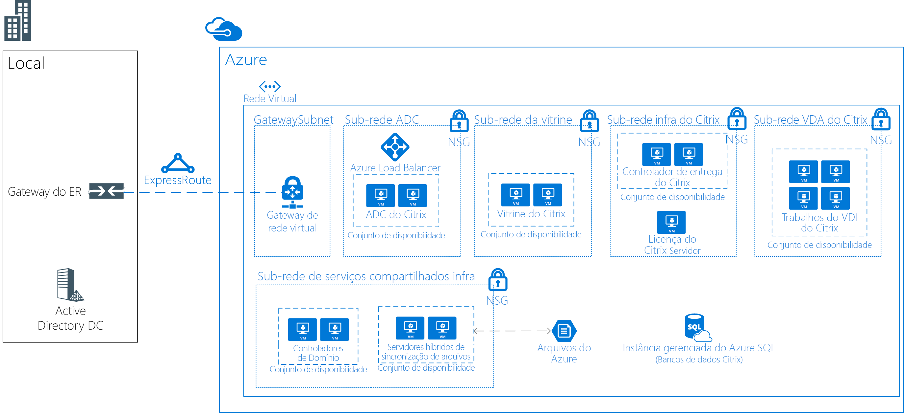

# Áreas de trabalho virtuais do Linux com o Citrix

Nesse cenário de exemplo é aplicável a qualquer setor que precisa de uma VDI (Virtual Desktop Infrastructure) para áreas de trabalho do Linux. A VDI se refere ao processo de execução de uma área de trabalho do usuário em uma máquina virtual que reside em um servidor no datacenter. Nesse cenário, o cliente opta por usar uma solução baseada em Citrix para suas necessidades de VDI.

As organizações geralmente têm ambientes heterogêneos com vários dispositivos e sistemas operacionais que são usados pelos funcionários. Pode ser um desafio fornecer acesso consistente aos aplicativos e manter um ambiente seguro. Uma solução de VDI para áreas de trabalho do Linux permitirá que sua organização forneça acesso independentemente do dispositivo ou sistema operacional usado pelo usuário final.

Alguns benefícios do cenário incluem o seguinte:

- O retorno do investimento será maior com áreas de trabalho virtuais compartilhadas do Linux proporcionando o acesso a mais usuários na mesma infraestrutura. Ao consolidar recursos em um ambiente de VDI centralizada, os dispositivos de usuários finais não precisam ser tão poderosos.
- O desempenho será consistente, independentemente do dispositivo de usuário final.
- Os usuários podem acessar os aplicativos do Linux de qualquer dispositivo (incluindo dispositivos não Linux).
- Dados confidenciais podem ser protegidos no data center do Azure para todos os funcionários distribuídos.

## Casos de uso relevantes

Considere este cenário para os casos de uso a seguir:

- Fornecer acesso seguro a áreas de trabalho essenciais e especializadas de VDI do Linux em dispositivos Linux ou não Linux

## Arquitetura

Esse cenário de exemplo demonstra como permitir que a rede corporativa acesse as Áreas de trabalho virtual do Linux:

- Um ExpressRoute é estabelecido entre o ambiente local e o Azure para obter uma conectividade rápida e confiável com a nuvem.
- A solução Citrix XenDeskop implantada para VDI.
- Execute o CitrixVDA no Ubuntu (ou outra distribuição com suporte).
- Os Grupos de Segurança de Rede do Azure serão aplicados as ACLs de rede corretas.
- O Citrix ADC (NetScaler) publicará e fará o balanceamento de carga de todos os serviços da Citrix.
- Os Serviços de Domínio do Active Directory será usado para ingresso no domínio nos servidores Citrix. Os servidores VDA não serão ingressados no domínio.
- A Sincronização de Arquivos Híbridos do Azure permite o armazenamento compartilhado na solução. Por exemplo, ele pode ser usado em soluções remotas/locais.

Nesse cenário, são usados os seguintes SKUs:

- Citrix ADC (NetScaler): 2 x D4sv3 com [imagem NetScaler 12.0 VPX Standard Edition 200 MBPS PAYG](https://azuremarketplace.microsoft.com/pt-br/marketplace/apps/citrix.netscalervpx-120?tab=PlansAndPrice)
- Servidor de licença do Citrix: 1 x D2s v3
- Citrix VDA: 4 x D8s v3
- Citrix Storefront: 2 x D2s v3
- Citrix Delivery Controller: 2 x D2s v3
- Controladores de domínio: 2 x D2sv3
- Servidores de Arquivo do Azure: 2 x D2sv3

> [!NOTE]
> Todas as licenças (além do NetScaler) são BYOL (traga sua própria licença)

### Componentes

- A [Rede Virtual do Azure](/azure/virtual-network/virtual-networks-overview) permite que recursos, como VMs se comuniquem de forma segura com a Internet, com as redes locais e com outras VMs. Redes virtuais fornecem isolamento e segmentação, filtram e roteiam o tráfego e permitem a conexão entre locais. Uma rede virtual será usada para todos os recursos neste cenário.
- Os [Grupos de segurança de rede do Azure](/azure/virtual-network/security-overview) contêm uma lista de regras de segurança que permitem ou negam o tráfego de rede de entrada ou saída com base no endereço IP de origem ou destino, na porta e no protocolo. As redes virtuais neste cenário são protegidas com regras de grupo de segurança de rede que restringem o fluxo de tráfego entre os componentes do aplicativo.
- O [balanceador de carga do Azure](/azure/application-gateway/overview) distribui o tráfego de entrada de acordo com regras e investigações de integridade. O balanceador de carga fornece baixa latência e alta taxa de transferência e pode ser escalado verticalmente em milhões de fluxos para aplicativos TCP e UDP. Um balanceador de carga interno é usado neste cenário para distribuir o tráfego na Citrix NetScaler.
- A [Sincronização de Arquivos Híbridos do Azure](https://github.com/MicrosoftDocs/azure-docs/edit/master/articles/storage/files/storage-sync-files-planning.md) será usada para todo o armazenamento compartilhado. O armazenamento será replicado para os dois servidores de arquivos usando a Sincronização de Arquivos Híbridos.
- O [Banco de Dados SQL do Azure](/azure/sql-database/sql-database-technical-overview) é um banco de dados como serviço relacional (DBaaS) baseado na versão estável mais recente do Mecanismo de Banco de Dados do Microsoft SQL Server. Ele será usado para hospedar os bancos de dados da Citrix.
- O [ExpressRoute](/azure/expressroute/expressroute-introduction) permite que você estenda suas redes locais até a nuvem da Microsoft por meio de conexão privada facilitada por um provedor de conectividade.
- [Os Serviços de Domínio do Active Directory é usado para autenticação de usuários e serviços de diretório
- Os [Conjuntos de disponibilidade do Azure](/azure/virtual-machines/windows/tutorial-availability-sets) garantem que as VMs implantadas no Azure sejam distribuídas entre vários nós de hardware isolados em um cluster. Isso garante que, se ocorrer uma falha de hardware ou de software no Azure, apenas um subconjunto de suas VMs será afetado e a solução geral permanecerá disponível e operacional.
- O [Citrix ADC (NetScaler)](https://www.citrix.com/products/citrix-adc) é um controlador de entrega de aplicativo que executa análise de tráfego específico do aplicativo para distribuir, otimizar e proteger de maneira inteligente o tráfego de rede da Camada 4-Camada 7 (L4-L7) para aplicativos da Web.
- O [Citrix Storefront](https://www.citrix.com/products/citrix-virtual-apps-and-desktops/citrix-storefront.html) é uma loja de aplicativos corporativos que melhora a segurança e simplifica as implantações, oferecendo uma experiência de usuário quase nativa, moderna e incomparável no Citrix Receiver em qualquer plataforma. O StoreFront facilita o gerenciamento de ambientes multissites e de várias versões das áreas de trabalho e dos aplicativos virtuais do Citrix.
- O [Servidor de licença do Citrix](https://www.citrix.com/buy/licensing/overview.html) gerenciará as licenças para produtos Citrix.
- O [Citrix XenDesktops VDA](https://docs.citrix.com/en-us/citrix-virtual-apps-desktops-service) habilita as conexões com aplicativos e áreas de trabalho. O VDA está instalado no computador que executa os aplicativos ou nas áreas de trabalho virtuais do usuário. Ele permite que as máquinas se registrem com Controladores de entrega e gerenciem a conexão HDX (High Definition eXperience) a um dispositivo de usuário.
- O [Citrix Delivery Controller](https://docs.citrix.com/en-us/xenapp-and-xendesktop/7-15-ltsr/manage-deployment/delivery-controllers) é o componente do lado do servidor responsável por gerenciar o acesso de usuário, além de intermediar e otimizar as conexões. Os controladores também fornecem os Serviços de criação de máquina que criar imagens de servidor e de área de trabalho.

### Alternativas

- Há vários parceiros com soluções de VDI compatíveis com o Azure, como o VMware, Workspot e outros. Essa arquitetura de exemplo específicos baseia-se em um projeto implantado que usou Citrix.
- O Citrix fornece um serviço de nuvem que abstrai parte dessa arquitetura. Pode ser uma alternativa para essa solução. Para obter mais informações, confira [Nuvem Citrix](https://www.citrix.com/products/citrix-cloud).

## Considerações

- Verifique os [Requisitos do Linux do Citrix](https://docs.citrix.com/en-us/linux-virtual-delivery-agent/current-release/system-requirements).
- A latência pode ter impacto na solução geral. Para um ambiente de produção, teste adequadamente.
- Dependendo do cenário, a solução pode precisar VMs com GPUs para VDA. Para esta solução, supõe-se que a GPU não é um requisito.

### Disponibilidade, escalabilidade e segurança

- Esta solução de exemplo é projetada para fornecer alta disponibilidade a todas as funções, exceto para o servidor de licenciamento. Como o ambiente continua a funcionar durante um período de cortesia de 30 dias, se o servidor de licença estiver offline, nenhuma redundância adicional é necessária nesse servidor.
- Todos os servidores que fornecem funções semelhantes devem ser implantados nos [Conjuntos de Disponibilidade](/azure/virtual-machines/windows/manage-availability#configure-multiple-virtual-machines-in-an-availability-set-for-redundancy).
- Este cenário de exemplo não inclui recursos de Recuperação de Desastre. O [Azure Site Recovery](/azure/site-recovery/site-recovery-overview) poderia ser um bom complemento para esse projeto.
- Considere implantar instâncias de VM neste cenário entre [Zonas de Disponibilidade](/azure/availability-zones/az-overview). Cada zona de disponibilidade é composta de um ou mais datacenters equipados com energia, resfriamento e rede independentes. Cada região habilitada tem, no mínimo, três zonas de disponibilidade. Essa distribuição de instâncias de VM em zonas fornece alta disponibilidade para as camadas de aplicativo. Para obter mais informações, consulte [O que são Zonas de Disponibilidade no Azure?](/azure/availability-zones/az-overview) Você também pode [implantar Gateways de VPN e de ExpressRoute nas Zonas de Disponibilidade do Azure](/azure/vpn-gateway/about-zone-redundant-vnet-gateways).
- Para uma solução de gerenciamento de implantação de produção deve ser implementada como [backup](/azure/backup/backup-introduction-to-azure-backup), [monitoramento](/azure/monitoring-and-diagnostics/monitoring-overview) e [gerenciamento de atualizações](/azure/automation/automation-update-management).
- Esta solução de exemplo deve funcionar com aproximadamente 250 usuários simultâneos (aproximadamente 50 a 60 por servidor VDA) com uso misto. Mas isso dependerá muito dos tipos de aplicativos que estão sendo usados. Para uso em produção, um rigoroso teste de carga deve ser executado.

## Implantação

Para saber mais sobre implantação, confira a [documentação oficial do Citrix](https://docs.citrix.com/en-us/citrix-virtual-apps-desktops/install-configure.html).

## Preços

- As licenças do Citrix XenDesktop não estão incluídas nas tarifas de serviço do Azure.
- A licença do Citrix NetScaler está incluída em um modelo de pagamento conforme o uso.
- Usar as instâncias reservadas reduzirá significativamente o custo de computação para a solução.
- O custo de ExpressRoute não está incluído.

## Próximas etapas

- Verifique a documentação de planejamento e implantação do Citrix [aqui](https://docs.citrix.com/en-us/citrix-virtual-apps-desktops/install-configure).
- Para implantar o Citrix ADC (NetScaler) no Azure, examine os modelos de Gerenciador de Recursos fornecidos pela Citrix [aqui](https://github.com/citrix/netscaler-azure-templates).
