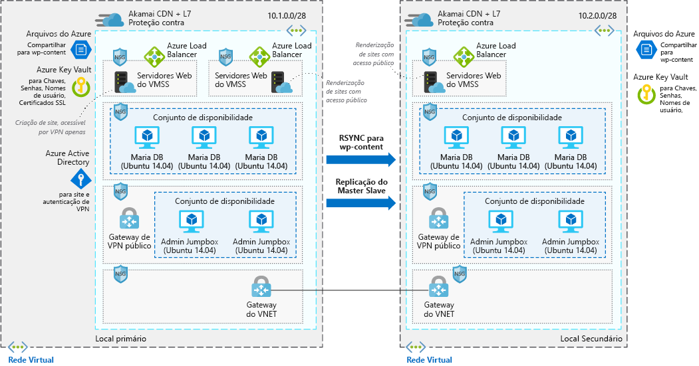

# Site altamente escalonável e seguro do WordPress

Este cenário de exemplo se aplica a empresas que precisam de instalações do WordPress altamente seguras e escalonáveis. O cenário se baseia em uma implantação usada para uma grande convenção e que foi capaz de dimensionar com sucesso para atender o pico de tráfego que as sessões geravam para o site.

## Casos de uso relevantes

Outros casos de uso relevantes incluem:

- Eventos de mídia que causam aumento no tráfego.
- Blogs que usam o WordPress como sistema de gestão de conteúdo.
- Sites de comércio eletrônico ou de negócios que usam o WordPress.
- Sites da Web criados usando outros sistemas de gestão de conteúdo.

## Arquitetura

Este cenário aborda uma instalação segura e escalonável do WordPress que usa servidores Web Ubuntu e MariaDB. Existem dois fluxos de dados distintos nesse cenário, sendo o primeiro o acesso ao site pelos usuários:

1. Os usuários acessam o site front-end por meio de uma Rede de Distribuição de Conteúdo (CDN).
2. A CDN usa um balanceador de carga do Azure como origem e efetua pull de todos os dados que não estejam armazenados em cache a partir daí.
3. O balanceador de carga do Azure distribui as solicitações para os conjuntos de dimensionamento de máquinas virtuais dos servidores Web.
4. O aplicativo do WordPress efetua pull de todas as informações dinâmicas dos clusters Maria DB e todo o conteúdo estático é hospedado em arquivos do Azure.
5. As chaves SSL ficam armazenadas no Azure Key Vault.

O segundo fluxo de trabalho diz respeito a como os autores contribuem com novos conteúdos:

1. Os autores se conectam de forma segura ao gateway público de VPN.
2. As informações de autenticação na VPN são armazenadas no Azure Active Directory.
3. Uma conexão é estabelecida com as jumpboxes do administrador.
4. Na jumpbox do administrador, o autor pode então se conectar ao balanceador de carga do Azure para o cluster de criação.
5. O balanceador de carga do Azure distribui o tráfego para os conjuntos de dimensionamento de máquinas virtuais de servidores Web que têm acesso de gravação no cluster Maria DB.
6. O novo conteúdo estático é carregado nos arquivos do Azure e o conteúdo dinâmico é gravado no cluster Maria DB.
7. Essas alterações são replicadas para a região alternativa por meio de rsync ou replicação mestre/subordinado.

### Componentes

- A [Rede de Distribuição de Conteúdo (CDN)](/azure/cdn/cdn-overview) é uma rede distribuída de servidores que fornece conteúdo com eficiência da Web para os usuários. As CDNs minimizam a latência armazenando conteúdos em cache nos servidores de borda em localizações de ponto de presença próximas aos usuários finais.
- As [redes virtuais](/azure/virtual-network/virtual-networks-overview) permitem que recursos como as VMs se comuniquem de forma segura com a Internet, com as redes locais e com outras VMs. Redes virtuais fornecem isolamento e segmentação, filtram e roteiam o tráfego e permitem a conexão entre locais. As duas redes são conectadas por meio do emparelhamento VNet.
- Os [grupos de segurança de rede](/azure/virtual-network/security-overview) contêm uma lista de regras de segurança que permitem ou rejeitam o tráfego de rede de entrada ou de saída com base no endereço IP de origem ou destino, na porta e no protocolo. As redes virtuais neste cenário são protegidas com regras de grupo de segurança de rede que restringem o fluxo de tráfego entre os componentes do aplicativo.
- Os [balanceadores de carga](/azure/load-balancer/load-balancer-overview) distribuem o tráfego de entrada de acordo com regras e investigações de integridade. O balanceador de carga fornece baixa latência e alta taxa de transferência e pode ser escalado verticalmente em milhões de fluxos para aplicativos TCP e UDP. Um balanceador de carga é usado neste cenário para difundir o tráfego da rede de distribuição de conteúdo para os servidores Web front-end.
- Os [conjuntos de dimensionamento de máquinas virtuais][docs-vmss] possibilitam a criação e o gerenciamento de um grupo idêntico de VMs com balanceamento de carga. O número de instâncias de VM pode aumentar ou diminuir automaticamente em resposta à demanda ou a um agendamento definido. Dois conjuntos separados de dimensionamento de máquinas virtuais são usados neste cenário: um para os servidores Web front-end que distribuem conteúdos e um para os servidores Web front-end usados para criar novos conteúdos.
- Os [Arquivos do Azure](/azure/storage/files/storage-files-introduction) fornecem um compartilhamento de arquivos na nuvem totalmente gerenciado que hospeda todo o conteúdo do WordPress neste cenário, para que todas as VMs tenham acesso aos dados.
- O [Azure Key Vault](/azure/key-vault/key-vault-overview) é usado para armazenar e controlar rigidamente o acesso a senhas, certificados e chaves.
- O [Azure Active Directory (Azure AD)](/azure/active-directory/fundamentals/active-directory-whatis) é um serviço de gerenciamento de identidades e diretórios multilocatário baseado em nuvem. Neste cenário, o Azure AD fornece serviços de autenticação para o site e os túneis de VPN.

### Alternativas

- O [SQL Server para Linux](/azure/virtual-machines/linux/sql/sql-server-linux-virtual-machines-overview) pode substituir o armazenamento de dados MariaDB.
- O [banco de dados do Azure para MySQL](/azure/mysql/overview) pode substituir o armazenamento de dados MariaDB caso você prefira uma solução totalmente gerenciada.

## Considerações

### Disponibilidade

Neste cenário, as instâncias de VM são implantadas em várias regiões, com os dados replicados entre os dois por meio de RSYNC para o conteúdo do WordPress e a replicação mestre/subordinado para os clusters MariaDB.

Para ver outros tópicos sobre disponibilidade, consulte a [lista de verificação de disponibilidade][availability] no Azure Architecture Center.

### Escalabilidade

Este cenário usa os conjuntos de dimensionamento de máquinas virtuais para os dois clusters de servidor Web front-end em cada região. Com conjuntos de dimensionamento, o número de instâncias VM que executam a camada de aplicativo front-end pode dimensionar automaticamente em resposta à demanda do cliente ou com base em um agendamento definido. Para saber mais, veja [Visão geral sobre dimensionamento automático com conjuntos de dimensionamento de máquinas virtuais][docs-vmss-autoscale].

O back-end é um cluster MariaDB no conjunto de disponibilidade. Consulte mais informações no [tutorial de cluster MariaDB][mariadb-tutorial].

Para outros tópicos de escalabilidade, confira a [lista de verificação de escalabilidade] [ scalability] no Azure Architecture Center.

### Segurança

Todo o tráfego de rede virtual para a camada de aplicativo front-end é protegido por grupos de segurança de rede. As regras limitam o fluxo de tráfego para que somente as instâncias de VM da camada de aplicativo front-end possam acessar a camada de banco de dados de back-end. Nenhum tráfego de Internet de saída é permitido da camada de banco de dados. Para reduzir a superfície de ataque, nenhuma porta de gerenciamento remoto direto fica aberta. Para saber mais, confira [Grupos de segurança de rede do Azure][docs-nsg].

Para obter orientação geral sobre como criar soluções seguras, confira a [Documentação de segurança do Azure][security].

### Resiliência

Em combinação com o uso de várias regiões, replicação de dados e conjuntos de dimensionamento de máquinas virtuais, este cenário usa balanceadores de carga do Azure. Esses componentes de rede distribuem o tráfego para as instâncias de VM conectadas e incluem as investigações de integridade que garantem que o tráfego seja distribuído apenas para VMs íntegras. Todos esses componentes de rede são administrados por meio de uma CDN. Isso torna o aplicativo e os recursos de rede resilientes a problemas que, de outra forma, interromperiam o tráfego e impactariam o acesso do usuário final.

Para obter diretrizes gerais sobre como criar cenários resilientes, confira [Projetando aplicativos resilientes para o Azure][resiliency].

## Preços

Para explorar o custo de executar esse cenário, todos os serviços são pré-configurados na calculadora de custos. Para ver como o preço seria alterado em seu caso de uso específico, altere as variáveis apropriadas de acordo com o tráfego esperado.

Fornecemos um [perfil de custo] pré-configurado [pricing] com base no diagrama de arquitetura fornecido acima. Para configurar a calculadora de preços para seu caso de uso, existem algumas considerações principais a levar em conta:

- Quanto tráfego em GB/mês você espera? A quantidade de tráfego terá o maior impacto em seu custo, pois afetará a quantidade de VMs necessárias para expor os dados no conjunto de dimensionamento de máquinas virtuais. Além disso, ela estará diretamente correlacionada com a quantidade de dados expostos por meio da CDN.
- Quanto de novos dados você vai gravar em seu site? Os novos dados gravados em seu site se correlacionam com a quantidade de dados espelhada em todas as regiões.
- Quanto do seu conteúdo é dinâmico? Quanto é estático? A variação de conteúdos dinâmicos e estáticos influencia a quantidade de dados que precisa ser recuperada da camada de banco de dados em contraposição à quantidade que será armazenada em cache na CDN.

<!-- links -->
[architecture]: ./media/architecture-secure-scalable-wordpress.png
[mariadb-tutorial]: /azure/virtual-machines/linux/classic/mariadb-mysql-cluster
[docs-vmss]: /azure/virtual-machine-scale-sets/overview
[docs-vmss-autoscale]: /azure/virtual-machine-scale-sets/virtual-machine-scale-sets-autoscale-overview
[docs-nsg]: /azure/virtual-network/security-overview
[security]: /azure/security/
[availability]: ../../checklist/availability.md
[resiliency]: /azure/architecture/resiliency/
[scalability]: /azure/architecture/checklist/scalability
[pricing]: https://azure.com/e/a8c4809dab444c1ca4870c489fbb196b
