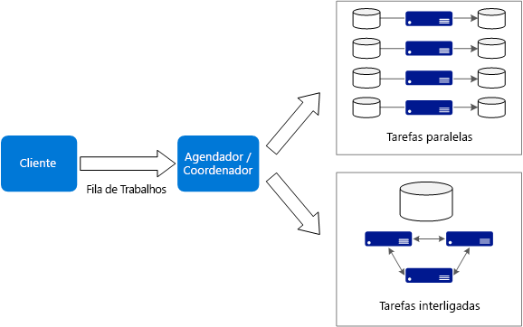
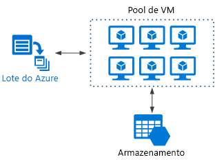

# Estilo de arquitetura de computação intensaBig compute architecture style

O termo *computação intensa* descreve as cargas de trabalho em grande escala que exigem uma grande quantidade de núcleos, geralmente centenas ou milhares deles.The term *big compute* describes large-scale workloads that require a large number of cores, often numbering in the hundreds or thousands. Entre os cenários, temos renderização de imagem, dinâmica de fluidos, modelagem de riscos financeiros, exploração de petróleo, concepção de medicamentos e análise de estresse de engenharia, entre outros.Scenarios include image rendering, fluid dynamics, financial risk modeling, oil exploration, drug design, and engineering stress analysis, among others.

Estas são algumas características comuns de aplicativos de computação intensa:Here are some typical characteristics of big compute applications:

- O trabalho pode ser dividido em tarefas discretas, as quais podem ser executadas simultaneamente em vários núcleos.The work can be split into discrete tasks, which can be run across many cores simultaneously.
- Cada tarefa é finita.Each task is finite. É preciso de alguma entrada, algum processamento é executado e se produz uma saída.It takes some input, does some processing, and produces output. O aplicativo como um todo é executado por uma quantidade finita de tempo (de minutos a dias).The entire application runs for a finite amount of time (minutes to days). Um padrão comum é provisionar uma grande quantidade de núcleos com um disparo contínuo e depois diminuir até zero assim que o aplicativo concluir.A common pattern is to provision a large number of cores in a burst, and then spin down to zero once the application completes.
- O aplicativo não precisa ficar ativo 24/7.The application does not need to stay up 24/7. No entanto, o sistema deve tratar as falhas de nó ou panes do aplicativo.However, the system must handle node failures or application crashes.
- Para alguns aplicativos, as tarefas são independentes e podem ser executados em paralelo.For some applications, tasks are independent and can run in parallel. Em outros casos, as tarefas estão firmemente acopladas, o que significa que elas devem interagir ou trocar resultados intermediários.In other cases, tasks are tightly coupled, meaning they must interact or exchange intermediate results. Nesse caso, leve em consideração o uso de tecnologias de rede de alta velocidade, como InfiniBand e RDMA (acesso remoto direto à memória).In that case, consider using high-speed networking technologies such as InfiniBand and remote direct memory access (RDMA).
- Dependendo da sua carga de trabalho, é possível usar os tamanhos de VM de computação intensiva (H16r, H16mr e A9).Depending on your workload, you might use compute-intensive VM sizes (H16r, H16mr, and A9).

## Quando usar essa arquiteturaWhen to use this architecture

- Operações computacionalmente intensivas, como simulações e processamentos de números.Computationally intensive operations such as simulation and number crunching.
- Simulações são computacionalmente intensivas e devem ser divididas entre CPUs de vários computadores (dezenas a milhares).Simulations that are computationally intensive and must be split across CPUs in multiple computers (10-1000s).
- Simulações que requerem muita memória para um computador e devem ser divididas entre vários computadores.Simulations that require too much memory for one computer, and must be split across multiple computers.
- Cálculos de longa execução que levariam muito tempo para serem concluídos em um único computador.Long-running computations that would take too long to complete on a single computer.
- Computações menores que devem ser executadas centenas ou milhares de vezes, como simulações de Monte Carlo.Smaller computations that must be run 100s or 1000s of times, such as Monte Carlo simulations.

## BenefíciosBenefits

- Alto desempenho com processamento “[embaraçosamente paralelo][embarrassingly-parallel]”.High performance with "[embarrassingly parallel][embarrassingly-parallel]" processing.
- Pode aproveitar centenas ou milhares de núcleos de computador para solucionar grandes problemas com mais rapidez.Can harness hundreds or thousands of computer cores to solve large problems faster.
- Acesso a hardware especializado de alto desempenho e com redes de alta velocidade InfiniBand dedicadas.Access to specialized high-performance hardware, with dedicated high-speed InfiniBand networks.
- Você pode provisionar quantas VMs forem necessárias para trabalhar e depois subdividi-las.You can provision VMs as needed to do work, and then tear them down.

## DesafiosChallenges

- Gerenciar a infraestrutura da VM.Managing the VM infrastructure.
- Gerenciar o volume de processamento de númerosManaging the volume of number crunching
- Provisionar milhares de núcleos em tempo hábil.Provisioning thousands of cores in a timely manner.
- Para tarefas firmemente acopladas, a adição de mais núcleos pode levar à diminuição de retornos.For tightly coupled tasks, adding more cores can have diminishing returns. Talvez seja preciso fazer experimentos para encontrar a quantidade ideal de núcleos.You may need to experiment to find the optimum number of cores.

## Computação intensa usando o Lote do AzureBig compute using Azure Batch

O [Lote do Azure][batch] é um serviço gerenciado para execução de aplicativos HPC (computação de alto desempenho) em grande escala.[Azure Batch][batch] is a managed service for running large-scale high-performance computing (HPC) applications.

Ao usar o Lote do Azure, você configura um pool de VMs e carrega os aplicativos e os arquivos de dados.Using Azure Batch, you configure a VM pool, and upload the applications and data files. Depois o serviço do Lote provisiona as VMs, atribui tarefas às VMs, executa as tarefas e monitora o progresso.Then the Batch service provisions the VMs, assign tasks to the VMs, runs the tasks, and monitors the progress. O Lote pode se escalar horizontal e automaticamente as VMs em resposta à carga de trabalho.Batch can automatically scale out the VMs in response to the workload. O Lote também fornece o agendamento de trabalho.Batch also provides job scheduling.

## Computação intensa em execução em Máquinas VirtuaisBig compute running on Virtual Machines

Você pode usar [Microsoft HPC Pack][hpc-pack] para administrar um cluster de VMs, além de agendar e monitorar trabalhos de HPC.You can use [Microsoft HPC Pack][hpc-pack] to administer a cluster of VMs, and schedule and monitor HPC jobs. Com essa abordagem, é preciso provisionar e gerenciar a infraestrutura das VMs e da rede.With this approach, you must provision and manage the VMs and network infrastructure. Leve essa abordagem em consideração se você tiver cargas de trabalho de HPC existentes e quiser mover algumas ou todas elas para o Azure.Consider this approach if you have existing HPC workloads and want to move some or all it to Azure. É possível mover todo o cluster de HPC para o Azure ou manter o cluster de HPC local, mas usar o Azure para a capacidade de disparo contínuo.You can move the entire HPC cluster to Azure, or keep your HPC cluster on-premises but use Azure for burst capacity. Para obter mais informações, confira [Soluções HPC e Lote para cargas de trabalho de computação em larga escala][batch-hpc-solutions].For more information, see [Batch and HPC solutions for large-scale computing workloads][batch-hpc-solutions].

### HPC Pack implantado no AzureHPC Pack deployed to Azure

Nesse cenário, o cluster de HPC é criado inteiramente dentro do Azure.In this scenario, the HPC cluster is created entirely within Azure.

O nó principal fornece os serviços de gerenciamento e de agendamento de trabalho para o cluster.The head node provides management and job scheduling services to the cluster. Para tarefas firmemente acopladas, use uma rede de RDMA que forneça comunicação entre máquinas virtuais com largura de banda muito alta e baixa latência.For tightly coupled tasks, use an RDMA network that provides very high bandwidth, low latency communication between VMs. Para obter mais informações, confira [Implantar um cluster de HPC Pack 2016 no Azure][deploy-hpc-azure].For more information see [Deploy an HPC Pack 2016 cluster in Azure][deploy-hpc-azure].

### Fazer disparo contínuo de um cluster HPC para o AzureBurst an HPC cluster to Azure

Nesse cenário, uma organização está executando o HPC Pack local e usa as VMs do Azure para a capacidade de disparo.In this scenario, an organization is running HPC Pack on-premises, and uses Azure VMs for burst capacity. O nó principal do cluster é local.The cluster head node is on-premises. O ExpressRoute ou Gateway de VPN conecta rede local à VNet do Azure.ExpressRoute or VPN Gateway connects the on-premises network to the Azure VNet.

<!-- links -->

[batch]: /azure/batch/
[batch-hpc-solutions]: /azure/batch/batch-hpc-solutions
[deploy-hpc-azure]: /azure/virtual-machines/windows/hpcpack-2016-cluster
[embarrassingly-parallel]: https://en.wikipedia.org/wiki/Embarrassingly_parallel
[hpc-pack]: https://technet.microsoft.com/library/cc514029
