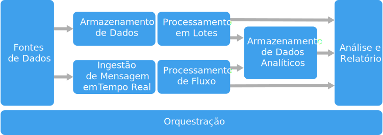

# Estilo de arquitetura de Big DataBig data architecture style

Uma arquitetura de Big Data foi projetada para lidar com ingestão, processamento e análise de dados grandes ou complexos demais para sistemas de banco de dados tradicionais.A big data architecture is designed to handle the ingestion, processing, and analysis of data that is too large or complex for traditional database systems.

Soluções de Big Data normalmente envolvem um ou mais dos seguintes tipos de carga de trabalho:Big data solutions typically involve one or more of the following types of workload:

- Processamento em lote de fontes Big Data em repouso.Batch processing of big data sources at rest.
- Processamento em tempo real de Big Data em movimento.Real-time processing of big data in motion.
- Exploração interativa de Big Data.Interactive exploration of big data.
- Análise preditiva e machine learning.Predictive analytics and machine learning.

A maioria das arquiteturas de Big Data inclui alguns ou todos os seguintes componentes:Most big data architectures include some or all of the following components:

- **Fontes de dados**: Todas as soluções de Big Data começam com uma ou mais fontes de dados.**Data sources**: All big data solutions start with one or more data sources. Os exemplos incluem:Examples include:

  - Armazenamentos de dados de aplicativo, como bancos de dados relacionais.Application data stores, such as relational databases.
  - Arquivos estáticos produzidos por aplicativos, como arquivos de log do servidor Web.Static files produced by applications, such as web server log files.
  - Fontes de dados em tempo real, como dispositivos IoT.Real-time data sources, such as IoT devices.

- **Repositório de dados**: Os dados de operações de processamento em lotes normalmente são armazenados em um repositório de arquivos distribuído que pode conter amplos volumes de arquivos grandes em vários formatos.**Data storage**: Data for batch processing operations is typically stored in a distributed file store that can hold high volumes of large files in various formats. Esse tipo de repositório geralmente é chamado *data lake*.This kind of store is often called a *data lake*. As opções para implementar esse armazenamento incluem contêineres de blobs ou Azure Data Lake Store no Armazenamento do Azure.Options for implementing this storage include Azure Data Lake Store or blob containers in Azure Storage.

- **Processamento em lotes**: Como os conjuntos de dados são muito grandes, geralmente, uma solução de Big Data precisa processar arquivos de dados usando trabalhos em lotes de execução longa para filtrar, agregar e, de outro modo, preparar os dados para análise.**Batch processing**: Because the data sets are so large, often a big data solution must process data files using long-running batch jobs to filter, aggregate, and otherwise prepare the data for analysis. Normalmente, esses trabalhos envolvem ler arquivos de origem, processá-los e gravar a saída para novos arquivos.Usually these jobs involve reading source files, processing them, and writing the output to new files. Opções incluem executar trabalhos de U-SQL no Azure Data Lake Analytics, usar trabalhos Hive, Pig ou de Mapear/Reduzir personalizados em um cluster HDInsight Hadoop ou usar programas de Java, Scala ou Python em um cluster HDInsight Spark.Options include running U-SQL jobs in Azure Data Lake Analytics, using Hive, Pig, or custom Map/Reduce jobs in an HDInsight Hadoop cluster, or using Java, Scala, or Python programs in an HDInsight Spark cluster.

- **Ingestão de mensagens em tempo real**: Se a solução inclui fontes em tempo real, a arquitetura precisa incluir uma maneira de capturar e armazenar mensagens em tempo real para processamento de fluxo.**Real-time message ingestion**: If the solution includes real-time sources, the architecture must include a way to capture and store real-time messages for stream processing. Isso pode ser um armazenamento de dados simples, em que as mensagens de entrada são removidas para uma pasta para processamento.This might be a simple data store, where incoming messages are dropped into a folder for processing. No entanto, muitas soluções precisam de um repositório de ingestão de mensagens para atuar como buffer de mensagens e dar suporte a processamento de expansão, entrega confiável e outras semânticas de enfileiramento de mensagem.However, many solutions need a message ingestion store to act as a buffer for messages, and to support scale-out processing, reliable delivery, and other message queuing semantics. Opções incluem Hubs de Eventos do Azure, Hubs de IoT do Azure e Kafka.Options include Azure Event Hubs, Azure IoT Hubs, and Kafka.

- **Processamento de fluxo**: Depois de capturar mensagens em tempo real, a solução precisa processá-las filtrando, agregando e preparando os dados para análise.**Stream processing**: After capturing real-time messages, the solution must process them by filtering, aggregating, and otherwise preparing the data for analysis. Os dados de fluxo processados são gravados em um coletor de saída.The processed stream data is then written to an output sink. O Azure Stream Analytics oferece um serviço de processamento de fluxo gerenciado baseado em consultas SQL em execução perpétua que operam em fluxos não associados.Azure Stream Analytics provides a managed stream processing service based on perpetually running SQL queries that operate on unbounded streams. Você também pode usar tecnologias de streaming Apache de software livre, como Storm e Spark Streaming em um cluster HDInsight.You can also use open source Apache streaming technologies like Storm and Spark Streaming in an HDInsight cluster.

- **Armazenamento de dados analíticos**: Muitas soluções de Big Data preparam dados para análise e então fornecem os dados processados em um formato estruturado que pode ser consultado com ferramentas analíticas.**Analytical data store**: Many big data solutions prepare data for analysis and then serve the processed data in a structured format that can be queried using analytical tools. O armazenamento de dados analíticos usado para atender a essas consultas pode ser um data warehouse relacional estilo Kimball, como visto na maioria das soluções de BI (business intelligence) tradicionais.The analytical data store used to serve these queries can be a Kimball-style relational data warehouse, as seen in most traditional business intelligence (BI) solutions. Como alternativa, os dados podem ser apresentados por meio de uma tecnologia NoSQL de baixa latência, como HBase ou um banco de dados Hive interativo que oferece uma abstração de metadados sobre arquivos de dados no armazenamento de dados distribuído.Alternatively, the data could be presented through a low-latency NoSQL technology such as HBase, or an interactive Hive database that provides a metadata abstraction over data files in the distributed data store. O SQL Data Warehouse do Azure fornece um serviço gerenciado para armazenamento de dados em larga escala baseado em nuvem.Azure SQL Data Warehouse provides a managed service for large-scale, cloud-based data warehousing. O HDInsight dá suporte a Hive interativo, HBase e Spark SQL, que também pode ser usado para veicular dados para análise.HDInsight supports Interactive Hive, HBase, and Spark SQL, which can also be used to serve data for analysis.

- **Análise e relatórios**: A meta da maioria das soluções de Big Data é gerar insights sobre os dados por meio de análise e relatórios.**Analysis and reporting**: The goal of most big data solutions is to provide insights into the data through analysis and reporting. Para capacitar os usuários a analisar os dados, a arquitetura pode incluir uma camada de modelagem de dados, como um cubo OLAP multidimensional ou um modelo de dados tabular no Azure Analysis Services.To empower users to analyze the data, the architecture may include a data modeling layer, such as a multidimensional OLAP cube or tabular data model in Azure Analysis Services. Também pode dar suporte a business intelligence de autoatendimento, usando as tecnologias de modelagem e visualização do Microsoft Power BI ou do Microsoft Excel.It might also support self-service BI, using the modeling and visualization technologies in Microsoft Power BI or Microsoft Excel. Análise e relatórios também podem assumir a forma de exploração de dados interativos por cientistas de dados ou analistas de dados.Analysis and reporting can also take the form of interactive data exploration by data scientists or data analysts. Para esses cenários, muitos serviços do Azure dão suporte a blocos de anotações analíticos, como Jupyter, permitindo que esses usuários aproveitem suas habilidades existentes com Python ou R. Para exploração de dados em larga escala, você pode usar o Microsoft R Server, seja no modo autônomo ou com Spark.For these scenarios, many Azure services support analytical notebooks, such as Jupyter, enabling these users to leverage their existing skills with Python or R. For large-scale data exploration, you can use Microsoft R Server, either standalone or with Spark.

- **Orquestração**: A maioria das soluções de Big Data consiste em operações de processamento de dados repetidas, encapsuladas em fluxos de trabalho, que transformam dados de origem, movem dados entre várias origens e coletores, carregam os dados processados em um armazenamento de dados analíticos ou enviam os resultados por push diretamente para um relatório ou painel.**Orchestration**: Most big data solutions consist of repeated data processing operations, encapsulated in workflows, that transform source data, move data between multiple sources and sinks, load the processed data into an analytical data store, or push the results straight to a report or dashboard. Para automatizar esses fluxos de trabalho, você pode usar uma tecnologia de orquestração, como Azure Data Factory ou Apache Oozie e Sqoop.To automate these workflows, you can use an orchestration technology such Azure Data Factory or Apache Oozie and Sqoop.

O Azure inclui muitos serviços que podem ser usados em uma arquitetura de Big Data.Azure includes many services that can be used in a big data architecture. Eles se enquadram em aproximadamente duas categorias:They fall roughly into two categories:

- Serviços gerenciados, incluindo Azure Data Lake Store, Azure Data Lake Analytics, Data Warehouse do Azure, Azure Stream Analytics, Hub de Eventos do Azure, Hub IoT do Azure e Azure Data Factory.Managed services, including Azure Data Lake Store, Azure Data Lake Analytics, Azure Data Warehouse, Azure Stream Analytics, Azure Event Hub, Azure IoT Hub, and Azure Data Factory.
- Tecnologias de software livre baseadas na plataforma Apache Hadoop, incluindo HDFS, HBase, Hive, Pig, Spark, Storm, Oozie, Sqoop e Kafka.Open source technologies based on the Apache Hadoop platform, including HDFS, HBase, Hive, Pig, Spark, Storm, Oozie, Sqoop, and Kafka. Essas tecnologias estão disponíveis no Azure no serviço Azure HDInsight.These technologies are available on Azure in the Azure HDInsight service.

Essas opções não se excluem mutuamente e muitas soluções combinam tecnologias de software livre com serviços do Azure.These options are not mutually exclusive, and many solutions combine open source technologies with Azure services.

## Quando usar esta arquiteturaWhen to use this architecture

Considere este estilo de arquitetura quando você precisar:Consider this architecture style when you need to:

- Armazenar e processar dados em volumes muito grandes para um banco de dados tradicional.Store and process data in volumes too large for a traditional database.
- Transformar dados não estruturados para análise e relatório.Transform unstructured data for analysis and reporting.
- Capturar, processar e analisar fluxos não associados de dados em tempo real ou com baixa latência.Capture, process, and analyze unbounded streams of data in real time, or with low latency.
- Usar Azure Machine Learning ou Serviços Cognitivos da Microsoft.Use Azure Machine Learning or Microsoft Cognitive Services.

## BenefíciosBenefits

- **Opções de tecnologia**.**Technology choices**. Você pode combinar gerenciados serviços do Azure e tecnologias Apache em clusters HDInsight para aproveitar recursos ou investimentos em tecnologia existentes.You can mix and match Azure managed services and Apache technologies in HDInsight clusters, to capitalize on existing skills or technology investments.
- **Desempenho por meio de paralelismo**.**Performance through parallelism**. Soluções de Big Data aproveitam paralelismo, possibilitando soluções de alto desempenho dimensionadas para grandes volumes de dados.Big data solutions take advantage of parallelism, enabling high-performance solutions that scale to large volumes of data.
- **Escala elástica**.**Elastic scale**. Todos os componentes da arquitetura de Big Data dão suporte a provisionamento de expansão para que você possa ajustar sua solução para cargas de trabalho grandes ou pequenas e pagar somente pelos recursos que usa.All of the components in the big data architecture support scale-out provisioning, so that you can adjust your solution to small or large workloads, and pay only for the resources that you use.
- **Interoperabilidade com soluções existentes**.**Interoperability with existing solutions**. Os componentes da arquitetura de Big Data também são usados para processamento IoT e soluções de BI empresariais, permitindo que você crie uma solução integrada entre cargas de trabalho de dados.The components of the big data architecture are also used for IoT processing and enterprise BI solutions, enabling you to create an integrated solution across data workloads.

## DesafiosChallenges

- **Complexidade**.**Complexity**. Soluções de Big Data podem ser extremamente complexas, com vários componentes para lidar com a ingestão de dados de várias fontes de dados.Big data solutions can be extremely complex, with numerous components to handle data ingestion from multiple data sources. Pode ser um desafio criar, testar e solucionar problemas de processos de Big Data.It can be challenging to build, test, and troubleshoot big data processes. Além disso, pode haver um grande número de definições de configuração em vários sistemas que devem ser usados para otimizar o desempenho.Moreover, there may be a large number of configuration settings across multiple systems that must be used in order to optimize performance.
- **Conjunto de qualificações**.**Skillset**. Muitas tecnologias de Big Data são altamente especializadas e usam frameworks e idiomas que não são típicos de arquiteturas de aplicativo mais gerais.Many big data technologies are highly specialized, and use frameworks and languages that are not typical of more general application architectures. Por outro lado, as tecnologias de Big Data estão gerando novas APIs que se baseiam em linguagens mais estabelecidas.On the other hand, big data technologies are evolving new APIs that build on more established languages. Por exemplo, a linguagem U-SQL no Azure Data Lake Analytics baseia-se em uma combinação de Transact-SQL e C#.For example, the U-SQL language in Azure Data Lake Analytics is based on a combination of Transact-SQL and C#. Da mesma forma, APIs com base em SQL estão disponíveis para Hive, HBase e Spark.Similarly, SQL-based APIs are available for Hive, HBase, and Spark.
- **Maturidade da tecnologia**.**Technology maturity**. Muitas das tecnologias usadas em Big Data estão em evolução.Many of the technologies used in big data are evolving. Embora tecnologias Hadoop centrais, como Hive e Pig, tenham se estabilizado, tecnologias emergentes, como Spark, apresentam grandes alterações e aprimoramentos a cada nova versão.While core Hadoop technologies such as Hive and Pig have stabilized, emerging technologies such as Spark introduce extensive changes and enhancements with each new release. Serviços gerenciados, como Azure Data Lake Analytics e Azure Data Factory, são relativamente jovens em comparação a outros serviços do Azure e provavelmente evoluirão ao longo do tempo.Managed services such as Azure Data Lake Analytics and Azure Data Factory are relatively young, compared with other Azure services, and will likely evolve over time.
- **Segurança**.**Security**. Soluções de Big Data normalmente se baseiam em armazenar todos os dados estáticos em um data lake centralizado.Big data solutions usually rely on storing all static data in a centralized data lake. Proteger o acesso a esses dados pode ser desafiador, especialmente quando os dados devem ser ingeridos e consumidos por vários aplicativos e plataformas.Securing access to this data can be challenging, especially when the data must be ingested and consumed by multiple applications and platforms.

## Práticas recomendadasBest practices

- **Aproveitar o paralelismo**.**Leverage parallelism**. A maioria das tecnologias de processamento de Big Data distribui a carga de trabalho em várias unidades de processamento.Most big data processing technologies distribute the workload across multiple processing units. Isso exige que os arquivos de dados estáticos sejam criados e armazenados em um formato divisível.This requires that static data files are created and stored in a splittable format. Sistemas de arquivos distribuídos, como HDFS, podem otimizar o desempenho de leitura e gravação, e o processamento real é executado por vários nós de cluster em paralelo, o que reduz o tempo de trabalho geral.Distributed file systems such as HDFS can optimize read and write performance, and the actual processing is performed by multiple cluster nodes in parallel, which reduces overall job times.

- **Dados de partição**.**Partition data**. Geralmente, o processamento de lote ocorre conforme uma agenda recorrente &mdash; por exemplo, semanal ou mensal.Batch processing usually happens on a recurring schedule &mdash; for example, weekly or monthly. Arquivos de dados de partição e estruturas de dados como tabelas, com base em períodos de temporais que correspondem à agenda de processamento.Partition data files, and data structures such as tables, based on temporal periods that match the processing schedule. Isso simplifica a ingestão de dados e o agendamento de trabalho, além de tornar mais fácil solucionar problemas de falhas.That simplifies data ingestion and job scheduling, and makes it easier to troubleshoot failures. Além disso, o particionamento de tabelas usadas em consultas Hive, U-SQL ou SQL pode melhorar significativamente o desempenho da consulta.Also, partitioning tables that are used in Hive, U-SQL, or SQL queries can significantly improve query performance.

- **Aplicar semântica de esquema na leitura**.**Apply schema-on-read semantics**. Usar um data lake permite combinar o armazenamento de arquivos em vários formatos, sejam estruturados, semiestruturados ou não estruturados.Using a data lake lets you to combine storage for files in multiple formats, whether structured, semi-structured, or unstructured. Use semântica de *esquema na leitura*, que projeta um esquema nos dados quando os dados estão sendo processados, não quando estão armazenados.Use *schema-on-read* semantics, which project a schema onto the data when the data is processing, not when the data is stored. Isso integra flexibilidade à solução e evita gargalos durante a ingestão de dados causados pela verificação de tipo e a validação de dados.This builds flexibility into the solution, and prevents bottlenecks during data ingestion caused by data validation and type checking.

- **Processar dados no local**.**Process data in-place**. Soluções de BI tradicionais geralmente usam um processo ETL (extração, transformação e carregamento) para mover dados para um data warehouse.Traditional BI solutions often use an extract, transform, and load (ETL) process to move data into a data warehouse. Com maiores volumes de dados e uma maior variedade de formatos, soluções de Big Data geralmente usam variações de ETL, como TEL (transformação, extração e carregamento).With larger volumes data, and a greater variety of formats, big data solutions generally use variations of ETL, such as transform, extract, and load (TEL). Com essa abordagem, os dados são processados no armazenamento de dados distribuídos, transformando-os na estrutura necessária, antes de mover os dados transformados para um armazenamento de dados analíticos.With this approach, the data is processed within the distributed data store, transforming it to the required structure, before moving the transformed data into an analytical data store.

- **Equilibrar custos de tempo e utilização**.**Balance utilization and time costs**. Para trabalhos de processamento em lotes, é importante considerar dois fatores: o custo unitário de nós de computação e o custo por minuto de usar esses nós para concluir o trabalho.For batch processing jobs, it's important to consider two factors: The per-unit cost of the compute nodes, and the per-minute cost of using those nodes to complete the job. Por exemplo, um trabalho em lotes pode levar oito horas com quatro nós de cluster.For example, a batch job may take eight hours with four cluster nodes. No entanto, pode ser que o trabalho use todos os quatro nós somente durante as primeiras duas horas, sendo apenas dois nós necessários depois disso.However, it might turn out that the job uses all four nodes only during the first two hours, and after that, only two nodes are required. Nesse caso, executar todo o trabalho em dois nós aumentaria o tempo total do trabalho, mas não o duplicaria, de modo que o custo total seria menor.In that case, running the entire job on two nodes would increase the total job time, but would not double it, so the total cost would be less. Em alguns cenários de negócios, mais tempo de processamento pode ser preferível ao custo mais alto de usar recursos de cluster subutilizados.In some business scenarios, a longer processing time may be preferable to the higher cost of using under-utilized cluster resources.

- **Separar os recursos de cluster**.**Separate cluster resources**. Ao implantar clusters HDInsight, você normalmente alcança um melhor desempenho provisionando recursos de cluster separados para cada tipo de carga de trabalho.When deploying HDInsight clusters, you will normally achieve better performance by provisioning separate cluster resources for each type of workload. Por exemplo, embora clusters do Spark incluam Hive, se você precisar executar amplo processamento com Hive e Spark, deverá considerar implantar clusters Spark e Hadoop dedicados separados.For example, although Spark clusters include Hive, if you need to perform extensive processing with both Hive and Spark, you should consider deploying separate dedicated Spark and Hadoop clusters. Da mesma forma, se você estiver usando HBase e Storm para processamento de fluxo de baixa latência e Hive para processamento em lotes, considere clusters separados para Storm, HBase e Hadoop.Similarly, if you are using HBase and Storm for low latency stream processing and Hive for batch processing, consider separate clusters for Storm, HBase, and Hadoop.

- **Orquestrar a ingestão de dados**.**Orchestrate data ingestion**. Em alguns casos, aplicativos de negócios existentes podem gravar arquivos de dados para processamento em lote diretamente em contêineres do Azure Storage Blob, em que podem ser consumidos pelo HDInsight ou pelo Azure Data Lake Analytics.In some cases, existing business applications may write data files for batch processing directly into Azure storage blob containers, where they can be consumed by HDInsight or Azure Data Lake Analytics. No entanto, você geralmente precisará orquestrar a ingestão de dados de fontes de dados externas ou locais para o data lake.However, you will often need to orchestrate the ingestion of data from on-premises or external data sources into the data lake. Use um fluxo de trabalho de orquestração ou um pipeline, como aqueles compatíveis com Azure Data Factory ou Oozie, para fazer isso de maneira previsível e gerenciável centralmente.Use an orchestration workflow or pipeline, such as those supported by Azure Data Factory or Oozie, to achieve this in a predictable and centrally manageable fashion.

- **Limpar dados confidenciais cedo**.**Scrub sensitive data early**. O fluxo de trabalho de ingestão de dados deve remover dados confidenciais no início do processo para evitar armazená-los no data lake.The data ingestion workflow should scrub sensitive data early in the process, to avoid storing it in the data lake.

## Arquitetura do IoTIoT architecture

O IoT (Internet das Coisas) é um subconjunto especializado de soluções de big data.Internet of Things (IoT) is a specialized subset of big data solutions. O diagrama a seguir mostra uma possível arquitetura lógica de IoT.The following diagram shows a possible logical architecture for IoT. O diagrama enfatiza os componentes da arquitetura do streaming de eventos.The diagram emphasizes the event-streaming components of the architecture.

O **gateway de nuvem** consome eventos de dispositivo no limite da nuvem, usando um sistema de mensagens de latência baixa e confiável.The **cloud gateway** ingests device events at the cloud boundary, using a reliable, low latency messaging system.

Os dispositivos podem enviar eventos diretamente para o gateway de nuvem, ou por meio de um **gateway de campo**.Devices might send events directly to the cloud gateway, or through a **field gateway**. Um gateway de campo é um software ou dispositivo especializado, geralmente colocado com dispositivos, que recebe eventos e os encaminha para o gateway de nuvem.A field gateway is a specialized device or software, usually colocated with the devices, that receives events and forwards them to the cloud gateway. O gateway de campo também pode pré-processar os eventos de dispositivo brutos executando funções, como filtragem, agregação ou transformação de protocolo.The field gateway might also preprocess the raw device events, performing functions such as filtering, aggregation, or protocol transformation.

Após a ingestão, os eventos passam por um ou mais **processadores de fluxo** que podem encaminhar os dados (por exemplo, para armazenamento) ou executar análise e outros tipos de processamento.After ingestion, events go through one or more **stream processors** that can route the data (for example, to storage) or perform analytics and other processing.

A seguir estão alguns tipos comuns de processamento.The following are some common types of processing. (Esta lista certamente não é exaustiva.)(This list is certainly not exhaustive.)

- Gravando os dados de evento para armazenamento menos acessado, para arquivamento ou análise de processo em lote.Writing event data to cold storage, for archiving or batch analytics.

- Análise de caminho mais acessado, analisando o fluxo de eventos (quase) em tempo real, para detectar anomalias, reconhecer padrões em janelas de tempo ou disparar alertas quando ocorre uma condição específica no fluxo.Hot path analytics, analyzing the event stream in (near) real time, to detect anomalies, recognize patterns over rolling time windows, or trigger alerts when a specific condition occurs in the stream.

- Tratamento de tipos especiais de mensagens que não são de telemetria de dispositivos, como notificações e alarmes.Handling special types of non-telemetry messages from devices, such as notifications and alarms.

- Machine Learning.Machine learning.

As caixas destacadas em cinza mostram os componentes de um sistema de IoT que não estão diretamente relacionadas ao streaming de evento, mas são incluídos aqui para fins de integridade.The boxes that are shaded gray show components of an IoT system that are not directly related to event streaming, but are included here for completeness.

- O **registro do dispositivo** é um banco de dados dos dispositivos provisionados, incluindo os IDs de dispositivo e metadados do dispositivo, como localização.The **device registry** is a database of the provisioned devices, including the device IDs and usually device metadata, such as location.

- A **API de provisionamento** é uma interface externa comum para provisionar e registrar dispositivos novos.The **provisioning API** is a common external interface for provisioning and registering new devices.

- Algumas soluções IoT permitem que **mensagens de comando e controle** sejam enviadas aos dispositivos.Some IoT solutions allow **command and control messages** to be sent to devices.

> Esta seção apresentou uma exibição de altíssimo nível do IoT e há muitas sutilezas e desafios a serem considerados.This section has presented a very high-level view of IoT, and there are many subtleties and challenges to consider. Para obter mais detalhes e discussões sobre a arquitetura de referência, confira [Arquitetura de Referência do Microsoft Azure IoT][iot-ref-arch] (download do PDF).For a more detailed reference architecture and discussion, see the [Microsoft Azure IoT Reference Architecture][iot-ref-arch] (PDF download).

## Próximas etapasNext steps

- Saiba mais sobre [arquiteturas de big data](../../data-guide/big-data/index.md).Learn more about [big data architectures](../../data-guide/big-data/index.md).

 <!-- links -->

[iot-ref-arch]: https://azure.microsoft.com/updates/microsoft-azure-iot-reference-architecture-available/
