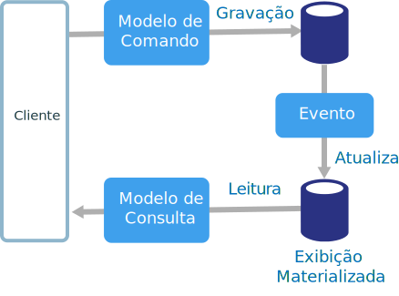
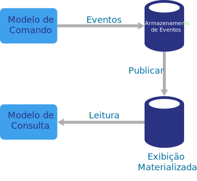

# Estilo de arquitetura CQRS

O CQRS (Command and Query Responsibility Segregation) é um estilo de arquitetura que separa operações de leitura de operações de gravação. 

Nas arquiteturas tradicionais, o mesmo modelo de dados é usado para consultar e atualizar um banco de dados. É simples e funciona bem para operações CRUD básicas. Em aplicativos mais complexos, no entanto, essa abordagem pode se tornar complicada. Por exemplo, no lado de leitura, o aplicativo pode executar muitas consultas diferentes, retornando objetos de transferência de dados (DTOs) com formas diferentes. O mapeamento de objetos pode se tornar complicado. No lado da gravação, o modelo pode implementar uma validação complexa e lógica de negócios. Como resultado, você pode terminar com um modelo excessivamente complexo que faz coisas em excesso.

Outro problema potencial é que a leitura e a gravação de cargas de trabalho geralmente são assimétricas, com diferentes requisitos de desempenho e escalabilidade. 

O CQRS trata desses problemas, separando as leituras e gravações em modelos separados, usando **comandos** para atualizar dados e **consultas** para ler dados.

- Os comandos devem ser baseados em tarefas, em vez de centrados nos dados. Os comandos ("Book hotel room," not "set ReservationStatus to Reserved.") podem ser posicionados em uma fila para processamento assíncrono, em vez de ser processado de forma síncrona.

- As consultas nunca modificam o banco de dados. Uma consulta retorna um DTO que não encapsula qualquer conhecimento de domínio.

Para maior isolamento, você pode separar fisicamente os dados de leitura de dados de gravação. Nesse caso, o banco de dados de leitura pode usar seu próprio esquema de dados, otimizado para consultas. Por exemplo, ele pode armazenar uma [exibição materializada][materialized-view] dos dados, para evitar mapeamentos de O/RM complexos ou junções complexas. Ele ainda pode usar um tipo diferente de armazenamento de dados. Por exemplo, o banco de dados de gravação pode ser relacional, enquanto o banco de dados de leitura é um banco de dados de documento.

Se os bancos de dados de leitura e gravação separados forem usados, deverão ser mantidos em sincronia. Normalmente isso é feito com o modelo de gravação um evento sempre que ele atualiza o banco de dados de publicação. A atualização do banco de dados e a publicação do evento devem ocorrer em uma única transação. 

Algumas implementações do CQRS usam o [padrão de Evento de Fornecimento][event-sourcing]. Com esse padrão, o estado do aplicativo é armazenado como uma sequência de eventos. Cada evento representa um conjunto de alterações nos dados. O estado atual foi criado pela repetição dos eventos. Em um contexto CQRS, um dos benefícios do fornecimento do evento é que os mesmos eventos podem ser usados para notificar outros componentes &mdash; em particular, para notificar o modelo de leitura. O modelo de leitura usa os eventos para criar um instantâneo do estado atual, que é mais eficiente para consultas. No entanto, o fornecimento de evento adiciona complexidade ao design.

## Quando usar essa arquitetura

Considere o CQRS para domínios colaborativos em que muitos usuários acessem os mesmos dados, especialmente quando as cargas de trabalho de leitura e gravação forem assimétricas.

O CQRS não é uma arquitetura de nível superior que se aplica ao sistema inteiro. Aplique o CQRS somente a esses subsistemas onde houver um valor claro na separação de leituras e gravações. Caso contrário, você estará criando uma complexidade adicional sem nenhum benefício.

## Benefícios

- **Dimensionamento independente**. O CQRS permite que as cargas de trabalho de leitura e gravação sejam dimensionadas de forma independente e pode resultar em menos contenções de bloqueio.
- **Esquemas de dados otimizados.**  O lado de leitura pode usar um esquema que é otimizado para consultas, enquanto o lado de gravação usa um esquema que é otimizado para atualizações.  
- **Segurança**. É mais fácil garantir que apenas as entidades do direito de domínio estejam executando gravações nos dados.
- **Separação de preocupações**. Isolar os lados de leitura e gravação pode resultar em modelos mais flexíveis e sustentáveis. A maior parte da lógica de negócios complexa vai para o modelo de gravação. O modelo de leitura pode ser relativamente simples.
- **Consultas mais simples**. Ao armazenar uma exibição materializada no banco de dados de leitura, o aplicativo poderá evitar junções complexas durante as consultas.

## Desafios

- **Complexidade**. A ideia básica do CQRS é simples. Mas isso poderá resultar em um design de aplicativo mais complexo, especialmente se eles incluírem o padrão Fornecimento de Eventos.

- **Mensagens**. Embora o CQRS não necessite de mensagens, é comum usar mensagens para comandos de processo e publicar eventos de atualização. Neste caso, o aplicativo deve tratar as falhas de mensagem ou as mensagens duplicadas. 

- **Consistência eventual**. Se você separar os bancos de dados de leitura e de gravação, os dados de leitura poderão ficar obsoletos. 

## Práticas recomendadas

- Para saber mais sobre como implementar o CQRS, veja [Padrão CQRS][cqrs-pattern].

- Considere o uso do padrão [Fornecimento de Evento][event-sourcing] para evitar conflitos de atualização.

- Considere o uso do [padrão Exibição Materializada][materialized-view] para o modelo de leitura para otimizar o esquema para consultas.

## CQRS em microsserviços

O CQRS pode ser especialmente útil em uma [arquitetura de microsserviços][microservices]. Um dos princípios de microsserviços é que um serviço não pode acessar diretamente o armazenamento de dados do outro serviço.

No diagrama a seguir, o Serviço A grava em um armazenamento de dados e o Serviço B mantém uma exibição materializada dos dados. Um serviço publica um evento sempre que ele grava no armazenamento de dados. O Serviço B assina o evento.

<!-- links -->

[cqrs-pattern]: ../../patterns/cqrs.md
[event-sourcing]: ../../patterns/event-sourcing.md
[materialized-view]: ../../patterns/materialized-view.md
[microservices]: ./microservices.md
