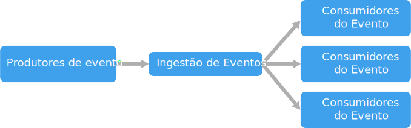

# Arquitetura orientada a eventos

Consiste em uma arquitetura orientada a eventos de **produtores de eventos** que geram um fluxo de eventos, e **consumidores dos eventos** que escutam eventos. 

Os eventos são entregues quase em tempo real, para que os consumidores possam responder imediatamente conforme os eventos ocorrem. Os produtores são separados dos consumidores &mdash;. Um produtor não sabe quais consumidores estão ouvindo. Os consumidores também são separados uns dos outros; e cada consumidor vê todos os eventos. Isso difere do padrão de [Consumidores Concorrentes][competing-consumers], onde os consumidores removem mensagens de uma fila, e uma mensagem é processada apenas uma vez (presumindo que não haja erros). Em alguns sistemas, como IoT, os eventos devem ser incluídos em volumes muito altos.

Um evento controlado por arquitetura pode usar um modelo de pub/sub ou um modelo de fluxo de evento. 

- **Pub/sub**: a infraestrutura de mensagens acompanha o controle de assinaturas. Quando um evento é publicado, ele envia o evento para cada assinante. Depois que um evento é recebido, ele não pode ser reproduzido e não será exibido para assinantes novos. 

- **Streaming de eventos**: eventos são gravados em um registro. Os eventos são estritamente ordenados (dentro de uma partição) e duráveis. Os clientes não assinam o fluxo, em vez disso, um cliente pode ler a partir de qualquer parte do fluxo. O cliente é responsável por avançar a sua posição no fluxo. Isso significa que um cliente pode participar a qualquer momento e pode reproduzir eventos.

No lado do consumidor, há algumas variações comuns:

- **Processamento de eventos simples**. Um evento dispara imediatamente uma ação no consumidor. Por exemplo, você pode usar as Azure Functions com um gatilho de Barramento de Serviço para que uma função seja executada sempre que uma mensagem é publicada em um tópico do Barramento de Serviço.

- **Processamento de eventos complexos**. Um consumidor processa uma série de eventos, procurando padrões nos dados de eventos usando uma tecnologia, como o Azure Stream Analytics ou o Apache Storm. Por exemplo, você pode agregar as leituras de um dispositivo incorporado em uma janela de tempo e gerar uma notificação se a média móvel ultrapassar um certo limite. 

- **Processamento de fluxo de eventos**. Use uma plataforma de fluxo de dados, como o Hub IoT do Azure ou o Apache Kafka, como um pipeline para ingestão de eventos e os encaminhe para os processadores de fluxo. Os processadores de fluxo agem para processar ou transformar o fluxo. Pode haver vários processadores de fluxo para subsistemas diferentes do aplicativo. Esta abordagem é uma boa opção para cargas de trabalho de IoT.

A fonte dos eventos pode ser externa ao sistema, como dispositivos físicos em uma solução de IoT. Nesse caso, o sistema deve ser capaz de receber os dados no volume e taxa de transferência necessários para a fonte de dados.

No diagrama lógico acima, cada tipo de consumidor é mostrado como uma única caixa. Na prática, é comum ter várias instâncias de um consumidor para evitar que o consumidor se torne um ponto único de falha no sistema. Também pode ser necessário ter várias instâncias para lidar com o volume e a frequência de eventos. Além disso, um único consumidor pode processar eventos em vários threads. Isso pode criar desafios se os eventos tiverem que ser processados em ordem, ou se solicitarem semânticas exatamente uma vez. Confira [Minimizar Coordenação][minimize-coordination]. 

## Quando usar essa arquitetura

- Vários subsistemas devem processar os mesmos eventos. 
- Processamento em tempo real com retardo mínimo de tempo.
- O processamento de eventos complexos, como a correspondência de padrões ou agregação em janelas de tempo.
- Alto volume e alta velocidade de dados, como IoT.

## Benefícios

- Produtores e consumidores são separados.
- Nenhuma integração de ponta a ponta. É fácil adicionar novos consumidores ao sistema.
- Os consumidores podem responder aos eventos imediatamente assim que chegarem. 
- Altamente escalonável e distribuído. 
- Os subsistemas têm exibições independentes do fluxo de evento.

## Desafios

- Entrega garantida. Em alguns sistemas, especialmente em situações de IoT, é crucial garantir que os eventos sejam entregues.
- Eventos processados em ordem ou exatamente uma vez. Normalmente, cada tipo de consumidor é executado em várias instâncias de resiliência e escalabilidade. Isso pode criar um desafio se os eventos devem ser processados em ordem (dentro de um tipo de consumidor), ou se a lógica de processamento não for idempotente.

 <!-- links -->

[competing-consumers]: ../../patterns/competing-consumers.md
[minimize-coordination]: ../design-principles/minimize-coordination.md

