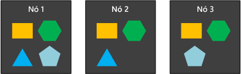
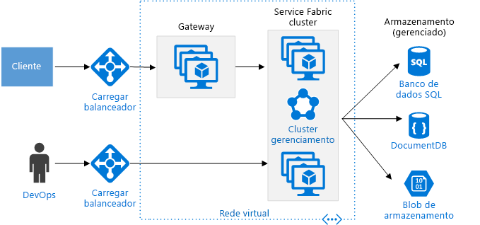

# Estilo de arquitetura de microsserviçosMicroservices architecture style

Uma arquitetura de microsserviços consiste em uma coleção de pequenos serviços autônomos.A microservices architecture consists of a collection of small, autonomous services. Cada serviço é independente e deve implementar uma única funcionalidade comercial.Each service is self-contained and should implement a single business capability. Para obter orientações detalhadas sobre como criar uma arquitetura de microsserviços no Azure, consulte [Projetar, criar e operar microsserviços no Azure](../../microservices/index.md).For detailed guidance about building a microservices architecture on Azure, see [Designing, building, and operating microservices on Azure](../../microservices/index.md).

 
Em alguns aspectos, microsserviços são a evolução natural das arquiteturas orientada a serviços (SOA), mas há diferenças entre microsserviços e SOA.In some ways, microservices are the natural evolution of service oriented architectures (SOA), but there are differences between microservices and SOA. Aqui estão algumas características que definem um microsserviço:Here are some defining characteristics of a microservice:

- Em uma arquitetura de microsserviços, os serviços são pequenos, independentes e fracamente acoplados.In a microservices architecture, services are small, independent, and loosely coupled.

- Cada serviço é uma base de código separado, que pode ser gerenciado por uma equipe de desenvolvimento pequena.Each service is a separate codebase, which can be managed by a small development team.

- Os serviços podem ser implantados de maneira independente.Services can be deployed independently. Uma equipe pode atualizar um serviço existente sem recompilar e reimplantar o aplicativo inteiro.A team can update an existing service without rebuilding and redeploying the entire application.

- Os serviços são responsáveis por manter seus próprios dados ou o estado externo.Services are responsible for persisting their own data or external state. Isso é diferente do modelo tradicional, em que uma camada de dados separada lida com a persistência de dados.This differs from the traditional model, where a separate data layer handles data persistence.

- Os serviços comunicam-se entre si por meio de APIs bem definidas.Services communicate with each other by using well-defined APIs. Detalhes da implementação interna de cada serviço ficam ocultos de outros serviços.Internal implementation details of each service are hidden from other services.

- Os serviços não precisam compartilhar a mesma pilha de tecnologia, bibliotecas ou estruturas.Services don't need to share the same technology stack, libraries, or frameworks.

Além para os próprios serviços, alguns outros componentes aparecem em uma arquitetura de microsserviços típica:Besides for the services themselves, some other components appear in a typical microservices architecture:

**Gerenciamento**.**Management**. O componente de gerenciamento é responsável por colocar serviços em nós, identificar falhas, rebalancear serviços entre nós e assim por diante.The management component is responsible for placing services on nodes, identifying failures, rebalancing services across nodes, and so forth.  

**Descoberta de Serviço**.**Service Discovery**.  Mantém uma lista de serviços e em quais nós eles estão localizados.Maintains a list of services and which nodes they are located on. Habilita a pesquisa de serviço para localizar o ponto de extremidade para um serviço.Enables service lookup to find the endpoint for a service. 

**Gateway de API**.**API Gateway**. O gateway de API é o ponto de entrada para os clientes.The API gateway is the entry point for clients. Os clientes não chamam serviços diretamente.Clients don't call services directly. Em vez disso, eles chamam o gateway de API, que encaminha a chamada para os serviços apropriados no back-end.Instead, they call the API gateway, which forwards the call to the appropriate services on the back end. O gateway de API pode agregar as respostas de vários serviços e retornar a resposta agregada.The API gateway might aggregate the responses from several services and return the aggregated response. 

As vantagens de usar um gateway de API incluem:The advantages of using an API gateway include:

- Desacoplar os clientes dos serviços.It decouples clients from services. Os serviços podem ter controle de versão ou ser refatorado sem necessidade de atualizar todos os clientes.Services can be versioned or refactored without needing to update all of the clients.

-  Os serviços podem usar protocolos de mensagens que não sejam amigáveis à Web, como AMQP.Services can use messaging protocols that are not web friendly, such as AMQP.

- O Gateway de API pode executar outras funções abrangentes, como autenticação, registro em log, terminação SSL e balanceamento de carga.The API Gateway can perform other cross-cutting functions such as authentication, logging, SSL termination, and load balancing.

## Quando usar essa arquiteturaWhen to use this architecture

Considere esse estilo de arquitetura para:Consider this architecture style for:

- Aplicativos grandes que precisem de uma alta velocidade de liberação.Large applications that require a high release velocity.

- Aplicativos complexos que precisem ser altamente dimensionável.Complex applications that need to be highly scalable.

- Aplicativos com domínios avançados ou muitos subdomínios.Applications with rich domains or many subdomains.

- Uma organização que consista em pequenas equipes de desenvolvimento.An organization that consists of small development teams.

## BenefíciosBenefits 

- **Implantações independentes**.**Independent deployments**. Você pode atualizar um serviço sem reimplantar o aplicativo inteiro e, em seguida, reverter ou efetuar roll forward de uma atualização se algo der errado.You can update a service without redeploying the entire application, and roll back or roll forward an update if something goes wrong. Correções de bugs e liberações de recurso são mais fáceis de gerenciar e menos arriscadas.Bug fixes and feature releases are more manageable and less risky.

- **Desenvolvimento independente**.**Independent development**. Uma única equipe de desenvolvimento pode criar, testar e implantar um serviço.A single development team can build, test, and deploy a service. O resultado é inovação contínua e um ritmo mais rápido de liberação.The result is continuous innovation and a faster release cadence. 

- **Equipes pequenas e focadas**.**Small, focused teams**. As equipes podem se concentrar em um serviço.Teams can focus on one service. O escopo menor de cada serviço torna a base de código mais fácil de entender e é mais fácil para novos membros da equipe fazerem a expansão.The smaller scope of each service makes the code base easier to understand, and it's easier for new team members to ramp up.

- **Isolamento de falha**.**Fault isolation**. Se um serviço falhar, ele não derrubará o aplicativo inteiro.If a service goes down, it won't take out the entire application. No entanto, isso não significa que você obtém resiliência gratuitamente.However, that doesn't mean you get resiliency for free. Você ainda precisa seguir as melhores práticas de resiliência e padrões de design.You still need to follow resiliency best practices and design patterns. Consulte [Desenvolvimento de aplicativos resilientes para o Azure][resiliency-overview].See [Designing resilient applications for Azure][resiliency-overview].

- **Pilhas de tecnologia mistas**.**Mixed technology stacks**. As equipes podem escolher a tecnologia mais adequada para seu serviço.Teams can pick the technology that best fits their service. 

- **Dimensionamento granular**.**Granular scaling**. Os serviços podem ser dimensionados de maneira independente.Services can be scaled independently. Ao mesmo tempo, a densidade mais alta de serviços por VM significa que os recursos de VM são totalmente usados.At the same time, the higher density of services per VM means that VM resources are fully utilized. Usando restrições de posicionamento, um serviço pode corresponder a um perfil de VM (alta utilização da CPU e de memória e assim por diante).Using placement constraints, a services can be matched to a VM profile (high CPU, high memory, and so on).

## DesafiosChallenges

- **Complexidade**.**Complexity**. Um aplicativo de microsserviços tem mais partes móveis que o aplicativo monolítico equivalente.A microservices application has more moving parts than the equivalent monolithic application. Cada serviço é mais simples, mas o sistema como um todo é mais complexo.Each service is simpler, but the entire system as a whole is more complex.

- **Desenvolvimento e teste**.**Development and test**. Desenvolver com relação a dependências de serviço exige uma abordagem diferente.Developing against service dependencies requires a different approach. As ferramentas existentes não são necessariamente projetadas para funcionar com dependências de serviço.Existing tools are not necessarily designed to work with service dependencies. Refatorar entre limites de serviços pode ser difícil.Refactoring across service boundaries can be difficult. Também pode ser um desafio testar as dependências de serviço, especialmente quando o aplicativo está evoluindo rapidamente.It is also challenging to test service dependencies, especially when the application is evolving quickly.

- **Falta de governança**.**Lack of governance**. A abordagem descentralizada para compilar microsserviços tem vantagens, mas também pode causar problemas.The decentralized approach to building microservices has advantages, but it can also lead to problems. Você pode acabar com muitos idiomas e estruturas diferentes que tornem difícil a manutenção do aplicativo.You may end up with so many different languages and frameworks that the application becomes hard to maintain. Pode ser útil estabelecer alguns padrões para todo o projeto, sem restringir excessivamente a flexibilidade das equipes.It may be useful to put some project-wide standards in place, without overly restricting teams' flexibility. Isso se aplica especialmente a funcionalidades abrangentes como registro em log.This especially applies to cross-cutting functionality such as logging.

- **Latência e congestionamento de rede**.**Network congestion and latency**. O uso de muitos serviços granulares pequenos pode resultar em mais comunicação entre serviços.The use of many small, granular services can result in more interservice communication. Além disso, se a cadeia de dependências de serviço ficar muito longa (o serviço A chamada o B, que chama o C…) a latência adicional poderá se tornar um problema.Also, if the chain of service dependencies gets too long (service A calls B, which calls C...), the additional latency can become a problem. Você precisará projetar APIs com cuidado.You will need to design APIs carefully. Evite APIs excessivamente prolixas, pense em formatos de serialização e procure locais para usar padrões de comunicação assíncrona.Avoid overly chatty APIs, think about serialization formats, and look for places to use asynchronous communication patterns.

- **Integridade de dados**.**Data integrity**. Cada microsserviço deve ser responsável pela própria persistência de dados.With each microservice responsible for its own data persistence. Assim, a consistência dos dados pode ser um desafio.As a result, data consistency can be a challenge. Adote consistência eventual quando possível.Embrace eventual consistency where possible.

- **Gerenciamento**.**Management**. Ter êxito com microsserviços requer uma cultura DevOps madura.To be successful with microservices requires a mature DevOps culture. Registro em log correlacionado entre serviços pode ser desafiador.Correlated logging across services can be challenging. Normalmente, o registro em log deve correlacionar várias chamadas de serviço para uma operação de um único usuário.Typically, logging must correlate multiple service calls for a single user operation.

- **Controle de versão**.**Versioning**. As atualizações de um serviço não devem interromper os serviços que dependerem delas.Updates to a service must not break services that depend on it. Vários serviços podem ser atualizados a qualquer momento, portanto, sem design cuidadoso, você pode ter problemas com compatibilidade com versões anteriores ou futuras.Multiple services could be updated at any given time, so without careful design, you might have problems with backward or forward compatibility.

- **Conjunto de qualificações**.**Skillset**. Os microsserviços são sistemas altamente distribuídos.Microservices are highly distributed systems. Avalie cuidadosamente se a equipe tem as habilidades e a experiência para ser bem-sucedida.Carefully evaluate whether the team has the skills and experience to be successful.

## Práticas recomendadasBest practices

- Modele os serviços em torno de domínio da empresa.Model services around the business domain. 

- Descentralize tudo.Decentralize everything. Equipes individuais são responsáveis por projetar e criar serviços.Individual teams are responsible for designing and building services. Evite compartilhar esquemas de dados ou códigos.Avoid sharing code or data schemas. 

- O armazenamento de dados deve ser privado para o serviço que é o proprietário dos dados.Data storage should be private to the service that owns the data. Use o melhor armazenamento para cada serviço e tipo de dados.Use the best storage for each service and data type. 

- Os serviços comunicam-se por meio de APIs bem projetadas.Services communicate through well-designed APIs. Evite o vazamento de detalhes da implementação.Avoid leaking implementation details. As APIs devem modelar o domínio, não a implementação interna do serviço.APIs should model the domain, not the internal implementation of the service.

- Evite acoplamento entre serviços.Avoid coupling between services. Causas de acoplamento incluem protocolos de comunicação rígidos e esquemas de banco de dados compartilhados.Causes of coupling include shared database schemas and rigid communication protocols.

- Descarregue preocupações abrangentes, como autenticação e terminação SSL, para o gateway.Offload cross-cutting concerns, such as authentication and SSL termination, to the gateway.

- Mantenha o conhecimento de domínio fora do gateway.Keep domain knowledge out of the gateway. O gateway deve tratar e rotear solicitações de cliente sem qualquer conhecimento das regras de negócios ou da lógica do domínio.The gateway should handle and route client requests without any knowledge of the business rules or domain logic. Caso contrário, o gateway se tornará uma dependência e poderá causar um acoplamento entre serviços.Otherwise, the gateway becomes a dependency and can cause coupling between services.

- Os serviços devem ter um acoplamento flexível e alta coesão funcional.Services should have loose coupling and high functional cohesion. Funções que provavelmente mudarão juntas devem ser empacotadas e implantadas juntas.Functions that are likely to change together should be packaged and deployed together. Se residirem em serviços separados, esses serviços acabarão sendo fortemente acoplados, porque uma alteração em um serviço exigirá atualizar outro.If they reside in separate services, those services end up being tightly coupled, because a change in one service will require updating the other service. Uma comunicação excessivamente prolixa entre dois serviços pode ser um sintoma de acoplamento forte e coesão baixa.Overly chatty communication between two services may be a symptom of tight coupling and low cohesion. 

- Isole falhas.Isolate failures. Use estratégias de resiliência para impedir que falhas em um serviço distribuam-se em cascata.Use resiliency strategies to prevent failures within a service from cascading. Consulte [Padrões de resiliência][resiliency-patterns] e [Design de aplicativos resilientes][resiliency-overview].See [Resiliency patterns][resiliency-patterns] and [Designing resilient applications][resiliency-overview].

## Microsserviços usando o Serviço de Contêiner do AzureMicroservices using Azure Container Service 

Você pode usar o [Serviço de Contêiner do Azure](/azure/container-service/) para configurar e provisionar um cluster do Docker.You can use [Azure Container Service](/azure/container-service/) to configure and provision a Docker cluster. Os Serviços de Contêiner do Azure dão suporte a vários orquestradores de contêiner populares, incluindo Kubernetes, DC/SO e Docker Swarm.Azure Container Services supports several popular container orchestrators, including Kubernetes, DC/OS, and Docker Swarm.

 
**Nós públicos**.**Public nodes**. Esses nós estão acessíveis por meio de um balanceador de carga voltado para o público.These nodes are reachable through a public-facing load balancer. O gateway de API é hospedado nesses nós.The API gateway is hosted on these nodes.

**Nós de back-end**.**Backend nodes**. Esses nós executam serviços que os clientes acessam por meio do gateway de API.These nodes run services that clients reach via the API gateway. Esses nós não recebem o tráfego de Internet diretamente.These nodes don't receive Internet traffic directly. Os nós de back-end podem incluir mais de um pool de VMs, cada um com um perfil de hardware diferente.The backend nodes might include more than one pool of VMs, each with a different hardware profile. Por exemplo, você pode criar grupos separados para cargas de trabalho de computação geral, cargas de trabalho com consumo elevado de CPU e cargas de trabalho com consumo elevado de memória.For example, you could create separate pools for general compute workloads, high CPU workloads, and high memory workloads. 

**VMs de gerenciamento**.**Management VMs**. Essas VMs executam os nós mestres para o orquestrador de contêiner.These VMs run the master nodes for the container orchestrator. 

**Rede**.**Networking**. Os nós públicos, os nós de back-end e as VMs de gerenciamento são colocados em sub-redes separadas na mesma VNet (rede virtual).The public nodes, backend nodes, and management VMs are placed in separate subnets within the same virtual network (VNet). 

**Balanceadores de carga**.**Load balancers**.  Um balanceador de carga voltado para fora se encontra na frente de nós do públicos.An externally facing load balancer sits in front of the public nodes. Ela distribui solicitações da Internet para os nós públicos.It distributes internet requests to the public nodes. Outro balanceador de carga é colocado na frente das VMs de gerenciamento para garantir tráfego SSH (Secure Shell) para as VMs de gerenciamento usando as regras NAT.Another load balancer is placed in front of the management VMs, to allow secure shell (ssh) traffic to the management VMs, using NAT rules.

Para escalabilidade e confiabilidade, cada serviço é replicado entre várias VMs.For reliability and scalability, each service is replicated across multiple VMs. No entanto, como serviços também são relativamente leves (em comparação a um aplicativo monolítico), vários serviços normalmente são incluídos em uma única VM.However, because services are also relatively lightweight (compared with a monolithic application), multiple services are usually packed into a single VM. Maior densidade permite melhor utilização de recursos.Higher density allows better resource utilization. Se um serviço específico não usar muitos recursos, você não precisará dedicar toda uma VM para executar esse serviço.If a particular service doesn't use a lot of resources, you don't need to dedicate an entire VM to running that service.

O diagrama a seguir mostra três nós executando quatro serviços diferentes (indicados por diferentes formas).The following diagram shows three nodes running four different services (indicated by different shapes). Observe que cada serviço tem pelo menos duas instâncias.Notice that each service has at least two instances. 
 

## Microsserviços usando o Azure Service FabricMicroservices using Azure Service Fabric

O diagrama a seguir mostra uma arquitetura de microsserviços usando o [Azure Service Fabric](/azure/service-fabric/).The following diagram shows a microservices architecture using [Azure Service Fabric](/azure/service-fabric/).

O cluster do Service Fabric é implantado em um ou mais conjuntos de dimensionamento de VMs.The Service Fabric cluster is deployed to one or more VM scale sets. Você pode ter mais de um conjunto de dimensionamento de VM definido no cluster para ter uma combinação de tipos de VM.You might have more than one VM scale set in the cluster, in order to have a mix of VM types. Um Gateway de API é colocado na frente do cluster do Service Fabric, com um balanceador externo de carga para receber solicitações do cliente.An API Gateway is placed in front of the Service Fabric cluster, with an external load balancer to receive client requests.

O tempo de execução do Service Fabric realiza o gerenciamento de cluster, incluindo posicionamento do serviço, failover de nó e monitoramento de integridade.The Service Fabric runtime performs cluster management, including service placement, node failover, and health monitoring. O tempo de execução é implantado nos próprios nós de cluster.The runtime is deployed on the cluster nodes themselves. Não há um conjunto separado de VMs de gerenciamento de cluster.There isn't a separate set of cluster management VMs.

Os serviços comunicam-se entre si usando o proxy inverso interno do Service Fabric.Services communicate with each other using the reverse proxy that is built into Service Fabric. O Service Fabric fornece um serviço de descoberta que pode resolver o ponto de extremidade para um serviço nomeado.Service Fabric provides a discovery service that can resolve the endpoint for a named service.

<!-- links -->

[resiliency-overview]: ../../resiliency/index.md
[resiliency-patterns]: ../../patterns/category/resiliency.md

