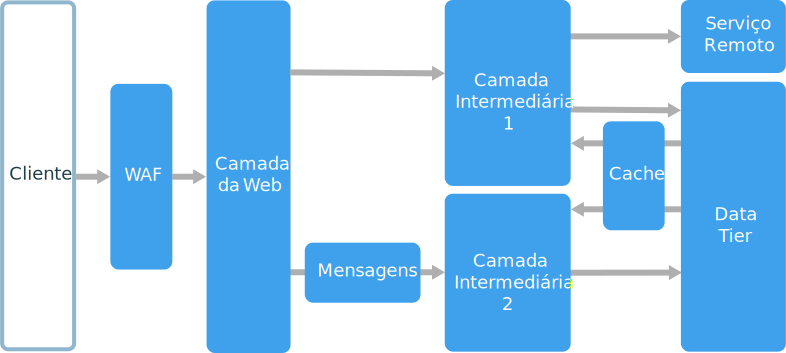
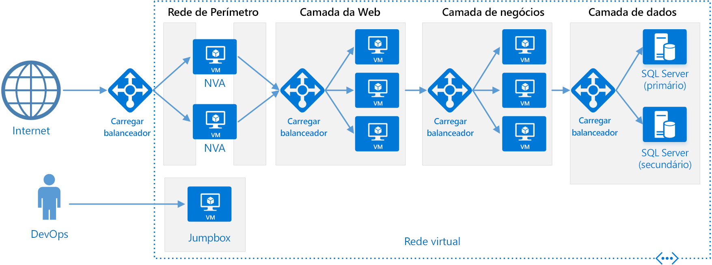

# Estilo de arquitetura de N camadas

Uma arquitetura de N camadas divide um aplicativo em **camadas lógicas** e **camadas físicas**.

Camadas são uma maneira de separar responsabilidades e gerenciar dependências. Cada camada tem uma responsabilidade específica. Uma camada superior pode usar os serviços em uma camada inferior, mas não o oposto.

As camadas são separadas fisicamente, sendo executadas em computadores separados. Uma camada pode chamar diretamente a outra camada ou usar mensagens assíncronas (fila de mensagens). Embora cada camada possa ser hospedada em sua própria camada, isso não é necessário. Várias camadas podem ser hospedadas na mesma camada. Separar fisicamente as camadas melhora a escalabilidade e a resiliência, mas também aumenta a latência da comunicação de rede adicional.

Um aplicativo tradicional de três camadas tem uma camada de apresentação, uma camada intermediária e uma camada de banco de dados. A camada intermediária é opcional. Aplicativos mais complexos podem ter mais de três camadas. O diagrama acima mostra um aplicativo com duas camadas intermediárias, encapsulando áreas diferentes de funcionalidade.

Um aplicativo de N camadas pode ter uma **arquitetura de camada fechada** ou um **arquitetura da camada aberta**:

- Em uma arquitetura de camada fechada, uma camada somente pode chamar a próxima camada imediatamente abaixo.
- Em uma arquitetura de camada aberta, uma camada pode chamar qualquer uma das camadas abaixo dela.

Uma arquitetura de camada fechada limita as dependências entre camadas. No entanto, ele poderá criar o tráfego de rede desnecessário se uma camada simplesmente passar as solicitações para a próxima camada.

## Quando usar essa arquitetura

Arquiteturas de N camadas normalmente são implementadas como aplicativos IaaS (infraestrutura como serviço), com cada camada em execução em um conjunto separado de VMs. No entanto, um aplicativo de N camadas não precisa ser IaaS pura. Muitas vezes é vantajoso usar serviços gerenciados para algumas partes da arquitetura, particularmente cache, mensagens e armazenamento de dados.

Considere uma arquitetura de N camadas para:

- Aplicativos Web simples.
- Migrar um aplicativo local para o Azure com o mínimo de refatoração.
- Desenvolvimento unificado de aplicativos em nuvem e locais.

Arquiteturas de N camadas são muito comuns em aplicativos locais tradicionais, portanto, é uma opção natural para migrar cargas de trabalho existentes para o Azure.

## Benefícios

- Portabilidade entre nuvem e local e entre plataformas de nuvem.
- Curva de aprendizado menor para a maioria dos desenvolvedores.
- Evolução natural do modelo tradicional de aplicativos.
- Abertura para ambiente heterogêneos (Windows/Linux)

## Desafios

- É fácil terminar com uma camada intermediária que faz exatamente apenas CRUD no banco de dados, acrescentando latência extra sem fazer qualquer trabalho útil.
- O design monolítico impede a implantação independente de recursos.
- O gerenciamento de um aplicativo IaaS requer mais trabalho que o de um aplicativo que usa apenas serviços gerenciados.
- Pode ser difícil gerenciar a segurança de rede em um sistema grande.

## Práticas recomendadas

- Use o dimensionamento automático para controlar as alterações na carga. Consulte [Melhores práticas de dimensionamento automático][autoscaling].
- Use mensagens assíncronas para desacoplar camadas.
- Armazenar em cache dados semiestáticos. Consulte [Melhores práticas de cache][caching].
- Configure a camada de banco de dados para alta disponibilidade usando uma solução como [Grupos de disponibilidade AlwaysOn do SQL Server][sql-always-on].
- Coloque um WAF (firewall do aplicativo Web) entre o front-end e a Internet.
- Coloque cada camada na própria sub-rede e use sub-redes como um limite de segurança.
- Restrinja o acesso a camada de dados, permitindo solicitações somente das camadas intermediárias.

## Arquitetura de N camadas em máquinas virtuais

Esta seção descreve uma arquitetura de N camadas recomendada em execução em VMs.

Cada camada consiste em duas ou mais VMs, colocadas em um conjunto de disponibilidade ou um conjunto de dimensionamento de VM. Várias VMs oferecem resiliência no caso de falha da VM. Balanceadores de carga são usados para distribuir solicitações entre as VMs em uma camada. Uma camada pode ser dimensionada horizontalmente adicionando mais VMs ao pool.

Cada camada também é colocada dentro da própria sub-rede, o que significa que seus endereços IP internos ficam dentro do mesmo intervalo de endereços. Isso facilita a aplicação de regras NSG (grupo de segurança de rede) e o roteamento de tabelas para camadas individuais.

As camadas Web e comercial não têm estado. Qualquer VM pode lidar com qualquer solicitação para essa camada. A camada de dados deve consistir em um banco de dados replicado. Para Windows, é recomendável SQL Server, usando Grupos de Disponibilidade AlwaysOn para alta disponibilidade. Para o Linux, escolha um banco de dados com suporte para replicação, como Apache Cassandra.

NSGs (grupos de segurança de rede) restringem o acesso a cada camada. Por exemplo, a camada de banco de dados só permite o acesso da camada comercial.

Para obter mais detalhes e um modelo implantável do Resource Manager, consulte as arquiteturas de referência a seguir:

- [Executar VMs do Windows para um aplicativo de N camadas][n-tier-windows]
- [Executar VMs do Linux para um aplicativo de N camadas][n-tier-linux]

### Considerações adicionais

- Arquiteturas de N camadas não estão restritas a três camadas. Para aplicativos mais complexos, é comum ter mais camadas. Nesse caso, considere usar roteamento de camada 7 para rotear solicitações para uma camada em particular.

- As camadas são os limites de escalabilidade, confiabilidade e segurança. Considere ter camadas separadas para serviços com requisitos diferentes nessas áreas.

- Use Conjuntos de Dimensionamento de VM para dimensionamento automático.

- Procure locais na arquitetura em que você possa usar um serviço gerenciado sem refatoração significativa. Em particular, examine cache, mensagens, armazenamento e bancos de dados.

- Para maior segurança, coloque uma rede DMZ na frente do aplicativo. A DMZ inclui NVAs (soluções de virtualização de rede) que implementam a funcionalidade de segurança, como firewalls e inspeção de pacotes. Para obter mais informações, consulte [Arquitetura de referência de DMZ da rede][dmz].

- Para alta disponibilidade, coloque duas ou mais NVAs em um conjunto de disponibilidade, com um balanceador externo de carga para distribuir solicitações de Internet entre as instâncias. Para obter mais informações, consulte [Implantar soluções de virtualização de rede altamente disponíveis][ha-nva].

- Não permita o acesso direto a RDP ou SSH para VMs que estejam executando o código do aplicativo. Em vez disso, os operadores devem fazer logon em um jumpbox, também chamado de um host bastião. Esta é uma VM na rede que os administradores usam para se conectar às outras VMs. O jumpbox tem um NSG que permite que RDP ou SSH somente de endereços IP públicos aprovados.

- Você pode estender a rede virtual do Azure para a sua rede local usando uma VPN (rede privada virtual) site a site ou o Azure ExpressRoute. Para obter mais informações, consulte [Arquitetura de referência de rede híbrida][hybrid-network].

- Se a sua organização usar o Active Directory para gerenciar a identidade, você talvez queira estender seu ambiente do Active Directory para a VNet do Azure. Para obter mais informações, consulte [Arquitetura de referência de gerenciamento de identidade][identity].

- Se você precisar de disponibilidade mais alta do que a fornecida pelo SLA do Azure para VMs, replique o aplicativo em duas regiões e use o Gerenciador de Tráfego do Azure para failover. Para obter mais informações, consulte [Executar VMs do Windows em várias regiões][multiregion-windows] ou [Executar VMs do Linux em várias regiões][multiregion-linux].

[autoscaling]: ../../best-practices/auto-scaling.md
[caching]: ../../best-practices/caching.md
[dmz]: ../../reference-architectures/dmz/index.md
[ha-nva]: ../../reference-architectures/dmz/nva-ha.md
[hybrid-network]: ../../reference-architectures/hybrid-networking/index.md
[identity]: ../../reference-architectures/identity/index.md
[multiregion-linux]: ../../reference-architectures/virtual-machines-linux/multi-region-application.md
[multiregion-windows]: ../../reference-architectures/virtual-machines-windows/multi-region-application.md
[n-tier-linux]: ../../reference-architectures/virtual-machines-linux/n-tier.md
[n-tier-windows]: ../../reference-architectures/virtual-machines-windows/n-tier.md
[sql-always-on]: /sql/database-engine/availability-groups/windows/always-on-availability-groups-sql-server