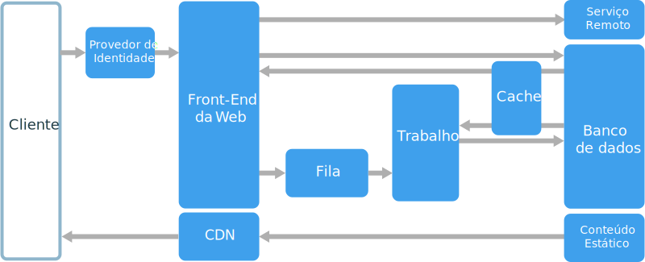
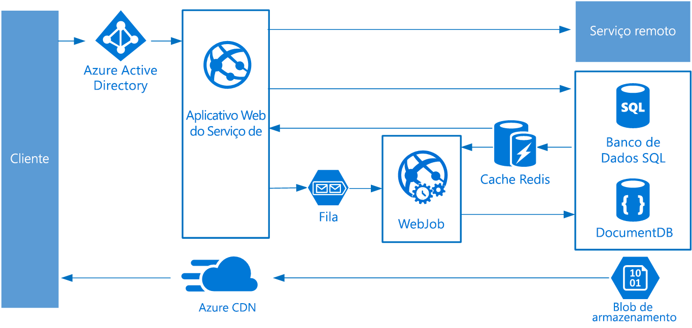

# Estilo de arquitetura de trabalho de fila da Web

Os componentes principais dessa arquitetura são um **front-end da Web** que atende a solicitações de cliente e um **trabalho** que executa tarefas de uso intensivo de recursos, fluxos de trabalho de longa execução ou trabalhos em lotes.  O front-end da Web se comunica com o trabalho por meio de uma **fila de mensagens**.  

Outros componentes que são comumente incorporados a essa arquitetura são:

- Um ou mais bancos de dados. 
- Um cache para armazenar valores do banco de dados para leituras rápidas.
- CDN para atender a conteúdo estático
- Serviços remotos, como email ou serviço de SMS. Geralmente, eles são fornecidos por terceiros.
- Provedor de identidade para autenticação.

A Web e o trabalho são sem estado. O estado de sessão pode ser armazenado em um cache distribuído. Qualquer trabalho de longa execução é feito assincronamente pela função de trabalho. A função de trabalho pode ser acionada por mensagens na fila ou executada em um agendamento de processamento em lotes. A função de trabalho é um componente opcional. Se não houver nenhuma operação de longa execução, o trabalho pode ser omitido.  

O front-end pode consistir em uma API da Web. Da parte do cliente, a API da Web pode ser consumida por um aplicativo de página única que faz chamadas AJAX ou por um aplicativo cliente nativo.

## Quando usar essa arquitetura

A arquitetura de trabalho de fila da Web geralmente é implementada usando serviços de computação gerenciados, tanto o Serviço de Aplicativo do Azure ou Serviços de Nuvem do Azure. 

Considere esse estilo de arquitetura para:

- Aplicativos com um domínio relativamente simples.
- Aplicativos com alguns fluxos de trabalho de longa execução ou operações em lote.
- Quando você quiser usar serviços gerenciados em vez de infraestrutura como serviço (IaaS).

## Benefícios

- Arquitetura relativamente simples e fácil de entender.
- Fácil de implantar e gerenciar.
- Clara separação de preocupações.
- O front-end é separado do trabalho usando o sistema de mensagens assíncrono.
- O front-end e o trabalho podem ser dimensionado independentemente.

## Desafios

- Sem um design cuidadoso, O front-end e o trabalho podem facilmente se tornar componentes grandes e monolíticos difíceis de serem mantidos e atualizados.
- Pode haver dependências ocultas se o front-end e o trabalho compartilharem esquemas de dados ou módulos de código. 

## Práticas recomendadas

- Expor uma API bem projetada para o cliente. Confira [Práticas recomendadas de design da API][api-design].
- Dimensionar automaticamente para controlar as alterações na carga. Confira [Práticas recomendadas de dimensionamento automático][autoscaling].
- Armazenar dados semiestáticos em cache. Confira [Práticas recomendadas de cache][caching].
- Usar uma CDN para hospedar o conteúdo estático. Confira [Práticas recomendadas de CDN][cdn].
- Usar persistência poliglota quando apropriado. Confira [Usar o armazenamento de dados recomendado para o trabalho][polyglot].
- Particionar dados para aprimorar a escalabilidade, reduzir a contenção e otimizar o desempenho. Confira [Práticas recomendadas de particionamento de dados][data-partition].

## Trabalho de fila da Web no Serviço de Aplicativo do Azure

Esta seção descreve uma arquitetura recomendada de trabalho de fila da Web que usa Serviço de Aplicativo do Azure. 

O front-end é implementado como um aplicativo da Web do Serviço de Aplicativo do Azure, e o trabalho é implementado como um Trabalho Web. O aplicativo Web e o trabalho Web são ambas associados a um plano do Serviço de Aplicativo que fornece as instâncias de VM. 

Você pode usar filas do Barramento de Serviço do Microsoft Azure ou do Armazenamento do Microsoft Azure para a fila de mensagens. (O diagrama mostra uma fila de Armazenamento do Microsoft Azure.)

O Cache Redis do Azure armazena o estado de sessão e outros dados que precisam de acesso de baixa latência.

A CDN do Azure é usada para armazenar em cache o conteúdo estático, como imagens, CSS ou HTML.

Para o armazenamento, escolha as tecnologias de armazenamento que melhor atendem às necessidades do aplicativo. Você pode usar várias tecnologias de armazenamento (persistência poliglota). Para ilustrar essa ideia, o diagrama mostra o Banco de Dados SQL do Azure e o Azure Cosmos DB.  

Para obter mais detalhes, confira [Arquitetura de referência do aplicativo do Serviço de Aplicativo Web][scalable-web-app].

### Considerações adicionais

- Nem toda transação deve passar pela fila e pelo trabalho para o armazenamento. O front-end da Web pode executar diretamente operações simples de leitura/gravação. Os trabalhos são projetados para tarefas de uso intensivo de recursos ou fluxos de trabalho de longa execução. Em alguns casos, talvez não seja preciso de nenhum trabalho.

- Use o recurso interno de dimensionar automaticamente do Serviço de Aplicativo para escalar horizontalmente o número de instâncias de VM. Se a carga no aplicativo segue padrões previsíveis, use o dimensionamento automático baseado em agendamento. Se a carga for imprevisível, use regras de dimensionamento automático baseado em métricas.      

- Considere colocar o aplicativo Web e o trabalho Web em planos separados de Serviço de Aplicativo. Dessa forma, eles ficam hospedados em instâncias separadas de VM e podem ser dimensionados de forma independente. 

- Use planos de Serviço de Aplicativo separados para produção e teste. Caso contrário, se você usar o mesmo plano para produção e teste, isso significa que seus testes estão em execução em suas VMs de produção.

- Use slots de implantação para gerenciar implantações. Isso permite implantar uma versão atualizada em um slot de preparo e depois trocar para a nova versão. Também permite que você troque para a versão anterior, caso tenha havido um problema com a atualização.

<!-- links -->

[api-design]: ../../best-practices/api-design.md
[autoscaling]: ../../best-practices/auto-scaling.md
[caching]: ../../best-practices/caching.md
[cdn]: ../../best-practices/cdn.md
[data-partition]: ../../best-practices/data-partitioning.md
[polyglot]: ../design-principles/use-the-best-data-store.md
[scalable-web-app]: ../../reference-architectures/app-service-web-app/scalable-web-app.md