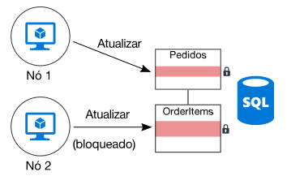
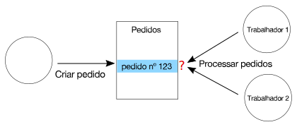

# Minimizar a coordenação 

## Minimizar a coordenação entre os serviços de aplicativos para atingir a escalabilidade

A maioria dos aplicativos de nuvem consiste em vários serviços de aplicativo &mdash; front-ends da Web, bancos de dados, processos de negócios, relatórios e análises e assim por diante. Para obter escalabilidade e confiabilidade, cada um desses serviços deve ser executado em várias instâncias. 

O que acontece quando duas instâncias tentam realizar operações simultâneas que afetam a algum estado compartilhado? Em alguns casos, deve haver coordenação entre nós, por exemplo, para preservar as garantias ACID. Neste diagrama, `Node2` está aguardando `Node1` para liberar um bloqueio de banco de dados:

A coordenação limita os benefícios de escala horizontal e cria afunilamentos. Neste exemplo, ao expandir o aplicativo e adicionar mais instâncias, você verá a contenção de bloqueio maior. No pior dos casos, as instâncias de front-end passam a maior parte do tempo aguardando bloqueios.

As semânticas "Exatamente uma vez" são outra fonte de coordenação frequente. Por exemplo, um pedido deve ser processado exatamente uma vez. Dois trabalhadores estão ouvindo novas ordens. `Worker1` pega um pedido para processamento. O aplicativo deve garantir que `Worker2` não duplique o trabalho, mas também se `Worker1` falhar, que o pedido não seja descartado.

Você pode usar um padrão como [Supervisor de Agente de Agendador][sas-pattern] para coordenar entre os trabalhadores, mas nesse caso, uma abordagem melhor seria particionar o trabalho. Cada trabalho é atribuído a um determinado intervalo de pedidos (digamos, por região de cobrança). Se um trabalho falhar, uma nova instância assume onde a instância anterior foi interrompida, mas as várias instâncias não estão concorrendo.

## Recomendações

**Adote a consistência eventual**. Quando os dados são distribuídos, leva coordenação para impor as garantias de consistência forte. Por exemplo, suponha que uma operação atualize dois bancos de dados. Em vez de colocá-lo em um escopo de transação única, é melhor se o sistema puder acomodar a consistência eventual, talvez usando o padrão [Transação de Compensação][compensating-transaction] para reverter logicamente após uma falha.

**Usar eventos de domínio para sincronizar o estado**. Um [evento de domínio][domain-event] é um evento que registra quando acontecer algo que tenha importância no domínio. Os serviços interessados podem escutar o evento, em vez de usar uma transação global para coordenar entre vários serviços. Se essa abordagem for usada, o sistema deverá tolerar a consistência eventual (veja o item anterior). 

**Considere os padrões como o CQRS e o fornecimento de evento**. Esses dois padrões podem ajudar a reduzir a contenção entre as cargas de trabalho de leitura e gravação. 

- O [padrão CQRS][cqrs-pattern] separa as operações de gravação e de leitura. Em algumas implementações, os dados de leitura são separados fisicamente dos dados de gravação. 

- No [padrão Evento de Fornecimento][event-sourcing], as alterações de estado são registradas como uma série de eventos para um armazenamento de dados somente de acréscimo. O acréscimo de um evento ao fluxo é uma operação atômica, exigindo bloqueio mínimo. 

Esses dois padrões se complementam. Se o armazenamento de somente gravação CQRS usa fontes de evento, o armazenamento de somente leitura pode escutar os mesmos eventos criar um instantâneo de leitura do estado atual, otimizado para consultas. Antes de adotar o CQRS ou o fornecimento de evento, no entanto, lembre-se dos desafios dessa abordagem. Para saber mais, veja [estilo de arquitetura do CQRS][cqrs-style].

**Dados de partição**.  Evite colocar todos os seus dados em um esquema de dados que seja compartilhado entre vários serviços de aplicativo. Uma arquitetura de microsserviços impõe esse princípio, tornando cada serviço responsável por seu próprio armazenamento de dados. Em um único banco de dados, o particionamento dos dados em fragmentos pode melhorar a simultaneidade, porque um serviço de gravar um fragmento não afeta um serviço de gravação de um fragmento diferente.

**Criar operações idempotentes**. Quando possível, projete as operações como idempotentes. Dessa forma, elas poderão ser manipuladas usando a semântica at-least-once. Por exemplo, você pode colocar itens de trabalho em uma fila. Se um trabalho falhar no meio de uma operação, outro trabalhador simplesmente escolhe o item de trabalho.

**Use o processamento paralelo assíncrono**. Se uma operação exigir várias etapas executadas de forma assíncrona (como chamadas de serviço remoto), você poderá chamá-los em paralelo e, em seguida, agregar os resultados. Essa abordagem supõe que cada etapa não dependa dos resultados da etapa anterior.   

**Use a simultaneidade otimista quando possível**. O controle de simultaneidade pessimista usa bloqueios de banco de dados para evitar conflitos. Isso pode causar baixo desempenho e reduzir a disponibilidade. Com o controle de simultaneidade otimista, cada transação modifica uma cópia ou um instantâneo dos dados. Quando a transação é confirmada, o mecanismo de banco de dados valida a transação e rejeita qualquer transação que possa afetar a consistência do banco de dados. 

O banco de dados SQL do Azure e o SQL Server oferecem suporte à simultaneidade otimista por meio de [isolamento de instantâneo][sql-snapshot-isolation]. Alguns serviços de armazenamento do Azure oferecem suporte à simultaneidade otimista com Etags, incluindo o uso da [API do DocumentDB][docdb-faq] e o [Armazenamento do Azure][storage-concurrency].

**Considere o MapReduce ou outros algoritmos paralelos e distribuídos**. Dependendo dos dados e o tipo de trabalho a ser executado, você poderá dividir o trabalho em tarefas independentes que podem ser executadas por vários nós de trabalho em paralelo. Veja [Estilo de arquitetura de computação intensa][big-compute].

**Use a seleção de preenchimento para coordenação**. Em casos em que você precisa coordenar operações, verifique se o coordenador não entrar em um ponto único de falha no aplicativo. Com o [padrão Eleição do Líder][leader-election], uma instância é líder a qualquer momento e atua como o coordenador. Se o líder falhar, uma nova instância é escolhida para ser o líder. 
 

<!-- links -->

[big-compute]: ../architecture-styles/big-compute.md
[compensating-transaction]: ../../patterns/compensating-transaction.md
[cqrs-style]: ../architecture-styles/cqrs.md
[cqrs-pattern]: ../../patterns/cqrs.md
[docdb-faq]: /azure/documentdb/documentdb-faq
[domain-event]: https://martinfowler.com/eaaDev/DomainEvent.html
[event-sourcing]: ../../patterns/event-sourcing.md
[leader-election]: ../../patterns/leader-election.md
[sas-pattern]: ../../patterns/scheduler-agent-supervisor.md
[sql-snapshot-isolation]: /sql/t-sql/statements/set-transaction-isolation-level-transact-sql
[storage-concurrency]: https://azure.microsoft.com/blog/managing-concurrency-in-microsoft-azure-storage-2/