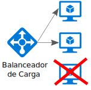
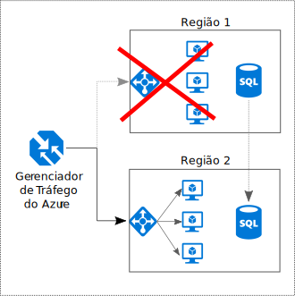

# Tornar todas as coisas redundantes

## Criar redundância no seu aplicativo, evite ter pontos únicos de falha

Um aplicativo resiliente contorna a falha. Identifique os caminhos críticos em seu aplicativo. Há redundância em cada ponto no caminho? Se um subsistema falhar, o aplicativo falhará em outra coisa?

## Recomendações 

**Considere os requisitos de negócios**. A quantidade de redundância incorporada em um sistema pode afetar o custo e a complexidade. Sua arquitetura deve ser informada por seus requisitos de negócios, como o objetivo de tempo de recuperação (RTO). Por exemplo, uma implantação de várias regiões é mais cara do que uma implantação de região única e é mais complicada para gerenciar. Você precisará de procedimentos operacionais para lidar com o failover e o failback. O custo adicional e a complexidade podem ser justificados para alguns cenários de negócios e para outros não.

**Posicione as VMs por trás de um balanceador de carga**. Não use uma única VM para cargas de trabalho de missão crítica. Em vez disso, posicione várias VMs atrás de um balanceador de carga. Se qualquer VM ficar indisponível, o balanceador de carga distribuirá o tráfego para as VMs íntegras restantes. Para saber como implantar essa configuração, confira [Várias VMs para escalabilidade e disponibilidade][multi-vm-blueprint].

**Replique os bancos de dados**. O Banco de Dados SQL do Azure e o Cosmos DB replicam automaticamente os dados dentro de uma região, e você pode habilitar a replicação geográfica entre regiões. Se você estiver usando uma solução de banco de dados de IaaS, escolha uma que dê suporte à replicação e failover, tal como os [Grupos de Alta Disponibilidade Always On do SQL Server][sql-always-on]. 

**Habilite a replicação geográfica**. A replicação geográfica para o [Banco de Dados SQL do Azure][sql-geo-replication] e o [Cosmos DB][cosmosdb-geo-replication] cria réplicas secundárias de leitura de seus dados em uma ou mais regiões secundárias. No caso de uma interrupção, o banco de dados poderá fazer failover para a região secundária para gravações.

**Partição para disponibilidade**. O particionamento do banco de dados geralmente é usado para melhorar a escalabilidade, mas também pode melhorar a disponibilidade. Se um fragmento falhar, os outros fragmentos ainda poderão ser acessados. Uma falha em um fragmento interromperá apenas um subconjunto do total de transações. 

**Implante mais de uma região**. Para obter a maior disponibilidade, implante o aplicativo em mais de uma região. Dessa forma, em casos raros, quando um problema afetar uma região inteira, o aplicativo poderá fazer failover para outra região. O diagrama a seguir mostra um aplicativo de várias regiões que usa o Gerenciador de Tráfego do Azure para controlar o failover.

**Sincronize o failover de front e back-end**. Use o Gerenciador de Tráfego do Azure para fazer failover do front-end. Se o front-end não puder ser acessado em uma região, o Gerenciador de Tráfego direcionará novas solicitações para a região secundária. Dependendo de sua solução de banco de dados, talvez seja necessário coordenar o failover de banco de dados. 

**Use o failover automático, mas o failback manual**. Use o Gerenciador de Tráfego para o failover automático, mas não para failback automático. O failback automático traz um risco de você alternar para a região primária antes de a região estar completamente íntegra. Em vez disso, verifique se todos os subsistemas de aplicativo estão íntegros antes de realizar o failback. Além disso, dependendo do banco de dados, você precisará verificar a consistência de dados antes do failback.

**Inclua redundância para o Gerenciador de Tráfego**. O Gerenciador de Tráfego é um possível ponto de falha. Examine o SLA do Gerenciador de Tráfego e determine se usar apenas o Gerenciador de Tráfego atende aos seus requisitos de negócios para alta disponibilidade. Caso contrário, considere adicionar outra solução de gerenciamento de tráfego como um failback. Se o serviço do Gerenciador de Tráfego do Azure falhar, altere os registros CNAME no DNS para apontar para outro serviço de gerenciamento de tráfego.

<!-- links -->

[multi-vm-blueprint]: ../../reference-architectures/virtual-machines-windows/multi-vm.md

[cassandra]: http://cassandra.apache.org/
[cosmosdb-geo-replication]: /azure/cosmos-db/distribute-data-globally
[sql-always-on]: https://msdn.microsoft.com/library/hh510230.aspx
[sql-geo-replication]: /azure/sql-database/sql-database-geo-replication-overview
