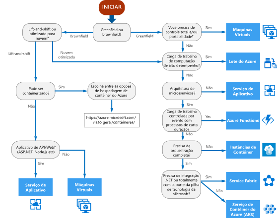

# Árvore de decisão para serviços de computação do Azure

O Azure oferece várias maneiras de hospedar o código do seu aplicativo. O termo *computação* refere-se ao modelo de hospedagem para os recursos de computação em que seu aplicativo é executado. O fluxograma a seguir o ajudará a escolher um serviço de computação para o aplicativo. O fluxograma orienta você por um conjunto de critérios de decisão essenciais que geram uma recomendação. 

**Trate esse fluxograma como um ponto de partida.** Cada aplicativo tem requisitos exclusivos e, portanto use a recomendação como um ponto de partida. Em seguida, execute uma avaliação mais detalhada, observando aspectos como:
 
- Conjunto de recursos
- [Limites de serviço](/azure/azure-subscription-service-limits)
- [Custo](https://azure.microsoft.com/pricing/)
- [SLA](https://azure.microsoft.com/support/legal/sla/)
- [Disponibilidade regional](https://azure.microsoft.com/global-infrastructure/services/)
- Habilidades da equipe e o ecossistema do desenvolvedor
- [Tabelas de comparação de computação](./compute-comparison.md)

Se o aplicativo tem várias cargas de trabalho, avalie cada carga de trabalho separadamente. Uma solução completa pode incorporar dois ou mais serviços de computação.

