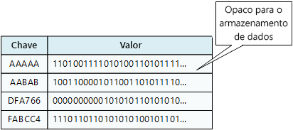
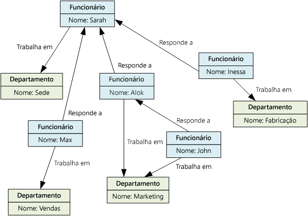

# Escolher o armazenamento de dados correto

Os sistemas de negócios modernos gerenciam volumes de dados cada vez maiores. Os dados podem ser ingeridos de serviços externos, gerados pelo próprio sistema ou criados pelos usuários. Esses conjuntos de dados podem ter características extremamente variadas e requisitos de processamento. As empresas usam dados para avaliar tendências, disparar processos empresariais, auditar suas operações, analisar o comportamento do cliente e muitas outras ações. 

Essa heterogeneidade significa que um armazenamento de dados único geralmente não é a melhor abordagem. Em vez disso, muitas vezes é melhor armazenar diferentes tipos de dados em diferentes repositórios de dados, cada um focado em uma carga de trabalho ou padrão de uso específico. O termo *persistência poliglota* é utilizado para descrever soluções que usam uma combinação de tecnologias de armazenamento de dados.

Selecionar o armazenamento de dados certo para seus requisitos é uma decisão de design chave. Literalmente, há centenas de implementações para escolher entre Banco de dados NoSQL e SQL. Os armazenamentos de dados geralmente são categorizados por como eles estruturam dados e os tipos de operações às quais fornecem suporte. Este artigo descreve vários dos modelos de armazenamentos mais comuns. Note que uma tecnologia de armazenamento de dados particular pode fornecer suporte a vários modelos de armazenamento. Por exemplo, um RDBMS (sistemas de gerenciamento de banco de dados relacional) também pode fornecer suporte de armazenamento de gráfico ou valor/chave. De fato, há uma tendência geral para o chamado suporte *multimodelo*, onde um único sistema de banco de dados fornece suporte a vários modelos. Mas, ainda é útil entender os diferentes modelos em um nível alto. 

Nem todos os armazenamentos de dados em uma determinada categoria fornecem o mesmo conjunto de recursos. A maioria dos armazenamentos de dados fornece funcionalidade do lado do servidor para consultar e processar dados. Às vezes, essa funcionalidade está integrada no mecanismo de armazenamento de dados. Em outros casos, os recursos de processamento e armazenamento de dados são separados e pode haver diversas opções de análise e processamento. Os armazenamentos de dados também fornecem suporte para diferentes interfaces de gerenciamento e programáticas. 

Geralmente, você deve iniciar considerando qual modelo de armazenamento é o mais adequado às suas necessidades. Em seguida, considere um armazenamento de dados específico dentro dessa categoria, com base em fatores como o conjunto de recursos, custos e a facilidade de gerenciamento.

## Sistemas de gerenciamento de banco de dados relacional

Os bancos de dados relacionais organizam dados como uma série de tabelas bidimensionais com linhas e colunas. Cada tabela possui suas próprias colunas e cada linha em uma tabela possui o mesmo conjunto de colunas. Esse modelo é baseado em uma base matemática e a maioria dos fornecedores fornece um dialeto de SQL (linguagem SQL) para recuperar e gerenciar dados. Um RDBMS tipicamente implementa um mecanismo consistente de forma transacional que está em conformidade com o modelo ACID (Atômico, Consistente, Isolado, Durável) para atualizar informações. 

Um RDBMS geralmente fornece suporte para um modelo de esquema em gravação, onde a estrutura de dados é definida antecipadamente e todas as operações de leitura ou gravação devem utilizar o esquema. Isso contrasta com a maioria dos armazenamentos de dados NoSQL, particularmente tipos de valor/chave, onde o modelo de esquema em leitura pressupõe que o cliente estará impondo seu próprio esquema interpretativo aos dados que saem do banco de dados e é independente ao formato de dados sendo gravado.

Um RDBMS é muito útil quando garantias de coerência forte são importantes &mdash;, onde todas as alterações são atômicas e as transações sempre deixam os dados em um estado consistente. No entanto, as estruturas subjacentes não se prestam a escalar distribuindo armazenamento e processamento em computadores. Além disso, as informações armazenadas em um RDBMS devem ser colocadas em uma estrutura relacional, seguindo o processo de normalização. Embora esse processo seja bem compreendido, isso pode levar a ineficiências devido à necessidade de desmontar as entidades lógicas nas linhas em tabelas separadas e, depois, montar novamente os dados ao executar consultas. 

Serviço do Azure relevante: 

- [Banco de dados SQL do Azure][sql-db]
- [Banco de Dados do Azure para MySQL][mysql]
- [Banco de Dados do Azure para PostgreSQL][postgres]

## Armazenamentos de valor/chave

Um armazenamento de valor/chave é essencialmente uma tabela de hash grande. Você associa cada valor de dados a uma chave exclusiva e o armazenamento de valor/chave usa essa chave para armazenar os dados, utilizando uma função de hash apropriada. A função de hash é selecionada para fornecer uma distribuição uniforme de chaves de hash em todo o armazenamento de dados. 

A maioria dos armazenamentos de valor/chave fornecem suporte apenas às operações de exclusão, inserção e consulta simples. Para modificar um valor (parcial ou completamente), um aplicativo deverá substituir os dados existentes para todo o valor. Na maioria das implementações, a leitura ou gravação de um único valor é uma operação atômica. Se o valor for grande, a gravação poderá demorar algum tempo. 

Um aplicativo pode armazenar dados arbitrários como um conjunto de valores, embora alguns armazenamentos de valor/chave imponham limites ao tamanho máximo de valores. Os valores armazenados são opacos para o software do sistema de armazenamento. Quaisquer informações de esquema deverão ser fornecidas e interpretadas pelo aplicativo. Essencialmente, os valores são blobs e o armazenamento de valor/chave simplesmente recupera ou armazena o valor por chave. 

Os armazenamentos de valor/chave são altamente otimizados para aplicativos que realizam pesquisas simples, mas são menos adequados para sistemas que precisam consultar dados em diferentes armazenamentos de valor/chave. Os armazenamentos de valor/chave também não são otimizados para cenários em que a consulta por valor é importante, ao invés de realizar pesquisas baseadas somente em chaves. Por exemplo, com um banco de dados relacional, é possível localizar um registro utilizando uma cláusula WHERE, mas os armazenamentos de valor/chave geralmente não possuem esse tipo de capacidade de pesquisa para valores.

Um armazenamento de valor/chave pode ser extremamente escalável, pois o armazenamento de dados pode facilmente distribuir dados em vários nós em computadores separadas. 

Serviços do Azure relevantes: 

- [Cosmos DB][cosmosdb]
- [Cache Redis do Azure][redis-cache]

## Bancos de dados de documentos

Um banco de dados de documentos é conceitualmente semelhante a um armazenamento de valor/chave, exceto ele que armazena uma coleção de dados e campos nomeados (conhecidos como documentos), cada um dos quais poderia ser simples itens escalares ou elementos compostos, como listas e coleções filho. Os dados nos campos de um documento podem ser codificados de várias maneiras, incluindo XML, YAML, JSON, BSON ou até mesmo armazenados como texto simples. Ao contrário dos armazenamentos de valor/chave, os campos nos documentos são expostos ao sistema de gerenciamento de armazenamento, permitindo que um aplicativo consulte e filtre dados utilizando os valores nesses campos. 

Normalmente, um documento contém todos os dados de uma entidade. Quais itens constituem uma entidade são específicos de aplicativos. Por exemplo, uma entidade pode conter os detalhes de um cliente, uma ordem ou uma combinação de ambos. Um documento único pode conter informações que se espalharão em várias tabelas relacionais em um RDBMS. 

Um armazenamento de documentos não exige que todos os documentos tenham a mesma estrutura. Essa abordagem de forma livre oferece uma grande flexibilidade. Os aplicativos podem armazenar dados diferentes em documentos à medida que os negócios forem mudando.

O aplicativo pode recuperar documentos utilizando a chave de documento. Esse é um identificador exclusivo para o documento, que frequentemente é com hash, para ajudar a distribuir os dados de forma uniforme. Alguns bancos de dados de documentos criam a chave de documento automaticamente. Outros permitem que você especifique um atributo do documento a ser usado como a chave. O aplicativo também pode consultar documentos baseado no valor de um ou mais campos. Alguns bancos de dados de documentos fornecem suporte para indexação, de modo a facilitar a pesquisa rápida de documentos com base em um ou mais campos indexados. 

Muitos bancos de dados de documentos fornecem suporte a atualizações in loco, permitindo que um aplicativo modifique os valores de campos específicos em um documento sem regravar o documento inteiro. As operações de leitura e gravação em vários campos em um único documento geralmente são atômicas.

Serviço do Azure relevante: [Cosmos DB][cosmosdb]

## Bancos de dados de grafo

Um banco de dados de gráfico armazena dois tipos de informações, nós e bordas. Você pode pensar em nós como entidades. Bordas que especificam as relações entre os nós. Ambos os nós e as bordas podem ter propriedades que fornecem informações sobre esse nó ou borda, semelhante às colunas em uma tabela. As bordas também podem ter uma direção indicando a natureza do relacionamento.

O objetivo de um banco de dados de gráfico é permitir que um aplicativo execute eficientemente consultas que atravessam a rede de nós e arestas e analise as relações entre entidades. O diagrama a seguir mostra o banco de dados de pessoal de uma organização estruturado como um grafo. As entidades são funcionários e departamentos, e as bordas indicam os relacionamentos de relatórios e o departamento em que os funcionários trabalham. Neste gráfico, as setas nas bordas mostram a direção das relações.
 

Essa estrutura facilita a realização de consultas como "Localizar todos os funcionários que se reportam direta ou indiretamente à Sarah" ou "Quem trabalha no mesmo departamento que John?" Para gráficos grandes com muitas entidades e relacionamentos, você pode realizar análises muito complexas muito rapidamente. Muitos bancos de dados de gráficos fornecem uma linguagem de consulta que você pode utilizar para percorrer uma rede de relacionamentos de forma eficiente. 

Serviço do Azure relevante: [Cosmos DB][cosmosdb]

## Bancos de dados de família de coluna

Um banco de dados de família de coluna organiza dados em linhas e colunas. Na sua forma mais simples, um banco de dados de família de coluna pode parecer muito semelhante a um banco de dados relacional, pelo menos conceitualmente. O poder real de uma base de dados de família de coluna reside na sua abordagem desnormalizada para estruturar dados esparsos. 

É possível pensar em um banco de dados de família de coluna como dados de tabela com linhas e colunas, mas as colunas são divididas em grupos conhecidos como *famílias de coluna*. Cada família de coluna contém um conjunto de colunas que estão logicamente relacionadas e geralmente são recuperadas ou manipuladas como uma unidade. Outros dados acessados separadamente podem ser armazenados em famílias de colunas separadas. Dentro de uma família de colunas, novas colunas podem ser adicionadas dinamicamente e as linhas podem ser esparsas (ou seja, uma linha não precisa ter um valor para cada coluna).

O diagrama a seguir mostra um exemplo com duas famílias de colunas, `Identity` e `Contact Info`. Os dados de uma única entidade possuem a mesma chave de linha em cada família de coluna. Essa estrutura, em que as linhas de um determinado objeto em uma família de coluna pode variar dinamicamente, é um benefício importante da abordagem de família de coluna, que torna essa forma de armazenamento de dados altamente adequada para armazenar dados voláteis e estruturados.

 

Ao contrário de um armazenamento de valor/chave ou um banco de dados de documentos, a maioria dos bancos de dados de família de coluna armazenam dados em ordem de chave, em vez de computar um hash. Muitas implementações permitem que você crie índices sobre colunas específicas em uma família de coluna. Os índices permitem recuperar dados por valor de colunas, em vez de chave de linha.

As operações de leitura e gravação para uma linha geralmente são atômicas com uma família de coluna única, embora algumas implementações ofereçam atomicidade em toda a linha, abrangendo múltiplas famílias de colunas.

Serviço do Azure relevante: [HBase em HDInsight][hbase]

## Análise de dados

Os armazenamentos de análise de dados fornecem soluções massivamente paralelas para ingerir, armazenar e analisar dados. Esses dados são distribuídos em vários servidores utilizando uma arquitetura nada compartilhada para maximizar a escalabilidade e minimizar as dependências. É improvável que os dados sejam estáticos, portanto, esses armazenamentos devem ser capazes de tratar grandes quantidades de informações, chegando a vários formatos de vários fluxos, enquanto continuam processando novas consultas. 

Serviços do Azure relevantes:

- [SQL Data Warehouse][sql-dw]
- [Azure Data Lake][data-lake]

## Banco de dados de mecanismo de pesquisa  

Um banco de dados de mecanismo de pesquisa fornece suporte para a capacidade de pesquisar informações mantidas em serviços de armazenamentos de dados externos. Um banco de dados de mecanismo de pesquisa pode ser utilizado para indexar grandes volumes de dados e fornecer acesso a esses índices quase em tempo real. Embora os bancos de dados de mecanismo de pesquisa sejam comumente considerados como sinônimo de Web, muitos sistemas de grande escala utilizam-os para fornecer recursos de pesquisa e ad hoc e estruturados sobre seus próprios bancos de dados.

As principais características de um banco de dados de mecanismo de pesquisa são a capacidade de armazenar e indexar informações muito rapidamente e fornecer tempos de resposta rápidos para solicitações de pesquisa. Os índices podem ser multidimensionais e fornecer suporte para buscas de texto livre em grandes volumes de dados de texto. A indexação pode ser realizada usando um modelo de pull, disparado pelo banco de dados de mecanismo de pesquisa ou utilizando um modelo push, iniciado pelo código de aplicativo externo. 

A pesquisa pode ser exata ou difusa. Uma pesquisa difusa localiza documentos que correspondem um conjunto de termos e calcula a forma como eles correspondem. Alguns mecanismos de pesquisa também fornecem suporte a análises linguísticas que podem retornar correspondências com base em sinônimos, expansões de gênero (por exemplo, correspondência `dogs` a `pets`), e lematização (palavras correspondentes com a mesma raiz). 

Serviço do Azure relevante: [Azure Search][search]

## Banco de dados de série temporal

Os dados da série temporal são um conjunto de valores organizados por tempo e um banco de dados de séries temporais é um banco de dados otimizado para esse tipo de dados. Os bancos de dados de série temporal devem fornecer suporte para um número muito alto de gravações, pois geralmente coletam grandes quantidades de dados em tempo real a partir de um grande número de fontes. As atualizações são raras e as exclusões geralmente são feitas como operações em massa. Embora os registros gravados em um banco de dados de série temporal sejam geralmente pequenos, muitas vezes há um grande número de registros e o tamanho total dos dados pode crescer rapidamente.

Os bancos de dados de série temporal são ideais para armazenar dados de telemetria. Os cenários incluem sensores de IoT ou contadores de sistemas/aplicativos.

Serviço do Azure relevante: [Time Series Insights][time-series]

## Repositório de objetos  

O repositório de objetos é otimizado para armazenar e recuperar grandes objetos binários (imagens, arquivos, fluxos de áudio e vídeo, grandes documentos e objetos de dados de aplicativos, imagens de disco de máquina virtual). Os objetos nesses tipos de armazenamentos são compostos de dados armazenados, alguns metadados e uma ID exclusiva para acessar o objeto. Os repositórios de objetos permitem o gerenciamento de quantidades extremamente grandes de dados não estruturados.  

Serviço do Azure relevante: [Armazenamento de Blobs][blob]

## Arquivos compartilhados   

Algumas vezes, o uso de arquivos simples pode ser o meio mais eficaz para armazenar e recuperar informações. O uso de compartilhamentos de arquivos permite acessar arquivos em uma rede. Dado á segurança apropriada e mecanismos de controle de acesso simultâneo, o compartilhamento de dados dessa forma pode permitir serviços distribuídos para fornecer acesso de dados altamente escalonável para executar operações básicas de baixo nível, como solicitações de leitura e gravação simples.

Serviço do Azure relevante: [Armazenamento de Arquivos][file-storage]

<!-- links -->

[blob]: https://azure.microsoft.com/services/storage/blobs/
[cosmosdb]: https://azure.microsoft.com/services/cosmos-db/
[data-lake]: https://azure.microsoft.com/solutions/data-lake/
[file-storage]: https://azure.microsoft.com/services/storage/files/
[hbase]: /azure/hdinsight/hdinsight-hbase-overview
[mysql]: https://azure.microsoft.com/services/mysql/
[postgres]: https://azure.microsoft.com/services/postgresql/
[redis-cache]: https://azure.microsoft.com/services/cache/
[search]: https://azure.microsoft.com/services/search/
[sql-db]: https://azure.microsoft.com/services/sql-database
[sql-dw]: https://azure.microsoft.com/services/sql-data-warehouse/
[time-series]: https://azure.microsoft.com/services/time-series-insights/
