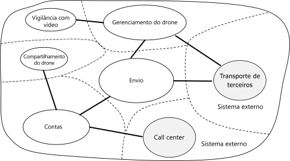

# Criando microsserviços: análise de domínioDesigning microservices: Domain analysis 

Um dos maiores desafios de microsserviços é definir os limites de serviços individuais.One of the biggest challenges of microservices is to define the boundaries of individual services. A regra geral é que um serviço deve fazer "algo" &mdash; mas colocar essa regra em prática requer uma consideração cuidadosa.The general rule is that a service should do "one thing" &mdash; but putting that rule into practice requires careful thought. Não há nenhum processo mecânico que produz o design "certo".There is no mechanical process that will produce the "right" design. Você precisa pensar profundamente em suas metas, requisitos e domínio de negócios.You have to think deeply about your business domain, requirements, and goals. Caso contrário, você pode terminar com um design aleatório que exibe algumas características indesejáveis, como dependências ocultas entre serviços, acoplamento rígido ou então interfaces mal projetadas.Otherwise, you can end up with a haphazard design that exhibits some undesirable characteristics, such as hidden dependencies between services, tight coupling, or poorly designed interfaces. Neste capítulo, usamos uma abordagem orientada por domínio para criar microsserviços.In this chapter, we take a domain-driven approach to designing microservices. 

Microsserviços devem ser criados em torno de capacidades comerciais, não de camadas horizontais como acesso a dados ou mensagens.Microservices should be designed around business capabilities, not horizontal layers such as data access or messaging. Além disso, eles devem ter um acoplamento flexível e alta coesão funcional.In addition, they should have loose coupling and high functional cohesion. Os microsserviços serão *acoplados flexivelmente* se você puder alterar um serviço sem a necessidade de outros serviços serem atualizados simultaneamente.Microservices are *loosely coupled* if you can change one service without requiring other services to be updated at the same time. Um microsserviço é *coeso* se ele tem uma finalidade única e bem definida, como gerenciar contas de usuário ou acompanhar o histórico de entrega.A microservice is *cohesive* if it has a single, well-defined purpose, such as managing user accounts or tracking delivery history. Um serviço deve encapsular o conhecimento do domínio e abstrair esse conhecimento de clientes.A service should encapsulate domain knowledge and abstract that knowledge from clients. Por exemplo, um cliente deve ser capaz de agendar um zumbido sem conhecer os detalhes do algoritmo de agendamento ou como a frota de drones é gerenciada.For example, a client should be able to schedule a drone without knowing the details of the scheduling algorithm or how the drone fleet is managed.

O DDD (design orientado a domínio) fornece uma estrutura que pode ajudar você pela maior parte do processo de obtenção de um conjunto de microsserviços bem projetado.Domain-driven design (DDD) provides a framework that can get you most of the way to a set of well-designed microservices. O DDD tem duas fases diferentes, a estratégica e a tática.DDD has two distinct phases, strategic and tactical. No DDD estratégico, você está definindo a estrutura em grande escala do sistema.In strategic DDD, you are defining the large-scale structure of the system. O DDD estratégico ajuda a garantir que sua arquitetura permaneça concentrada em capacidades comerciais.Strategic DDD helps to ensure that your architecture remains focused on business capabilities. O DDD tático fornece um conjunto de padrões de design que você pode usar para criar o modelo de domínio.Tactical DDD provides a set of design patterns that you can use to create the domain model. Esses padrões incluem entidades, agregações e serviços de domínio.These patterns include entities, aggregates, and domain services. Esses padrões táticos lhe ajudarão a criar microsserviços que são acoplados flexivelmente e também coesos.These tactical patterns will help you to design microservices that are both loosely coupled and cohesive.

Neste capítulo e no próximo, examinaremos as etapas a seguir, as aplicaremos ao aplicativo de Entrega por Drone:In this chapter and the next, we'll walk through the following steps, applying them to the Drone Delivery application: 

1. Comece analisando o domínio corporativo para entender os requisitos funcionais do aplicativo.Start by analyzing the business domain to understand the application's functional requirements. A saída desta etapa é uma descrição informal do domínio, que pode ser redefinido em um conjunto mais formal de modelos de domínio.The output of this step is an informal description of the domain, which can be refined into a more formal set of domain models. 

2. Em seguida, defina os *contextos limitados* do domínio.Next, define the *bounded contexts* of the domain. Cada contexto limitado contém um modelo de domínio que representa um subdomínio específico do aplicativo maior.Each bounded context contains a domain model that represents a particular subdomain of the larger application. 

3. Dentro de um contexto limitado, aplique padrões DDD táticos para definir entidades, agregações e serviços de domínio.Within a bounded context, apply tactical DDD patterns to define entities, aggregates, and domain services. 
 
4. Use os resultados da etapa anterior para identificar os microsserviços em seu aplicativo.Use the results from the previous step to identify the microservices in your application.

Neste capítulo, abordaremos as três primeiras etapas, que se relacionam principalmente com DDD.In this chapter, we cover the first three steps, which are primarily concerned with DDD. No próximo capítulo, identificaremos os microsserviços.In the next chapter, we will identify the microservices. No entanto, é importante lembrar que DDD é um processo iterativo e em andamento.However, it's important to remember that DDD is an iterative, ongoing process. Limites de serviço não são fixos de forma imutável.Service boundaries aren't fixed in stone. Conforme um aplicativo evolui, você pode decidir dividir um serviço em vários serviços menores.As an application evolves, you may decide to break apart a service into several smaller services.

> [!NOTE]
> Este capítulo não é destinado a mostrar uma análise de domínio completa e abrangente.This chapter is not meant to show a complete and comprehensive domain analysis. Mantivemos o exemplo breve propositalmente para ilustrar os pontos principais.We deliberately kept the example brief, in order to illustrate the main points. Para obter mais informações sobre DDD, recomendamos o livro *Domain-Driven Design* de Eric Evans, o livro que introduziu o termo pela primeira vez.For more background on DDD, we recommend Eric Evans' *Domain-Driven Design*, the book that first introduced the term. Outra boa referência é *Implementando Domain-Driven Design* por Vaughn Vernon.Another good reference is *Implementing Domain-Driven Design* by Vaughn Vernon. 

## Analisar o domínioAnalyze the domain

Usar uma abordagem DDD lhe ajudará a criar microsserviços de modo que cada serviço se adeque naturalmente a um requisito de negócios funcional.Using a DDD approach will help you to design microservices so that every service forms a natural fit to a functional business requirement. Ele pode lhe ajudar a evitar a armadilha de permitir que os limites organizacionais ou opções de tecnologia ditem o seu design.It can help you to avoid the trap of letting organizational boundaries or technology choices dictate your design.

Antes de gravar qualquer código, será necessária uma vista panorâmica do sistema que você está criando.Before writing any code, you need a bird's eye view of the system that you are creating. O DDD começa modelando o domínio corporativo e criando uma *modelo de domínio*.DDD starts by modeling the business domain and creating a *domain model*. O modelo de domínio é um modelo abstrato do domínio corporativo.The domain model is an abstract model of the business domain. Destila e organiza os dados de conhecimento do domínio e fornece uma linguagem comum para desenvolvedores e especialistas de domínio.It distills and organizes domain knowledge, and provides a common language for developers and domain experts. 

Iniciar o mapeamento de todas as funções de negócios e as respectivas conexões.Start by mapping all of the business functions and their connections. Isso provavelmente será um esforço colaborativo envolvendo especialistas de domínio, arquitetos de software e outros stakeholders.This will likely be a collaborative effort that involves domain experts, software architects, and other stakeholders. Você não precisa usar nenhum formalismo específico.You don't need to use any particular formalism.  Esboce um diagrama ou desenhe em quadro de comunicações.Sketch a diagram or draw on whiteboard.

Conforme você preencher o diagrama, poderá começar a identificar subdomínios discretos.As you fill in the diagram, you may start to identify discrete subdomains. Quais funções estão intimamente relacionadas?Which functions are closely related? Quais funções são essenciais para os negócios e quais fornecem serviços complementares?Which functions are core to the business, and which provide ancillary services? O que é o grafo de dependência?What is the dependency graph? Durante a fase inicial, você não se importa com tecnologias ou detalhes de implementação.During this initial phase, you aren't concerned with technologies or implementation details. Dito isso, você deverá tomar nota do local em que o aplicativo precisará se integrar com sistemas externos como CRM, processamento do pagamento ou sistemas de cobrança.That said, you should note the place where the application will need to integrate with external systems, such as CRM, payment processing, or billing systems. 

## Entrega por Drones: analisando o domínio corporativo.Drone Delivery: Analyzing the business domain.

Após algumas análises de domínio iniciais, a equipe da Fabrikam criou um esboço aproximado que representa o domínio de Entrega por Drones.After some initial domain analysis, the Fabrikam team came up with a rough sketch that depicts the Drone Delivery domain.

 

- **Envio** é colocado no centro do diagrama, já que é essencial para os negócios.**Shipping** is placed in the center of the diagram, because it's core to the business. Tudo no diagrama existe para habilitar essa funcionalidade.Everything else in the diagram exists to enable this functionality.
- **Gerenciamento de drones** também é importante para os negócios.**Drone management** is also core to the business. Funcionalidades que estão intimamente relacionada ao gerenciamento de drones incluem o **reparo de drones** e o uso de **análise preditiva** para prever quando drones precisam de manutenção e reparo.Functionality that is closely related to drone management includes **drone repair** and using **predictive analysis** to predict when drones need servicing and maintenance. 
- A **análise de ETA** fornece estimativas de tempo para coleta e entrega.**ETA analysis** provides time estimates for pickup and delivery. 
- O **transporte de terceiros** permitirá que o aplicativo agende métodos de transporte alternativos se um pacote não puder ser enviado inteiramente por drone.**Third-party transportation** will enable the application to schedule alternative transportation methods if a package cannot be shipped entirely by drone.
- **Compartilhamento de drones** é uma possível extensão do negócio principal.**Drone sharing** is a possible extension of the core business. A empresa pode ter capacidade de drones excedente durante determinadas horas e pode alugar drones que, caso contrário, ficariam ociosos.The company may have excess drone capacity during certain hours, and could rent out drones that would otherwise be idle. Este recurso não estará na versão inicial.This feature will not be in the initial release.
- **Vigilância por vídeo** é outra área para a qual empresa pode expandir mais tarde.**Video surveillance** is another area that the company might expand into later.
- **Contas de usuário**, **Faturamento** e **Call center** são subdomínios que dão suporte ao negócio principal.**User accounts**, **Invoicing**, and **Call center** are subdomains that support the core business.
 
Observe que neste momento no processo, não tomamos nenhuma decisão sobre implementação ou tecnologias.Notice that at this point in the process, we haven't made any decisions about implementation or technologies. Alguns dos subsistemas podem envolver sistemas externos de software ou serviços de terceiros.Some of the subsystems may involve external software systems or third-party services. Mesmo assim, o aplicativo deve interagir com esses sistemas e serviços, portanto, é importante incluí-los no modelo de domínio.Even so, the application needs to interact with these systems and services, so it's important to include them in the domain model. 

> [!NOTE]
> Quando um aplicativo depende de um sistema externo, há um risco de que a API ou o esquema de dados do sistema externo vaze dados para seu aplicativo, comprometendo consequentemente o design de arquitetura.When an application depends on an external system, there is a risk that the external system's data schema or API will leak into your application, ultimately compromising the architectural design. Isso é especialmente verdadeiro com sistemas herdados que podem não seguir práticas recomendadas modernas e que podem usar esquemas de dados complicados ou APIs obsoletas.This is particularly true with legacy systems that may not follow modern best practices, and may use convoluted data schemas or obsolete APIs. Nesse caso, é importante ter um limite bem definido entre esses sistemas externos e o aplicativo.In that case, it's important to have a well-defined boundary between these external systems and the application. Considere o uso do [Padrão do Estrangulador](../patterns/strangler.md) ou [Padrão de Camada Anticorrupção](../patterns/anti-corruption-layer.md) para essa finalidade.Consider using the [Strangler Pattern](../patterns/strangler.md) or the [Anti-Corruption Layer Pattern](../patterns/anti-corruption-layer.md) for this purpose.

## Definir contextos limitadosDefine bounded contexts

O modelo de domínio inclui representações de objetos reais no mundo &mdash; usuários, drones, pacotes e assim por diante.The domain model will include representations of real things in the world &mdash; users, drones, packages, and so forth. Mas isso não significa que todas as partes do sistema precisam usar as mesmas representações para as mesmas coisas.But that doesn't mean that every part of the system needs to use the same representations for the same things. 

Por exemplo, subsistemas que manipulam análise preditiva e reparo de drones precisarão representar muitas características físicas dos drones, como seu histórico de manutenção, quilometragem, idade, número do modelo, características de desempenho e assim por diante.For example, subsystems that handle drone repair and predictive analysis will need to represent many physical characteristics drones, such as their maintenance history, mileage, age, model number, performance characteristics, and so on. Porém, quando é hora de agendar uma entrega, esses elementos não importam.But when it's time to schedule a delivery, we don't care about those things. O subsistema de agendamento só precisa saber se um drone está disponível e o ETA para coleta e entrega.The scheduling subsystem only needs to know whether a drone is available, and the ETA for pickup and delivery. 

Se tentássemos criar um único modelo para ambos esses subsistemas, ele seria desnecessariamente complexo.If we tried to create a single model for both of these subsystems, it would be unnecessarily complex. Também seria mais difícil para o modelo evoluir ao longo do tempo, porque as alterações precisariam atender a várias equipes trabalhando em subsistemas separados.It would also become harder for the model to evolve over time, because any changes will need to satisfy multiple teams working on separate subsystems. Portanto, geralmente é melhor criar modelos separados que representam a mesma entidade do mundo real (nesse caso, um drone) em dois contextos diferentes.Therefore, it's often better to design separate models that represent the same real-world entity (in this case, a drone) in two different contexts. Cada modelo contém apenas os recursos e os atributos que são relevantes no contexto específico dele.Each model contains only the features and attributes that are relevant within its particular context.

É aqui que o conceito DDD de *contextos limitados* entra em cena.This is where the DDD concept of *bounded contexts* comes into play. Um contexto limitado é simplesmente o limite em um domínio em que um modelo de domínio específico se aplica.A bounded context is simply the boundary within a domain where a particular domain model applies. Examinando o diagrama anterior, é possível agrupar as funcionalidades dependendo de várias funções compartilharem ou não um único modelo de domínio.Looking at the previous diagram, we can group functionality according to whether various functions will share a single domain model. 

 
 
Contextos limitados não são necessariamente isolados uns dos outros.Bounded contexts are not necessarily isolated from one another. Neste diagrama, as linhas sólidas, conectando os contextos limitados representam lugares onde dois contextos limitados interagem.In this diagram, the solid lines connecting the bounded contexts represent places where two bounded contexts interact. Por exemplo, a Remessa depende de contas de usuário obterem informações sobre os clientes e do gerenciamento de drones agendar drones da frota.For example, Shipping depends on User Accounts to get information about customers, and on Drone Management to schedule drones from the fleet.

No livro *Domain Driven Design*, Eric Evans descreve vários padrões para manter a integridade de um modelo de domínio quando ele interage com outro contexto limitado.In the book *Domain Driven Design*, Eric Evans describes several patterns for maintaining the integrity of a domain model when it interacts with another bounded context. Um dos principais princípios de microsserviços é que os serviços se comunicam por meio de APIs bem definidas.One of the main principles of microservices is that services communicate through well-defined APIs. Essa abordagem corresponde a dois padrões que Evans chama de serviço de host aberto e linguagem de programação publicada.This approach corresponds to two patterns that Evans calls Open Host Service and Published Language. A ideia de serviço de host aberto é que um subsistema define um protocolo formal (API) para outros subsistemas se comunicarem com ele.The idea of Open Host Service is that a subsystem defines a formal protocol (API) for other subsystems to communicate with it. A linguagem de programação publicada estende essa ideia publicando a API de uma forma que outras equipes podem usar para escrever código de clientes.Published Language extends this idea by publishing the API in a form that other teams can use to write clients. No capítulo sobre [design de API](./api-design.md), discutiremos usando a [especificação de OpenAPI](https://www.openapis.org/specification/repo) (anteriormente conhecida como Swagger) para definir as descrições da interface independente de linguagem para APIs REST, expressa em formato JSON ou YAML.In the chapter on [API Design](./api-design.md), we discuss using [OpenAPI Specification](https://www.openapis.org/specification/repo) (formerly known as Swagger) to define language-agnostic interface descriptions for REST APIs, expressed in JSON or YAML format.

Para o restante dessa jornada, nos concentraremos no contexto limitado de remessa.For the rest of this journey, we will focus on the Shipping bounded context. 

## DDD táticoTactical DDD

Durante a fase estratégica de DDD, você está mapeando fora do domínio corporativo e definindo contextos limitados para seus modelos de domínio.During the strategic phase of DDD, you are mapping out the business domain and defining bounded contexts for your domain models. DDD tático é quando você define os modelos de domínio com mais precisão.Tactical DDD is when you define your domain models with more precision. Os padrões táticos são aplicados dentro de um único contexto limitado.The tactical patterns are applied within a single bounded context. Em uma arquitetura de microsserviços, estamos interessados principalmente nos padrões de entidade e de agregação.In a microservices architecture, we are particularly interested in the entity and aggregate patterns. Aplicar esses padrões nos ajudará a identificar limites naturais para os serviços em nosso aplicativo (consulte [próximo capítulo](./microservice-boundaries.md)).Applying these patterns will help us to identify natural boundaries for the services in our application (see [next chapter](./microservice-boundaries.md)). Como um princípio geral, um microsserviço não deve ser menor do que uma agregação e não pode exceder um contexto limitado.As a general principle, a microservice should be no smaller than an aggregate, and no larger than a bounded context. Primeiro, examinaremos os padrões táticos.First, we'll review the tactical patterns. Em seguida, os aplicaremos ao contexto limitado de remessa no aplicativo de entrega por drones.Then we'll apply them to the Shipping bounded context in the Drone Delivery application. 

### Visão geral dos padrões táticosOverview of the tactical patterns

Esta seção fornece um breve resumo sobre os padrões táticos de DDD, portanto, se você já está familiarizado com DDD, provavelmente, pode ignorar esta seção.This section provides a brief summary of the tactical DDD patterns, so if you are already familiar with DDD, you can probably skip this section. Os padrões são descritos mais detalhadamente nos capítulos 5 &ndash; 6 do livro de Eric Evans e em *Implementando Domain-Driven Design* por Vaughn Vernon.The patterns are described in more detail in chapters 5 &ndash; 6 of Eric Evans' book, and in *Implementing Domain-Driven Design* by Vaughn Vernon. 

**Entidades**.**Entities**. Uma entidade é um objeto com uma identidade exclusiva que persiste ao longo do tempo.An entity is an object with a unique identity that persists over time. Por exemplo, em um aplicativo de serviços bancários, clientes e contas seriam entidades.For example, in a banking application, customers and accounts would be entities. 

- Uma entidade tem um identificador exclusivo no sistema, que pode ser usado para pesquisar pela entidade ou recuperá-la.An entity has a unique identifier in the system, which can be used to look up or retrieve the entity. Isso não significa que o identificador é sempre exposto diretamente aos usuários.That doesn't mean the identifier is always exposed directly to users. Ele pode ser um GUID ou uma chave primária em um banco de dados.It could be a GUID or a primary key in a database. 
- Uma identidade pode abranger vários contextos limitados e pode durar mais que o tempo de vida do aplicativo.An identity may span multiple bounded contexts, and may endure beyond the lifetime of the application. Por exemplo, números de conta bancária ou IDs emitidas pelo governo não estão vinculados ao tempo de vida de um aplicativo específico.For example, bank account numbers or government-issued IDs are not tied to the lifetime of a particular application.
- Os atributos de uma entidade podem se alterar ao longo do tempo.The attributes of an entity may change over time. Por exemplo, o nome ou endereço de uma pessoa pode ser alterado, mas ela ainda é a mesma pessoa.For example, a person's name or address might change, but they are still the same person. 
- Uma entidade pode conter referências a outras entidades.An entity can hold references to other entities.
 
**Objetos de valor**.**Value objects**. Um objeto de valor não tem identidade.A value object has no identity. Ele é definido somente pelos valores de seus atributos.It is defined only by the values of its attributes. Objetos de valor também são imutáveis.Value objects are also immutable. Para atualizar um objeto de valor, você sempre cria uma nova instância para substituir a antiga.To update a value object, you always create a new instance to replace the old one. Objetos de valor podem ter métodos que encapsulam a lógica do domínio, mas esses métodos não devem ter efeitos colaterais sobre o estado do objeto.Value objects can have methods that encapsulate domain logic, but those methods should have no side-effects on the object's state. Exemplos comuns de objetos de valor incluem valores de datas e horas, moedas e cores.Typical examples of value objects include colors, dates and times, and currency values. 

**Agregações**.**Aggregates**. Uma agregação define um limite de consistência em torno de uma ou mais entidades.An aggregate defines a consistency boundary around one or more entities. Exatamente uma entidade em uma agregação é a raiz.Exactly one entity in an aggregate is the root. A pesquisa é feita usando o identificador da entidade raiz.Lookup is done using the root entity's identifier. Quaisquer outras entidades na agregação são filhas da raiz e são referenciadas da raiz pelos ponteiros a seguir.Any other entities in the aggregate are children of the root, and are referenced by following pointers from the root. 

A finalidade de uma agregação é modelar invariáveis transacionais.The purpose of an aggregate is to model transactional invariants. Coisas no mundo real têm redes de relações complexas.Things in the real world have complex webs of relationships. Os clientes criam ordens, as ordens contém produtos, os produtos têm fornecedores e assim por diante.Customers create orders, orders contain products, products have suppliers, and so on. Se o aplicativo modifica vários objetos relacionados, como ele garante a consistência?If the application modifies several related objects, how does it guarantee consistency? Como manter o controle de invariáveis e impô-las?How do we keep track of invariants and enforce them?  

Aplicativos tradicionais têm usado frequentemente transações de banco de dados para impor a consistência.Traditional applications have often used database transactions to enforce consistency. Em um aplicativo distribuído, no entanto, isso muitas vezes não é viável.In a distributed application, however, that's often not feasible. Uma única transação empresarial pode abranger vários repositórios de dados, ser demorada ou envolver serviços de terceiros.A single business transaction may span multiple data stores, or may be long running, or may involve third-party services. Por fim, cabe ao aplicativo, não à camada de dados, impor as invariáveis necessárias para o domínio.Ultimately it's up to the application, not the data layer, to enforce the invariants required for the domain. É isso que as agregações destinam-se a modelar.That's what aggregates are meant to model.

> [!NOTE]
> Um agregado pode consistir em uma única entidade, sem entidades filho.An aggregate might consist of a single entity, without child entities. O que compõe uma agregação é o limite transacional.What makes it an aggregate is the transactional boundary.

**Domínio e serviços de aplicativo**.**Domain and application services**. Na terminologia DDD, um serviço é um objeto que implementa uma lógica sem conter nenhum estado.In DDD terminology, a service is an object that implements some logic without holding any state. Evans faz distinção entre *serviços de domínio*, que encapsulam a lógica do domínio, e *serviços de aplicativo*, que fornecem funcionalidades técnicas como autenticação de usuário ou envio de uma mensagem SMS.Evans distinguishes between *domain services*, which encapsulate domain logic, and *application services*, which provide technical functionality, such as user authentication or sending an SMS message. Serviços de domínio geralmente são usados para modelar comportamento que abrange várias entidades.Domain services are often used to model behavior that spans multiple entities. 

> [!NOTE]
> O termo *serviço* está sobrecarregado no desenvolvimento de software.The term *service* is overloaded in software development. Aqui a definição não está diretamente relacionada a microsserviços.The definition here is not directly related to microservices.

**Eventos de domínio**.**Domain events**. Eventos de domínio podem ser usados para notificar outras partes do sistema quando algo acontece.Domain events can be used to notify other parts of the system when something happens. Como o nome sugere, eventos de domínio devem significar algo dentro do domínio.As the name suggests, domain events should mean something within the domain. Por exemplo, "um registro foi inserido em uma tabela" não é um evento de domínio.For example, "a record was inserted into a table" is not a domain event. "Uma entrega foi cancelada" é um evento de domínio."A delivery was cancelled" is a domain event. Eventos de domínio são especialmente relevantes em uma arquitetura de microsserviços.Domain events are especially relevant in a microservices architecture. Já que microsserviços são distribuídos e não compartilham armazenamentos de dados, eventos de domínio fornecem uma maneira para os microsserviços se coordenarem entre si.Because microservices are distributed and don't share data stores, domain events provide a way for microservices to coordinate with each other. O capítulo [Comunicação entre serviços](./interservice-communication.md) discute mensagens assíncronas em mais detalhes.The chapter [Interservice communication](./interservice-communication.md) discusses asynchronous messaging in more detail.
 
Há alguns outros padrões de DDD não listados aqui, incluindo módulos, repositórios e fábricas.There are a few other DDD patterns not listed here, including factories, repositories, and modules. Eles poderão ser padrões úteis para quando você estiver implementando um microsserviço, mas eles são menos relevantes ao projetar os limites entre microsserviços.These can be useful patterns for when you are implementing a microservice, but they are less relevant when designing the boundaries between microservice.

## Entrega por drones: aplicando os padrõesDrone delivery: Applying the patterns

Começaremos com os cenários com os quais o contexto limitado de remessa deve lidar.We start with the scenarios that the Shipping bounded context must handle.

- Um cliente pode solicitar que um drone colete os produtos de uma empresa que está registrada com o serviço de entrega por drones.A customer can request a drone to pick up goods from a business that is registered with the drone delivery service.
- O remetente gera uma marcação (código de barras ou RFID) para colocar no pacote.The sender generates a tag (barcode or RFID) to put on the package. 
- Um drone coletará um pacote no local de origem e o entregará no local de destino.A drone will pick up and deliver a package from the source location to the destination location.
- Quando um cliente agenda uma entrega, o sistema fornece um ETA com base em informações de rota, condições climáticas e dados históricos.When a customer schedules a delivery, the system provides an ETA based on route information, weather conditions, and historical data. 
- Quando o drone está em trânsito, um usuário pode acompanhar a localização atual e a ETA mais recente.When the drone is in flight, a user can track the current location and the latest ETA. 
- Até que um drone tenha coletado o pacote, o cliente pode cancelar uma entrega.Until a drone has picked up the package, the customer can cancel a delivery.
- O cliente é notificado quando a entrega é concluída.The customer is notified when the delivery is completed.
- O remetente pode solicitar confirmação de entrega do cliente, na forma de uma assinatura ou impressão digital.The sender can request delivery confirmation from the customer, in the form of a signature or finger print.
- Os usuários podem pesquisar o histórico de uma entrega concluída.Users can look up the history of a completed delivery.

Desses cenários, a equipe de desenvolvimento identificou as **entidades** a seguir.From these scenarios, the development team identified the following **entities**.

- EntregaDelivery
- PacotePackage
- DroneDrone
- ContaAccount
- ConfirmaçãoConfirmation
- NotificaçãoNotification
- MarcaTag

Os quatro primeiros, entrega, pacote, drone e conta, são todos **agregações** que representam limites de consistência transacional.The first four, Delivery, Package, Drone, and Account, are all **aggregates** that represent transactional consistency boundaries. Confirmações e Notificações são entidades filho de Entregas e Marcações são entidades filho de Pacotes.Confirmations and Notifications are child entities of Deliveries, and Tags are child entities of Packages. 

Os **objetos de valor** neste projeto incluem Localização, ETA, PackageWeight e PackageSize.The **value objects** in this design include Location, ETA, PackageWeight, and PackageSize. 

Para ilustrar, aqui está um diagrama UML da agregação de Entrega.To illustrate, here is a UML diagram of the Delivery aggregate. Observe que ele contém referências a outras agregações, incluindo Conta, Pacote e Drone.Notice that it holds references to other aggregates, including Account, Package, and Drone.

Há dois eventos de domínio:There are two domain events:

- Enquanto um drone está em trânsito, a entidade Drone envia eventos DroneStatus que descrevem a localização do drone e seu status (em curso, descarregou).While a drone is in flight, the Drone entity sends DroneStatus events that describe the drone's location and status (in-flight, landed).

- A entidade Entrega envia eventos DeliveryTracking sempre que o estágio de uma entrega é alterado.The Delivery entity sends DeliveryTracking events whenever the stage of a delivery changes. Isso inclui DeliveryCreated, DeliveryRescheduled, DeliveryHeadedToDropoff e DeliveryCompleted.These include DeliveryCreated, DeliveryRescheduled, DeliveryHeadedToDropoff, and DeliveryCompleted. 

Observe que esses eventos descrevem itens que são significativos no modelo de domínio.Notice that these events describe things that are meaningful within the domain model. Eles descrevem algo sobre o domínio e não estão ligados a um constructo de linguagem de programação específico.They describe something about the domain, and aren't tied to a particular programming language construct.

A equipe de desenvolvimento identificou mais uma área de funcionalidade que não se adéqua a nenhuma das entidades descritas até agora.The development team identified one more area of functionality, which doesn't fit neatly into any of the entities described so far. Alguma parte do sistema precisa coordenar todas as etapas envolvidas no agendamento ou atualização de uma entrega.Some part of the system must coordinate all of the steps involved in scheduling or updating a delivery. Portanto, a equipe de desenvolvimento adicionou dois **serviços de domínio** ao design: um *Agendador* que coordena as etapas e um *Supervisor* que monitora o status de cada etapa para detectar se alguma etapas falhou ou atingiu o tempo limite. Essa é uma variação do [Padrão de Supervisor de Agente do Agendador](../patterns/scheduler-agent-supervisor.md).Therefore, the development team added two **domain services** to the design: a *Scheduler* that coordinates the steps, and a *Supervisor* that monitors the status of each step, in order to detect whether any steps have failed or timed out. This is a variation of the [Scheduler Agent Supervisor pattern](../patterns/scheduler-agent-supervisor.md).

> [!div class="nextstepaction"]
> [Identificando limites de microsserviçoIdentifying microservice boundaries](./microservice-boundaries.md)
