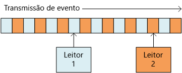

# <a name="designing-microservices-ingestion-and-workflow"></a>Criando microsserviços: ingestão e fluxo de trabalho

Os microsserviços normalmente têm um fluxo de trabalho que abrange vários serviços para uma única transação. O fluxo de trabalho deve ser confiável; ele não pode perder transações nem deixá-las em um estado parcialmente concluído. Além disso, o controle da taxa de ingestão de solicitações de entrada é algo crítico. Com muitos serviços pequenos comunicando-se entre si, um grande volume de solicitações de entrada pode sobrecarregar a comunicação entre os serviços. 


## <a name="the-drone-delivery-workflow"></a>O fluxo de trabalho da entrega por drone

No aplicativo de entrega por drone, as seguintes operações devem ser executadas para o agendamento de uma entrega:

1. Verificar o status da conta do cliente (serviço de Conta).
2. Criar uma nova entidade de pacote (serviço de Pacote).
3. Verificar se é necessário algum serviço de transporte terceirizado para a entrega, de acordo com os locais da retirada e da entrega (serviço de Transporte terceirizado).
4. Agendar um drone para a retirada (serviço de Drone).
5. Criar uma nova entidade de entrega (serviço de Entrega).

Essa é a essência do aplicativo inteiro, portanto o processo todo deve ter alto desempenho e ser confiável. Alguns desafios específicos devem ser tratados:

- **Nivelamento de carga**. O excesso de solicitações de clientes pode sobrecarregar o sistema com o tráfego de rede entre os serviços. Isso também pode sobrecarregar as dependências de back-end, como os serviços de armazenamento ou remotos. Isso pode ocasionar a limitação dos serviços realizando as chamadas, o que cria pressão de retorno no sistema. Portanto, é importante nivelar a carga das solicitações que chegam ao sistema, armazenando-as em buffer ou colocando-as em fila para processamento. 

- **Entrega garantida**. Para evitar a remoção de solicitações de clientes, o componente de ingestão deverá assegurar a entrega de mensagens pelo menos uma vez. 

- **Manipulação de erros**. Se algum dos serviços retornar um código de erro ou apresentar uma falha não transitória, a entrega não poderá ser agendada. Um código de erro pode indicar uma condição de erro esperada (por exemplo, a conta do cliente está suspensa) ou um erro de servidor inesperado (HTTP 5xx). Há também a possibilidade de um serviço não estar disponível, fazendo com que a chamada de rede atinja o tempo limite. 

Em primeiro lugar, examinaremos o lado da ingestão da equação: como o sistema pode ingerir solicitações de entrada do usuário com alta produtividade. Em seguida, consideraremos como o aplicativo de entrega por drone pode implementar um fluxo de trabalho confiável. Na verdade, o design do subsistema de ingestão afeta o back-end do fluxo de trabalho. 

## <a name="ingestion"></a>Ingestão

Com base nos requisitos comerciais, a equipe de desenvolvimento identificou os seguintes requisitos não funcionais para a ingestão:

- Produtividade constante de 10 mil solicitações/s.
- Capacidade de lidar com picos de até 50 mil/s sem remover solicitações de cliente nem atingir o tempo limite.
- Latência inferior a 500 ms em 99% do tempo.

O requisito para lidar com picos ocasionais de tráfego apresenta um desafio de design. Em teoria, o sistema pode ser escalado horizontalmente para manipular o tráfego máximo esperado. No entanto, provisionar uma quantidade tão grande de recursos como essa seria muito ineficiente. Na maioria das vezes, o aplicativo não precisará dessa capacidade, portanto haverá núcleos ociosos custando dinheiro sem adicionar valor.

Uma abordagem melhor é colocar as solicitações de entrada em um buffer e deixá-lo atuar como um nivelador de carga. Com esse design, o serviço de Ingestão deve lidar com a taxa máxima de ingestão em curtos períodos, mas os serviços de back-end precisam apenas lidar com a carga constante máxima. Ao armazenar em buffer no front-end, os serviços de back-end não precisarão lidar com grandes picos no tráfego. Na escala necessária para o aplicativo de entrega por drone, os [Hubs de Eventos do Azure](/azure/event-hubs/) é uma boa escolha para o nivelamento de carga. Os Hubs de Eventos oferecem baixa latência e alta produtividade, além de ser uma solução econômica em altos volumes de ingestão. 

Para nossos testes, usamos um hub de eventos da camada Standard com 32 partições e 100 unidades de produtividade. Observamos uma ingestão de aproximadamente 32 mil eventos por segundo, com latência de 90 ms. No momento, o limite padrão é de 20 unidades de produtividade, mas os clientes do Azure podem solicitar unidades de produtividade adicionais por meio de uma solicitação de suporte. Veja [Cotas de Hubs de Eventos](/azure/event-hubs/event-hubs-quotas) para obter mais informações. Como em todas as métricas de desempenho, muitos fatores podem afetar o desempenho, como o tamanho do conteúdo da mensagem, portanto não interprete esses números como um parâmetro de comparação. Se uma produtividade maior for necessária, o serviço de Ingestão poderá ser fragmentado em mais de um hub de eventos. Para taxas de produtividade ainda maiores, os [Hubs de Eventos Dedicados](/azure/event-hubs/event-hubs-dedicated-overview) oferecem implantações de locatário único para a entrada de mais de 2 milhões de eventos por segundo.

É importante entender como os Hubs de Eventos podem alcançar uma produtividade tão alta, porque isso afeta como um cliente deve consumir as mensagens dos Hubs de Eventos. Os Hubs de Eventos não implementam uma *fila*. Em vez disso, eles implementam um *fluxo de eventos*. 

Com uma fila, um consumidor individual poderá remover uma mensagem da fila e o próximo consumidor não verá essa mensagem. As filas, portanto, permitem que você use um [Padrão de consumidores concorrentes](../patterns/competing-consumers.md) para processar mensagens em paralelo e melhorar a escalabilidade. Para maior resiliência, o consumidor mantém um bloqueio na mensagem e libera-o quando termina de processá-la. Se o consumidor falhar, por exemplo, por causa de uma falha no nó em que ele é executado, o bloqueio atingirá o tempo limite e a mensagem voltará à fila. 


Os Hubs de Eventos, por outro lado, usam a semântica de streaming. Os consumidores leem o fluxo de forma independente em seu próprio ritmo. Cada consumidor é responsável por manter o controle da sua posição atual no fluxo. Um consumidor deve gravar sua posição atual no armazenamento persistente em um intervalo predefinido. Dessa forma, se o consumidor apresentar uma falha (por exemplo, falhas do consumidor ou do host), uma nova instância poderá retomar a leitura do fluxo da última posição gravada. Esse processo é chamado *ponto de verificação*. 

Por motivos de desempenho, um consumidor normalmente não realiza o ponto de verificação depois de cada mensagem. Em vez disso, ele realiza o ponto de verificação em um intervalo fixo, por exemplo, depois de processar *n* mensagens ou a cada *n* segundos. Como consequência, se um consumidor falhar, alguns eventos poderão ser processados duas vezes, porque uma nova instância sempre continuará do último ponto de verificação. Há dois lados da mesma moeda: pontos de verificação frequentes podem prejudicar o desempenho, mas pontos de verificação esparsos significam que você reproduzirá mais eventos após uma falha.  


 
Os Hubs de Eventos não são projetados para consumidores concorrentes. Embora vários consumidores possam ler um fluxo, cada um deles percorre-o de forma independente. Em vez disso, os Hubs de Eventos usam um padrão de consumidor particionado. Um hub de eventos tem até 32 partições. A escala horizontal é obtida atribuindo um consumidor separado a cada partição.

O que isso significa para o fluxo de trabalho da entrega por drone? Para obter todos os benefícios dos Hubs de Eventos, o Agendador de Entregas não pode esperar o processamento de cada mensagem antes de passar para a próxima. Se fizer isso, passará a maior parte do tempo aguardando a conclusão das chamadas de rede. Em vez disso, ele precisa processar lotes de mensagens em paralelo, usando chamadas assíncronas aos serviços de back-end. Como veremos, escolher a estratégia de ponto de verificação correta também é importante.  

## <a name="workflow"></a>Fluxo de trabalho

Analisamos três opções de leitura e de processamento das mensagens: o Host do Processador de Eventos, as filas do Barramento de Serviço e a biblioteca do IoTHub React. Escolhemos o IoTHub React, mas para entender o porquê, será mais fácil começar pelo Host do Processador de Eventos. 

### <a name="event-processor-host"></a>Host do processador de eventos

O Host do Processador de Eventos foi projetado para o envio em lote de mensagens. O aplicativo implementa a interface `IEventProcessor` e o Host do Processador cria uma instância do processador de eventos para cada partição no hub de eventos. Em seguida, o Host do Processador de Eventos chama cada método `ProcessEventsAsync` do processador de eventos com lotes de mensagens de eventos. O aplicativo controla quando realizar o ponto de verificação no método `ProcessEventsAsync` e o Host do Processador de Eventos grava os pontos de verificação no armazenamento do Azure. 

Em uma partição, o Host do Processador de Eventos espera que `ProcessEventsAsync` seja retornado antes de chamar novamente o próximo lote. Essa abordagem simplifica o modelo de programação, uma vez que o código de processamento de eventos não precisa ser reentrante. No entanto, isso também significa que o processador de eventos manipula um lote por vez e isso limita a velocidade de envio de mensagens do Host do Processador.

> [!NOTE] 
> O Host do Processador não *espera* no sentido de bloquear um thread. O método `ProcessEventsAsync` é assíncrono, portanto o Host do Processador poderá executar outras tarefas enquanto o método estiver sendo concluído. No entanto, ele não entregará outro lote de mensagens para essa partição até o método ser retornado. 

No aplicativo de entrega por drone, um lote de mensagens pode ser processado em paralelo. No entanto, esperar a conclusão de um lote inteiro ainda poderá causar um gargalo. A velocidade de processamento depende da mensagem mais lenta no lote. Qualquer variação de tempos de resposta pode criar uma espera longa, em que algumas respostas lentas retardam todo o sistema. Nossos testes de desempenho mostraram que não alcançamos nossa meta de produtividade usando essa abordagem. Isso *não* significa que você deva evitar usar o Host do Processador de Eventos. No entanto, para obter alta produtividade, evite tarefas de longa execução no método `ProcesssEventsAsync`. Processe cada lote rapidamente.

### <a name="iothub-react"></a>IoTHub React 

O [IoTHub React](https://github.com/Azure/toketi-iothubreact) é uma biblioteca do Akka Streams para a leitura de eventos do Hub de Eventos. O Akka Streams é uma estrutura de programação baseada em fluxo que implementa a especificação [Reactive Streams](http://www.reactive-streams.org/). Ele fornece uma maneira de criar pipelines de streaming eficientes, em que todas as operações de streaming são executadas de maneira assíncrona e o pipeline manipula normalmente a pressão de retorno. A pressão de retorno ocorre quando uma origem do evento gera eventos mais rapidamente que os consumidores downstream podem recebê-los, o que ocorre exatamente quando o sistema de entrega por drone tem um pico de tráfego. Se os serviços de back-end ficarem mais lentos, o IoTHub React também ficará lento. Se a capacidade for aumentada, o IoTHub React enviará por push mais mensagens pelo pipeline.

O Akka Streams também é um modelo de programação muito natural para o streaming de eventos dos Hubs de Eventos. Em vez de fazer um loop por meio de um lote de eventos, você definirá um conjunto de operações que serão aplicadas a cada evento e deixara que o Akka Streams manipule o streaming. O Akka Streams define um pipeline de streaming em termos de *Origens*, de *Fluxos* e de *Coletores*. Uma origem gera um fluxo de saída, um fluxo processa um fluxo de entrada e produz um fluxo de saída e um coletor consome um fluxo sem produzir nenhuma saída.

Veja abaixo o código no serviço de Agendador que configura o pipeline do Akka Streams:

```java
IoTHub iotHub = new IoTHub();
Source<MessageFromDevice, NotUsed> messages = iotHub.source(options);

messages.map(msg -> DeliveryRequestEventProcessor.parseDeliveryRequest(msg))
        .filter(ad -> ad.getDelivery() != null).via(deliveryProcessor()).to(iotHub.checkpointSink())
        .run(streamMaterializer);
```

Este código configura os Hubs de Eventos como uma origem. A instrução `map` desserializa toda mensagem de evento em uma classe Java que representa uma solicitação de entrega. A instrução `filter` remove qualquer objeto `null` do fluxo; ela protege nos casos em que uma mensagem não pode ser desserializada. A instrução `via` une a origem a um fluxo que processa cada solicitação de entrega. O método `to` une o fluxo ao coletor de ponto de verificação, que é inserido no IoTHub React.

O IoTHub React usa uma estratégia de ponto de verificação diferente que a do Host do Processador de Eventos. Os pontos de verificação são gravados pelo coletor de ponto de verificação, que é o estágio de encerramento no pipeline. O design de Akka Streams permite que o pipeline continue o streaming de dados enquanto o coletor grava o ponto de verificação. Isso significa que os estágios de processamento upstream não precisam esperar que o ponto de verificação ocorra. Você pode configurar o ponto de verificação para ocorrer após um tempo limite ou após o processamento de um determinado número de mensagens.

O método `deliveryProcessor` cria o fluxo do Akka Streams:  

```java
private static Flow<AkkaDelivery, MessageFromDevice, NotUsed> deliveryProcessor() {
    return Flow.of(AkkaDelivery.class).map(delivery -> {
        CompletableFuture<DeliverySchedule> completableSchedule = DeliveryRequestEventProcessor
                .processDeliveryRequestAsync(delivery.getDelivery(), 
                        delivery.getMessageFromDevice().properties());
        
        completableSchedule.whenComplete((deliverySchedule,error) -> {
            if (error!=null){
                Log.info("failed delivery" + error.getStackTrace());
            }
            else{
                Log.info("Completed Delivery",deliverySchedule.toString());
            }
                                
        });
        completableSchedule = null;
        return delivery.getMessageFromDevice();
    });
}
```

O fluxo chama um método `processDeliveryRequestAsync` estático que executa o trabalho real do processamento de cada mensagem.

### <a name="scaling-with-iothub-react"></a>Dimensionamento com o IoTHub React

O serviço de Agendador é projetado para que cada instância de contêiner leia de uma única partição. Por exemplo, se o Hub de Eventos tiver 32 partições, o serviço de Agendador será implantado com 32 réplicas. Isso permite uma grande flexibilidade em termos de dimensionamento horizontal. 

Dependendo do tamanho do cluster, um nó no cluster pode ter mais de um pod de serviço de Agendador em execução nele. No entanto, se o serviço de Agendador precisar de mais recursos, o cluster poderá ser escalado horizontalmente para distribuir os pods entre mais nós. Nossos testes de desempenho mostraram que o serviço de Agendador está relacionado à memória e aos threads, portanto o desempenho depende muito do tamanho da VM e do número de pods por nó.

Cada instância precisa saber de qual partição dos Hubs de Eventos deverá ler. Para configurar o número de partição, usamos o tipo de recurso [StatefulSet](https://kubernetes.io/docs/concepts/workloads/controllers/statefulset/) no Kubernetes. Os pods de um StatefulSet têm um identificador persistente que inclui um índice numérico. Para ser mais específico, o nome do pod é `<statefulset name>-<index>` e esse valor está disponível para o contêiner por meio da [API Downward](https://kubernetes.io/docs/tasks/inject-data-application/downward-api-volume-expose-pod-information/) do Kubernetes. No tempo de execução, o serviço de Agendador lê o nome do pod e usa o índice do pod como a ID da partição.

Se for necessário expandir o serviço de Agendador ainda mais, você poderá atribuir mais de um pod por partição do hub de eventos, para que vários pods leiam cada partição. No entanto, nesse caso, cada instância leria todos os eventos na partição atribuída. Para evitar o processamento duplicado, use um algoritmo de hash para que cada instância ignore uma parte das mensagens. Dessa forma, vários leitores poderão consumir o fluxo, mas toda mensagem será processada por apenas uma instância. 
 


### <a name="service-bus-queues"></a>Filas do Barramento de Serviço

Uma terceira opção que consideramos foi copiar mensagens dos Hubs de Eventos para uma fila do Barramento de Serviço e, em seguida, fazer com que o serviço de Agendador lesse as mensagens do Barramento de Serviço. Pode parecer estranho a gravação de solicitações de entrada nos Hubs de Eventos somente para copiá-las no Barramento de Serviço.  No entanto, a ideia era aproveitar os diferentes pontos fortes de cada serviço: usar os Hubs de Eventos para absorver picos de tráfego intenso e, ao mesmo tempo, aproveitar a semântica de fila no Barramento de Serviço para processar a carga de trabalho com um padrão de consumidores concorrentes. Lembre-se de que nossa meta para a produtividade constante é menor que a nossa carga de pico esperada, portanto o processamento da fila do Barramento de Serviço não precisaria ser tão rápido quanto a ingestão de mensagem.
 
Com essa abordagem, nossa implementação de prova de conceito conseguiu aproximadamente 4 mil operações por segundo. Esses testes usaram serviços de back-end fictícios que não fizeram nenhum trabalho real, mas simplesmente adicionaram uma quantidade fixa de latência por serviço. Observe que nossos números de desempenho foram muito menores que o máximo teórico do Barramento de Serviço. Entre os possíveis motivos para a discrepância estão:

- Não há valores ideais para vários parâmetros de cliente, como o limite do pool de conexões, o grau de paralelização, a contagem de pré-busca e o tamanho do lote.

- Gargalos de E/S de rede.

- Uso do modo [PeekLock](/rest/api/servicebus/peek-lock-message-non-destructive-read) em vez de [ReceiveAndDelete](/rest/api/servicebus/receive-and-delete-message-destructive-read), que era necessário para garantir a entrega de mensagens pelo menos uma vez.

Testes de desempenho adicionais poderiam ter descoberto a causa raiz e permitido que resolvêssemos esses problemas. No entanto, o IoTHub React atendeu à nossa meta de desempenho, portanto escolhemos essa opção. Sendo assim, o Barramento de Serviço é uma opção viável para esse cenário.

## <a name="handling-failures"></a>Tratamento de falhas 

Há três classes gerais de falha a serem consideradas.

1. Um serviço downstream pode ter uma falha não transitória, que é qualquer falha que provavelmente não desapareça por si só. As falhas não transitórias incluem condições de erro normais, como uma entrada inválida para um método. Elas também incluem exceções sem tratamento no código do aplicativo ou uma falha de processo. Se esse tipo de erro ocorrer, a transação comercial inteira deverá ser marcada como uma falha. Será necessário desfazer as outras etapas na mesma transação que já foram concluídas com êxito. (Veja Transações de compensação abaixo.)
 
2. Um serviço de downstream pode apresentar uma falha temporária, como tempo limite de rede atingido. Esses erros normalmente podem ser resolvidos simplesmente ao tentar a chamada novamente. Se a operação ainda falhar após um determinado número de tentativas, ela será considerada uma falha não transitória. 

3. O serviço de Agendador em si pode falhar (por exemplo, por causa de uma falha no nó). Nesse caso, o Kubernetes abrirá uma nova instância do serviço. No entanto, as transações ainda em andamento deverão ser retomadas. 

## <a name="compensating-transactions"></a>Transações de compensação

Se ocorrer uma falha não transitória, a transação atual poderá estar em um estado de *falha parcial*, em que uma ou mais etapas já foram concluídas com êxito. Por exemplo, se o serviço de drone já tiver agendado um drone, ele deverá ser cancelado. Nesse caso, o aplicativo deverá desfazer as etapas concluídas com êxito usando uma [transação de compensação](../patterns/compensating-transaction.md). Em alguns casos, isso deve ser feito por um sistema externo ou até mesmo por um processo manual. 

Se a lógica das transações de compensação for complexa, considere a criação de um serviço separado responsável por esse processo. No aplicativo de entrega por drone, o serviço de Agendador coloca as operações com falha em uma fila dedicada. Um microsserviço separado, chamado Supervisor, lê dessa fila e chama uma API de cancelamento nos serviços que precisam ser compensados. Essa é uma variação do [Padrão de Supervisor de Agente do Agendador][scheduler-agent-supervisor]. O serviço de Supervisor também pode executar outras ações, como notificar o usuário por e-mail ou por SMS ou enviar um alerta para um painel de operações. 


## <a name="idempotent-vs-non-idempotent-operations"></a>Operações idempotentes e não idempotentes

Para evitar a perda das solicitações, o serviço de Agendador deve assegurar que todas as mensagens sejam processadas pelo menos uma vez. Os Hubs de Eventos poderão assegurar a entrega pelo menos uma vez se o cliente realizar o ponto de verificação corretamente.

Se o serviço de Agendador falhar, poderá ser no meio do processamento de uma ou mais solicitações de cliente. Essas mensagens serão retiradas por outra instância do Agendador e reprocessadas. O que acontece se uma solicitação é processada duas vezes? É importante evitar a duplicação de qualquer trabalho. Afinal, não desejamos que o sistema envie dois drones para o mesmo pacote.

Uma abordagem é criar todas as operações para que sejam idempotentes. Uma operação será idempotente se puder ser chamada várias vezes sem produzir efeitos colaterais adicionais após a primeira chamada. Em outras palavras, um cliente poderá invocar a operação uma, duas ou muitas vezes e o resultado será o mesmo. O serviço basicamente deve ignorar chamadas duplicadas. Para um método com efeitos colaterais ser idempotentes, o serviço deverá ter a capacidade de detectar chamadas duplicadas. Por exemplo, você pode solicitar que o responsável pela chamada atribua a ID, em vez de o serviço gerar uma nova ID. Com isso, o serviço pode verificar se há IDs duplicadas.

> [!NOTE]
> A especificação do HTTP declara que os métodos GET, PUT e DELETE devem ser idempotentes. Não há garantia que os métodos POST sejam idempotentes. Se um método POST criar um novo recurso, normalmente não haverá nenhuma garantia de que a operação será idempotente. 

Nem sempre é simples gravar um método idempotente. Outra opção é o Agendador acompanhar o andamento de todas as transações de um repositório durável. Sempre que uma mensagem fosse processada, ele consultaria o estado no repositório durável. Depois de cada etapa, ele gravaria o resultado no repositório. Pode haver implicações de desempenho nessa abordagem.

## <a name="example-idempotent-operations"></a>Exemplo: operações idempotentes

A especificação do HTTP declara que os métodos PUT devem ser idempotentes. A especificação define idempotente da seguinte forma:

>  Um método de solicitação será considerado "idempotente" se o efeito desejado no servidor de várias solicitações idênticas com esse método for o mesmo efeito de uma única solicitação como essa. ([RFC 7231](https://tools.ietf.org/html/rfc7231#section-4))

É importante entender a diferença entre a semântica de PUT e de POST ao criar uma nova entidade. Em ambos os casos, o cliente envia uma representação de uma entidade no corpo da solicitação. No entanto, o significado do URI é diferente.

- Para um método POST, o URI representa um recurso pai da nova entidade, como uma coleção. Por exemplo, para criar uma nova entrega, o URI pode ser `/api/deliveries`. O servidor cria a entidade e atribui a ela um novo URI, como `/api/deliveries/39660`. Esse URI é retornado no cabeçalho de Localização da resposta. Cada vez que o cliente enviar uma solicitação, o servidor criará uma nova entidade com um novo URI.

- Para um método PUT, o URI identifica a entidade. Se já existir uma entidade com esse URI, o servidor substituirá a entidade existente pela versão na solicitação. Se nenhuma entidade existir com esse URI, o servidor criará uma. Por exemplo, suponha que o cliente envie uma solicitação PUT para `api/deliveries/39660`. Pressupondo que não exista nenhuma entrega com esse URI, o servidor criará uma nova. Agora se o cliente enviar a mesma solicitação novamente, o servidor substituirá a entidade existente.

Veja abaixo a implementação do serviço de Entrega do método PUT. 

```csharp
[HttpPut("{id}")]
[ProducesResponseType(typeof(Delivery), 201)]
[ProducesResponseType(typeof(void), 204)]
public async Task<IActionResult> Put([FromBody]Delivery delivery, string id)
{
    logger.LogInformation("In Put action with delivery {Id}: {@DeliveryInfo}", id, delivery.ToLogInfo());
    try
    {
        var internalDelivery = delivery.ToInternal();

        // Create the new delivery entity.
        await deliveryRepository.CreateAsync(internalDelivery);

        // Create a delivery status event.
        var deliveryStatusEvent = new DeliveryStatusEvent { DeliveryId = delivery.Id, Stage = DeliveryEventType.Created };
        await deliveryStatusEventRepository.AddAsync(deliveryStatusEvent);

        // Return HTTP 201 (Created)
        return CreatedAtRoute("GetDelivery", new { id= delivery.Id }, delivery);
    }
    catch (DuplicateResourceException)
    {
        // This method is mainly used to create deliveries. If the delivery already exists then update it.
        logger.LogInformation("Updating resource with delivery id: {DeliveryId}", id);

        var internalDelivery = delivery.ToInternal();
        await deliveryRepository.UpdateAsync(id, internalDelivery);

        // Return HTTP 204 (No Content)
        return NoContent();
    }
}
```

Espera-se que a maioria das solicitações criará uma nova entidade, portanto o método chamará de maneira otimista `CreateAsync` no objeto de repositório e, em seguida, tratará as exceções de recurso duplicado atualizando o recurso. 

> [!div class="nextstepaction"]
> [Gateways de API](./gateway.md)

<!-- links -->

[scheduler-agent-supervisor]: ../patterns/scheduler-agent-supervisor.md