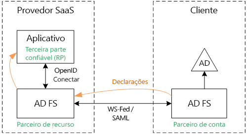
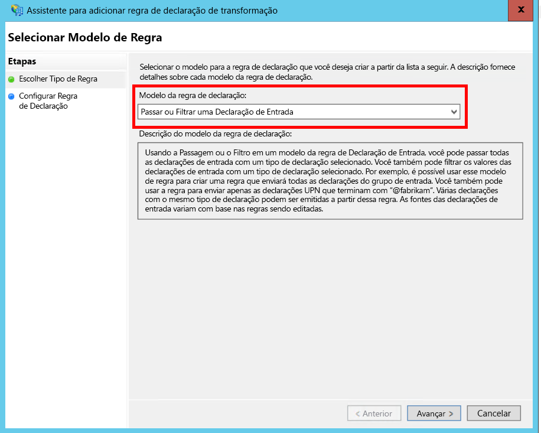
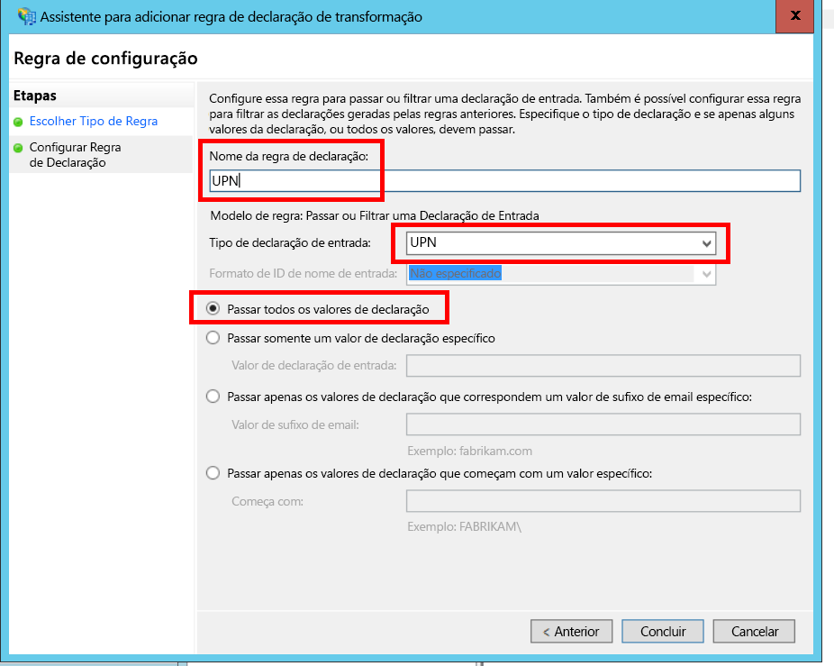
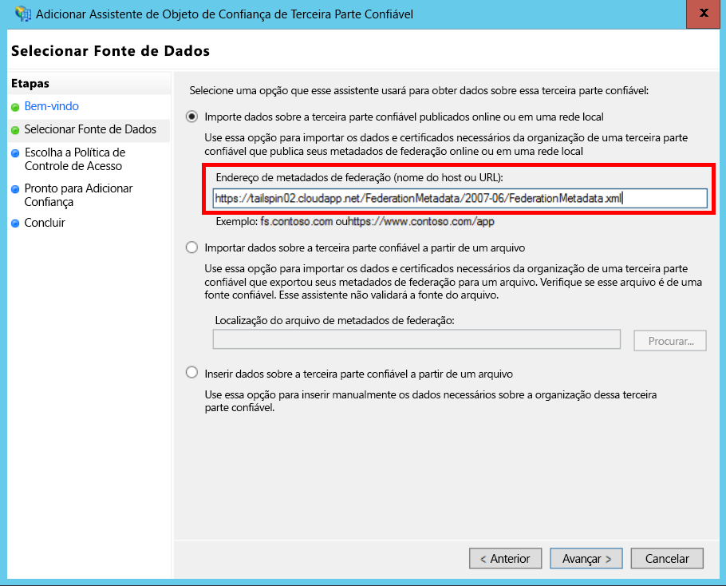
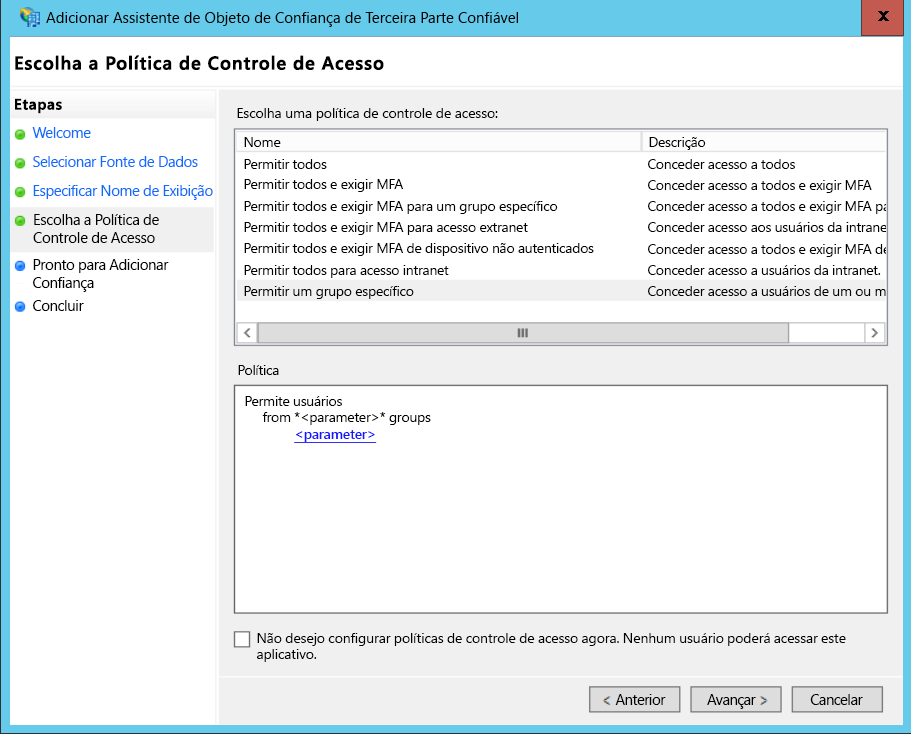
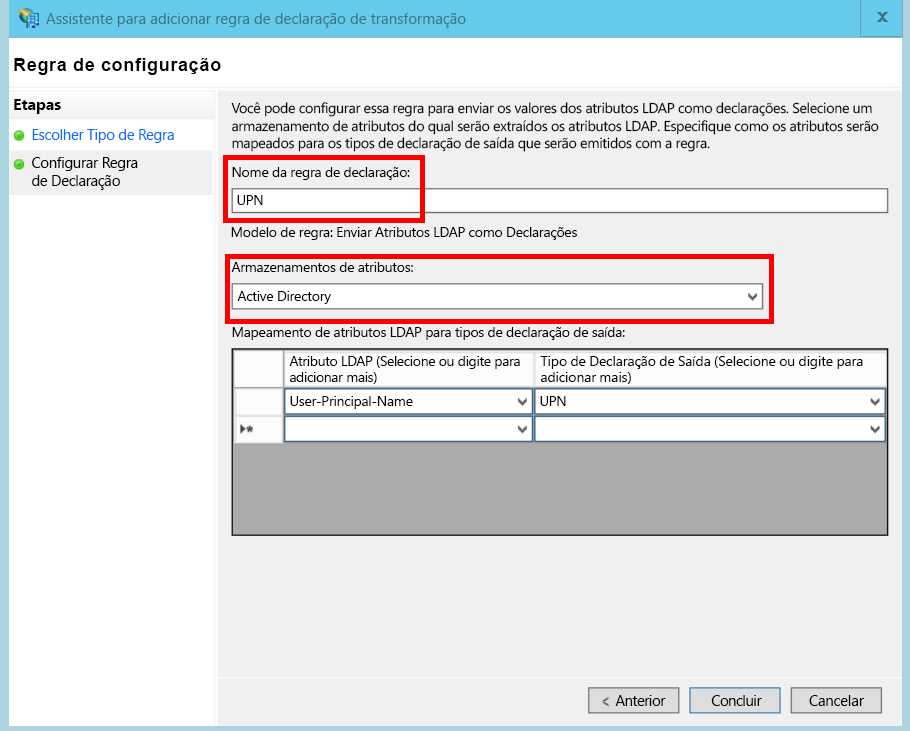
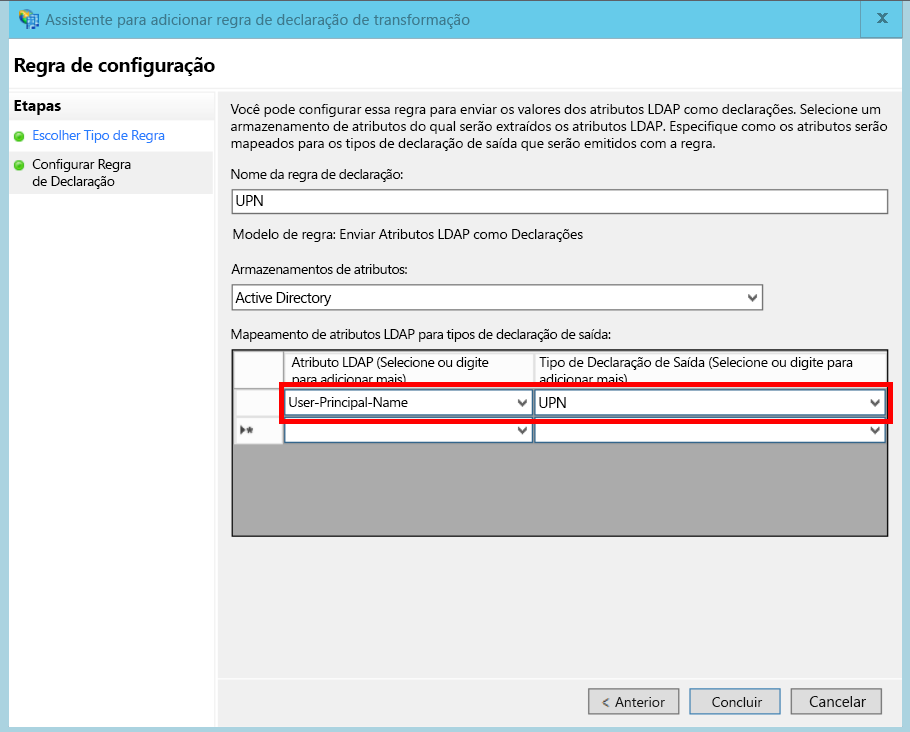

# <a name="federate-with-a-customers-ad-fs"></a>Federar com o AD FS de um cliente

Este artigo descreve como um aplicativo SaaS multilocatário pode oferecer suporte à autenticação por meio do AD FS (Serviços de Federação do Active Directory) para federar com o AD FS de um cliente.

## <a name="overview"></a>Visão geral
O Azure AD (Azure Active Directory) facilita a entrada de usuários a partir de locatários do Azure AD, incluindo clientes do Office365 e do Dynamics CRM Online. Mas e quanto aos clientes que usam o Active Directory local em uma intranet corporativa?

Uma opção seria esses clientes sincronizarem o AD local com o Azure AD, usando o [Azure AD Connect]. No entanto, talvez alguns clientes não consigam usar essa abordagem devido à política de TI corporativa ou por outros motivos. Nesse caso, outra opção é a federação por meio do AD FS (Serviços de Federação do Active Directory).

Para habilitar este cenário:

* O cliente deve ter um farm do AD FS voltado para a Internet.
* O provedor de SaaS implanta seu próprio farm do AD FS.
* O cliente e o provedor de SaaS devem configurar a [confiança de federação]. Esse é um processo manual.

Há três funções principais na relação de confiança:

* O AD FS do cliente é o [parceiro de conta], responsável por autenticar usuários do AD do cliente e criar tokens de segurança com declarações de usuário.
* O AD FS do provedor de SaaS é o [parceiro de recurso], que confia no parceiro de conta e recebe as declarações de usuário.
* O aplicativo é configurado como uma RP (terceira parte confiável) no AD FS do provedor de SaaS.
  
  

> [!NOTE]
> Neste artigo, supomos que o aplicativo use OpenID Connect como o protocolo de autenticação. Outra opção é usar o WS-Federation.
> 
> Para o OpenID Connect, o provedor de SaaS deve usar o AD FS 2016, em execução no Windows Server 2016. O AD FS 3.0 não oferece suporte para o OpenID Connect.
> 
> O ASP.NET Core não inclui suporte nativo para a especificação Web Services Federation.
> 
> 

Para obter um exemplo do uso da especificação Web Services Federation com ASP.NET 4, veja o [exemplo active-directory-dotnet-webapp-wsfederation][active-directory-dotnet-webapp-wsfederation].

## <a name="authentication-flow"></a>Fluxo de autenticação
1. Quando o usuário clicar em "entrar", o aplicativo será redirecionado para um ponto de extremidade do OpenID Connect sobre o AD FS do provedor de SaaS.
2. O usuário insere seu nome de usuário da organização ("`alice@corp.contoso.com`"). O AD FS usa a descoberta de realm inicial para redirecionar o AD FS do cliente, no qual o usuário insere suas credenciais.
3. O AD FS do cliente envia declarações de usuário para o AD FS do provedor de SaaS, usando o WF-Federation (ou SAML).
4. Fluxo de declarações do AD FS para o aplicativo, usando o OpenID Connect. Isso exige uma transição de protocolo do WS-Federation.

## <a name="limitations"></a>Limitações
Por padrão, o aplicativo de terceira parte recebe apenas um conjunto fixo de declarações disponíveis no id_token, mostrado na tabela a seguir. Com o AD FS 2016, você pode personalizar o id_token em cenários de OpenID Connect. Para saber mais, veja [Tokens de ID personalizados do AD FS](/windows-server/identity/ad-fs/development/customize-id-token-ad-fs-2016).

| Declaração | DESCRIÇÃO |
| --- | --- |
| aud |Público-alvo. O aplicativo para o qual as declarações foram emitidas. |
| authenticationinstant |[Instante da autenticação]. A hora em que a autenticação ocorreu. |
| c_hash |Valor hash do código. Este é um hash do conteúdo do token. |
| exp |[Hora de expiração]. O tempo após o qual o token não será mais aceito. |
| iat |Emitido em. A hora em que o token foi emitido. |
| iss |Emissor. O valor dessa declaração sempre será o AD FS do parceiro de recurso. |
| Nome |Nome de usuário. Exemplo: `john@corp.fabrikam.com` |
| nameidentifier |[Identificador de nome]. O identificador d o nome da entidade para a qual o token foi emitido. |
| nonce |Nonce de sessão. Um valor exclusivo gerado pelo AD FS para ajudar a evitar ataques de repetição. |
| upn |Nome UPN. Exemplo: `john@corp.fabrikam.com` |
| pwd_exp |Período de expiração de senha. O número de segundos de validade da senha do usuário ou de um segredo de autenticação semelhante, como um PIN. expira. |

> [!NOTE]
> A declaração "iss" contém o AD FS do parceiro (normalmente, essa declaração identificará o provedor de SaaS como o emissor). Ela não identifica AD FS do cliente. Você pode encontrar o domínio do cliente como parte do UPN.
> 
> 

O restante deste artigo descreve como configurar a relação de confiança entre o RP (o aplicativo) e o parceiro de conta (o cliente).

## <a name="ad-fs-deployment"></a>Implantação do AD FS
O provedor de SaaS pode implantar o AD FS no local ou em VMs do Azure. É importante seguir estas diretrizes para obter segurança e disponibilidade:

* Implante pelo menos dois servidores do AD FS e dois servidores proxy do AD FS para atingir a melhor disponibilidade do serviço AD FS.
* Os controladores de domínio e servidores do AD FS nunca devem ser expostos diretamente à Internet e devem estar em uma rede virtual com acesso direto a elas.
* Os proxies do aplicativo Web (antes conhecidos como proxies do AD FS) devem ser usados para publicar servidores do AD FS na Internet.

Para configurar uma topologia semelhante no Azure é preciso usar redes virtuais, NSGs, VMs do azure e conjuntos de disponibilidade. Para obter mais detalhes, confira [Diretrizes para implantar o Active Directory do Windows Server em máquinas virtuais do Azure][active-directory-on-azure].

## <a name="configure-openid-connect-authentication-with-ad-fs"></a>Configurar a autenticação do OpenID Connect com o AD FS
O provedor de SaaS deve habilitar o OpenID Connect entre o aplicativo e do AD FS. Para fazer isso, adicione um grupo de aplicativos ao AD FS.  Você pode encontrar instruções detalhadas nesta [postagem do blog], em " Setting up a Web App for OpenId Connect sign in AD FS". 

Em seguida, configure o middleware OpenID Connect. O ponto de extremidade de metadados é `https://domain/adfs/.well-known/openid-configuration`, no qual o domínio é o domínio do AD FS do provedor de SaaS.

Normalmente, você pode combinar esse a outros pontos de extremidade do OpenID Connect (por exemplo, AAD). Você precisará de dois botões de entrada diferentes, ou alguma outra maneira para diferenciá-los, para que o usuário seja enviado ao ponto de extremidade de autenticação correto.

## <a name="configure-the-ad-fs-resource-partner"></a>Configurar o parceiro de recursos do AD FS
O provedor de SaaS deve fazer o seguinte para cada cliente que deseja se conectar via ADFS:

1. Adicionar uma relação de confiança do provedor de declarações.
2. Adicionar regras de declarações.
3. Habilitar a descoberta de realm inicial.

Veja as etapas com mais detalhes.

### <a name="add-the-claims-provider-trust"></a>Adicionar a relação de confiança do provedor de declarações
1. No Gerenciador do Servidor, clique em **Ferramentas** e depois selecione **Gerenciamento do AD FS**.
2. Na árvore de console, em **AD FS**, clique com botão direito do mouse em **Confianças do Provedor de Declarações**. Selecione **Adicionar a Relação de Confiança do Provedor de Declarações**.
3. Clique em **Iniciar** para iniciar o assistente.
4. Selecione os opção "Importar dados sobre o provedor de declarações publicados online ou em uma rede local". Digite o URI do ponto de extremidade de metadados de federação do cliente. (Exemplo: `https://contoso.com/FederationMetadata/2007-06/FederationMetadata.xml`). Você precisará obter isso do cliente.
5. Conclua o assistente usando as opções padrão.

### <a name="edit-claims-rules"></a>Editar regras de declarações
1. Clique com o botão direito do mouse na relação de confiança de provedor de declarações recém-adicionada e selecione **Editar Regras de Declarações**.
2. Clique em **Adicionar Regra**.
3. Selecione "Passar ou Filtrar uma Declaração de Entrada" e clique em **Avançar**.
   
4. Insira um nome para a regra.
5. Em "Tipo de declaração de entrada", selecione **UPN**.
6. Selecione "Passar todos os valores de declaração".
   
7. Clique em **Concluir**.
8. Repita as etapas 2 a 7 e especifique o **Tipo de Declaração de Ancoragem** do tipo de declaração de entrada.
9. Clique em **OK** para concluir o assistente.

### <a name="enable-home-realm-discovery"></a>Habilitar a descoberta de realm inicial
Execute o seguinte script do PowerShell:

```
Set-ADFSClaimsProviderTrust -TargetName "name" -OrganizationalAccountSuffix @("suffix")
```

onde "name" é o nome amigável da relação de confiança do provedor de declarações e "suffix" é o sufixo UPN do AD do cliente (por exemplo, "corp.fabrikam.com").

Com essa configuração, os usuários finais podem digitar sua conta institucional e o AD FS selecionará automaticamente o provedor de declarações correspondente. Confira [Personalizando as páginas de entrada do AD FS], na seção "Configurar o Provedor de Identidade para usar determinados sufixos de email".

## <a name="configure-the-ad-fs-account-partner"></a>Configurar o Parceiro de Conta do AD FS
Os cliente deve fazer o seguinte:

1. Adicionar uma relação de confiança da RP (terceira parte confiável)
2. Adiciona regras de declarações.

### <a name="add-the-rp-trust"></a>Adicionar a relação de confiança da RP
1. No Gerenciador do Servidor, clique em **Ferramentas** e depois selecione **Gerenciamento do AD FS**.
2. Na árvore de console, em **AD FS**, clique com o botão direito do mouse em **Confianças da Terceira Parte Confiável**. Selecione **Adicionar Relação de Confiança de Terceira Parte Confiável**.
3. Selecione **Com Reconhecimento de Declarações** e clique em **Iniciar**.
4. Na página **Selecionar Fonte de Dados** , selecione os opção "Importar dados sobre o provedor de declarações publicados online ou em uma rede local". Insira o URI do ponto de extremidade de metadados de federação do cliente.
   
5. Na página **Especificar Nome para Exibição** , insira qualquer nome.
6. Na página **Escolher Política de Controle de Acesso** , escolha uma política. Você pode permitir todos na organização ou escolher um grupo de segurança específico.
   
7. Insira todos os parâmetros necessários na caixa **Política**.
8. Clique em **Avançar** para concluir o assistente.

### <a name="add-claims-rules"></a>Adicionar regras de declarações
1. Clique com o botão direito do mouse na terceira parte confiável recém-adicionada e selecione **Editar Política de Emissão de Declaração**.
2. Clique em **Adicionar Regra**.
3. Selecione "Enviar Atributos do LDAP como Declarações" e clique em **Avançar**.
4. Insira um nome para a regra, como “UPN”.
5. Em **Armazenamento de atributos**, selecione **Active Directory**.
   
6. Na seção **Mapeamento de atributos LDAP** :
   * Em **Atributo LDAP**, selecione **User-Principal-Name**.
   * Em **Tipo de Declaração de Saída**, selecione **UPN**.
     
7. Clique em **Concluir**.
8. Clique em **Adicionar regra** novamente.
9. Selecione “Enviar Declarações Usando uma Regra Personalizada” e clique em **Avançar**.
10. Insira um nome para a regra, como “Tipo de Declaração de Ancoragem”.
11. Em **Regra personalizada**, insira o seguinte:
    
    ```
    EXISTS([Type == "http://schemas.microsoft.com/ws/2014/01/identity/claims/anchorclaimtype"])=>
    issue (Type = "http://schemas.microsoft.com/ws/2014/01/identity/claims/anchorclaimtype",
          Value = "http://schemas.xmlsoap.org/ws/2005/05/identity/claims/upn");
    ```
    
    Essa regra emite uma declaração de tipo `anchorclaimtype`. A declaração informa a terceira parte confiável para usar o UPN como a ID imutável. do usuário.
12. Clique em **Concluir**.
13. Clique em **OK** para concluir o assistente.


<!-- Links -->
[Azure AD Connect]: /azure/active-directory/active-directory-aadconnect/
[confiança de federação]: https://technet.microsoft.com/library/cc770993(v=ws.11).aspx
[parceiro de conta]: https://technet.microsoft.com/library/cc731141(v=ws.11).aspx
[parceiro de recurso]: https://technet.microsoft.com/library/cc731141(v=ws.11).aspx
[Instante da autenticação]: https://msdn.microsoft.com/library/system.security.claims.claimtypes.authenticationinstant%28v=vs.110%29.aspx
[Hora de expiração]: http://tools.ietf.org/html/draft-ietf-oauth-json-web-token-25#section-4.1.
[Identificador de nome]: https://msdn.microsoft.com/library/system.security.claims.claimtypes.nameidentifier(v=vs.110).aspx
[active-directory-on-azure]: https://msdn.microsoft.com/library/azure/jj156090.aspx
[postagem do blog]: http://www.cloudidentity.com/blog/2015/08/21/OPENID-CONNECT-WEB-SIGN-ON-WITH-ADFS-IN-WINDOWS-SERVER-2016-TP3/
[Personalizando as páginas de entrada do AD FS]: https://technet.microsoft.com/library/dn280950.aspx
[sample application]: https://github.com/mspnp/multitenant-saas-guidance
[client assertion]: client-assertion.md
[active-directory-dotnet-webapp-wsfederation]: https://github.com/Azure-Samples/active-directory-dotnet-webapp-wsfederation
