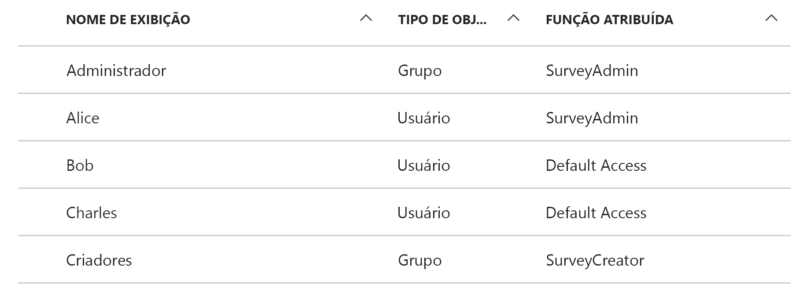
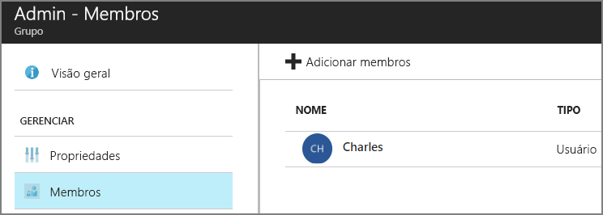

# <a name="application-roles"></a>Funções de aplicativo

[Código de exemplo do ][sample application]

As funções do aplicativo são usadas para atribuir permissões aos usuários. Por exemplo, o aplicativo [Tailspin Surveys][Tailspin] define as seguintes funções:

* Administrador. Pode executar todas as operações CRUD em qualquer pesquisa que pertença ao locatário.
* Criador. Pode criar novas pesquisas.
* Leitor. Pode ler todas as pesquisas que pertençam ao locatário.

Você pode ver que as funções são definitivamente traduzidas em permissões durante a [autorização]. No entanto, a primeira pergunta é como atribuir e gerenciar funções. Identificamos as três opções principais:

* [Funções de Aplicativo do Azure AD](#roles-using-azure-ad-app-roles)
* [Grupos de segurança do AD Azure](#roles-using-azure-ad-security-groups)
* [Gerenciador de funções do aplicativo](#roles-using-an-application-role-manager).

## <a name="roles-using-azure-ad-app-roles"></a>Funções usando funções de aplicativo do Azure AD
Essa é a abordagem que usamos no aplicativo Tailspin Surveys.

Nessa abordagem, o provedor de SaaS define as funções do aplicativo adicionando-as ao manifesto do aplicativo. Depois que um cliente se inscrever, um administrador do diretório do AD do cliente atribuirá usuários às funções. Quando um usuário entrar, as funções atribuídas ao usuário serão enviadas como declarações.

> [!NOTE]
> Se o cliente tiver o Azure AD Premium, o administrador poderá atribuir um grupo de segurança a uma função e os membros do grupo herdarão a função do aplicativo. Essa é uma maneira conveniente de gerenciar funções porque o proprietário do grupo não precisa ser um administrador do AD.
> 
> 

As vantagens dessa abordagem:

* Modelo de programação simples.
* As funções são específicas do aplicativo. As declarações de função para um aplicativo não são enviadas para outro aplicativo.
* Se o cliente remover o aplicativo do seu locatário do AD, as funções desaparecerão.
* O aplicativo não precisa de permissões extras do Active Directory além da leitura do perfil do usuário.

As desvantagens:

* Os clientes que não têm o Azure AD Premium não podem atribuir grupos de segurança a funções. Para esses clientes, todas as atribuições de usuário devem ser feitas por um administrador do AD.
* Se você tiver uma API Web de back-end, que é separada do aplicativo Web, as atribuições de função para o aplicativo Web não se aplicarão à API Web. Para obter mais informações sobre este ponto, confira [Protegendo uma API Web de back-end].

### <a name="implementation"></a>Implementação
**Defina as funções.** O provedor de SaaS declara as funções de aplicativo no [manifesto do aplicativo]. Por exemplo, esta é a entrada do manifesto do aplicativo Surveys:

```json
"appRoles": [
  {
    "allowedMemberTypes": [
      "User"
    ],
    "description": "Creators can create Surveys",
    "displayName": "SurveyCreator",
    "id": "1b4f816e-5eaf-48b9-8613-7923830595ad",
    "isEnabled": true,
    "value": "SurveyCreator"
  },
  {
    "allowedMemberTypes": [
      "User"
    ],
    "description": "Administrators can manage the Surveys in their tenant",
    "displayName": "SurveyAdmin",
    "id": "c20e145e-5459-4a6c-a074-b942bbd4cfe1",
    "isEnabled": true,
    "value": "SurveyAdmin"
  }
],
```

A propriedade `value` aparece na declaração de função. A propriedade `id` é o identificador exclusivo para a função definida. Gere sempre um novo valor de GUID para `id`.

**Atribua usuários**. Quando um novo cliente se inscrever, o aplicativo será registrado no locatário do AD do cliente. Neste ponto, um administrador do AD para o locatário poderá atribuir usuários a funções.

> [!NOTE]
> Como observado anteriormente, os clientes com o Azure AD Premium também podem atribuir grupos de segurança a funções.
> 
> 

A captura de tela a seguir no portal do Azure mostra os usuários e os grupos para o aplicativo Pesquisa. Administrador e Criador são grupos, atribuídos às funções SurveyAdmin e SurveyCreator, respectivamente. Alice é uma usuária que foi atribuída diretamente à função SurveyAdmin. Paulo e Davi são usuários que não foram atribuídos diretamente a uma função.



Conforme mostrado na seguinte captura de tela, Davi faz parte do grupo de administração, portanto ele herda a função SurveyAdmin. No caso de Paulo, ele ainda não teve uma função atribuída.




> [!NOTE]
> Como abordagem alternativa, o aplicativo pode atribuir funções programaticamente usando a API do Graph do Azure AD. No entanto, isso requer que o aplicativo obtenha permissões de gravação para o diretório do AD do cliente. Um aplicativo com essas permissões poderia causar muitos danos &mdash; o cliente confia que o aplicativo não bagunçará seu diretório. É provável que muitos clientes não queiram conceder esse nível de acesso.
> 

**Obtenha declarações de função**. Quando um usuário entra, o aplicativo recebe as funções atribuídas ao usuário em uma declaração com o tipo `http://schemas.microsoft.com/ws/2008/06/identity/claims/role`.  

Um usuário pode ter várias funções ou nenhuma função. Em seu código de autorização, não presuma que o usuário tenha exatamente uma função de declaração. Em vez disso, grave um código que verifique se há um valor de declaração específico presente:

```csharp
if (context.User.HasClaim(ClaimTypes.Role, "Admin")) { ... }
```

## <a name="roles-using-azure-ad-security-groups"></a>As funções que usam grupos de segurança do Azure AD
Nessa abordagem, as funções são representadas como grupos de segurança do AD. O aplicativo atribui permissões a usuários com base em suas associações a grupos de segurança.

Vantagens:

* Para os clientes que não têm o Azure AD Premium, essa abordagem permite que o cliente use grupos de segurança para gerenciar as atribuições de função.

As desvantagens:

* Complexidade. Como todos os locatários enviam diferentes declarações de grupo, o aplicativo deverá manter o controle de quais grupos de segurança correspondem a quais funções de aplicativo para cada locatário.
* Se o cliente remover o aplicativo do seu locatário do AD, os grupos de segurança serão deixados no diretório do AD dele.

### <a name="implementation"></a>Implementação
No manifesto do aplicativo, defina a propriedade `groupMembershipClaims` como "SecurityGroup". Isso é necessário para obter as declarações de associação de grupo do AAD.

```json
{
   // ...
   "groupMembershipClaims": "SecurityGroup",
}
```

Quando um novo cliente se inscrever, o aplicativo instruirá o cliente a criar grupos de segurança para as funções exigidas pelo aplicativo. Em seguida, o cliente precisará inserir as IDs de objeto de grupo no aplicativo. O aplicativo as armazena em uma tabela que mapeia as IDs de grupo para as funções de aplicativo por locatário.

> [!NOTE]
> Como alternativa, o aplicativo poderia criar os grupos programaticamente usando a API do Azure AD Graph.  Isso seria menos propenso a erros. No entanto, isso requer que o aplicativo obtenha permissões de “leitura e de gravação em todos os grupos” para o diretório do AD do cliente. É provável que muitos clientes não queiram conceder esse nível de acesso.
> 
> 

Quando um usuário entra:

1. O aplicativo recebe os grupos do usuário como declarações. O valor de cada declaração é a ID do objeto de um grupo.
2. O Azure AD limita o número de grupos enviados no token. Se o número de grupos exceder esse limite, o Azure AD enviará uma declaração "excedente" especial. Se essa declaração estiver presente, o aplicativo deverá consultar a API do Azure AD Graph para obter todos os grupos aos quais o usuário pertence. Para obter detalhes, confira [Autorização em Aplicativos de Nuvem usando grupos do AD], na seção intitulada "Excedente de declarações de grupos".
3. O aplicativo procura as IDs do objeto em seu próprio banco de dados para localizar as funções de aplicativo correspondentes a serem atribuídas ao usuário.
4. O aplicativo adiciona um valor de declaração personalizada à entidade de usuário que expressa a função de aplicativo. Por exemplo: `survey_role` = "SurveyAdmin".

As políticas de autorização devem usar a declaração de função personalizada e não a declaração de grupo.

## <a name="roles-using-an-application-role-manager"></a>Funções que usam um aplicativo do gerenciador de funções
Com essa abordagem, as funções de aplicativo não são armazenadas no Azure AD. Em vez disso, o aplicativo armazena as atribuições de função para cada usuário em seu próprio banco de dados &mdash; por exemplo, usando a classe **RoleManager** no ASP.NET Identity.

Vantagens:

* O aplicativo tem controle total sobre as funções e as atribuições de usuário.

As desvantagens:

* Mais complexo e mais difícil de manter.
* Não é possível usar grupos de segurança do AD para gerenciar atribuições de função.
* Armazena informações de usuário no banco de dados do aplicativo, onde podem ficar fora de sincronia com o diretório do AD do locatário à medida que usuários são adicionados ou removidos.   


[**Avançar**][autorização]

<!-- Links -->
[Tailspin]: tailspin.md

[autorização]: authorize.md
[Protegendo uma API Web de back-end]: web-api.md
[manifesto do aplicativo]: /azure/active-directory/active-directory-application-manifest/
[sample application]: https://github.com/mspnp/multitenant-saas-guidance
