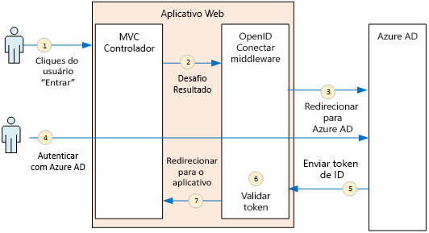
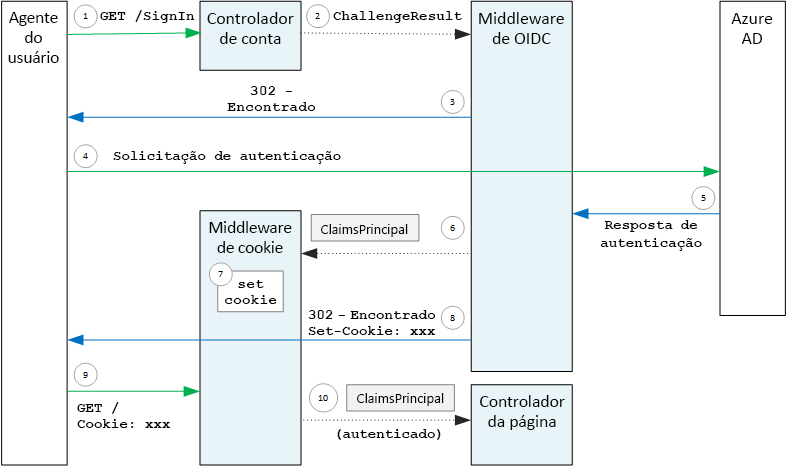

# <a name="authenticate-using-azure-ad-and-openid-connect"></a>Autentique usando o Azure AD e o OpenID Connect

[Código de exemplo do ][sample application]

O aplicativo Surveys usa o protocolo OIDC (OpenID Connect) para autenticar usuários com o Azure AD (Azure Active Directory). O aplicativo de Pesquisas usa o ASP.NET Core, que tem o middleware interno para OIDC. O diagrama a seguir mostra o que acontece quando o usuário faz logon, em um alto nível.



1. O usuário clica no botão "entrar" no aplicativo. Essa ação é realizada por um controlador MVC.
2. O controlador MVC retorna uma ação **ChallengeResult** .
3. O middleware intercepta o **ChallengeResult** e cria uma resposta 302, que redireciona o usuário para a página de entrada do Azure AD.
4. O usuário autentica no Azure AD.
5. O Azure AD envia um token de ID para o aplicativo.
6. O middleware valida o token de ID. Neste ponto, o usuário está autenticado dentro do aplicativo.
7. O middleware redireciona o usuário de volta para o aplicativo.

## <a name="register-the-app-with-azure-ad"></a>Registrar o aplicativo no Azure AD
Para habilitar o OpenID Connect, o provedor de SaaS registra o aplicativo dentro de seu próprio locatário do Azure AD.

Para registrar o aplicativo, siga as etapas em [Integrar aplicativos ao Azure Active Directory](/azure/active-directory/active-directory-integrating-applications/) na seção [Adicionar um aplicativo](/azure/active-directory/active-directory-integrating-applications/#adding-an-application).

Consulte [Executar o aplicativo Surveys](./run-the-app.md) para as etapas específicas para o aplicativo Surveys. Observe o seguinte:

- Para um aplicativo multilocatário, você deve configurar a opção multilocatário explicitamente. Isso habilita outras organizações a acessar o aplicativo.

- A URL de resposta é a URL em que o Azure AD enviará respostas do OAuth 2.0. Ao usar o ASP.NET Core, isso deve corresponder ao caminho que você configura no middleware de autenticação (consulte a próxima seção), 

## <a name="configure-the-auth-middleware"></a>Configurar o middleware de autenticação
Esta seção descreve como configurar o middleware de autenticação no ASP.NET Core para autenticação multilocatário com OpenID Connect.

Em sua [classe de inicialização](/aspnet/core/fundamentals/startup), adicione o middleware OpenID Connect:

```csharp
app.UseOpenIdConnectAuthentication(new OpenIdConnectOptions {
    ClientId = configOptions.AzureAd.ClientId,
    ClientSecret = configOptions.AzureAd.ClientSecret, // for code flow
    Authority = Constants.AuthEndpointPrefix,
    ResponseType = OpenIdConnectResponseType.CodeIdToken,
    PostLogoutRedirectUri = configOptions.AzureAd.PostLogoutRedirectUri,
    SignInScheme = CookieAuthenticationDefaults.AuthenticationScheme,
    TokenValidationParameters = new TokenValidationParameters { ValidateIssuer = false },
    Events = new SurveyAuthenticationEvents(configOptions.AzureAd, loggerFactory),
});
```

Observe que algumas das configurações são obtidas de opções de configuração no tempo de execução. Estes são os significados das opções de middleware:

* **ClientId**. ID do cliente do aplicativo, que você obteve ao registrar o aplicativo no Azure AD.
* **Autoridade**. No caso do aplicativo de multilocatário, defina como `https://login.microsoftonline.com/common/`. Essa é a URL do ponto de extremidade comum do Azure AD e ela permite que usuários de qualquer locatário do Azure AD entrem. Para saber mais sobre o ponto de extremidade comum, confira [esta postagem do blog](http://www.cloudidentity.com/blog/2014/08/26/the-common-endpoint-walks-like-a-tenant-talks-like-a-tenant-but-is-not-a-tenant/).
* Em **TokenValidationParameters**, defina **ValidateIssuer** como false. Isso significa que o aplicativo será responsável pela validação do valor do emissor no token de ID. (O middleware ainda valida o token em si.) Para obter mais informações sobre a validação do emissor, consulte [Validação do emissor](claims.md#issuer-validation).
* **PostLogoutRedirectUri**. Especifique uma URL para redirecionar os usuários após a saída. Essa deve ser uma página que permite que solicitações anônimas &mdash; normalmente a página inicial.
* **SignInScheme**. Defina isso como `CookieAuthenticationDefaults.AuthenticationScheme`. Essa configuração significa que, após a autenticação do usuário, as declarações de usuário são armazenadas localmente em um cookie. Esse cookie diz como o usuário permanece conectado durante a sessão do navegador.
* **Eventos.** Retornos de chamada do evento; confira [Eventos de autenticação](#authentication-events).

Além disso, adicione o middleware de Autenticação de Cookie ao pipeline. Este middleware é responsável por gravar as declarações de usuário em um cookie e, em seguida, ler o cookie durante carregamentos subsequentes da página.

```csharp
app.UseCookieAuthentication(new CookieAuthenticationOptions {
    AutomaticAuthenticate = true,
    AutomaticChallenge = true,
    AccessDeniedPath = "/Home/Forbidden",
    CookieSecure = CookieSecurePolicy.Always,

    // The default setting for cookie expiration is 14 days. SlidingExpiration is set to true by default
    ExpireTimeSpan = TimeSpan.FromHours(1),
    SlidingExpiration = true
});
```

## <a name="initiate-the-authentication-flow"></a>Iniciar o fluxo de autenticação
Para iniciar o fluxo de autenticação no ASP.NET MVC, retorne um **ChallengeResult** do controlador:

```csharp
[AllowAnonymous]
public IActionResult SignIn()
{
    return new ChallengeResult(
        OpenIdConnectDefaults.AuthenticationScheme,
        new AuthenticationProperties
        {
            IsPersistent = true,
            RedirectUri = Url.Action("SignInCallback", "Account")
        });
}
```

Isso faz com que o middleware retorne uma resposta 302 (Found) que redireciona para o ponto de extremidade de autenticação.

## <a name="user-login-sessions"></a>Sessões de logon do usuário
Conforme mencionado, quando o usuário entra pela primeira vez, o middleware de Autenticação de Cookie grava as declarações do usuário em um cookie. Depois disso, as solicitações HTTP são autenticadas por meio da leitura do cookie.

Por padrão, o middleware de cookie grava um [cookie de sessão][session-cookie], que é excluído quando o usuário fecha o navegador. Na próxima vez que o usuário visitar o site, será necessário entrar novamente. No entanto, se você definir **IsPersistent** como verdadeiro em **ChallengeResult**, o middleware gravará um cookie persistente para que o usuário permaneça conectado depois de fechar o navegador. Você pode configurar a expiração do cookie; consulte [Controlando opções de cookie][cookie-options]. Cookies persistentes são mais convenientes para o usuário, mas podem ser inadequados para alguns aplicativos (por exemplo, um aplicativo bancário) nos quais você deseja que o usuário entre cada vez que acessar.

## <a name="about-the-openid-connect-middleware"></a>Sobre o middleware OpenID Connect
O middleware OpenID Connect no ASP.NET oculta a maioria dos detalhes do protocolo. Esta seção contém algumas observações sobre a implementação que podem ser úteis para entender o fluxo do protocolo.

Primeiro, vamos examinar o fluxo de autenticação em termos de ASP.NET (ignorando os detalhes do fluxo de protocolo OIDC entre o aplicativo e o Azure AD). O diagrama a seguir mostra o processo.



Neste diagrama, há dois controladores MVC. O Controlador de conta lida com solicitações de entrada, e o Controlador inicial atende à home page.

Este é o processo de autenticação:

1. O usuário clica no botão "Entrar", e o navegador envia uma solicitação GET. Por exemplo: `GET /Account/SignIn/`.
2. O Controlador de conta retorna um `ChallengeResult`.
3. O middleware OIDC retorna uma resposta HTTP 302, redirecionando para o Azure AD.
4. O navegador envia a solicitação de autenticação ao Azure AD
5. O usuário entra no Azure AD, e o Azure AD envia de volta uma resposta de autenticação.
6. O middleware OIDC cria uma entidade de declarações e a transmite para o middleware de autenticação de Cookie.
7. O middleware do cookie serializa a entidade das declarações e define um cookie.
8. O middleware OIDC redireciona para a URL de retorno de chamada do aplicativo.
9. O navegador segue o redirecionamento, enviando o cookie na solicitação.
10. O middleware do cookie desserializa o cookie para uma entidade de declarações e define `HttpContext.User` igual à entidade de declarações. A solicitação é encaminhada para um controlador MVC.

### <a name="authentication-ticket"></a>Tíquete de autenticação.
Se a autenticação for bem-sucedida, o middleware OIDC criará um tíquete de autenticação contendo uma entidade de declarações que armazena as declarações do usuário. Você pode acessar o tíquete dentro do evento **AuthenticationValidated** ou **TicketReceived**.

> [!NOTE]
> Até que todo o fluxo de autenticação esteja concluído, `HttpContext.User` ainda mantém uma entidade de segurança anônima, *não* o usuário autenticado. A entidade anônima tem uma coleção de declarações vazias. Após a conclusão da autenticação e o redirecionamentos do aplicativo, o cookie de middleware desserializa o cookie de autenticação e define `HttpContext.User` como uma entidade de declarações que representa o usuário autenticado.
> 
> 

### <a name="authentication-events"></a>Eventos de autenticação
Durante o processo de autenticação, o middleware OpenID Connect gera uma série de eventos:

* **RedirectToIdentityProvider**. É chamado momentos antes de o middleware redirecionar para o ponto de extremidade de autenticação. Você pode usar esse evento para modificar a URL de redirecionamento; por exemplo, para adicionar parâmetros de solicitação. Confira [Adicionar a solicitação de consentimento do administrador](signup.md#adding-the-admin-consent-prompt) para ter um exemplo.
* **AuthorizationCodeReceived**. Chamado com o código de autorização.
* **TokenResponseReceived**. Chamado depois que o middleware obtém um token de acesso de IDP, mas antes de validá-lo. Aplica-se apenas ao fluxo do código de autorização
* **TokenValidated**. Chamado após o middleware validar o token de ID. Neste ponto, o aplicativo tem um conjunto de declarações validadas sobre o usuário. Você pode usar esse evento para executar uma validação adicional nas declarações ou para transformar as declarações. Confira [Trabalhar com declarações](claims.md).
* **UserInformationReceived**. Chamado se o middleware obtém o perfil de usuário do ponto de extremidade de informações do usuário. Aplica-se somente ao fluxo de código de autorização e somente quando `GetClaimsFromUserInfoEndpoint = true` nas opções do middleware.
* **TicketReceived**. Chamado quando a autenticação é concluída. Esse é o último evento, supondo que a autenticação tenha êxito. Após o tratamento desse evento, o usuário estará conectado ao aplicativo.
* **AuthenticationFailed**. Chamado se a autenticação falhar. Use este evento para lidar com falhas de autenticação &mdash; por exemplo, ao redirecionar para uma página de erro.

Para fornecer retornos de chamada para esses eventos, defina a opção **Eventos** no middleware. Há duas maneiras diferentes de declarar os manipuladores de eventos: embutidos com lambdas ou em uma classe derivada de **OpenIdConnectEvents**. A segunda abordagem é recomendada se os seus retornos de chamada do evento tiverem uma quantidade consideração de lógica, para que eles não baguncem sua classe de inicialização. Nossa implementação de referência usa essa abordagem.

### <a name="openid-connect-endpoints"></a>Pontos de extremidade do OpenId Connect
O Azure AD oferece suporte ao [OpenID Connect Discovery](https://openid.net/specs/openid-connect-discovery-1_0.html), no qual o IDP (provedor de identidade) retorna um documento de metadados JSON de um [ponto de extremidade conhecido](https://openid.net/specs/openid-connect-discovery-1_0.html#ProviderConfig). O documento de metadados contém informações como as seguintes:

* A URL do ponto de extremidade de autorização. Para onde o aplicativo é redirecionado a fim de autenticar o usuário.
* A URL do ponto de extremidade "encerrar sessão", onde o aplicativo acessar para efetuar logoff do usuário.
* A URL para obter as chaves de assinatura, usadas pelo cliente para validar os tokens OIDC obtidos com o IDP.

Por padrão, o middleware OIDC sabe como buscar esses metadados. Defina a opção **Authority** no middleware, e o middleware construirá a URL dos metadados. (Você pode substituir a URL dos metadados, definindo a opção **MetadataAddress** .)

### <a name="openid-connect-flows"></a>Fluxos do OpenId Connect
Por padrão, o middleware OIDC usa um fluxo híbrido com o modo de resposta de postagem de formulário.

* *Fluxo híbrido* significa que o cliente pode obter um token de ID e um código de autorização na mesma viagem de ida e volta ao servidor de autorização.
* *Modo de resposta de postagem de formulário* significa que o servidor de autorização usa uma solicitação HTTP POST para enviar o código de autorização e o token de ID ao aplicativo. Os valores são form-urlencoded (tipo de conteúdo = "application/x-www-form-urlencoded").

Quando o middleware OIDC redireciona para o ponto de extremidade de autorização, a URL de redirecionamento inclui todos os parâmetros da cadeia de caracteres de consulta necessários para o OIDC. Para o fluxo híbrido:

* client_id. Esse valor é definido na opção **ClientId**
* escopo = "openid profile", significando que é uma solicitação OIDC e que queremos o perfil do usuário.
* response_type  = "code id_token". Isso especifica o fluxo híbrido.
* response_mode = "form_post". Isso especifica a resposta de postagem do formulário.

Para especificar um fluxo diferente, defina a propriedade **ResponseType** nas opções. Por exemplo:

```csharp
app.UseOpenIdConnectAuthentication(options =>
{
    options.ResponseType = "code"; // Authorization code flow

    // Other options
}
```

[**Avançar**][claims]

[claims]: claims.md
[cookie-options]: /aspnet/core/security/authentication/cookie#controlling-cookie-options
[session-cookie]: https://en.wikipedia.org/wiki/HTTP_cookie#Session_cookie
[sample application]: https://github.com/mspnp/multitenant-saas-guidance
