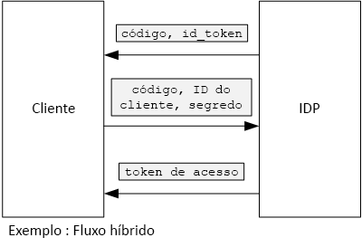

# <a name="use-client-assertion-to-get-access-tokens-from-azure-ad"></a>Usar a declaração do cliente para obter tokens de acesso do Azure AD

[Código de exemplo do ][sample application]

## <a name="background"></a>Segundo plano

Ao usar o fluxo de código de autorização ou o fluxo híbrido no OpenID Connect, o cliente troca um código de autorização por um token de acesso. Durante essa etapa, o cliente deve se autenticar no servidor.



Uma maneira de autenticar o cliente é usar um segredo do cliente. É assim que o aplicativo [Tailspin Surveys][Surveys] está configurado por padrão.

Veja um exemplo de solicitação do cliente para o IDP, solicitando um token de acesso. Observe o parâmetro `client_secret` .

```http
POST https://login.microsoftonline.com/b9bd2162xxx/oauth2/token HTTP/1.1
Content-Type: application/x-www-form-urlencoded

resource=https://tailspin.onmicrosoft.com/surveys.webapi
  &client_id=87df91dc-63de-4765-8701-b59cc8bd9e11
  &client_secret=i3Bf12Dn...
  &grant_type=authorization_code
  &code=PG8wJG6Y...
```

O segredo é apenas uma cadeia de caracteres, portanto, você precisa tomar cuidado para não divulgar inadvertidamente o valor. A prática recomendada é manter o segredo do cliente fora do controle de origens. Quando você implantar no Azure, armazene o segredo em uma [configuração do aplicativo][configure-web-app].

No entanto, qualquer pessoa com acesso à assinatura do Azure pode exibir as configurações do aplicativo. Além disso, há sempre a tentação de inserir segredos no controle de origem (por exemplo, em scripts de implantação), compartilhá-los por email e assim por diante.

Para obter segurança adicional, você pode usar a [declaração do cliente] em vez de um segredo do cliente. Com a declaração do cliente, o cliente usa um certificado X.509 para comprovar que a solicitação de token veio do cliente. O certificado do cliente é instalado no servidor Web. Em geral, é mais fácil restringir o acesso ao certificado do que garantir que ninguém revele inadvertidamente um segredo do cliente. Para saber mais sobre como configurar certificados em um aplicativo Web, veja [Uso de certificados em aplicativos de sites do Azure][using-certs-in-websites]

Veja uma solicitação de token usando a declaração do cliente:

```http
POST https://login.microsoftonline.com/b9bd2162xxx/oauth2/token HTTP/1.1
Content-Type: application/x-www-form-urlencoded

resource=https://tailspin.onmicrosoft.com/surveys.webapi
  &client_id=87df91dc-63de-4765-8701-b59cc8bd9e11
  &client_assertion_type=urn:ietf:params:oauth:client-assertion-type:jwt-bearer
  &client_assertion=eyJhbGci...
  &grant_type=authorization_code
  &code= PG8wJG6Y...
```

Observe que o parâmetro `client_secret` não é mais usado. Em vez disso, o parâmetro `client_assertion` contém um token JWT que foi assinado usando o certificado do cliente. O parâmetro `client_assertion_type` especifica o tipo de declaração &mdash;, nesse caso, o token JWT. O servidor valida o token JWT. Se o token JWT for inválido, a solicitação de token retornará um erro.

> [!NOTE]
> Os certificados x. 509 não são a única forma de asserção de cliente; nosso foco nele aqui é porque ele tem suporte do Azure AD.

No tempo de execução, o aplicativo Web lê o certificado do repositório de certificados. O certificado deve ser instalado no mesmo computador que o aplicativo Web.

O aplicativo Surveys inclui uma classe auxiliar que cria um [ClientAssertionCertificate](/dotnet/api/microsoft.identitymodel.clients.activedirectory.clientassertioncertificate) que você pode passar para o método [AuthenticationContext.AcquireTokenSilentAsync](/dotnet/api/microsoft.identitymodel.clients.activedirectory.authenticationcontext.acquiretokensilentasync) para adquirir um token do Azure AD.

```csharp
public class CertificateCredentialService : ICredentialService
{
    private Lazy<Task<AdalCredential>> _credential;

    public CertificateCredentialService(IOptions<ConfigurationOptions> options)
    {
        var aadOptions = options.Value?.AzureAd;
        _credential = new Lazy<Task<AdalCredential>>(() =>
        {
            X509Certificate2 cert = CertificateUtility.FindCertificateByThumbprint(
                aadOptions.Asymmetric.StoreName,
                aadOptions.Asymmetric.StoreLocation,
                aadOptions.Asymmetric.CertificateThumbprint,
                aadOptions.Asymmetric.ValidationRequired);
            string password = null;
            var certBytes = CertificateUtility.ExportCertificateWithPrivateKey(cert, out password);
            return Task.FromResult(new AdalCredential(new ClientAssertionCertificate(aadOptions.ClientId, new X509Certificate2(certBytes, password))));
        });
    }

    public async Task<AdalCredential> GetCredentialsAsync()
    {
        return await _credential.Value;
    }
}
```

Para saber mais sobre como configurar a asserção de cliente no aplicativo Surveys, veja [Usar o Azure Key Vault para proteger segredos do aplicativo ] [ key vault].

[**Avançar**][key vault]

<!-- links -->

[configure-web-app]: /azure/app-service-web/web-sites-configure/
[azure-management-portal]: https://portal.azure.com
[declaração do cliente]: https://tools.ietf.org/html/rfc7521
[key vault]: key-vault.md
[Setup-KeyVault]: https://github.com/mspnp/multitenant-saas-guidance/blob/master/scripts/Setup-KeyVault.ps1
[Surveys]: tailspin.md
[using-certs-in-websites]: https://azure.microsoft.com/blog/using-certificates-in-azure-websites-applications/

[sample application]: https://github.com/mspnp/multitenant-saas-guidance
