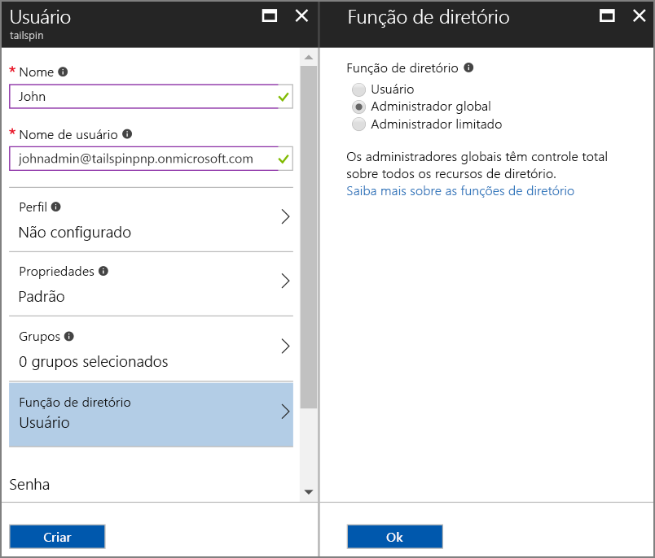
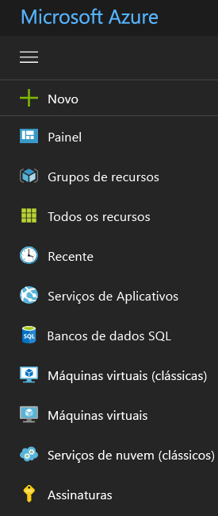

# <a name="use-azure-key-vault-to-protect-application-secrets"></a>Usar o Azure Key Vault para proteger os segredos do aplicativo

[Código de exemplo do ][sample application]

É comum ter configurações de aplicativo confidenciais e que devem ser protegidas, por exemplo:

* Cadeias de conexão de banco de dados
* Senhas
* Chaves de criptografia

Como prática de segurança recomendada, nunca armazene esses segredos no controle do código-fonte. É muito fácil vazar &mdash;, mesmo se o repositório de código-fonte for privado. E não se trata apenas de guardar os segredos do público geral. Em projetos maiores, talvez você queira restringir quais desenvolvedores e operadores podem acessar os segredos de produção. (As configurações para ambientes de teste ou de desenvolvimento são diferentes).

Uma opção mais segura é armazenar esses segredos no [Azure Key Vault][KeyVault]. O Cofre da Chave é um serviço hospedado na nuvem para gerenciamento de chaves de criptografia e de outros segredos. Este artigo mostra como usar o Key Vault para armazenar as definições de configuração para seu aplicativo.

No aplicativo [Tailspin Surveys][Surveys] aplicativo, as configurações a seguir são secretas:

* A cadeia de conexão do banco de dados.
* A cadeia de conexão Redis.
* O segredo do cliente para o aplicativo Web.

O aplicativo Surveys carrega configurações dos seguintes locais:

* O arquivo appsettings.json
* O [repositório de segredos do usuário][user-secrets] (apenas ambiente de desenvolvimento; para teste)
* O ambiente de hospedagem (configurações do aplicativo em aplicativos Web do Azure)
* Key Vault (quando habilitado)

Cada uma delas substitui a anterior, portanto, as configurações armazenadas no Cofre da Chave têm precedência.

> [!NOTE]
> Por padrão, o provedor de configuração do Cofre da Chave está desabilitado. Ele não é necessário para executar o aplicativo localmente. Você poderia habilitá-lo em uma implantação de produção.

Na inicialização, o aplicativo lê as configurações de cada provedor de configuração registrado, e as usa para preencher um objeto de opções fortemente tipado. Para obter mais informações, consulte [Como usar opções e objetos de configuração][options].

## <a name="setting-up-key-vault-in-the-surveys-app"></a>Configuração do Cofre da Chave no aplicativo Surveys

Pré-requisitos:

* Instale os [Cmdlets do Azure Resource Manager][azure-rm-cmdlets].
* Configurar o aplicativo Surveys conforme descrito em [Executar o aplicativo Surveys][readme].

Etapas de alto nível:

1. Configure um usuário de administração no locatário.
2. Configure um certificado de cliente.
3. Crie um cofre da chave.
4. Adicione definições de configuração para o cofre da chave.
5. Remova o comentário do código que habilita o cofre da chave.
6. Atualize os segredos do usuário do aplicativo.

### <a name="set-up-an-admin-user"></a>Configurar um usuário administrador

> [!NOTE]
> Para criar um cofre da chave, você deve usar uma conta que possa gerenciar sua assinatura do Azure. Além disso, qualquer aplicativo que você autorizar para ler do cofre de chaves deve ser registrado no mesmo locatário que aquela conta.

Nesta etapa, você confirmará se pode criar um cofre da chave enquanto estiver conectado como um usuário no locatário no qual o aplicativo Surveys está registrado.

Crie um usuário administrador no locatário do Azure AD no qual o aplicativo Surveys está registrado.

1. Faça logon no [portal do Azure][azure-portal].
2. Selecione o locatário do Azure AD onde seu aplicativo está registrado.
3. Clique em **Mais serviço** > **SEGURANÇA + IDENTIDADE** > **Azure Active Directory** > **Usuários e grupos** > **Todos os usuários**.
4. Na parte superior do portal, clique em **Novo usuário**.
5. Preencha os campos e atribua o usuário à função do diretório **Administrador Global**.
6. Clique em **Criar**.



Agora atribua esse usuário como o proprietário da assinatura.

1. No menu Hub, selecione **Assinaturas**.

    

2. Selecione a assinatura que você deseja que o administrador acesse.
3. Na folha da assinatura, selecione **Controle de acesso (IAM)**.
4. Clique em **Adicionar**.
5. Em **Função**, selecione **Proprietário**.
6. Digite o endereço de email do usuário que você deseja adicionar como proprietário.
7. Selecione o usuário e clique em **Salvar**.

### <a name="set-up-a-client-certificate"></a>Configurar um certificado de cliente

1. Execute o script do PowerShell [/Scripts/Setup-KeyVault.ps1][Setup-KeyVault] da seguinte maneira:

    ```powershell
    .\Setup-KeyVault.ps1 -Subject <<subject>>
    ```
    Para o parâmetro `Subject` , digite qualquer nome, como "surveysapp". O script gera um certificado autoassinado e o armazena no repositório de certificados "Usuário Atual/Pessoal". A saída do script é um fragmento JSON. Copie esse valor.

2. No [portal do Azure][azure-portal], alterne para o diretório no qual o aplicativo Surveys é registrado selecionando a sua conta no canto superior direito do portal.

3. Selecione **Azure Active Directory** > **Registros de Aplicativo** > Surveys

4. Clique em **Manifesto** e então em **Editar**.

5. Cole a saída do script na propriedade `keyCredentials` . O arquivo deve ser semelhante ao seguinte:

    ```json
    "keyCredentials": [
        {
        "type": "AsymmetricX509Cert",
        "usage": "Verify",
        "keyId": "29d4f7db-0539-455e-b708-....",
        "customKeyIdentifier": "ZEPpP/+KJe2fVDBNaPNOTDoJMac=",
        "value": "MIIDAjCCAeqgAwIBAgIQFxeRiU59eL.....
        }
    ],
    ```

6. Clique em **Salvar**.

7. Repita as etapas 3 a 6 para adicionar o mesmo fragmento JSON ao manifesto do aplicativo da API Web (Surveys.WebAPI).

8. Na janela do PowerShell, execute o seguinte comando para obter a impressão digital do certificado.

    ```powershell
    certutil -store -user my [subject]
    ```

    Para `[subject]`, use o valor especificado para o Assunto no script do PowerShell. A impressão digital é listada em "Cert Hash(sha1)". Copie esse valor. Posteriormente, você usará a impressão digital.

### <a name="create-a-key-vault"></a>Criar um cofre de chave

1. Execute o script do PowerShell [/Scripts/Setup-KeyVault.ps1][Setup-KeyVault] da seguinte maneira:

    ```powershell
    .\Setup-KeyVault.ps1 -KeyVaultName <<key vault name>> -ResourceGroupName <<resource group name>> -Location <<location>>
    ```

    Quando receber a solicitação pelas credenciais, entre como o usuário do Azure AD que você criou anteriormente. O script cria um novo grupo de recursos e um novo cofre da chave dentro desse grupo de recursos.

2. Execute Setup-KeyVault.ps1 outra vez da seguinte maneira:

    ```powershell
    .\Setup-KeyVault.ps1 -KeyVaultName <<key vault name>> -ApplicationIds @("<<Surveys app id>>", "<<Surveys.WebAPI app ID>>")
    ```

    Defina os seguintes valores de parâmetro:

       * nome do cofre da chave = o nome que você deu ao cofre da chave na etapa anterior.
       * ID do aplicativo Surveys = a ID do aplicativo Web Surveys.
       * ID do aplicativo Surveys.WebApi = a ID do aplicativo Surveys.WebAPI.

    Exemplo:

    ```powershell
     .\Setup-KeyVault.ps1 -KeyVaultName tailspinkv -ApplicationIds @("f84df9d1-91cc-4603-b662-302db51f1031", "8871a4c2-2a23-4650-8b46-0625ff3928a6")
    ```

    Esse script autoriza o aplicativo Web e a API Web a recuperar os segredos de seu cofre da chave. Consulte [Introdução ao Azure Key Vault](/azure/key-vault/key-vault-get-started/) para obter mais informações.

### <a name="add-configuration-settings-to-your-key-vault"></a>Adicionar definições de configuração para o cofre da chave

1. Execute Setup-KeyVault.ps1 da seguinte maneira:

    ```powershell
    .\Setup-KeyVault.ps1 -KeyVaultName <<key vault name> -KeyName Redis--Configuration -KeyValue "<<Redis DNS name>>.redis.cache.windows.net,password=<<Redis access key>>,ssl=true"
    ```
    onde

   * nome do cofre da chave = o nome que você deu ao cofre da chave na etapa anterior.
   * nome DNS de Redis = o nome DNS de sua instância de cache Redis.
   * chave de acesso Redis = a chave de acesso da sua instância de cache Redis.

2. Agora, convém testar se você armazenou os segredos no cofre da chave com êxito. Execute o seguinte comando do PowerShell:

    ```powershell
    Get-AzureKeyVaultSecret <<key vault name>> Redis--Configuration | Select-Object *
    ```

3. Execute Setup-KeyVault.ps1 novamente para adicionar a cadeia de conexão do banco de dados:

    ```powershell
    .\Setup-KeyVault.ps1 -KeyVaultName <<key vault name> -KeyName Data--SurveysConnectionString -KeyValue <<DB connection string>> -ConfigName "Data:SurveysConnectionString"
    ```

    em que `<<DB connection string>>` é o valor da cadeia de conexão do banco de dados.

    Para testar com o banco de dados local, copie a cadeia de conexão do arquivo Tailspin.Surveys.Web/appsettings.json. Se você fizer isso, altere as duas barras invertidas ('\\\\') para uma barra invertida. A barra dupla invertida é um caractere de escape no arquivo JSON.

    Exemplo:

    ```powershell
    .\Setup-KeyVault.ps1 -KeyVaultName mykeyvault -KeyName Data--SurveysConnectionString -KeyValue "Server=(localdb)\MSSQLLocalDB;Database=Tailspin.SurveysDB;Trusted_Connection=True;MultipleActiveResultSets=true"
    ```

### <a name="uncomment-the-code-that-enables-key-vault"></a>Remover o comentário do código que habilita o Cofre da Chave

1. Abra a solução Tailspin.Surveys.
2. No Tailspin.Surveys.Web/Startup.cs, localize o seguinte bloco de código e remova a marca de comentário.

    ```csharp
    //var config = builder.Build();
    //builder.AddAzureKeyVault(
    //    $"https://{config["KeyVault:Name"]}.vault.azure.net/",
    //    config["AzureAd:ClientId"],
    //    config["AzureAd:ClientSecret"]);
    ```
3. No Tailspin.Surveys.Web/Startup.cs, localize o código que registra o `ICredentialService`. Remova a marca de comentário da linha que usa `CertificateCredentialService` e comente a linha que usa `ClientCredentialService`:

    ```csharp
    // Uncomment this:
    services.AddSingleton<ICredentialService, CertificateCredentialService>();
    // Comment out this:
    //services.AddSingleton<ICredentialService, ClientCredentialService>();
    ```

    Essa alteração habilita o aplicativo Web a usar [Asserção de cliente][client-assertion] para obter tokens de acesso OAuth. Com a declaração de cliente, você não precisa de um segredo do cliente OAuth. Como alternativa, você pode armazenar o segredo do cliente no cofre da chave. No entanto, o cofre da chave e a declaração de cliente usam um cliente de certificado, portanto, se você habilitar o cofre da chave, convém habilitar a declaração de cliente também.

### <a name="update-the-user-secrets"></a>Atualizar os segredos do usuário

No Gerenciador de Soluções, clique com o botão direito no projeto Tailspin.Surveys.Web e selecione **Gerenciar Segredos do Usuário**. No arquivo secrets.json, exclua o JSON existente e cole o seguinte:

```json
{
  "AzureAd": {
    "ClientId": "[Surveys web app client ID]",
    "ClientSecret": "[Surveys web app client secret]",
    "PostLogoutRedirectUri": "https://localhost:44300/",
    "WebApiResourceId": "[App ID URI of your Surveys.WebAPI application]",
    "Asymmetric": {
      "CertificateThumbprint": "[certificate thumbprint. Example: 105b2ff3bc842c53582661716db1b7cdc6b43ec9]",
      "StoreName": "My",
      "StoreLocation": "CurrentUser",
      "ValidationRequired": "false"
    }
  },
  "KeyVault": {
    "Name": "[key vault name]"
  }
}
```

Substitua as entradas entre [colchetes] pelos valores corretos.

* `AzureAd:ClientId`: a ID do cliente do aplicativo Surveys.
* `AzureAd:ClientSecret`: a chave que foi gerada quando você registrou o aplicativo de pesquisas no Azure AD.
* `AzureAd:WebApiResourceId`: o URI da ID do Aplicativo que você especificou quando criou o aplicativo Surveys.WebAPI no Azure AD.
* `Asymmetric:CertificateThumbprint`: a impressão digital do certificado que você obteve anteriormente, quando criou o certificado do cliente.
* `KeyVault:Name`: o nome de seu cofre de chaves.

> [!NOTE]
> `Asymmetric:ValidationRequired` é false, pois o certificado que você criou anteriormente não foi assinado por uma AC (autoridade de certificação) raiz. Em produção, use um certificado assinado por uma AC raiz e defina `ValidationRequired` como true.

Salve o arquivo secrets.json atualizado.

Em seguida, no Gerenciador de Soluções, clique com o botão direito do mouse no projeto Tailspin.Surveys.WebApi e selecione **Gerenciar Segredos do Usuário**. Exclua o arquivo JSON existente e cole o seguinte:

```json
{
  "AzureAd": {
    "ClientId": "[Surveys.WebAPI client ID]",
    "WebApiResourceId": "https://tailspin5.onmicrosoft.com/surveys.webapi",
    "Asymmetric": {
      "CertificateThumbprint": "[certificate thumbprint]",
      "StoreName": "My",
      "StoreLocation": "CurrentUser",
      "ValidationRequired": "false"
    }
  },
  "KeyVault": {
    "Name": "[key vault name]"
  }
}
```

Substitua as entradas entre [colchetes] e salve o arquivo secrets.json.

> [!NOTE]
> Para a API Web, use a ID do cliente para o aplicativo Surveys.WebAPI, não para o aplicativo Surveys.

[**Avançar**][adfs]

<!-- links -->

[adfs]: ./adfs.md
[authorize-app]: /azure/key-vault/key-vault-get-started//#authorize
[azure-portal]: https://portal.azure.com
[azure-rm-cmdlets]: https://msdn.microsoft.com/library/mt125356.aspx
[client-assertion]: client-assertion.md
[configuration]: /aspnet/core/fundamentals/configuration
[KeyVault]: https://azure.microsoft.com/services/key-vault/
[key-tags]: https://msdn.microsoft.com/library/azure/dn903623.aspx#BKMK_Keytags
[Microsoft.Azure.KeyVault]: https://www.nuget.org/packages/Microsoft.Azure.KeyVault/
[options]: /aspnet/core/fundamentals/configuration#using-options-and-configuration-objects
[readme]: ./run-the-app.md
[Setup-KeyVault]: https://github.com/mspnp/multitenant-saas-guidance/blob/master/scripts/Setup-KeyVault.ps1
[Surveys]: tailspin.md
[user-secrets]: /aspnet/core/security/app-secrets
[sample application]: https://github.com/mspnp/multitenant-saas-guidance
