# <a name="run-the-surveys-application"></a>Executar o aplicativo Surveys

Este artigo descreve como executar o aplicativo [Tailspin Surveys](./tailspin.md) localmente usando o Visual Studio. Nestas etapas, você não implantará o aplicativo no Azure. No entanto, você precisará criar alguns recursos do Azure &mdash; um diretório do Azure AD (Azure Active Directory) e um cache Redis.

Aqui está um resumo das etapas:

1. Criar um diretório do Azure AD (locatário) para a empresa fictícia Tailspin.
2. Registrar o aplicativo Surveys e a API Web de back-end com o Azure AD.
3. Criar uma instância do Cache Redis do Azure.
4. Definir as configurações de aplicativo e criar um banco de dados local.
5. Executar o aplicativo e inscrever um novo locatário.
6. Adicione funções de aplicativo aos usuários.

## <a name="prerequisites"></a>Pré-requisitos

- [Visual Studio 2017] [ VS2017] com a [carga de trabalho ASP.NET e desenvolvimento Web](https://visualstudio.microsoft.com/vs/support/selecting-workloads-visual-studio-2017) instalada
- Conta do [Microsoft Azure](https://azure.microsoft.com)

## <a name="create-the-tailspin-tenant"></a>Criar o locatário Tailspin

Tailspin é a empresa fictícia que hospeda o aplicativo Surveys. A Tailspin usa o Azure AD para habilitar outros locatários para registro com o aplicativo. Esses clientes então podem usar as credenciais do Azure AD para entrar no aplicativo.

Nesta etapa, você criará um diretório do Azure AD para Tailspin.

1. Faça logon no [Portal do Azure][portal].

2. Clique em **+ Criar um Recurso** > **Identidade** > **Azure Active Directory**.

3. Digite `Tailspin` para o nome da organização e insira um nome de domínio. O nome de domínio terá o formato `xxxx.onmicrosoft.com` e deverá ser globalmente exclusivo.

    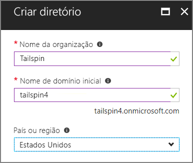

4. Clique em **Criar**. A criação do novo diretório pode levar alguns minutos.

Para completar o cenário de ponta a ponta, você precisará de um segundo diretório do Azure AD para representar um cliente que se inscreva para o aplicativo. Você pode usar o diretório do Azure AD padrão (não Tailspin) ou criar um novo diretório para essa finalidade. Os exemplos, usamos Contoso como o cliente fictício.

## <a name="register-the-surveys-web-api"></a>Registrar a API web do Surveys

1. No [portal do Azure][portal], mude para o novo diretório Tailspin selecionando sua conta no canto superior direito do portal.

2. No painel de navegação esquerdo, escolha **Azure Active Directory**.

3. Clique em **Registros do aplicativo** > **Novo registro de aplicativo**.

4. Na folha **Criar**, insira as seguintes informações:

   - **Nome**: `Surveys.WebAPI`

   - **Tipo de Aplicativo**: `Web app / API`

   - **URL de logon**: `https://localhost:44301/`

   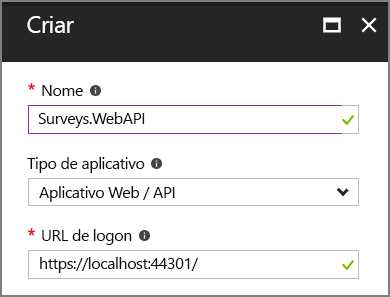

5. Clique em **Criar**.

6. Na folha **Registros do aplicativo**, selecione o novo aplicativo **Surveys.WebAPI**.

7. Em seguida, clique em **Configurações** > **Propriedades**.

8. Na caixa de edição **URI da ID do aplicativo**, digite `https://<domain>/surveys.webapi`, em que `<domain>` é o nome de domínio do diretório. Por exemplo: `https://tailspin.onmicrosoft.com/surveys.webapi`

    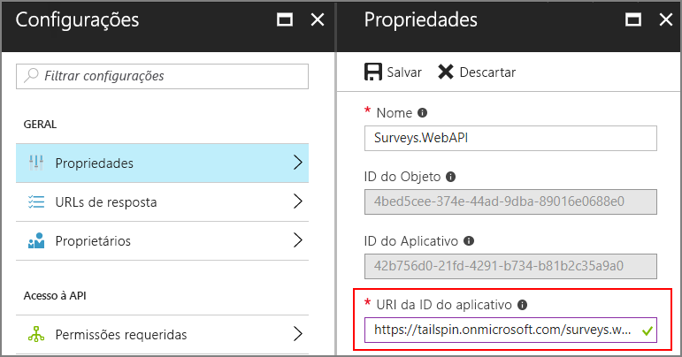

9. Defina **Multilocatário** como **SIM**.

10. Clique em **Salvar**.

## <a name="register-the-surveys-web-app"></a>Registrar o aplicativo Web Surveys

1. Navegue de volta para a folha **Registros do aplicativo** e clique em **Novo registro de aplicativo**.

2. Na folha **Criar**, insira as seguintes informações:

    - **Nome**: `Surveys`
    - **Tipo de Aplicativo**: `Web app / API`
    - **URL de logon**: `https://localhost:44300/`

    Observe que a URL de entrada tem um número da porta diferente do aplicativo `Surveys.WebAPI` na etapa anterior.

3. Clique em **Criar**.

4. Na folha **Registros do aplicativo**, selecione o novo aplicativo **Surveys**.

5. Copie a ID do Aplicativo. Você precisará dessas informações posteriormente.

    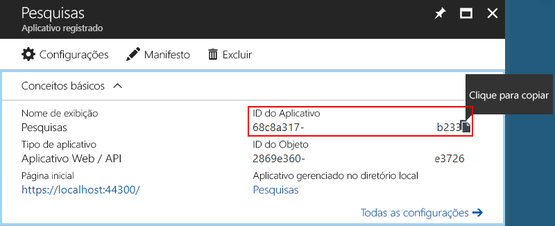

6. Clique em **Propriedades**.

7. Na caixa de edição **URI da ID do aplicativo**, digite `https://<domain>/surveys`, em que `<domain>` é o nome de domínio do diretório.

    

8. Defina **Multilocatário** como **SIM**.

9. Clique em **Salvar**.

10. Na folha **Configurações**, clique em **URLs de resposta**.

11. Adicione a seguinte URL de resposta: `https://localhost:44300/signin-oidc`.

12. Clique em **Salvar**.

13. Em **Acesso à API**, clique em **Chaves**.

14. Insira uma descrição, como `client secret`.

15. Na lista suspensa **Selecionar Duração**, selecione **1 ano**.

16. Clique em **Salvar**. A chave será gerada quando você salvar.

17. Antes de sair da folha, copie o valor da chave.

    > [!NOTE]
    > A chave não ficará visível novamente depois de sair da folha.

18. Em **ACESSO À API**, clique em **Permissões necessárias**.

19. Clique em **Adicionar** > **Selecionar uma API**.

20. Na caixa Pesquisar, pesquise por `Surveys.WebAPI`.

    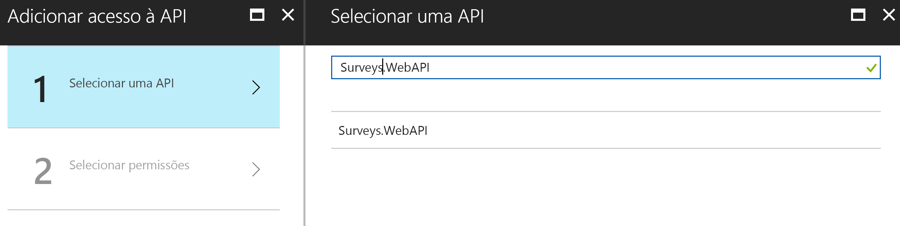

21. Selecione `Surveys.WebAPI` e clique em **Selecionar**.

22. Em **Permissões Delegadas**, marque **Acessar Surveys.WebAPI**.

    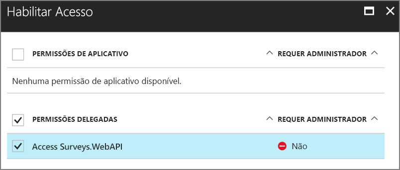

23. Clique em **Selecionar** > **Concluído**.

## <a name="update-the-application-manifests"></a>Atualizar os manifestos do aplicativo

1. Volte para a folha **Configurações** para o aplicativo `Surveys.WebAPI`.

2. Clique em **Manifesto** > **Editar**.

    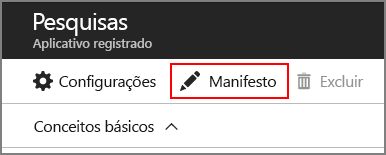

3. Adicione o seguinte JSON ao elemento `appRoles`. Gere novos GUIDs para as propriedades `id`.

   ```json
   {
     "allowedMemberTypes": ["User"],
     "description": "Creators can create surveys",
     "displayName": "SurveyCreator",
     "id": "<Generate a new GUID. Example: 1b4f816e-5eaf-48b9-8613-7923830595ad>",
     "isEnabled": true,
     "value": "SurveyCreator"
   },
   {
     "allowedMemberTypes": ["User"],
     "description": "Administrators can manage the surveys in their tenant",
     "displayName": "SurveyAdmin",
     "id": "<Generate a new GUID>",  
     "isEnabled": true,
     "value": "SurveyAdmin"
   }
   ```

4. Na propriedade `knownClientApplications`, adicione a ID do aplicativo para o aplicativo Web Surveys, que você obteve ao registrar o aplicativo Surveys anteriormente. Por exemplo: 

   ```json
   "knownClientApplications": ["be2cea23-aa0e-4e98-8b21-2963d494912e"],
   ```

   Essa configuração adiciona o aplicativo Surveys à lista de clientes autorizado a chamar a API Web.

5. Clique em **Salvar**.

Agora, repita as mesmas etapas para o aplicativo Surveys, mas não adicione uma entrada para `knownClientApplications`. Usar as mesmas definições de função, mas gere novos GUIDs para as IDs.

## <a name="create-a-new-redis-cache-instance"></a>Criar uma nova instância do Cache Redis

O aplicativo Surveys usa Redis para armazenar em cache tokens de acesso OAuth 2. Para criar o cache:

1. Vá para [Portal do Azure](https://portal.azure.com) e clique em **+ Criar um Recurso** > **Bancos de dados** > **Cache Redis**.

2. Preencha as informações necessárias, incluindo o nome DNS, o grupo de recursos, o local e o tipo de preço. Você pode criar um novo grupo de recursos ou usar um grupo de recursos existente.

3. Clique em **Criar**.

4. Depois que o cache Redis é criado, navegue até o recurso no portal.

5. Clique em **Chaves de acesso** e copie a chave primária.

Para obter mais informações sobre como criar um cache Redis, consulte [Como usar o cache Redis do Azure](/azure/redis-cache/cache-dotnet-how-to-use-azure-redis-cache).

## <a name="set-application-secrets"></a>Definir segredos do aplicativo

1. Abra a solução Tailspin.Surveys no Visual Studio.

2. No Gerenciador de Soluções, clique com o botão direito no projeto Tailspin.Surveys.Web e selecione **Gerenciar Segredos do Usuário**.

3. No arquivo secrets.json, cole o seguinte:

    ```json
    {
      "AzureAd": {
        "ClientId": "<Surveys application ID>",
        "ClientSecret": "<Surveys app client secret>",
        "PostLogoutRedirectUri": "https://localhost:44300/",
        "WebApiResourceId": "<Surveys.WebAPI app ID URI>"
      },
      "Redis": {
        "Configuration": "<Redis DNS name>.redis.cache.windows.net,password=<Redis primary key>,ssl=true"
      }
    }
    ```

    Substitua os itens mostrados entre colchetes da seguinte maneira:

    - `AzureAd:ClientId`: a ID do aplicativo Surveys.
    - `AzureAd:ClientSecret`: a chave que foi gerada quando você registrou o aplicativo de pesquisas no Azure AD.
    - `AzureAd:WebApiResourceId`: o URI da ID do Aplicativo que você especificou quando criou o aplicativo Surveys.WebAPI no Azure AD. Deve ter o formato `https://<directory>.onmicrosoft.com/surveys.webapi`
    - `Redis:Configuration`: crie essa cadeia de caracteres usando o nome DNS do cache Redis e a chave de acesso primária. Por exemplo, "tailspin.redis.cache.windows.net,password=2h5tBxxx,ssl=true".

4. Salve o arquivo secrets.json atualizado.

5. Repita essas etapas para o projeto Tailspin.Surveys.WebAPI e cole o seguinte no secrets.json. Substitua os itens entre colchetes, como antes.

    ```json
    {
      "AzureAd": {
        "WebApiResourceId": "<Surveys.WebAPI app ID URI>"
      },
      "Redis": {
        "Configuration": "<Redis DNS name>.redis.cache.windows.net,password=<Redis primary key>,ssl=true"
      }
    }
    ```

## <a name="initialize-the-database"></a>Inicializar o banco de dados

Nesta etapa, você usará o Entity Framework 7 para criar um banco de dados SQL local usando o LocalDB.

1. Abra uma janela Comando

2. Navegue até o projeto Tailspin.Surveys.Data.

3. Execute o comando a seguir:

    ```bat
    dotnet ef database update --startup-project ..\Tailspin.Surveys.Web
    ```

## <a name="run-the-application"></a>Executar o aplicativo

Para executar o aplicativo, inicie os projetos Tailspin.Surveys.Web e Tailspin.Surveys.WebAPI.

Você pode definir o Visual Studio para executar os dois projetos automaticamente em F5 da seguinte maneira:

1. No Gerenciador de Soluções, clique com o botão direito do mouse na solução e selecione **Definir Projetos de Inicialização**.
2. Selecione **Vários projetos de inicialização**.
3. Defina **Ação** = **Iniciar** para os projetos Tailspin.Surveys.Web e Tailspin.Surveys.WebAPI.

## <a name="sign-up-a-new-tenant"></a>Inscrever um novo locatário

Quando o aplicativo é iniciado, você não é conectado, então você vê a página de boas-vindas:

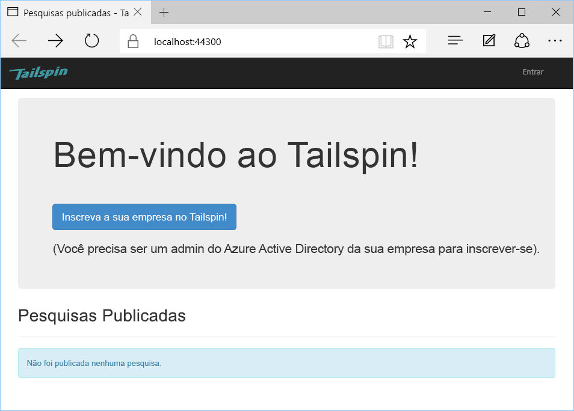

Para inscrever uma organização:

1. Clique em **Inscrever sua empresa no Tailspin**.
2. Entre no diretório do Azure AD que representa a organização usando o aplicativo Surveys. Você deve entrar como um usuário administrador.
3. Aceite a solicitação de consentimento.

O aplicativo registra o locatário e, em seguida, você é desconectado. O aplicativo faz com que você seja desconectado porque você precisa configurar as funções de aplicativo no Azure AD antes de usar o aplicativo.

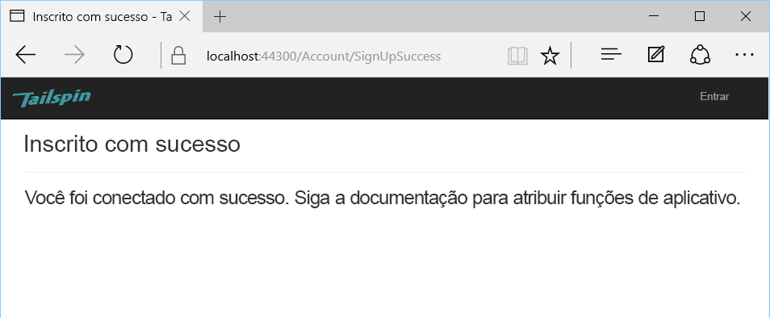

## <a name="assign-application-roles"></a>Atribuir funções de aplicativo

Quando um locatário se inscreve, um administrador do AD para o locatário deve atribuir funções de aplicativo aos usuários.

1. No [portal do Azure][portal], mude para o diretório do Azure AD que você usou para inscrever-se para o aplicativo Surveys.

2. No painel de navegação esquerdo, escolha **Azure Active Directory**.

3. Acesse **Aplicativos empresariais** > **Todos os aplicativos**. O portal listará `Survey` e `Survey.WebAPI`. Caso contrário, conclua o processo de inscrição.

4. Clique em executar o aplicativo Surveys.

5. Clique em **Usuários e Grupos**.

6. Clique em **Adicionar usuário**.

7. Se você tiver o Azure AD Premium, clique em **Usuários e grupos**. Caso contrário, clique em **Usuários**. (Atribuir uma função a um grupo requer o Azure AD Premium.)

8. Selecione um ou mais usuários e clique em **Selecionar**.

    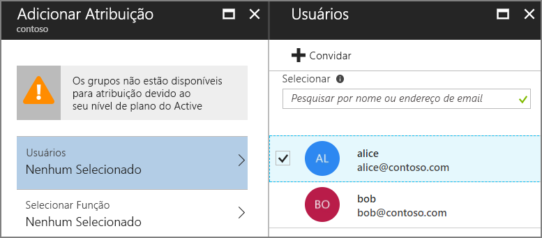

9. Selecione a função e clique em **Selecionar**.

    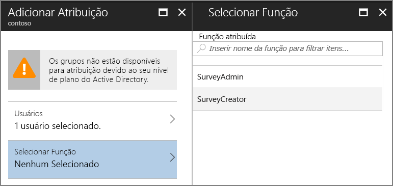

10. Clique em **Atribuir**.

Repita as mesmas etapas para atribuir funções ao aplicativo Survey.WebAPI.

> [!IMPORTANT]
> Um usuário deve sempre ter as mesmas funções tanto em Survey quanto em Survey.WebAPI. Caso contrário, o usuário terá permissões inconsistente, o que pode levar a erros 403 (proibido) da API Web.

Agora volte para o aplicativo e entre novamente. Clique em **Minhas Pesquisas**. Se o usuário for atribuído à função SurveyAdmin ou SurveyCreator, você verá um botão **Criar pesquisa**, que indica se o usuário tem permissões para criar uma nova pesquisa.

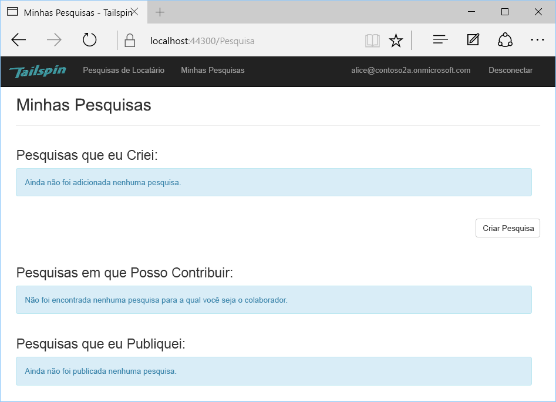

<!-- links -->

[portal]: https://portal.azure.com
[VS2017]: https://www.visualstudio.com/vs/
