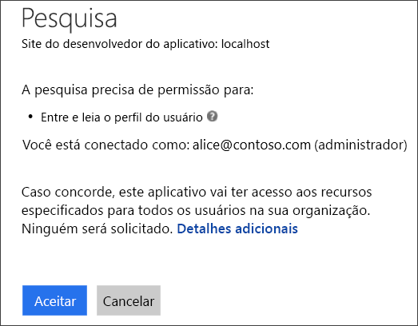
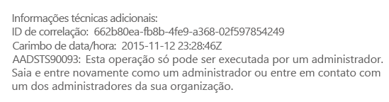
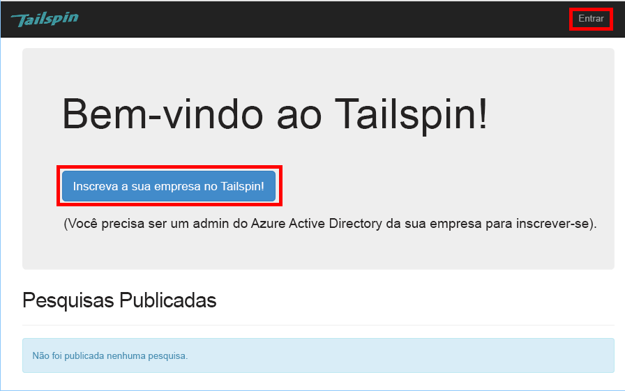
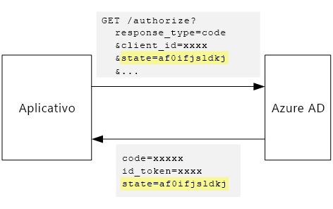

# <a name="tenant-sign-up-and-onboarding"></a><span data-ttu-id="c38fd-103">Inscrição e integração de locatário</span><span class="sxs-lookup"><span data-stu-id="c38fd-103">Tenant sign-up and onboarding</span></span>

<span data-ttu-id="c38fd-104">[Código de exemplo do ][sample application]</span><span class="sxs-lookup"><span data-stu-id="c38fd-104">[ Sample code][sample application]</span></span>

<span data-ttu-id="c38fd-105">Este artigo descreve como implementar um processo de *inscrição* em um aplicativo multilocatário que permite que um cliente inscreva sua organização para seu aplicativo.</span><span class="sxs-lookup"><span data-stu-id="c38fd-105">This article describes how to implement a *sign-up* process in a multi-tenant application, which allows a customer to sign up their organization for your application.</span></span>
<span data-ttu-id="c38fd-106">Há várias razões para implementar um processo de inscrição:</span><span class="sxs-lookup"><span data-stu-id="c38fd-106">There are several reasons to implement a sign-up process:</span></span>

* <span data-ttu-id="c38fd-107">Permitir que um administrador do AD autorize o uso do aplicativo por toda a organização do cliente.</span><span class="sxs-lookup"><span data-stu-id="c38fd-107">Allow an AD admin to consent for the customer's entire organization to use the application.</span></span>
* <span data-ttu-id="c38fd-108">Cobrar o pagamento por cartão de crédito ou coletar outras informações do cliente.</span><span class="sxs-lookup"><span data-stu-id="c38fd-108">Collect credit card payment or other customer information.</span></span>
* <span data-ttu-id="c38fd-109">Executar a instalação avulsa por locatário que venha a ser necessária para seu aplicativo.</span><span class="sxs-lookup"><span data-stu-id="c38fd-109">Perform any one-time per-tenant setup needed by your application.</span></span>

## <a name="admin-consent-and-azure-ad-permissions"></a><span data-ttu-id="c38fd-110">Consentimento do administrador e permissões do Azure AD</span><span class="sxs-lookup"><span data-stu-id="c38fd-110">Admin consent and Azure AD permissions</span></span>
<span data-ttu-id="c38fd-111">Para autenticar com o Azure AD, o aplicativo precisa acessar o diretório do usuário.</span><span class="sxs-lookup"><span data-stu-id="c38fd-111">In order to authenticate with Azure AD, an application needs access to the user's directory.</span></span> <span data-ttu-id="c38fd-112">O aplicativo precisa, no mínimo, de permissão para ler o perfil do usuário.</span><span class="sxs-lookup"><span data-stu-id="c38fd-112">At a minimum, the application needs permission to read the user's profile.</span></span> <span data-ttu-id="c38fd-113">Na primeira vez que um usuário fizer logon, o Azure AD mostrará uma página de consentimento que lista as permissões que estão sendo solicitadas.</span><span class="sxs-lookup"><span data-stu-id="c38fd-113">The first time that a user signs in, Azure AD shows a consent page that lists the permissions being requested.</span></span> <span data-ttu-id="c38fd-114">Ao clicar em **Aceitar**, o usuário concederá permissão para o aplicativo.</span><span class="sxs-lookup"><span data-stu-id="c38fd-114">By clicking **Accept**, the user grants permission to the application.</span></span>

<span data-ttu-id="c38fd-115">Por padrão, o consentimento é concedido baseado em cada usuário.</span><span class="sxs-lookup"><span data-stu-id="c38fd-115">By default, consent is granted on a per-user basis.</span></span> <span data-ttu-id="c38fd-116">Todos os usuários que entrarem verão a página de consentimento.</span><span class="sxs-lookup"><span data-stu-id="c38fd-116">Every user who signs in sees the consent page.</span></span> <span data-ttu-id="c38fd-117">No entanto, o Azure AD também dá suporte ao *consentimento do administrador*, que permite a um administrador do AD dar consentimentos em nome de toda a organização.</span><span class="sxs-lookup"><span data-stu-id="c38fd-117">However, Azure AD also supports  *admin consent*, which allows an AD administrator to consent for an entire organization.</span></span>

<span data-ttu-id="c38fd-118">Quando o fluxo de consentimento do administrador é usado, a página de autorização informa que o administrador do AD está concedendo a permissão em nome do locatário inteiro:</span><span class="sxs-lookup"><span data-stu-id="c38fd-118">When the admin consent flow is used, the consent page states that the AD admin is granting permission on behalf of the entire tenant:</span></span>



<span data-ttu-id="c38fd-120">Depois que o administrador clica em **Aceitar**, outros usuários no mesmo locatário podem entrar e o Azure AD ignorará a tela de consentimento.</span><span class="sxs-lookup"><span data-stu-id="c38fd-120">After the admin clicks **Accept**, other users within the same tenant can sign in, and Azure AD will skip the consent screen.</span></span>

<span data-ttu-id="c38fd-121">Somente um administrador do AD pode dar consentimento de administrador, já que ele concede permissão em nome de toda a organização.</span><span class="sxs-lookup"><span data-stu-id="c38fd-121">Only an AD administrator can give admin consent, because it grants permission on behalf of the entire organization.</span></span> <span data-ttu-id="c38fd-122">Se alguém que não for um administrador tentar autenticar com o fluxo de consentimento do administrador, o Azure AD exibirá um erro:</span><span class="sxs-lookup"><span data-stu-id="c38fd-122">If a non-administrator tries to authenticate with the admin consent flow, Azure AD displays an error:</span></span>



<span data-ttu-id="c38fd-124">Se o aplicativo exigir permissões adicionais em um momento posterior, o cliente precisará se inscrever novamente e concordar com as permissões atualizadas.</span><span class="sxs-lookup"><span data-stu-id="c38fd-124">If the application requires additional permissions at a later point, the customer will need to sign up again and consent to the updated permissions.</span></span>  

## <a name="implementing-tenant-sign-up"></a><span data-ttu-id="c38fd-125">Implementando a inscrição de locatário</span><span class="sxs-lookup"><span data-stu-id="c38fd-125">Implementing tenant sign-up</span></span>
<span data-ttu-id="c38fd-126">Para o aplicativo [Tailspin Surveys][Tailspin], definimos diversos requisitos para o processo de inscrição:</span><span class="sxs-lookup"><span data-stu-id="c38fd-126">For the [Tailspin Surveys][Tailspin] application,  we defined several requirements for the sign-up process:</span></span>

* <span data-ttu-id="c38fd-127">Um locatário deve se inscrever antes dos usuários poderem entrar.</span><span class="sxs-lookup"><span data-stu-id="c38fd-127">A tenant must sign up before users can sign in.</span></span>
* <span data-ttu-id="c38fd-128">A inscrição usa o fluxo de consentimento do administrador.</span><span class="sxs-lookup"><span data-stu-id="c38fd-128">Sign-up uses the admin consent flow.</span></span>
* <span data-ttu-id="c38fd-129">A inscrição adiciona o locatário do usuário ao banco de dados do aplicativo.</span><span class="sxs-lookup"><span data-stu-id="c38fd-129">Sign-up adds the user's tenant to the application database.</span></span>
* <span data-ttu-id="c38fd-130">Depois que um locatário se inscreve, o aplicativo mostra uma página de integração.</span><span class="sxs-lookup"><span data-stu-id="c38fd-130">After a tenant signs up, the application shows an onboarding page.</span></span>

<span data-ttu-id="c38fd-131">Nesta seção, vamos examinar nossa implementação do processo de inscrição.</span><span class="sxs-lookup"><span data-stu-id="c38fd-131">In this section, we'll walk through our implementation of the sign-up process.</span></span>
<span data-ttu-id="c38fd-132">É importante entender que "inscrição" versus "logon" é um conceito de aplicativo.</span><span class="sxs-lookup"><span data-stu-id="c38fd-132">It's important to understand that "sign up" versus "sign in" is an application concept.</span></span> <span data-ttu-id="c38fd-133">Durante o fluxo de autenticação, o Azure AD não tem como saber se o usuário está no processo de inscrição.</span><span class="sxs-lookup"><span data-stu-id="c38fd-133">During the authentication flow, Azure AD does not inherently know whether the user is in process of signing up.</span></span> <span data-ttu-id="c38fd-134">Cabe ao aplicativo controlar o contexto.</span><span class="sxs-lookup"><span data-stu-id="c38fd-134">It's up to the application to keep track of the context.</span></span>

<span data-ttu-id="c38fd-135">Quando um usuário anônimo visita o aplicativo Surveys, o usuário vê dois botões, um para entrar e um para "registrar sua empresa" (inscrever-se).</span><span class="sxs-lookup"><span data-stu-id="c38fd-135">When an anonymous user visits the Surveys application, the user is shown two buttons, one to sign in, and one to "enroll your company" (sign up).</span></span>



<span data-ttu-id="c38fd-137">Esses botões invocam ações na classe `AccountController`.</span><span class="sxs-lookup"><span data-stu-id="c38fd-137">These buttons invoke actions in the `AccountController` class.</span></span>

<span data-ttu-id="c38fd-138">A ação `SignIn` retorna um **ChallegeResult**, que faz com que o middleware OpenID Connect redirecione para o ponto de extremidade de autenticação.</span><span class="sxs-lookup"><span data-stu-id="c38fd-138">The `SignIn` action returns a **ChallegeResult**, which causes the OpenID Connect middleware to redirect to the authentication endpoint.</span></span> <span data-ttu-id="c38fd-139">Essa é a maneira padrão de disparar a autenticação no ASP.NET Core.</span><span class="sxs-lookup"><span data-stu-id="c38fd-139">This is the default way to trigger authentication in ASP.NET Core.</span></span>  

```csharp
[AllowAnonymous]
public IActionResult SignIn()
{
    return new ChallengeResult(
        OpenIdConnectDefaults.AuthenticationScheme,
        new AuthenticationProperties
        {
            IsPersistent = true,
            RedirectUri = Url.Action("SignInCallback", "Account")
        });
}
```

<span data-ttu-id="c38fd-140">Agora compare a ação `SignUp` :</span><span class="sxs-lookup"><span data-stu-id="c38fd-140">Now compare the `SignUp` action:</span></span>

```csharp
[AllowAnonymous]
public IActionResult SignUp()
{
    var state = new Dictionary<string, string> { { "signup", "true" }};
    return new ChallengeResult(
        OpenIdConnectDefaults.AuthenticationScheme,
        new AuthenticationProperties(state)
        {
            RedirectUri = Url.Action(nameof(SignUpCallback), "Account")
        });
}
```

<span data-ttu-id="c38fd-141">Como `SignIn`, a ação `SignUp` também retorna um `ChallengeResult`.</span><span class="sxs-lookup"><span data-stu-id="c38fd-141">Like `SignIn`, the `SignUp` action also returns a `ChallengeResult`.</span></span> <span data-ttu-id="c38fd-142">Mas, dessa vez, vamos adicionar uma parte das informações de estado às `AuthenticationProperties` in the `ChallengeResult`:</span><span class="sxs-lookup"><span data-stu-id="c38fd-142">But this time, we add a piece of state information to the `AuthenticationProperties` in the `ChallengeResult`:</span></span>

* <span data-ttu-id="c38fd-143">inscrição: um sinalizador booliano indicando que o usuário iniciou o processo de inscrição.</span><span class="sxs-lookup"><span data-stu-id="c38fd-143">signup: A Boolean flag, indicating that the user has started the sign-up process.</span></span>

<span data-ttu-id="c38fd-144">As informações de estado em `AuthenticationProperties` são adicionadas ao parâmetro [state] do OpenID Connect, que vai e volta durante o fluxo de autenticação.</span><span class="sxs-lookup"><span data-stu-id="c38fd-144">The state information in `AuthenticationProperties` gets added to the OpenID Connect [state] parameter, which round trips during the authentication flow.</span></span>



<span data-ttu-id="c38fd-146">Depois que o usuário é autenticado no Azure AD e é redirecionado ao aplicativo, o tíquete de autenticação contém o estado.</span><span class="sxs-lookup"><span data-stu-id="c38fd-146">After the user authenticates in Azure AD and gets redirected back to the application, the authentication ticket contains the state.</span></span> <span data-ttu-id="c38fd-147">Estamos usando isso para fazer com que o valor "inscrição" persista durante todo o fluxo de autenticação.</span><span class="sxs-lookup"><span data-stu-id="c38fd-147">We are using this fact to make sure the "signup" value persists across the entire authentication flow.</span></span>

## <a name="adding-the-admin-consent-prompt"></a><span data-ttu-id="c38fd-148">Adicionando a solicitação de consentimento do administrador</span><span class="sxs-lookup"><span data-stu-id="c38fd-148">Adding the admin consent prompt</span></span>
<span data-ttu-id="c38fd-149">No Azure AD, o fluxo de consentimento do administrador é disparado com a adição de um parâmetro "prompt" à cadeia de caracteres de consulta na solicitação de autenticação:</span><span class="sxs-lookup"><span data-stu-id="c38fd-149">In Azure AD, the admin consent flow is triggered by adding a "prompt" parameter to the query string in the authentication request:</span></span>

```
/authorize?prompt=admin_consent&...
```

<span data-ttu-id="c38fd-150">O aplicativo Surveys adiciona o prompt durante o evento `RedirectToAuthenticationEndpoint` .</span><span class="sxs-lookup"><span data-stu-id="c38fd-150">The Surveys application adds the prompt during the `RedirectToAuthenticationEndpoint` event.</span></span> <span data-ttu-id="c38fd-151">Esse evento é chamado momentos antes do middleware redirecionar para o ponto de extremidade de autenticação.</span><span class="sxs-lookup"><span data-stu-id="c38fd-151">This event is called right before the middleware redirects to the authentication endpoint.</span></span>

```csharp
public override Task RedirectToAuthenticationEndpoint(RedirectContext context)
{
    if (context.IsSigningUp())
    {
        context.ProtocolMessage.Prompt = "admin_consent";
    }

    _logger.RedirectToIdentityProvider();
    return Task.FromResult(0);
}
```

<span data-ttu-id="c38fd-152">A definição de` ProtocolMessage.Prompt` ordena ao middleware que adicione o parâmetro "prompt" à solicitação de autenticação.</span><span class="sxs-lookup"><span data-stu-id="c38fd-152">Setting` ProtocolMessage.Prompt` tells the middleware to add the "prompt" parameter to the authentication request.</span></span>

<span data-ttu-id="c38fd-153">Observe que o prompt é necessário somente durante a inscrição.</span><span class="sxs-lookup"><span data-stu-id="c38fd-153">Note that the prompt is only needed during sign-up.</span></span> <span data-ttu-id="c38fd-154">O logon normal não deve incluí-lo.</span><span class="sxs-lookup"><span data-stu-id="c38fd-154">Regular sign-in should not include it.</span></span> <span data-ttu-id="c38fd-155">Para distinguir entre eles, verificamos o valor `signup` no estado de autenticação.</span><span class="sxs-lookup"><span data-stu-id="c38fd-155">To distinguish between them, we check for the `signup` value in the authentication state.</span></span> <span data-ttu-id="c38fd-156">O seguinte método de extensão verifica essa condição:</span><span class="sxs-lookup"><span data-stu-id="c38fd-156">The following extension method checks for this condition:</span></span>

```csharp
internal static bool IsSigningUp(this BaseControlContext context)
{
    Guard.ArgumentNotNull(context, nameof(context));

    string signupValue;
    // Check the HTTP context and convert to string
    if ((context.Ticket == null) ||
        (!context.Ticket.Properties.Items.TryGetValue("signup", out signupValue)))
    {
        return false;
    }

    // We have found the value, so see if it's valid
    bool isSigningUp;
    if (!bool.TryParse(signupValue, out isSigningUp))
    {
        // The value for signup is not a valid boolean, throw                
        throw new InvalidOperationException($"'{signupValue}' is an invalid boolean value");
    }

    return isSigningUp;
}
```

## <a name="registering-a-tenant"></a><span data-ttu-id="c38fd-157">Registrando um locatário</span><span class="sxs-lookup"><span data-stu-id="c38fd-157">Registering a Tenant</span></span>
<span data-ttu-id="c38fd-158">O aplicativo Surveys armazena algumas informações sobre cada locatário e usuário no banco de dados do aplicativo.</span><span class="sxs-lookup"><span data-stu-id="c38fd-158">The Surveys application stores some information about each tenant and user in the application database.</span></span>


<span data-ttu-id="c38fd-160">Na tabela Locatário, IssuerValue é o valor da declaração do emissor do locatário.</span><span class="sxs-lookup"><span data-stu-id="c38fd-160">In the Tenant table, IssuerValue is the value of the issuer claim for the tenant.</span></span> <span data-ttu-id="c38fd-161">Para o Azure AD, ele é o `https://sts.windows.net/<tentantID>` e fornece um valor exclusivo por locatário.</span><span class="sxs-lookup"><span data-stu-id="c38fd-161">For Azure AD, this is `https://sts.windows.net/<tentantID>` and gives a unique value per tenant.</span></span>

<span data-ttu-id="c38fd-162">Quando um novo locatário se inscreve, o aplicativo Surveys grava um registro de locatário no banco de dados.</span><span class="sxs-lookup"><span data-stu-id="c38fd-162">When a new tenant signs up, the Surveys application writes a tenant record to the database.</span></span> <span data-ttu-id="c38fd-163">Isso acontece dentro do evento `AuthenticationValidated`.</span><span class="sxs-lookup"><span data-stu-id="c38fd-163">This happens inside the `AuthenticationValidated` event.</span></span> <span data-ttu-id="c38fd-164">Não faça isso antes desse evento, pois o token de ID não será validado ainda, portanto, você não pode confiar nos valores de declaração.</span><span class="sxs-lookup"><span data-stu-id="c38fd-164">(Don't do it before this event, because the ID token won't be validated yet, so you can't trust the claim values.</span></span> <span data-ttu-id="c38fd-165">Consulte [Autenticação].</span><span class="sxs-lookup"><span data-stu-id="c38fd-165">See [Authentication].</span></span>

<span data-ttu-id="c38fd-166">Veja o código relevante do aplicativo Surveys:</span><span class="sxs-lookup"><span data-stu-id="c38fd-166">Here is the relevant code from the Surveys application:</span></span>

```csharp
public override async Task TokenValidated(TokenValidatedContext context)
{
    var principal = context.AuthenticationTicket.Principal;
    var userId = principal.GetObjectIdentifierValue();
    var tenantManager = context.HttpContext.RequestServices.GetService<TenantManager>();
    var userManager = context.HttpContext.RequestServices.GetService<UserManager>();
    var issuerValue = principal.GetIssuerValue();
    _logger.AuthenticationValidated(userId, issuerValue);

    // Normalize the claims first.
    NormalizeClaims(principal);
    var tenant = await tenantManager.FindByIssuerValueAsync(issuerValue)
        .ConfigureAwait(false);

    if (context.IsSigningUp())
    {
        if (tenant == null)
        {
            tenant = await SignUpTenantAsync(context, tenantManager)
                .ConfigureAwait(false);
        }

        // In this case, we need to go ahead and set up the user signing us up.
        await CreateOrUpdateUserAsync(context.Ticket, userManager, tenant)
            .ConfigureAwait(false);
    }
    else
    {
        if (tenant == null)
        {
            _logger.UnregisteredUserSignInAttempted(userId, issuerValue);
            throw new SecurityTokenValidationException($"Tenant {issuerValue} is not registered");
        }

        await CreateOrUpdateUserAsync(context.Ticket, userManager, tenant)
            .ConfigureAwait(false);
    }
}
```

<span data-ttu-id="c38fd-167">O código faz o seguinte:</span><span class="sxs-lookup"><span data-stu-id="c38fd-167">This code does the following:</span></span>

1. <span data-ttu-id="c38fd-168">Verifique se o valor do emissor do locatário já está no banco de dados.</span><span class="sxs-lookup"><span data-stu-id="c38fd-168">Check if the tenant's issuer value is already in the database.</span></span> <span data-ttu-id="c38fd-169">Se o locatário não se inscreveu, `FindByIssuerValueAsync` retorna null.</span><span class="sxs-lookup"><span data-stu-id="c38fd-169">If the tenant has not signed up, `FindByIssuerValueAsync` returns null.</span></span>
2. <span data-ttu-id="c38fd-170">Se o usuário estiver se inscrevendo:</span><span class="sxs-lookup"><span data-stu-id="c38fd-170">If the user is signing up:</span></span>
   1. <span data-ttu-id="c38fd-171">Adicione o locatário ao banco de dados (`SignUpTenantAsync`).</span><span class="sxs-lookup"><span data-stu-id="c38fd-171">Add the tenant to the database (`SignUpTenantAsync`).</span></span>
   2. <span data-ttu-id="c38fd-172">Adicione o usuário autenticado ao banco de dados (`CreateOrUpdateUserAsync`).</span><span class="sxs-lookup"><span data-stu-id="c38fd-172">Add the authenticated user to the database (`CreateOrUpdateUserAsync`).</span></span>
3. <span data-ttu-id="c38fd-173">Caso contrário, siga o fluxo de entrada normal:</span><span class="sxs-lookup"><span data-stu-id="c38fd-173">Otherwise complete the normal sign-in flow:</span></span>
   1. <span data-ttu-id="c38fd-174">Se o emissor do locatário não foi encontrado no banco de dados, isso significa que o locatário não está registrado e o cliente precisa se inscrever.</span><span class="sxs-lookup"><span data-stu-id="c38fd-174">If the tenant's issuer was not found in the database, it means the tenant is not registered, and the customer needs to sign up.</span></span> <span data-ttu-id="c38fd-175">Nesse caso, lance uma exceção para causar uma falha na autenticação.</span><span class="sxs-lookup"><span data-stu-id="c38fd-175">In that case, throw an exception to cause the authentication to fail.</span></span>
   2. <span data-ttu-id="c38fd-176">Caso contrário, crie um registro de banco de dados para o usuário, se já não houver um (`CreateOrUpdateUserAsync`).</span><span class="sxs-lookup"><span data-stu-id="c38fd-176">Otherwise, create a database record for this user, if there isn't one already (`CreateOrUpdateUserAsync`).</span></span>

<span data-ttu-id="c38fd-177">Aqui está o método `SignUpTenantAsync` que adiciona o locatário ao banco de dados.</span><span class="sxs-lookup"><span data-stu-id="c38fd-177">Here is the `SignUpTenantAsync` method that adds the tenant to the database.</span></span>

```csharp
private async Task<Tenant> SignUpTenantAsync(BaseControlContext context, TenantManager tenantManager)
{
    Guard.ArgumentNotNull(context, nameof(context));
    Guard.ArgumentNotNull(tenantManager, nameof(tenantManager));

    var principal = context.Ticket.Principal;
    var issuerValue = principal.GetIssuerValue();
    var tenant = new Tenant
    {
        IssuerValue = issuerValue,
        Created = DateTimeOffset.UtcNow
    };

    try
    {
        await tenantManager.CreateAsync(tenant)
            .ConfigureAwait(false);
    }
    catch(Exception ex)
    {
        _logger.SignUpTenantFailed(principal.GetObjectIdentifierValue(), issuerValue, ex);
        throw;
    }

    return tenant;
}
```

<span data-ttu-id="c38fd-178">Veja um resumo de todo o fluxo de inscrição no aplicativo Surveys:</span><span class="sxs-lookup"><span data-stu-id="c38fd-178">Here is a summary of the entire sign-up flow in the Surveys application:</span></span>

1. <span data-ttu-id="c38fd-179">O usuário clica no botão **Inscrever-se** .</span><span class="sxs-lookup"><span data-stu-id="c38fd-179">The user clicks the **Sign Up** button.</span></span>
2. <span data-ttu-id="c38fd-180">A ação `AccountController.SignUp` retorna um resultado de desafio.</span><span class="sxs-lookup"><span data-stu-id="c38fd-180">The `AccountController.SignUp` action returns a challege result.</span></span>  <span data-ttu-id="c38fd-181">O estado da autenticação inclui o valor "inscrição".</span><span class="sxs-lookup"><span data-stu-id="c38fd-181">The authentication state includes "signup" value.</span></span>
3. <span data-ttu-id="c38fd-182">No evento `RedirectToAuthenticationEndpoint`, adicione o prompt `admin_consent`.</span><span class="sxs-lookup"><span data-stu-id="c38fd-182">In the `RedirectToAuthenticationEndpoint` event, add the `admin_consent` prompt.</span></span>
4. <span data-ttu-id="c38fd-183">O middleware OpenID Connect redireciona para o Azure AD e o usuário é autenticado.</span><span class="sxs-lookup"><span data-stu-id="c38fd-183">The OpenID Connect middleware redirects to Azure AD and the user authenticates.</span></span>
5. <span data-ttu-id="c38fd-184">No evento `AuthenticationValidated` , procure o estado "inscrição".</span><span class="sxs-lookup"><span data-stu-id="c38fd-184">In the `AuthenticationValidated` event, look for the "signup" state.</span></span>
6. <span data-ttu-id="c38fd-185">Adicione o locatário ao banco de dados.</span><span class="sxs-lookup"><span data-stu-id="c38fd-185">Add the tenant to the database.</span></span>

<span data-ttu-id="c38fd-186">[**Avançar**][app roles]</span><span class="sxs-lookup"><span data-stu-id="c38fd-186">[**Next**][app roles]</span></span>

<!-- Links -->
[app roles]: app-roles.md
[Tailspin]: tailspin.md

[state]: http://openid.net/specs/openid-connect-core-1_0.html#AuthRequest
[Autenticação]: authenticate.md
[Authentication]: authenticate.md
[sample application]: https://github.com/mspnp/multitenant-saas-guidance
