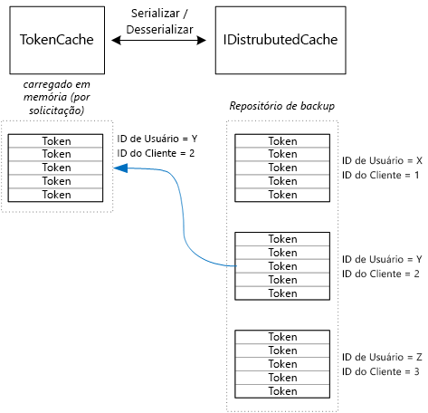

# <a name="cache-access-tokens"></a>Armazenar tokens de acesso em cache

[Código de exemplo do ][sample application]

É relativamente caro obter um token de acesso OAuth porque requer uma solicitação HTTP para o ponto de extremidade do token. Portanto, é bom armazenar tokens em cache sempre que possível. A [Biblioteca de Autenticação do Azure AD][ADAL] (ADAL) armazena em cache automaticamente tokens obtidos do Azure AD, incluindo tokens de atualização.

A ADAL fornece uma implementação de cache de token padrão. No entanto, o cache de token é destinado a aplicativos cliente nativos e **não** é adequado para aplicativos Web:

* É uma instância estática e não thread-safe.
* Não é dimensionado para um grande número de usuários porque os tokens de todos os usuários vão para o mesmo dicionário.
* Não pode ser compartilhado entre servidores Web em um farm.

Em vez disso, você deve implementar um cache de token personalizado que deriva da classe `TokenCache` da ADAL, mas é adequado para um ambiente de servidor e fornece o nível desejado de isolamento entre tokens para usuários diferentes.

A classe `TokenCache` armazena um dicionário de tokens indexado por emissor, recursos, ID de cliente e usuário. Um cache de token personalizado deve gravar este dicionário em um repositório de backup, como um cache Redis.

No aplicativo Tailspin Surveys, a classe `DistributedTokenCache` implementa o cache de token. Essa implementação usa a abstração [IDistributedCache][distributed-cache] do ASP.NET Core. Dessa forma, qualquer implementação de `IDistributedCache` pode ser usada como um repositório de backup.

* Por padrão, o aplicativo Surveys usa um cache Redis.
* Para um servidor Web de instância única, você pode usar o [cache na memória][in-memory-cache] do ASP.NET Core. (Isso também é uma boa opção para executar o aplicativo localmente durante o desenvolvimento.)

`DistributedTokenCache` armazena os dados do cache como pares chave/valor no repositório de backup. A chave é a ID do cliente mais a ID de usuário para que o repositório de backup armazene dados de cache separados para cada combinação exclusiva de usuário/cliente.



O repositório de backup é particionado pelo usuário. Para cada solicitação HTTP, os tokens de usuário são lidos no armazenamento de backup e carregados no dicionário `TokenCache` . Se o Redis é usado como repositório de backup, cada instância de servidor em um farm de servidores lê e grava no mesmo cache e essa abordagem pode ser expandida para muitos usuários.

## <a name="encrypting-cached-tokens"></a>Criptografar tokens em cache

Tokens são dados confidenciais, pois concedem acesso aos recursos do usuário. (Além disso, ao contrário de uma senha de usuário, você não pode apenas armazenar um hash do token.) Portanto, é essencial proteger os tokens para que não sejam comprometidos. O cache Redis com suporte do Redis é protegido por senha, mas se alguém obtiver a senha, poderá obter todos os tokens de acesso armazenados em cache. Por esse motivo, o `DistributedTokenCache` criptografa tudo o que grava no repositório de backup. A criptografia é feita usando as APIs de [proteção de dados][data-protection] do ASP.NET Core.

> [!NOTE]
> Se você implantar em Sites do Azure, será feito um backup das chaves de criptografia no armazenamento de rede e sincronizadas em todos os computadores (consulte [Gerenciamento e tempo de vida da chave][key-management]). Por padrão, as chaves não são criptografadas durante a execução em sites do Azure Web, mas você pode [habilitar a criptografia usando um certificado X.509][x509-cert-encryption].

## <a name="distributedtokencache-implementation"></a>Implementação do DistributedTokenCache

A classe `DistributedTokenCache` deriva da classe [TokenCache][tokencache-class] ADAL.

No construtor, a classe `DistributedTokenCache` cria uma chave para o usuário atual e carrega o cache a partir do armazenamento de backup:

```csharp
public DistributedTokenCache(
    ClaimsPrincipal claimsPrincipal,
    IDistributedCache distributedCache,
    ILoggerFactory loggerFactory,
    IDataProtectionProvider dataProtectionProvider)
    : base()
{
    _claimsPrincipal = claimsPrincipal;
    _cacheKey = BuildCacheKey(_claimsPrincipal);
    _distributedCache = distributedCache;
    _logger = loggerFactory.CreateLogger<DistributedTokenCache>();
    _protector = dataProtectionProvider.CreateProtector(typeof(DistributedTokenCache).FullName);
    AfterAccess = AfterAccessNotification;
    LoadFromCache();
}
```

A chave é criada concatenando a ID de usuário e a ID do cliente. Ambos são tirados das declarações encontradas na `ClaimsPrincipal`do usuário:

```csharp
private static string BuildCacheKey(ClaimsPrincipal claimsPrincipal)
{
    string clientId = claimsPrincipal.FindFirstValue("aud", true);
    return string.Format(
        "UserId:{0}::ClientId:{1}",
        claimsPrincipal.GetObjectIdentifierValue(),
        clientId);
}
```

Para carregar os dados do cache, leia o blob serializado do repositório de backup e chame `TokenCache.Deserialize` para converter o blob em dados de cache.

```csharp
private void LoadFromCache()
{
    byte[] cacheData = _distributedCache.Get(_cacheKey);
    if (cacheData != null)
    {
        this.Deserialize(_protector.Unprotect(cacheData));
    }
}
```

Sempre que a ADAL acessa o cache, ela dispara um evento `AfterAccess` . Se os dados do cache forem alterados, a propriedade `HasStateChanged` será true. Nesse caso, atualize o repositório de backup para refletir a alteração e defina `HasStateChanged` como false.

```csharp
public void AfterAccessNotification(TokenCacheNotificationArgs args)
{
    if (this.HasStateChanged)
    {
        try
        {
            if (this.Count > 0)
            {
                _distributedCache.Set(_cacheKey, _protector.Protect(this.Serialize()));
            }
            else
            {
                // There are no tokens for this user/client, so remove the item from the cache.
                _distributedCache.Remove(_cacheKey);
            }
            this.HasStateChanged = false;
        }
        catch (Exception exp)
        {
            _logger.WriteToCacheFailed(exp);
            throw;
        }
    }
}
```

O TokenCache envia dois outros eventos:

* `BeforeWrite`. Chamado imediatamente antes da ADAL gravar no cache. Você pode usar isso para implementar uma estratégia de simultaneidade
* `BeforeAccess`. Chamado imediatamente antes da ADAL ler do cache. Aqui você pode recarregar o cache para obter a versão mais recente.

No nosso caso, decidimos não manipular esses dois eventos.

* No caso de simultaneidade, a última gravação prevalece. Não há problema, pois os tokens são armazenados de forma independente para cada usuário + cliente, portanto um conflito só acontece se o mesmo usuário tiver duas sessões simultâneas de logon.
* Para leitura, carregamos o cache em cada solicitação. As solicitações têm vida curta. Se o cache for modificado nesse momento, a próxima solicitação selecionará o novo valor.

[**Avançar**][client-assertion]

<!-- links -->
[ADAL]: https://msdn.microsoft.com/library/azure/jj573266.aspx
[client-assertion]: ./client-assertion.md
[data-protection]: /aspnet/core/security/data-protection/
[distributed-cache]: /aspnet/core/performance/caching/distributed
[key-management]: /aspnet/core/security/data-protection/configuration/default-settings
[in-memory-cache]: /aspnet/core/performance/caching/memory
[tokencache-class]: https://msdn.microsoft.com/library/azure/microsoft.identitymodel.clients.activedirectory.tokencache.aspx
[x509-cert-encryption]: /aspnet/core/security/data-protection/implementation/key-encryption-at-rest#x509-certificate
[sample application]: https://github.com/mspnp/multitenant-saas-guidance
