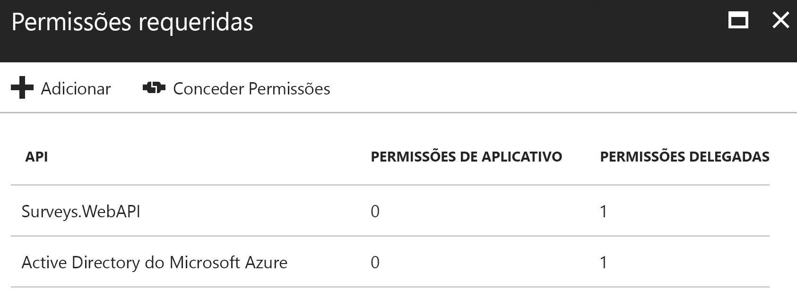

# <a name="secure-a-backend-web-api"></a>Proteger uma API Web de back-end

[Código de exemplo do ][sample application]

O aplicativo [Tailspin Surveys] usa uma API Web de back-end para gerenciar operações CRUD em pesquisas. Por exemplo, quando um usuário clica em "Minhas Pesquisas", o aplicativo Web envia uma solicitação HTTP para a API Web:

```http
GET /users/{userId}/surveys
```

A API Web retorna um objeto JSON:

```http
{
  "Published":[],
  "Own":[
    {"Id":1,"Title":"Survey 1"},
    {"Id":3,"Title":"Survey 3"},
    ],
  "Contribute": [{"Id":8,"Title":"My survey"}]
}
```

A API Web não permite solicitações anônimas, portanto, o aplicativo Web deve se autenticar usando tokens de portador OAuth 2.

> [!NOTE]
> Esse é um cenário de servidor a servidor. O aplicativo não faz chamadas AJAX à API a partir do cliente de navegador.

Há duas abordagens principais que você pode usar:

* Identidade de usuário delegado. O aplicativo Web autentica com a identidade do usuário.
* Identidade do aplicativo. O aplicativo Web autentica com sua ID de cliente usando o fluxo de credencial de cliente OAuth2.

O aplicativo Tailspin implementa a identidade de usuário delegado. Aqui estão as diferenças principais:

**Identidade de usuário delegado:**

* O token de portador enviado para a API Web contém a identidade do usuário.
* A API Web toma decisões de autorização baseadas na identidade do usuário.
* O aplicativo Web precisará lidar com erros 403 (Proibido) da API Web se o usuário não estiver autorizado a executar uma ação.
* Normalmente, o aplicativo Web ainda toma algumas decisões de autorização que afetam a interface do usuário, como mostrar ou ocultar elementos da interface do usuário.
* A API Web pode vir a ser usada por clientes não confiáveis, como um aplicativo JavaScript ou um aplicativo cliente nativo.

**Identidade do aplicativo:**

* A API Web não obtém informações sobre o usuário.
* A API Web não pode executar autorizações baseadas na identidade do usuário. Todas as decisões de autorização são feitas pelo aplicativo Web.  
* A API Web não pode ser usada por um cliente não confiável (JavaScript ou aplicativo cliente nativo).
* Essa abordagem pode ser um pouco mais simples de implementar já que não há lógicas de autorização na API Web.

Seja qual for a abordagem, o aplicativo Web deve obter um token de acesso que é a credencial necessária para chamar a API Web.

* No caso da identidade de usuário delegado, o token tem de vir do IDP, que pode emitir um token em nome do usuário.
* No caso das credenciais do cliente, um aplicativo pode obter o token do IDP ou hospedar seu próprio servidor de tokens. (Mas não grave um servidor de token do zero; use uma estrutura bem testada, como [IdentityServer4].) Se você autenticar com o Azure AD, é altamente recomendado obter o token de acesso do Azure AD, mesmo com o fluxo de credenciais do cliente.

O restante deste artigo pressupõe que o aplicativo esteja se autenticando com o Azure AD.


## <a name="register-the-web-api-in-azure-ad"></a>Registrar a API Web no Azure AD

Para que o Azure AD emita um token de portador para a API Web, serão necessárias algumas configurações.

1. Registre a API Web no Azure AD.

2. Adicione a ID do cliente do aplicativo Web ao manifesto de aplicativo da API Web na propriedade `knownClientApplications` . Confira [Atualizar os manifestos do aplicativo].

3. Conceda permissão de aplicativo Web para chamar a API Web. No Portal de Gerenciamento do Azure, você pode definir dois tipos de permissões: "Permissões de Aplicativo" para a identidade do aplicativo (fluxo da credencial de cliente) ou "Permissões Delegadas" para a identidade do usuário delegado.

   

## <a name="getting-an-access-token"></a>Obtendo um token de acesso

Antes de chamar a API Web, o aplicativo Web obtém um token de acesso do Azure AD. Em um aplicativo .NET, use a [Biblioteca de Autenticação do Azure AD (ADAL) para .NET][ADAL].

No fluxo de código de autorização OAuth 2, o aplicativo troca um código de autorização por um token de acesso. O código a seguir usa ADAL para obter o token de acesso. Esse código é chamado durante o evento `AuthorizationCodeReceived` .

```csharp
// The OpenID Connect middleware sends this event when it gets the authorization code.
public override async Task AuthorizationCodeReceived(AuthorizationCodeReceivedContext context)
{
    string authorizationCode = context.ProtocolMessage.Code;
    string authority = "https://login.microsoftonline.com/" + tenantID
    string resourceID = "https://tailspin.onmicrosoft.com/surveys.webapi" // App ID URI
    ClientCredential credential = new ClientCredential(clientId, clientSecret);

    AuthenticationContext authContext = new AuthenticationContext(authority, tokenCache);
    AuthenticationResult authResult = await authContext.AcquireTokenByAuthorizationCodeAsync(
        authorizationCode, new Uri(redirectUri), credential, resourceID);

    // If successful, the token is in authResult.AccessToken
}
```

Estes são os vários parâmetros necessários:

* `authority`. Derivado da ID do locatário do usuário conectado. (Não a ID do locatário do provedor de SaaS)  
* `authorizationCode`. O código de autenticação que você recebeu do IDP.
* `clientId`. A ID do cliente do aplicativo Web.
* `clientSecret`. O segredo do cliente do aplicativo Web.
* `redirectUri`. O URI de redirecionamento que você definiu para a conexão do OpenID. Esse é o local onde o IDP retorna a chamada com o token.
* `resourceID`. O URI da ID de aplicativo da API Web que você criou quando registrou a API Web no Azure AD
* `tokenCache`. Um objeto que armazena os tokens de acesso em cache. Confira [Colocação de tokens em cache].

Se `AcquireTokenByAuthorizationCodeAsync` for bem-sucedido, a ADAL armazenará o token em cache. Posteriormente, você pode obter o token do cache chamando AcquireTokenSilentAsync:

```csharp
AuthenticationContext authContext = new AuthenticationContext(authority, tokenCache);
var result = await authContext.AcquireTokenSilentAsync(resourceID, credential, new UserIdentifier(userId, UserIdentifierType.UniqueId));
```

em que `userId` é a ID de objeto do usuário, encontrada na declaração `http://schemas.microsoft.com/identity/claims/objectidentifier`.

## <a name="using-the-access-token-to-call-the-web-api"></a>Usando o token de acesso para chamar a API Web

Quando já tiver o token, envie-o no cabeçalho Autorização das solicitações HTTP à API Web.

```http
Authorization: Bearer xxxxxxxxxx
```

O método de extensão do aplicativo Surveys a seguir define o cabeçalho Autorização em uma solicitação HTTP usando a classe **HttpClient** .

```csharp
public static async Task<HttpResponseMessage> SendRequestWithBearerTokenAsync(this HttpClient httpClient, HttpMethod method, string path, object requestBody, string accessToken, CancellationToken ct)
{
    var request = new HttpRequestMessage(method, path);
    if (requestBody != null)
    {
        var json = JsonConvert.SerializeObject(requestBody, Formatting.None);
        var content = new StringContent(json, Encoding.UTF8, "application/json");
        request.Content = content;
    }

    request.Headers.Authorization = new AuthenticationHeaderValue("Bearer", accessToken);
    request.Headers.Accept.Add(new MediaTypeWithQualityHeaderValue("application/json"));

    var response = await httpClient.SendAsync(request, ct);
    return response;
}
```

## <a name="authenticating-in-the-web-api"></a>Autenticando na API Web

A API Web precisa autenticar o token de portador. No ASP.NET Core, você pode usar o pacote [Microsoft.AspNet.Authentication.JwtBearer][JwtBearer]. Esse pacote fornece o middleware que permite ao aplicativo receber tokens de portador do OpenID Connect.

Registre o middleware na classe `Startup` de sua API Web.

```csharp
public void Configure(IApplicationBuilder app, IHostingEnvironment env, ApplicationDbContext dbContext, ILoggerFactory loggerFactory)
{
    // ...

    app.UseJwtBearerAuthentication(new JwtBearerOptions {
        Audience = configOptions.AzureAd.WebApiResourceId,
        Authority = Constants.AuthEndpointPrefix,
        TokenValidationParameters = new TokenValidationParameters {
            ValidateIssuer = false
        },
        Events= new SurveysJwtBearerEvents(loggerFactory.CreateLogger<SurveysJwtBearerEvents>())
    });

    // ...
}
```

* **Público-alvo**. Defina como a URL da ID de aplicativo da API Web que você criou quando registrou a API Web no Azure AD.
* **Autoridade**. No caso do aplicativo de multilocatário, defina como `https://login.microsoftonline.com/common/`.
* **TokenValidationParameters**. Para um aplicativo multilocatário, defina **ValidateIssuer** como falso. Isso significa que o aplicativo validará o emissor.
* **Eventos** é uma classe que deriva de **JwtBearerEvents**.

### <a name="issuer-validation"></a>Validação do emissor

Valide o emissor do token no evento **JwtBearerEvents.TokenValidated**. O emissor é enviado na declaração "iss".

No aplicativo Surveys, a Web API não trata da [inscrição de locatários]. Portanto, ela apenas verifica se o emissor já está no banco de dados do aplicativo. Se não estiver, ela gerará uma exceção que causará uma falha na autenticação.

```csharp
public override async Task TokenValidated(TokenValidatedContext context)
{
    var principal = context.Ticket.Principal;
    var tenantManager = context.HttpContext.RequestServices.GetService<TenantManager>();
    var userManager = context.HttpContext.RequestServices.GetService<UserManager>();
    var issuerValue = principal.GetIssuerValue();
    var tenant = await tenantManager.FindByIssuerValueAsync(issuerValue);

    if (tenant == null)
    {
        // The caller was not from a trusted issuer. Throw to block the authentication flow.
        throw new SecurityTokenValidationException();
    }

    var identity = principal.Identities.First();

    // Add new claim for survey_userid
    var registeredUser = await userManager.FindByObjectIdentifier(principal.GetObjectIdentifierValue());
    identity.AddClaim(new Claim(SurveyClaimTypes.SurveyUserIdClaimType, registeredUser.Id.ToString()));
    identity.AddClaim(new Claim(SurveyClaimTypes.SurveyTenantIdClaimType, registeredUser.TenantId.ToString()));

    // Add new claim for Email
    var email = principal.FindFirst(ClaimTypes.Upn)?.Value;
    if (!string.IsNullOrWhiteSpace(email))
    {
        identity.AddClaim(new Claim(ClaimTypes.Email, email));
    }
}
```

Como mostra este exemplo, você também pode usar o evento **TokenValidated** para modificar as declarações. Lembre-se de que as declarações são fornecidas diretamente do Azure AD. Se o aplicativo Web modificar as declarações que obtém, essas alterações não aparecerão no token portador que a API Web recebe. Para obter mais informações, consulte [Transformações de declarações][claims-transformation].

## <a name="authorization"></a>Autorização

Para obter uma discussão geral sobre autorização, consulte [Autorização baseada em função e baseada em recursos][Authorization].

O middleware JwtBearer manipula as respostas de autorização. Por exemplo, para restringir uma ação do controlador para usuários autenticados, use o atributo **[Autorizar]** e especifique **JwtBearerDefaults.AuthenticationScheme** como o esquema de autenticação:

```csharp
[Authorize(ActiveAuthenticationSchemes = JwtBearerDefaults.AuthenticationScheme)]
```

retornará um código de status 401 se o usuário não estiver autenticado.

Para restringir uma ação do controlador pela política de autorização, especifique o nome da política no atributo **[Autorizar]**:

```csharp
[Authorize(Policy = PolicyNames.RequireSurveyCreator)]
```

retornará um código de status 401 se o usuário não estiver autenticado e 403 se o usuário estiver autenticado, mas não autorizado. Registre a política na inicialização:

```csharp
public void ConfigureServices(IServiceCollection services)
{
    services.AddAuthorization(options =>
    {
        options.AddPolicy(PolicyNames.RequireSurveyCreator,
            policy =>
            {
                policy.AddRequirements(new SurveyCreatorRequirement());
                policy.RequireAuthenticatedUser(); // Adds DenyAnonymousAuthorizationRequirement
                policy.AddAuthenticationSchemes(JwtBearerDefaults.AuthenticationScheme);
            });
        options.AddPolicy(PolicyNames.RequireSurveyAdmin,
            policy =>
            {
                policy.AddRequirements(new SurveyAdminRequirement());
                policy.RequireAuthenticatedUser(); // Adds DenyAnonymousAuthorizationRequirement
                policy.AddAuthenticationSchemes(JwtBearerDefaults.AuthenticationScheme);
            });
    });

    // ...
}
```

[**Avançar**][token cache]

<!-- links -->
[ADAL]: https://msdn.microsoft.com/library/azure/jj573266.aspx
[JwtBearer]: https://www.nuget.org/packages/Microsoft.AspNet.Authentication.JwtBearer

[Tailspin Surveys]: tailspin.md
[IdentityServer4]: https://github.com/IdentityServer/IdentityServer4
[Atualizar os manifestos do aplicativo]: ./run-the-app.md#update-the-application-manifests
[Colocação de tokens em cache]: token-cache.md
[inscrição de locatários]: signup.md
[claims-transformation]: claims.md#claims-transformations
[Authorization]: authorize.md
[sample application]: https://github.com/mspnp/multitenant-saas-guidance
[token cache]: token-cache.md
