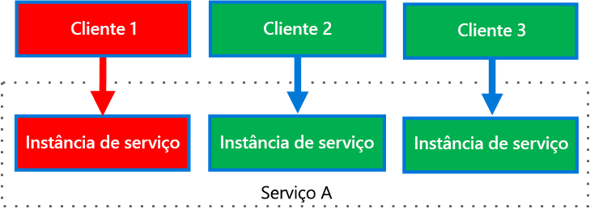

# <a name="bulkhead-pattern"></a>Padrão de bulkhead

Isole os elementos de um aplicativo em pools para que, se um falhar, os outros continuarão a funcionar.

Esse padrão é denominado *Bulkhead* (tabique) porque é parecido com as partições seccionadas do casco de um navio. Se o casco de um navio for comprometido, somente a seção danificada se encherá de água, impedindo que o navio afunde. 

## <a name="context-and-problem"></a>Contexto e problema

Um aplicativo baseado em nuvem pode incluir vários serviços, cada um deles tendo um ou mais consumidores. Carga excessiva ou falha em um serviço afetará todos os consumidores do serviço.

Além disso, um consumidor pode enviar solicitações a vários serviços ao mesmo tempo usando recursos para cada solicitação. Quando o consumidor envia uma solicitação para um serviço que está configurado incorretamente ou não está respondendo, os recursos usados pela solicitação do cliente não podem ser liberados de maneira oportuna. Conforme as solicitações ao serviço continuam, esses recursos podem ser esgotados. Por exemplo, o pool de conexão do cliente pode ser esgotado. Neste ponto, as solicitações do consumidor a outros serviços são afetadas. Por fim, o consumidor não poderá mais enviar solicitações a outros serviços, não apenas ao serviço que originalmente não estava respondendo.

O mesmo problema de esgotamento de recursos afeta serviços com vários consumidores. Um grande número de solicitações originadas de um cliente pode esgotar os recursos disponíveis no serviço. Outros consumidores não são conseguem mais consumir o serviço, causando um efeito de falha em cascata.

## <a name="solution"></a>Solução

Particione instâncias de serviço em grupos diferentes conforme a carga do consumidor e nos requisitos de disponibilidade. Esse design ajuda a isolar falhas e permite que você mantenha a funcionalidade do serviço para alguns clientes mesmo durante uma falha.

Um consumidor também pode dividir os recursos para garantir que os recursos usados para chamar um serviço não afetem os recursos usados para chamar outro. Por exemplo, um pool de conexão para cada serviço poderá ser atribuído a um consumidor que chame vários serviços. Se um serviço começar a falhar, isso afetará somente o pool de conexão atribuído a esse serviço, permitindo que o consumidor continue usando outros serviços.

Os benefícios desse padrão incluem:

- Isolar os consumidores e os serviços para que não haja falhas em cascata. Um problema que afeta um consumidor ou um serviço pode ser isolado em seu próprio bulkhead, impedindo que a solução inteira falhe.
- Permitir que você preserve algumas funcionalidades em caso de falha de serviço. Outros serviços e recursos do aplicativo continuarão a funcionar.
- Permitir que você implante os serviços que oferecem uma qualidade de serviço diferente para aplicativos de consumo. Um pool de consumidor de alta prioridade pode ser configurado para usar serviços de alta prioridade. 

O diagrama a seguir mostra bulkheads estruturados em torno de pools de conexão que chamam serviços individuais. Se o Serviço A falhar ou causar algum outro problema, o pool de conexão será isolado, assim, somente as cargas de trabalho que usem o pool de threads atribuído ao Serviço A serão afetadas. Cargas de trabalho que usam os Serviços B e C não são afetadas e podem continuar trabalhando sem interrupções.

 

O diagrama seguinte mostra vários clientes chamando um único serviço. Cada cliente é atribuído a uma instância de serviço separada. O Cliente 1 fez solicitações demais e sobrecarregou sua instância. Uma vez que cada instância de serviço é isolada de outras, os outros clientes podem continuar fazendo chamadas.


     
## <a name="issues-and-considerations"></a>Problemas e considerações

- Defina partições em torno de requisitos comerciais e técnicos do aplicativo.
- Ao particionar serviços ou consumidores em bulkheads, considere o nível de isolamento oferecido pela tecnologia, bem como a sobrecarga em termos de custo, desempenho e capacidade de gerenciamento.
- Considere combinar bulkheads com nova tentativa, interruptor de circuito e padrões de limitação para proporcionar um tratamento de falhas mais sofisticado.
- Ao particionar os consumidores em bulkheads, considere usar processos, pools de threads e semáforos. Projetos como [Netflix Hystrix][hystrix] e [Polly][polly] oferecem uma estrutura para criar bulkheads do consumidor.
- Ao particionar serviços em bulkheads, considere implantá-los em máquinas virtuais, contêineres ou processos separados. Contêineres oferecem um bom equilíbrio de isolamento de recursos com uma sobrecarga razoavelmente baixa.
- Serviços que se comunicam usando mensagens assíncronas podem ser isolados por meio de diferentes conjuntos de filas. Cada fila pode ter um conjunto dedicado de instâncias processando mensagens na fila ou um único grupo de instâncias usando um algoritmo para processamento de remoção da fila e expedição.
- Determine o nível de granularidade dos bulkheads. Por exemplo, se você quiser distribuir locatários entre partições, poderá colocar cada locatário em uma partição separada ou colocar vários locatários em uma partição.
- Monitore o desempenho e o SLA de cada partição.

## <a name="when-to-use-this-pattern"></a>Quando usar esse padrão

Use esse padrão para:

- Isolar os recursos usados para consumir um conjunto de serviços de back-end, especialmente se o aplicativo puder fornecer algum nível de funcionalidade mesmo quando um dos serviços não estiver respondendo.
- Isole os consumidores críticos dos consumidores padrão.
- Proteja o aplicativo contra falhas em cascata.

Esse padrão pode não ser adequado quando:

- Uso menos eficiente de recursos pode não ser aceitável no projeto.
- A complexidade adicional não é necessária

## <a name="example"></a>Exemplo

O seguinte arquivo de configuração Kubernetes cria um contêiner isolado para executar um único serviço, com seus próprios recursos e limites de CPU e memória.

```yml
apiVersion: v1
kind: Pod
metadata:
  name: drone-management
spec:
  containers:
  - name: drone-management-container
    image: drone-service
    resources:
      requests:
        memory: "64Mi"
        cpu: "250m"
      limits:
        memory: "128Mi"
        cpu: "1"
```

## <a name="related-guidance"></a>Diretrizes relacionadas

- [Padrão de interruptor de circuito](./circuit-breaker.md)
- [Projeto de aplicativos resilientes do Azure](../resiliency/index.md)
- [Padrão de repetição](./retry.md)
- [Padrão de limitação](./throttling.md)


<!-- links -->

[hystrix]: https://github.com/Netflix/Hystrix
[polly]: https://github.com/App-vNext/Polly