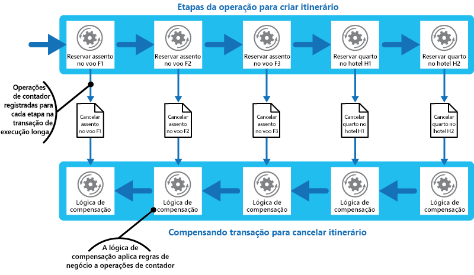

# Padrão de Transação de Compensação

[!INCLUDE [header](../_includes/header.md)]

Desfaça o trabalho executado por uma série de etapas, que juntas definem uma operação eventualmente consistente, se uma ou mais das etapas falhar. As operações que seguem o modelo de consistência eventual geralmente normalmente são encontradas em aplicativos hospedados em nuvem que implementam fluxos de trabalho e processos de negócios complexos.

## Contexto e problema

Aplicativos em execução na nuvem com modificam os dados com frequência. Esses dados podem ser distribuídos entre várias fontes de dados mantidas em diferentes locais geográficos. Para evitar a contenção e melhorar o desempenho em um ambiente distribuído, um aplicativo não deve tentar fornecer forte consistência transacional. Em vez disso, o aplicativo deve implementar a consistência eventual. Neste modelo, uma operação de negócios típica consiste em uma série de etapas separadas. Enquanto essas etapas estão sendo executadas, a visão geral do estado do sistema pode ficar divergente, mas quando a operação for concluída e todas as etapas forem executadas no sistema, ela deverá ficar consistente novamente.

> O [Primer de Consistência de Dados](https://msdn.microsoft.com/library/dn589800.aspx) fornece informações sobre por que as transações distribuídas não escalam bem e os princípios do modelo de consistência eventual.

Um desafio do modelo de consistência eventual é como tratar uma etapa que falhou. Nesse caso, pode ser necessário desfazer todo o trabalho concluído pelas etapas anteriores na operação. No entanto, os dados não podem ser simplesmente revertidos porque outras instâncias simultâneas do aplicativo já podem tê-los alterado. Mesmo nos casos em que os dados não foram alterados por uma instância simultânea, desfazer uma etapa pode não ser simplesmente uma questão de restaurar o estado original. Pode ser necessário aplicar várias regras específicas de negócios (consulte o site de viagem descrito na seção Exemplo).

Se uma operação que implementa a consistência eventual abrange vários armazenamentos de dados heterogêneos, desfazer as etapas na operação exige visitar cada armazenamento de dados por vez. O trabalho realizado em cada armazenamento de dados deve ser desfeito de forma confiável para impedir que o sistema permaneça divergente.

Nem todos os dados afetados por uma operação que implementa a consistência eventual podem ser mantidos em um banco de dados. Em um ambiente de arquitetura SOA uma operação poderia invocar uma ação em um serviço e causar uma alteração no estado mantido por esse serviço. Para desfazer a operação, essa alteração de estado também deverá ser desfeita. Isso pode envolver invocar o serviço novamente e executar outra ação que reverte os efeitos da primeira.

## Solução

A solução é implementar uma transação de compensação. As etapas em uma transação de compensação devem desfazer os efeitos das etapas na operação original. Uma transação de compensação não poderá simplesmente substituir o estado atual pelo estado em que o sistema estava no início da operação porque essa abordagem poderia substituir as alterações feitas por outras instâncias simultâneas de um aplicativo. Em vez disso, ele deve ser um processo inteligente que leva em conta a qualquer trabalho realizado por instâncias simultâneas. Esse processo geralmente será específico do aplicativo, acompanhando a natureza do trabalho realizado pela operação original.

Uma abordagem comum é usar um fluxo de trabalho para implementar uma operação eventualmente consistente que exige compensação. À medida que a operação original prossegue, o sistema registra informações sobre cada etapa e como o trabalho executado pela etapa pode ser desfeito. Se a operação falhar em qualquer ponto, o fluxo de trabalho retrocede as etapas concluídas e executa o trabalho que reverte cada etapa. Observe que uma transação de compensação pode não precisar desfazer o trabalho na ordem inversa exata da operação original e pode ser possível realizar algumas das etapas de reversão em paralelo.

> Essa abordagem é semelhante à estratégia do Sagas discutida no [blog de Clemens Vasters](https://vasters.com/clemensv/2012/09/01/Sagas.aspx).

Uma transação de compensação também é uma operação eventualmente consistente e ela também poderia falhar. O sistema deve ser capaz de retomar a transação de compensação no ponto de falha e continuar. Pode ser necessário repetir uma etapa que falhou, portanto as etapas em uma transação de compensação devem ser definidas como comandos idempotentes. Para obter mais informações, consulte [Padrões de idempotência](https://blog.jonathanoliver.com/idempotency-patterns/) no blog de Jonathan Oliver.

Em alguns casos, pode não ser possível recuperar de uma etapa com falha, exceto por meio de intervenção manual. Nessas situações, o sistema deve acionar um alerta e fornecer o máximo possível de informações sobre o motivo da falha.

## Problemas e considerações

Considere os seguintes pontos ao decidir como implementar esse padrão:

Pode ser difícil determinar quando uma etapa em uma operação que implementa a consistência eventual falhou. Uma etapa não pode falhar imediatamente sendo, em vez disso, bloqueada. Pode ser necessário implementar algum mecanismo de tempo limite.

-A lógica de compensação não é facilmente generalizada. Uma transação de compensação é específica do aplicativo. Ele se baseia no aplicativo ter informações suficientes para poder desfazer os efeitos de cada etapa em uma operação com falha.

Você deve definir as etapas em uma transação de compensação como comandos idempotentes. Isso permite que as etapas sejam repetidas se a própria transação de compensação falhar.

A infraestrutura que manipula as etapas da operação original, bem como a transação de compensação, deve ser resiliente. É preciso que ela não perca as informações necessárias para compensar uma etapa que falhou e deve ser capaz monitorar o progresso da lógica de compensação de forma confiável.

Uma transação de compensação não necessariamente retorna os dados no sistema para o estado em que ele estava no início da operação original. Em vez disso, ela compensa o trabalho realizado pelas etapas concluídas com êxito antes da operação falhar.

A ordem das etapas de transações de compensação não precisa necessariamente ser o oposto exato das etapas na operação original. Por exemplo, um armazenamento de dados pode ser mais suscetível a inconsistências que outro, portanto as etapas na transação de compensação que desfazem as alterações neste repositório devem ocorrer primeiro.

Colocar um bloqueio de curto prazo baseado em tempo limite em cada recurso necessário para concluir uma operação e obter esses recursos com antecedência, pode ajudar a aumentar a probabilidade de que a atividade geral tenha êxito. O trabalho deverá ser executado somente depois que todos os recursos forem adquiridos. Todas as ações devem ser finalizadas antes dos bloqueios expirarem.

Considere usar lógica de repetição mais tolerante que o normal para minimizar falhas que disparam uma transação de compensação. Se uma etapa em uma operação que implementa a consistência eventual falhar, tente tratar a falha como uma exceção transitória e repita a etapa. Apenas pare a operação e inicie uma transação de compensação se uma etapa falhar repetidamente ou de forma irrecuperável.

> Muitos dos desafios da implementação de uma transação de compensação são iguais aos da implementação de consistência eventual. Consulte a seção Considerações para implementar a consistência eventual no [Primer de consistência de dados](https://msdn.microsoft.com/library/dn589800.aspx) para obter mais informações.

## Quando usar esse padrão

Use este padrão apenas para operações que devem ser desfeitas se elas falharem. Se possível, crie soluções para evitar a complexidade de exigir transações de compensação.

## Exemplo

Um site de viagem permite que os clientes reservem roteiro. Um único roteiro pode ser composto por uma série de voos e hotéis. Um cliente que viaja de Seattle para Londres e depois para Paris poderia executar as seguintes etapas ao criar um roteiro:

1. Reservar um assento no voo F1 de Seattle para Londres.
2. Reservar um assento no voo F2 de Londres para Paris.
3. Reservar um assento no voo F3 de Paris para Seattle.
4. Reserve um quarto no hotel H1 em Londres.
5. Reserve um quarto no hotel H2 em Paris.

Essas etapas constituem uma operação eventualmente consistente, embora cada uma delas seja uma ação separada. Portanto, além de executar essas etapas, o sistema deve também registrar as operações de contador necessárias para desfazer cada etapa caso o cliente decida cancelar o roteiro. As etapas necessárias para executar as operações de contador podem então ser executadas como uma transação de compensação.

Observe que as etapas na transação de compensação podem não ser o oposto exato das etapas originais e a lógica de cada etapa na transação de compensação deve levar em conta as regras específicas de negócios. Por exemplo, cancelar a reserva de um voo pode não conceder ao cliente um reembolso completo do valor pago. A figura ilustra a criação de uma transação de compensação para desfazer uma transação de execução longa para reservar um roteiro de viagem.

> [!NOTE]
> Pode ser possível que as etapas na transação de compensação sejam executadas em paralelo, dependendo de como você criou a lógica de compensação para cada etapa.

Em muitas soluções de negócios, a falha de uma única etapa não exige a reversão do sistema usando uma transação de compensação. Por exemplo, se &mdash; após ter reservado os voos F1, F2 e F3 no cenário de site de viagem&mdash; o cliente não puder reservar um quarto no hotel H1, é preferível oferecer ao cliente um quarto em um hotel diferente na mesma cidade em vez de cancelar os voos. O cliente ainda pode optar por cancelar (quando então a transação de compensação é executada e desfaz as reservas feitas nos voos F1, F2 e F3), mas essa decisão deve ser feita pelo cliente e não pelo sistema.

## Diretrizes e padrões relacionados

Os padrões e diretrizes a seguir também podem ser relevantes ao implementar esse padrão:

- [Primer de Consistência de Dados](https://msdn.microsoft.com/library/dn589800.aspx). O padrão de Transações de Compensação geralmente é usado para desfazer operações que implementam o modelo de consistência eventual. Esse primer fornece informações sobre as vantagens e desvantagens da consistência eventual.

- [Padrão Agendador-Agente-Supervisor](./scheduler-agent-supervisor.md). Descreve como implementar sistemas resilientes que executam operações de negócios que usam recursos e serviços distribuídos. Às vezes, pode ser necessário desfazer o trabalho executado por uma operação usando uma transação de compensação.

- [Padrão de repetição](./retry.md). Pode ser caro executar as transações de compensação, por isso pode ser possível minimizar seu uso com a implementação de uma política efetiva de repetição de operações com falha seguindo o Padrão de repetição.
