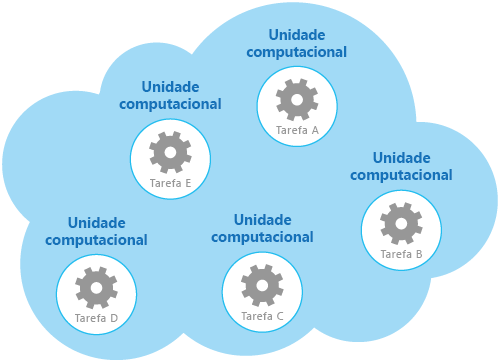

# <a name="compute-resource-consolidation-pattern"></a><span data-ttu-id="42d09-104">Padrão de consolidação de recursos de computação</span><span class="sxs-lookup"><span data-stu-id="42d09-104">Compute Resource Consolidation pattern</span></span>

[!INCLUDE [header](../_includes/header.md)]

<span data-ttu-id="42d09-105">Consolidar várias tarefas ou operações em uma única unidade de computação.</span><span class="sxs-lookup"><span data-stu-id="42d09-105">Consolidate multiple tasks or operations into a single computational unit.</span></span> <span data-ttu-id="42d09-106">Isso pode aumentar a utilização de recursos de computação, reduzir os custos e as despesas gerais de gerenciamento associados à execução de processamento de computação em aplicativos hospedados na nuvem.</span><span class="sxs-lookup"><span data-stu-id="42d09-106">This can increase compute resource utilization, and reduce the costs and management overhead associated with performing compute processing in cloud-hosted applications.</span></span>

## <a name="context-and-problem"></a><span data-ttu-id="42d09-107">Contexto e problema</span><span class="sxs-lookup"><span data-stu-id="42d09-107">Context and problem</span></span>

<span data-ttu-id="42d09-108">Um aplicativo de nuvem geralmente implementa uma variedade de operações.</span><span class="sxs-lookup"><span data-stu-id="42d09-108">A cloud application often implements a variety of operations.</span></span> <span data-ttu-id="42d09-109">Em algumas soluções, faz sentido seguir o princípio do projeto de separação de preocupações inicialmente, e dividir essas operações em unidades computacionais separadas que são hospedadas e implantadas individualmente (por exemplo, como aplicativos Web do Serviço de Aplicativo separados, Máquinas Virtuais separadas ou funções de Serviço de Nuvem separadas).</span><span class="sxs-lookup"><span data-stu-id="42d09-109">In some solutions it makes sense to follow the design principle of separation of concerns initially, and divide these operations into separate computational units that are hosted and deployed individually (for example, as separate App Service web apps, separate Virtual Machines, or separate Cloud Service roles).</span></span> <span data-ttu-id="42d09-110">No entanto, embora essa estratégia possa ajudar a simplificar o design lógico da solução, a implantação de um grande número de unidades computacionais como parte do mesmo aplicativo pode aumentar os custos de hospedagem de tempo de execução e tornar o gerenciamento do sistema mais complexo.</span><span class="sxs-lookup"><span data-stu-id="42d09-110">However, although this strategy can help simplify the logical design of the solution, deploying a large number of computational units as part of the same application can increase runtime hosting costs and make management of the system more complex.</span></span>

<span data-ttu-id="42d09-111">Como um exemplo, a figura mostra a estrutura simplificada de uma solução hospedada na nuvem que é implementada utilizando mais de uma unidade computacional.</span><span class="sxs-lookup"><span data-stu-id="42d09-111">As an example, the figure shows the simplified structure of a cloud-hosted solution that is implemented using more than one computational unit.</span></span> <span data-ttu-id="42d09-112">Cada unidade computacional é executada em seu próprio ambiente virtual.</span><span class="sxs-lookup"><span data-stu-id="42d09-112">Each computational unit runs in its own virtual environment.</span></span> <span data-ttu-id="42d09-113">Cada função foi implementada como uma tarefa separada (rotulada Tarefa A através da Tarefa E) em execução em sua própria unidade computacional.</span><span class="sxs-lookup"><span data-stu-id="42d09-113">Each function has been implemented as a separate task (labeled Task A through Task E) running in its own computational unit.</span></span>



<span data-ttu-id="42d09-115">Cada unidade computacional consome recursos passíveis de cobrança, mesmo que seja ocioso ou de uso leve.</span><span class="sxs-lookup"><span data-stu-id="42d09-115">Each computational unit consumes chargeable resources, even when it's idle or lightly used.</span></span> <span data-ttu-id="42d09-116">Portanto, essa não é sempre a solução mais econômica.</span><span class="sxs-lookup"><span data-stu-id="42d09-116">Therefore, this isn't always the most cost-effective solution.</span></span>

<span data-ttu-id="42d09-117">No Azure, essa preocupação se aplica a funções em um Serviço de Nuvem, Serviços de Aplicativos e Máquinas Virtuais.</span><span class="sxs-lookup"><span data-stu-id="42d09-117">In Azure, this concern applies to roles in a Cloud Service, App Services, and Virtual Machines.</span></span> <span data-ttu-id="42d09-118">Esses itens são executados em seu próprio ambiente virtual.</span><span class="sxs-lookup"><span data-stu-id="42d09-118">These items run in their own virtual environment.</span></span> <span data-ttu-id="42d09-119">A execução de uma coleção de funções separadas, sites ou máquinas virtuais que são projetados para executar um conjunto de operações bem definidas, mas que precisam se comunicar e cooperar como parte de uma única solução, podem ser uma utilização de recursos ineficiente.</span><span class="sxs-lookup"><span data-stu-id="42d09-119">Running a collection of separate roles, websites, or virtual machines that are designed to perform a set of well-defined operations, but that need to communicate and cooperate as part of a single solution, can be an inefficient use of resources.</span></span>

## <a name="solution"></a><span data-ttu-id="42d09-120">Solução</span><span class="sxs-lookup"><span data-stu-id="42d09-120">Solution</span></span>

<span data-ttu-id="42d09-121">Para ajudar a reduzir custos, aumentar a utilização, melhorar a velocidade de comunicação e reduzir o gerenciamento é possível consolidar várias tarefas ou operações em uma única unidade computacional.</span><span class="sxs-lookup"><span data-stu-id="42d09-121">To help reduce costs, increase utilization, improve communication speed, and reduce management it's possible to consolidate multiple tasks or operations into a single computational unit.</span></span>

<span data-ttu-id="42d09-122">As tarefas podem ser agrupadas de acordo com os critérios baseados nos recursos fornecidos pelo ambiente e os custos associados a esses recursos.</span><span class="sxs-lookup"><span data-stu-id="42d09-122">Tasks can be grouped according to criteria based on the features provided by the environment and the costs associated with these features.</span></span> <span data-ttu-id="42d09-123">Uma abordagem comum é procurar tarefas que tenham um perfil semelhante em relação aos requisitos de processamento, tempo de vida e escalabilidade.</span><span class="sxs-lookup"><span data-stu-id="42d09-123">A common approach is to look for tasks that have a similar profile concerning their scalability, lifetime, and processing requirements.</span></span> <span data-ttu-id="42d09-124">Agrupar esses juntos permite que eles escalem como uma unidade.</span><span class="sxs-lookup"><span data-stu-id="42d09-124">Grouping these together allows them to scale as a unit.</span></span> <span data-ttu-id="42d09-125">A elasticidade fornecida por muitos ambientes de nuvem permite que instâncias adicionais de uma unidade computacional sejam iniciadas e encerradas de acordo com a carga de trabalho.</span><span class="sxs-lookup"><span data-stu-id="42d09-125">The elasticity provided by many cloud environments enables additional instances of a computational unit to be started and stopped according to the workload.</span></span> <span data-ttu-id="42d09-126">Por exemplo, o Azure fornece dimensionamento automático que pode ser aplicador a funções em um Serviço de Nuvem, Serviços de Aplicativos e Máquinas Virtuais.</span><span class="sxs-lookup"><span data-stu-id="42d09-126">For example, Azure provides autoscaling that you can apply to roles in a Cloud Service, App Services, and Virtual Machines.</span></span> <span data-ttu-id="42d09-127">Para obter mais informações, consulte [Diretrizes de dimensionamento automático](https://msdn.microsoft.com/library/dn589774.aspx).</span><span class="sxs-lookup"><span data-stu-id="42d09-127">For more information, see [Autoscaling Guidance](https://msdn.microsoft.com/library/dn589774.aspx).</span></span>

<span data-ttu-id="42d09-128">Como um exemplo de contador para mostrar como a escalabilidade pode ser utilizada para determinar quais operações não devem ser agrupadas, considere as duas tarefas a seguir:</span><span class="sxs-lookup"><span data-stu-id="42d09-128">As a counter example to show how scalability can be used to determine which operations shouldn't be grouped together, consider the following two tasks:</span></span>

- <span data-ttu-id="42d09-129">A Tarefa 1 pesquisa mensagens infrequentes e indiferentes ao tempo enviadas para uma fila.</span><span class="sxs-lookup"><span data-stu-id="42d09-129">Task 1 polls for infrequent, time-insensitive messages sent to a queue.</span></span>
- <span data-ttu-id="42d09-130">A Tarefa 2 trata disparos de alto volume de tráfego de rede.</span><span class="sxs-lookup"><span data-stu-id="42d09-130">Task 2 handles high-volume bursts of network traffic.</span></span>

<span data-ttu-id="42d09-131">A segunda tarefa requer elasticidade que pode envolver iniciar e parar um grande número de instâncias da unidade computacional.</span><span class="sxs-lookup"><span data-stu-id="42d09-131">The second task requires elasticity that can involve starting and stopping a large number of instances of the computational unit.</span></span> <span data-ttu-id="42d09-132">A aplicação da mesma escala para a primeira tarefa resultaria em mais tarefas escutando mensagens infrequentes na mesma fila e um desperdício de recursos.</span><span class="sxs-lookup"><span data-stu-id="42d09-132">Applying the same scaling to the first task would simply result in more tasks listening for infrequent messages on the same queue, and is a waste of resources.</span></span>

<span data-ttu-id="42d09-133">Em muitos ambientes de nuvem, é possível especificar os recursos disponíveis para uma unidade computacional em termos do número de núcleos de CPU, memória, espaço em disco e, assim por diante.</span><span class="sxs-lookup"><span data-stu-id="42d09-133">In many cloud environments it's possible to specify the resources available to a computational unit in terms of the number of CPU cores, memory, disk space, and so on.</span></span> <span data-ttu-id="42d09-134">Geralmente, quanto mais recursos forem especificados, maior será o custo.</span><span class="sxs-lookup"><span data-stu-id="42d09-134">Generally, the more resources specified, the greater the cost.</span></span> <span data-ttu-id="42d09-135">Para economizar dinheiro, é importante maximizar o trabalho que uma unidade computacional de custo elevado desempenha e não deixá-lo ficar inativo durante um período prolongado.</span><span class="sxs-lookup"><span data-stu-id="42d09-135">To save money, it's important to maximize the work an expensive computational unit performs, and not let it become inactive for an extended period.</span></span>

<span data-ttu-id="42d09-136">Se houver tarefas que exigem uma grande quantidade de energia da CPU em disparos curtos, considere consolidá-las em uma única unidade computacional que forneça a energia necessária.</span><span class="sxs-lookup"><span data-stu-id="42d09-136">If there are tasks that require a great deal of CPU power in short bursts, consider consolidating these into a single computational unit that provides the necessary power.</span></span> <span data-ttu-id="42d09-137">No entanto, é importante equilibrar essa necessidade para manter os recursos caros ocupados em relação à contenção que pode ocorrer se eles estiverem com carga excessiva.</span><span class="sxs-lookup"><span data-stu-id="42d09-137">However, it's important to balance this need to keep expensive resources busy against the contention that could occur if they are over stressed.</span></span> <span data-ttu-id="42d09-138">As tarefas de uso intensivo e computacional de longa duração não devem compartilhar a mesma unidade computacional, por exemplo.</span><span class="sxs-lookup"><span data-stu-id="42d09-138">Long-running, compute-intensive tasks shouldn't share the same computational unit, for example.</span></span>

## <a name="issues-and-considerations"></a><span data-ttu-id="42d09-139">Problemas e considerações</span><span class="sxs-lookup"><span data-stu-id="42d09-139">Issues and considerations</span></span>

<span data-ttu-id="42d09-140">Considere os seguintes pontos ao implementar esse padrão:</span><span class="sxs-lookup"><span data-stu-id="42d09-140">Consider the following points when implementing this pattern:</span></span>

<span data-ttu-id="42d09-141">**Escalabilidade e elasticidade**.</span><span class="sxs-lookup"><span data-stu-id="42d09-141">**Scalability and elasticity**.</span></span> <span data-ttu-id="42d09-142">Muitas soluções na nuvem implementam escalabilidade e elasticidade ao nível da unidade computacional iniciando e encerrando instâncias de unidades.</span><span class="sxs-lookup"><span data-stu-id="42d09-142">Many cloud solutions implement scalability and elasticity at the level of the computational unit by starting and stopping instances of units.</span></span> <span data-ttu-id="42d09-143">Evite agrupar tarefas que tenham requisitos de escalabilidade conflitantes na mesma unidade computacional.</span><span class="sxs-lookup"><span data-stu-id="42d09-143">Avoid grouping tasks that have conflicting scalability requirements in the same computational unit.</span></span>

<span data-ttu-id="42d09-144">**Tempo de vida**.</span><span class="sxs-lookup"><span data-stu-id="42d09-144">**Lifetime**.</span></span> <span data-ttu-id="42d09-145">A infraestrutura de nuvem recicla periodicamente o ambiente virtual que hospeda uma unidade computacional.</span><span class="sxs-lookup"><span data-stu-id="42d09-145">The cloud infrastructure periodically recycles the virtual environment that hosts a computational unit.</span></span> <span data-ttu-id="42d09-146">Quando houver muitas tarefas de execução longa em uma unidade computacional, poderá ser necessário configurar a unidade para evitar que seja reciclada até que essas tarefas tenham terminado.</span><span class="sxs-lookup"><span data-stu-id="42d09-146">When there are many long-running tasks inside a computational unit, it might be necessary to configure the unit to prevent it from being recycled until these tasks have finished.</span></span> <span data-ttu-id="42d09-147">Alternativamente, crie as tarefas utilizando uma abordagem de verificação de pontos que permitirá parar corretamente e continuar no ponto em que foram interrompidas quando a unidade computacional for reiniciada.</span><span class="sxs-lookup"><span data-stu-id="42d09-147">Alternatively, design the tasks by using a check-pointing approach that enables them to stop cleanly, and continue at the point they were interrupted when the computational unit is restarted.</span></span>

<span data-ttu-id="42d09-148">**Cadência de lançamento**.</span><span class="sxs-lookup"><span data-stu-id="42d09-148">**Release cadence**.</span></span> <span data-ttu-id="42d09-149">Se a implementação ou configuração de uma tarefa for alterada com frequência, poderá ser necessário parar a unidade computacional hospedando o código atualizado, reconfigurar e reimplantar a unidade e reiniciá-la.</span><span class="sxs-lookup"><span data-stu-id="42d09-149">If the implementation or configuration of a task changes frequently, it might be necessary to stop the computational unit hosting the updated code, reconfigure and redeploy the unit, and then restart it.</span></span> <span data-ttu-id="42d09-150">Esse processo também exigirá que todas as outras tarefas dentro da mesma unidade computacional sejam encerradas, redistribuídas e reiniciadas.</span><span class="sxs-lookup"><span data-stu-id="42d09-150">This process will also require that all other tasks within the same computational unit are stopped, redeployed, and restarted.</span></span>

<span data-ttu-id="42d09-151">**Segurança**.</span><span class="sxs-lookup"><span data-stu-id="42d09-151">**Security**.</span></span> <span data-ttu-id="42d09-152">Tarefas na mesma unidade computacional podem compartilhar o mesmo contexto de segurança e acessar os mesmos recursos.</span><span class="sxs-lookup"><span data-stu-id="42d09-152">Tasks in the same computational unit might share the same security context and be able to access the same resources.</span></span> <span data-ttu-id="42d09-153">Deve haver um alto grau de confiança entre as tarefas e a confiança de que uma tarefa não irá corromper ou prejudicar outra.</span><span class="sxs-lookup"><span data-stu-id="42d09-153">There must be a high degree of trust between the tasks, and confidence that one task isn't going to corrupt or adversely affect another.</span></span> <span data-ttu-id="42d09-154">Além disso, aumentar o número de tarefas em execução em uma unidade computacional aumentará a superfície de ataque da unidade.</span><span class="sxs-lookup"><span data-stu-id="42d09-154">Additionally, increasing the number of tasks running in a computational unit increases the attack surface of the unit.</span></span> <span data-ttu-id="42d09-155">Cada tarefa é tão segura quanto a que possui mais vulnerabilidades.</span><span class="sxs-lookup"><span data-stu-id="42d09-155">Each task is only as secure as the one with the most vulnerabilities.</span></span>

<span data-ttu-id="42d09-156">**Tolerância a falhas**.</span><span class="sxs-lookup"><span data-stu-id="42d09-156">**Fault tolerance**.</span></span> <span data-ttu-id="42d09-157">Se uma tarefa em uma unidade computacional falhar ou se comportar de maneira anormal, isso poderá afetar as outras tarefas em execução na mesma unidade.</span><span class="sxs-lookup"><span data-stu-id="42d09-157">If one task in a computational unit fails or behaves abnormally, it can affect the other tasks running within the same unit.</span></span> <span data-ttu-id="42d09-158">Por exemplo, se uma tarefa não for iniciada corretamente, isso poderá provocar falha em toda a lógica de inicialização na unidade computacional e evitar que outras tarefas na mesma unidade sejam executadas.</span><span class="sxs-lookup"><span data-stu-id="42d09-158">For example, if one task fails to start correctly it can cause the entire startup logic for the computational unit to fail, and prevent other tasks in the same unit from running.</span></span>

<span data-ttu-id="42d09-159">**Contenção**.</span><span class="sxs-lookup"><span data-stu-id="42d09-159">**Contention**.</span></span> <span data-ttu-id="42d09-160">Evite introduzir contenção entre tarefas que competem por recursos na mesma unidade computacional.</span><span class="sxs-lookup"><span data-stu-id="42d09-160">Avoid introducing contention between tasks that compete for resources in the same computational unit.</span></span> <span data-ttu-id="42d09-161">Idealmente, tarefas que compartilham a mesma unidade computacional devem exibir características de utilização de recursos diferentes.</span><span class="sxs-lookup"><span data-stu-id="42d09-161">Ideally, tasks that share the same computational unit should exhibit different resource utilization characteristics.</span></span> <span data-ttu-id="42d09-162">Por exemplo, duas tarefas intensivas em computação provavelmente não devem residir na mesma unidade computacional e, tampouco, duas tarefas que consomem grandes quantidades de memória.</span><span class="sxs-lookup"><span data-stu-id="42d09-162">For example, two compute-intensive tasks should probably not reside in the same computational unit, and neither should two tasks that consume large amounts of memory.</span></span> <span data-ttu-id="42d09-163">No entanto, combinar uma tarefa intensiva de computação com uma tarefa que exige uma grande quantidade de memória é uma combinação viável.</span><span class="sxs-lookup"><span data-stu-id="42d09-163">However, mixing a compute intensive task with a task that requires a large amount of memory is a workable combination.</span></span>

> [!NOTE]
> <span data-ttu-id="42d09-164">Considere consolidar recursos de computação apenas para um sistema que esteja em produção por um período de tempo, de modo que os operadores e desenvolvedores possam monitorar o sistema e criar um _mapa de calor_ que identifica como cada tarefa utiliza diferentes recursos.</span><span class="sxs-lookup"><span data-stu-id="42d09-164">Consider consolidating compute resources only for a system that's been in production for a period of time so that operators and developers can monitor the system and create a _heat map_ that identifies how each task utilizes differing resources.</span></span> <span data-ttu-id="42d09-165">Este mapa pode ser utilizado para determinar quais tarefas são boas candidatas a compartilhar recursos de computação.</span><span class="sxs-lookup"><span data-stu-id="42d09-165">This map can be used to determine which tasks are good candidates for sharing compute resources.</span></span>

<span data-ttu-id="42d09-166">**Complexidade**.</span><span class="sxs-lookup"><span data-stu-id="42d09-166">**Complexity**.</span></span> <span data-ttu-id="42d09-167">Combinar várias tarefas em uma única unidade computacional adiciona complexidade ao código na unidade, possivelmente tornando mais difícil testar, depurar e manter.</span><span class="sxs-lookup"><span data-stu-id="42d09-167">Combining multiple tasks into a single computational unit adds complexity to the code in the unit, possibly making it more difficult to test, debug, and maintain.</span></span>

<span data-ttu-id="42d09-168">**Arquitetura lógica estável**.</span><span class="sxs-lookup"><span data-stu-id="42d09-168">**Stable logical architecture**.</span></span> <span data-ttu-id="42d09-169">Desenhe e implemente o código em cada tarefa para que não precise alterar, mesmo que o ambiente físico em que a tarefa executa seja alterado.</span><span class="sxs-lookup"><span data-stu-id="42d09-169">Design and implement the code in each task so that it shouldn't need to change, even if the physical environment the task runs in does change.</span></span>

<span data-ttu-id="42d09-170">**Outras estratégias**.</span><span class="sxs-lookup"><span data-stu-id="42d09-170">**Other strategies**.</span></span> <span data-ttu-id="42d09-171">A consolidação de recursos de computação é apenas uma maneira de ajudar a reduzir custos associados à execução de várias tarefas simultaneamente.</span><span class="sxs-lookup"><span data-stu-id="42d09-171">Consolidating compute resources is only one way to help reduce costs associated with running multiple tasks concurrently.</span></span> <span data-ttu-id="42d09-172">Isso requer um planejamento cuidadoso e monitoramento para garantir que continue sendo uma abordagem efetiva.</span><span class="sxs-lookup"><span data-stu-id="42d09-172">It requires careful planning and monitoring to ensure that it remains an effective approach.</span></span> <span data-ttu-id="42d09-173">Outras estratégias podem ser mais apropriadas, dependendo da natureza do trabalho e onde os usuários dessas tarefas em execução estão localizados.</span><span class="sxs-lookup"><span data-stu-id="42d09-173">Other strategies might be more appropriate, depending on the nature of the work and where the users these tasks are running are located.</span></span> <span data-ttu-id="42d09-174">Por exemplo, a decomposição funcional da carga de trabalho (conforme descrito pela [Diretrizes de particionamento de computação](https://msdn.microsoft.com/library/dn589773.aspx)) pode ser uma opção melhor.</span><span class="sxs-lookup"><span data-stu-id="42d09-174">For example, functional decomposition of the workload (as described by the [Compute Partitioning Guidance](https://msdn.microsoft.com/library/dn589773.aspx)) might be a better option.</span></span>

## <a name="when-to-use-this-pattern"></a><span data-ttu-id="42d09-175">Quando usar esse padrão</span><span class="sxs-lookup"><span data-stu-id="42d09-175">When to use this pattern</span></span>

<span data-ttu-id="42d09-176">Utilize esse padrão para tarefas que não são eficazes em termos de custos, caso executem em suas próprias unidades computacionais.</span><span class="sxs-lookup"><span data-stu-id="42d09-176">Use this pattern for tasks that are not cost effective if they run in their own computational units.</span></span> <span data-ttu-id="42d09-177">Se uma tarefa gasta muito do seu tempo ocioso, executar essa tarefa em uma unidade dedicada poderá ser caro.</span><span class="sxs-lookup"><span data-stu-id="42d09-177">If a task spends much of its time idle, running this task in a dedicated unit can be expensive.</span></span>

<span data-ttu-id="42d09-178">Esse padrão pode não ser adequado para tarefas que realizam operações críticas de tolerância a falhas ou tarefas que processam dados altamente sensíveis ou privados e exigem seu próprio contexto de segurança.</span><span class="sxs-lookup"><span data-stu-id="42d09-178">This pattern might not be suitable for tasks that perform critical fault-tolerant operations, or tasks that process highly sensitive or private data and require their own security context.</span></span> <span data-ttu-id="42d09-179">Essas tarefas devem ser executadas em seu próprio ambiente isolado, em uma unidade computacional separada.</span><span class="sxs-lookup"><span data-stu-id="42d09-179">These tasks should run in their own isolated environment, in a separate computational unit.</span></span>

## <a name="example"></a><span data-ttu-id="42d09-180">Exemplo</span><span class="sxs-lookup"><span data-stu-id="42d09-180">Example</span></span>

<span data-ttu-id="42d09-181">Ao compilar um serviço de nuvem no Azure, é possível consolidar o processamento realizado por várias tarefas em uma única função.</span><span class="sxs-lookup"><span data-stu-id="42d09-181">When building a cloud service on Azure, it’s possible to consolidate the processing performed by multiple tasks into a single role.</span></span> <span data-ttu-id="42d09-182">Normalmente, essa é uma função de trabalho que executa tarefas de processamento assíncrono ou em segundo plano.</span><span class="sxs-lookup"><span data-stu-id="42d09-182">Typically this is a worker role that performs background or asynchronous processing tasks.</span></span>

> <span data-ttu-id="42d09-183">Em alguns casos, é possível incluir tarefas de processamento assíncrono ou em seguindo plano na função web.</span><span class="sxs-lookup"><span data-stu-id="42d09-183">In some cases it's possible to include background or asynchronous processing tasks in the web role.</span></span> <span data-ttu-id="42d09-184">Essa técnica ajuda a reduzir custos e simplificar a implantação, embora possa impactar a capacidade de resposta e escalabilidade da interface voltada ao público fornecida pela função web.</span><span class="sxs-lookup"><span data-stu-id="42d09-184">This technique helps to reduce costs and simplify deployment, although it can impact the scalability and responsiveness of the public-facing interface provided by the web role.</span></span>

<span data-ttu-id="42d09-185">A função responsável por iniciar e interromper as tarefas.</span><span class="sxs-lookup"><span data-stu-id="42d09-185">The role is responsible for starting and stopping the tasks.</span></span> <span data-ttu-id="42d09-186">Quando o controlador de malha do Azure carrega uma função, isso eleva o evento `Start` para a função.</span><span class="sxs-lookup"><span data-stu-id="42d09-186">When the Azure fabric controller loads a role, it raises the `Start` event for the role.</span></span> <span data-ttu-id="42d09-187">Você pode substituir o `OnStart` método da classe`WebRole` ou `WorkerRole` para lidar com esse evento, talvez para inicializar os dados e outros recursos que as tarefas desse método dependem.</span><span class="sxs-lookup"><span data-stu-id="42d09-187">You can override the `OnStart` method of the `WebRole` or `WorkerRole` class to handle this event, perhaps to initialize the data and other resources the tasks in this method depend on.</span></span>

<span data-ttu-id="42d09-188">Quando o método `OnStart` for concluído, a função poderá começar a responder às solicitações.</span><span class="sxs-lookup"><span data-stu-id="42d09-188">When the `OnStart` method completes, the role can start responding to requests.</span></span> <span data-ttu-id="42d09-189">É possível localizar mais informações e diretrizes sobre como usar os métodos `OnStart` e `Run` em uma função na seção [Processos de inicialização do aplicativo](https://msdn.microsoft.com/library/ff803371.aspx#sec16) nas diretrizes [Mover aplicativos para a nuvem](https://msdn.microsoft.com/library/ff728592.aspx).</span><span class="sxs-lookup"><span data-stu-id="42d09-189">You can find more information and guidance about using the `OnStart` and `Run` methods in a role in the [Application Startup Processes](https://msdn.microsoft.com/library/ff803371.aspx#sec16) section in the patterns & practices guide [Moving Applications to the Cloud](https://msdn.microsoft.com/library/ff728592.aspx).</span></span>

> <span data-ttu-id="42d09-190">Mantenha o código no método `OnStart` o mais conciso possível.</span><span class="sxs-lookup"><span data-stu-id="42d09-190">Keep the code in the `OnStart` method as concise as possible.</span></span> <span data-ttu-id="42d09-191">O Azure não impõe qualquer limite ao tempo necessário para que esse método seja concluído, mas a função não poderá iniciar a responder às solicitações de rede enviadas até que esse método seja concluído.</span><span class="sxs-lookup"><span data-stu-id="42d09-191">Azure doesn't impose any limit on the time taken for this method to complete, but the role won't be able to start responding to network requests sent to it until this method completes.</span></span>

<span data-ttu-id="42d09-192">Quando o método `OnStart` for concluído, a função executará o método `Run`.</span><span class="sxs-lookup"><span data-stu-id="42d09-192">When the `OnStart` method has finished, the role executes the `Run` method.</span></span> <span data-ttu-id="42d09-193">Nesse ponto, o controlador de malha poderá iniciar o envio de solicitações para a função.</span><span class="sxs-lookup"><span data-stu-id="42d09-193">At this point, the fabric controller can start sending requests to the role.</span></span>

<span data-ttu-id="42d09-194">Coloque o código que realmente cria as tarefas no método `Run`.</span><span class="sxs-lookup"><span data-stu-id="42d09-194">Place the code that actually creates the tasks in the `Run` method.</span></span> <span data-ttu-id="42d09-195">Observe que o método `Run` define o tempo de vida da instância de função.</span><span class="sxs-lookup"><span data-stu-id="42d09-195">Note that the `Run` method defines the lifetime of the role instance.</span></span> <span data-ttu-id="42d09-196">Quando esse método for concluído, o controlador de malha providenciará para que a função seja desligada.</span><span class="sxs-lookup"><span data-stu-id="42d09-196">When this method completes, the fabric controller will arrange for the role to be shut down.</span></span>

<span data-ttu-id="42d09-197">Quando uma função é desligada ou é reciclada, o controlador de malha impedirá que mais solicitações recebidas sejam recebidas do balanceador de carga e eleve o evento `Stop`.</span><span class="sxs-lookup"><span data-stu-id="42d09-197">When a role shuts down or is recycled, the fabric controller prevents any more incoming requests being received from the load balancer and raises the `Stop` event.</span></span> <span data-ttu-id="42d09-198">É possível capturar esse evento substituindo o método `OnStop` da função e executar qualquer organização necessária antes que a função seja encerrada.</span><span class="sxs-lookup"><span data-stu-id="42d09-198">You can capture this event by overriding the `OnStop` method of the role and perform any tidying up required before the role terminates.</span></span>

> <span data-ttu-id="42d09-199">Qualquer ação executada no método `OnStop` deverá ser concluída em cinco minutos (ou 30 segundos, se você estiver utilizando o emulador do Microsoft Azure em um computador local).</span><span class="sxs-lookup"><span data-stu-id="42d09-199">Any actions performed in the `OnStop` method must be completed within five minutes (or 30 seconds if you are using the Azure emulator on a local computer).</span></span> <span data-ttu-id="42d09-200">Caso contrário, o controlador de malha do Azure assumirá que a função foi paralisada e irá forçá-la a interromper.</span><span class="sxs-lookup"><span data-stu-id="42d09-200">Otherwise the Azure fabric controller assumes that the role has stalled and will force it to stop.</span></span>

<span data-ttu-id="42d09-201">As tarefas são iniciadas pelo método `Run`, que aguarda a conclusão das tarefas.</span><span class="sxs-lookup"><span data-stu-id="42d09-201">The tasks are started by the `Run` method that waits for the tasks to complete.</span></span> <span data-ttu-id="42d09-202">As tarefas implementam a lógica de negócios do serviço de nuvem e podem responder às mensagens postadas na função através do Azure Load Balancer.</span><span class="sxs-lookup"><span data-stu-id="42d09-202">The tasks implement the business logic of the cloud service, and can respond to messages posted to the role through the Azure load balancer.</span></span> <span data-ttu-id="42d09-203">A figura mostra o ciclo de vida de tarefas e recursos em uma função em um serviço de nuvem do Azure.</span><span class="sxs-lookup"><span data-stu-id="42d09-203">The figure shows the lifecycle of tasks and resources in a role in an Azure cloud service.</span></span>


<span data-ttu-id="42d09-205">O arquivo _WorkerRole.cs_ no projeto _ComputeResourceConsolidation.Worker_ mostra um exemplo de como você pode implementar esse padrão em um serviço de nuvem do Azure.</span><span class="sxs-lookup"><span data-stu-id="42d09-205">The _WorkerRole.cs_ file in the _ComputeResourceConsolidation.Worker_ project shows an example of how you might implement this pattern in an Azure cloud service.</span></span>

> <span data-ttu-id="42d09-206">O projeto _ComputeResourceConsolidation.Worker_ é parte da solução _ComputeResourceConsolidation_ disponível para fazer o download a partir do [GitHub](https://github.com/mspnp/cloud-design-patterns/tree/master/compute-resource-consolidation).</span><span class="sxs-lookup"><span data-stu-id="42d09-206">The _ComputeResourceConsolidation.Worker_ project is part of the _ComputeResourceConsolidation_ solution available for download from [GitHub](https://github.com/mspnp/cloud-design-patterns/tree/master/compute-resource-consolidation).</span></span>

<span data-ttu-id="42d09-207">Os métodos `MyWorkerTask1` e `MyWorkerTask2` ilustram como executar diferentes tarefas dentro da mesma função de trabalho.</span><span class="sxs-lookup"><span data-stu-id="42d09-207">The `MyWorkerTask1` and the `MyWorkerTask2` methods illustrate how to perform different tasks within the same worker role.</span></span> <span data-ttu-id="42d09-208">O código a seguir mostra `MyWorkerTask1`.</span><span class="sxs-lookup"><span data-stu-id="42d09-208">The following code shows `MyWorkerTask1`.</span></span> <span data-ttu-id="42d09-209">Essa é uma tarefa simples que é suspensa por 30 segundos e, em seguida, emite uma mensagem de rastreamento.</span><span class="sxs-lookup"><span data-stu-id="42d09-209">This is a simple task that sleeps for 30 seconds and then outputs a trace message.</span></span> <span data-ttu-id="42d09-210">Ele repete esse processo até a tarefa ser cancelada.</span><span class="sxs-lookup"><span data-stu-id="42d09-210">It repeats this process until the task is canceled.</span></span> <span data-ttu-id="42d09-211">O código em `MyWorkerTask2` é semelhante.</span><span class="sxs-lookup"><span data-stu-id="42d09-211">The code in `MyWorkerTask2` is similar.</span></span>

```csharp
// A sample worker role task.
private static async Task MyWorkerTask1(CancellationToken ct)
{
  // Fixed interval to wake up and check for work and/or do work.
  var interval = TimeSpan.FromSeconds(30);

  try
  {
    while (!ct.IsCancellationRequested)
    {
      // Wake up and do some background processing if not canceled.
      // TASK PROCESSING CODE HERE
      Trace.TraceInformation("Doing Worker Task 1 Work");

      // Go back to sleep for a period of time unless asked to cancel.
      // Task.Delay will throw an OperationCanceledException when canceled.
      await Task.Delay(interval, ct);
    }
  }
  catch (OperationCanceledException)
  {
    // Expect this exception to be thrown in normal circumstances or check
    // the cancellation token. If the role instances are shutting down, a
    // cancellation request will be signaled.
    Trace.TraceInformation("Stopping service, cancellation requested");

    // Rethrow the exception.
    throw;
  }
}
```

> <span data-ttu-id="42d09-212">O código de exemplo mostra uma implementação comum de um processo em segundo plano.</span><span class="sxs-lookup"><span data-stu-id="42d09-212">The sample code shows a common implementation of a background process.</span></span> <span data-ttu-id="42d09-213">Em um aplicativo do mundo real, é possível seguir essa mesma estrutura, exceto que você deverá colocar sua própria lógica de processamento no corpo do loop que aguarda a solicitação de cancelamento.</span><span class="sxs-lookup"><span data-stu-id="42d09-213">In a real world application you can follow this same structure, except that you should place your own processing logic in the body of the loop that waits for the cancellation request.</span></span>

<span data-ttu-id="42d09-214">Depois que a função de trabalho tiver inicializado os recursos que utiliza, o método `Run` iniciará as duas tarefas simultaneamente, conforme mostrado aqui.</span><span class="sxs-lookup"><span data-stu-id="42d09-214">After the worker role has initialized the resources it uses, the `Run` method starts the two tasks concurrently, as shown here.</span></span>

```csharp
/// <summary>
/// The cancellation token source use to cooperatively cancel running tasks
/// </summary>
private readonly CancellationTokenSource cts = new CancellationTokenSource();

/// <summary>
/// List of running tasks on the role instance
/// </summary>
private readonly List<Task> tasks = new List<Task>();

// RoleEntry Run() is called after OnStart().
// Returning from Run() will cause a role instance to recycle.
public override void Run()
{
  // Start worker tasks and add to the task list
  tasks.Add(MyWorkerTask1(cts.Token));
  tasks.Add(MyWorkerTask2(cts.Token));

  foreach (var worker in this.workerTasks)
  {
      this.tasks.Add(worker);
  }

  Trace.TraceInformation("Worker host tasks started");
  // The assumption is that all tasks should remain running and not return,
  // similar to role entry Run() behavior.
  try
  {
    Task.WaitAll(tasks.ToArray());
  }
  catch (AggregateException ex)
  {
    Trace.TraceError(ex.Message);

    // If any of the inner exceptions in the aggregate exception
    // are not cancellation exceptions then re-throw the exception.
    ex.Handle(innerEx => (innerEx is OperationCanceledException));
  }

  // If there wasn't a cancellation request, stop all tasks and return from Run()
  // An alternative to canceling and returning when a task exits would be to
  // restart the task.
  if (!cts.IsCancellationRequested)
  {
    Trace.TraceInformation("Task returned without cancellation request");
    Stop(TimeSpan.FromMinutes(5));
  }
}
...
```

<span data-ttu-id="42d09-215">Neste exemplo, o método `Run` aguarda que as tarefas sejam concluídas.</span><span class="sxs-lookup"><span data-stu-id="42d09-215">In this example, the `Run` method waits for tasks to be completed.</span></span> <span data-ttu-id="42d09-216">Se uma tarefa for cancelada, o método `Run` assumirá que a função está sendo desligada e aguardará até que as tarefas restantes sejam canceladas antes de concluir (aguarda um máximo de cinco minutos antes de encerrar).</span><span class="sxs-lookup"><span data-stu-id="42d09-216">If a task is canceled, the `Run` method assumes that the role is being shut down and waits for the remaining tasks to be canceled before finishing (it waits for a maximum of five minutes before terminating).</span></span> <span data-ttu-id="42d09-217">Se uma tarefa falhar devido a uma exceção esperada, o método `Run` cancela a tarefa.</span><span class="sxs-lookup"><span data-stu-id="42d09-217">If a task fails due to an expected exception, the `Run` method cancels the task.</span></span>

> <span data-ttu-id="42d09-218">Você poderia implementar estratégias mais abrangentes de monitoramento e tratamento de exceções no método `Run`, como reiniciar tarefas que falharam ou incluir código que permite que a função interrompa e inicie tarefas individuais.</span><span class="sxs-lookup"><span data-stu-id="42d09-218">You could implement more comprehensive monitoring and exception handling strategies in the `Run` method such as restarting tasks that have failed, or including code that enables the role to stop and start individual tasks.</span></span>

<span data-ttu-id="42d09-219">O método `Stop` mostrado no seguinte código é chamado quando o controlador de malha desliga a instância de função (é invocado a partir do método `OnStop`).</span><span class="sxs-lookup"><span data-stu-id="42d09-219">The `Stop` method shown in the following code is called when the fabric controller shuts down the role instance (it's invoked from the `OnStop` method).</span></span> <span data-ttu-id="42d09-220">O código interrompe cada tarefa normalmente, cancelando-a.</span><span class="sxs-lookup"><span data-stu-id="42d09-220">The code stops each task gracefully by canceling it.</span></span> <span data-ttu-id="42d09-221">Se qualquer tarefa demorar mais de cinco minutos para concluir, o processamento de cancelamento no método `Stop` deixa de aguardar e a função é encerrada.</span><span class="sxs-lookup"><span data-stu-id="42d09-221">If any task takes more than five minutes to complete, the cancellation processing in the `Stop` method ceases waiting and the role is terminated.</span></span>

```csharp
// Stop running tasks and wait for tasks to complete before returning
// unless the timeout expires.
private void Stop(TimeSpan timeout)
{
  Trace.TraceInformation("Stop called. Canceling tasks.");
  // Cancel running tasks.
  cts.Cancel();

  Trace.TraceInformation("Waiting for canceled tasks to finish and return");

  // Wait for all the tasks to complete before returning. Note that the
  // emulator currently allows 30 seconds and Azure allows five
  // minutes for processing to complete.
  try
  {
    Task.WaitAll(tasks.ToArray(), timeout);
  }
  catch (AggregateException ex)
  {
    Trace.TraceError(ex.Message);

    // If any of the inner exceptions in the aggregate exception
    // are not cancellation exceptions then rethrow the exception.
    ex.Handle(innerEx => (innerEx is OperationCanceledException));
  }
}
```

## <a name="related-patterns-and-guidance"></a><span data-ttu-id="42d09-222">Diretrizes e padrões relacionados</span><span class="sxs-lookup"><span data-stu-id="42d09-222">Related patterns and guidance</span></span>

<span data-ttu-id="42d09-223">Os padrões e diretrizes a seguir também podem ser relevantes ao implementar esse padrão:</span><span class="sxs-lookup"><span data-stu-id="42d09-223">The following patterns and guidance might also be relevant when implementing this pattern:</span></span>

- <span data-ttu-id="42d09-224">[Diretrizes de dimensionamento automático](https://msdn.microsoft.com/library/dn589774.aspx).</span><span class="sxs-lookup"><span data-stu-id="42d09-224">[Autoscaling Guidance](https://msdn.microsoft.com/library/dn589774.aspx).</span></span> <span data-ttu-id="42d09-225">O dimensionamento automático pode ser utilizado para iniciar e interromper instâncias de recursos computacionais de host de serviço, dependendo da demanda antecipada para processamento.</span><span class="sxs-lookup"><span data-stu-id="42d09-225">Autoscaling can be used to start and stop instances of service hosting computational resources, depending on the anticipated demand for processing.</span></span>

- <span data-ttu-id="42d09-226">[Diretrizes de particionamento de computação](https://msdn.microsoft.com/library/dn589773.aspx).</span><span class="sxs-lookup"><span data-stu-id="42d09-226">[Compute Partitioning Guidance](https://msdn.microsoft.com/library/dn589773.aspx).</span></span> <span data-ttu-id="42d09-227">Descreve como alocar os serviços e componentes em um serviço de nuvem de forma a ajudar a minimizar os custos de execução, mantendo a escalabilidade, o desempenho, a disponibilidade e a segurança do serviço.</span><span class="sxs-lookup"><span data-stu-id="42d09-227">Describes how to allocate the services and components in a cloud service in a way that helps to minimize running costs while maintaining the scalability, performance, availability, and security of the service.</span></span>

- <span data-ttu-id="42d09-228">Esse padrão inclui um [aplicativo de exemplo](https://github.com/mspnp/cloud-design-patterns/tree/master/compute-resource-consolidation) baixável.</span><span class="sxs-lookup"><span data-stu-id="42d09-228">This pattern includes a downloadable [sample application](https://github.com/mspnp/cloud-design-patterns/tree/master/compute-resource-consolidation).</span></span>
