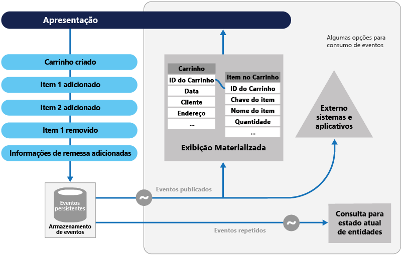

# Padrão de fornecimento do eventoEvent Sourcing pattern

[!INCLUDE [header](../_includes/header.md)]

Em vez de armazenar apenas o estado atual dos dados em um domínio, use um armazenamento somente de acréscimo para registrar a série completa de ações executadas nesses dados.Instead of storing just the current state of the data in a domain, use an append-only store to record the full series of actions taken on that data.
O repositório atua como o sistema de registro e pode ser usado para materializar os objetos de domínio.The store acts as the system of record and can be used to materialize the domain objects. Isso pode simplificar tarefas em domínios complexos, evitando a necessidade de sincronizar o modelo de dados e o domínio da empresa, melhorando o desempenho, a escalabilidade e a capacidade de resposta.This can simplify tasks in complex domains, by avoiding the need to synchronize the data model and the business domain, while improving performance, scalability, and responsiveness. Isso também pode fornecer a consistência de dados transacionais e manter histórico e logs de auditoria completos, que podem permitir ações de compensação.It can also provide consistency for transactional data, and maintain full audit trails and history that can enable compensating actions.

## Contexto e problemaContext and problem

A maioria dos aplicativos trabalham usando dados e a abordagem típica é o aplicativo manter o estado atual dos dados atualizando-os conforme os usuários trabalham com eles.Most applications work with data, and the typical approach is for the application to maintain the current state of the data by updating it as users work with it. Por exemplo, no modelo CRUD (criar, ler, atualizar e excluir) tradicional, um processo de dados típico é ler dados do repositório, fazer algumas modificações neles e atualizar o estado atual dos dados com os novos valores&mdash;geralmente usando transações que bloqueiam os dados.For example, in the traditional create, read, update, and delete (CRUD) model a typical data process is to read data from the store, make some modifications to it, and update the current state of the data with the new values&mdash;often by using transactions that lock the data.

A abordagem CRUD tem algumas limitações:The CRUD approach has some limitations:

- Sistemas CRUD executam operações de atualização diretamente em um armazenamento de dados, o que pode diminuir o desempenho e capacidade de resposta e limitar a escalabilidade, devido à sobrecarga de processamento que isso requer.CRUD systems perform update operations directly against a data store, which can slow down performance and responsiveness, and limit scalability, due to the processing overhead it requires.

- Em um domínio de colaboração com muitos usuários simultâneos, conflitos de atualização de dados são mais prováveis porque as operações de atualização ocorrem em um único item de dados.In a collaborative domain with many concurrent users, data update conflicts are more likely because the update operations take place on a single item of data.

- A menos que haja um mecanismo de auditoria adicional que registre os detalhes de cada operação em um log separado, o histórico será perdido.Unless there's an additional auditing mechanism that records the details of each operation in a separate log, history is lost.

> Para uma compreensão mais profunda dos limites da abordagem CRUD, consulte [CRUD, Somente quando você puder custear isso](https://blogs.msdn.microsoft.com/maarten_mullender/2004/07/23/crud-only-when-you-can-afford-it-revisited/).For a deeper understanding of the limits of the CRUD approach see [CRUD, Only When You Can Afford It](https://blogs.msdn.microsoft.com/maarten_mullender/2004/07/23/crud-only-when-you-can-afford-it-revisited/).

## SoluçãoSolution

O padrão de fornecimento do evento define uma abordagem para lidar com operações em dados que são controladas por uma sequência de eventos, cada um dos quais é registrado em um repositório somente de acréscimo.The Event Sourcing pattern defines an approach to handling operations on data that's driven by a sequence of events, each of which is recorded in an append-only store. O código do aplicativo envia uma série de eventos que descrevem imperativamente cada ação ocorrida nos dados para o repositório de eventos, no qual eles são persistidos.Application code sends a series of events that imperatively describe each action that has occurred on the data to the event store, where they're persisted. Cada evento representa um conjunto de alterações nos dados (assim como `AddedItemToOrder`).Each event represents a set of changes to the data (such as `AddedItemToOrder`).

Os eventos são persistidos em um repositório de eventos que atua como o sistema de registro (fonte de dados autoritativa) sobre o estado atual dos dados.The events are persisted in an event store that acts as the system of record (the authoritative data source) about the current state of the data. O repositório de eventos geralmente publica esses eventos de modo que os consumidores possam ser notificados e os manipulem se necessário.The event store typically publishes these events so that consumers can be notified and can handle them if needed. Os consumidores podem, por exemplo, iniciar tarefas que aplicam as operações nos eventos a outros sistemas ou então executar qualquer ação associada necessária para a conclusão da operação.Consumers could, for example, initiate tasks that apply the operations in the events to other systems, or perform any other associated action that's required to complete the operation. Observe que o código do aplicativo que gera os eventos é separado dos sistemas que assinam os eventos.Notice that the application code that generates the events is decoupled from the systems that subscribe to the events.

Usos típicos dos eventos publicados pelo repositório de eventos são manter exibições materializadas de entidades conforme elas são alteradas por ações no aplicativo, bem como para integração com sistemas externos.Typical uses of the events published by the event store are to maintain materialized views of entities as actions in the application change them, and for integration with external systems. Por exemplo, um sistema pode manter uma exibição materializada de todas as ordens de cliente que é usada para popular partes da interface do usuário.For example, a system can maintain a materialized view of all customer orders that's used to populate parts of the UI. Conforme o aplicativo adiciona novas ordens, adiciona ou remove itens na ordem e adiciona informações de envio, os eventos que descrevem essas alterações podem ser manipulados e usados para atualizar a [exibição materializada](./materialized-view.md).As the application adds new orders, adds or removes items on the order, and adds shipping information, the events that describe these changes can be handled and used to update the [materialized view](./materialized-view.md).

Além disso, os aplicativos podem ler a qualquer momento o histórico de eventos e usá-lo para materializar o estado atual de uma entidade, reproduzindo e consumindo todos os eventos relacionados a essa entidade.In addition, at any point it's possible for applications to read the history of events, and use it to materialize the current state of an entity by playing back and consuming all the events related to that entity. Isso pode ocorrer sob demanda para materializar um objeto de domínio ao lidar com uma solicitação ou por meio de uma tarefa agendada para que o estado da entidade possa ser armazenado como uma exibição materializada para dar suporte à camada de apresentação.This can occur on demand to materialize a domain object when handling a request, or through a scheduled task so that the state of the entity can be stored as a materialized view to support the presentation layer.

A figura mostra uma visão geral do padrão, incluindo algumas das opções para usar o fluxo de eventos, como criar uma exibição materializada, integrar eventos com sistemas e aplicativos externos e reproduzir eventos para criar projeções do estado atual do entidades específicas.The figure shows an overview of the pattern, including some of the options for using the event stream such as creating a materialized view, integrating events with external applications and systems, and replaying events to create projections of the current state of specific entities.

O padrão de fornecimento do evento fornece as seguintes vantagens:The Event Sourcing pattern provides the following advantages:

- Eventos são imutáveis e podem ser armazenados usando uma operação somente de acréscimo.Events are immutable and can be stored using an append-only operation. A interface do usuário, um fluxo de trabalho ou um processo que iniciou um evento pode continuar e tarefas que manipulam os eventos podem ser executadas em segundo plano.The user interface, workflow, or process that initiated an event can continue, and tasks that handle the events can run in the background. Isso, combinado com o fato de que não há nenhuma contenção durante o processamento de transações, pode melhorar muito o desempenho e a escalabilidade de aplicativos, especialmente para a interface do usuário ou o nível de apresentação.This, combined with the fact that there's no contention during the processing of transactions, can vastly improve performance and scalability for applications, especially for the presentation level or user interface.

- Os eventos são objetos simples que descrevem uma ação que ocorreu, juntamente com quaisquer dados associados necessários para descrever a ação representada pelo evento.Events are simple objects that describe some action that occurred, together with any associated data required to describe the action represented by the event. Eventos não atualizam um armazenamento de dados diretamente.Events don't directly update a data store. Eles simplesmente são registrados para manipulação no momento apropriado.They're simply recorded for handling at the appropriate time. Isso pode simplificar a implementação e o gerenciamento.This can simplify implementation and management.

- Eventos geralmente têm significado para um especialista de domínio, enquanto a [incompatibilidade de impedância relacional de objeto](https://en.wikipedia.org/wiki/Object-relational_impedance_mismatch) pode tornar as tabelas de banco de dados complexas difíceis de entender.Events typically have meaning for a domain expert, whereas [object-relational impedance mismatch](https://en.wikipedia.org/wiki/Object-relational_impedance_mismatch) can make complex database tables hard to understand. As tabelas são construções artificiais que representam o estado atual do sistema, não os eventos que ocorreram.Tables are artificial constructs that represent the current state of the system, not the events that occurred.

- O fornecimento do evento pode ajudar a evitar que atualizações simultâneas causem conflitos porque ele evita a necessidade de atualizar diretamente os objetos no armazenamento de dados.Event sourcing can help prevent concurrent updates from causing conflicts because it avoids the requirement to directly update objects in the data store. No entanto, o modelo de domínio ainda deve ser criado para se proteger de solicitações que podem resultar em um estado inconsistente.However, the domain model must still be designed to protect itself from requests that might result in an inconsistent state.

- O armazenamento de eventos somente de acréscimo oferece um log de auditoria que pode ser usado para monitorar as ações executadas em um armazenamento de dados, gerar o estado atual como exibições materializadas ou projeções reproduzindo eventos a qualquer momento e ajudar a testar e a depurar o sistema.The append-only storage of events provides an audit trail that can be used to monitor actions taken against a data store, regenerate the current state as materialized views or projections by replaying the events at any time, and assist in testing and debugging the system. Além disso, o requisito para usar os eventos de compensação para cancelar as alterações fornece um histórico das alterações que foram revertidas, o que não ocorreria se o modelo simplesmente armazenasse o estado atual.In addition, the requirement to use compensating events to cancel changes provides a history of changes that were reversed, which wouldn't be the case if the model simply stored the current state. A lista de eventos também pode ser usada para analisar o desempenho do aplicativo e detectar tendências de comportamento do usuário ou então para obter outras informações de negócios úteis.The list of events can also be used to analyze application performance and detect user behavior trends, or to obtain other useful business information.

- O repositório de eventos aciona eventos e tarefas executam operações em resposta a esses eventos.The event store raises events, and tasks perform operations in response to those events. Desassociar as tarefas dos eventos desse modo fornece flexibilidade e extensibilidade.This decoupling of the tasks from the events provides flexibility and extensibility. As tarefas sabem sobre o tipo de evento e os dados de evento, mas não sobre a operação que disparou o evento.Tasks know about the type of event and the event data, but not about the operation that triggered the event. Além disso, múltiplas tarefas podem manipular cada evento.In addition, multiple tasks can handle each event. Isso permite uma integração fácil com outros serviços e sistemas que escutam somente novos eventos acionados pelo repositório de eventos.This enables easy integration with other services and systems that only listen for new events raised by the event store. No entanto, os eventos de fornecimento do evento tendem a ser de nível muito baixo e pode ser necessário gerar eventos de integração específicos em vez deles.However, the event sourcing events tend to be very low level, and it might be necessary to generate specific integration events instead.

> O fornecimento do evento é geralmente combinado com o padrão CQRS executando-se as tarefas de gerenciamento de dados em resposta aos eventos e materializando exibições dos eventos armazenados.Event sourcing is commonly combined with the CQRS pattern by performing the data management tasks in response to the events, and by materializing views from the stored events.

## Problemas e consideraçõesIssues and considerations

Considere os seguintes pontos ao decidir como implementar esse padrão:Consider the following points when deciding how to implement this pattern:

O sistema só será eventualmente consistente durante a criação de exibições materializadas ou a geração de projeções de dados por meio da reprodução de eventos.The system will only be eventually consistent when creating materialized views or generating projections of data by replaying events. Há algum atraso entre um aplicativo adicionando eventos para o repositório de eventos como resultado da manipulação de uma solicitação, da publicação de eventos e da manipulação dos eventos pelos respectivos consumidores.There's some delay between an application adding events to the event store as the result of handling a request, the events being published, and consumers of the events handling them. Durante esse período, novos eventos que descrevem ainda mais as alterações nas entidades podem ter chegado ao repositório de eventos.During this period, new events that describe further changes to entities might have arrived at the event store.

> [!NOTE]
> Veja o [Data Consistency Primer](https://msdn.microsoft.com/library/dn589800.aspx) para obter informações sobre consistência eventual.See the [Data Consistency Primer](https://msdn.microsoft.com/library/dn589800.aspx) for information about eventual consistency.

O repositório de eventos é a origem permanente das informações e, desse modo, os dados de evento nunca devem ser atualizados.The event store is the permanent source of information, and so the event data should never be updated. A única maneira de atualizar uma entidade para desfazer uma alteração é adicionar um evento de compensação ao repositório de eventos.The only way to update an entity to undo a change is to add a compensating event to the event store. Se o formato (em vez dos dados) dos eventos persistentes precisarem ser alterados, talvez durante uma migração, poderá ser difícil combinar eventos existentes no repositório com a nova versão.If the format (rather than the data) of the persisted events needs to change, perhaps during a migration, it can be difficult to combine existing events in the store with the new version. Talvez seja necessário iterar por todos os eventos fazendo alterações de modo que eles fiquem em conformidade com o novo formato ou então adicionar novos eventos que usam o novo formato.It might be necessary to iterate through all the events making changes so they're compliant with the new format, or add new events that use the new format. Considere usar um carimbo de versão em cada versão do esquema do evento para manter o formato de evento antigo e o novo.Consider using a version stamp on each version of the event schema to maintain both the old and the new event formats.

Aplicativos com multithread e várias instâncias de aplicativos podem estar armazenando eventos no repositório de eventos.Multi-threaded applications and multiple instances of applications might be storing events in the event store. A consistência dos eventos no repositório de eventos é essencial, assim como a ordem de eventos que afetam uma entidade específica (a ordem em que ocorrem alterações a uma entidade afeta seu estado atual).The consistency of events in the event store is vital, as is the order of events that affect a specific entity (the order that changes occur to an entity affects its current state). Adicionar um carimbo de data/hora a cada evento pode ajudar a evitar problemas.Adding a timestamp to every event can help to avoid issues. Outra prática comum é anotar cada evento resultante de uma solicitação com um identificador incremental.Another common practice is to annotate each event resulting from a request with an incremental identifier. Se duas ações tentam adicionar eventos à mesma entidade simultaneamente, o repositório de eventos pode rejeitar um evento que corresponde um identificador de entidade e um identificador de evento existentes.If two actions attempt to add events for the same entity at the same time, the event store can reject an event that matches an existing entity identifier and event identifier.

Não há nenhuma abordagem padrão, tampouco mecanismos existentes como consultas SQL, para ler os eventos a fim de obter informações.There's no standard approach, or existing mechanisms such as SQL queries, for reading the events to obtain information. Os únicos dados que podem ser extraídos são um fluxo de eventos usando um identificador de evento como o critério.The only data that can be extracted is a stream of events using an event identifier as the criteria. Normalmente, a ID do evento é mapeada para entidades individuais.The event ID typically maps to individual entities. O estado atual de uma entidade pode ser determinado somente reproduzindo-se todos os eventos relacionados a ela mediante o estado original da entidade.The current state of an entity can be determined only by replaying all of the events that relate to it against the original state of that entity.

O tamanho de cada fluxo de eventos afeta o gerenciamento e a atualização do sistema.The length of each event stream affects managing and updating the system. Se os fluxos forem grandes, considere a criação de instantâneos em intervalos específicos como um número de eventos especificado.If the streams are large, consider creating snapshots at specific intervals such as a specified number of events. O estado atual da entidade pode ser obtido do instantâneo e repetindo-se todos os eventos que ocorreram depois desse ponto no tempo.The current state of the entity can be obtained from the snapshot and by replaying any events that occurred after that point in time. Para obter mais informações sobre a criação de instantâneos de dados, consulte [Instantâneo no site de arquitetura de aplicativo empresarial de Martin Fowler](https://martinfowler.com/eaaDev/Snapshot.html) e [Replicação de instantâneo mestre-subordinado](https://msdn.microsoft.com/library/ff650012.aspx).For more information about creating snapshots of data, see [Snapshot on Martin Fowler’s Enterprise Application Architecture website](https://martinfowler.com/eaaDev/Snapshot.html) and [Master-Subordinate Snapshot Replication](https://msdn.microsoft.com/library/ff650012.aspx).

Embora o fornecimento do evento minimize a oportunidade de atualizações conflitantes para os dados, o aplicativo ainda deve ser capaz de lidar com inconsistências que resultam de consistência eventual e da falta de transações.Even though event sourcing minimizes the chance of conflicting updates to the data, the application must still be able to deal with inconsistencies that result from eventual consistency and the lack of transactions. Por exemplo, um evento que indica uma redução no inventário de estoque pode chegar no armazenamento de dados enquanto uma ordem para esse item está sendo efetuada, resultando em um requisito para reconciliar as duas operações, seja informando o cliente ou criando uma ordem pendente.For example, an event that indicates a reduction in stock inventory might arrive in the data store while an order for that item is being placed, resulting in a requirement to reconcile the two operations either by advising the customer or creating a back order.

A publicação do evento pode ser "pelo menos uma vez", assim os consumidores de eventos devem ser idempotentes.Event publication might be “at least once,” and so consumers of the events must be idempotent. Eles não devem aplicar a atualização descrita em um evento se o evento é manipulado mais de uma vez.They must not reapply the update described in an event if the event is handled more than once. Por exemplo, se várias instâncias de um consumidor mantêm e agregam uma propriedade da entidade, tal como o número total de ordens efetuadas, somente uma deve ter êxito em incrementar a agregação quando ocorre um evento de ordem efetuada.For example, if multiple instances of a consumer maintain an aggregate an entity's property, such as the total number of orders placed, only one must succeed in incrementing the aggregate when an order placed event occurs. Embora isso não seja uma característica-chave do fornecimento do evento, é a decisão de implementação mais comum.While this isn't a key characteristic of event sourcing, it's the usual implementation decision.

## Quando usar esse padrãoWhen to use this pattern

Use esse padrão nos cenários a seguir:Use this pattern in the following scenarios:

- Quando você deseja capturar a intenção, o objetivo ou o motivo nos dados.When you want to capture intent, purpose, or reason in the data. Por exemplo, as alterações para uma entidade cliente poderão ser capturadas como uma série de tipos de evento específicos como _Mudança de residência_, _Conta fechada_ ou _Falecimento_.For example, changes to a customer entity can be captured as a series of specific event types such as _Moved home_, _Closed account_, or _Deceased_.

- Quando é minimizar ou evitar completamente a ocorrência de atualizações conflitantes aos dados.When it's vital to minimize or completely avoid the occurrence of conflicting updates to data.

- Quando você deseja registrar eventos que ocorrem e poder reproduzi-los para restaurar o estado de um sistema, reverter as alterações ou manter um histórico e log de auditoria.When you want to record events that occur, and be able to replay them to restore the state of a system, roll back changes, or keep a history and audit log. Por exemplo, quando uma tarefa envolve várias etapas você precisa executar ações para reverter as atualizações e, em seguida, repetir algumas etapas para trazer os dados de volta para um estado consistente.For example, when a task involves multiple steps you might need to execute actions to revert updates and then replay some steps to bring the data back into a consistent state.

- Quando usar eventos é um recurso natural da operação do aplicativo e requer pouco desenvolvimento ou esforço de implementação adicional.When using events is a natural feature of the operation of the application, and requires little additional development or implementation effort.

- Quando você precisa desassociar o processo de inserção ou atualização de dados das tarefas necessárias para aplicar essas ações.When you need to decouple the process of inputting or updating data from the tasks required to apply these actions. Isso pode ser para melhorar o desempenho de interface do usuário ou para distribuir eventos em outros ouvintes que entram em ação quando os eventos ocorrem.This might be to improve UI performance, or to distribute events to other listeners that take action when the events occur. Por exemplo, integrar um sistema de folha de pagamento com um site de envio de despesas de modo que os eventos acionados pelo repositório de eventos em resposta a atualizações aos dados feitas no site sejam consumidos tanto pelo site quanto pelo sistema de folha de pagamento.For example, integrating a payroll system with an expense submission website so that events raised by the event store in response to data updates made in the website are consumed by both the website and the payroll system.

- Quando você quiser flexibilidade para poder alterar o formato dos modelos materializados e dados de entidade se os requisitos sofrerem alterações, ou&mdash;quando usado em conjunto com CQRS&mdash;será necessário adaptar um modelo de leitura ou os modos de exibição que expõem os dados.When you want flexibility to be able to change the format of materialized models and entity data if requirements change, or&mdash;when used in conjunction with CQRS&mdash;you need to adapt a read model or the views that expose the data.

- Quando usado em conjunto com CQRS e consistência eventual é aceitável enquanto um modelo de leitura é atualizado ou então quando o impacto no desempenho causado pela reidratação de entidades e dados de um fluxo de eventos é aceitável.When used in conjunction with CQRS, and eventual consistency is acceptable while a read model is updated, or the performance impact of rehydrating entities and data from an event stream is acceptable.

Esse padrão pode não ser útil nas seguintes situações:This pattern might not be useful in the following situations:

- Domínios pequenos ou simples, sistemas que têm pouca ou nenhuma lógica de negócios ou sistemas que não são de domínio que funcionam naturalmente bem com mecanismos tradicionais de gerenciamento de dados CRUD.Small or simple domains, systems that have little or no business logic, or nondomain systems that naturally work well with traditional CRUD data management mechanisms.

- Sistemas em que a consistência e atualizações em tempo real para as exibições dos dados são necessárias.Systems where consistency and real-time updates to the views of the data are required.

- Sistemas em que logs de auditoria, histórico e recursos para reverter e repetir ações não são necessários.Systems where audit trails, history, and capabilities to roll back and replay actions are not required.

- Sistemas em que há somente uma ocorrência muito baixa de atualizações conflitantes nos dados subjacentes.Systems where there's only a very low occurrence of conflicting updates to the underlying data. Por exemplo, os sistemas que predominantemente adicionam dados em vez de atualizá-los.For example, systems that predominantly add data rather than updating it.

## ExemploExample

Um sistema de gerenciamento de conferência precisa acompanhar o número de reservas concluídas para uma conferência para que ele possa verificar se ainda há lugares disponíveis quando um potencial participante tenta fazer uma reserva.A conference management system needs to track the number of completed bookings for a conference so that it can check whether there are seats still available when a potential attendee tries to make a booking. O sistema poderia armazenar o número total de reservas para uma conferência de pelo menos duas maneiras:The system could store the total number of bookings for a conference in at least two ways:

- O sistema pode armazenar as informações sobre o número total de reservas como uma entidade separada em um banco de dados que contém as informações de reserva.The system could store the information about the total number of bookings as a separate entity in a database that holds booking information. Conforme as reservas são feitas ou canceladas, o sistema pode incrementar ou decrementar esse número conforme apropriado.As bookings are made or canceled, the system could increment or decrement this number as appropriate. Essa abordagem é simples em teoria, mas pode causar problemas de escalabilidade se um grande número de participantes está tentando reservar lugares durante um curto período de tempo.This approach is simple in theory, but can cause scalability issues if a large number of attendees are attempting to book seats during a short period of time. Por exemplo, no último dia antes do encerramento do período de reservas.For example, in the last day or so prior to the booking period closing.

- O sistema poderia armazenar informações sobre reservas e cancelamentos como eventos mantidos em um repositório de eventos.The system could store information about bookings and cancellations as events held in an event store. Ele poderia então calcular o número de lugares disponíveis reproduzindo esses eventos.It could then calculate the number of seats available by replaying these events. Essa abordagem pode ser mais escalonável devido à imutabilidade dos eventos.This approach can be more scalable due to the immutability of events. O sistema só precisa ser capaz de ler dados do repositório de eventos ou acrescentar dados ao repositório de eventos.The system only needs to be able to read data from the event store, or append data to the event store. As informações de evento sobre reservas e cancelamentos nunca são modificadas.Event information about bookings and cancellations is never modified.

O diagrama a seguir ilustra como o subsistema de reserva de lugares do sistema de gerenciamento da conferência pode ser implementado usando o fornecimento do evento.The following diagram illustrates how the seat reservation subsystem of the conference management system might be implemented using event sourcing.

A sequência de ações para reservar dois lugares é conforme descrito a seguir:The sequence of actions for reserving two seats is as follows:

1. A interface do usuário emite um comando para reservar lugares para dois participantes.The user interface issues a command to reserve seats for two attendees. O comando é manipulado por um manipulador de comandos separado.The command is handled by a separate command handler. Uma parte da lógica que é separada da interface do usuário e é responsável por gerenciar solicitações lançadas como comandos.A piece of logic that is decoupled from the user interface and is responsible for handling requests posted as commands.

2. Uma agregação que contém informações sobre todas as reservas para a conferência é construída consultando os eventos que descrevem as reservas e cancelamentos.An aggregate containing information about all reservations for the conference is constructed by querying the events that describe bookings and cancellations. Essa agregação é chamada `SeatAvailability` e está contida em um modelo de domínio que expõe métodos para consultar e modificar os dados na agregação.This aggregate is called `SeatAvailability`, and is contained within a domain model that exposes methods for querying and modifying the data in the aggregate.

    > Algumas otimizações a considerar estão usando instantâneos (de modo que você não precisa consultar e reproduzir a lista completa de eventos para obter o estado atual da agregação) e mantendo uma cópia armazenada em cache da agregação na memória.Some optimizations to consider are using snapshots (so that you don’t need to query and replay the full list of events to obtain the current state of the aggregate), and maintaining a cached copy of the aggregate in memory.

3. O manipulador de comandos invoca um método exposto pelo modelo de domínio para fazer as reservas.The command handler invokes a method exposed by the domain model to make the reservations.

4. A agregação `SeatAvailability` registra um evento que contém o número de lugares que foram reservados.The `SeatAvailability` aggregate records an event containing the number of seats that were reserved. Na próxima vez em que a agregação aplicar eventos, todas as reservas serão usadas para calcular quantos lugares restam.The next time the aggregate applies events, all the reservations will be used to compute how many seats remain.

5. O sistema acrescenta o novo evento à lista de eventos no repositório de eventos.The system appends the new event to the list of events in the event store.

Se um usuário cancela a reserva de um lugar, o sistema segue um processo semelhante, exceto pelo fato de que o manipulador de comandos emite um comando que gera um evento de cancelamento de lugar e o anexa ao repositório de eventos.If a user cancels a seat, the system follows a similar process except the command handler issues a command that generates a seat cancellation event and appends it to the event store.

Além de fornecer mais escopo para escalabilidade, usar um repositório de eventos também fornece um histórico completo ou log de auditoria das reservas e cancelamentos para uma conferência.As well as providing more scope for scalability, using an event store also provides a complete history, or audit trail, of the bookings and cancellations for a conference. Os eventos no repositório de eventos são o registro preciso.The events in the event store are the accurate record. Não é necessário persistir agregações de qualquer outra forma, porque o sistema pode facilmente reproduzir os eventos e restaurar o estado para qualquer ponto no tempo.There is no need to persist aggregates in any other way because the system can easily replay the events and restore the state to any point in time.

> Você pode encontrar mais informações sobre esse exemplo em [Apresentando o fornecimento do evento](https://msdn.microsoft.com/library/jj591559.aspx).You can find more information about this example in [Introducing Event Sourcing](https://msdn.microsoft.com/library/jj591559.aspx).

## Diretrizes e padrões relacionadosRelated patterns and guidance

Os padrões e diretrizes a seguir também podem ser relevantes ao implementar esse padrão:The following patterns and guidance might also be relevant when implementing this pattern:

- [Padrão de comando e segregação de responsabilidade de consulta (CQRS)](./cqrs.md).[Command and Query Responsibility Segregation (CQRS) pattern](./cqrs.md). O repositório de gravação que fornece a origem permanente das informações de uma implementação de CQRS é normalmente baseado em uma implementação do padrão do fornecimento do evento.The write store that provides the permanent source of information for a CQRS implementation is often based on an implementation of the Event Sourcing pattern. Descreve como separar as operações que leem dados em um aplicativo das operações que atualizam dados usando interfaces separadas.Describes how to segregate the operations that read data in an application from the operations that update data by using separate interfaces.

- [Padrão de Exibição Materializada](./materialized-view.md).[Materialized View pattern](./materialized-view.md). O armazenamento de dados usado em um sistema baseado em evento de fornecimento normalmente não é adequado para consultar de modo eficiente.The data store used in a system based on event sourcing is typically not well suited to efficient querying. Em vez disso, uma abordagem comum é gerar previamente exibições dos dados em intervalos regulares ou quando os dados são alterados.Instead, a common approach is to generate prepopulated views of the data at regular intervals, or when the data changes. Mostra como isso pode ser feito.Shows how this can be done.

- [Padrão de Transação de Compensação](./compensating-transaction.md).[Compensating Transaction pattern](./compensating-transaction.md). Os dados existentes em um repositório de fornecimento do evento não são atualizados, em vez disso, são adicionadas novas entradas que fazem a transição de estado das entidades para os novos valores.The existing data in an event sourcing store is not updated, instead new entries are added that transition the state of entities to the new values. Para reverter uma alteração, as entradas de compensação são usadas porque não é possível simplesmente reverter a alteração anterior.To reverse a change, compensating entries are used because it isn't possible to simply reverse the previous change. Descreve como desfazer o trabalho realizado por uma operação anterior.Describes how to undo the work that was performed by a previous operation.

- [Primer de Consistência de Dados](https://msdn.microsoft.com/library/dn589800.aspx).[Data Consistency Primer](https://msdn.microsoft.com/library/dn589800.aspx). Ao usar fornecimento do evento com um repositório de leitura separado ou exibições materializadas, os dados de leitura não serão imediatamente consistentes, mas em vez disso serão apenas eventualmente consistentes.When using event sourcing with a separate read store or materialized views, the read data won't be immediately consistent, instead it'll be only eventually consistent. Resume os problemas que envolvem a manutenção da consistência em dados distribuídos.Summarizes the issues surrounding maintaining consistency over distributed data.

- [Diretrizes de particionamento de dados](https://msdn.microsoft.com/library/dn589795.aspx).[Data Partitioning Guidance](https://msdn.microsoft.com/library/dn589795.aspx). Dados muitas vezes são particionados ao usar o fornecimento do evento para melhorar a escalabilidade, reduzir a contenção e otimizar o desempenho.Data is often partitioned when using event sourcing to improve scalability, reduce contention, and optimize performance. Descreve como dividir dados em partições discretas e os problemas que podem surgir.Describes how to divide data into discrete partitions, and the issues that can arise.
