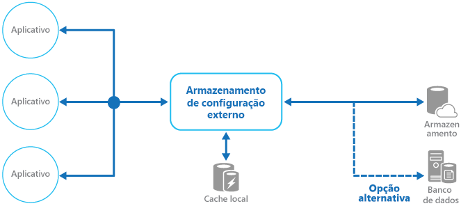

# <a name="external-configuration-store-pattern"></a><span data-ttu-id="b256b-104">Padrão de repositório de configuração externo</span><span class="sxs-lookup"><span data-stu-id="b256b-104">External Configuration Store pattern</span></span>

[!INCLUDE [header](../_includes/header.md)]

<span data-ttu-id="b256b-105">Mova as informações de configuração para fora do pacote de implantação de aplicativo para um local centralizado.</span><span class="sxs-lookup"><span data-stu-id="b256b-105">Move configuration information out of the application deployment package to a centralized location.</span></span> <span data-ttu-id="b256b-106">Ele pode fornecer oportunidades para facilitar o gerenciamento e controle dos dados de configuração e para compartilhar os dados de configuração nos aplicativos e instâncias do aplicativo.</span><span class="sxs-lookup"><span data-stu-id="b256b-106">This can provide opportunities for easier management and control of configuration data, and for sharing configuration data across applications and application instances.</span></span>

## <a name="context-and-problem"></a><span data-ttu-id="b256b-107">Contexto e problema</span><span class="sxs-lookup"><span data-stu-id="b256b-107">Context and problem</span></span>

<span data-ttu-id="b256b-108">A maioria dos ambientes de tempo de execução do aplicativo inclui informações de configuração que são mantidas nos arquivos implantados com o aplicativo.</span><span class="sxs-lookup"><span data-stu-id="b256b-108">The majority of application runtime environments include configuration information that's held in files deployed with the application.</span></span> <span data-ttu-id="b256b-109">Em alguns casos, é possível editar esses arquivos para alterar o comportamento do aplicativo depois que ele é implantado.</span><span class="sxs-lookup"><span data-stu-id="b256b-109">In some cases, it's possible to edit these files to change the application behavior after it's been deployed.</span></span> <span data-ttu-id="b256b-110">No entanto, as alterações na configuração requerem que o aplicativo seja reimplantado, geralmente resultando em tempo de inatividade inaceitável e outras sobrecargas administrativas.</span><span class="sxs-lookup"><span data-stu-id="b256b-110">However, changes to the configuration require the application be redeployed, often resulting in unacceptable downtime and other administrative overhead.</span></span>

<span data-ttu-id="b256b-111">Os arquivos de configuração locais também limitam a configuração a um único aplicativo, porém, às vezes, pode ser útil compartilhar as definições de configuração entre vários aplicativos.</span><span class="sxs-lookup"><span data-stu-id="b256b-111">Local configuration files also limit the configuration to a single application, but sometimes it would be useful to share configuration settings across multiple applications.</span></span> <span data-ttu-id="b256b-112">Alguns exemplos são as cadeias de conexão de banco de dados, informações de tema de interface do usuário ou as URLs de filas e o armazenamento usado por um conjunto de aplicativos relacionados.</span><span class="sxs-lookup"><span data-stu-id="b256b-112">Examples include database connection strings, UI theme information, or the URLs of queues and storage used by a related set of applications.</span></span>

<span data-ttu-id="b256b-113">É difícil para gerenciar as alterações de configurações locais em várias instâncias em execução do aplicativo, especialmente em um cenário hospedado na nuvem.</span><span class="sxs-lookup"><span data-stu-id="b256b-113">It's challenging to manage changes to local configurations across multiple running instances of the application, especially in a cloud-hosted scenario.</span></span> <span data-ttu-id="b256b-114">Isso pode resultar em instâncias que usando definições de configuração diferentes, enquanto a atualização está sendo implantada.</span><span class="sxs-lookup"><span data-stu-id="b256b-114">It can result in instances using different configuration settings while the update is being deployed.</span></span>

<span data-ttu-id="b256b-115">Além disso, as atualizações para aplicativos e componentes podem exigir alterações nos esquemas de configuração.</span><span class="sxs-lookup"><span data-stu-id="b256b-115">In addition, updates to applications and components might require changes to configuration schemas.</span></span> <span data-ttu-id="b256b-116">Muitos sistemas de configuração não dão suporte a versões diferentes de informações de configuração.</span><span class="sxs-lookup"><span data-stu-id="b256b-116">Many configuration systems don't support different versions of configuration information.</span></span>

## <a name="solution"></a><span data-ttu-id="b256b-117">Solução</span><span class="sxs-lookup"><span data-stu-id="b256b-117">Solution</span></span>

<span data-ttu-id="b256b-118">Armazene as informações de configuração no armazenamento externo e forneça uma interface que pode ser usada para ler e atualizar as definições de configuração de forma rápida e eficiente.</span><span class="sxs-lookup"><span data-stu-id="b256b-118">Store the configuration information in external storage, and provide an interface that can be used to quickly and efficiently read and update configuration settings.</span></span> <span data-ttu-id="b256b-119">O tipo de repositório externo depende do ambiente de hospedagem e do tempo de execução do aplicativo.</span><span class="sxs-lookup"><span data-stu-id="b256b-119">The type of external store depends on the hosting and runtime environment of the application.</span></span> <span data-ttu-id="b256b-120">Em um cenário hospedado na nuvem, ele normalmente é um serviço de armazenamento baseado em nuvem, mas pode ser um banco de dados hospedado ou outro sistema.</span><span class="sxs-lookup"><span data-stu-id="b256b-120">In a cloud-hosted scenario it's typically a cloud-based storage service, but could be a hosted database or other system.</span></span>

<span data-ttu-id="b256b-121">O repositório de backup escolhido para as informações de configuração deve ter uma interface que forneça acesso consistente e de fácil utilização.</span><span class="sxs-lookup"><span data-stu-id="b256b-121">The backing store you choose for configuration information should have an interface that provides consistent and easy-to-use access.</span></span> <span data-ttu-id="b256b-122">Ele deve expor as informações em um formato com tipo e estrutura corretos.</span><span class="sxs-lookup"><span data-stu-id="b256b-122">It should expose the information in a correctly typed and structured format.</span></span> <span data-ttu-id="b256b-123">A implementação também pode precisar autorizar o acesso dos usuários para proteger os dados de configuração e ser flexível o suficiente para permitir o armazenamento de várias versões de configuração (como desenvolvimento, preparo ou produção, incluindo várias versões de cada uma delas).</span><span class="sxs-lookup"><span data-stu-id="b256b-123">The implementation might also need to authorize users’ access in order to protect configuration data, and be flexible enough to allow storage of multiple versions of the configuration (such as development, staging, or production, including multiple release versions of each one).</span></span>

> <span data-ttu-id="b256b-124">Muitos sistemas de configuração internos leem os dados quando o aplicativo é iniciado e os armazenar em cache na memória para fornecer acesso rápido e minimizar o impacto sobre o desempenho do aplicativo.</span><span class="sxs-lookup"><span data-stu-id="b256b-124">Many built-in configuration systems read the data when the application starts up, and cache the data in memory to provide fast access and minimize the impact on application performance.</span></span> <span data-ttu-id="b256b-125">Dependendo do tipo de repositório de backup usado e da latência dele, pode ser útil implementar um mecanismo de armazenamento em cache no repositório de configuração externo.</span><span class="sxs-lookup"><span data-stu-id="b256b-125">Depending on the type of backing store used, and the latency of this store, it might be helpful to implement a caching mechanism within the external configuration store.</span></span> <span data-ttu-id="b256b-126">Para saber mais, consulte [Diretrizes de caching](https://msdn.microsoft.com/library/dn589802.aspx).</span><span class="sxs-lookup"><span data-stu-id="b256b-126">For more information, see the [Caching Guidance](https://msdn.microsoft.com/library/dn589802.aspx).</span></span> <span data-ttu-id="b256b-127">A figura mostra uma visão geral do Padrão de repositório de configuração externo com um cache local opcional.</span><span class="sxs-lookup"><span data-stu-id="b256b-127">The figure illustrates an overview of the External Configuration Store pattern with optional local cache.</span></span>




## <a name="issues-and-considerations"></a><span data-ttu-id="b256b-129">Problemas e considerações</span><span class="sxs-lookup"><span data-stu-id="b256b-129">Issues and considerations</span></span>

<span data-ttu-id="b256b-130">Considere os seguintes pontos ao decidir como implementar esse padrão:</span><span class="sxs-lookup"><span data-stu-id="b256b-130">Consider the following points when deciding how to implement this pattern:</span></span>

<span data-ttu-id="b256b-131">Escolha um repositório de backup que ofereça desempenho aceitável, alta disponibilidade, robustez e que possa passar por backup como parte do processo de administração e manutenção do aplicativo.</span><span class="sxs-lookup"><span data-stu-id="b256b-131">Choose a backing store that offers acceptable performance, high availability, robustness, and can be backed up as part of the application maintenance and administration process.</span></span> <span data-ttu-id="b256b-132">Em um aplicativo hospedado na nuvem, geralmente é uma boa opção usar um mecanismo de armazenamento para atender a esses requisitos.</span><span class="sxs-lookup"><span data-stu-id="b256b-132">In a cloud-hosted application, using a cloud storage mechanism is usually a good choice to meet these requirements.</span></span>

<span data-ttu-id="b256b-133">Projete o esquema do repositório de backup para permitir flexibilidade quanto aos tipos de informações que ele pode conter.</span><span class="sxs-lookup"><span data-stu-id="b256b-133">Design the schema of the backing store to allow flexibility in the types of information it can hold.</span></span> <span data-ttu-id="b256b-134">Verifique se ele fornece todos os requisitos de configuração, como dados com tipo, coleções de configurações, várias versões de configurações e outros recursos exigidos pelos aplicativos que os utilizam.</span><span class="sxs-lookup"><span data-stu-id="b256b-134">Ensure that it provides for all configuration requirements such as typed data, collections of settings, multiple versions of settings, and any other features that the applications using it require.</span></span> <span data-ttu-id="b256b-135">Deve ser fácil estender o esquema para dar suporte a configurações adicionais à medida que os requisitos mudam.</span><span class="sxs-lookup"><span data-stu-id="b256b-135">The schema should be easy to extend to support additional settings as requirements change.</span></span>

<span data-ttu-id="b256b-136">Considere as capacidades físicas do repositório de backup, como ela se relaciona com a forma que as informações de configuração são armazenadas e os efeitos sobre o desempenho.</span><span class="sxs-lookup"><span data-stu-id="b256b-136">Consider the physical capabilities of the backing store, how it relates to the way configuration information is stored, and the effects on performance.</span></span> <span data-ttu-id="b256b-137">Por exemplo, armazenar um documento XML que contém informações de configuração exigirá que a interface de configuração ou o aplicativo analise o documento para ler as configurações individuais.</span><span class="sxs-lookup"><span data-stu-id="b256b-137">For example, storing an XML document containing configuration information will require either the configuration interface or the application to parse the document in order to read individual settings.</span></span> <span data-ttu-id="b256b-138">Será mais complicado atualizar uma configuração, porém armazená-las em cache pode ajudar a compensar o desempenho de leitura mais lento.</span><span class="sxs-lookup"><span data-stu-id="b256b-138">It'll make updating a setting more complicated, though caching the settings can help to offset slower read performance.</span></span>

<span data-ttu-id="b256b-139">Considere como a interface de configuração permitirá o controle do escopo e a herança de definições de configuração.</span><span class="sxs-lookup"><span data-stu-id="b256b-139">Consider how the configuration interface will permit control of the scope and inheritance of configuration settings.</span></span> <span data-ttu-id="b256b-140">Por exemplo, isso pode ser um requisito para definições de configuração de escopo no nível da organização, do aplicativo ou do computador.</span><span class="sxs-lookup"><span data-stu-id="b256b-140">For example, it might be a requirement to scope configuration settings at the organization, application, and the machine level.</span></span> <span data-ttu-id="b256b-141">Pode ser necessário dar suporte à delegação do controle de acesso a diferentes escopos e impedir ou permitir que aplicativos individuais substituam as configurações.</span><span class="sxs-lookup"><span data-stu-id="b256b-141">It might need to support delegation of control over access to different scopes, and to prevent or allow individual applications to override settings.</span></span>

<span data-ttu-id="b256b-142">Verifique se a interface de configuração pode expor os dados de configuração nos formatos exigidos como valores com tipo, coleções, pares de chave/valor ou recipientes de propriedades.</span><span class="sxs-lookup"><span data-stu-id="b256b-142">Ensure that the configuration interface can expose the configuration data in the required formats such as typed values, collections, key/value pairs, or property bags.</span></span>

<span data-ttu-id="b256b-143">Considere como a interface do repositório de configuração se comportará quando as configurações contiverem erros ou se não existirem no repositório de backup.</span><span class="sxs-lookup"><span data-stu-id="b256b-143">Consider how the configuration store interface will behave when settings contain errors, or don't exist in the backing store.</span></span> <span data-ttu-id="b256b-144">Pode ser apropriado retornar as configurações padrão e os log de erros.</span><span class="sxs-lookup"><span data-stu-id="b256b-144">It might be appropriate to return default settings and log errors.</span></span> <span data-ttu-id="b256b-145">Considere também aspectos como a diferenciação de maiúsculas e minúsculas nas chaves ou nomes das definições de configuração, o armazenamento e manipulação de dados binários e as maneiras como valores nulos ou vazios são manipulados.</span><span class="sxs-lookup"><span data-stu-id="b256b-145">Also consider aspects such as the case sensitivity of configuration setting keys or names, the storage and handling of binary data, and the ways that null or empty values are handled.</span></span>

<span data-ttu-id="b256b-146">Considere como proteger os dados de configuração para permitir o acesso somente aos usuários e aplicativos apropriados.</span><span class="sxs-lookup"><span data-stu-id="b256b-146">Consider how to protect the configuration data to allow access to only the appropriate users and applications.</span></span> <span data-ttu-id="b256b-147">Esse provavelmente é um recurso da interface do repositório de configuração, mas também é necessário garantir que os dados no repositório de backup não possam ser acessados diretamente sem a devida permissão.</span><span class="sxs-lookup"><span data-stu-id="b256b-147">This is likely a feature of the configuration store interface, but it's also necessary to ensure that the data in the backing store can't be accessed directly without the appropriate permission.</span></span> <span data-ttu-id="b256b-148">Verifique se há separação estrita entre as permissões necessárias para ler e gravar os dados de configuração.</span><span class="sxs-lookup"><span data-stu-id="b256b-148">Ensure strict separation between the permissions required to read and to write configuration data.</span></span> <span data-ttu-id="b256b-149">Considere também se você precisa criptografar algumas ou todas as definições de configuração e como isso será implementado na interface do repositório de configuração.</span><span class="sxs-lookup"><span data-stu-id="b256b-149">Also consider whether you need to encrypt some or all of the configuration settings, and how this'll be implemented in the configuration store interface.</span></span>

<span data-ttu-id="b256b-150">Configurações armazenadas centralmente, que alteram o comportamento do aplicativo durante o tempo de execução, são cruciais e devem ser implantados, atualizados e gerenciados usando os mesmos mecanismos da implantação de código do aplicativo.</span><span class="sxs-lookup"><span data-stu-id="b256b-150">Centrally stored configurations, which change application behavior during runtime, are critically important and should be deployed, updated, and managed using the same mechanisms as deploying application code.</span></span> <span data-ttu-id="b256b-151">Por exemplo, as alterações que podem afetar a mais de um aplicativo precisam ser realizadas usando um teste completo e a abordagem de implantação de teste para garantir que a alteração seja apropriada para todos os aplicativos que usam essa configuração.</span><span class="sxs-lookup"><span data-stu-id="b256b-151">For example, changes that can affect more than one application must be carried out using a full test and staged deployment approach to ensure that the change is appropriate for all applications that use this configuration.</span></span> <span data-ttu-id="b256b-152">Se um administrador editar uma configuração para atualizar um aplicativo, ele poderia afetar negativamente outros aplicativos que usam a mesma configuração.</span><span class="sxs-lookup"><span data-stu-id="b256b-152">If an administrator edits a setting to update one application, it could adversely impact other applications that use the same setting.</span></span>

<span data-ttu-id="b256b-153">Se um aplicativo armazenar as informações de configuração em cache, ele precisará ser alertado se as configurações forem alteradas.</span><span class="sxs-lookup"><span data-stu-id="b256b-153">If an application caches configuration information, the application needs to be alerted if the configuration changes.</span></span> <span data-ttu-id="b256b-154">Pode ser possível implementar uma política de expiração de dados de configuração armazenados em cache para que essas informações sejam atualizadas automaticamente e periodicamente, e que as alterações sejam selecionadas (e as devidas ações sejam tomadas).</span><span class="sxs-lookup"><span data-stu-id="b256b-154">It might be possible to implement an expiration policy over cached configuration data so that this information is automatically refreshed periodically and any changes picked up (and acted on).</span></span>

## <a name="when-to-use-this-pattern"></a><span data-ttu-id="b256b-155">Quando usar esse padrão</span><span class="sxs-lookup"><span data-stu-id="b256b-155">When to use this pattern</span></span>

<span data-ttu-id="b256b-156">Esse padrão é útil para:</span><span class="sxs-lookup"><span data-stu-id="b256b-156">This pattern is useful for:</span></span>

- <span data-ttu-id="b256b-157">As definições de configuração compartilhadas entre vários aplicativos e instâncias do aplicativo ou nas quais uma configuração padrão precisa ser imposta em vários aplicativos e instâncias do aplicativo.</span><span class="sxs-lookup"><span data-stu-id="b256b-157">Configuration settings that are shared between multiple applications and application instances, or where a standard configuration must be enforced across multiple applications and application instances.</span></span>

- <span data-ttu-id="b256b-158">Um sistema de configuração padrão que não dá suporte a todas as definições de configuração necessárias, como armazenamento de imagens ou tipos de dados complexos.</span><span class="sxs-lookup"><span data-stu-id="b256b-158">A standard configuration system that doesn't support all of the required configuration settings, such as storing images or complex data types.</span></span>

- <span data-ttu-id="b256b-159">Como um repositório complementar para algumas das configurações de aplicativos, talvez permitindo que os aplicativos substituam algumas ou todas as configurações armazenadas centralmente.</span><span class="sxs-lookup"><span data-stu-id="b256b-159">As a complementary store for some of the settings for applications, perhaps allowing applications to override some or all of the centrally-stored settings.</span></span>

- <span data-ttu-id="b256b-160">Como uma maneira de simplificar a administração de vários aplicativos e, opcionalmente, para monitorar o uso de definições de configuração por meio de registro em log de todos os tipos de acesso para o repositório de configuração.</span><span class="sxs-lookup"><span data-stu-id="b256b-160">As a way to simplify administration of multiple applications, and optionally for monitoring use of configuration settings by logging some or all types of access to the configuration store.</span></span>

## <a name="example"></a><span data-ttu-id="b256b-161">Exemplo</span><span class="sxs-lookup"><span data-stu-id="b256b-161">Example</span></span>

<span data-ttu-id="b256b-162">Em um aplicativo hospedado do Microsoft Azure, uma opção típica para armazenar informações de configuração externamente é usar o Armazenamento do Azure.</span><span class="sxs-lookup"><span data-stu-id="b256b-162">In a Microsoft Azure hosted application, a typical choice for storing configuration information externally is to use Azure Storage.</span></span> <span data-ttu-id="b256b-163">Ele é flexível, oferece alto desempenho e é replicado três vezes com failover automático para proporcionar alta disponibilidade.</span><span class="sxs-lookup"><span data-stu-id="b256b-163">This is resilient, offers high performance, and is replicated three times with automatic failover to offer high availability.</span></span> <span data-ttu-id="b256b-164">O Armazenamento de Tabelas do Azure fornece um repositório de chave/valor com a capacidade de usar um esquema flexível para os valores.</span><span class="sxs-lookup"><span data-stu-id="b256b-164">Azure Table storage provides a key/value store with the ability to use a flexible schema for the values.</span></span> <span data-ttu-id="b256b-165">O Armazenamento de Blobs do Azure fornece um repositório hierárquico e baseado em contêiner que pode conter qualquer tipo de dados em blobs nomeados individualmente.</span><span class="sxs-lookup"><span data-stu-id="b256b-165">Azure Blob storage provides a hierarchical, container-based store that can hold any type of data in individually named blobs.</span></span>

<span data-ttu-id="b256b-166">O exemplo a seguir mostra como um repositório de configuração pode ser implementado no Armazenamento de Blobs para armazenar e expor as informações de configuração.</span><span class="sxs-lookup"><span data-stu-id="b256b-166">The following example shows how a configuration store can be implemented over Blob storage to store and expose configuration information.</span></span> <span data-ttu-id="b256b-167">A classe `BlobSettingsStore` abstrai o Armazenamento de Blobs para manter informações de configuração e implementa a interface `ISettingsStore` mostrada no código a seguir.</span><span class="sxs-lookup"><span data-stu-id="b256b-167">The `BlobSettingsStore` class abstracts Blob storage for holding configuration information, and implements the `ISettingsStore` interface shown in the following code.</span></span>

> <span data-ttu-id="b256b-168">Esse código é fornecido no projeto _ExternalConfigurationStore.Cloud_ na solução _ExternalConfigurationStore_, disponível no [GitHub](https://github.com/mspnp/cloud-design-patterns/tree/master/external-configuration-store).</span><span class="sxs-lookup"><span data-stu-id="b256b-168">This code is provided in the _ExternalConfigurationStore.Cloud_ project in the _ExternalConfigurationStore_ solution, available from [GitHub](https://github.com/mspnp/cloud-design-patterns/tree/master/external-configuration-store).</span></span>

```csharp
public interface ISettingsStore
{
    Task<string> GetVersionAsync();

    Task<Dictionary<string, string>> FindAllAsync();
}
```

<span data-ttu-id="b256b-169">Essa interface define os métodos para recuperar e atualizar as definições de configuração mantidas no repositório de configuração e inclui um número de versão que pode ser usado para detectar se as definições de configuração foram modificadas recentemente.</span><span class="sxs-lookup"><span data-stu-id="b256b-169">This interface defines methods for retrieving and updating configuration settings held in the configuration store, and includes a version number that can be used to detect whether any configuration settings have been modified recently.</span></span> <span data-ttu-id="b256b-170">A classe `BlobSettingsStore` usa a propriedade `ETag` do blob para implementar o controle de versão.</span><span class="sxs-lookup"><span data-stu-id="b256b-170">The `BlobSettingsStore` class uses the `ETag` property of the blob to implement versioning.</span></span> <span data-ttu-id="b256b-171">A propriedade `ETag` é atualizada automaticamente sempre que há uma gravação no blob.</span><span class="sxs-lookup"><span data-stu-id="b256b-171">The `ETag` property is updated automatically each time the blob is written.</span></span>

> <span data-ttu-id="b256b-172">Por padrão, essa solução simples expõe todas as definições de configuração como valores de cadeia de caracteres em vez de valores com tipo.</span><span class="sxs-lookup"><span data-stu-id="b256b-172">By design, this simple solution exposes all configuration settings as string values rather than typed values.</span></span>

<span data-ttu-id="b256b-173">A classe `ExternalConfigurationManager` fornece um wrapper em torno de um objeto `BlobSettingsStore`.</span><span class="sxs-lookup"><span data-stu-id="b256b-173">The `ExternalConfigurationManager` class provides a wrapper around a `BlobSettingsStore` object.</span></span> <span data-ttu-id="b256b-174">Um aplicativo pode usar essa classe para armazenar e recuperar informações de configuração.</span><span class="sxs-lookup"><span data-stu-id="b256b-174">An application can use this class to store and retrieve configuration information.</span></span> <span data-ttu-id="b256b-175">Essa classe usa a biblioteca Microsoft [Reactive Extensions](https://msdn.microsoft.com/library/hh242985.aspx) para expor as alterações feitas na configuração por meio de uma implementação da interface `IObservable`.</span><span class="sxs-lookup"><span data-stu-id="b256b-175">This class uses the Microsoft [Reactive Extensions](https://msdn.microsoft.com/library/hh242985.aspx) library to expose any changes made to the configuration through an implementation of the `IObservable` interface.</span></span> <span data-ttu-id="b256b-176">Se uma configuração for modificada chamando o método `SetAppSetting`, o evento `Changed` é acionado e todos os assinantes desse evento serão notificados.</span><span class="sxs-lookup"><span data-stu-id="b256b-176">If a setting is modified by calling the `SetAppSetting` method, the `Changed` event is raised and all subscribers to this event will be notified.</span></span>

<span data-ttu-id="b256b-177">Observe que todas as configurações também são armazenadas em cache em um objeto `Dictionary` dentro da classe `ExternalConfigurationManager` para acesso rápido.</span><span class="sxs-lookup"><span data-stu-id="b256b-177">Note that all settings are also cached in a `Dictionary` object inside the `ExternalConfigurationManager` class for fast access.</span></span> <span data-ttu-id="b256b-178">O método `GetSetting` usado para recuperar uma definição de configuração lê os dados do cache.</span><span class="sxs-lookup"><span data-stu-id="b256b-178">The `GetSetting` method used to retrieve a configuration setting reads the data from the cache.</span></span> <span data-ttu-id="b256b-179">Se a configuração não for encontrada no cache, ela será recuperada do objeto `BlobSettingsStore`.</span><span class="sxs-lookup"><span data-stu-id="b256b-179">If the setting isn't found in the cache, it's retrieved from the `BlobSettingsStore` object instead.</span></span>

<span data-ttu-id="b256b-180">O método `GetSettings` invoca o método `CheckForConfigurationChanges` para detectar se as informações de configuração no armazenamento de blobs foi alterado.</span><span class="sxs-lookup"><span data-stu-id="b256b-180">The `GetSettings` method invokes the `CheckForConfigurationChanges` method to detect whether the configuration information in blob storage has changed.</span></span> <span data-ttu-id="b256b-181">Ele faz isso examinando o número de versão e comparando-o com o número de versão atual do objeto `ExternalConfigurationManager`.</span><span class="sxs-lookup"><span data-stu-id="b256b-181">It does this by examining the version number and comparing it with the current version number held by the `ExternalConfigurationManager` object.</span></span> <span data-ttu-id="b256b-182">Se uma ou mais alterações ocorrerem, o evento `Changed` é acionado e as definições de configuração armazenados em cache no objeto `Dictionary` são atualizadas.</span><span class="sxs-lookup"><span data-stu-id="b256b-182">If one or more changes have occurred, the `Changed` event is raised and the configuration settings cached in the `Dictionary` object are refreshed.</span></span> <span data-ttu-id="b256b-183">Este é um aplicativo do [Padrão cache-aside](cache-aside.md).</span><span class="sxs-lookup"><span data-stu-id="b256b-183">This is an application of the [Cache-Aside pattern](cache-aside.md).</span></span>

<span data-ttu-id="b256b-184">O exemplo de código a seguir mostra como o evento `Changed`, o método `GetSettings` e o método `CheckForConfigurationChanges` são implementados:</span><span class="sxs-lookup"><span data-stu-id="b256b-184">The following code sample shows how the `Changed` event, the `GetSettings` method, and the `CheckForConfigurationChanges` method are implemented:</span></span>

```csharp
public class ExternalConfigurationManager : IDisposable
{
  // An abstraction of the configuration store.
  private readonly ISettingsStore settings;
  private readonly ISubject<KeyValuePair<string, string>> changed;
  ...
  private readonly ReaderWriterLockSlim settingsCacheLock = new ReaderWriterLockSlim();
  private readonly SemaphoreSlim syncCacheSemaphore = new SemaphoreSlim(1);  
  ...
  private Dictionary<string, string> settingsCache;
  private string currentVersion;
  ...
  public ExternalConfigurationManager(ISettingsStore settings, ...)
  {
    this.settings = settings;
    ...
  }
  ...
  public IObservable<KeyValuePair<string, string>> Changed => this.changed.AsObservable();
  ...

  public string GetAppSetting(string key)
  {
    ...
    // Try to get the value from the settings cache. 
    // If there's a cache miss, get the setting from the settings store and refresh the settings cache.

    string value;
    try
    {
        this.settingsCacheLock.EnterReadLock();

        this.settingsCache.TryGetValue(key, out value);
    }
    finally
    {
        this.settingsCacheLock.ExitReadLock();
    }

    return value;
  }
  ...
  private void CheckForConfigurationChanges()
  {
    try
    {
        // It is assumed that updates are infrequent.
        // To avoid race conditions in refreshing the cache, synchronize access to the in-memory cache.
        await this.syncCacheSemaphore.WaitAsync();

        var latestVersion = await this.settings.GetVersionAsync();

        // If the versions are the same, nothing has changed in the configuration.
        if (this.currentVersion == latestVersion) return;

        // Get the latest settings from the settings store and publish changes.
        var latestSettings = await this.settings.FindAllAsync();

        // Refresh the settings cache.
        try
        {
            this.settingsCacheLock.EnterWriteLock();

            if (this.settingsCache != null)
            {
                //Notify settings changed
                latestSettings.Except(this.settingsCache).ToList().ForEach(kv => this.changed.OnNext(kv));
            }
            this.settingsCache = latestSettings;
        }
        finally
        {
            this.settingsCacheLock.ExitWriteLock();
        }

        // Update the current version.
        this.currentVersion = latestVersion;
    }
    catch (Exception ex)
    {
        this.changed.OnError(ex);
    }
    finally
    {
        this.syncCacheSemaphore.Release();
    }
  }
}
```

> <span data-ttu-id="b256b-185">A classe `ExternalConfigurationManager` também fornece uma propriedade chamada `Environment`.</span><span class="sxs-lookup"><span data-stu-id="b256b-185">The `ExternalConfigurationManager` class also provides a property named `Environment`.</span></span> <span data-ttu-id="b256b-186">Essa propriedade dá suporte a configurações diferentes para um aplicativo em execução em ambientes diferentes, como preparo e produção.</span><span class="sxs-lookup"><span data-stu-id="b256b-186">This property supports varying configurations for an application running in different environments, such as staging and production.</span></span>

<span data-ttu-id="b256b-187">Um objeto `ExternalConfigurationManager` também pode consultar o objeto `BlobSettingsStore` periodicamente para quaisquer alterações.</span><span class="sxs-lookup"><span data-stu-id="b256b-187">An `ExternalConfigurationManager` object can also query the `BlobSettingsStore` object periodically for any changes.</span></span> <span data-ttu-id="b256b-188">No código a seguir, o método `StartMonitor` chama `CheckForConfigurationChanges` em um intervalo para detectar possíveis alterações e aciona o evento `Changed`, conforme descrito anteriormente.</span><span class="sxs-lookup"><span data-stu-id="b256b-188">In the following code, the `StartMonitor` method calls `CheckForConfigurationChanges` at an interval to detect any changes and raise the `Changed` event, as described earlier.</span></span>

```csharp
public class ExternalConfigurationManager : IDisposable
{
  ...
  private readonly ISubject<KeyValuePair<string, string>> changed;
  private Dictionary<string, string> settingsCache;
  private readonly CancellationTokenSource cts = new CancellationTokenSource();
  private Task monitoringTask;
  private readonly TimeSpan interval;

  private readonly SemaphoreSlim timerSemaphore = new SemaphoreSlim(1);
  ...
  public ExternalConfigurationManager(string environment) : this(new BlobSettingsStore(environment), TimeSpan.FromSeconds(15), environment)
  {
  }
  
  public ExternalConfigurationManager(ISettingsStore settings, TimeSpan interval, string environment)
  {
      this.settings = settings;
      this.interval = interval;
      this.CheckForConfigurationChangesAsync().Wait();
      this.changed = new Subject<KeyValuePair<string, string>>();
      this.Environment = environment;
  }
  ...
  /// <summary>
  /// Check to see if the current instance is monitoring for changes
  /// </summary>
  public bool IsMonitoring => this.monitoringTask != null && !this.monitoringTask.IsCompleted;

  /// <summary>
  /// Start the background monitoring for configuration changes in the central store
  /// </summary>
  public void StartMonitor()
  {
      if (this.IsMonitoring)
          return;

      try
      {
          this.timerSemaphore.Wait();

          // Check again to make sure we are not already running.
          if (this.IsMonitoring)
              return;

          // Start running our task loop.
          this.monitoringTask = ConfigChangeMonitor();
      }
      finally
      {
          this.timerSemaphore.Release();
      }
  }

  /// <summary>
  /// Loop that monitors for configuration changes
  /// </summary>
  /// <returns></returns>
  public async Task ConfigChangeMonitor()
  {
      while (!cts.Token.IsCancellationRequested)
      {
          await this.CheckForConfigurationChangesAsync();
          await Task.Delay(this.interval, cts.Token);
      }
  }

  /// <summary>
  /// Stop monitoring for configuration changes
  /// </summary>
  public void StopMonitor()
  {
      try
      {
          this.timerSemaphore.Wait();

          // Signal the task to stop.
          this.cts.Cancel();

          // Wait for the loop to stop.
          this.monitoringTask.Wait();

          this.monitoringTask = null;
      }
      finally
      {
          this.timerSemaphore.Release();
      }
  }

  public void Dispose()
  {
      this.cts.Cancel();
  }
  ...
}
```

<span data-ttu-id="b256b-189">A classe `ExternalConfigurationManager` é instanciada como uma instância singleton pela classe `ExternalConfiguration` mostrada abaixo.</span><span class="sxs-lookup"><span data-stu-id="b256b-189">The `ExternalConfigurationManager` class is instantiated as a singleton instance by the `ExternalConfiguration` class shown below.</span></span>

```csharp
public static class ExternalConfiguration
{
    private static readonly Lazy<ExternalConfigurationManager> configuredInstance = new Lazy<ExternalConfigurationManager>(
        () =>
        {
            var environment = CloudConfigurationManager.GetSetting("environment");
            return new ExternalConfigurationManager(environment);
        });

    public static ExternalConfigurationManager Instance => configuredInstance.Value;
}
```

<span data-ttu-id="b256b-190">O código a seguir é obtido da classe `WorkerRole` no projeto _ExternalConfigurationStore.Cloud_.</span><span class="sxs-lookup"><span data-stu-id="b256b-190">The following code is taken from the `WorkerRole` class in the _ExternalConfigurationStore.Cloud_ project.</span></span> <span data-ttu-id="b256b-191">Ele mostra como o aplicativo usa a classe `ExternalConfiguration` para ler uma configuração.</span><span class="sxs-lookup"><span data-stu-id="b256b-191">It shows how the application uses the `ExternalConfiguration` class to read a setting.</span></span>

```csharp
public override void Run()
{
  // Start monitoring configuration changes.
  ExternalConfiguration.Instance.StartMonitor();

  // Get a setting.
  var setting = ExternalConfiguration.Instance.GetAppSetting("setting1");
  Trace.TraceInformation("Worker Role: Get setting1, value: " + setting);

  this.completeEvent.WaitOne();
}
```

<span data-ttu-id="b256b-192">O código a seguir, também da classe `WorkerRole`, mostra como o aplicativo assina os eventos de configuração.</span><span class="sxs-lookup"><span data-stu-id="b256b-192">The following code, also from the `WorkerRole` class, shows how the application subscribes to configuration events.</span></span>

```csharp
public override bool OnStart()
{
  ...
  // Subscribe to the event.
  ExternalConfiguration.Instance.Changed.Subscribe(
     m => Trace.TraceInformation("Configuration has changed. Key:{0} Value:{1}",
          m.Key, m.Value),
     ex => Trace.TraceError("Error detected: " + ex.Message));
  ...
}
```

## <a name="related-patterns-and-guidance"></a><span data-ttu-id="b256b-193">Diretrizes e padrões relacionados</span><span class="sxs-lookup"><span data-stu-id="b256b-193">Related patterns and guidance</span></span>

- <span data-ttu-id="b256b-194">Um exemplo que demonstra esse padrão está disponível em [GitHub](https://github.com/mspnp/cloud-design-patterns/tree/master/external-configuration-store).</span><span class="sxs-lookup"><span data-stu-id="b256b-194">A sample that demonstrates this pattern is available on [GitHub](https://github.com/mspnp/cloud-design-patterns/tree/master/external-configuration-store).</span></span>
