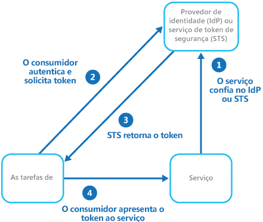
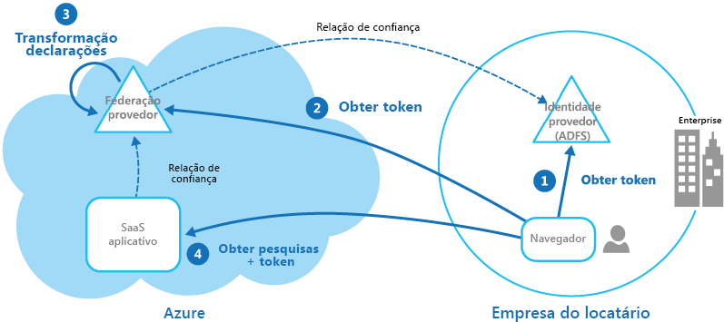

# Padrão de identidade federadaFederated Identity pattern

[!INCLUDE [header](../_includes/header.md)]

Autenticação de delegado a um provedor de identidade externo.Delegate authentication to an external identity provider. Isso pode simplificar o desenvolvimento, minimizar a necessidade de administração de usuário e melhorar a experiência do usuário do aplicativo.This can simplify development, minimize the requirement for user administration, and improve the user experience of the application.

## Contexto e problemaContext and problem

Normalmente, os usuários precisam trabalhar com vários aplicativos fornecidos e hospedados por diferentes organizações com as quais eles mantém uma relação comercial.Users typically need to work with multiple applications provided and hosted by different organizations they have a business relationship with. Esses usuários podem precisar usar credenciais específicas (e diferentes) para cada um.These users might be required to use specific (and different) credentials for each one. Isso pode:This can:

- **Causar uma experiência de usuário não contígua**.**Cause a disjointed user experience**. Os usuários muitas vezes esquecem as credenciais de logon quando usam várias delas.Users often forget sign-in credentials when they have many different ones.

- **Expor vulnerabilidades de segurança**.**Expose security vulnerabilities**. Quando um usuário sai da empresa, a conta deve ser desprovisionada imediatamente.When a user leaves the company the account must immediately be deprovisioned. É fácil ignorar isso em grandes organizações.It's easy to overlook this in large organizations.

- **Complicações no gerenciamento de usuários**.**Complicate user management**. Os administradores devem gerenciar as credenciais para todos os usuários e realizar tarefas adicionais, como fornecer lembretes de senha.Administrators must manage credentials for all of the users, and perform additional tasks such as providing password reminders.

Os usuários normalmente preferem usar as mesmas credenciais para todos esses aplicativos.Users typically prefer to use the same credentials for all these applications.

## SoluçãoSolution

Implemente um mecanismo de autenticação que pode usar identidade federada.Implement an authentication mechanism that can use federated identity. Separe a autenticação do usuário do código de aplicativo e delegue a autenticação a um provedor de identidade confiável.Separate user authentication from the application code, and delegate authentication to a trusted identity provider. Isso pode simplificar o desenvolvimento e permitir que os usuários se autentiquem usando uma variedade maior de IdP (provedores de identidade), minimizando a sobrecarga administrativa.This can simplify development and allow users to authenticate using a wider range of identity providers (IdP) while minimizing the administrative overhead. Ele também permite separar claramente a autenticação da autorização.It also allows you to clearly decouple authentication from authorization.

Os provedores de identidade confiável incluem diretórios corporativos, serviços de federação local, outros STS (serviços de token de segurança) fornecidos por parceiros de negócios ou provedores de identidade sociais que podem autenticar os usuários que têm, por exemplo, uma conta da Microsoft, Google, Yahoo! ou Facebook.The trusted identity providers include corporate directories, on-premises federation services, other security token services (STS) provided by business partners, or social identity providers that can authenticate users who have, for example, a Microsoft, Google, Yahoo!, or Facebook account.

A figura ilustra o Padrão de identidade federada quando um aplicativo cliente precisa acessar um serviço que requer autenticação.The figure illustrates the Federated Identity pattern when a client application needs to access a service that requires authentication. A autenticação é realizada por um IdP que funciona junto com um STS.The authentication is performed by an IdP that works in concert with an STS. O IdP emite tokens de segurança que fornecem informações sobre o usuário autenticado.The IdP issues security tokens that provide information about the authenticated user. Essas informações, chamadas de declarações, incluem a identidade do usuário e também podem incluir outras informações, como associação de função e os direitos de acesso mais granulares.This information, referred to as claims, includes the user’s identity, and might also include other information such as role membership and more granular access rights.

Esse modelo geralmente é chamado de controle de acesso baseado em declarações.This model is often called claims-based access control. Os aplicativos e serviços autorizam o acesso aos recursos e funcionalidades com base nas declarações contidas no token.Applications and services authorize access to features and functionality based on the claims contained in the token. O serviço que exige autenticação deve confiar no IdP.The service that requires authentication must trust the IdP. O aplicativo cliente contata o IdP que executa a autenticação.The client application contacts the IdP that performs the authentication. Se a autenticação for bem-sucedida, o IdP retornará um token que contém as declarações que identificam o usuário para o STS (observe que o IdP e o STS podem ser o mesmo serviço).If the authentication is successful, the IdP returns a token containing the claims that identify the user to the STS (note that the IdP and STS can be the same service). O STS pode transformar e aumentar as declarações no token com base nas regras predefinidas, antes de retorná-lo para o cliente.The STS can transform and augment the claims in the token based on predefined rules, before returning it to the client. O aplicativo cliente pode, então, transmitir esse token para o serviço como uma prova de sua identidade.The client application can then pass this token to the service as proof of its identity.

> Podem existir STSs adicionais na cadeia de confiança.There might be additional STSs in the chain of trust. Por exemplo, no cenário descrito posteriormente, um STS local confia em outro STS que é responsável por acessar um provedor de identidade para autenticar o usuário.For example, in the scenario described later, an on-premises STS trusts another STS that is responsible for accessing an identity provider to authenticate the user. Essa abordagem é comum em cenários empresariais em que há um local STS e um diretório.This approach is common in enterprise scenarios where there's an on-premises STS and directory.

A autenticação federada fornece uma solução baseada em padrões para o problema de confiar em identidades entre diferentes domínios e pode dar suporte a logon único.Federated authentication provides a standards-based solution to the issue of trusting identities across diverse domains, and can support single sign-on. Ela está se tornando mais comum em todos os tipos de aplicativos, especialmente aplicativos hospedados em nuvem, pois ele dá suporte a logon único sem a necessidade de uma conexão de rede direta com provedores de identidade.It's becoming more common across all types of applications, especially cloud-hosted applications, because it supports single sign-on without requiring a direct network connection to identity providers. O usuário não precisa digitar as credenciais para cada aplicativo.The user doesn't have to enter credentials for every application. Isso aumenta a segurança, pois impede a criação de credenciais necessárias para acessar vários aplicativos diferentes e também oculta as credenciais do usuário de todos, exceto do provedor de identidade original.This increases security because it prevents the creation of credentials required to access many different applications, and it also hides the user’s credentials from all but the original identity provider. Os aplicativos veem apenas as informações de identidade autenticada contidas no token.Applications see just the authenticated identity information contained within the token.

A identidade federada também traz a grande vantagem de que o gerenciamento da identidade e das credenciais é responsabilidade do provedor de identidade.Federated identity also has the major advantage that management of the identity and credentials is the responsibility of the identity provider. O aplicativo ou serviço não precisa fornecer recursos de gerenciamento de identidade.The application or service doesn't need to provide identity management features. Além disso, em cenários corporativos, o diretório corporativo não precisa conhecer o usuário se confiar no provedor de identidade.In addition, in corporate scenarios, the corporate directory doesn't need to know about the user if it trusts the identity provider. Isso remove toda a sobrecarga administrativa de gerenciar a identidade do usuário dentro do diretório.This removes all the administrative overhead of managing the user identity within the directory.

## Problemas e consideraçõesIssues and considerations

Considere os seguintes pontos ao projetar aplicativos que implementam a autenticação federada:Consider the following when designing applications that implement federated authentication:

- A autenticação pode ser um ponto único de falha.Authentication can be a single point of failure. Se você implantar seu aplicativo em vários datacenters, considere implantar seu mecanismo de gerenciamento de identidade para os mesmos datacenters para manter a disponibilidade e a confiabilidade do aplicativo.If you deploy your application to multiple datacenters, consider deploying your identity management mechanism to the same datacenters to maintain application reliability and availability.

- As ferramentas de autenticação permitem configurar o controle de acesso baseado em declarações de função contidas no token de autenticação.Authentication tools make it possible to configure access control based on role claims contained in the authentication token. Isso geralmente é conhecido como RBAC (controle de acesso baseado em função) e pode proporcionar um nível mais granular de controle de acesso aos recursos e funcionalidades.This is often referred to as role-based access control (RBAC), and it can allow a more granular level of control over access to features and resources.

- Ao contrário de um diretório corporativo, a autenticação baseada em declarações usando provedores de identidade social geralmente não fornecem informações sobre o usuário autenticado além de um endereço de email e, talvez, um nome.Unlike a corporate directory, claims-based authentication using social identity providers doesn't usually provide information about the authenticated user other than an email address, and perhaps a name. Alguns provedores de identidade social, como uma conta da Microsoft, fornecem apenas um identificador exclusivo.Some social identity providers, such as a Microsoft account, provide only a unique identifier. O aplicativo geralmente precisa manter algumas informações sobre os usuários registrados e corresponder tais informações com o identificador contido nas declarações no token.The application usually needs to maintain some information on registered users, and be able to match this information to the identifier contained in the claims in the token. Normalmente isso é feito por meio do registro quando o usuário acessa o aplicativo pela primeira vez e as informações são injetadas no token como declarações adicionais depois de cada autenticação.Typically this is done through registration when the user first accesses the application, and information is then injected into the token as additional claims after each authentication.

- Se houver mais de um provedor de identidade configurado para o STS, ele deverá detectar para qual provedor de identidade o usuário deve ser redirecionado para autenticação.If there's more than one identity provider configured for the STS, it must detect which identity provider the user should be redirected to for authentication. Esse processo é chamado de descoberta de realm inicial.This process is called home realm discovery. O STS pode fazer isso automaticamente com base em um endereço de email ou nome de usuário fornecidos pelo usuário, um subdomínio do aplicativo que o usuário está acessando, o escopo do endereço IP do usuário ou no conteúdo de um cookie armazenado no navegador do usuário.The STS might be able to do this automatically based on an email address or user name that the user provides, a subdomain of the application that the user is accessing, the user’s IP address scope, or on the contents of a cookie stored in the user’s browser. Por exemplo, se o usuário inseriu um endereço de email no domínio da Microsoft, como user@live.com, o STS redirecionará o usuário para a página de entrada da conta da Microsoft.For example, if the user entered an email address in the Microsoft domain, such as user@live.com, the STS will redirect the user to the Microsoft account sign-in page. Em visitas posteriores, o STS poderia usar um cookie para indicar que a última entrada ocorreu com uma conta da Microsoft.On later visits, the STS could use a cookie to indicate that the last sign in was with a Microsoft account. Se a descoberta automática não puder determinar o realm inicial, o STS exibirá uma página de descoberta de realm inicial que lista os provedores de identidade confiável e o usuário precisará selecionar aquela que ele deseja usar.If automatic discovery can't determine the home realm, the STS will display a home realm discovery page that lists the trusted identity providers, and the user must select the one they want to use.

## Quando usar esse padrãoWhen to use this pattern

Esse padrão é útil em cenários como:This pattern is useful for scenarios such as:

- **Logon único na empresa**.**Single sign-on in the enterprise**. Nesse cenário, você precisa autenticar os funcionários em aplicativos corporativos que são hospedados na nuvem fora do limite de segurança corporativo, sem exigir que eles entrem toda vez que visitarem um aplicativo.In this scenario you need to authenticate employees for corporate applications that are hosted in the cloud outside the corporate security boundary, without requiring them to sign in every time they visit an application. A experiência do usuário é igual a usar aplicativos locais em que estão autenticados ao entrar em uma rede corporativa e nela eles têm acesso a todos os aplicativos relevantes sem precisar entrar novamente.The user experience is the same as when using on-premises applications where they're authenticated when signing in to a corporate network, and from then on have access to all relevant applications without needing to sign in again.

- **Identidade federada com vários parceiros**.**Federated identity with multiple partners**. Nesse cenário, você precisa autenticar os funcionários corporativos e parceiros de negócios que não têm contas no diretório corporativo.In this scenario you need to authenticate both corporate employees and business partners who don't have accounts in the corporate directory. Isso é comum em aplicativos entre empresas, aplicativos que se integram com serviços de terceiros e pontos em que empresas com diferentes sistemas de TI mesclam ou compartilham recursos.This is common in business-to-business applications, applications that integrate with third-party services, and where companies with different IT systems have merged or shared resources.

- **Identidade federada em aplicativos SaaS**.**Federated identity in SaaS applications**. Neste cenário, os fornecedores independentes oferecem um serviço pronto para usar para vários clientes ou locatários.In this scenario independent software vendors provide a ready-to-use service for multiple clients or tenants. Cada locatário é autenticado usando um provedor de identidade adequado.Each tenant authenticates using a suitable identity provider. Por exemplo, os usuários empresariais usarão suas credenciais corporativas, enquanto os consumidores e clientes do locatário usarão as credenciais de identidade social.For example, business users will use their corporate credentials, while consumers and clients of the tenant will use their social identity credentials.

Esse padrão pode não ser útil nas seguintes situações:This pattern might not be useful in the following situations:

- Todos os usuários do aplicativo podem ser autenticados por um provedor de identidade e não há nenhum requisito para autenticar-se usando outro provedor de identidade.All users of the application can be authenticated by one identity provider, and there's no requirement to authenticate using any other identity provider. Isso é comum em aplicativos de negócios que usam um diretório corporativo (acessível de dentro do aplicativo) para autenticação, usando uma VPN ou (em um cenário hospedado em nuvem) por meio de uma conexão de rede virtual entre o diretório local e o aplicativo.This is typical in business applications that use a corporate directory (accessible within the application) for authentication, by using a VPN, or (in a cloud-hosted scenario) through a virtual network connection between the on-premises directory and the application.

- O aplicativo foi criado originalmente usando um mecanismo de autenticação diferente, talvez com repositórios de usuário personalizados ou não tem a capacidade de lidar com os padrões de negociação usados pelas tecnologias baseadas em declarações.The application was originally built using a different authentication mechanism, perhaps with custom user stores, or doesn't have the capability to handle the negotiation standards used by claims-based technologies. Adaptar a autenticação e o controle de acesso baseados em declarações para aplicativos existentes pode ser muito complexo e provavelmente não econômico.Retrofitting claims-based authentication and access control into existing applications can be complex, and probably not cost effective.

## ExemploExample

Uma organização hospeda um aplicativo SaaS (software como serviço) de vários locatários no Microsoft Azure.An organization hosts a multi-tenant software as a service (SaaS) application in Microsoft Azure. O aplicativo inclui um site que os locatários podem usar para gerenciar o aplicativo para seus próprios usuários.The application includes a website that tenants can use to manage the application for their own users. O aplicativo permite que os locatários acessem o site usando uma identidade federada que é gerada pelo Serviços de Federação do Active Directory (AD FS) quando um usuário é autenticado pelo Active Directory da própria organização.The application allows tenants to access the website by using a federated identity that is generated by Active Directory Federation Services (ADFS) when a user is authenticated by that organization’s own Active Directory.

A figura mostra como os locatários são autenticados com seu próprio provedor de identidade (etapa 1), nesse caso o ADFS.The figure shows how tenants authenticate with their own identity provider (step 1), in this case ADFS. Depois de autenticar com êxito um locatário, o ADFS emite um token.After successfully authenticating a tenant, ADFS issues a token. O navegador do cliente encaminha esse token para o provedor de federação do aplicativo SaaS, que confia nos tokens emitidos pelo AD FS do locatário, a fim de retornar um token válido para o provedor de federação de SaaS (etapa 2).The client browser forwards this token to the SaaS application’s federation provider, which trusts tokens issued by the tenant’s ADFS, in order to get back a token that is valid for the SaaS federation provider (step 2). Se necessário, o provedor de federação de SaaS executa uma transformação sobre as declarações no token para declarações que o aplicativo reconhece (etapa 3) antes de retornar o novo token para o navegador do cliente.If necessary, the SaaS federation provider performs a transformation on the claims in the token into claims that the application recognizes (step 3) before returning the new token to the client browser. O aplicativo confia nos tokens emitidos pelo provedor de federação de SaaS e usa as declarações no token para aplicar as regras de autorização (etapa 4).The application trusts tokens issued by the SaaS federation provider and uses the claims in the token to apply authorization rules (step 4).

Os locatários não precisam se lembrar das credenciais separadas para acessar o aplicativo e um administrador de empresa do locatário pode configurar seu no próprio ADFS a lista de usuários que podem acessar o aplicativo.Tenants won't need to remember separate credentials to access the application, and an administrator at the tenant’s company can configure in its own ADFS the list of users that can access the application.

## Diretrizes relacionadasRelated guidance

- [Microsoft Azure Active DirectoryMicrosoft Azure Active Directory](https://azure.microsoft.com/services/active-directory/)
- [Active Directory Domain ServicesActive Directory Domain Services](https://msdn.microsoft.com/library/bb897402.aspx)
- [Serviços de Federação do Active Directory (AD FS)Active Directory Federation Services](https://msdn.microsoft.com/library/bb897402.aspx)
- [Gerenciamento de identidades para aplicativos multilocatários no Microsoft AzureIdentity management for multitenant applications in Microsoft Azure](https://azure.microsoft.com/documentation/articles/guidance-multitenant-identity/)
- [Aplicativos multilocatários no AzureMultitenant Applications in Azure](https://azure.microsoft.com/documentation/articles/dotnet-develop-multitenant-applications/)
