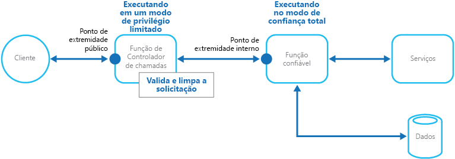

# Padrão de gatekeeper

[!INCLUDE [header](../_includes/header.md)]

Proteger aplicativos e serviços usando uma instância de host dedicado que atua como intermediário entre clientes e o aplicativo ou serviço, valida e corrige solicitações e passa solicitações e dados entre eles. Isso pode fornecer uma camada adicional de segurança e limitar a superfície de ataque do sistema.

## Contexto e problema

Aplicativos expõem suas funcionalidades a clientes ao aceitar e processar solicitações. Em cenários hospedados na nuvem, aplicativos expõem pontos de extremidade aos quais os clientes se conectam e normalmente incluem o código para manipular as solicitações de clientes. Esse código executa autenticação e validação, processamento de algumas ou todas as solicitações e provavelmente acessa o armazenamento e outros serviços em nome do cliente.

Se um usuário mal-intencionado conseguir comprometer o sistema e obter acesso ao ambiente de hospedagem do aplicativo, os mecanismos de segurança usados por ele, como credenciais e chaves de armazenamento, e os serviços e os dados acessados por ele serão expostos. Como resultado, o usuário mal-intencionado pode obter acesso irrestrito a informações e outros serviços confidenciais.

## Solução

Para minimizar o risco de clientes obterem acesso a informações e serviços confidenciais, desacoplar hosts ou tarefas que exponham pontos de extremidade públicos do código que processa solicitações e acessa o armazenamento. Você pode fazer isso usando uma fachada ou uma tarefa dedicada que interage com os clientes e, em seguida, transmite a solicitação &mdash; talvez por meio de uma interface desacoplada &mdash; aos hosts ou às tarefas que manipularão a solicitação. A figura fornece uma visão geral de alto nível desse padrão.

O padrão de gatekeeper pode ser usado para simplesmente proteger o armazenamento ou pode ser usado como fachada mais abrangente para proteger todas as funções do aplicativo. Os fatores importantes são:

- **Validação controlada.** O gatekeeper valida todas as solicitações e rejeita as que não atendem aos requisitos de validação.
- **Risco e exposição limitados.** O gatekeeper não tem acesso às credenciais ou às chaves usadas pelo host confiável para acessar o armazenamento e serviços. Se o gatekeeper estiver comprometido, o invasor não obterá acesso a essas credenciais ou chaves.
- **Segurança adequada.** O gatekeeper é executado em modo de privilégio limitado, enquanto o restante do aplicativo é executado no modo de confiança total necessário para acessar o armazenamento e os serviços. Se o gatekeeper estiver comprometido, ele não poderá acessar diretamente os serviços ou dados do aplicativo.

Esse padrão funciona como firewall em uma topografia de rede típica. Ele permite que o gatekeeper examine as solicitações e tome uma decisão sobre se deve passar a solicitação para o host confiável (às vezes chamado de keymaster) que executa as tarefas necessárias. Essa decisão normalmente requer que gatekeeper valide e limpe o conteúdo da solicitação antes de passá-la para o host confiável.

## Problemas e considerações

Considere os seguintes pontos ao decidir como implementar esse padrão:

- Certifique-se de que os hosts confiáveis aos quais o gatekeeper passa as solicitações exponham apenas pontos de extremidade internos ou protegidos e conectem-se somente ao gatekeeper. Os hosts confiáveis não devem expor nenhum ponto de extremidade externo ou interface.
- O gatekeeper deve ser executado em modo de privilégio limitado. Normalmente, isso significa executar o gatekeeper e o host confiável em serviços hospedados ou máquinas virtuais separadas.
- O gatekeeper não deve executar nenhum processamento relacionado ao aplicativo ou a serviços nem acessar dados. Sua função é puramente validar e corrigir solicitações. Os hosts confiáveis talvez precisem executar uma validação adicional das solicitações, mas a validação do núcleo deve ser executada pelo gatekeeper.
- Use um canal de comunicação seguro (HTTPS, SSL ou TLS) entre o gatekeeper e os hosts confiáveis ou tarefas quando for possível. No entanto, alguns ambientes de hospedagem não oferecem suporte a HTTPS em pontos de extremidade internos.
- Adicionar a camada extra ao aplicativo para implementar o padrão do gatekeeper provavelmente terá um impacto no desempenho devido ao processamento adicional e na comunicação de rede exigida por ele.
- A instância do gatekeeper pode ser um ponto único de falha. Para minimizar o impacto de uma falha, considere implantar instâncias adicionais e usar um mecanismo de dimensionamento automático para garantir a capacidade de manter a disponibilidade.

## Quando usar esse padrão

Esse padrão é útil para:

- Aplicativos que lidem com informações confidenciais, exponham serviços que devem ter um alto grau de proteção contra ataques mal-intencionados ou executem operações essenciais que não devem ser interrompidas.
- Aplicativos distribuídos nos quais é necessário executar a validação de solicitação separadamente das principais tarefas ou centralizar essa validação para simplificar a manutenção e administração.

## Exemplo

Quando hospedado em nuvem, esse padrão pode ser implementado ao desacoplar a função do gatekeeper ou da máquina virtual das funções confiáveis e serviços em um aplicativo. Faça isso usando um ponto de extremidade, fila ou armazenamento interno como mecanismo de comunicação intermediário. A figura ilustra o uso de um ponto de extremidade interno.

## Padrões relacionados

O [padrão de chave de manobrista](valet-key.md) também pode ser relevante ao implementar o padrão do Gatekeeper. Na comunicação entre o Gatekeeper e as funções confiáveis, é recomendável aumentar a segurança usando chaves ou tokens que limitem as permissões de acesso aos recursos. Descreve como usar um token ou chave que forneça aos clientes acesso direto e restrito a um determinado recurso ou serviço.
