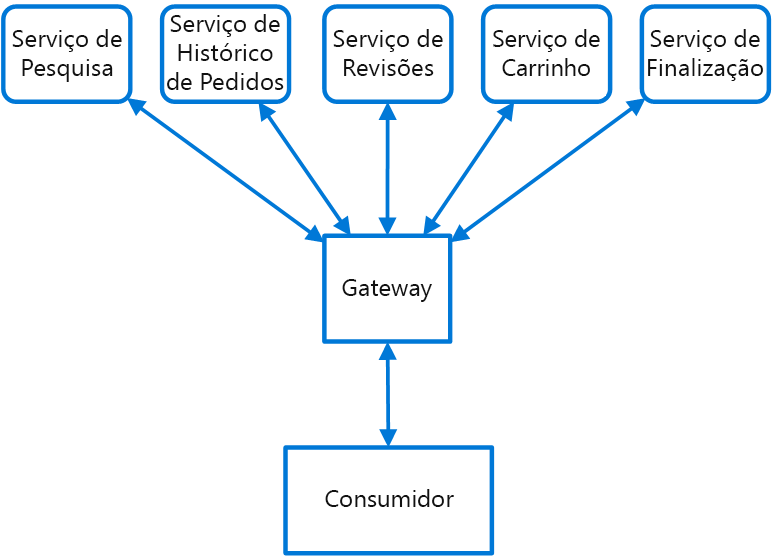

# <a name="gateway-routing-pattern"></a>Padrão de roteamento de gateway

Faça o roteamento de solicitações para vários serviços usando um único ponto de extremidade. Esse padrão é útil quando você deseja expor vários serviços em um único ponto de extremidade e rotear para o serviço apropriado com base na solicitação.

## <a name="context-and-problem"></a>Contexto e problema

Quando um cliente precisa consumir vários serviços, pode ser um desafio configurar um ponto de extremidade separado para cada serviço e precisar que o cliente gerencie cada ponto de extremidade. Por exemplo, um aplicativo de comércio eletrônico pode fornecer serviços como pesquisa, análises, carrinho de compras, check-out e histórico de pedidos. Cada serviço tem uma API diferente com a qual o cliente deve interagir, e ele deve conhecer cada ponto de extremidade para se conectar aos serviços. Se uma API muda, o cliente deverá ser atualizado também. Se você refatorar um serviço em dois ou mais serviços separados, o código deve ser alterado no serviço e no cliente.

## <a name="solution"></a>Solução

Coloque um gateway em frente a um conjunto de aplicativos, serviços ou implantações. Use o roteamento da camada de aplicativo 7 para rotear a solicitação para as instâncias apropriadas.

Com esse padrão, o aplicativo cliente só precisa conhecer e se comunicar com um único ponto de extremidade. Se um serviço for consolidado ou decomposto, o cliente não precisa necessariamente de atualização. Ele pode continuar a fazer solicitações para o gateway, e apenas o roteamento muda.

Um gateway também permite abstrair os serviços de back-end dos clientes, permitindo que você mantenha as chamadas do cliente simples ao mesmo tempo que permite alterações nos serviços de back-end por trás do gateway. Chamadas de cliente podem ser roteadas para qualquer serviço ou os serviços precisam controlar o comportamento esperado do cliente, permitindo que você adicione, divida e reorganize serviços por trás do gateway sem alterar o cliente.



Esse padrão também pode ajudar com a implantação ao permitir que você gerencie como as atualizações são distribuídas aos usuários. Quando uma nova versão do seu serviço é implantada, ela pode ser implantada em paralelo com a versão existente. O roteamento permite controlar qual versão do serviço é apresentada aos clientes, dando a você a flexibilidade para usar várias estratégias de versão, seja ela incremental, paralela ou de distribuições completas das atualizações. Quaisquer problemas descobertos depois que o novo serviço for implantado podem ser revertidos rapidamente por meio da alteração de uma configuração no gateway e sem afetar os clientes.

## <a name="issues-and-considerations"></a>Problemas e considerações

- O serviço de gateway pode introduzir um ponto único de falha. Verifique se ele está corretamente projetado para atender aos requisitos de disponibilidade. Ao implementar, leve em consideração os recursos de resiliência e tolerância a falhas.
- O serviço de gateway pode introduzir um gargalo. O gateway deve ter um desempenho adequado para lidar com a carga e pode facilmente ser dimensionado em linha com o crescimento das expectativas.
- Execute testes de carga no gateway para garantir que você não introduza falhas em cascata para serviços.
- O roteamento de gateway é de nível 7. Ele pode ser baseado em IP, porta, cabeçalho ou URL.

## <a name="when-to-use-this-pattern"></a>Quando usar esse padrão

Use esse padrão quando:

- Um cliente precisa consumir vários serviços que podem ser acessados por trás de um gateway.
- Você deseja simplificar os aplicativos cliente usando um único ponto de extremidade.
- Você precisa rotear solicitações de pontos de extremidade endereçáveis externamente para pontos de extremidade virtuais internos, como expor as portas em uma VM para endereços IP virtuais do cluster.

Esse padrão pode não ser adequado quando você tiver um aplicativo simples que usa apenas um ou dois serviços.

## <a name="example"></a>Exemplo

Ao usar o Nginx como o roteador, a seguir há um arquivo de configuração de exemplo simples de um servidor que encaminha solicitações para aplicativos que residem em diferentes diretórios virtuais para diferentes computadores no back-end.

```console
server {
    listen 80;
    server_name domain.com;

    location /app1 {
        proxy_pass http://10.0.3.10:80;
    }

    location /app2 {
        proxy_pass http://10.0.3.20:80;
    }

    location /app3 {
        proxy_pass http://10.0.3.30:80;
    }
}
```

## <a name="related-guidance"></a>Diretrizes relacionadas

- [Padrão de back-ends para front-ends](./backends-for-frontends.md)
- [Padrão de agregação de gateway](./gateway-aggregation.md)
- [Padrão de descarregamento de gateway](./gateway-offloading.md)
