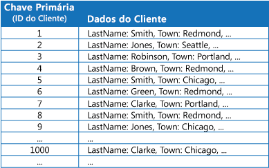
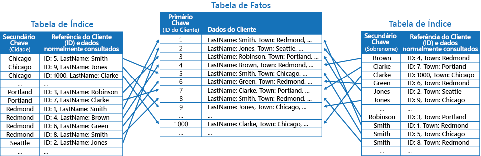
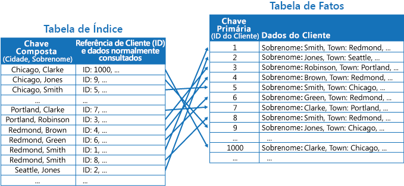

# Padrão de Tabela de ÍndiceIndex Table pattern

[!INCLUDE [header](../_includes/header.md)]

Crie índices nos campos em armazenamentos de dados que são frequentemente referenciados por consultas.Create indexes over the fields in data stores that are frequently referenced by queries. Esse padrão pode melhorar o desempenho de consulta, permitindo que os aplicativos localizem mais rapidamente os dados a serem recuperados de um armazenamento de dados.This pattern can improve query performance by allowing applications to more quickly locate the data to retrieve from a data store.

## Contexto e problemaContext and problem

Muitos armazenamento de dados organizam os dados para uma coleção de entidades utilizando a chave primária.Many data stores organize the data for a collection of entities using the primary key. Um aplicativo pode utilizar essa chave para localizar e recuperar dados.An application can use this key to locate and retrieve data. A figura mostra um exemplo de um armazenamento de dados que contém informações do cliente.The figure shows an example of a data store holding customer information. A chave primária é a ID do Cliente.The primary key is the Customer ID. A figura mostra a informação do cliente organizada pela chave primária (ID do cliente).The figure shows customer information organized by the primary key (Customer ID).

Embora a chave primária seja valiosa para consultas que busquem dados baseados no valor dessa chave, um aplicativo talvez não seja capaz de utilizar a chave primária, caso precise recuperar dados baseados em algum outro campo.While the primary key is valuable for queries that fetch data based on the value of this key, an application might not be able to use the primary key if it needs to retrieve data based on some other field. No exemplo de clientes, um aplicativo não pode utilizar a chave primária da ID do cliente para recuperar clientes se consultar os dados unicamente ao referenciar o valor de algum outro atributo, como a cidade em que o cliente está localizado.In the customers example, an application can't use the Customer ID primary key to retrieve customers if it queries data solely by referencing the value of some other attribute, such as the town in which the customer is located. Para realizar uma consulta como essa, o aplicativo pode ter que buscar e examinar todos os registros de clientes, o que pode ser um processo lento.To perform a query such as this, the application might have to fetch and examine every customer record, which could be a slow process.

Muitos sistema de gerenciamento de banco de dados relacional fornecem suporte a índices secundários.Many relational database management systems support secondary indexes. Um índice secundário é uma estrutura de dados separada, organizada por um ou mais campos de chave não primários (secundários) e indica onde os dados de cada valor indexado são armazenados.A secondary index is a separate data structure that's organized by one or more nonprimary (secondary) key fields, and it indicates where the data for each indexed value is stored. Os itens em um índice secundário normalmente são classificados pelo valor das chaves secundárias para permitir uma pesquisa rápida de dados.The items in a secondary index are typically sorted by the value of the secondary keys to enable fast lookup of data. Esses índices geralmente são mantidos automaticamente pelo sistema gerenciador de banco de dados.These indexes are usually maintained automatically by the database management system.

É possível criar quantos índices secundários forem necessários para fornecer suporte às diferentes consultas que seu aplicativo executa.You can create as many secondary indexes as you need to support the different queries that your application performs. Por exemplo, em uma tabela de Clientes em um banco de dados relacional em que a ID do cliente é a chave primária, é útil adicionar um índice secundário sobre o campo da cidade, caso o aplicativo procure frequentemente os clientes pela cidade onde residem.For example, in a Customers table in a relational database where the Customer ID is the primary key, it's beneficial to add a secondary index over the town field if the application frequently looks up customers by the town where they reside.

No entanto, embora os índices secundários sejam comuns em sistemas relacionais, a maioria dos armazenamentos de dados NoSQL utilizados por aplicativos de nuvem não fornecem uma característica equivalente.However, although secondary indexes are common in relational systems, most NoSQL data stores used by cloud applications don't provide an equivalent feature.

## SoluçãoSolution

Se o armazenamento de dados não fornecer suporte a índices secundários, você poderá emulá-los manualmente criando suas próprias tabelas de índice.If the data store doesn't support secondary indexes, you can emulate them manually by creating your own index tables. Uma tabela de índice organiza os dados por uma chave especificada.An index table organizes the data by a specified key. Três estratégias são comumente utilizadas para estruturar uma tabela de índice, dependendo do número de índices secundários necessários e da natureza das consultas que um aplicativo executa.Three strategies are commonly used for structuring an index table, depending on the number of secondary indexes that are required and the nature of the queries that an application performs.

A primeira estratégia é duplicar os dados em cada tabela de índice, mas organizá-los por diferentes chaves (desnormalização completa).The first strategy is to duplicate the data in each index table but organize it by different keys (complete denormalization). A próxima figura mostra tabelas de índice que organizam as mesmas informações do cliente por Cidade e Sobrenome.The next figure shows index tables that organize the same customer information by Town and LastName.

Esta estratégia é apropriada se os dados forem relativamente estáticos em relação ao número de vezes que ele é consultado utilizando cada chave.This strategy is appropriate if the data is relatively static compared to the number of times it's queried using each key. Se os dados forem mais dinâmicos, a sobrecarga de processamento da manutenção de cada tabela de índice será muito grande para que essa abordagem seja útil.If the data is more dynamic, the processing overhead of maintaining each index table becomes too large for this approach to be useful. Além disso, se o volume de dados for muito grande, a quantidade de espaço necessário para armazenar os dados duplicados for significativa.Also, if the volume of data is very large, the amount of space required to store the duplicate data is significant.

A segunda estratégia é criar tabelas de índice normalizadas organizadas por diferentes chaves e referenciar os dados originais utilizando a chave primária em vez de duplicá-la, conforme mostrado na figura a seguir.The second strategy is to create normalized index tables organized by different keys and reference the original data by using the primary key rather than duplicating it, as shown in the following figure. Os dados originais são chamados de tabela de fatos.The original data is called a fact table.

Essa técnica economiza espaço e reduz a sobrecarga da manutenção de dados duplicados.This technique saves space and reduces the overhead of maintaining duplicate data. A desvantagem é que um aplicativo deve executar duas operações de pesquisa para localizar dados utilizando uma chave secundária.The disadvantage is that an application has to perform two lookup operations to find data using a secondary key. Ele deve localizar a chave primária para os dados na tabela de índice e, em seguida, usar a chave primária para pesquisar os dados na tabela de fatos.It has to find the primary key for the data in the index table, and then use the primary key to look up the data in the fact table.

A terceira estratégia é criar tabelas de índice parcialmente normalizadas organizadas por diferentes chaves que dupliquem campos frequentemente recuperados.The third strategy is to create partially normalized index tables organized by different keys that duplicate frequently retrieved fields. Consulte a tabela de fatos para acessar campos com acesso menor.Reference the fact table to access less frequently accessed fields. A próxima figura mostra como os dados com acesso comum são duplicados em cada tabela de índice.The next figure shows how commonly accessed data is duplicated in each index table.

Com essa estratégia, você pode estabelecer um equilíbrio entre as duas primeiras abordagens.With this strategy, you can strike a balance between the first two approaches. Os dados para consultas comuns podem ser recuperados rapidamente, utilizando uma pesquisa única, enquanto o espaço e a sobrecarga de manutenção não são tão significativos quanto a duplicação de todo o conjunto de dados.The data for common queries can be retrieved quickly by using a single lookup, while the space and maintenance overhead isn't as significant as duplicating the entire data set.

Se um aplicativo frequentemente consulta dados, especificando uma combinação de valores (por exemplo, "Localizar todos os clientes que vivem em Redmond e que tenham um sobrenome de Smith"), você poderá implementar as chaves dos itens na tabela de índice como uma concatenação do atributo Cidade e do atributo Sobrenome.If an application frequently queries data by specifying a combination of values (for example, “Find all customers that live in Redmond and that have a last name of Smith”), you could implement the keys to the items in the index table as a concatenation of the Town attribute and the LastName attribute. A figura a seguir mostra uma tabela de índice baseada em chaves compostas.The next figure shows an index table based on composite keys. As chaves são classificadas por Cidade e, em seguida, por Sobrenome para registros que tenham o mesmo valor para Cidade.The keys are sorted by Town, and then by LastName for records that have the same value for Town.

As tabelas de índice podem acelerar as operações de consulta em relação aos dados fragmentados e são especialmente úteis quando a chave de fragmento for com hash.Index tables can speed up query operations over sharded data, and are especially useful where the shard key is hashed. A próxima figura mostra um exemplo em que a chave de fragmento é um hash da ID do Cliente.The next figure shows an example where the shard key is a hash of the Customer ID. A tabela de índice pode organizar dados pelo valor sem hash (Cidade e Sobrenome) e fornecer a chave de fragmento com hash como o dado de pesquisa.The index table can organize data by the nonhashed value (Town and LastName), and provide the hashed shard key as the lookup data. Isso pode salvar o aplicativo de cálculos repetidos de chaves de hash (uma operação cara) se precisar recuperar dados que caiam em um intervalo ou, precise buscar dados em ordem de chave sem hash.This can save the application from repeatedly calculating hash keys (an expensive operation) if it needs to retrieve data that falls within a range, or it needs to fetch data in order of the nonhashed key. Por exemplo, uma consulta como "Localizar todos os clientes que vivem em Redmond" pode ser rapidamente resolvida, localizando os itens correspondentes na tabela de índice, onde são todos armazenados em um bloco contíguo.For example, a query such as “Find all customers that live in Redmond” can be quickly resolved by locating the matching items in the index table, where they're all stored in a contiguous block. Em seguida, siga as referências para os dados do cliente, utilizando as chaves de fragmento armazenadas na tabela de índice.Then, follow the references to the customer data using the shard keys stored in the index table.

## Problemas e consideraçõesIssues and considerations

Considere os seguintes pontos ao decidir como implementar esse padrão:Consider the following points when deciding how to implement this pattern:

- A sobrecarga da manutenção de índices secundários pode ser significativa.The overhead of maintaining secondary indexes can be significant. Você deve analisar e entender as consultas que seu aplicativo utiliza.You must analyze and understand the queries that your application uses. Apenas crie tabelas de índice quando elas provavelmente serão utilizadas regularmente.Only create index tables when they're likely to be used regularly. Não crie tabelas de índice especulativa para fornecer suporte a consultas que um aplicativo não executa ou que executa apenas ocasionalmente.Don't create speculative index tables to support queries that an application doesn't perform, or performs only occasionally.
- Duplicar dados em uma tabela de índice pode adicionar sobrecarga significativa nos custos de armazenamento e no esforço necessário para manter várias cópias de dados.Duplicating data in an index table can add significant overhead in storage costs and the effort required to maintain multiple copies of data.
- A implementação de uma tabela de índice como uma estrutura normalizada que faz referência aos dados originais requer um aplicativo para executar duas operações de pesquisa para localizar dados.Implementing an index table as a normalized structure that references the original data requires an application to perform two lookup operations to find data. A primeira operação pesquisa a tabela de índice para recuperar a chave primária e a segunda utiliza a chave primária para buscar os dados.The first operation searches the index table to retrieve the primary key, and the second uses the primary key to fetch the data.
- Se um sistema incorporar uma série de tabelas de índice em conjuntos de dados muito grandes, poderá ser difícil manter a consistência entre as tabelas de índice e os dados originais.If a system incorporates a number of index tables over very large data sets, it can be difficult to maintain consistency between index tables and the original data. Pode ser possível projetar o aplicativo em torno do modelo de coerência eventual.It might be possible to design the application around the eventual consistency model. Por exemplo, para inserir, atualizar ou excluir dados, um aplicativo pode enviar uma mensagem para uma fila e permitir que uma tarefa separada execute a operação e mantenha as tabelas de índice que fazem referência a esses dados de forma assíncrona.For example, to insert, update, or delete data, an application could post a message to a queue and let a separate task perform the operation and maintain the index tables that reference this data asynchronously. Para obter mais informações sobre como implementar a coerência eventual, consulte o [Primer de consistência de dados](https://msdn.microsoft.com/library/dn589800.aspx).For more information about implementing eventual consistency, see the [Data Consistency Primer](https://msdn.microsoft.com/library/dn589800.aspx).

   >  As tabelas de armazenamento do Microsoft Azure fornecem suporte a atualizações transacionais para alterações feitas nos dados mantidos na mesma partição (referidas como transações de grupos da entidade).Microsoft Azure storage tables support transactional updates for changes made to data held in the same partition (referred to as entity group transactions). Se for possível armazenar os dados para uma tabela de fatos e uma ou mais tabelas de índice na mesma partição, você poderá utilizar esse recurso para garantir a consistência.If you can store the data for a fact table and one or more index tables in the same partition, you can use this feature to help ensure consistency.

- As tabelas de índice podem ser particionadas ou fragmentadas.Index tables might themselves be partitioned or sharded.

## Quando usar esse padrãoWhen to use this pattern

Utilize esse padrão para melhorar o desempenho de consulta quando um aplicativo frequentemente precisar recuperar dados utilizando uma tecla diferente da chave primária (ou fragmento).Use this pattern to improve query performance when an application frequently needs to retrieve data by using a key other than the primary (or shard) key.

Esse padrão pode não ser útil quando:This pattern might not be useful when:

- Os dados forem voláteis.Data is volatile. Uma tabela de índice pode tornar-se desatualizada muito rapidamente, tornando-a ineficaz ou fazendo com que a sobrecarga de manutenção da tabela de índice seja maior do que qualquer economia feita durante a utilização.An index table can become out of date very quickly, making it ineffective or making the overhead of maintaining the index table greater than any savings made by using it.
- Um campo selecionado como a chave secundária para uma tabela de índice não é discriminatório e somente poderá ter um conjunto de valores pequeno (por exemplo, gênero).A field selected as the secondary key for an index table is nondiscriminating and can only have a small set of values (for example, gender).
- O equilíbrio dos valores de dados para um campo selecionado como a chave secundária para uma tabela de índice é altamente distorcido.The balance of the data values for a field selected as the secondary key for an index table are highly skewed. Por exemplo, se 90% dos registros contiverem o mesmo valor em um campo, a criação e manutenção de uma tabela de índice para pesquisar dados com base nesse campo pode criar mais sobrecarga do que examinar sequencialmente através dos dados.For example, if 90% of the records contain the same value in a field, then creating and maintaining an index table to look up data based on this field might create more overhead than scanning sequentially through the data. No entanto, se as consultas com frequência atingirem valores que se situam nos restantes 10%, esse índice poderá ser útil.However, if queries very frequently target values that lie in the remaining 10%, this index can be useful. Você deve entender as consultas que seu aplicativo está executando e a frequência com que são executados.You should understand the queries that your application is performing, and how frequently they're performed.

## ExemploExample

As tabelas de armazenamento do Azure fornecem um armazenamento de dados valor/chave altamente escalonável para aplicativos em execução na nuvem.Azure storage tables provide a highly scalable key/value data store for applications running in the cloud. Os aplicativos armazenam e recuperam valores de dados especificando uma chave.Applications store and retrieve data values by specifying a key. Os valores de dados podem conter vários campos, mas a estrutura de um item de dados é opaca para armazenamento de tabela, que simplesmente administra um item de dados como uma matriz de bytes.The data values can contain multiple fields, but the structure of a data item is opaque to table storage, which simply handles a data item as an array of bytes.

As tabelas de armazenamento do Azure também fornecem suporte para fragmentação.Azure storage tables also support sharding. A chave de fragmentação inclui dois elementos, uma chave de partição e uma chave de linha.The sharding key includes two elements, a partition key and a row key. Os itens que possuem a mesma chave de partição são armazenados na mesma partição (fragmento) e os itens são armazenados na ordem das linhas do item dentro de um fragmento.Items that have the same partition key are stored in the same partition (shard), and the items are stored in row key order within a shard. O armazenamento de tabelas é otimizado para realizar consultas que buscam dados que caem em um intervalo contíguo de valores de linha de linha dentro de uma partição.Table storage is optimized for performing queries that fetch data falling within a contiguous range of row key values within a partition. Se você estiver construindo aplicativos de nuvem que armazenam informações em tabelas do Azure, será necessário estruturar seus dados com esse recurso em mente.If you're building cloud applications that store information in Azure tables, you should structure your data with this feature in mind.

Por exemplo, considere um aplicativo que armazena informações sobre filmes.For example, consider an application that stores information about movies. O aplicativo frequentemente consulta filmes por gênero (ação, documentário, histórico, comédia, drama, etc.).The application frequently queries movies by genre (action, documentary, historical, comedy, drama, and so on). Você poderia criar uma tabela do Azure com partições para cada gênero, utilizando o gênero como a chave de partição e especificando o nome do filme como a chave de linha, conforme mostrado na próxima figura.You could create an Azure table with partitions for each genre by using the genre as the partition key, and specifying the movie name as the row key, as shown in the next figure.

Essa abordagem é menos efetiva se o aplicativo também precisar consultar filmes por ator principal.This approach is less effective if the application also needs to query movies by starring actor. Nesse caso, é possível criar uma tabela do Azure separada que age como uma tabela de índice.In this case, you can create a separate Azure table that acts as an index table. A chave de partição é o ator e a chave de linha é o nome do filme.The partition key is the actor and the row key is the movie name. Os dados para cada ator serão armazenados em partições separadas.The data for each actor will be stored in separate partitions. Se um filme estrelar mais de um ator, o mesmo filme ocorrerá em várias partições.If a movie stars more than one actor, the same movie will occur in multiple partitions.

É possível duplicar os dados do filme nos valores mantidos por cada partição, adotando a primeira abordagem descrita na seção Solução acima.You can duplicate the movie data in the values held by each partition by adopting the first approach described in the Solution section above. No entanto, é provável que cada filme seja replicado várias vezes (uma vez por cada ator), por isso, pode ser mais eficiente desnormalizar parcialmente os dados para fornecer suporte às consultas mais comuns (como os nomes dos outros atores) e habilitar um aplicativo para recuperar os detalhes restantes, incluindo a chave de partição necessária para localizar a informação completa nas partições de gênero.However, it's likely that each movie will be replicated several times (once for each actor), so it might be more efficient to partially denormalize the data to support the most common queries (such as the names of the other actors) and enable an application to retrieve any remaining details by including the partition key necessary to find the complete information in the genre partitions. Essa abordagem é descrita pela terceira opção na seção Solução.This approach is described by the third option in the Solution section. A próxima figura mostra essa abordagem.The next figure shows this approach.

## Diretrizes e padrões relacionadosRelated patterns and guidance

Os padrões e diretrizes a seguir também podem ser relevantes ao implementar esse padrão:The following patterns and guidance might also be relevant when implementing this pattern:

- [Primer de Consistência de Dados](https://msdn.microsoft.com/library/dn589800.aspx).[Data Consistency Primer](https://msdn.microsoft.com/library/dn589800.aspx). Uma tabela de índice deve ser mantida à medida que os dados que indexa as alterações.An index table must be maintained as the data that it indexes changes. Na nuvem, pode não ser possível ou apropriado executar operações que atualizem um índice como parte da mesma transação que altera os dados.In the cloud, it might not be possible or appropriate to perform operations that update an index as part of the same transaction that modifies the data. Nesse caso, uma abordagem eventualmente coerente é mais apropriada.In that case, an eventually consistent approach is more suitable. Fornece informações sobre as questões relacionadas com a coerência eventual.Provides information on the issues surrounding eventual consistency.
- [Padrão de Fragmentação](./sharding.md).[Sharding pattern](./sharding.md). O padrão da tabela de índice é frequentemente utilizado em conjunto com dados compartilhados usando fragmentos.The Index Table pattern is frequently used in conjunction with data partitioned by using shards. O padrão de Fragmentação fornece mais informações sobre como dividir um armazenamento de dados em um conjunto de fragmentos.The Sharding pattern provides more information on how to divide a data store into a set of shards.
- [Padrão de Exibição Materializada](./materialized-view.md).[Materialized View pattern](./materialized-view.md). Em vez de indexar dados para fornecer suporte às consultas que resumem dados, talvez seja mais apropriado criar uma exibição materializada dos dados.Instead of indexing data to support queries that summarize data, it might be more appropriate to create a materialized view of the data. Descreve como fornecer suporte às consultas de resumo eficientes, gerando exibições pré-populadas sobre dados.Describes how to support efficient summary queries by generating prepopulated views over data.
