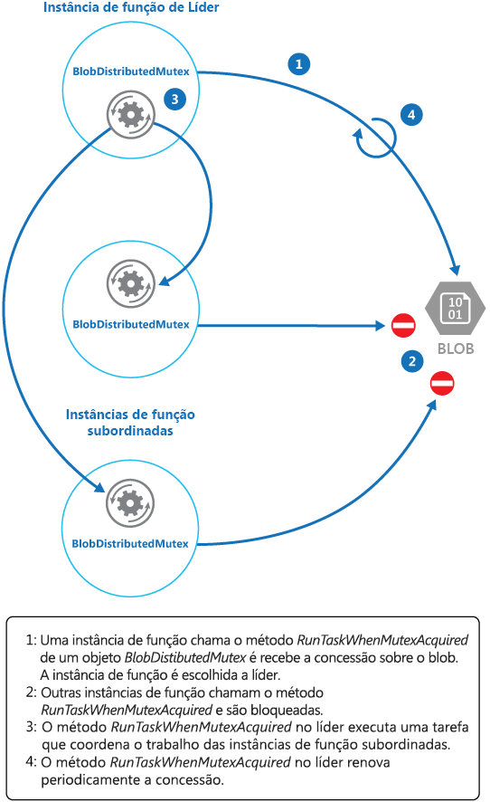

# <a name="leader-election-pattern"></a><span data-ttu-id="2bafd-104">Padrão de eleição de líder</span><span class="sxs-lookup"><span data-stu-id="2bafd-104">Leader Election pattern</span></span>

[!INCLUDE [header](../_includes/header.md)]

<span data-ttu-id="2bafd-105">Coordene as ações executadas por uma coleção de instâncias de colaboração em um aplicativo distribuído elegendo uma instância como o líder que assume a responsabilidade de gerenciar as demais.</span><span class="sxs-lookup"><span data-stu-id="2bafd-105">Coordinate the actions performed by a collection of collaborating instances in a distributed application by electing one instance as the leader that assumes responsibility for managing the others.</span></span> <span data-ttu-id="2bafd-106">Isso pode ajudar a garantir que as instâncias não entrem em conflito com outras, causar contenção de recursos compartilhados ou interferir inadvertidamente no trabalho que outras instâncias estão executando.</span><span class="sxs-lookup"><span data-stu-id="2bafd-106">This can help to ensure that instances don't conflict with each other, cause contention for shared resources, or inadvertently interfere with the work that other instances are performing.</span></span>

## <a name="context-and-problem"></a><span data-ttu-id="2bafd-107">Contexto e problema</span><span class="sxs-lookup"><span data-stu-id="2bafd-107">Context and problem</span></span>

<span data-ttu-id="2bafd-108">Um aplicativo de nuvem típico tem muitas tarefas que funcionam de maneira coordenada.</span><span class="sxs-lookup"><span data-stu-id="2bafd-108">A typical cloud application has many tasks acting in a coordinated manner.</span></span> <span data-ttu-id="2bafd-109">Essas tarefas poderiam ser instâncias que executam o mesmo código e precisam de acessar aos mesmos recursos ou podem estar trabalhando juntas em paralelo para executar as partes individuais de um cálculo complexo.</span><span class="sxs-lookup"><span data-stu-id="2bafd-109">These tasks could all be instances running the same code and requiring access to the same resources, or they might be working together in parallel to perform the individual parts of a complex calculation.</span></span>

<span data-ttu-id="2bafd-110">As instâncias de tarefa poderão ser executadas separadamente pela maior parte do tempo, mas também pode ser necessário coordenar as ações de cada instância para garantir que eles não entrem em conflito, causem contenção dos recursos compartilhados ou interfiram acidentalmente no trabalho que outras instâncias de tarefa estão executando.</span><span class="sxs-lookup"><span data-stu-id="2bafd-110">The task instances might run separately for much of the time, but it might also be necessary to coordinate the actions of each instance to ensure that they don’t conflict, cause contention for shared resources, or accidentally interfere with the work that other task instances are performing.</span></span>

<span data-ttu-id="2bafd-111">Por exemplo: </span><span class="sxs-lookup"><span data-stu-id="2bafd-111">For example:</span></span>

- <span data-ttu-id="2bafd-112">Em um sistema baseado em nuvem que implementa o dimensionamento horizontal, várias instâncias da mesma tarefa podem estar em execução ao mesmo tempo com cada instância atendendo a um usuário diferente.</span><span class="sxs-lookup"><span data-stu-id="2bafd-112">In a cloud-based system that implements horizontal scaling, multiple instances of the same task could be running at the same time with each instance serving a different user.</span></span> <span data-ttu-id="2bafd-113">Se essas instâncias gravarem em um recurso compartilhado, será necessário coordenar suas ações para impedir que cada instância substitua as alterações feitas por outras.</span><span class="sxs-lookup"><span data-stu-id="2bafd-113">If these instances write to a shared resource, it's necessary to coordinate their actions to prevent each instance from overwriting the changes made by the others.</span></span>
- <span data-ttu-id="2bafd-114">Se as tarefas estão executando elementos individuais de um cálculo complexo em paralelo, os resultados precisam ser agregados quando todos forem concluídos.</span><span class="sxs-lookup"><span data-stu-id="2bafd-114">If the tasks are performing individual elements of a complex calculation in parallel, the results need to be aggregated when they all complete.</span></span>

<span data-ttu-id="2bafd-115">Todas as instâncias de tarefa são pares, portanto não há um líder natural que possa atuar como o coordenador ou agregador.</span><span class="sxs-lookup"><span data-stu-id="2bafd-115">The task instances are all peers, so there isn't a natural leader that can act as the coordinator or aggregator.</span></span>

## <a name="solution"></a><span data-ttu-id="2bafd-116">Solução</span><span class="sxs-lookup"><span data-stu-id="2bafd-116">Solution</span></span>

<span data-ttu-id="2bafd-117">Uma única instância de tarefa deve ser eleita para atuar como líder e essa instância deve coordenar as ações de outras instâncias de tarefa subordinada.</span><span class="sxs-lookup"><span data-stu-id="2bafd-117">A single task instance should be elected to act as the leader, and this instance should coordinate the actions of the other subordinate task instances.</span></span> <span data-ttu-id="2bafd-118">Se todas as instâncias de tarefa executarem o mesmo código, qualquer uma delas poderá atuar como o líder.</span><span class="sxs-lookup"><span data-stu-id="2bafd-118">If all of the task instances are running the same code, they are each capable of acting as the leader.</span></span> <span data-ttu-id="2bafd-119">Portanto, o processo de eleição deve ser gerenciado com cuidado para evitar que duas ou mais instâncias assumam a função de líder ao mesmo tempo.</span><span class="sxs-lookup"><span data-stu-id="2bafd-119">Therefore, the election process must be managed carefully to prevent two or more instances taking over the leader role at the same time.</span></span>

<span data-ttu-id="2bafd-120">O sistema deve fornecer um mecanismo robusto para selecionar o líder.</span><span class="sxs-lookup"><span data-stu-id="2bafd-120">The system must provide a robust mechanism for selecting the leader.</span></span> <span data-ttu-id="2bafd-121">Esse método precisa lidar com eventos como interrupções da rede ou falhas de processo.</span><span class="sxs-lookup"><span data-stu-id="2bafd-121">This method has to cope with events such as network outages or process failures.</span></span> <span data-ttu-id="2bafd-122">Em muitas soluções, as instâncias de tarefa subordinadas monitoram o líder por meio de algum tipo de método de pulsação ou por meio de sondagem.</span><span class="sxs-lookup"><span data-stu-id="2bafd-122">In many solutions, the subordinate task instances monitor the leader through some type of heartbeat method, or by polling.</span></span> <span data-ttu-id="2bafd-123">Se o líder designado terminar inesperadamente ou se uma falha de rede deixar o líder indisponível para as instâncias de tarefa subordinadas, será necessário eleger um novo líder.</span><span class="sxs-lookup"><span data-stu-id="2bafd-123">If the designated leader terminates unexpectedly, or a network failure makes the leader unavailable to the subordinate task instances, it's necessary for them to elect a new leader.</span></span>

<span data-ttu-id="2bafd-124">Há várias estratégias para eleger o líder entre um conjunto de tarefas em um ambiente distribuído, incluindo:</span><span class="sxs-lookup"><span data-stu-id="2bafd-124">There are several strategies for electing a leader among a set of tasks in a distributed environment, including:</span></span>
- <span data-ttu-id="2bafd-125">Selecionar a instância da tarefa com a ID de processo ou instância mais baixa.</span><span class="sxs-lookup"><span data-stu-id="2bafd-125">Selecting the task instance with the lowest-ranked instance or process ID.</span></span>
- <span data-ttu-id="2bafd-126">Corrida para adquirir um mutex compartilhado e distribuído.</span><span class="sxs-lookup"><span data-stu-id="2bafd-126">Racing to acquire a shared, distributed mutex.</span></span> <span data-ttu-id="2bafd-127">A primeira instância de tarefa que adquirir o mutex é o líder.</span><span class="sxs-lookup"><span data-stu-id="2bafd-127">The first task instance that acquires the mutex is the leader.</span></span> <span data-ttu-id="2bafd-128">No entanto, o sistema deve garantir que, se o líder for encerrado ou desconectado do restante do sistema, o mutex será liberado para permitir que outra instância de tarefa torne-se o líder.</span><span class="sxs-lookup"><span data-stu-id="2bafd-128">However, the system must ensure that, if the leader terminates or becomes disconnected from the rest of the system, the mutex is released to allow another task instance to become the leader.</span></span>
- <span data-ttu-id="2bafd-129">Implementação de um dos algoritmos comuns de eleição de líder, como o [Algoritmo Bully](http://www.cs.colostate.edu/~cs551/CourseNotes/Synchronization/BullyExample.html) ou [Algoritmo Ring](http://www.cs.colostate.edu/~cs551/CourseNotes/Synchronization/RingElectExample.html).</span><span class="sxs-lookup"><span data-stu-id="2bafd-129">Implementing one of the common leader election algorithms such as the [Bully Algorithm](http://www.cs.colostate.edu/~cs551/CourseNotes/Synchronization/BullyExample.html) or the [Ring Algorithm](http://www.cs.colostate.edu/~cs551/CourseNotes/Synchronization/RingElectExample.html).</span></span> <span data-ttu-id="2bafd-130">Esses algoritmos presumem que cada candidato na eleição tem uma ID exclusiva e que ele pode se comunicar com os outros candidatos de maneira confiável.</span><span class="sxs-lookup"><span data-stu-id="2bafd-130">These algorithms assume that each candidate in the election has a unique ID, and that it can communicate with the other candidates reliably.</span></span>

## <a name="issues-and-considerations"></a><span data-ttu-id="2bafd-131">Problemas e considerações</span><span class="sxs-lookup"><span data-stu-id="2bafd-131">Issues and considerations</span></span>

<span data-ttu-id="2bafd-132">Considere os seguintes pontos ao decidir como implementar esse padrão:</span><span class="sxs-lookup"><span data-stu-id="2bafd-132">Consider the following points when deciding how to implement this pattern:</span></span>
- <span data-ttu-id="2bafd-133">O processo de eleger um líder deve ser resistente a falhas transitórias e persistentes.</span><span class="sxs-lookup"><span data-stu-id="2bafd-133">The process of electing a leader should be resilient to transient and persistent failures.</span></span>
- <span data-ttu-id="2bafd-134">Deve ser possível detectar quando o líder falhou ou ficou indisponível (por exemplo, devido a uma falha de comunicação).</span><span class="sxs-lookup"><span data-stu-id="2bafd-134">It must be possible to detect when the leader has failed or has become otherwise unavailable (such as due to a communications failure).</span></span> <span data-ttu-id="2bafd-135">A rapidez de detecção necessária depende do sistema.</span><span class="sxs-lookup"><span data-stu-id="2bafd-135">How quickly detection is needed is system dependent.</span></span> <span data-ttu-id="2bafd-136">Alguns sistemas podem funcionar por um curto período sem um líder, durante o qual uma falha temporária pode ser corrigida.</span><span class="sxs-lookup"><span data-stu-id="2bafd-136">Some systems might be able to function for a short time without a leader, during which a transient fault might be fixed.</span></span> <span data-ttu-id="2bafd-137">Em outros casos, pode ser necessário detectar a falha do líder imediatamente e disparar uma nova eleição.</span><span class="sxs-lookup"><span data-stu-id="2bafd-137">In other cases, it might be necessary to detect leader failure immediately and trigger a new election.</span></span>
- <span data-ttu-id="2bafd-138">Em um sistema que implementa o dimensionamento automático horizontal, o líder poderia ser terminado se o sistema for reduzido e desligar alguns dos recursos de computação.</span><span class="sxs-lookup"><span data-stu-id="2bafd-138">In a system that implements horizontal autoscaling, the leader could be terminated if the system scales back and shuts down some of the computing resources.</span></span>
- <span data-ttu-id="2bafd-139">Usar um mutex compartilhado e distribuído apresenta uma dependência do serviço externo que fornece o mutex.</span><span class="sxs-lookup"><span data-stu-id="2bafd-139">Using a shared, distributed mutex introduces a dependency on the external service that provides the mutex.</span></span> <span data-ttu-id="2bafd-140">O serviço constitui um ponto único de falha.</span><span class="sxs-lookup"><span data-stu-id="2bafd-140">The service constitutes a single point of failure.</span></span> <span data-ttu-id="2bafd-141">Se ele ficar indisponível por qualquer motivo, o sistema não poderá eleger um líder.</span><span class="sxs-lookup"><span data-stu-id="2bafd-141">If it becomes unavailable for any reason, the system won't be able to elect a leader.</span></span>
- <span data-ttu-id="2bafd-142">Usar um único processo dedicado como o líder é uma abordagem simples.</span><span class="sxs-lookup"><span data-stu-id="2bafd-142">Using a single dedicated process as the leader is a straightforward approach.</span></span> <span data-ttu-id="2bafd-143">No entanto, se o processo falhar, poderá ocorrer um atraso significativo enquanto ele é reiniciado.</span><span class="sxs-lookup"><span data-stu-id="2bafd-143">However, if the process fails there could be a significant delay while it's restarted.</span></span> <span data-ttu-id="2bafd-144">A latência resultante pode afetar o desempenho e os tempos de resposta de outros processos se eles estiverem esperando o líder coordenar uma operação.</span><span class="sxs-lookup"><span data-stu-id="2bafd-144">The resulting latency can affect the performance and response times of other processes if they're waiting for the leader to coordinate an operation.</span></span>
- <span data-ttu-id="2bafd-145">Implementar um dos algoritmos de eleição de líder manualmente oferece a maior flexibilidade possível para ajustar e otimizar o código.</span><span class="sxs-lookup"><span data-stu-id="2bafd-145">Implementing one of the leader election algorithms manually provides the greatest flexibility for tuning and optimizing the code.</span></span>

## <a name="when-to-use-this-pattern"></a><span data-ttu-id="2bafd-146">Quando usar esse padrão</span><span class="sxs-lookup"><span data-stu-id="2bafd-146">When to use this pattern</span></span>

<span data-ttu-id="2bafd-147">Use esse padrão quando as tarefas em um aplicativo distribuído, como uma solução hospedada na nuvem, precisarem de coordenação cuidadosa e não houver nenhum líder natural.</span><span class="sxs-lookup"><span data-stu-id="2bafd-147">Use this pattern when the tasks in a distributed application, such as a cloud-hosted solution, need careful coordination and there's no natural leader.</span></span>

>  <span data-ttu-id="2bafd-148">Evite transformar o líder em um gargalo no sistema.</span><span class="sxs-lookup"><span data-stu-id="2bafd-148">Avoid making the leader a bottleneck in the system.</span></span> <span data-ttu-id="2bafd-149">É a finalidade do líder coordenar o trabalho das tarefas subordinadas e ele não precisa necessariamente participar desse trabalho em si &mdash; embora deva ser capaz de fazer isso se a tarefa não for eleita como o líder.</span><span class="sxs-lookup"><span data-stu-id="2bafd-149">The purpose of the leader is to coordinate the work of the subordinate tasks, and it doesn't necessarily have to participate in this work itself&mdash;although it should be able to do so if the task isn't elected as the leader.</span></span>

<span data-ttu-id="2bafd-150">Esse padrão pode não ser útil se:</span><span class="sxs-lookup"><span data-stu-id="2bafd-150">This pattern might not be useful if:</span></span>
- <span data-ttu-id="2bafd-151">Há um líder natural ou processo dedicado que sempre pode atuar como o líder.</span><span class="sxs-lookup"><span data-stu-id="2bafd-151">There's a natural leader or dedicated process that can always act as the leader.</span></span> <span data-ttu-id="2bafd-152">Por exemplo, seria possível implementar um processo de singleton que coordena as instâncias de tarefa.</span><span class="sxs-lookup"><span data-stu-id="2bafd-152">For example, it might be possible to implement a singleton process that coordinates the task instances.</span></span> <span data-ttu-id="2bafd-153">Se esse processo falhar ou se tornar não íntegro, o sistema poderá desligá-lo e reiniciá-lo.</span><span class="sxs-lookup"><span data-stu-id="2bafd-153">If this process fails or becomes unhealthy, the system can shut it down and restart it.</span></span>
- <span data-ttu-id="2bafd-154">A coordenação entre as tarefas pode ser alcançada usando um método mais simples.</span><span class="sxs-lookup"><span data-stu-id="2bafd-154">The coordination between tasks can be achieved using a more lightweight method.</span></span> <span data-ttu-id="2bafd-155">Por exemplo, se várias instâncias de tarefa precisam simplesmente de acesso coordenado a um recurso compartilhado, uma solução melhor é usar o bloqueio otimista ou pessimista para controlar o acesso.</span><span class="sxs-lookup"><span data-stu-id="2bafd-155">For example, if several task instances simply need coordinated access to a shared resource, a better solution is to use optimistic or pessimistic locking to control access.</span></span>
- <span data-ttu-id="2bafd-156">Uma solução de terceiros é mais apropriada.</span><span class="sxs-lookup"><span data-stu-id="2bafd-156">A third-party solution is more appropriate.</span></span> <span data-ttu-id="2bafd-157">Por exemplo, o serviço do Microsoft Azure HDInsight (baseado em Apache Hadoop) usa os serviços fornecidos pelo Apache Zookeeper para coordenar o mapa e reduzir as tarefas que coletam e resumem os dados.</span><span class="sxs-lookup"><span data-stu-id="2bafd-157">For example, the Microsoft Azure HDInsight service (based on Apache Hadoop) uses the services provided by Apache Zookeeper to coordinate the map and reduce tasks that collect and summarize data.</span></span>

## <a name="example"></a><span data-ttu-id="2bafd-158">Exemplo</span><span class="sxs-lookup"><span data-stu-id="2bafd-158">Example</span></span>

<span data-ttu-id="2bafd-159">O projeto DistributedMutex na solução LeaderElection (um exemplo que demonstra esse padrão está disponível no [GitHub](https://github.com/mspnp/cloud-design-patterns/tree/master/leader-election)) mostra como usar uma concessão em um Azure Storage Blob para fornecer um mecanismo para implementar um mutex compartilhado e distribuído.</span><span class="sxs-lookup"><span data-stu-id="2bafd-159">The DistributedMutex project in the LeaderElection solution (a sample that demonstrates this pattern is available on [GitHub](https://github.com/mspnp/cloud-design-patterns/tree/master/leader-election)) shows how to use a lease on an Azure Storage blob to provide a mechanism for implementing a shared, distributed mutex.</span></span> <span data-ttu-id="2bafd-160">O mutex pode ser usado para eleger um líder dentre um grupo de instâncias de função em um serviço de nuvem do Azure.</span><span class="sxs-lookup"><span data-stu-id="2bafd-160">This mutex can be used to elect a leader among a group of role instances in an Azure cloud service.</span></span> <span data-ttu-id="2bafd-161">A primeira instância de função a adquirir a concessão é eleita como líder e permanece dessa forma até liberar a concessão ou não for capaz de renová-la.</span><span class="sxs-lookup"><span data-stu-id="2bafd-161">The first role instance to acquire the lease is elected the leader, and remains the leader until it releases the lease or isn't able to renew the lease.</span></span> <span data-ttu-id="2bafd-162">Outras instâncias de função podem continuar a monitorar a concessão de blob caso o líder não esteja mais disponível.</span><span class="sxs-lookup"><span data-stu-id="2bafd-162">Other role instances can continue to monitor the blob lease in case the leader is no longer available.</span></span>

>  <span data-ttu-id="2bafd-163">Uma concessão de blob é um bloqueio de gravação exclusivo em um blob.</span><span class="sxs-lookup"><span data-stu-id="2bafd-163">A blob lease is an exclusive write lock over a blob.</span></span> <span data-ttu-id="2bafd-164">Um único blob pode estar sujeito a apenas uma concessão ao mesmo tempo.</span><span class="sxs-lookup"><span data-stu-id="2bafd-164">A single blob can be the subject of only one lease at any point in time.</span></span> <span data-ttu-id="2bafd-165">Uma instância de função pode solicitar uma concessão em um blob especificado e ele receberá a concessão se nenhuma outra instância de função mantém uma concessão no mesmo blob.</span><span class="sxs-lookup"><span data-stu-id="2bafd-165">A role instance can request a lease over a specified blob, and it'll be granted the lease if no other role instance holds a lease over the same blob.</span></span> <span data-ttu-id="2bafd-166">Caso contrário, a solicitação gerará uma exceção.</span><span class="sxs-lookup"><span data-stu-id="2bafd-166">Otherwise the request will throw an exception.</span></span>
> 
> <span data-ttu-id="2bafd-167">Para evitar que uma instância de função com falha retenha a concessão indefinidamente, especifique um tempo de vida para a concessão.</span><span class="sxs-lookup"><span data-stu-id="2bafd-167">To avoid a faulted role instance retaining the lease indefinitely, specify a lifetime for the lease.</span></span> <span data-ttu-id="2bafd-168">Quando ele expirar, a concessão ficará disponível.</span><span class="sxs-lookup"><span data-stu-id="2bafd-168">When this expires, the lease becomes available.</span></span> <span data-ttu-id="2bafd-169">No entanto, enquanto uma instância de função contém a concessão, ela pode solicitar a renovação da concessão e ela será concedida por um período adicional.</span><span class="sxs-lookup"><span data-stu-id="2bafd-169">However, while a role instance holds the lease it can request that the lease is renewed, and it'll be granted the lease for a further period of time.</span></span> <span data-ttu-id="2bafd-170">A instância de função pode repetir continuamente esse processo se desejar manter a concessão.</span><span class="sxs-lookup"><span data-stu-id="2bafd-170">The role instance can continually repeat this process if it wants to retain the lease.</span></span>
> <span data-ttu-id="2bafd-171">Para obter mais informações sobre como conceder um blob, consulte [Blob de concessão (API REST)](https://msdn.microsoft.com/library/azure/ee691972.aspx).</span><span class="sxs-lookup"><span data-stu-id="2bafd-171">For more information on how to lease a blob, see [Lease Blob (REST API)](https://msdn.microsoft.com/library/azure/ee691972.aspx).</span></span>

<span data-ttu-id="2bafd-172">A classe `BlobDistributedMutex` no exemplo de C# a seguir contém o método `RunTaskWhenMutexAquired` que permite que uma instância de função tente adquirir uma concessão em um blob especificado.</span><span class="sxs-lookup"><span data-stu-id="2bafd-172">The `BlobDistributedMutex` class in the C# example below contains the `RunTaskWhenMutexAquired` method that enables a role instance to attempt to acquire a lease over a specified blob.</span></span> <span data-ttu-id="2bafd-173">Os detalhes do blob (o nome, contêiner e conta de armazenamento) são passados para o construtor em um objeto `BlobSettings` quando o objeto `BlobDistributedMutex` é criado (esse objeto é uma struct simples incluído no código de exemplo).</span><span class="sxs-lookup"><span data-stu-id="2bafd-173">The details of the blob (the name, container, and storage account) are passed to the constructor in a `BlobSettings` object when the `BlobDistributedMutex` object is created (this object is a simple struct that is included in the sample code).</span></span> <span data-ttu-id="2bafd-174">O construtor também aceita um `Task` que referencia o código que a instância de função deve executar se adquirir a concessão do blob com êxito e for eleito como líder.</span><span class="sxs-lookup"><span data-stu-id="2bafd-174">The constructor also accepts a `Task` that references the code that the role instance should run if it successfully acquires the lease over the blob and is elected the leader.</span></span> <span data-ttu-id="2bafd-175">Observe que o código que manipula os detalhes de nível baixo da aquisição da concessão é implementado em uma classe auxiliar separada chamada `BlobLeaseManager`.</span><span class="sxs-lookup"><span data-stu-id="2bafd-175">Note that the code that handles the low-level details of acquiring the lease is implemented in a separate helper class named `BlobLeaseManager`.</span></span>

```csharp
public class BlobDistributedMutex
{
  ...
  private readonly BlobSettings blobSettings;
  private readonly Func<CancellationToken, Task> taskToRunWhenLeaseAcquired;
  ...

  public BlobDistributedMutex(BlobSettings blobSettings,
           Func<CancellationToken, Task> taskToRunWhenLeaseAquired)
  {
    this.blobSettings = blobSettings;
    this.taskToRunWhenLeaseAquired = taskToRunWhenLeaseAquired;
  }

  public async Task RunTaskWhenMutexAcquired(CancellationToken token)
  {
    var leaseManager = new BlobLeaseManager(blobSettings);
    await this.RunTaskWhenBlobLeaseAcquired(leaseManager, token);
  }
  ...
```

<span data-ttu-id="2bafd-176">O método `RunTaskWhenMutexAquired` no exemplo de código acima invoca o método `RunTaskWhenBlobLeaseAcquired` mostrado no exemplo de código a seguir para, na verdade, adquirir a concessão.</span><span class="sxs-lookup"><span data-stu-id="2bafd-176">The `RunTaskWhenMutexAquired` method in the code sample above invokes the `RunTaskWhenBlobLeaseAcquired` method shown in the following code sample to actually acquire the lease.</span></span> <span data-ttu-id="2bafd-177">O método `RunTaskWhenBlobLeaseAcquired` é executado de forma assíncrona.</span><span class="sxs-lookup"><span data-stu-id="2bafd-177">The `RunTaskWhenBlobLeaseAcquired` method runs asynchronously.</span></span> <span data-ttu-id="2bafd-178">Se a concessão for adquirida com êxito, a instância de função foi eleita como o líder.</span><span class="sxs-lookup"><span data-stu-id="2bafd-178">If the lease is successfully acquired, the role instance has been elected the leader.</span></span> <span data-ttu-id="2bafd-179">A finalidade do delegado `taskToRunWhenLeaseAcquired` é executar o trabalho que coordena as outras instâncias de função.</span><span class="sxs-lookup"><span data-stu-id="2bafd-179">The purpose of the `taskToRunWhenLeaseAcquired` delegate is to perform the work that coordinates the other role instances.</span></span> <span data-ttu-id="2bafd-180">Se a concessão não for adquirida, outra instância de função foi eleita como o líder e a instância de função atual permanece sendo uma subordinada.</span><span class="sxs-lookup"><span data-stu-id="2bafd-180">If the lease isn't acquired, another role instance has been elected as the leader and the current role instance remains a subordinate.</span></span> <span data-ttu-id="2bafd-181">Observe que o `TryAcquireLeaseOrWait` é um método auxiliar que usa o objeto `BlobLeaseManager` para adquirir a concessão.</span><span class="sxs-lookup"><span data-stu-id="2bafd-181">Note that the `TryAcquireLeaseOrWait` method is a helper method that uses the `BlobLeaseManager` object to acquire the lease.</span></span>

```csharp
  private async Task RunTaskWhenBlobLeaseAcquired(
    BlobLeaseManager leaseManager, CancellationToken token)
  {
    while (!token.IsCancellationRequested)
    {
      // Try to acquire the blob lease.
      // Otherwise wait for a short time before trying again.
      string leaseId = await this.TryAquireLeaseOrWait(leaseManager, token);

      if (!string.IsNullOrEmpty(leaseId))
      {
        // Create a new linked cancellation token source so that if either the
        // original token is canceled or the lease can't be renewed, the
        // leader task can be canceled.
        using (var leaseCts =
          CancellationTokenSource.CreateLinkedTokenSource(new[] { token }))
        {
          // Run the leader task.
          var leaderTask = this.taskToRunWhenLeaseAquired.Invoke(leaseCts.Token);
          ...
        }
      }
    }
    ...
  }
```

<span data-ttu-id="2bafd-182">A tarefa iniciada pelo líder também é executada assincronamente.</span><span class="sxs-lookup"><span data-stu-id="2bafd-182">The task started by the leader also runs asynchronously.</span></span> <span data-ttu-id="2bafd-183">Enquanto essa tarefa está em execução, o método `RunTaskWhenBlobLeaseAquired` mostrado no exemplo de código a seguir tenta periodicamente renovar a concessão.</span><span class="sxs-lookup"><span data-stu-id="2bafd-183">While this task is running, the `RunTaskWhenBlobLeaseAquired` method shown in the following code sample periodically attempts to renew the lease.</span></span> <span data-ttu-id="2bafd-184">Isso ajuda a garantir que a instância de função permaneça sendo o líder.</span><span class="sxs-lookup"><span data-stu-id="2bafd-184">This helps to ensure that the role instance remains the leader.</span></span> <span data-ttu-id="2bafd-185">Na solução de exemplo, o atraso entre as solicitações de renovação é menor que o tempo especificado para a duração da concessão a fim de impedir que outra instância de função seja eleita como o líder.</span><span class="sxs-lookup"><span data-stu-id="2bafd-185">In the sample solution, the delay between renewal requests is less than the time specified for the duration of the lease in order to prevent another role instance from being elected the leader.</span></span> <span data-ttu-id="2bafd-186">Se a renovação falhar por algum motivo, a tarefa será cancelada.</span><span class="sxs-lookup"><span data-stu-id="2bafd-186">If the renewal fails for any reason, the task is canceled.</span></span>

<span data-ttu-id="2bafd-187">Se a concessão não puder ser renovada ou a tarefa for cancelada (provavelmente devido ao desligamento da instância de função), a concessão será liberada.</span><span class="sxs-lookup"><span data-stu-id="2bafd-187">If the lease fails to be renewed or the task is canceled (possibly as a result of the role instance shutting down), the lease is released.</span></span> <span data-ttu-id="2bafd-188">Neste ponto, essa ou outra instância de função pode ser eleita como líder.</span><span class="sxs-lookup"><span data-stu-id="2bafd-188">At this point, this or another role instance might be elected as the leader.</span></span> <span data-ttu-id="2bafd-189">A extração de código abaixo mostra essa parte do processo.</span><span class="sxs-lookup"><span data-stu-id="2bafd-189">The code extract below shows this part of the process.</span></span>

```csharp
  private async Task RunTaskWhenBlobLeaseAcquired(
    BlobLeaseManager leaseManager, CancellationToken token)
  {
    while (...)
    {
      ...
      if (...)
      {
        ...
        using (var leaseCts = ...)
        {
          ...
          // Keep renewing the lease in regular intervals.
          // If the lease can't be renewed, then the task completes.
          var renewLeaseTask =
            this.KeepRenewingLease(leaseManager, leaseId, leaseCts.Token);

          // When any task completes (either the leader task itself or when it
          // couldn't renew the lease) then cancel the other task.
          await CancelAllWhenAnyCompletes(leaderTask, renewLeaseTask, leaseCts);
        }
      }
    }
  }
  ...
}
```

<span data-ttu-id="2bafd-190">O `KeepRenewingLease` é outro método auxiliar que usa o objeto `BlobLeaseManager` para renovar a concessão.</span><span class="sxs-lookup"><span data-stu-id="2bafd-190">The `KeepRenewingLease` method is another helper method that uses the `BlobLeaseManager` object to renew the lease.</span></span> <span data-ttu-id="2bafd-191">O método `CancelAllWhenAnyCompletes` cancela as tarefas especificadas como os dois primeiros parâmetros.</span><span class="sxs-lookup"><span data-stu-id="2bafd-191">The `CancelAllWhenAnyCompletes` method cancels the tasks specified as the first two parameters.</span></span> <span data-ttu-id="2bafd-192">O diagrama a seguir ilustra o uso da classe `BlobDistributedMutex` para eleger o líder e executar uma tarefa que coordena as operações.</span><span class="sxs-lookup"><span data-stu-id="2bafd-192">The following diagram illustrates using the `BlobDistributedMutex` class to elect a leader and run a task that coordinates operations.</span></span>




<span data-ttu-id="2bafd-194">O exemplo de código a seguir mostra como usar a classe `BlobDistributedMutex` em uma função de trabalho.</span><span class="sxs-lookup"><span data-stu-id="2bafd-194">The following code example shows how to use the `BlobDistributedMutex` class in a worker role.</span></span> <span data-ttu-id="2bafd-195">Esse código adquire uma concessão em um blob denominado `MyLeaderCoordinatorTask` no contêiner de concessão no armazenamento de desenvolvimento e especifica que o código definido no método `MyLeaderCoordinatorTask` deve ser executado se a instância de função for eleita como líder.</span><span class="sxs-lookup"><span data-stu-id="2bafd-195">This code acquires a lease over a blob named `MyLeaderCoordinatorTask` in the lease's container in development storage, and specifies that the code defined in the `MyLeaderCoordinatorTask` method should run if the role instance is elected the leader.</span></span>

```csharp
var settings = new BlobSettings(CloudStorageAccount.DevelopmentStorageAccount,
  "leases", "MyLeaderCoordinatorTask");
var cts = new CancellationTokenSource();
var mutex = new BlobDistributedMutex(settings, MyLeaderCoordinatorTask);
mutex.RunTaskWhenMutexAcquired(this.cts.Token);
...

// Method that runs if the role instance is elected the leader
private static async Task MyLeaderCoordinatorTask(CancellationToken token)
{
  ...
}
```

<span data-ttu-id="2bafd-196">Observe os pontos a seguir sobre a solução de exemplo:</span><span class="sxs-lookup"><span data-stu-id="2bafd-196">Note the following points about the sample solution:</span></span>
- <span data-ttu-id="2bafd-197">O blob é um ponto único de falha em potencial.</span><span class="sxs-lookup"><span data-stu-id="2bafd-197">The blob is a potential single point of failure.</span></span> <span data-ttu-id="2bafd-198">Se o serviço Blob ficar indisponível ou estiver inacessível, o líder não poderá renovar a concessão e nenhuma outra instância de função poderá adquiri-la.</span><span class="sxs-lookup"><span data-stu-id="2bafd-198">If the blob service becomes unavailable, or is inaccessible, the leader won't be able to renew the lease and no other role instance will be able to acquire the lease.</span></span> <span data-ttu-id="2bafd-199">Nesse caso, nenhuma instância de função será capaz de atuar como o líder.</span><span class="sxs-lookup"><span data-stu-id="2bafd-199">In this case, no role instance will be able to act as the leader.</span></span> <span data-ttu-id="2bafd-200">No entanto, o serviço Blob é projetado para ser resiliente, por isso uma falha completa do serviço Blob é considerada extremamente improvável.</span><span class="sxs-lookup"><span data-stu-id="2bafd-200">However, the blob service is designed to be resilient, so complete failure of the blob service is considered to be extremely unlikely.</span></span>
- <span data-ttu-id="2bafd-201">Se a tarefa que está sendo executada pelo líder parar, ele poderá continuar a renovar a concessão, impedindo que qualquer outra instância de função adquira a concessão e assuma a função de líder para coordenar tarefas.</span><span class="sxs-lookup"><span data-stu-id="2bafd-201">If the task being performed by the leader stalls, the leader might continue to renew the lease, preventing any other role instance from acquiring the lease and taking over the leader role in order to coordinate tasks.</span></span> <span data-ttu-id="2bafd-202">No mundo real, a integridade do líder deve ser verificada em intervalos frequentes.</span><span class="sxs-lookup"><span data-stu-id="2bafd-202">In the real world, the health of the leader should be checked at frequent intervals.</span></span>
- <span data-ttu-id="2bafd-203">O processo de eleição é não determinístico.</span><span class="sxs-lookup"><span data-stu-id="2bafd-203">The election process is nondeterministic.</span></span> <span data-ttu-id="2bafd-204">Você não pode fazer suposições sobre qual instância de função obterá a concessão de blob e se tornará o líder.</span><span class="sxs-lookup"><span data-stu-id="2bafd-204">You can't make any assumptions about which role instance will acquire the blob lease and become the leader.</span></span>
- <span data-ttu-id="2bafd-205">O blob usado como o destino da concessão de blob não deve ser usado para nenhuma outra finalidade.</span><span class="sxs-lookup"><span data-stu-id="2bafd-205">The blob used as the target of the blob lease shouldn't be used for any other purpose.</span></span> <span data-ttu-id="2bafd-206">Se uma instância de função tentar armazenar dados nesse blob, tais dados não poderão ser acessados, a menos que a instância de função seja o líder e possua a concessão de blob.</span><span class="sxs-lookup"><span data-stu-id="2bafd-206">If a role instance attempts to store data in this blob, this data won't be accessible unless the role instance is the leader and holds the blob lease.</span></span>

## <a name="related-patterns-and-guidance"></a><span data-ttu-id="2bafd-207">Diretrizes e padrões relacionados</span><span class="sxs-lookup"><span data-stu-id="2bafd-207">Related patterns and guidance</span></span>

<span data-ttu-id="2bafd-208">As diretrizes a seguir também podem ser relevantes ao implementar esse padrão:</span><span class="sxs-lookup"><span data-stu-id="2bafd-208">The following guidance might also be relevant when implementing this pattern:</span></span>
- <span data-ttu-id="2bafd-209">Esse padrão tem um [aplicativos de exemplo](https://github.com/mspnp/cloud-design-patterns/tree/master/leader-election) baixável.</span><span class="sxs-lookup"><span data-stu-id="2bafd-209">This pattern has a downloadable [sample application](https://github.com/mspnp/cloud-design-patterns/tree/master/leader-election).</span></span>
- <span data-ttu-id="2bafd-210">[Diretrizes de dimensionamento automático](https://msdn.microsoft.com/library/dn589774.aspx).</span><span class="sxs-lookup"><span data-stu-id="2bafd-210">[Autoscaling Guidance](https://msdn.microsoft.com/library/dn589774.aspx).</span></span> <span data-ttu-id="2bafd-211">É possível iniciar e parar instâncias dos hosts de tarefa à medida que a carga do aplicativo varia.</span><span class="sxs-lookup"><span data-stu-id="2bafd-211">It's possible to start and stop instances of the task hosts as the load on the application varies.</span></span> <span data-ttu-id="2bafd-212">O dimensionamento automático pode ajudar a manter a taxa de transferência e o desempenho durante horários de pico de processamento.</span><span class="sxs-lookup"><span data-stu-id="2bafd-212">Autoscaling can help to maintain throughput and performance during times of peak processing.</span></span>
- <span data-ttu-id="2bafd-213">[Diretrizes de particionamento de computação](https://msdn.microsoft.com/library/dn589773.aspx).</span><span class="sxs-lookup"><span data-stu-id="2bafd-213">[Compute Partitioning Guidance](https://msdn.microsoft.com/library/dn589773.aspx).</span></span> <span data-ttu-id="2bafd-214">Este guia descreve como alocar tarefas para hosts em um serviço de nuvem de maneira a ajudar a minimizar os custos de execução e manter a escalabilidade, desempenho, disponibilidade e segurança do serviço.</span><span class="sxs-lookup"><span data-stu-id="2bafd-214">This guidance describes how to allocate tasks to hosts in a cloud service in a way that helps to minimize running costs while maintaining the scalability, performance, availability, and security of the service.</span></span>
- <span data-ttu-id="2bafd-215">O [Padrão assíncrono baseado em tarefa](https://msdn.microsoft.com/library/hh873175.aspx).</span><span class="sxs-lookup"><span data-stu-id="2bafd-215">The [Task-based Asynchronous Pattern](https://msdn.microsoft.com/library/hh873175.aspx).</span></span>
- <span data-ttu-id="2bafd-216">Um exemplo que ilustra o [Algoritmo Bully](http://www.cs.colostate.edu/~cs551/CourseNotes/Synchronization/BullyExample.html).</span><span class="sxs-lookup"><span data-stu-id="2bafd-216">An example illustrating the [Bully Algorithm](http://www.cs.colostate.edu/~cs551/CourseNotes/Synchronization/BullyExample.html).</span></span>
- <span data-ttu-id="2bafd-217">Um exemplo que ilustra o [Algoritmo Ring](http://www.cs.colostate.edu/~cs551/CourseNotes/Synchronization/RingElectExample.html).</span><span class="sxs-lookup"><span data-stu-id="2bafd-217">An example illustrating the [Ring Algorithm](http://www.cs.colostate.edu/~cs551/CourseNotes/Synchronization/RingElectExample.html).</span></span>
- <span data-ttu-id="2bafd-218">O artigo [Apache Zookeeper no Microsoft Azure](https://msopentech.com/opentech-projects/apache-zookeeper-on-windows-azure-2/) no site da Microsoft Open Technologies.</span><span class="sxs-lookup"><span data-stu-id="2bafd-218">The article [Apache Zookeeper on Microsoft Azure](https://msopentech.com/opentech-projects/apache-zookeeper-on-windows-azure-2/) on the Microsoft Open Technologies website.</span></span>
- <span data-ttu-id="2bafd-219">O [Apache Curator](http://curator.apache.org/) é uma biblioteca de cliente para o Apache ZooKeeper.</span><span class="sxs-lookup"><span data-stu-id="2bafd-219">[Apache Curator](http://curator.apache.org/) a client library for Apache ZooKeeper.</span></span>
- <span data-ttu-id="2bafd-220">O artigo [Blob de Concessão (API REST)](https://msdn.microsoft.com/library/azure/ee691972.aspx) no MSDN.</span><span class="sxs-lookup"><span data-stu-id="2bafd-220">The article [Lease Blob (REST API)](https://msdn.microsoft.com/library/azure/ee691972.aspx) on MSDN.</span></span>
