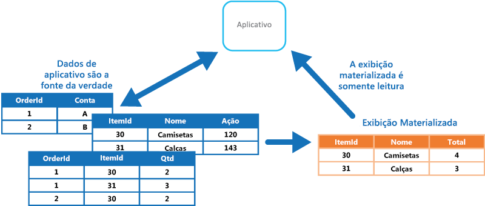

# Padrão de Exibição MaterializadaMaterialized View pattern

[!INCLUDE [header](../_includes/header.md)]

Gere exibições pré-preenchidas nos dados em um ou mais armazenamentos de dados quando os dados não estiverem formatados como o ideal para as operações de consulta necessárias.Generate prepopulated views over the data in one or more data stores when the data isn't ideally formatted for required query operations. Isso pode ajudar a dar suporte a consultas e extração de dados eficientes, além de melhorar o desempenho do aplicativo.This can help support efficient querying and data extraction, and improve application performance.

## Contexto e problemaContext and problem

Ao armazenar dados, a prioridade para desenvolvedores e administradores de dados geralmente recai sobre como os dados são armazenados, em vez de como eles são lidos.When storing data, the priority for developers and data administrators is often focused on how the data is stored, as opposed to how it's read. O formato de armazenamento escolhido geralmente está bastante relacionado ao formato dos dados, aos requisitos para gerenciar o tamanho e a integridade dos dados e ao tipo de armazenamento em uso.The chosen storage format is usually closely related to the format of the data, requirements for managing data size and data integrity, and the kind of store in use. Por exemplo, ao usar o armazenamento de documentos NoSQL, muitas vezes os dados são representados como uma série de agregações, cada uma contendo todas as informações para tal entidade.For example, when using NoSQL document store, the data is often represented as a series of aggregates, each containing all of the information for that entity.

No entanto, isso pode ter um efeito negativo sobre consultas.However, this can have a negative effect on queries. Quando uma consulta precisa de apenas um subconjunto dos dados de algumas entidades, como um resumo de pedidos para vários clientes sem todos os detalhes do pedido, ela deve extrair todos os dados das entidades relevantes para obter as informações necessárias.When a query only needs a subset of the data from some entities, such as a summary of orders for several customers without all of the order details, it must extract all of the data for the relevant entities in order to obtain the required information.

## SoluçãoSolution

Para dar suporte a consultas eficientes, uma solução comum é gerar, com antecedência, uma exibição que materialize os dados em um formato adequado para o conjunto de resultados necessários.To support efficient querying, a common solution is to generate, in advance, a view that materializes the data in a format suited to the required results set. O padrão de Exibição Materializada descreve como gerar exibições de dados pré-preenchidos em ambientes em que os dados de origem não estão em um formato adequado para a consulta, em que é difícil gerar uma consulta adequada ou em que o desempenho da consulta é ruim devido à natureza dos dados ou do armazenamento de dados.The Materialized View pattern describes generating prepopulated views of data in environments where the source data isn't in a suitable format for querying, where generating a suitable query is difficult, or where query performance is poor due to the nature of the data or the data store.

Essas exibições materializadas, as quais contêm apenas os dados necessários para uma consulta, permitem que os aplicativos obtenham rapidamente as informações de que precisam.These materialized views, which only contain data required by a query, allow applications to quickly obtain the information they need. Além da junção de tabelas ou da combinação de entidades de dados, as exibições materializadas podem incluir os valores atuais das colunas calculadas ou dos itens de dados, os resultados da combinação de valores ou da execução de transformações nos itens de dados, além de valores especificados como parte da consulta.In addition to joining tables or combining data entities, materialized views can include the current values of calculated columns or data items, the results of combining values or executing transformations on the data items, and values specified as part of the query. Uma exibição materializada ainda pode ser otimizada para apenas uma única consulta.A materialized view can even be optimized for just a single query.

Um ponto-chave é que uma exibição materializada e os dados contidos nela são completamente descartáveis, porque podem ser inteiramente recriados a partir dos armazenamentos de dados de origem.A key point is that a materialized view and the data it contains is completely disposable because it can be entirely rebuilt from the source data stores. Uma exibição materializada nunca é atualizada diretamente por um aplicativo e, por isso, é um cache especializado.A materialized view is never updated directly by an application, and so it's a specialized cache.

Quando os dados de origem da exibição forem alterados, a exibição deve ser atualizada para incluir as novas informações.When the source data for the view changes, the view must be updated to include the new information. Você pode agendar para que ela seja feita automaticamente ou quando o sistema detectar uma alteração nos dados originais.You can schedule this to happen automatically, or when the system detects a change to the original data. Em alguns casos, pode ser necessário regenerar a exibição manualmente.In some cases it might be necessary to regenerate the view manually. A figura mostra um exemplo de como o padrão de Exibição Materializada pode ser usado.The figure shows an example of how the Materialized View pattern might be used.

## Problemas e consideraçõesIssues and considerations

Considere os seguintes pontos ao decidir como implementar esse padrão:Consider the following points when deciding how to implement this pattern:

Como e quando a exibição será atualizada.How and when the view will be updated. Idealmente, ela será regenerada em resposta a um evento indicando uma alteração nos dados de origem, embora isso possa levar a uma sobrecarga excessiva se os dados de origem forem alterados rapidamente.Ideally it'll regenerate in response to an event indicating a change to the source data, although this can lead to excessive overhead if the source data changes rapidly. Como alternativa, considere o uso de uma tarefa agendada, um gatilho externo ou uma ação manual para regenerar a exibição.Alternatively, consider using a scheduled task, an external trigger, or a manual action to regenerate the view.

Em alguns sistemas, como ao usar o padrão de Fornecimento do Evento para manter um armazenamento apenas dos eventos que modificaram os dados, as exibições materializadas são necessárias.In some systems, such as when using the Event Sourcing pattern to maintain a store of only the events that modified the data, materialized views are necessary. Pré-preencher exibições por meio da examinação de todos os eventos para determinar o estado atual pode ser a única maneira de obter informações do armazenamento de eventos.Prepopulating views by examining all events to determine the current state might be the only way to obtain information from the event store. Se não estiver usando o Fornecimento do Evento, você precisa levar em consideração se uma exibição materializada é útil ou não.If you're not using Event Sourcing, you need to consider whether a materialized view is helpful or not. Exibições materializadas tendem a ser personalizadas especificamente para apenas uma consulta ou uma pequena quantidade de consultas.Materialized views tend to be specifically tailored to one, or a small number of queries. Se forem usadas várias consultas, as exibições materializadas podem resultar em requisitos inaceitáveis de capacidade e custo de armazenamento.If many queries are used, materialized views can result in unacceptable storage capacity requirements and storage cost.

Leve em consideração o impacto na consistência de dados ao gerar a exibição e ao atualizá-la se isso ocorrer como um agendamento.Consider the impact on data consistency when generating the view, and when updating the view if this occurs on a schedule. Se a fonte de dados estiver sendo alterada quando a exibição for gerada, a cópia dos dados na exibição não estará totalmente consistente com os dados originais.If the source data is changing at the point when the view is generated, the copy of the data in the view won't be fully consistent with the original data.

Leve em consideração o local no qual você vai armazenar a exibição.Consider where you'll store the view. A exibição não precisa estar localizada no mesmo armazenamento ou na mesma partição como os dados originais.The view doesn't have to be located in the same store or partition as the original data. Ela pode ser um subconjunto de algumas partições diferentes combinadas.It can be a subset from a few different partitions combined.

Uma exibição pode ser recriada caso seja perdida.A view can be rebuilt if lost. Por causa disso, se a exibição for transitória e só seja usada para melhorar o desempenho de consulta ao refletir o estado atual dos dados ou para melhorar a escalabilidade, ela pode ser armazenada em um cache ou em um local menos confiável.Because of that, if the view is transient and is only used to improve query performance by reflecting the current state of the data, or to improve scalability, it can be stored in a cache or in a less reliable location.

Ao definir uma exibição materializada, maximize seu valor adicionando itens de dados ou colunas a ela com base na computação ou transformação de itens de dados existentes, em valores passados na consulta ou em combinações desses valores, quando apropriado.When defining a materialized view, maximize its value by adding data items or columns to it based on computation or transformation of existing data items, on values passed in the query, or on combinations of these values when appropriate.

Considere indexar a exibição materializada, nos locais em que o mecanismo de armazenamento oferecer suporte para isso, para aumentar ainda mais o desempenho.Where the storage mechanism supports it, consider indexing the materialized view to further increase performance. A maioria dos bancos de dados relacionais dão suporte à indexação de exibições, assim como soluções de big data baseadas em Apache Hadoop.Most relational databases support indexing for views, as do big data solutions based on Apache Hadoop.

## Quando usar esse padrãoWhen to use this pattern

Esse padrão é útil:This pattern is useful when:
- Ao criar exibições materializadas sobre dados que sejam difíceis de serem consultados diretamente ou em locais em que as consultas devem ser muito complexas para se extraírem os dados armazenados em uma forma normalizada, estruturada ou não estruturada.Creating materialized views over data that's difficult to query directly, or where queries must be very complex to extract data that's stored in a normalized, semi-structured, or unstructured way.
- Ao criar exibições temporárias que podem melhorar drasticamente o desempenho da consulta ou que podem atuar diretamente como exibições de dados ou objetos de transferência de dados para a interface do usuário, para a geração de relatórios ou para fins de exibição.Creating temporary views that can dramatically improve query performance, or can act directly as source views or data transfer objects for the UI, for reporting, or for display.
- Ao dar suporte a cenários ocasionalmente conectados ou desconectados nos quais a conexão ao armazenamento de dados não está sempre disponível.Supporting occasionally connected or disconnected scenarios where connection to the data store isn't always available. A exibição pode ser armazenada em cache local nesse caso.The view can be cached locally in this case.
- Ao simplificar consultas e expor dados para experimentação de uma forma que não requeira conhecimento do formato dos dados de origem.Simplifying queries and exposing data for experimentation in a way that doesn't require knowledge of the source data format. Por exemplo, unindo tabelas diferentes em um ou mais bancos de dados ou em um ou mais domínios em armazenamentos do NoSQL e depois formatando os dados para se ajustarem ao seu uso eventual.For example, by joining different tables in one or more databases, or one or more domains in NoSQL stores, and then formatting the data to fit its eventual use.
- Ao fornecer acesso a subconjuntos específicos dos dados de origem que, por motivos de segurança ou privacidade, não devem ser amplamente acessíveis, abertos para modificação ou totalmente expostos a usuários.Providing access to specific subsets of the source data that, for security or privacy reasons, shouldn't be generally accessible, open to modification, or fully exposed to users.
- Ao criar ponte para diferentes armazenamentos de dados para aproveitar os recursos individuais.Bridging different data stores, to take advantage of their individual capabilities. Por exemplo, usando um armazenamento de nuvem que seja eficiente para gravação como o armazenamento de dados de referência e um banco de dados relacional que ofereça bom desempenho de leitura e consulta para manter as exibições materializadas.For example, using a cloud store that's efficient for writing as the reference data store, and a relational database that offers good query and read performance to hold the materialized views.

Esse padrão não é útil nas seguintes situações:This pattern isn't useful in the following situations:
- Os dados de origem são simples e fáceis de serem consultados.The source data is simple and easy to query.
- Os dados de origem mudam muito rapidamente ou podem ser acessados sem usar uma exibição.The source data changes very quickly, or can be accessed without using a view. Nesses casos, você deve evitar a sobrecarga de processamento da criação de exibições.In these cases, you should avoid the processing overhead of creating views.
- A consistência é uma alta prioridade.Consistency is a high priority. As exibições podem não ser sempre totalmente consistentes com os dados originais.The views might not always be fully consistent with the original data.

## ExemploExample

A figura a seguir mostra um exemplo de como usar o padrão de Exibição Materializada para gerar um resumo de vendas.The following figure shows an example of using the Materialized View pattern to generate a summary of sales. Dados nas tabelas Order, OrderItem e Customer em partições separadas em uma conta de armazenamento do Azure são combinadas para gerar uma exibição contendo o valor total de vendas para cada produto na categoria Eletrônicos, juntamente com uma contagem do número de clientes que fizeram compras de cada item.Data in the Order, OrderItem, and Customer tables in separate partitions in an Azure storage account are combined to generate a view containing the total sales value for each product in the Electronics category, along with a count of the number of customers who made purchases of each item.

Criar essa exibição materializada requer consultas complexas.Creating this materialized view requires complex queries. No entanto, ao expor o resultado da consulta como uma exibição materializada, os usuários podem facilmente obter os resultados e usá-los diretamente ou incorporá-los em outra consulta.However, by exposing the query result as a materialized view, users can easily obtain the results and use them directly or incorporate them in another query. É provável que a exibição seja usada em um sistema ou painel de geração de relatórios e pode ser atualizada de forma programada, por exemplo, semanalmente.The view is likely to be used in a reporting system or dashboard, and can be updated on a scheduled basis such as weekly.

>  Embora esse exemplo utilize o armazenamento de tabelas do Azure, muitos sistemas de gerenciamento de banco de dados relacionais também fornecem suporte nativo para exibições materializadas.Although this example utilizes Azure table storage, many relational database management systems also provide native support for materialized views.

## Diretrizes e padrões relacionadosRelated patterns and guidance

Os padrões e diretrizes a seguir também podem ser relevantes ao implementar esse padrão:The following patterns and guidance might also be relevant when implementing this pattern:
- [Primer de consistência de dados](https://msdn.microsoft.com/library/dn589800.aspx).[Data Consistency Primer](https://msdn.microsoft.com/library/dn589800.aspx). As informações de resumo em uma exibição materializada têm de ser mantidas para que reflita os valores de dados subjacentes.The summary information in a materialized view has to be maintained so that it reflects the underlying data values. Como os valores de dados são alterados, pode não ser prático atualizar os dados de resumo em tempo real e, em vez disso, você terá de adotar uma abordagem consistente em algum momento.As the data values change, it might not be practical to update the summary data in real time, and instead you'll have to adopt an eventually consistent approach. Resume os problemas em torno da manutenção de consistência de dados distribuídos e descreve os benefícios e as vantagens e desvantagens de modelos diferentes de consistência.Summarizes the issues surrounding maintaining consistency over distributed data, and describes the benefits and tradeoffs of different consistency models.
- [Padrão de comando e segregação de responsabilidade de consulta (CQRS)](cqrs.md).[Command and Query Responsibility Segregation (CQRS) pattern](cqrs.md). Use para atualizar as informações em uma exibição materializada respondendo a eventos que ocorrem quando os valores de dados subjacentes são alterados.Use to update the information in a materialized view by responding to events that occur when the underlying data values change.
- [Padrão de Fornecimento do Evento](event-sourcing.md).[Event Sourcing pattern](event-sourcing.md). Use em conjunto com o padrão de CQRS para manter as informações em uma exibição materializada.Use in conjunction with the CQRS pattern to maintain the information in a materialized view. Quando os valores de dados sobre os quais uma exibição materializada se baseia são alterados, o sistema pode gerar eventos que descrevam essas alterações e salvem-nas em um armazenamento de eventos.When the data values a materialized view is based on are changed, the system can raise events that describe these changes and save them in an event store.
- [Padrão de Tabela de Índice](index-table.md).[Index Table pattern](index-table.md). Os dados em uma exibição materializada normalmente são organizados por uma chave primária, mas talvez consultas precisem recuperar informações dessa exibição por meio da examinação de dados em outros campos.The data in a materialized view is typically organized by a primary key, but queries might need to retrieve information from this view by examining data in other fields. Use para criar índices secundários em conjuntos de dados de armazenamentos de dados que não têm suporte nativo a índices secundários.Use to create secondary indexes over data sets for data stores that don't support native secondary indexes.
