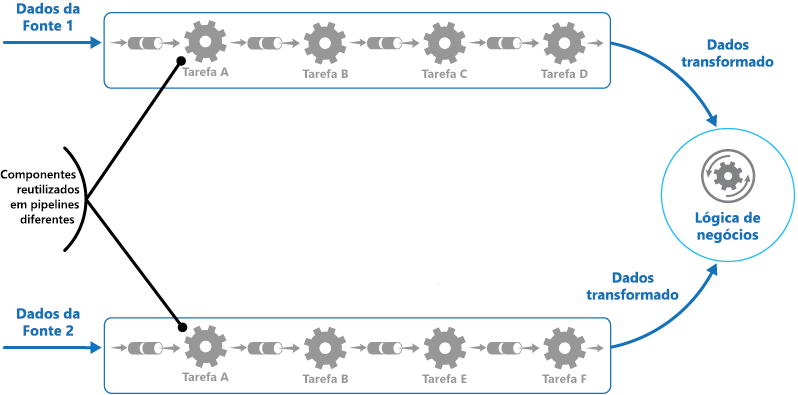
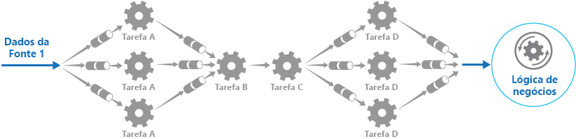

# <a name="pipes-and-filters-pattern"></a>Padrão de pipes e filtros

[!INCLUDE [header](../_includes/header.md)]

Decompor uma tarefa que executa processamento complexo em uma série de elementos separados que podem ser reutilizados. Isso pode melhorar o desempenho, escalabilidade e reutilização, permitindo que os elementos de tarefa que executam o processamento sejam implantados e escalados de forma independente.

## <a name="context-and-problem"></a>Contexto e problema

É necessário um aplicativo para executar uma variedade de tarefas de complexidade variável nas informações que são processadas. Uma abordagem simples mas inflexível para implementar um aplicativo é realizar esse processamento como um módulo monolítico. No entanto, essa abordagem provavelmente reduzirá as oportunidades para refatorar o código, otimizá-lo ou reutilizá-lo se partes do mesmo processamento forem necessárias em outros lugares no aplicativo.

A figura ilustra os problemas com os dados de processamento usando a abordagem monolítica. Um aplicativo recebe e processa dados de duas fontes. Os dados de cada fonte são processados por um módulo separado que executa uma série de tarefas para transformar esses dados, antes de passar o resultado para a lógica de negócios do aplicativos.


Algumas das tarefas que os módulos monolíticos executam são funcionalmente muito semelhantes, mas os módulos foram projetados separadamente. O código que implementa as tarefas está intimamente acoplado em um módulo e foi desenvolvido com pouco ou nenhuma atenção dada para reutilização ou escalabilidade.

No entanto, as tarefas de processamento executadas por cada módulo, ou os requisitos de implantação para cada tarefa, podem mudar conforme os requisitos de negócios são atualizados. Algumas tarefas podem ser de computação intensiva e podem se beneficiar com a execução de hardware poderoso, enquanto outras talvez não exijam recursos tão dispendiosos. Além disso, o processamento adicional pode ser exigido no futuro, ou a ordem em que as tarefas realizadas pelo processamento podem ser alteradas. É necessária uma solução que aborda esses problemas e aumenta as possibilidades de reutilização de código.

## <a name="solution"></a>Solução

Dividir o processamento necessário para cada stream em um conjunto de componentes separados (ou filtros), cada um executando uma única tarefa. Ao padronizar o formato dos dados que cada componente recebe e envia, esses filtros podem ser combinados em um pipeline. Isso ajuda a evitar a duplicação de código e facilita a remoção, substituição ou integração de componentes adicionais, se os requisitos de processamento forem alterados. A próxima figura mostra uma solução implementada usando pipes e filtros.




O tempo necessário para processar uma solicitação única depende da velocidade do filtro lento no pipeline. Um ou mais filtros podem ser um gargalo, especialmente se um grande número de solicitações aparecer em um stream de uma determinada fonte de dados. Uma vantagem chave da estrutura de pipeline é que ele oferece oportunidades para executar instâncias paralelas de filtros lentos, permitindo que o sistema espalhe a carga e melhore a taxa de transferência.

Os filtros que compõem um pipeline podem ser executados em diferentes computadores, permitindo que sejam escalados de forma independente e aproveitem a elasticidade que muitos ambientes de nuvem fornecem. Um filtro que é computacionalmente intensivo pode ser executado em hardware de alto desempenho, enquanto outros filtros menos exigentes podem ser hospedados em hardware de mercadoria menos caro. Os filtros não precisam estar no mesmo centro de dados ou localização geográfica, o que permite que cada elemento em um pipeline seja executado em um ambiente próximo dos recursos necessários.  A próxima figura mostra um exemplo aplicado ao pipeline para os dados da Fonte 1.



Se a entrada e a saída de um filtro estiverem estruturadas como um stream, será possível executar o processamento para cada filtro em paralelo. O primeiro filtro no pipeline pode iniciar seu trabalho e emitir seus resultados, que são passados diretamente para o próximo filtro na sequência antes do primeiro filtro ter concluído seu trabalho.

Outro benefício é a resiliência que esse modelo pode fornecer. Se um filtro falhar ou o comutador em que ele estiver executando não estiver mais disponível, o pipeline poderá reagendar o trabalho que o filtro estava executando e direcionar esse trabalho para outra instância do componente. A falha de um único filtro não resulta necessariamente na falha de todo o pipeline.

O uso do padrão de Pipes e Filtros em conjunto com o [padrão de Transação de Compensação](compensating-transaction.md) é uma abordagem alternativa para implementar transações distribuídas. Uma transação distribuída pode ser dividida em tarefas compensáveis e separáveis, cada uma das quais pode ser implementada utilizando um filtro que também implementa o padrão de Transação de Compensação. Os filtros em um pipeline podem ser implementados como tarefas hospedadas separadas que executam perto dos dados que eles mantêm.

## <a name="issues-and-considerations"></a>Problemas e considerações

Os seguintes pontos devem ser considerados ao decidir como implementar esse padrão:
- **Complexidade**. A flexibilidade aumentada que esse padrão fornece também pode introduzir complexidade, especialmente se os filtros em um pipeline estiverem distribuídos em diferentes servidores.

- **Confiabilidade**. Use uma infraestrutura que garanta que os dados que fluem entre filtros em um pipeline não sejam perdidos.

- **Idempotência** . Se um filtro em um pipeline falhar após receber uma mensagem e o trabalho for reagendado para outra instância do filtro, parte do trabalho talvez já tenha sido concluída. Se esse trabalho atualizar algum aspecto do estado global (como informações armazenadas em um banco de dados), a mesma atualização poderá ser repetida. Um problema semelhante pode ocorrer se um filtro falhar após a postagem dos resultados para o próximo filtro no pipeline, mas antes de indicar que seu trabalho foi concluído com êxito. Nesses casos, o mesmo trabalho pode ser repetido por outra instância do filtro, fazendo com que os mesmos resultados sejam postados duas vezes. Isso pode resultar em filtros subsequentes no pipeline que processam os mesmos dados duas vezes. Portanto, os filtros em um pipeline devem ser projetados para serem idempotentes. Para mais informações, consulte os [Padrões de Idempotência](http://blog.jonathanoliver.com/idempotency-patterns/) no blog de Jonathan Oliver.

- **Mensagens repetidas**. Se um filtro em um pipeline falhar após a postagem de uma mensagem para o próximo estágio do pipeline, outra instância do filtro poderá ser executada, e ela postará uma cópia da mesma mensagem para o pipeline. Isso pode fazer com que duas instâncias da mesma mensagem sejam passadas para o próximo filtro. Para evitar isso, o pipeline deverá detectar e eliminar mensagens duplicadas.

    >  Se você estiver implementando o pipeline utilizando filas de mensagens (como as filas do Barramento de Serviço do Microsoft Azure), a infraestrutura de enfileiramento de mensagens poderá fornecer detecção e remoção automática de mensagens duplicadas.

- **Contexto e estado**. Em um pipeline, cada filtro essencialmente é executado em isolamento e não deve fazer qualquer suposição sobre como foi invocado. Isso significa que cada filtro deve ter um contexto suficiente para realizar seu trabalho. Esse contexto poderia incluir uma grande quantidade de informações de estado.

## <a name="when-to-use-this-pattern"></a>Quando usar esse padrão

Use esse padrão quando:
- O processamento exigido por um aplicativo pode ser facilmente dividido em um conjunto de etapas independentes.

- As etapas de processamento executadas por um aplicativo têm requisitos de escalabilidade diferentes.

    >  É possível agrupar filtros que devem escalar no mesmo processo. Para obter mais informações, consulte o [padrão de Consolidação de Recursos de Computação](compute-resource-consolidation.md).

- É necessária flexibilidade para permitir a reordenação das etapas de processamento executadas por um aplicativo ou a capacidade de adicionar e remover etapas.

- O sistema pode se beneficiar de distribuir o processamento para etapas em diferentes servidores.

- É necessária uma solução confiável que minimize os efeitos da falha em uma etapa, enquanto os dados estão sendo processados.

Esse padrão pode não ser útil quando:
- As etapas de processamento executadas por um aplicativo não são independentes ou devem ser realizadas juntas como parte da mesma transação.

- A quantidade de contexto ou informações de estado exigidas por uma etapa torna esta abordagem ineficiente. Pode ser possível persistir informações de estado em um banco de dados, mas não utilize essa estratégia se a carga adicional no banco de dados causar contenção excessiva.

## <a name="example"></a>Exemplo

Você pode utilizar uma sequência de filas de mensagens para fornecer a infraestrutura necessária para implementar um pipeline. Uma fila de mensagens inicial recebe mensagens não processadas. Um componente implementado como uma tarefa de filtro escuta uma mensagem nessa fila, executa seu trabalho e, em seguida, posta a mensagem transformada para a próxima fila na sequência. Outra tarefa de filtro pode escutar mensagens nessa fila, processá-las, postar os resultados em outra fila e, assim por diante, até que os dados totalmente transformados apareçam na mensagem final na fila. A próxima figura ilustra a implementação de um pipeline utilizando filas de mensagens.


Se estiver compilando uma solução no Azure, você poderá utilizar as filas do Barramento de Serviço para fornecer um mecanismo de enfileiramento confiável e escalonável. A classe `ServiceBusPipeFilter` mostrada abaixo em C# demonstra como é possível implementar um filtro que recebe mensagens de entrada de uma fila, processa essas mensagens e posta os resultados em outra fila.

>  A classe `ServiceBusPipeFilter` está definida no projeto PipesAndFilters.Shared disponível a partir do [GitHub](https://github.com/mspnp/cloud-design-patterns/tree/master/pipes-and-filters).

```csharp
public class ServiceBusPipeFilter
{
  ...
  private readonly string inQueuePath;
  private readonly string outQueuePath;
  ...
  private QueueClient inQueue;
  private QueueClient outQueue;
  ...

  public ServiceBusPipeFilter(..., string inQueuePath, string outQueuePath = null)
  {
     ...
     this.inQueuePath = inQueuePath;
     this.outQueuePath = outQueuePath;
  }

  public void Start()
  {
    ...
    // Create the outbound filter queue if it doesn't exist.
    ...
    this.outQueue = QueueClient.CreateFromConnectionString(...);

    ...
    // Create the inbound and outbound queue clients.
    this.inQueue = QueueClient.CreateFromConnectionString(...);
  }

  public void OnPipeFilterMessageAsync(
    Func<BrokeredMessage, Task<BrokeredMessage>> asyncFilterTask, ...)
  {
    ...

    this.inQueue.OnMessageAsync(
      async (msg) =>
    {
      ...
      // Process the filter and send the output to the
      // next queue in the pipeline.
      var outMessage = await asyncFilterTask(msg);

      // Send the message from the filter processor
      // to the next queue in the pipeline.
      if (outQueue != null)
      {
        await outQueue.SendAsync(outMessage);
      }

      // Note: There's a chance that the same message could be sent twice
      // or that a message gets processed by an upstream or downstream
      // filter at the same time.
      // This would happen in a situation where processing of a message was
      // completed, it was sent to the next pipe/queue, and then failed
      // to complete when using the PeekLock method.
      // Idempotent message processing and concurrency should be considered
      // in a real-world implementation.
    },
    options);
  }

  public async Task Close(TimeSpan timespan)
  {
    // Pause the processing threads.
    this.pauseProcessingEvent.Reset();

    // There's no clean approach for waiting for the threads to complete
    // the processing. This example simply stops any new processing, waits
    // for the existing thread to complete, then closes the message pump
    // and finally returns.
    Thread.Sleep(timespan);

    this.inQueue.Close();
    ...
  }

  ...
}
```

O método `Start` na classe `ServiceBusPipeFilter` se conecta a um par de filas de entrada e saída e o método `Close` desconecta da fila de entrada. O método `OnPipeFilterMessageAsync` executa o processamento real das mensagens, o parâmetro `asyncFilterTask` para esse método especifica o processamento a ser executado. O método `OnPipeFilterMessageAsync` aguarda as mensagens de entrada na fila de entrada, executa o código especificado pelo parâmetro `asyncFilterTask` sobre cada mensagem à medida que chega e posta os resultados na fila de saída. As próprias filas são especificadas pelo construtor.

A solução de exemplo implementa filtros em um conjunto de funções de trabalho. Cada função de trabalhador pode ser escalada de forma independente, dependendo da complexidade do processamento de negócios que executa ou dos recursos necessários para o processamento. Além disso, várias instâncias de cada função de trabalho podem ser executadas em paralelo para melhorar a taxa de transferência.

O código a seguir mostra uma função de trabalho do Azure chamada `PipeFilterARoleEntry`, definida no projeto PipeFilterA na solução de exemplo.

```csharp
public class PipeFilterARoleEntry : RoleEntryPoint
{
  ...
  private ServiceBusPipeFilter pipeFilterA;

  public override bool OnStart()
  {
    ...
    this.pipeFilterA = new ServiceBusPipeFilter(
      ...,
      Constants.QueueAPath,
      Constants.QueueBPath);

    this.pipeFilterA.Start();
    ...
  }

  public override void Run()
  {
    this.pipeFilterA.OnPipeFilterMessageAsync(async (msg) =>
    {
      // Clone the message and update it.
      // Properties set by the broker (Deliver count, enqueue time, ...)
      // aren't cloned and must be copied over if required.
      var newMsg = msg.Clone();

      await Task.Delay(500); // DOING WORK

      Trace.TraceInformation("Filter A processed message:{0} at {1}",
        msg.MessageId, DateTime.UtcNow);

      newMsg.Properties.Add(Constants.FilterAMessageKey, "Complete");

      return newMsg;
    });

    ...
  }

  ...
}
```

Esta função contém um objeto `ServiceBusPipeFilter`. O método `OnStart` na função se conecta às filas para receber mensagens de entrada e postar mensagens de saída (os nomes das filas são definidos na classe `Constants`). O método `Run` invoca o método `OnPipeFilterMessagesAsync` para executar algum processamento em cada mensagem recebida (neste exemplo, o processamento é simulado esperando por um curto período de tempo). Quando o processamento está completo, uma nova mensagem é construída contendo os resultados (nesse caso, a mensagem de entrada tem uma propriedade personalizada adicionada) e essa mensagem é postada na fila de saída.

O código de exemplo contém outra função de trabalho chamada `PipeFilterBRoleEntry` no projeto PipeFilterB. Essa função é semelhante a `PipeFilterARoleEntry`, exceto que executa processamento diferente no método `Run`. Na solução de exemplo, essas duas funções são combinadas para construir um pipeline, a fila de saída para a função `PipeFilterARoleEntry` é a fila de entrada para a função `PipeFilterBRoleEntry`.

A solução de exemplo também fornece dois papéis adicionais denominados `InitialSenderRoleEntry` (no projeto InitialSender) e `FinalReceiverRoleEntry` (no projeto FinalReceiver). A função `InitialSenderRoleEntry` fornece a mensagem inicial no pipeline. O método `OnStart` se conecta a uma única fila e o método `Run` posta um método para esta fila. Essa fila é a fila de entrada utilizada pela função `PipeFilterARoleEntry`, então, para postar uma mensagem a ela faz com que a mensagem seja recebida e processada pela função `PipeFilterARoleEntry`. A mensagem processada passa então pela função `PipeFilterBRoleEntry`.

A fila de entrada para a função `FinalReceiveRoleEntry` é a fila de saída para a função `PipeFilterBRoleEntry`. O `Run` método na função `FinalReceiveRoleEntry` mostrado abaixo, recebe a mensagem e executa algum processamento final. Em seguida, ele grava os valores das propriedades personalizadas adicionadas pelos filtros no pipeline ao resultado de rastreamento.

```csharp
public class FinalReceiverRoleEntry : RoleEntryPoint
{
  ...
  // Final queue/pipe in the pipeline to process data from.
  private ServiceBusPipeFilter queueFinal;

  public override bool OnStart()
  {
    ...
    // Set up the queue.
    this.queueFinal = new ServiceBusPipeFilter(...,Constants.QueueFinalPath);
    this.queueFinal.Start();
    ...
  }

  public override void Run()
  {
    this.queueFinal.OnPipeFilterMessageAsync(
      async (msg) =>
      {
        await Task.Delay(500); // DOING WORK

        // The pipeline message was received.
        Trace.TraceInformation(
          "Pipeline Message Complete - FilterA:{0} FilterB:{1}",
          msg.Properties[Constants.FilterAMessageKey],
          msg.Properties[Constants.FilterBMessageKey]);

        return null;
      });
    ...
  }

  ...
}
```

## <a name="related-patterns-and-guidance"></a>Diretrizes e padrões relacionados

Os padrões e diretrizes a seguir também podem ser relevantes ao implementar esse padrão:
- Um exemplo que demonstra esse padrão está disponível em [GitHub](https://github.com/mspnp/cloud-design-patterns/tree/master/pipes-and-filters).
- [Padrão de consumidores concorrentes](competing-consumers.md). Um pipeline pode conter várias instâncias de um ou mais filtros. Essa abordagem é útil para executar instâncias paralelas de filtros lentos, permitindo que o sistema espalhe a carga e melhore a taxa de transferência. Cada instância de um filtro competirá por entrada com as outras instâncias, duas instâncias de um filtro não poderão processar os mesmos dados. Fornece uma explicação sobre essa abordagem.
- [Padrão de consolidação de recursos de computação](compute-resource-consolidation.md). Pode ser possível agrupar filtros que devem ser escalados em conjunto no mesmo processo. Fornece mais informações sobre os benefícios e compensações dessa estratégia.
- [Padrão de Transação de Compensação](compensating-transaction.md). Um filtro pode ser implementado como uma operação que pode ser revertida, ou que possui uma operação de compensação que restaura o estado a uma versão anterior em caso de falha. Explica como isso pode ser implementado para manter ou obter uma consistência eventual.
- [Padrões de Idempotência](http://blog.jonathanoliver.com/idempotency-patterns/) no blog de Jonathan Oliver.
