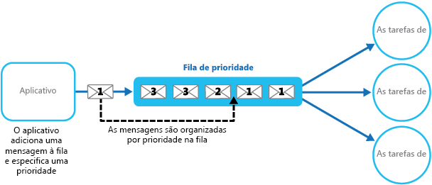

# <a name="priority-queue-pattern"></a><span data-ttu-id="9e8cc-104">Padrão de fila de prioridade</span><span class="sxs-lookup"><span data-stu-id="9e8cc-104">Priority Queue pattern</span></span>

[!INCLUDE [header](../_includes/header.md)]

<span data-ttu-id="9e8cc-105">Priorize as solicitações enviadas a serviços para que as solicitações com uma prioridade mais alta sejam recebidas e processadas mais rapidamente do que aquelas com uma prioridade mais baixa.</span><span class="sxs-lookup"><span data-stu-id="9e8cc-105">Prioritize requests sent to services so that requests with a higher priority are received and processed more quickly than those with a lower priority.</span></span> <span data-ttu-id="9e8cc-106">Esse padrão é útil em aplicativos que oferecem garantias de nível de serviço diferentes para clientes individuais.</span><span class="sxs-lookup"><span data-stu-id="9e8cc-106">This pattern is useful in applications that offer different service level guarantees to individual clients.</span></span>

## <a name="context-and-problem"></a><span data-ttu-id="9e8cc-107">Contexto e problema</span><span class="sxs-lookup"><span data-stu-id="9e8cc-107">Context and Problem</span></span>

<span data-ttu-id="9e8cc-108">Os aplicativos podem delegar tarefas específicas para outros serviços, por exemplo, para executar processamento em segundo plano ou para se integrar com outros aplicativos ou serviços.</span><span class="sxs-lookup"><span data-stu-id="9e8cc-108">Applications can delegate specific tasks to other services, for example, to perform background processing or to integrate with other applications or services.</span></span> <span data-ttu-id="9e8cc-109">Na nuvem, uma fila de mensagens é normalmente usada para delegar as tarefas para processamento em segundo plano.</span><span class="sxs-lookup"><span data-stu-id="9e8cc-109">In the cloud, a message queue is typically used to delegate tasks to background processing.</span></span> <span data-ttu-id="9e8cc-110">Em muitos casos, as solicitações do pedido são recebidas por um serviço que não é importante.</span><span class="sxs-lookup"><span data-stu-id="9e8cc-110">In many cases the order requests are received in by a service isn't important.</span></span> <span data-ttu-id="9e8cc-111">No entanto, em alguns casos, é necessário priorizar solicitações específicas.</span><span class="sxs-lookup"><span data-stu-id="9e8cc-111">In some cases, though, it's necessary to prioritize specific requests.</span></span> <span data-ttu-id="9e8cc-112">Essas solicitações devem ser processadas antes que as solicitações de prioridade mais baixa enviadas anteriormente pelo aplicativo.</span><span class="sxs-lookup"><span data-stu-id="9e8cc-112">These requests should be processed earlier than lower priority requests that were sent previously by the application.</span></span>

## <a name="solution"></a><span data-ttu-id="9e8cc-113">Solução</span><span class="sxs-lookup"><span data-stu-id="9e8cc-113">Solution</span></span>

<span data-ttu-id="9e8cc-114">Uma fila é geralmente uma estrutura PEPS (primeiro a entrar, primeiro a sair), e os consumidores normalmente recebem mensagens na mesma ordem em que elas foram postadas na fila.</span><span class="sxs-lookup"><span data-stu-id="9e8cc-114">A queue is usually a first-in, first-out (FIFO) structure, and consumers typically receive messages in the same order that they were posted to the queue.</span></span> <span data-ttu-id="9e8cc-115">No entanto, algumas filas de mensagens dão suporte a mensagens de prioridade.</span><span class="sxs-lookup"><span data-stu-id="9e8cc-115">However, some message queues support priority messaging.</span></span> <span data-ttu-id="9e8cc-116">O aplicativo que posta uma mensagem pode atribuir uma prioridade, e as mensagens na fila são reordenadas automaticamente para que aquelas com prioridade mais alta sejam recebidas antes daquelas com prioridade mais baixa.</span><span class="sxs-lookup"><span data-stu-id="9e8cc-116">The application posting a message can assign a priority and the messages in the queue are automatically reordered so that those with a higher priority will be received before those with a lower priority.</span></span> <span data-ttu-id="9e8cc-117">A figura ilustra uma fila com a prioridade das mensagens.</span><span class="sxs-lookup"><span data-stu-id="9e8cc-117">The figure illustrates a queue with priority messaging.</span></span>



> <span data-ttu-id="9e8cc-119">A maioria das implementações de fila de mensagens dá suporte a vários consumidores (seguindo o [padrão de Consumidores concorrentes](./competing-consumers.md)), e o número de processos do consumidor pode ser escalado verticalmente ou reduzido horizontalmente dependendo da demanda.</span><span class="sxs-lookup"><span data-stu-id="9e8cc-119">Most message queue implementations support multiple consumers (following the [Competing Consumers pattern](./competing-consumers.md)), and the number of consumer processes can be scaled up or down depending on demand.</span></span>

<span data-ttu-id="9e8cc-120">Em sistemas que não dão suporte a filas de mensagens baseadas em prioridade, uma solução alternativa é manter uma fila separada para cada prioridade.</span><span class="sxs-lookup"><span data-stu-id="9e8cc-120">In systems that don't support priority-based message queues, an alternative solution is to maintain a separate queue for each priority.</span></span> <span data-ttu-id="9e8cc-121">O aplicativo é responsável por postar mensagens na fila apropriada.</span><span class="sxs-lookup"><span data-stu-id="9e8cc-121">The application is responsible for posting messages to the appropriate queue.</span></span> <span data-ttu-id="9e8cc-122">Cada fila pode ter um pool separado de consumidores.</span><span class="sxs-lookup"><span data-stu-id="9e8cc-122">Each queue can have a separate pool of consumers.</span></span> <span data-ttu-id="9e8cc-123">Filas de prioridade mais alta podem ter um pool maior de consumidores em execução no hardware mais rápido que as filas de prioridade mais baixa.</span><span class="sxs-lookup"><span data-stu-id="9e8cc-123">Higher priority queues can have a larger pool of consumers running on faster hardware than lower priority queues.</span></span> <span data-ttu-id="9e8cc-124">A figura a seguir ilustra o uso de filas de mensagens separadas para cada prioridade.</span><span class="sxs-lookup"><span data-stu-id="9e8cc-124">The next figure illustrates using separate message queues for each priority.</span></span>


<span data-ttu-id="9e8cc-126">Uma variação dessa estratégia é ter um único pool de consumidores que verifica se há mensagens em filas de alta prioridade primeiro e só então começa a buscar mensagens das filas de prioridade mais baixa.</span><span class="sxs-lookup"><span data-stu-id="9e8cc-126">A variation on this strategy is to have a single pool of consumers that check for messages on high priority queues first, and only then start to fetch messages from lower priority queues.</span></span> <span data-ttu-id="9e8cc-127">Há algumas diferenças semânticas entre uma solução que usa um único pool de processos do consumidor (com uma única fila que dá suporte a mensagens com prioridades diferentes ou com várias filas que cada uma lida com mensagens de uma única prioridade) e uma solução que usa várias filas com um pool separado para cada fila.</span><span class="sxs-lookup"><span data-stu-id="9e8cc-127">There are some semantic differences between a solution that uses a single pool of consumer processes (either with a single queue that supports messages with different priorities or with multiple queues that each handle messages of a single priority), and a solution that uses multiple queues with a separate pool for each queue.</span></span>

<span data-ttu-id="9e8cc-128">Na abordagem de pool único, as mensagens de prioridade mais alta sempre são recebidas e processadas antes das mensagens de prioridade mais baixa.</span><span class="sxs-lookup"><span data-stu-id="9e8cc-128">In the single pool approach, higher priority messages are always received and processed before lower priority messages.</span></span> <span data-ttu-id="9e8cc-129">Em teoria, mensagens com uma prioridade muito baixa poderiam ser substituídas continuamente e, talvez, nunca seriam processadas.</span><span class="sxs-lookup"><span data-stu-id="9e8cc-129">In theory, messages that have a very low priority could be continually superseded and might never be processed.</span></span> <span data-ttu-id="9e8cc-130">Na abordagem de vários pools, as mensagens de prioridade mais baixa serão sempre processadas; não tão rapidamente quanto aquelas de uma prioridade mais alta (dependendo do tamanho relativo dos pools e dos recursos que elas têm disponíveis).</span><span class="sxs-lookup"><span data-stu-id="9e8cc-130">In the multiple pool approach, lower priority messages will always be processed, just not as quickly as those of a higher priority (depending on the relative size of the pools and the resources that they have available).</span></span>

<span data-ttu-id="9e8cc-131">Usar um mecanismo de enfileiramento de prioridade pode fornecer as seguintes vantagens:</span><span class="sxs-lookup"><span data-stu-id="9e8cc-131">Using a priority queuing mechanism can provide the following advantages:</span></span>

- <span data-ttu-id="9e8cc-132">Ele permite que os aplicativos atendam aos requisitos de negócios que requerem a priorização de disponibilidade ou desempenho, como oferecer níveis diferentes de serviço para grupos de clientes específicos.</span><span class="sxs-lookup"><span data-stu-id="9e8cc-132">It allows applications to meet business requirements that require prioritization of availability or performance, such as offering different levels of service to specific groups of customers.</span></span>

- <span data-ttu-id="9e8cc-133">Ele pode ajudar a minimizar os custos operacionais.</span><span class="sxs-lookup"><span data-stu-id="9e8cc-133">It can help to minimize operational costs.</span></span> <span data-ttu-id="9e8cc-134">Na abordagem de fila única, você pode reduzir o número de consumidores se necessário.</span><span class="sxs-lookup"><span data-stu-id="9e8cc-134">In the single queue approach, you can scale back the number of consumers if necessary.</span></span> <span data-ttu-id="9e8cc-135">Mensagens de alta prioridade ainda serão processadas primeiro (embora possivelmente de modo mais lento), e mensagens de prioridade mais baixa podem ser atrasadas por mais tempo.</span><span class="sxs-lookup"><span data-stu-id="9e8cc-135">High priority messages will still be processed first (although possibly more slowly), and lower priority messages might be delayed for longer.</span></span> <span data-ttu-id="9e8cc-136">Se você já implementou a abordagem de fila de mensagens com vários pools separados de consumidores para cada fila, pode reduzir o pool de consumidores de filas de prioridade mais baixa ou mesmo suspender o processamento para algumas filas de prioridade muito baixa, interrompendo todos os consumidores que escutam mensagens nessas filas.</span><span class="sxs-lookup"><span data-stu-id="9e8cc-136">If you've implemented the multiple message queue approach with separate pools of consumers for each queue, you can reduce the pool of consumers for lower priority queues, or even suspend processing for some very low priority queues by stopping all the consumers that listen for messages on those queues.</span></span>

- <span data-ttu-id="9e8cc-137">A abordagem de várias filas de mensagens pode ajudar a maximizar o desempenho e a escalabilidade do aplicativo por meio do particionamento das mensagens com base nos requisitos de processamento.</span><span class="sxs-lookup"><span data-stu-id="9e8cc-137">The multiple message queue approach can help maximize application performance and scalability by partitioning messages based on processing requirements.</span></span> <span data-ttu-id="9e8cc-138">Por exemplo, tarefas vitais podem ser priorizadas para serem manipuladas pelo receptores que executam imediatamente enquanto tarefas em segundo plano menos importantes podem ser tratadas por receptores que são agendados para executar em períodos menos ocupados.</span><span class="sxs-lookup"><span data-stu-id="9e8cc-138">For example, vital tasks can be prioritized to be handled by receivers that run immediately while less important background tasks can be handled by receivers that are scheduled to run at less busy periods.</span></span>

## <a name="issues-and-considerations"></a><span data-ttu-id="9e8cc-139">Problemas e considerações</span><span class="sxs-lookup"><span data-stu-id="9e8cc-139">Issues and Considerations</span></span>

<span data-ttu-id="9e8cc-140">Considere os seguintes pontos ao decidir como implementar esse padrão:</span><span class="sxs-lookup"><span data-stu-id="9e8cc-140">Consider the following points when deciding how to implement this pattern:</span></span>

<span data-ttu-id="9e8cc-141">Defina as prioridades no contexto da solução.</span><span class="sxs-lookup"><span data-stu-id="9e8cc-141">Define the priorities in the context of the solution.</span></span> <span data-ttu-id="9e8cc-142">Por exemplo, alta prioridade pode significar que as mensagens devem ser processadas dentro de dez segundos.</span><span class="sxs-lookup"><span data-stu-id="9e8cc-142">For example, high priority could mean that messages should be processed within ten seconds.</span></span> <span data-ttu-id="9e8cc-143">Identifique os requisitos para lidar com itens de alta prioridade e os outros recursos que devem ser alocados para atender a esses critérios.</span><span class="sxs-lookup"><span data-stu-id="9e8cc-143">Identify the requirements for handling high priority items, and the other resources that should be allocated to meet these criteria.</span></span>

<span data-ttu-id="9e8cc-144">Decida se todos os itens de alta prioridade devem ser processados antes dos itens de prioridade mais baixa.</span><span class="sxs-lookup"><span data-stu-id="9e8cc-144">Decide if all high priority items must be processed before any lower priority items.</span></span> <span data-ttu-id="9e8cc-145">Se as mensagens estão sendo processadas por um único pool de consumidores, você precisa fornecer um mecanismo que pode impedir e suspender uma tarefa que lida com uma mensagem de baixa prioridade se uma mensagem de prioridade mais alta for disponibilizada.</span><span class="sxs-lookup"><span data-stu-id="9e8cc-145">If the messages are being processed by a single pool of consumers, you have to provide a mechanism that can preempt and suspend a task that's handling a low priority message if a higher priority message becomes available.</span></span>

<span data-ttu-id="9e8cc-146">Na abordagem de várias filas, ao usar um único pool de processos do consumidor que escuta todas as filas em vez de um pool de consumidores exclusivo para cada fila, o consumidor deve aplicar um algoritmo que garante que ele sempre atenda as mensagens das filas de prioridade mais alta antes das filas de prioridade mais baixa.</span><span class="sxs-lookup"><span data-stu-id="9e8cc-146">In the multiple queue approach, when using a single pool of consumer processes that listen on all queues rather than a dedicated consumer pool for each queue, the consumer must apply an algorithm that ensures it always services messages from higher priority queues before those from lower priority queues.</span></span>

<span data-ttu-id="9e8cc-147">Monitore a velocidade do processamento nas filas de prioridade alta e baixa para garantir que as mensagens nessas filas sejam processadas a taxas esperadas.</span><span class="sxs-lookup"><span data-stu-id="9e8cc-147">Monitor the processing speed on high and low priority queues to ensure that messages in these queues are processed at the expected rates.</span></span>

<span data-ttu-id="9e8cc-148">Se você precisa garantir que as mensagens de baixa prioridade serão processadas, é necessário implementar a abordagem de várias filas de mensagens com vários pools de consumidores.</span><span class="sxs-lookup"><span data-stu-id="9e8cc-148">If you need to guarantee that low priority messages will be processed, it's necessary to implement the multiple message queue approach with multiple pools of consumers.</span></span> <span data-ttu-id="9e8cc-149">Como alternativa, em uma fila que dá suporte à priorização de mensagem, é possível aumentar dinamicamente a prioridade de uma mensagem na fila à medida que ela fica antiga.</span><span class="sxs-lookup"><span data-stu-id="9e8cc-149">Alternatively, in a queue that supports message prioritization, it's possible to dynamically increase the priority of a queued message as it ages.</span></span> <span data-ttu-id="9e8cc-150">No entanto, essa abordagem depende da fila de mensagens fornecer esse recurso.</span><span class="sxs-lookup"><span data-stu-id="9e8cc-150">However, this approach depends on the message queue providing this feature.</span></span>

<span data-ttu-id="9e8cc-151">Usar uma fila separada para cada prioridade de mensagem funciona melhor para sistemas que têm um número pequeno de prioridades bem definidas.</span><span class="sxs-lookup"><span data-stu-id="9e8cc-151">Using a separate queue for each message priority works best for systems that have a small number of well-defined priorities.</span></span>

<span data-ttu-id="9e8cc-152">As prioridades da mensagem podem ser determinadas logicamente pelo sistema.</span><span class="sxs-lookup"><span data-stu-id="9e8cc-152">Message priorities can be determined logically by the system.</span></span> <span data-ttu-id="9e8cc-153">Por exemplo, em vez de ter mensagens de prioridade alta e baixa explícitas, elas podem ser designadas como "cliente pagante" ou "cliente não pagante".</span><span class="sxs-lookup"><span data-stu-id="9e8cc-153">For example, rather than having explicit high and low priority messages, they could be designated as “fee paying customer,” or “non-fee paying customer.”</span></span> <span data-ttu-id="9e8cc-154">Dependendo de seu modelo de negócios, seu sistema pode alocar mais recursos para processamento de mensagens de clientes pagantes que dos clientes não pagantes.</span><span class="sxs-lookup"><span data-stu-id="9e8cc-154">Depending on your business model, your system can allocate more resources to processing messages from fee paying customers than non-fee paying ones.</span></span>

<span data-ttu-id="9e8cc-155">Pode haver um custo financeiro e de processamento associado à verificação de mensagens em uma fila (alguns sistemas de mensagens comerciais cobram uma pequena taxa sempre que uma mensagem é postada ou recuperada e sempre que uma fila é consultada quanto a mensagens).</span><span class="sxs-lookup"><span data-stu-id="9e8cc-155">There might be a financial and processing cost associated with checking a queue for a message (some commercial messaging systems charge a small fee each time a message is posted or retrieved, and each time a queue is queried for messages).</span></span> <span data-ttu-id="9e8cc-156">Esse custo aumenta ao verificar várias filas.</span><span class="sxs-lookup"><span data-stu-id="9e8cc-156">This cost increases when checking multiple queues.</span></span>

<span data-ttu-id="9e8cc-157">É possível ajustar dinamicamente o tamanho de um pool de consumidores com base no comprimento da fila que o pool está atendendo.</span><span class="sxs-lookup"><span data-stu-id="9e8cc-157">It's possible to dynamically adjust the size of a pool of consumers based on the length of the queue that the pool is servicing.</span></span> <span data-ttu-id="9e8cc-158">Para saber mais, confira as [Diretrizes de dimensionamento automático](https://msdn.microsoft.com/library/dn589774.aspx).</span><span class="sxs-lookup"><span data-stu-id="9e8cc-158">For more information, see the [Autoscaling Guidance](https://msdn.microsoft.com/library/dn589774.aspx).</span></span>

## <a name="when-to-use-this-pattern"></a><span data-ttu-id="9e8cc-159">Quando usar esse padrão</span><span class="sxs-lookup"><span data-stu-id="9e8cc-159">When to use this pattern</span></span>

<span data-ttu-id="9e8cc-160">Esse padrão é útil em cenários em que:</span><span class="sxs-lookup"><span data-stu-id="9e8cc-160">This pattern is useful in scenarios where:</span></span>

- <span data-ttu-id="9e8cc-161">O sistema deve lidar com várias tarefas que têm prioridades diferentes.</span><span class="sxs-lookup"><span data-stu-id="9e8cc-161">The system must handle multiple tasks that have different priorities.</span></span>

- <span data-ttu-id="9e8cc-162">Diferentes usuários ou locatários devem ser atendidos com prioridades diferentes.</span><span class="sxs-lookup"><span data-stu-id="9e8cc-162">Different users or tenants should be served with different priority.</span></span>

## <a name="example"></a><span data-ttu-id="9e8cc-163">Exemplo</span><span class="sxs-lookup"><span data-stu-id="9e8cc-163">Example</span></span>

<span data-ttu-id="9e8cc-164">O Microsoft Azure não fornece um mecanismo de enfileiramento que dê suporte nativo à priorização automática de mensagens por meio de classificação.</span><span class="sxs-lookup"><span data-stu-id="9e8cc-164">Microsoft Azure doesn't provide a queuing mechanism that natively supports automatic prioritization of messages through sorting.</span></span> <span data-ttu-id="9e8cc-165">No entanto, ele fornece tópicos e assinaturas do Barramento de Serviço do Azure que dão suporte a um mecanismo de enfileiramento que fornece filtragem de mensagens, junto com uma ampla variedade de recursos flexíveis que o tornam ideal para ser usado na maioria das implementações de fila de prioridade.</span><span class="sxs-lookup"><span data-stu-id="9e8cc-165">However, it does provide Azure Service Bus topics and subscriptions that support a queuing mechanism that provides message filtering, together with a wide range of flexible capabilities that make it ideal for use in most priority queue implementations.</span></span>

<span data-ttu-id="9e8cc-166">Uma solução do Azure pode implementar um tópico de Barramento de Serviço e um aplicativo pode postar mensagens, da mesma forma que uma fila.</span><span class="sxs-lookup"><span data-stu-id="9e8cc-166">An Azure solution can implement a Service Bus topic an application can post messages to, in the same way as a queue.</span></span> <span data-ttu-id="9e8cc-167">As mensagens podem conter metadados na forma de propriedades personalizadas definidas pelo aplicativo.</span><span class="sxs-lookup"><span data-stu-id="9e8cc-167">Messages can contain metadata in the form of application-defined custom properties.</span></span> <span data-ttu-id="9e8cc-168">As assinaturas do Barramento de Serviço podem ser associadas ao tópico, e estas assinaturas podem filtrar mensagens com base em suas propriedades.</span><span class="sxs-lookup"><span data-stu-id="9e8cc-168">Service Bus subscriptions can be associated with the topic, and these subscriptions can filter messages based on their properties.</span></span> <span data-ttu-id="9e8cc-169">Quando um aplicativo envia uma mensagem para um tópico, a mensagem é direcionada para a assinatura apropriada onde ela pode ser lida por um consumidor.</span><span class="sxs-lookup"><span data-stu-id="9e8cc-169">When an application sends a message to a topic, the message is directed to the appropriate subscription where it can be read by a consumer.</span></span> <span data-ttu-id="9e8cc-170">Os processos do consumidor podem recuperar mensagens de uma assinatura usando a mesma semântica como uma fila de mensagens (uma assinatura é uma fila lógica).</span><span class="sxs-lookup"><span data-stu-id="9e8cc-170">Consumer processes can retrieve messages from a subscription using the same semantics as a message queue (a subscription is a logical queue).</span></span> <span data-ttu-id="9e8cc-171">A figura a seguir ilustra a implementação de uma fila de prioridade com tópicos e assinaturas do Barramento de Serviço do Azure.</span><span class="sxs-lookup"><span data-stu-id="9e8cc-171">The following figure illustrates implementing a priority queue with Azure Service Bus topics and subscriptions.</span></span>


<span data-ttu-id="9e8cc-173">Na figura acima, o aplicativo cria várias mensagens e atribui uma propriedade personalizada chamada `Priority` em cada mensagem com um valor, `High` ou `Low`.</span><span class="sxs-lookup"><span data-stu-id="9e8cc-173">In the figure above, the application creates several messages and assigns a custom property called `Priority` in each message with a value, either `High` or `Low`.</span></span> <span data-ttu-id="9e8cc-174">O aplicativo posta essas mensagens em um tópico.</span><span class="sxs-lookup"><span data-stu-id="9e8cc-174">The application posts these messages to a topic.</span></span> <span data-ttu-id="9e8cc-175">O tópico tem duas assinaturas associadas que filtram mensagens examinando a propriedade `Priority`.</span><span class="sxs-lookup"><span data-stu-id="9e8cc-175">The topic has two associated subscriptions that both filter messages by examining the `Priority` property.</span></span> <span data-ttu-id="9e8cc-176">Uma assinatura aceita mensagens onde a propriedade `Priority` está definida como `High`, e o outra aceita mensagens onde a propriedade `Priority` está definida como `Low`.</span><span class="sxs-lookup"><span data-stu-id="9e8cc-176">One subscription accepts messages where the `Priority` property is set to `High`, and the other accepts messages where the `Priority` property is set to `Low`.</span></span> <span data-ttu-id="9e8cc-177">Um pool de consumidores lê as mensagens de cada assinatura.</span><span class="sxs-lookup"><span data-stu-id="9e8cc-177">A pool of consumers reads messages from each subscription.</span></span> <span data-ttu-id="9e8cc-178">A assinatura de alta prioridade tem um pool maior, e esses consumidores podem estar em execução em computadores mais potentes com mais recursos disponíveis que os consumidores no pool de baixa prioridade.</span><span class="sxs-lookup"><span data-stu-id="9e8cc-178">The high priority subscription has a larger pool, and these consumers might be running on more powerful computers with more resources available than the consumers in the low priority pool.</span></span>

<span data-ttu-id="9e8cc-179">Observe que não há nada de especial sobre a designação de mensagens de prioridade alta e baixa neste exemplo.</span><span class="sxs-lookup"><span data-stu-id="9e8cc-179">Note that there's nothing special about the designation of high and low priority messages in this example.</span></span> <span data-ttu-id="9e8cc-180">Elas são simplesmente rótulos especificados como propriedades em cada mensagem e são usadas para direcionar mensagens para uma assinatura específica.</span><span class="sxs-lookup"><span data-stu-id="9e8cc-180">They're simply labels specified as properties in each message, and are used to direct messages to a specific subscription.</span></span> <span data-ttu-id="9e8cc-181">Se forem necessárias prioridades adicionais, será relativamente fácil criar mais assinaturas e pools de processos do consumidor para lidar com essas prioridades.</span><span class="sxs-lookup"><span data-stu-id="9e8cc-181">If additional priorities are required, it's relatively easy to create further subscriptions and pools of consumer processes to handle these priorities.</span></span>

<span data-ttu-id="9e8cc-182">A solução PriorityQueue disponível em [GitHub](https://github.com/mspnp/cloud-design-patterns/tree/master/priority-queue) contém uma implementação dessa abordagem.</span><span class="sxs-lookup"><span data-stu-id="9e8cc-182">The PriorityQueue solution available on [GitHub](https://github.com/mspnp/cloud-design-patterns/tree/master/priority-queue) contains an implementation of this approach.</span></span> <span data-ttu-id="9e8cc-183">Essa solução contém dois projetos de função de trabalho chamados `PriorityQueue.High` e `PriorityQueue.Low`.</span><span class="sxs-lookup"><span data-stu-id="9e8cc-183">This solution contains two worker role projects named `PriorityQueue.High` and `PriorityQueue.Low`.</span></span> <span data-ttu-id="9e8cc-184">Essas funções de trabalho herdam a classe `PriorityWorkerRole` que contém a funcionalidade para se conectar a uma assinatura especificada no método `OnStart`.</span><span class="sxs-lookup"><span data-stu-id="9e8cc-184">These worker roles inherit from the `PriorityWorkerRole` class that contains the functionality for connecting to a specified subscription in the `OnStart` method.</span></span>

<span data-ttu-id="9e8cc-185">As funções de trabalho `PriorityQueue.High` e `PriorityQueue.Low` se conectam a assinaturas diferentes, definidas por suas definições de configuração.</span><span class="sxs-lookup"><span data-stu-id="9e8cc-185">The `PriorityQueue.High` and `PriorityQueue.Low` worker roles connect to different subscriptions, defined by their configuration settings.</span></span> <span data-ttu-id="9e8cc-186">Um administrador pode configurar diferentes números de cada função a ser executada.</span><span class="sxs-lookup"><span data-stu-id="9e8cc-186">An administrator can configure different numbers of each role to be run.</span></span> <span data-ttu-id="9e8cc-187">Normalmente haverá mais instâncias da função de trabalho `PriorityQueue.High` que da função de trabalho `PriorityQueue.Low`.</span><span class="sxs-lookup"><span data-stu-id="9e8cc-187">Typically there'll be more instances of the `PriorityQueue.High` worker role than the `PriorityQueue.Low` worker role.</span></span>

<span data-ttu-id="9e8cc-188">O método `Run` na classe `PriorityWorkerRole` organiza o método `ProcessMessage` virtual (também definido na classe `PriorityWorkerRole`) a ser executado para cada mensagem recebida na fila.</span><span class="sxs-lookup"><span data-stu-id="9e8cc-188">The `Run` method in the `PriorityWorkerRole` class arranges for the virtual `ProcessMessage` method (also defined in the `PriorityWorkerRole` class) to be run for each message received on the queue.</span></span> <span data-ttu-id="9e8cc-189">O código a seguir mostra os métodos `Run` e `ProcessMessage`.</span><span class="sxs-lookup"><span data-stu-id="9e8cc-189">The following code shows the `Run` and `ProcessMessage` methods.</span></span> <span data-ttu-id="9e8cc-190">A classe `QueueManager`, definida no projeto PriorityQueue.Shared, fornece métodos auxiliares para usar filas do Barramento de Serviço do Azure.</span><span class="sxs-lookup"><span data-stu-id="9e8cc-190">The `QueueManager` class, defined in the PriorityQueue.Shared project, provides helper methods for using Azure Service Bus queues.</span></span>

```csharp
public class PriorityWorkerRole : RoleEntryPoint
{
  private QueueManager queueManager;
  ...

  public override void Run()
  {
    // Start listening for messages on the subscription.
    var subscriptionName = CloudConfigurationManager.GetSetting("SubscriptionName");
    this.queueManager.ReceiveMessages(subscriptionName, this.ProcessMessage);
    ...;
  }
  ...

  protected virtual async Task ProcessMessage(BrokeredMessage message)
  {
    // Simulating processing.
    await Task.Delay(TimeSpan.FromSeconds(2));
  }
}
```

<span data-ttu-id="9e8cc-191">As funções de trabalho `PriorityQueue.High` e `PriorityQueue.Low` substituem a funcionalidade padrão do método `ProcessMessage`.</span><span class="sxs-lookup"><span data-stu-id="9e8cc-191">The `PriorityQueue.High` and `PriorityQueue.Low` worker roles both override the default functionality of the `ProcessMessage` method.</span></span> <span data-ttu-id="9e8cc-192">O código a seguir mostra o método `ProcessMessage` para a função de trabalho `PriorityQueue.High`.</span><span class="sxs-lookup"><span data-stu-id="9e8cc-192">The code below shows the `ProcessMessage` method for the `PriorityQueue.High` worker role.</span></span>

```csharp
protected override async Task ProcessMessage(BrokeredMessage message)
{
  // Simulate message processing for High priority messages.
  await base.ProcessMessage(message);
  Trace.TraceInformation("High priority message processed by " +
    RoleEnvironment.CurrentRoleInstance.Id + " MessageId: " + message.MessageId);
}
```

<span data-ttu-id="9e8cc-193">Quando um aplicativo posta mensagens no tópico associado às assinaturas usadas pelas funções de trabalho `PriorityQueue.High` e `PriorityQueue.Low`, ele especifica a prioridade usando a propriedade `Priority` personalizada, conforme mostrado no exemplo de código a seguir.</span><span class="sxs-lookup"><span data-stu-id="9e8cc-193">When an application posts messages to the topic associated with the subscriptions used by the `PriorityQueue.High` and `PriorityQueue.Low` worker roles, it specifies the priority by using the `Priority` custom property, as shown in the following code example.</span></span> <span data-ttu-id="9e8cc-194">Esse código (implementado na classe `WorkerRole` no projeto PriorityQueue.Sender), usa o método auxiliar `SendBatchAsync` da classe `QueueManager` para postar mensagens em um tópico em lotes.</span><span class="sxs-lookup"><span data-stu-id="9e8cc-194">This code (implemented in the `WorkerRole` class in the PriorityQueue.Sender project), uses the `SendBatchAsync` helper method of the `QueueManager` class to post messages to a topic in batches.</span></span>

```csharp
// Send a low priority batch.
var lowMessages = new List<BrokeredMessage>();

for (int i = 0; i < 10; i++)
{
  var message = new BrokeredMessage() { MessageId = Guid.NewGuid().ToString() };
  message.Properties["Priority"] = Priority.Low;
  lowMessages.Add(message);
}

this.queueManager.SendBatchAsync(lowMessages).Wait();
...

// Send a high priority batch.
var highMessages = new List<BrokeredMessage>();

for (int i = 0; i < 10; i++)
{
  var message = new BrokeredMessage() { MessageId = Guid.NewGuid().ToString() };
  message.Properties["Priority"] = Priority.High;
  highMessages.Add(message);
}

this.queueManager.SendBatchAsync(highMessages).Wait();
```

## <a name="related-patterns-and-guidance"></a><span data-ttu-id="9e8cc-195">Diretrizes e padrões relacionados</span><span class="sxs-lookup"><span data-stu-id="9e8cc-195">Related patterns and guidance</span></span>

<span data-ttu-id="9e8cc-196">Os padrões e diretrizes a seguir também podem ser relevantes ao implementar esse padrão:</span><span class="sxs-lookup"><span data-stu-id="9e8cc-196">The following patterns and guidance might also be relevant when implementing this pattern:</span></span>

- <span data-ttu-id="9e8cc-197">Um exemplo que demonstra esse padrão está disponível em [GitHub](https://github.com/mspnp/cloud-design-patterns/tree/master/priority-queue).</span><span class="sxs-lookup"><span data-stu-id="9e8cc-197">A sample that demonstrates this pattern is available on [GitHub](https://github.com/mspnp/cloud-design-patterns/tree/master/priority-queue).</span></span>

- <span data-ttu-id="9e8cc-198">[Prévia de mensagens assíncronas](https://msdn.microsoft.com/library/dn589781.aspx).</span><span class="sxs-lookup"><span data-stu-id="9e8cc-198">[Asynchronous Messaging Primer](https://msdn.microsoft.com/library/dn589781.aspx).</span></span> <span data-ttu-id="9e8cc-199">Um serviço do consumidor que processa uma solicitação talvez precise enviar uma resposta para a instância do aplicativo que postou a solicitação.</span><span class="sxs-lookup"><span data-stu-id="9e8cc-199">A consumer service that processes a request might need to send a reply to the instance of the application that posted the request.</span></span> <span data-ttu-id="9e8cc-200">Fornece informações sobre as estratégias que você pode usar para implementar mensagens de solicitação/resposta.</span><span class="sxs-lookup"><span data-stu-id="9e8cc-200">Provides information on the strategies that you can use to implement request/response messaging.</span></span>

- <span data-ttu-id="9e8cc-201">[Padrão de consumidores concorrentes](./competing-consumers.md).</span><span class="sxs-lookup"><span data-stu-id="9e8cc-201">[Competing Consumers pattern](./competing-consumers.md).</span></span> <span data-ttu-id="9e8cc-202">Para aumentar a taxa de transferência das filas, é possível ter vários consumidores que escutam na mesma fila e processar as tarefas em paralelo.</span><span class="sxs-lookup"><span data-stu-id="9e8cc-202">To increase the throughput of the queues, it’s possible to have multiple consumers that listen on the same queue, and process the tasks in parallel.</span></span> <span data-ttu-id="9e8cc-203">Esses consumidores competirão por mensagens, mas apenas um deve ser capaz de processar cada mensagem.</span><span class="sxs-lookup"><span data-stu-id="9e8cc-203">These consumers will compete for messages, but only one should be able to process each message.</span></span> <span data-ttu-id="9e8cc-204">Fornece mais informações sobre as vantagens e desvantagens de implementar essa abordagem.</span><span class="sxs-lookup"><span data-stu-id="9e8cc-204">Provides more information on the benefits and tradeoffs of implementing this approach.</span></span>

- <span data-ttu-id="9e8cc-205">[Padrão de limitação](./throttling.md).</span><span class="sxs-lookup"><span data-stu-id="9e8cc-205">[Throttling pattern](./throttling.md).</span></span> <span data-ttu-id="9e8cc-206">Você pode implementar a limitação usando filas.</span><span class="sxs-lookup"><span data-stu-id="9e8cc-206">You can implement throttling by using queues.</span></span> <span data-ttu-id="9e8cc-207">A prioridade de mensagens pode ser usada para garantir que as solicitações de aplicativos críticos ou aplicativos sendo executados por clientes de alto valor recebam prioridade sobre solicitações de aplicativos menos importantes.</span><span class="sxs-lookup"><span data-stu-id="9e8cc-207">Priority messaging can be used to ensure that requests from critical applications, or applications being run by high-value customers, are given priority over requests from less important applications.</span></span>

- <span data-ttu-id="9e8cc-208">[Diretrizes de dimensionamento automático](https://msdn.microsoft.com/library/dn589774.aspx).</span><span class="sxs-lookup"><span data-stu-id="9e8cc-208">[Autoscaling Guidance](https://msdn.microsoft.com/library/dn589774.aspx).</span></span> <span data-ttu-id="9e8cc-209">É possível dimensionar o tamanho do pool de processos do consumidor manipulando uma fila dependendo do tamanho dela.</span><span class="sxs-lookup"><span data-stu-id="9e8cc-209">It might be possible to scale the size of the pool of consumer processes handling a queue depending on the length of the queue.</span></span> <span data-ttu-id="9e8cc-210">Essa estratégia pode ajudar a melhorar o desempenho, especialmente para pools que lidam com mensagens de alta prioridade.</span><span class="sxs-lookup"><span data-stu-id="9e8cc-210">This strategy can help to improve performance, especially for pools handling high priority messages.</span></span>

- <span data-ttu-id="9e8cc-211">[Padrões de integração empresarial com o Barramento de Serviço](https://abhishekrlal.com/2013/01/11/enterprise-integration-patterns-with-service-bus-part-2/) no blog de Abhishek Lal.</span><span class="sxs-lookup"><span data-stu-id="9e8cc-211">[Enterprise Integration Patterns with Service Bus](https://abhishekrlal.com/2013/01/11/enterprise-integration-patterns-with-service-bus-part-2/) on Abhishek Lal’s blog.</span></span>
