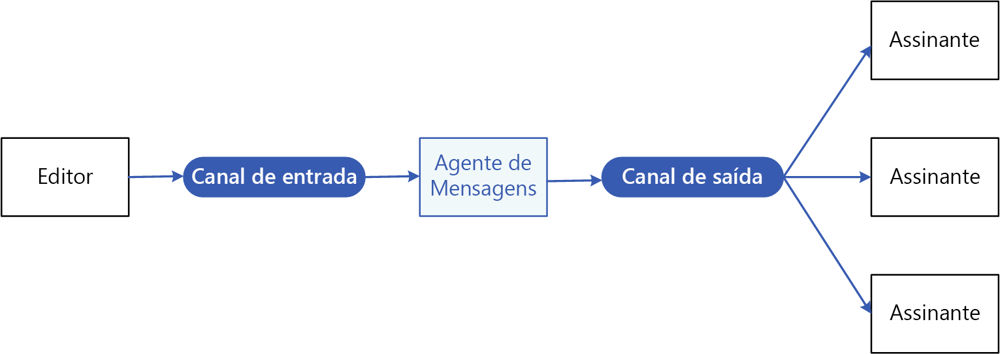

# Padrão Publisher-Subscriber

Permite a um aplicativo anunciar eventos para vários consumidores de seu interesse assincronamente, sem acoplar os remetentes aos destinatários.

**Também chamado de**: Mensagens pub/sub

## Contexto e problema

Em aplicativos distribuídos baseados em nuvem, normalmente, os componentes do sistema precisam fornecer informações a outros componentes à medida que os eventos acontecem.

Mensagens assíncronas são uma maneira eficiente de dissociar os remetentes dos consumidores e evitar o bloqueio do remetente até receber uma resposta. No entanto, usar uma fila de mensagens dedicadas para cada consumidor não é algo bom quando há vários consumidores. Além disso, talvez alguns consumidores tenham interesse em apenas um subconjunto das informações. Como o remetente pode anunciar eventos a todos os consumidores interessados sem conhecer suas identidades?

## Solução

Introduza um subsistema assíncrono de mensagens que inclua o seguinte:

- Um canal de entrada de mensagens usado pelo remetente. O remetente insere os eventos nas mensagens, usando um formato de mensagem conhecido, e envia essas mensagens por meio do canal de entrada. O remetente nesse padrão também é chamado de *publicador*.

  > [!NOTE]
  > Uma *mensagem* é um pacote de dados. Um *evento* é uma mensagem que notifica outros componentes sobre uma alteração ou uma ação que tenha ocorrido.

- Um canal de saída de mensagens por consumidor. Os consumidores são conhecidos como *assinantes*.

- Um mecanismo para copiar cada mensagem do canal de entrada para os canais de saída de todos os assinantes interessados nessa mensagem. Normalmente, essa operação é manipulada por um intermediário, como um agente de mensagem ou barramento de evento.

O diagrama a seguir mostra os componentes lógicos desse padrão:

 
A mensagem pub/sub tem os seguintes benefícios:

- Ela separa subsistemas que ainda precisam se comunicar. Os subsistemas podem ser gerenciados independentemente e as mensagens podem ser gerenciadas corretamente mesmo se um ou mais destinatários estiverem offline.

- Ela aumenta a escalabilidade e melhora a capacidade de resposta do remetente. O remetente pode enviar rapidamente uma única mensagem para o canal de entrada, e voltar às responsabilidades de processamento principais. A infraestrutura de mensagens é responsável por garantir que as mensagens sejam entregues aos assinantes interessados.

- Isso aumenta a confiabilidade. Mensagens assíncronas ajudam na execução tranquila dos aplicativos sob cargas maiores e lidam com falhas intermitentes com mais eficiência.

- Ela permite o processamento agendado ou adiado. Os assinantes podem esperar para ver as mensagens em um horário de pouco movimento, ou as mensagens podem ser roteadas ou processadas de acordo com um agendamento específico.

- Ela permite uma integração mais simples entre sistemas com plataformas diferentes, linguagens de programação ou protocolos de comunicação, bem como entre sistemas locais e aplicativos em execução na nuvem.

- Ela facilita fluxos de trabalho assíncronos em toda a empresa.

- Ela melhora a capacidade de teste. Os canais podem ser monitorados, e as mensagens inspecionadas ou registradas como parte de uma estratégia de teste geral de integração.

- Ela proporciona uma separação das preocupações com seus aplicativos. Cada aplicativo pode se concentrar em suas funcionalidades principais, enquanto a infraestrutura de mensagens lida com tudo que é necessário para rotear de forma confiável as mensagens para vários consumidores. 

## Problemas e considerações

Considere os seguintes pontos ao decidir como implementar esse padrão:

- **Tecnologias existentes.** Recomendamos usar os produtos e serviços de mensagens disponíveis que dão suporte ao modelo publish-subscribe, em vez de criar seu próprio modelo. No Azure, considere o uso do [Barramento de Serviço](/azure/service-bus-messaging/) ou da [Grade de Eventos](/azure/event-grid/). Outras tecnologias que podem ser usadas para mensagens de pub/sub incluem Apache Kafka, RabbitMQ e Redis.

- **Manipulação de assinatura.** A infraestrutura de mensagens deve fornecer mecanismos que os consumidores possam usar para assinar ou cancelar a assinatura de canais disponíveis.

- **Segurança.** A conexão com qualquer canal de mensagem deve ser restrita por uma política de segurança, para impedir a interceptação por usuários ou aplicativos não autorizados.

- **Subconjuntos de mensagens.** Geralmente, os assinantes só têm interesse em um subconjunto das mensagens distribuídas por um publicador. Frequentemente, os serviços de mensagens permitem que os assinantes restrinjam o conjunto de mensagens recebidas por:

  - **Tópicos.** Cada tópico tem um canal de saída dedicado, e cada consumidor pode assinar todos os tópicos relevantes.
  - **Filtragem de conteúdo.** As mensagens são inspecionadas e distribuídas com base no conteúdo de cada uma delas. Cada assinante pode especificar o conteúdo no qual tem interesse.

- **Assinantes curinga.** Considere a possibilidade de permitir que os assinantes se inscrevam em vários tópicos por meio de curingas.

- **Comunicação bidirecional.** Os canais em um sistema publish-subscribe são tratados como unidirecionais. Se um assinante específico precisar enviar uma confirmação ou informar o status ao publicador, considere o uso do [Padrão de solicitação/resposta](http://www.enterpriseintegrationpatterns.com/patterns/messaging/RequestReply.html). Esse padrão usa um canal para enviar uma mensagem ao assinante, e um canal de resposta separado para se comunicar com o publicador.

- **Ordenação de mensagem.** A ordem na qual as instâncias do consumidor recebem as mensagens não é garantida, e não reflete necessariamente a ordem na qual as mensagens foram criadas. Projete o sistema para garantir que o processamento de mensagens seja idempotente, para ajudar a eliminar qualquer dependência em relação à ordem de manipulação das mensagens.

- **Prioridade da mensagem.** Algumas soluções podem exigir que as mensagens sejam processadas em uma ordem específica. O [Padrão de fila de prioridade](priority-queue.md) fornece um mecanismo para garantir que mensagens específicas sejam entregues antes de outras.

- **Mensagens suspeitas.** Uma mensagem malformada ou uma tarefa que exige acesso a recursos que não estão disponíveis, pode causar uma falha em uma instância de serviço. O sistema deve impedir que essas mensagens retornem para a fila. Em vez disso, capture e armazene os detalhes dessas mensagens em outro lugar, para que elas possam ser analisadas, se for necessário.

- **Mensagens repetidas.** A mesma mensagem pode ser enviada mais de uma vez. Por exemplo, o remetente pode falhar após a postagem de uma mensagem. Em seguida, uma nova instância do remetente pode iniciar e repetir a mensagem. A infraestrutura de mensagens deve implementar a detecção e remoção de mensagens duplicadas (também conhecida como de-duping) com base nas IDs das mensagens, para realizar, no máximo uma vez, a entrega das mensagens.

- **Expiração da mensagem.** Uma mensagem pode ter um tempo de vida limitado. Se ela não for processada dentro desse tempo, talvez não seja mais relevante e deva ser descartada. Um remetente pode especificar um tempo de expiração como parte dos dados na mensagem. Um receptor pode examinar essas informações antes de decidir se deve executar a lógica de negócios associada à mensagem.

- **Agendamento de mensagem.** Uma mensagem pode ser temporariamente embargada e não deve ser processada até uma data e hora específica. A mensagem não ficará disponível para um receptor até que esse tempo passe.

## Quando usar esse padrão

Use esse padrão quando:

- Um aplicativo precisar transmitir informações para um número considerável de consumidores.

- Um aplicativo precisar se comunicar com um ou mais aplicativos ou serviços desenvolvidos de forma independente, que podem usar plataformas, linguagens de programação e protocolos de comunicação diferentes.

- Um aplicativo puder enviar informações para os consumidores sem a necessidade de respostas em tempo real.

- Os sistemas que estão sendo integrados forem projetados para dar suporte a um modelo de consistência eventual para seus dados.

- Um aplicativo precisar comunicar informações para vários consumidores, que podem ter requisitos de disponibilidade ou cronogramas de tempo de atividade diferentes do remetente.

Esse padrão pode não ser útil quando:

- Um aplicativo tiver apenas alguns consumidores que precisam de informações consideravelmente diferentes do aplicativo de produção.

- Um aplicativo exigir interação quase em tempo real com os consumidores.

## Exemplo

O diagrama a seguir mostra uma arquitetura de integração corporativa que usa o Barramento de Serviço para coordenar fluxos de trabalho, e a Grade de Eventos notifica os subsistemas sobre eventos que ocorrem. Para saber mais, confira [Integração corporativa no Azure usando filas de mensagens e eventos](../reference-architectures/enterprise-integration/queues-events.md).

## Diretrizes e padrões relacionados

Os padrões e diretrizes a seguir também podem ser relevantes ao implementar esse padrão:

- [Escolha entre os serviços do Azure que entregam mensagens](/azure/event-grid/compare-messaging-services).

- O [Estilo de arquitetura orientada a eventos](../guide/architecture-styles/event-driven.md) usa o sistema de mensagens pub/sub.

- [Prévia de mensagens assíncronas](https://msdn.microsoft.com/library/dn589781.aspx). Filas de mensagens são um mecanismo de comunicação assíncrona. Se um serviço do consumidor precisa enviar uma resposta para um aplicativo, pode ser necessário implementar alguma forma de mensagens de resposta. O Primer de mensagens assíncronas fornece informações sobre como implementar mensagens de solicitação/resposta usando filas de mensagens.

- [Padrão de observador](https://en.wikipedia.org/wiki/Observer_pattern). O padrão Publish-Subscribe se baseia no padrão de observador, separando os assuntos de observadores por meio de mensagens assíncronas.

- [Padrão de agente de mensagem](https://en.wikipedia.org/wiki/Message_broker). Muitos subsistemas de mensagens que dão suporte ao modelo publish-subscribe são implementados por meio de um agente de mensagem.
