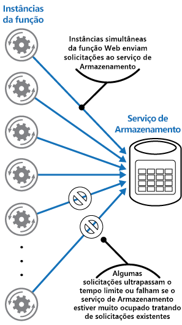
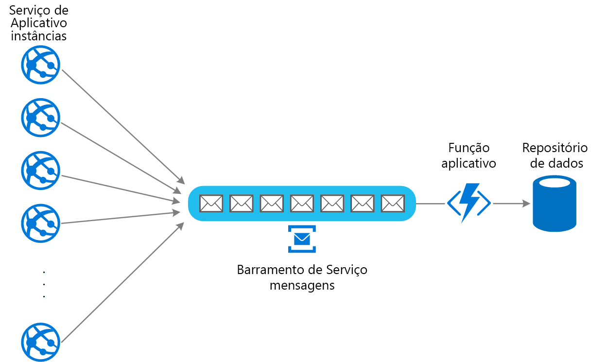

# Padrão de nivelamento de carga baseado em filaQueue-Based Load Leveling pattern

Use uma fila que funcione como um buffer entre uma tarefa e um serviço que ela invoca para simplificar sobrecargas intermitentes que podem causar falha no serviço ou a fazer a tarefa atingir o tempo limite. Isso pode ajudar a minimizar o impacto dos picos de demanda sobre a disponibilidade e a capacidade de resposta para a tarefa e o serviço.Use a queue that acts as a buffer between a task and a service it invokes in order to smooth intermittent heavy loads that can cause the service to fail or the task to time out. This can help to minimize the impact of peaks in demand on availability and responsiveness for both the task and the service.

## Contexto e problemaContext and problem

Muitas soluções na nuvem envolvem a execução de tarefas que invocam serviços.Many solutions in the cloud involve running tasks that invoke services. Nesse ambiente, se um serviço estiver sujeito a cargas pesadas intermitentes, isso poderá causar problemas de desempenho ou confiabilidade.In this environment, if a service is subjected to intermittent heavy loads, it can cause performance or reliability issues.

Um serviço pode ser parte da mesma solução que as tarefas que o utilizam ou pode ser um serviço de terceiros fornecendo acesso a recursos usados com frequência, como cache ou serviço de armazenamento.A service could be part of the same solution as the tasks that use it, or it could be a third-party service providing access to frequently used resources such as a cache or a storage service. Se o mesmo serviço for usado por várias tarefas em execução ao mesmo tempo, poderá ser difícil prever o volume de solicitações para o serviço a qualquer momento.If the same service is used by a number of tasks running concurrently, it can be difficult to predict the volume of requests to the service at any time.

Um serviço pode apresentar picos de demanda que causam a sobrecarga, não conseguindo responder às solicitações no tempo adequado.A service might experience peaks in demand that cause it to overload and be unable to respond to requests in a timely manner. Inundar um serviço com um grande número de solicitações simultâneas também pode resultar em falha do serviço se não for possível tratar a contenção que essas solicitações causam.Flooding a service with a large number of concurrent requests can also result in the service failing if it's unable to handle the contention these requests cause.

## SoluçãoSolution

Refatore a solução e introduza uma fila entre a tarefa e o serviço.Refactor the solution and introduce a queue between the task and the service. A tarefa e o serviço são executados de maneira assíncrona.The task and the service run asynchronously. A tarefa envia uma mensagem que contém os dados exigidos pelo serviço a uma fila.The task posts a message containing the data required by the service to a queue. A fila atua como um buffer, armazenando a mensagem até que ela seja recuperada pelo serviço.The queue acts as a buffer, storing the message until it's retrieved by the service. O serviço recupera as mensagens da fila e as processa.The service retrieves the messages from the queue and processes them. Solicitações de várias tarefas, que podem ser geradas a uma taxa altamente variável, podem ser passadas para o serviço pela mesma fila de mensagens.Requests from a number of tasks, which can be generated at a highly variable rate, can be passed to the service through the same message queue. Esta figura mostra o uso de uma fila para nivelar a carga em um serviço.This figure shows using a queue to level the load on a service.

A fila separa as tarefas do serviço e o serviço pode manipular as mensagens em seu próprio ritmo, independentemente do volume de solicitações de tarefas simultâneas.The queue decouples the tasks from the service, and the service can handle the messages at its own pace regardless of the volume of requests from concurrent tasks. Além disso, não haverá nenhum atraso para uma tarefa se o serviço não estiver disponível no momento em que ele envia uma mensagem à fila.Additionally, there's no delay to a task if the service isn't available at the time it posts a message to the queue.

Esse padrão proporciona os seguintes benefícios:This pattern provides the following benefits:

- Pode ajudar a maximizar a disponibilidade porque atrasos decorrentes de serviços não terão um impacto direto e imediato sobre o aplicativo, que pode continuar a postar mensagens na fila mesmo quando o serviço não está disponível ou atualmente não está processando mensagens.It can help to maximize availability because delays arising in services won't have an immediate and direct impact on the application, which can continue to post messages to the queue even when the service isn't available or isn't currently processing messages.
- Pode ajudar a maximizar a escalabilidade, pois tanto o número de filas quanto o número de serviços pode ser variado para atender à demanda.It can help to maximize scalability because both the number of queues and the number of services can be varied to meet demand.
- Pode ajudar a controlar os custos, pois o número de instâncias de serviço implantadas só precisa ser suficiente para atender a carga média, em vez da carga de pico.It can help to control costs because the number of service instances deployed only have to be adequate to meet average load rather than the peak load.

    >  Alguns serviços implementam limitação quando a demanda atinge um limite além do qual o sistema poderia falhar.Some services implement throttling when demand reaches a threshold beyond which the system could fail. A limitação pode reduzir a funcionalidade disponível.Throttling can reduce the functionality available. Você pode implementar nivelamento de carga com esses serviços para garantir que esse limite não seja atingido.You can implement load leveling with these services to ensure that this threshold isn't reached.

## Problemas e consideraçõesIssues and considerations

Considere os seguintes pontos ao decidir como implementar esse padrão:Consider the following points when deciding how to implement this pattern:

- É necessário implementar lógica de aplicativo que controle a taxa à qual os serviços processam as mensagens para evitar sobrecarregar o recurso de destino.It's necessary to implement application logic that controls the rate at which services handle messages to avoid overwhelming the target resource. Evite passar picos de demanda para o próximo estágio do sistema.Avoid passing spikes in demand to the next stage of the system. Teste o sistema sob carga para garantir que ele ofereça o nivelamento necessário e ajuste o número de filas e o número de instâncias de serviço que manipulam mensagens para conseguir isso.Test the system under load to ensure that it provides the required leveling, and adjust the number of queues and the number of service instances that handle messages to achieve this.
- Filas de mensagens são um mecanismo de comunicação unidirecional.Message queues are a one-way communication mechanism. Se uma tarefa espera uma resposta de um serviço, pode ser necessário implementar um mecanismo que o serviço pode usar para enviar uma resposta.If a task expects a reply from a service, it might be necessary to implement a mechanism that the service can use to send a response. Para obter mais informações, consulte o [Primer de mensagens assíncronas](https://msdn.microsoft.com/library/dn589781.aspx).For more information, see the [Asynchronous Messaging Primer](https://msdn.microsoft.com/library/dn589781.aspx).
- Tenha cuidado ao aplicar o dimensionamento automático a serviços que estão ouvindo solicitações na fila.Be careful if you apply autoscaling to services that are listening for requests on the queue. Isso pode resultar em maior contenção para quaisquer recursos que esses serviços compartilhem e reduzir a eficiência do uso da fila para nivelar a carga.This can result in increased contention for any resources that these services share and diminish the effectiveness of using the queue to level the load.

## Quando usar esse padrãoWhen to use this pattern

Esse padrão é útil para qualquer aplicativo que use serviços sujeitos a sobrecarga.This pattern is useful to any application that uses services that are subject to overloading.

Esse padrão não é útil se o aplicativo esperar uma resposta do serviço com latência mínima.This pattern isn't useful if the application expects a response from the service with minimal latency.

## ExemploExample

Um aplicativo Web grava dados em um repositório de dados externo.A web app writes data to an external data store. Se um grande número de instâncias do aplicativo Web for executado simultaneamente, talvez o armazenamento de dados não consiga responder às solicitações rápido o suficiente, fazendo com que o tempo das solicitações expire, seja limitado ou falhe.If a large number of instances of the web app run concurrently, the data store might be unable to respond to requests quickly enough, causing requests to time out, be throttled, or otherwise fail. O diagrama a seguir mostra um repositório de dados que está sendo sobrecarregado com um grande número de solicitações simultâneas de instâncias de um aplicativo.The following diagram shows a data store being overwhelmed by a large number of concurrent requests from instances of an application.

Para resolver isso, é possível usar uma fila para nivelar a carga entre as instâncias do aplicativo e o repositório de dados.To resolve this, you can use a queue to level the load between the application instances and the data store. Um aplicativo do Azure Functions lê as mensagens da fila e executa as solicitações de leitura/gravação para o armazenamento de dados.An Azure Functions app reads the messages from the queue and performs the read/write requests to the data store. A lógica do aplicativo no aplicativo de funções pode controlar a taxa em que ele transmite solicitações ao repositório de dados para impedir que o serviço de armazenamento seja sobrecarregado.The application logic in the function app can control the rate at which it passes requests to the data store, to prevent the store from being overwhelmed. (Caso contrário, o aplicativo de funções apenas reintroduzirá o mesmo problema no back-end.)(Otherwise the function app will just re-introduce the same problem at the back end.)

## Diretrizes e padrões relacionadosRelated patterns and guidance

Os padrões e diretrizes a seguir também podem ser relevantes ao implementar esse padrão:The following patterns and guidance might also be relevant when implementing this pattern:

- [Prévia de mensagens assíncronas](https://msdn.microsoft.com/library/dn589781.aspx).[Asynchronous Messaging Primer](https://msdn.microsoft.com/library/dn589781.aspx). Filas de mensagens são inerentemente assíncronas.Message queues are inherently asynchronous. Talvez seja necessário recriar a lógica do aplicativo em uma tarefa se ela tiver sido adaptada de se comunicar diretamente com um serviço para usar uma fila de mensagens.It might be necessary to redesign the application logic in a task if it's adapted from communicating directly with a service to using a message queue. Da mesma forma, talvez seja necessário refatorar um serviço para aceitar solicitações de uma fila de mensagens.Similarly, it might be necessary to refactor a service to accept requests from a message queue. Como alternativa, talvez seja possível implementar um serviço de proxy, conforme descrito no exemplo.Alternatively, it might be possible to implement a proxy service, as described in the example.

- [Padrão de consumidores concorrentes](./competing-consumers.md).[Competing Consumers pattern](./competing-consumers.md). Talvez seja possível executar várias instâncias de um serviço, cada uma agindo como um consumidor de mensagem da fila nivelamento de carga.It might be possible to run multiple instances of a service, each acting as a message consumer from the load-leveling queue. Você pode usar essa abordagem para ajustar a taxa à qual as mensagens são recebidas e passadas para um serviço.You can use this approach to adjust the rate at which messages are received and passed to a service.

- [Padrão de limitação](./throttling.md).[Throttling pattern](./throttling.md). Uma maneira simples de implementar a limitação com um serviço é usar o nivelamento de carga baseado em fila e encaminhar todas as solicitações para um serviço por meio de uma fila de mensagens.A simple way to implement throttling with a service is to use queue-based load leveling and route all requests to a service through a message queue. O serviço pode processar solicitações a uma taxa que garanta que os recursos exigidos pelo serviço não sejam esgotados e para reduzir a quantidade de contenção que poderia ocorrer.The service can process requests at a rate that ensures that resources required by the service aren't exhausted, and to reduce the amount of contention that could occur.

- [Escolha entre os serviços de mensagens do Azure](/azure/event-grid/compare-messaging-services).[Choose between Azure messaging services](/azure/event-grid/compare-messaging-services). Informações sobre como escolher um mecanismo de mensagens e enfileiramento em aplicativos do Azure.Information about choosing a messaging and queuing mechanism in Azure applications.

- [Melhore a escalabilidade em um aplicativo Web do Azure](../reference-architectures/app-service-web-app/scalable-web-app.md).[Improve scalability in an Azure web application](../reference-architectures/app-service-web-app/scalable-web-app.md). Essa arquitetura de referência inclui o nivelamento de carga baseado em fila como parte da arquitetura.This reference architecture includes queue-based load leveling as part of the architecture.
