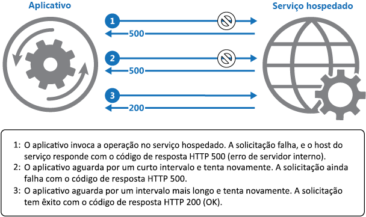

# <a name="retry-pattern"></a><span data-ttu-id="dac59-104">Padrão de repetição</span><span class="sxs-lookup"><span data-stu-id="dac59-104">Retry pattern</span></span>

[!INCLUDE [header](../_includes/header.md)]

<span data-ttu-id="dac59-105">Permita que um aplicativo trate falhas transitórias quando tentar se conectar a um serviço ou recurso de rede ao repetir de forma transparente uma operação com falha.</span><span class="sxs-lookup"><span data-stu-id="dac59-105">Enable an application to handle transient failures when it tries to connect to a service or network resource, by transparently retrying a failed operation.</span></span> <span data-ttu-id="dac59-106">Isso pode melhorar a estabilidade do aplicativo.</span><span class="sxs-lookup"><span data-stu-id="dac59-106">This can improve the stability of the application.</span></span>

## <a name="context-and-problem"></a><span data-ttu-id="dac59-107">Contexto e problema</span><span class="sxs-lookup"><span data-stu-id="dac59-107">Context and problem</span></span>

<span data-ttu-id="dac59-108">Um aplicativo que se comunica com os elementos em execução na nuvem precisa ser suscetível às falhas transitórias que podem ocorrer nesse ambiente.</span><span class="sxs-lookup"><span data-stu-id="dac59-108">An application that communicates with elements running in the cloud has to be sensitive to the transient faults that can occur in this environment.</span></span> <span data-ttu-id="dac59-109">As falhas incluem perda momentânea da conectividade de rede com os componentes e serviços, indisponibilidade temporária de um serviço ou tempos limite que surgem quando um serviço está ocupado.</span><span class="sxs-lookup"><span data-stu-id="dac59-109">Faults include the momentary loss of network connectivity to components and services, the temporary unavailability of a service, or timeouts that occur when a service is busy.</span></span>

<span data-ttu-id="dac59-110">Essas falhas geralmente são autocorretivas e, se a ação que disparou uma falha for repetida após um atraso razoável, é provável que seja bem-sucedida.</span><span class="sxs-lookup"><span data-stu-id="dac59-110">These faults are typically self-correcting, and if the action that triggered a fault is repeated after a suitable delay it's likely to be successful.</span></span> <span data-ttu-id="dac59-111">Por exemplo, um serviço de banco de dados que está processando um grande número de solicitações simultâneas pode implementar uma estratégia de limitação que rejeita temporariamente solicitações adicionais até que sua carga de trabalho diminua.</span><span class="sxs-lookup"><span data-stu-id="dac59-111">For example, a database service that's processing a large number of concurrent requests can implement a throttling strategy that temporarily rejects any further requests until its workload has eased.</span></span> <span data-ttu-id="dac59-112">Um aplicativo que tentar acessar o banco de dados pode não conseguir se conectar, mas se ele tentar novamente após um atraso, talvez tenha êxito.</span><span class="sxs-lookup"><span data-stu-id="dac59-112">An application trying to access the database might fail to connect, but if it tries again after a delay it might succeed.</span></span>

## <a name="solution"></a><span data-ttu-id="dac59-113">Solução</span><span class="sxs-lookup"><span data-stu-id="dac59-113">Solution</span></span>

<span data-ttu-id="dac59-114">Na nuvem, as falhas transitórias não são incomuns e um aplicativo deve ser criado para lidar com elas com elegância e transparência.</span><span class="sxs-lookup"><span data-stu-id="dac59-114">In the cloud, transient faults aren't uncommon and an application should be designed to handle them elegantly and transparently.</span></span> <span data-ttu-id="dac59-115">Isso minimiza os efeitos que as falhas podem ter sobre as tarefas comerciais que o aplicativo está executando.</span><span class="sxs-lookup"><span data-stu-id="dac59-115">This minimizes the effects faults can have on the business tasks the application is performing.</span></span>

<span data-ttu-id="dac59-116">Se um aplicativo detectar uma falha ao tentar enviar uma solicitação para um serviço remoto, ele poderá lidar com falhas usando as seguintes estratégias:</span><span class="sxs-lookup"><span data-stu-id="dac59-116">If an application detects a failure when it tries to send a request to a remote service, it can handle the failure using the following strategies:</span></span>

- <span data-ttu-id="dac59-117">**Cancelar**.</span><span class="sxs-lookup"><span data-stu-id="dac59-117">**Cancel**.</span></span> <span data-ttu-id="dac59-118">Se a falha indica não ser transitória ou provavelmente não será bem-sucedida se for repetida, o aplicativo deve cancelar a operação e relatar uma exceção.</span><span class="sxs-lookup"><span data-stu-id="dac59-118">If the fault indicates that the failure isn't transient or is unlikely to be successful if repeated, the application should cancel the operation and report an exception.</span></span> <span data-ttu-id="dac59-119">Por exemplo, uma falha de autenticação causada pelo fornecimento de credenciais inválidas provavelmente não será bem-sucedida, independentemente de quantas tentativas ocorram.</span><span class="sxs-lookup"><span data-stu-id="dac59-119">For example, an authentication failure caused by providing invalid credentials is not likely to succeed no matter how many times it's attempted.</span></span>

- <span data-ttu-id="dac59-120">**Tentar novamente**.</span><span class="sxs-lookup"><span data-stu-id="dac59-120">**Retry**.</span></span> <span data-ttu-id="dac59-121">Se a falha específica relatada é incomum ou rara, ela pode ter sido causada por circunstâncias incomuns, como um pacote de rede se tornar corrompido enquanto estava sendo transmitido.</span><span class="sxs-lookup"><span data-stu-id="dac59-121">If the specific fault reported is unusual or rare, it might have been caused by unusual circumstances such as a network packet becoming corrupted while it was being transmitted.</span></span> <span data-ttu-id="dac59-122">Nesse caso, o aplicativo pode repetir a solicitação com falha novamente imediatamente porque é improvável que a mesma falha se repita e a solicitação provavelmente será bem-sucedida.</span><span class="sxs-lookup"><span data-stu-id="dac59-122">In this case, the application could retry the failing request again immediately because the same failure is unlikely to be repeated and the request will probably be successful.</span></span>

- <span data-ttu-id="dac59-123">**Tentar novamente após atraso.**</span><span class="sxs-lookup"><span data-stu-id="dac59-123">**Retry after delay.**</span></span> <span data-ttu-id="dac59-124">Se a falha é causada por uma ou mais falhas comuns de conectividade ou ocupado, a rede ou o serviço podem precisar de um breve período enquanto os problemas de conectividade são corrigidos ou a lista de pendências de trabalho é limpa.</span><span class="sxs-lookup"><span data-stu-id="dac59-124">If the fault is caused by one of the more commonplace connectivity or busy failures, the network or service might need a short period while the connectivity issues are corrected or the backlog of work is cleared.</span></span> <span data-ttu-id="dac59-125">O aplicativo deve esperar por um tempo adequado antes de tentar executar novamente a solicitação.</span><span class="sxs-lookup"><span data-stu-id="dac59-125">The application should wait for a suitable time before retrying the request.</span></span>

<span data-ttu-id="dac59-126">Para falhas transitórias mais comuns, o período entre as repetições deve ser escolhido para distribuir solicitações de várias instâncias do aplicativo de maneira mais uniforme possível.</span><span class="sxs-lookup"><span data-stu-id="dac59-126">For the more common transient failures, the period between retries should be chosen to spread requests from multiple instances of the application as evenly as possible.</span></span> <span data-ttu-id="dac59-127">Isso reduz a chance de um serviço ocupado continuar a ser sobrecarregado.</span><span class="sxs-lookup"><span data-stu-id="dac59-127">This reduces the chance of a busy service continuing to be overloaded.</span></span> <span data-ttu-id="dac59-128">Se muitas instâncias de um aplicativo sobrecarregam continuamente um serviço com solicitações de novas tentativas, demorará mais para o serviço se recuperar.</span><span class="sxs-lookup"><span data-stu-id="dac59-128">If many instances of an application are continually overwhelming a service with retry requests, it'll take the service longer to recover.</span></span>

<span data-ttu-id="dac59-129">Se a solicitação ainda assim falhar, o aplicativo poderá esperar e fazer outra tentativa.</span><span class="sxs-lookup"><span data-stu-id="dac59-129">If the request still fails, the application can wait and make another attempt.</span></span> <span data-ttu-id="dac59-130">Se necessário, esse processo pode ser repetido com atrasos maiores entre as novas tentativas, até que o número máximo de solicitações ser tentado.</span><span class="sxs-lookup"><span data-stu-id="dac59-130">If necessary, this process can be repeated with increasing delays between retry attempts, until some maximum number of requests have been attempted.</span></span> <span data-ttu-id="dac59-131">O atraso pode ser aumentado de forma incremental ou exponencial, dependendo do tipo de falha e da probabilidade de que ela será corrigida durante esse tempo.</span><span class="sxs-lookup"><span data-stu-id="dac59-131">The delay can be increased incrementally or exponentially, depending on the type of failure and the probability that it'll be corrected during this time.</span></span>

<span data-ttu-id="dac59-132">O diagrama a seguir ilustra como invocar uma operação em um serviço hospedado usando esse padrão.</span><span class="sxs-lookup"><span data-stu-id="dac59-132">The following diagram illustrates invoking an operation in a hosted service using this pattern.</span></span> <span data-ttu-id="dac59-133">Se a solicitação for mal-sucedida depois de um número predefinido de tentativas, o aplicativo deverá considerar a falha como uma exceção e tratá-la adequadamente.</span><span class="sxs-lookup"><span data-stu-id="dac59-133">If the request is unsuccessful after a predefined number of attempts, the application should treat the fault as an exception and handle it accordingly.</span></span>



<span data-ttu-id="dac59-135">O aplicativo deve encapsular todas as tentativas de acessar um serviço remoto no código que implementa uma política de repetição correspondente a uma das estratégias listadas acima.</span><span class="sxs-lookup"><span data-stu-id="dac59-135">The application should wrap all attempts to access a remote service in code that implements a retry policy matching one of the strategies listed above.</span></span> <span data-ttu-id="dac59-136">As solicitações enviadas a serviços diferentes podem estar sujeitas a políticas diferentes.</span><span class="sxs-lookup"><span data-stu-id="dac59-136">Requests sent to different services can be subject to different policies.</span></span> <span data-ttu-id="dac59-137">Alguns fornecedores disponibilizam bibliotecas que implementam políticas de repetição, nas quais o aplicativo pode especificar o número máximo de repetições, o tempo entre elas e demais parâmetros.</span><span class="sxs-lookup"><span data-stu-id="dac59-137">Some vendors provide libraries that implement retry policies, where the application can specify the maximum number of retries, the time between retry attempts, and other parameters.</span></span>

<span data-ttu-id="dac59-138">Um aplicativo deve registrar em log os detalhes das falhas e as falhas de operações.</span><span class="sxs-lookup"><span data-stu-id="dac59-138">An application should log the details of faults and failing operations.</span></span> <span data-ttu-id="dac59-139">Essas informações são úteis para os operadores.</span><span class="sxs-lookup"><span data-stu-id="dac59-139">This information is useful to operators.</span></span> <span data-ttu-id="dac59-140">Se um serviço fica indisponível ou ocupado com frequência, isso normalmente ocorre porque ele esgotou seus recursos.</span><span class="sxs-lookup"><span data-stu-id="dac59-140">If a service is frequently unavailable or busy, it's often because the service has exhausted its resources.</span></span> <span data-ttu-id="dac59-141">Você pode reduzir a frequência dessas falhas expandindo o serviço.</span><span class="sxs-lookup"><span data-stu-id="dac59-141">You can reduce the frequency of these faults by scaling out the service.</span></span> <span data-ttu-id="dac59-142">Por exemplo, se um serviço de banco de dados fica continuamente sobrecarregado, pode ser benéfico particionar o banco de dados e distribuir a carga entre vários servidores.</span><span class="sxs-lookup"><span data-stu-id="dac59-142">For example, if a database service is continually overloaded, it might be beneficial to partition the database and spread the load across multiple servers.</span></span>

> <span data-ttu-id="dac59-143">O [Microsoft Entity Framework](https://docs.microsoft.com/ef/) fornece recursos para repetir operações de banco de dados.</span><span class="sxs-lookup"><span data-stu-id="dac59-143">[Microsoft Entity Framework](https://docs.microsoft.com/ef/) provides facilities for retrying database operations.</span></span> <span data-ttu-id="dac59-144">Além disso, a maioria dos serviços do Azure e SDKs do cliente incluem um mecanismo de repetição.</span><span class="sxs-lookup"><span data-stu-id="dac59-144">Also, most Azure services and client SDKs include a retry mechanism.</span></span> <span data-ttu-id="dac59-145">Para saber mais, consulte [Diretrizes de repetição para serviços específicos](https://docs.microsoft.com/azure/architecture/best-practices/retry-service-specific).</span><span class="sxs-lookup"><span data-stu-id="dac59-145">For more information, see [Retry guidance for specific services](https://docs.microsoft.com/azure/architecture/best-practices/retry-service-specific).</span></span>

## <a name="issues-and-considerations"></a><span data-ttu-id="dac59-146">Problemas e considerações</span><span class="sxs-lookup"><span data-stu-id="dac59-146">Issues and considerations</span></span>

<span data-ttu-id="dac59-147">Considere os seguintes pontos ao decidir como implementar esse padrão.</span><span class="sxs-lookup"><span data-stu-id="dac59-147">You should consider the following points when deciding how to implement this pattern.</span></span>

<span data-ttu-id="dac59-148">A política de repetição deve ser ajustada para atender aos requisitos de negócios do aplicativo e a natureza da falha.</span><span class="sxs-lookup"><span data-stu-id="dac59-148">The retry policy should be tuned to match the business requirements of the application and the nature of the failure.</span></span> <span data-ttu-id="dac59-149">Para algumas operações não críticas, é melhor falhar rapidamente do que repetir várias vezes e afetar a taxa de transferência do aplicativo.</span><span class="sxs-lookup"><span data-stu-id="dac59-149">For some noncritical operations, it's better to fail fast rather than retry several times and impact the throughput of the application.</span></span> <span data-ttu-id="dac59-150">Por exemplo, em um aplicativo Web interativo que acessa um serviço remoto, é melhor falhar após um número menor de novas tentativas com um pequeno atraso entre elas e exibir uma mensagem apropriada para o usuário (por exemplo, “tente novamente mais tarde”).</span><span class="sxs-lookup"><span data-stu-id="dac59-150">For example, in an interactive web application accessing a remote service, it's better to fail after a smaller number of retries with only a short delay between retry attempts, and display a suitable message to the user (for example, “please try again later”).</span></span> <span data-ttu-id="dac59-151">Para um aplicativo de lote, pode ser mais apropriado aumentar o número de tentativas de repetição com um atraso exponencialmente maior entre as tentativas.</span><span class="sxs-lookup"><span data-stu-id="dac59-151">For a batch application, it might be more appropriate to increase the number of retry attempts with an exponentially increasing delay between attempts.</span></span>

<span data-ttu-id="dac59-152">Uma política de repetição agressiva com atraso mínimo entre as tentativas e um grande número de repetições poderia prejudicar ainda mais um serviço ocupado executado no limite da capacidade ou próximo desse limite.</span><span class="sxs-lookup"><span data-stu-id="dac59-152">An aggressive retry policy with minimal delay between attempts, and a large number of retries, could further degrade a busy service that's running close to or at capacity.</span></span> <span data-ttu-id="dac59-153">Essa política de repetição também poderá afetar a capacidade de resposta do aplicativo se ele tentar continuamente executar uma operação com falha.</span><span class="sxs-lookup"><span data-stu-id="dac59-153">This retry policy could also affect the responsiveness of the application if it's continually trying to perform a failing operation.</span></span>

<span data-ttu-id="dac59-154">Se uma solicitação ainda falhar após um número significativo de tentativas, é melhor para o aplicativo evitar que outras solicitações sejam enviadas para o mesmo recurso e simplesmente relatar uma falha imediatamente.</span><span class="sxs-lookup"><span data-stu-id="dac59-154">If a request still fails after a significant number of retries, it's better for the application to prevent further requests going to the same resource and simply report a failure immediately.</span></span> <span data-ttu-id="dac59-155">Quando o período expirar, o aplicativo pode tentar permitir uma ou mais solicitações para ver se elas são bem-sucedidas.</span><span class="sxs-lookup"><span data-stu-id="dac59-155">When the period expires, the application can tentatively allow one or more requests through to see whether they're successful.</span></span> <span data-ttu-id="dac59-156">Para obter mais detalhes sobre essa estratégia, consulte o [Padrão de disjuntor](circuit-breaker.md).</span><span class="sxs-lookup"><span data-stu-id="dac59-156">For more details of this strategy, see the [Circuit Breaker pattern](circuit-breaker.md).</span></span>

<span data-ttu-id="dac59-157">Considere se a operação é idempotente.</span><span class="sxs-lookup"><span data-stu-id="dac59-157">Consider whether the operation is idempotent.</span></span> <span data-ttu-id="dac59-158">Nesse caso, tentar novamente é inerentemente seguro.</span><span class="sxs-lookup"><span data-stu-id="dac59-158">If so, it's inherently safe to retry.</span></span> <span data-ttu-id="dac59-159">Caso contrário, as repetições podem fazer com que a operação seja executada mais de uma vez, com efeitos colaterais imprevistos.</span><span class="sxs-lookup"><span data-stu-id="dac59-159">Otherwise, retries could cause the operation to be executed more than once, with unintended side effects.</span></span> <span data-ttu-id="dac59-160">Por exemplo, um serviço pode receber a solicitação, processá-la com êxito, mas falha ao enviar uma resposta.</span><span class="sxs-lookup"><span data-stu-id="dac59-160">For example, a service might receive the request, process the request successfully, but fail to send a response.</span></span> <span data-ttu-id="dac59-161">Nesse ponto, a lógica de repetição pode reenviar a solicitação, supondo que a primeira solicitação não foi recebida.</span><span class="sxs-lookup"><span data-stu-id="dac59-161">At that point, the retry logic might re-send the request, assuming that the first request wasn't received.</span></span>

<span data-ttu-id="dac59-162">Uma solicitação para um serviço pode falhar por várias razões e gerar exceções diferentes dependendo da natureza da falha.</span><span class="sxs-lookup"><span data-stu-id="dac59-162">A request to a service can fail for a variety of reasons raising different exceptions depending on the nature of the failure.</span></span> <span data-ttu-id="dac59-163">Algumas exceções indicam uma falha que pode ser resolvida rapidamente, enquanto outras indicam que a falha é mais duradoura.</span><span class="sxs-lookup"><span data-stu-id="dac59-163">Some exceptions indicate a failure that can be resolved quickly, while others indicate that the failure is longer lasting.</span></span> <span data-ttu-id="dac59-164">É útil para a política de repetição ajustar o tempo entre as tentativas de repetição com base no tipo de exceção.</span><span class="sxs-lookup"><span data-stu-id="dac59-164">It's useful for the retry policy to adjust the time between retry attempts based on the type of the exception.</span></span>

<span data-ttu-id="dac59-165">Considere como repetir uma operação que faz parte de uma transação afeta a consistência geral da transação.</span><span class="sxs-lookup"><span data-stu-id="dac59-165">Consider how retrying an operation that's part of a transaction will affect the overall transaction consistency.</span></span> <span data-ttu-id="dac59-166">Ajuste a política de repetição para operações transacionais a fim de maximizar a chance de sucesso e reduzir a necessidade de desfazer todas as etapas da transação.</span><span class="sxs-lookup"><span data-stu-id="dac59-166">Fine tune the retry policy for transactional operations to maximize the chance of success and reduce the need to undo all the transaction steps.</span></span>

<span data-ttu-id="dac59-167">Verifique se todo o código de repetição foi totalmente testado para uma variedade de condições de falha.</span><span class="sxs-lookup"><span data-stu-id="dac59-167">Ensure that all retry code is fully tested against a variety of failure conditions.</span></span> <span data-ttu-id="dac59-168">Verifique se ele não afeta gravemente o desempenho ou a confiabilidade do aplicativo, causando excesso de carga em serviços e recursos ou gerando condições de corrida ou gargalos.</span><span class="sxs-lookup"><span data-stu-id="dac59-168">Check that it doesn't severely impact the performance or reliability of the application, cause excessive load on services and resources, or generate race conditions or bottlenecks.</span></span>

<span data-ttu-id="dac59-169">Implemente a lógica de repetição somente onde o contexto completo de uma operação com falha for compreendido.</span><span class="sxs-lookup"><span data-stu-id="dac59-169">Implement retry logic only where the full context of a failing operation is understood.</span></span> <span data-ttu-id="dac59-170">Por exemplo, se uma tarefa que contém uma política de repetição invocar outra tarefa que também contém uma política de repetição, essa camada extra de repetições pode adicionar atrasos longos para o processamento.</span><span class="sxs-lookup"><span data-stu-id="dac59-170">For example, if a task that contains a retry policy invokes another task that also contains a retry policy, this extra layer of retries can add long delays to the processing.</span></span> <span data-ttu-id="dac59-171">Talvez seja melhor configurar a tarefa de nível inferior para falhar rapidamente e relatar o motivo da falha para a tarefa que a invocou.</span><span class="sxs-lookup"><span data-stu-id="dac59-171">It might be better to configure the lower-level task to fail fast and report the reason for the failure back to the task that invoked it.</span></span> <span data-ttu-id="dac59-172">Esta tarefa de nível mais alto pode então tratar a falha com base em sua própria política.</span><span class="sxs-lookup"><span data-stu-id="dac59-172">This higher-level task can then handle the failure based on its own policy.</span></span>

<span data-ttu-id="dac59-173">É importante registrar todas as falhas de conectividade que causam uma tentativa para que os problemas subjacentes com o aplicativo, serviços ou recursos que possam ser identificados.</span><span class="sxs-lookup"><span data-stu-id="dac59-173">It's important to log all connectivity failures that cause a retry so that underlying problems with the application, services, or resources can be identified.</span></span>

<span data-ttu-id="dac59-174">Investigue as falhas que têm mais probabilidade de ocorrer para um serviço ou um recurso para descobrir se elas provavelmente serão de longa duração ou terminal.</span><span class="sxs-lookup"><span data-stu-id="dac59-174">Investigate the faults that are most likely to occur for a service or a resource to discover if they're likely to be long lasting or terminal.</span></span> <span data-ttu-id="dac59-175">Se elas forem, é melhor tratar a falha como uma exceção.</span><span class="sxs-lookup"><span data-stu-id="dac59-175">If they are, it's better to handle the fault as an exception.</span></span> <span data-ttu-id="dac59-176">O aplicativo pode relatar ou registrar a exceção e, em seguida, tentar continuar com a invocação de um serviço alternativo (se houver) ou oferecer funcionalidade degradada.</span><span class="sxs-lookup"><span data-stu-id="dac59-176">The application can report or log the exception, and then try to continue either by invoking an alternative service (if one is available), or by offering degraded functionality.</span></span> <span data-ttu-id="dac59-177">Para obter mais informações sobre como detectar e tratar falhas de longa duração, consulte o [Padrão de disjuntor](circuit-breaker.md).</span><span class="sxs-lookup"><span data-stu-id="dac59-177">For more information on how to detect and handle long-lasting faults, see the [Circuit Breaker pattern](circuit-breaker.md).</span></span>

## <a name="when-to-use-this-pattern"></a><span data-ttu-id="dac59-178">Quando usar esse padrão</span><span class="sxs-lookup"><span data-stu-id="dac59-178">When to use this pattern</span></span>

<span data-ttu-id="dac59-179">Use esse padrão quando um aplicativo poderia apresentar falhas transitórias ao interagir com um serviço remoto ou acessar um recurso remoto.</span><span class="sxs-lookup"><span data-stu-id="dac59-179">Use this pattern when an application could experience transient faults as it interacts with a remote service or accesses a remote resource.</span></span> <span data-ttu-id="dac59-180">Espera-se que tais falhas sejam breves e repetir uma solicitação que falhou anteriormente pode ter êxito em uma tentativa subsequente.</span><span class="sxs-lookup"><span data-stu-id="dac59-180">These faults are expected to be short lived, and repeating a request that has previously failed could succeed on a subsequent attempt.</span></span>

<span data-ttu-id="dac59-181">Esse padrão pode não ser útil:</span><span class="sxs-lookup"><span data-stu-id="dac59-181">This pattern might not be useful:</span></span>

- <span data-ttu-id="dac59-182">Quando uma falha provavelmente é de longa duração, pois isso pode afetar a capacidade de resposta de um aplicativo.</span><span class="sxs-lookup"><span data-stu-id="dac59-182">When a fault is likely to be long lasting, because this can affect the responsiveness of an application.</span></span> <span data-ttu-id="dac59-183">O aplicativo pode estar desperdiçando tempo e recursos tentando repetir uma solicitação que provavelmente falhará.</span><span class="sxs-lookup"><span data-stu-id="dac59-183">The application might be wasting time and resources trying to repeat a request that's likely to fail.</span></span>
- <span data-ttu-id="dac59-184">Para tratar falhas não causadas por falhas transitórias, como exceções internas causadas por erros de lógica de negócios de um aplicativo.</span><span class="sxs-lookup"><span data-stu-id="dac59-184">For handling failures that aren't due to transient faults, such as internal exceptions caused by errors in the business logic of an application.</span></span>
- <span data-ttu-id="dac59-185">Como uma alternativa para tratar problemas de escalabilidade em um sistema.</span><span class="sxs-lookup"><span data-stu-id="dac59-185">As an alternative to addressing scalability issues in a system.</span></span> <span data-ttu-id="dac59-186">Se um aplicativo apresentar falhas frequentes de ocupado, isso geralmente é um sinal de que o serviço ou recurso que está sendo acessado deve ser escalado verticalmente.</span><span class="sxs-lookup"><span data-stu-id="dac59-186">If an application experiences frequent busy faults, it's often a sign that the service or resource being accessed should be scaled up.</span></span>

## <a name="example"></a><span data-ttu-id="dac59-187">Exemplo</span><span class="sxs-lookup"><span data-stu-id="dac59-187">Example</span></span>

<span data-ttu-id="dac59-188">Este exemplo em C# ilustra uma implementação do Padrão de repetição.</span><span class="sxs-lookup"><span data-stu-id="dac59-188">This example in C# illustrates an implementation of the Retry pattern.</span></span> <span data-ttu-id="dac59-189">O método `OperationWithBasicRetryAsync`, mostrado abaixo, invoca um serviço externo assincronamente por meio do método `TransientOperationAsync`.</span><span class="sxs-lookup"><span data-stu-id="dac59-189">The `OperationWithBasicRetryAsync` method, shown below, invokes an external service asynchronously through the `TransientOperationAsync` method.</span></span> <span data-ttu-id="dac59-190">Os detalhes do método `TransientOperationAsync` são específicos ao serviço e serão omitidos do código de exemplo.</span><span class="sxs-lookup"><span data-stu-id="dac59-190">The details of the `TransientOperationAsync` method will be specific to the service and are omitted from the sample code.</span></span>

```csharp
private int retryCount = 3;
private readonly TimeSpan delay = TimeSpan.FromSeconds(5);

public async Task OperationWithBasicRetryAsync()
{
  int currentRetry = 0;

  for (;;)
  {
    try
    {
      // Call external service.
      await TransientOperationAsync();

      // Return or break.
      break;
    }
    catch (Exception ex)
    {
      Trace.TraceError("Operation Exception");

      currentRetry++;

      // Check if the exception thrown was a transient exception
      // based on the logic in the error detection strategy.
      // Determine whether to retry the operation, as well as how
      // long to wait, based on the retry strategy.
      if (currentRetry > this.retryCount || !IsTransient(ex))
      {
        // If this isn't a transient error or we shouldn't retry, 
        // rethrow the exception.
        throw;
      }
    }

    // Wait to retry the operation.
    // Consider calculating an exponential delay here and
    // using a strategy best suited for the operation and fault.
    await Task.Delay(delay);
  }
}

// Async method that wraps a call to a remote service (details not shown).
private async Task TransientOperationAsync()
{
  ...
}
```

<span data-ttu-id="dac59-191">A instrução que chama esse método é contida em um bloco try/catch encapsulado em um loop for.</span><span class="sxs-lookup"><span data-stu-id="dac59-191">The statement that invokes this method is contained in a try/catch block wrapped in a for loop.</span></span> <span data-ttu-id="dac59-192">O loop for existirá se a chamada para o método `TransientOperationAsync` for bem-sucedida sem gerar uma exceção.</span><span class="sxs-lookup"><span data-stu-id="dac59-192">The for loop exits if the call to the `TransientOperationAsync` method succeeds without throwing an exception.</span></span> <span data-ttu-id="dac59-193">Se o método `TransientOperationAsync` falhar, o bloco catch examinará o motivo da falha.</span><span class="sxs-lookup"><span data-stu-id="dac59-193">If the `TransientOperationAsync` method fails, the catch block examines the reason for the failure.</span></span> <span data-ttu-id="dac59-194">Se for considerado um erro transitório, o código esperará por um breve período antes de tentar novamente a operação.</span><span class="sxs-lookup"><span data-stu-id="dac59-194">If it's believed to be a transient error the code waits for a short delay before retrying the operation.</span></span>

<span data-ttu-id="dac59-195">O loop for também controla o número de vezes que a operação foi tentada e, se o código falhar três vezes, a exceção será considerada mais duradoura.</span><span class="sxs-lookup"><span data-stu-id="dac59-195">The for loop also tracks the number of times that the operation has been attempted, and if the code fails three times the exception is assumed to be more long lasting.</span></span> <span data-ttu-id="dac59-196">Se a exceção não for transitória ou for duradoura, o manipulador catch gerará uma exceção.</span><span class="sxs-lookup"><span data-stu-id="dac59-196">If the exception isn't transient or it's long lasting, the catch handler throws an exception.</span></span> <span data-ttu-id="dac59-197">Essa exceção sai do loop for e deve ser capturada pelo código que invoca o método `OperationWithBasicRetryAsync`.</span><span class="sxs-lookup"><span data-stu-id="dac59-197">This exception exits the for loop and should be caught by the code that invokes the `OperationWithBasicRetryAsync` method.</span></span>

<span data-ttu-id="dac59-198">O método `IsTransient`, mostrado abaixo, verifica para um conjunto específico de exceções que são relevantes para o ambiente no qual o código é executado.</span><span class="sxs-lookup"><span data-stu-id="dac59-198">The `IsTransient` method, shown below, checks for a specific set of exceptions that are relevant to the environment the code is run in.</span></span> <span data-ttu-id="dac59-199">A definição de uma exceção transitória varia de acordo com os recursos que estão sendo acessados e o ambiente no qual operação está sendo executada.</span><span class="sxs-lookup"><span data-stu-id="dac59-199">The definition of a transient exception will vary according to the resources being accessed and the environment the operation is being performed in.</span></span>

```csharp
private bool IsTransient(Exception ex)
{
  // Determine if the exception is transient.
  // In some cases this is as simple as checking the exception type, in other
  // cases it might be necessary to inspect other properties of the exception.
  if (ex is OperationTransientException)
    return true;

  var webException = ex as WebException;
  if (webException != null)
  {
    // If the web exception contains one of the following status values
    // it might be transient.
    return new[] {WebExceptionStatus.ConnectionClosed,
                  WebExceptionStatus.Timeout,
                  WebExceptionStatus.RequestCanceled }.
            Contains(webException.Status);
  }

  // Additional exception checking logic goes here.
  return false;
}
```

## <a name="related-patterns-and-guidance"></a><span data-ttu-id="dac59-200">Diretrizes e padrões relacionados</span><span class="sxs-lookup"><span data-stu-id="dac59-200">Related patterns and guidance</span></span>

- <span data-ttu-id="dac59-201">[Padrão de disjuntor](circuit-breaker.md).</span><span class="sxs-lookup"><span data-stu-id="dac59-201">[Circuit Breaker pattern](circuit-breaker.md).</span></span> <span data-ttu-id="dac59-202">O Padrão de repetição é útil para tratar falhas transitórias.</span><span class="sxs-lookup"><span data-stu-id="dac59-202">The Retry pattern is useful for handling transient faults.</span></span> <span data-ttu-id="dac59-203">Se espera-se que uma falha seja mais duradoura, pode ser mais apropriado implementar o Padrão de disjuntor.</span><span class="sxs-lookup"><span data-stu-id="dac59-203">If a failure is expected to be more long lasting, it might be more appropriate to implement the Circuit Breaker pattern.</span></span> <span data-ttu-id="dac59-204">O Padrão de repetição também pode ser usado junto com um disjuntor para fornecer uma abordagem abrangente para tratar falhas.</span><span class="sxs-lookup"><span data-stu-id="dac59-204">The Retry pattern can also be used in conjunction with a circuit breaker to provide a comprehensive approach to handling faults.</span></span>
- [<span data-ttu-id="dac59-205">Diretrizes de repetição para serviços específicos</span><span class="sxs-lookup"><span data-stu-id="dac59-205">Retry guidance for specific services</span></span>](https://docs.microsoft.com/azure/architecture/best-practices/retry-service-specific)
- [<span data-ttu-id="dac59-206">Resiliência de Conexão</span><span class="sxs-lookup"><span data-stu-id="dac59-206">Connection Resiliency</span></span>](https://docs.microsoft.com/ef/core/miscellaneous/connection-resiliency)
