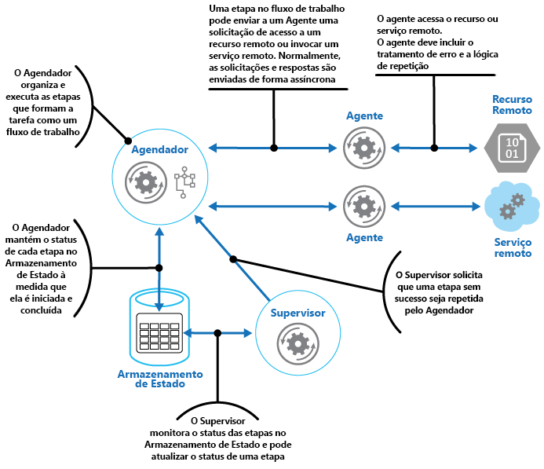
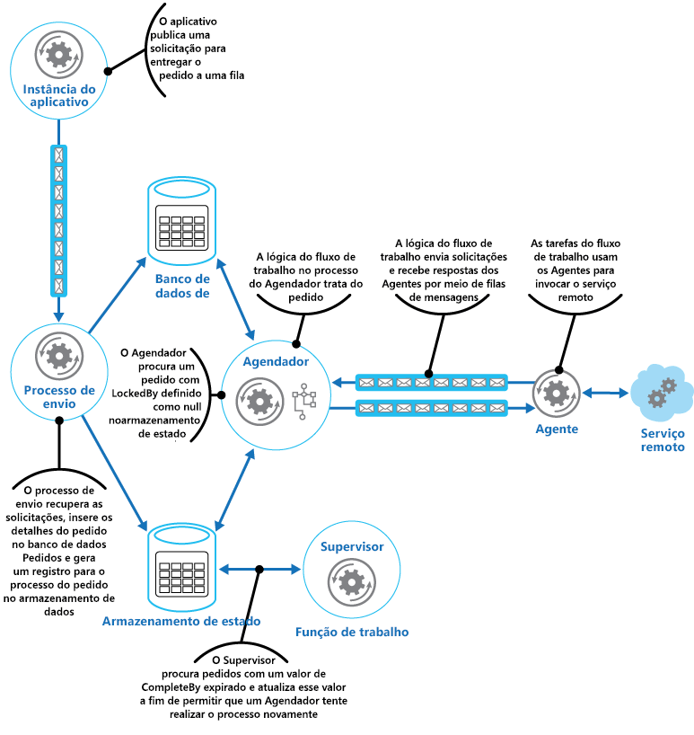

# Padrão de supervisor de agente do Agendador

[!INCLUDE [header](../_includes/header.md)]

Coordene um conjunto de ações distribuídas como uma única operação. Se qualquer uma das ações falhar, tente tratar as falhas de forma transparente ou então desfaça o trabalho que foi executado para que toda a operação tenha êxito ou falhe como um todo. Isso pode adicionar resiliência a um sistema distribuído, permitindo que se recupere e tente novamente as ações que falharem devido a exceções transitórias, falhas de longa duração e falhas do processo.

## Contexto e problema

Um aplicativo executa tarefas que incluem uma série de etapas, algumas das quais podem invocar serviços remotos ou acessar recursos remotos. As etapas individuais podem ser independentes umas das outras, mas elas são organizadas pela lógica de aplicativo que implementa a tarefa.

Sempre que possível, o aplicativo deve garantir que a tarefa seja concluída e resolver as falhas que possam ocorrer ao acessar serviços ou recursos remotos. As falhas podem ocorrer por várias razões. Por exemplo, a rede pode estar inativa, as comunicações podem ser interrompidas, um serviço remoto pode não estar respondendo ou pode estar em estado instável ou um recurso remoto pode estar temporariamente inacessível, talvez devido a restrições de recursos. Em muitos casos, as falhas serão transitórias e podem ser tratadas por meio de [padrão de repetição](./retry.md).

Se o aplicativo detectar uma falha mais permanente da qual não pode se recurar com facilidade, ele deve ser capaz de restaurar o sistema para um estado consistente e garantir a integridade de toda a operação.

## Solução

O padrão de Supervisor de Agente do Agendador define os atores a seguir. Esses atores coordenam as etapas que devem ser executadas como parte da tarefa geral.

- O **Agendador** providencia as etapas que compõem a tarefa a ser executada e coordena a operação. Essas etapas podem ser combinadas em um pipeline ou fluxo de trabalho. O Agendador é responsável por garantir que as etapas nesse fluxo de trabalho sejam executadas na ordem correta. À medida que cada etapa é executada, o Agendador registra o estado do fluxo de trabalho, como "etapa ainda não iniciada", "etapa em execução" ou "etapa concluída". As informações de estado também devem incluir um limite máximo de tempo permitido para a conclusão da etapa, chamado de tempo de conclusão. Se uma etapa requer acesso a um serviço ou recurso remoto, o Agendador invocar o agente apropriado, passando os detalhes do trabalho a ser executado. O Agendador normalmente se comunica com um Agente usando mensagens de solicitação/resposta assíncronas. Isso pode ser implementado usando filas, embora outras tecnologias de mensagens distribuídas possam ser usadas em vez disso.

    > O Agendador executa uma função semelhante para o Gerenciador de Processo no [padrão de Gerenciador de Processo](https://www.enterpriseintegrationpatterns.com/patterns/messaging/ProcessManager.html). O fluxo de trabalho real normalmente é definido e implementado por um mecanismo de fluxo de trabalho que é controlado pelo Agendador. Essa abordagem separa a lógica de negócios no fluxo de trabalho do Agendador.

- O **Agente** contém a lógica que encapsula uma chamada para um serviço remoto ou o acesso a um recurso remoto referenciado por uma etapa em uma tarefa. Cada Agente normalmente encapsula chamadas para um único serviço ou recurso, implementando a lógica de lidar com erros e tentar novamente (sujeito a uma restrição de tempo limite, descrita posteriormente). Se as etapas no fluxo de trabalho sendo executadas pelo Agendador usam vários serviços e recursos entre etapas diferentes, cada etapa pode fazer referência a um Agente diferente (esse é um detalhe de implementação do padrão).

- O **Supervisor** monitora o status das etapas da tarefa que está sendo executada pelo Agendador. Ele é executado periodicamente (a frequência será específica do sistema) e examina o status das etapas mantidas pelo Agendador. Se ele detectar algum que tenha expirado ou falhado, providenciará que o Agente apropriado recupere a etapa ou execute a ação corretiva apropriada (isso pode envolver a modificação do status de uma etapa). Observe que a recuperação ou as ações corretivas são implementadas pelo Agendador e os Agentes. O Supervisor deve simplesmente solicitar que essas ações sejam executadas.

O Agendador, o Agente e o Supervisor são componentes lógicos e sua implementação física depende da tecnologia que está sendo usada. Por exemplo, vários agentes lógicos podem ser implementados como parte de um único serviço web.

O Agendador mantém informações sobre o andamento da tarefa e o estado de cada etapa em um repositório de dados durável, chamado de repositório de estado. O Supervisor pode usar essas informações para ajudar a determinar se uma etapa falhou. A figura ilustra o relacionamento entre o Agendador, os Agentes, o Supervisor e o repositório de estado.

> [!NOTE]
> Esse diagrama mostra uma versão simplificada do padrão. Em uma implementação real, pode haver várias instâncias do Agendador em execução simultaneamente, cada uma um subconjunto da tarefas. Da mesma forma, o sistema pode executar várias instâncias de cada Agente, ou até mesmo vários Supervisores. Nesse caso, os Supervisores devem coordenar o trabalho entre si com cuidado para garantir que eles não compitam para recuperar as mesmas etapas e tarefas com falha. O [padrão de Eleição de Líder](./leader-election.md) fornece uma solução possível para esse problema.

Quando o aplicativo está pronto para executar uma tarefa, ele envia uma solicitação para o Agendador. O Agendador registra as informações de estado inicial sobre a tarefa e suas etapas (por exemplo, etapa ainda não iniciada) no repositório de estado e, em seguida, começa a executar as operações definidas pelo fluxo de trabalho. Como o Agendador inicia cada etapa, ele atualiza as informações sobre o estado da etapa no repositório de estado (por exemplo, etapa em execução).

Se uma etapa faz referência a um serviço ou recurso remoto, o Agendador envia uma mensagem para o Agente apropriado. A mensagem contém as informações que o Agente deve passar para o serviço ou acessar o recurso, além do tempo de conclusão para a operação. Se o Agente concluir com êxito sua operação, ele enviará uma resposta para o Agendador. O Agendador pode, em seguida, atualizar as informações de estado no repositório de estado (por exemplo, etapa concluída) e executar a próxima etapa. Esse processo continua até que toda a tarefa seja concluída.

Um Agente pode implementar qualquer lógica de repetição que seja necessária para realizar seu trabalho. No entanto, se o Agente não concluir seu trabalho antes de o período de conclusão expirar, o Agendador presumirá que a operação falhou. Nesse caso, o Agente deve interromper seu trabalho e não tentar retorna nada para o Agendador (nem mesmo uma mensagem de erro) ou qualquer forma de recuperação. A razão para essa restrição é que, após uma etapa expirar ou falhar, outra instância do Agente pode ser agendada para executar a etapa que falhou (esse processo é descrito posteriormente).

Se o Agente falhar, o Agendador não receberá uma resposta. O padrão não faz uma distinção entre uma etapa que atingiu o tempo limite e uma que realmente falhou.

Se uma etapa expirar ou falhar, o repositório de estado conterá um registro que indica que a etapa está em execução, mas o tempo de conclusão terá passado. O Supervisor procura as etapas assim e tenta recuperá-las. Uma estratégia possível é o Supervisor atualizar o valor de conclusão para prolongar o tempo disponível para concluir a etapa e, em seguida, enviar uma mensagem para o Agendador identificando a etapa que atingiu o tempo limite. O Agendador pode tentar repetir esta etapa. No entanto, esse design requer que as tarefas sejam idempotentes.

O Supervisor pode precisar impedir que a mesma etapa seja repetida se continuamente falhar ou expirar. Para fazer isso, o Supervisor pode manter uma contagem de repetição para cada etapa, junto com as informações de estado, no repositório de estado. Se essa contagem exceder um limite predefinido, o Supervisor pode adotar uma estratégia de espera por um longo período antes de notificar o Agendador de que ele deve tentar novamente a etapa, com a expectativa de que a falha seja resolvida durante esse período. Como alternativa, o Supervisor pode enviar uma mensagem para o Agendador para solicitar que toda a tarefa seja desfeita implementando um [padrão de Transação de Compensação](./compensating-transaction.md). Essa abordagem dependerá do Agendador e dos Agentes que fornecem as informações necessárias para implementar as operações de compensação para cada etapa concluída com êxito.

> Não é a finalidade do Supervisor monitorar o Agendador e os Agentes e reiniciá-los se eles falharem. Esse aspecto do sistema deve ser tratado pela infraestrutura na qual esses componentes estão em execução. Da mesma forma, o Supervisor não deve ter conhecimento das operações de negócios que as tarefas executadas pelo Agendador estão executando (incluindo como compensar caso essas tarefas falhem). Essa é a finalidade da lógica de fluxo de trabalho implementada pelo Agendador. É de responsabilidade exclusiva do Supervisor determinar se uma etapa falhou e providenciar para que ela seja repetida ou para a tarefa inteira contendo a etapa que falhou seja desfeita.

Se o Agendador for reiniciado após uma falha ou o fluxo de trabalho sendo executado pelo Agendador terminar inesperadamente, o Agendador deverá ser capaz de determinar o status de qualquer tarefa em andamento que estava tratando quando falhou e estar preparado para continuar esta tarefa a partir desse ponto. Os detalhes de implementação desse processo são provavelmente específicas do sistema. Se a tarefa não puder ser recuperada, pode ser necessário desfazer o trabalho já foi executado pela tarefa. Isso também pode exigir a implementação de uma [transação de compensação](./compensating-transaction.md).

A principal vantagem desse padrão é que o sistema é resiliente em caso de falhas inesperadas temporárias ou irrecuperáveis. O sistema pode ser construído para se autorrecuperar. Por exemplo, se um Agente ou o Agendador falhar, um novo pode ser iniciado e o Supervisor pode providenciar para que uma tarefa seja retomada. Se o Supervisor falhar, outra instância pode ser iniciada e pode assumir a partir onde a falha ocorreu. Se o Supervisor for agendado para ser executado periodicamente, uma nova instância poderá ser iniciada automaticamente após um intervalo predefinido. O repositório de estado pode ser replicado para chegar a um nível ainda maior de resiliência.

## Problemas e considerações

Os seguintes pontos devem ser considerados ao decidir como implementar esse padrão:

- Esse padrão pode ser difícil de implementar e requer um teste completo de cada modo de falha possíveis do sistema.

- A lógica de repetição/recuperação implementada pelo Agendador é complexa e dependente de informações de estado mantidas no repositório de estado. Também pode ser necessário registrar as informações necessárias para implementar uma transação de compensação em um repositório de dados durável.

- A frequência de execuções do Supervisor será importante. Ele deve ser executado com frequência suficiente para impedir que uma tarefa com falha aplicativ bloqueie um aplicativo por um longo período de tempo, mas não deve ser executado com uma frequência que crie uma sobrecarga.

- As etapas executadas por um Agente podem ser executadas mais de uma vez. A lógica que implementa essas etapas deve ser idempotente.

## Quando usar esse padrão

Use esse padrão quando um processo que é executado em um ambiente distribuído, como a nuvem, precisar ser resiliente a falhas de comunicação e/ou falha operacional.

Esse padrão pode não ser adequado para tarefas que não invoquem serviços remotos ou acessem recursos remotos.

## Exemplo

Um aplicativo web que implementa um sistema de comércio eletrônico foi implantado no Microsoft Azure. Os usuários podem executar esse aplicativo para procurar os produtos disponíveis e fazer pedidos. A interface do usuário é executada como função web e os elementos de processamento de pedido do aplicativo são implementados como conjunto de funções de trabalho. Parte da lógica de processamento de pedidos envolve acessar um serviço remoto e esse aspecto do sistema pode estar sujeito a falhas transitórias ou de longa duração. Por esse motivo, os designers usaram o padrão de Supervisor de Agente do Agendador para implementar os elementos de processamento de pedidos do sistema.

Quando um cliente faz um pedido, o aplicativo constrói uma mensagem que descreve o pedido e envia essa mensagem para uma fila. Um processo de envio separado, em execução em uma função de trabalho, recupera a mensagem, insere os detalhes do pedido no banco de dados de pedidos e cria um registro para o processo de pedido no repositório de estado. Observe que as inserções no banco de dados de pedidos e o repositório de estado são executados como parte da mesma operação. O processo de envio foi desenvolvido para garantir que ambas as inserções completem-se juntas.

As informações de estado que o processo de envio cria para o pedido incluem:

- **OrderID**. A ID do pedido no banco de dados de pedidos.

- **LockedBy**. A ID da instância da função de trabalho tratando o pedido. Pode haver várias instâncias atuais da função de trabalho em execução no Agendador, mas cada pedido só deve ser tratado por uma única instância.

- **CompleteBy**. O prazo máximo de processamento do pedido.

- **ProcessState**. O estado atual da tarefa tratando o pedido. Os possíveis estados são:

  - **Pendente**. O pedido foi criado, mas o processamento ainda não foi iniciado.
  - **Processando**. O pedido está sendo processado no momento.
  - **Processado**. O pedido foi processado com êxito.
  - **Erro**. O processamento de pedido falhou.

- **FailureCount**. O número de tentativas de processamento do pedido.

Nessa informação de estado, o campo `OrderID` é copiado da ID do novo pedido. Os campos `LockedBy` e `CompleteBy` são definidos como `null`, o campo `ProcessState` é definido como `Pending` e o campo `FailureCount` é definido como 0.

> [!NOTE]
> Nesse exemplo, a lógica de tratamento de pedido é relativamente simples e tem apenas uma única etapa que invoca um serviço remoto. Em um cenário mais complexo de várias etapas, o processo de envio provavelmente envolveria várias etapas e, portanto, vários registros seriam criados no repositório de estado, cada um deles descrevendo o estado de uma etapa individual.

O Agendador também é executado como parte de uma função de trabalho e implementa a lógica de negócios que controla o pedido. Uma instância do Agendador sonda novos pedidos examina o repositório de estado quanto a registros em que o campo `LockedBy` é nulo e o campo `ProcessState` está pendente. Quando o Agendador encontra um novo pedido, ele preenche imediatamente o campo `LockedBy` com sua própria ID de instância, define o campo `CompleteBy` para um horário apropriado e define o campo `ProcessState` para processamento. O código é projetado para ser exclusivo e atômico para garantir que duas instâncias simultâneas do Agendador não possam tentar tratar o mesmo pedido simultaneamente.

O Agendador, em seguida, executa o fluxo de trabalho de negócios para processar o pedido de forma assíncrona, passando o valor do campo `OrderID` do repositório de estado. O fluxo de trabalho tratando o pedido recupera os detalhes do pedido do banco de dados de pedidos e executa seu trabalho. Quando uma etapa do fluxo de trabalho de processamento de pedido precisa invocar o serviço remoto, ele usa um Agente. A etapa de fluxo de trabalho se comunica com o Agente usando um par de filas de mensagens do Barramento de Serviço do Microsoft Azure agindo como canal de solicitação/resposta. A figura mostra uma exibição de alto nível da solução.

A mensagem enviada para o Agente de uma etapa do fluxo de trabalho descreve o pedido e inclui o tempo de conclusão. Se o Agente recebe uma resposta do serviço remoto antes de expirar o tempo de conclusão, ele envia uma mensagem de resposta na fila do Barramento de Serviço na qual o fluxo de trabalho está escutando. Quando a etapa do fluxo de trabalho recebe a mensagem de resposta válida, ela conclui o processamento e o Agendador define o campo ProcessState do estado do pedido a ser processado. Nesse momento, o processamento do pedido estará concluído com sucesso.

Se o tempo de conclusão expirar antes que o Agente receba uma resposta do serviço remoto, o Agente simplesmente interromperá o processamento e terminará de tratar o pedido. Da mesma forma, se o fluxo de trabalho tratando o pedido exceder o tempo de conclusão, ele também será encerrado. Em ambos os casos, o estado do pedido no repositório de estado permanece configurado para processar, mas o tempo de conclusão indica que o tempo para processar o pedido foi excedido e o processo é considerado com falha. Observe que se o Agente que está acessando o serviço remoto ou se o fluxo de trabalho que está tratando o pedido (ou ambos) for encerrado inesperadamente, as informações no repositório de estado novamente permanecerão configuradas para processar e, por fim, terão um valor de conclusão expirado.

Se o Agente detectar uma falha irrecuperável e não transitória enquanto está tentando entrar em contato com o serviço remoto, ele poderá enviar uma resposta de erro de volta para o fluxo de trabalho. O Agendador pode definir o status do pedido como erro e acionar um evento que alerta o operador. O operador pode, então, tentar resolver manualmente o motivo da falha e reenviar a etapa de processamento com falha.

O Supervisor periodicamente examina o repositório de estado procurando pedidos com valor de conclusão expirado. Se o Supervisor localizar um registro, o campo `FailureCount` será incrementado. Se o valor de contagem de falha estiver abaixo de um valor de limite especificado, o Supervisor redefinirá o campo `LockedBy` para nulo, atualizará o campo `CompleteBy` com um novo tempo de expiração e definirá o campo `ProcessState` como pendente. Uma instância do Agendador pode pegar esse pedido e executar o processamento como antes. Se o valor de contagem de falhas exceder um limite especificado, o motivo da falha será considerado não transitório. O Supervisor define o status do pedido como erro e aciona um evento que alerta o operador.

> Neste exemplo, o Supervisor é implementado em uma função de trabalho separada. Você pode usar uma variedade de estratégias para fazer com que a tarefa do Supervisor seja executado, inclusive usando o serviço do Agendador do Azure (não deve ser confundido com o componente do Agendador neste padrão). Para obter mais informações sobre o serviço de Agendador do Azure, acesse a página do [Agendador](https://azure.microsoft.com/services/scheduler/).

Embora não mostrado neste exemplo, o Agendador talvez precise manter o aplicativo que enviou o pedido informado sobre o andamento e o status do pedido. O aplicativo e o Agendador são isolados um do outro para eliminar todas as dependências entre eles. O aplicativo não sabe qual instância do Agendador está tratando o pedido e o Agendador não fica ciente de qual instância específica do aplicativo publicou o pedido.

Para permitir que o status do pedido seja relatado, o aplicativo pode usar sua própria fila de resposta privada. Os detalhes dessa fila de resposta seriam incluídos como parte da solicitação enviada para o processo de envio, que incluiria essas informações no repositório de estado. O Agendador, então, publicaria mensagens nessa fila indicando o status do pedido (solicitação recebida, pedido concluído, pedido com falha e assim por diante). Ela deve incluir a ID do pedido nessas mensagens para que possam ser correlacionadas com a solicitação original pelo aplicativo.

## Diretrizes e padrões relacionados

Os padrões e diretrizes a seguir também podem ser relevantes ao implementar esse padrão:

- [Padrão de repetição](./retry.md). Um Agente pode usar esse padrão para repetir de modo transparente uma operação que acessa um serviço ou recurso remoto que tenha falhado anteriormente. Use quando a expectativa é de que a causa da falha é transitória e pode ser corrigida.
- [Padrão de disjuntor](./circuit-breaker.md). Um Agente pode usar esse padrão para tratar as falhas que consumem uma quantidade variável de tempo para serem corrigidas ao se conectar a um serviço ou recurso remoto.
- [Padrão de Transação de Compensação](./compensating-transaction.md). Se o fluxo de trabalho que está sendo executado por um Agendador não puder ser concluído com êxito, poderá ser necessário desfazer qualquer trabalho executado anteriormente. O padrão de Transação de Compensação descreve como isso pode ser feito para operações que seguem o modelo de consistência futuro. Esses tipos de operações geralmente são implementados por um Agendador que executa fluxos de trabalho e processos de negócios complexos.
- [Prévia de mensagens assíncronas](https://msdn.microsoft.com/library/dn589781.aspx). Os componentes no padrão de Supervisor de Agente do Agendador normalmente são executados separados uns dos outros e se comunicam de forma assíncrona. Descreve algumas das abordagens que podem ser usadas para implementar a comunicação assíncrona com base em filas de mensagens.
- [Padrão de eleição de líder](./leader-election.md). Talvez seja necessário coordenar as ações de várias instâncias de um Supervisor para impedir que tentem recuperar o mesmo processo com falha. O padrão de eleição de líder descreve como fazer isso.
- [Arquitetura de nuvem: o padrão de Agendador-Agente-Supervisor](https://blogs.msdn.microsoft.com/clemensv/2010/09/27/cloud-architecture-the-scheduler-agent-supervisor-pattern/) no blog de Clemens Vasters
- [Padrão de gerenciador de processo](https://www.enterpriseintegrationpatterns.com/patterns/messaging/ProcessManager.html)
- [Referência 6: uma saga em Sagas](https://msdn.microsoft.com/library/jj591569.aspx). Um exemplo que mostra como o padrão CQRS usa um gerenciador de processo (parte do guia Recurso CQRS).
- [Agendador do Microsoft Azure](https://azure.microsoft.com/services/scheduler/)
