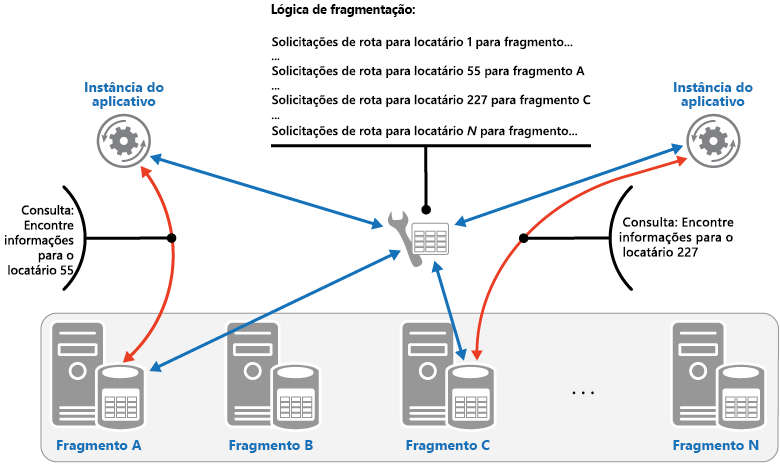
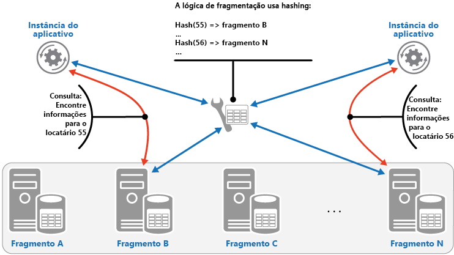

# <a name="sharding-pattern"></a><span data-ttu-id="a9bc5-104">Padrão de fragmentação</span><span class="sxs-lookup"><span data-stu-id="a9bc5-104">Sharding pattern</span></span>

[!INCLUDE [header](../_includes/header.md)]

<span data-ttu-id="a9bc5-105">Divida um armazenamento de dados em um conjunto de partições horizontais ou fragmentos.</span><span class="sxs-lookup"><span data-stu-id="a9bc5-105">Divide a data store into a set of horizontal partitions or shards.</span></span> <span data-ttu-id="a9bc5-106">Isso pode melhorar a escalabilidade ao armazenar e acessar grandes volumes de dados.</span><span class="sxs-lookup"><span data-stu-id="a9bc5-106">This can improve scalability when storing and accessing large volumes of data.</span></span>

## <a name="context-and-problem"></a><span data-ttu-id="a9bc5-107">Contexto e problema</span><span class="sxs-lookup"><span data-stu-id="a9bc5-107">Context and problem</span></span>

<span data-ttu-id="a9bc5-108">Um repositório de dados hospedado por um único servidor pode estar sujeito às seguintes limitações:</span><span class="sxs-lookup"><span data-stu-id="a9bc5-108">A data store hosted by a single server might be subject to the following limitations:</span></span>

- <span data-ttu-id="a9bc5-109">**Espaço de armazenamento**.</span><span class="sxs-lookup"><span data-stu-id="a9bc5-109">**Storage space**.</span></span> <span data-ttu-id="a9bc5-110">Um repositório de dados para um aplicativo de nuvem em grande escala deve conter um grande volume de dados que podem aumentar significativamente ao longo do tempo.</span><span class="sxs-lookup"><span data-stu-id="a9bc5-110">A data store for a large-scale cloud application is expected to contain a huge volume of data that could increase significantly over time.</span></span> <span data-ttu-id="a9bc5-111">Um servidor geralmente fornece apenas uma quantidade finita de armazenamento em disco, mas você pode substituir discos existentes por maiores ou adicionar mais discos a uma máquina com o crescimento dos volumes de dados.</span><span class="sxs-lookup"><span data-stu-id="a9bc5-111">A server typically provides only a finite amount of disk storage, but you can replace existing disks with larger ones, or add further disks to a machine as data volumes grow.</span></span> <span data-ttu-id="a9bc5-112">No entanto, o sistema uma hora atingirá um limite em que não é possível aumentar facilmente a capacidade de armazenamento em um determinado servidor.</span><span class="sxs-lookup"><span data-stu-id="a9bc5-112">However, the system will eventually reach a limit where it isn't possible to easily increase the storage capacity on a given server.</span></span>

- <span data-ttu-id="a9bc5-113">**Recursos de computação**.</span><span class="sxs-lookup"><span data-stu-id="a9bc5-113">**Computing resources**.</span></span> <span data-ttu-id="a9bc5-114">Um aplicativo de nuvem é necessário para dar suporte a um grande número de usuários simultâneos, cada um dos quais executa consultas que recuperam informações do repositório de dados.</span><span class="sxs-lookup"><span data-stu-id="a9bc5-114">A cloud application is required to support a large number of concurrent users, each of which run queries that retrieve information from the data store.</span></span> <span data-ttu-id="a9bc5-115">Um único servidor hospedando o repositório de dados pode não ser capaz de fornecer a capacidade de computação necessária para dar suporte a essa carga, resultando em tempos de resposta maiores para os usuários e falhas frequentes, já que aplicativos tentando armazenar e recuperar dados atingem o tempo limite. Talvez seja possível adicionar memória ou usar processadores melhores, mas o sistema atingirá um limite quando não for mais possível aumentar os recursos de computação.</span><span class="sxs-lookup"><span data-stu-id="a9bc5-115">A single server hosting the data store might not be able to provide the necessary computing power to support this load, resulting in extended response times for users and frequent failures as applications attempting to store and retrieve data time out. It might be possible to add memory or upgrade processors, but the system will reach a limit when it isn't possible to increase the compute resources any further.</span></span>

- <span data-ttu-id="a9bc5-116">**Largura de banda da rede**.</span><span class="sxs-lookup"><span data-stu-id="a9bc5-116">**Network bandwidth**.</span></span> <span data-ttu-id="a9bc5-117">Por fim, o desempenho de um repositório de dados em execução em um único servidor é controlado pela velocidade em que o servidor pode receber solicitações e enviar respostas.</span><span class="sxs-lookup"><span data-stu-id="a9bc5-117">Ultimately, the performance of a data store running on a single server is governed by the rate the server can receive requests and send replies.</span></span> <span data-ttu-id="a9bc5-118">É possível que o volume de tráfego de rede possa exceder a capacidade da rede usada para se conectar ao servidor, resultando em solicitações com falha.</span><span class="sxs-lookup"><span data-stu-id="a9bc5-118">It's possible that the volume of network traffic might exceed the capacity of the network used to connect to the server, resulting in failed requests.</span></span>

- <span data-ttu-id="a9bc5-119">**Geografia**.</span><span class="sxs-lookup"><span data-stu-id="a9bc5-119">**Geography**.</span></span> <span data-ttu-id="a9bc5-120">Talvez seja necessário armazenar os dados gerados por usuários específicos na mesma região que esses usuários por motivos legais, de conformidade ou de desempenho ou para reduzir a latência de acesso aos dados.</span><span class="sxs-lookup"><span data-stu-id="a9bc5-120">It might be necessary to store data generated by specific users in the same region as those users for legal, compliance, or performance reasons, or to reduce latency of data access.</span></span> <span data-ttu-id="a9bc5-121">Se os usuários estão distribuídos em diferentes países ou regiões, pode não ser possível armazenar todos os dados do aplicativo em um único repositório de dados.</span><span class="sxs-lookup"><span data-stu-id="a9bc5-121">If the users are dispersed across different countries or regions, it might not be possible to store the entire data for the application in a single data store.</span></span>

<span data-ttu-id="a9bc5-122">O dimensionamento vertical por adição de mais capacidade em disco, capacidade de processamento, memória e conexões de rede pode adiar os efeitos de algumas dessas limitações, mas é provável que seja apenas uma solução temporária.</span><span class="sxs-lookup"><span data-stu-id="a9bc5-122">Scaling vertically by adding more disk capacity, processing power, memory, and network connections can postpone the effects of some of these limitations, but it's likely to only be a temporary solution.</span></span> <span data-ttu-id="a9bc5-123">Um aplicativo de nuvem comercial capaz de dar suporte a grandes números de usuários e grandes volumes de dados deve ser capaz de ser dimensionado quase indefinidamente, então o dimensionamento vertical não é necessariamente a melhor solução.</span><span class="sxs-lookup"><span data-stu-id="a9bc5-123">A commercial cloud application capable of supporting large numbers of users and high volumes of data must be able to scale almost indefinitely, so vertical scaling isn't necessarily the best solution.</span></span>

## <a name="solution"></a><span data-ttu-id="a9bc5-124">Solução</span><span class="sxs-lookup"><span data-stu-id="a9bc5-124">Solution</span></span>

<span data-ttu-id="a9bc5-125">Divida o repositório de dados em partições horizontais ou fragmentos.</span><span class="sxs-lookup"><span data-stu-id="a9bc5-125">Divide the data store into horizontal partitions or shards.</span></span> <span data-ttu-id="a9bc5-126">Cada fragmento tem o mesmo esquema, mas mantém seu próprio subconjunto distinto dos dados.</span><span class="sxs-lookup"><span data-stu-id="a9bc5-126">Each shard has the same schema, but holds its own distinct subset of the data.</span></span> <span data-ttu-id="a9bc5-127">Um fragmento é um repositório de dados em si (ele pode conter os dados de várias entidades de tipos diferentes), em execução em um servidor que atua como nó de armazenamento.</span><span class="sxs-lookup"><span data-stu-id="a9bc5-127">A shard is a data store in its own right (it can contain the data for many entities of different types), running on a server acting as a storage node.</span></span>

<span data-ttu-id="a9bc5-128">Esse padrão tem os seguintes benefícios:</span><span class="sxs-lookup"><span data-stu-id="a9bc5-128">This pattern has the following benefits:</span></span>

- <span data-ttu-id="a9bc5-129">Você pode dimensionar o sistema horizontalmente acrescentando mais fragmentos executados em nós de armazenamento adicionais.</span><span class="sxs-lookup"><span data-stu-id="a9bc5-129">You can scale the system out by adding further shards running on additional storage nodes.</span></span>

- <span data-ttu-id="a9bc5-130">Um sistema pode usar hardware disponível no mercado em vez de computadores especializados e caros para cada nó de armazenamento.</span><span class="sxs-lookup"><span data-stu-id="a9bc5-130">A system can use off-the-shelf hardware rather than specialized and expensive computers for each storage node.</span></span>

- <span data-ttu-id="a9bc5-131">Você pode reduzir a contenção e melhorar o desempenho equilibrando a carga de trabalho entre fragmentos.</span><span class="sxs-lookup"><span data-stu-id="a9bc5-131">You can reduce contention and improve performance by balancing the workload across shards.</span></span>

- <span data-ttu-id="a9bc5-132">Na nuvem, fragmentos podem estar localizados fisicamente próximos aos usuários que acessarão os dados.</span><span class="sxs-lookup"><span data-stu-id="a9bc5-132">In the cloud, shards can be located physically close to the users that'll access the data.</span></span>

<span data-ttu-id="a9bc5-133">Ao dividir um repositório de dados em fragmentos, decida quais dados devem ser colocados em cada fragmento.</span><span class="sxs-lookup"><span data-stu-id="a9bc5-133">When dividing a data store up into shards, decide which data should be placed in each shard.</span></span> <span data-ttu-id="a9bc5-134">Geralmente, um fragmento contém itens que se encontram em um intervalo específico determinado por um ou mais atributos dos dados.</span><span class="sxs-lookup"><span data-stu-id="a9bc5-134">A shard typically contains items that fall within a specified range determined by one or more attributes of the data.</span></span> <span data-ttu-id="a9bc5-135">Esses atributos formam a chave de fragmentação (também conhecida como a chave de partição).</span><span class="sxs-lookup"><span data-stu-id="a9bc5-135">These attributes form the shard key (sometimes referred to as the partition key).</span></span> <span data-ttu-id="a9bc5-136">A chave de fragmentação deve ser estática.</span><span class="sxs-lookup"><span data-stu-id="a9bc5-136">The shard key should be static.</span></span> <span data-ttu-id="a9bc5-137">Ela não deve ser baseada em dados que possam ser alterados.</span><span class="sxs-lookup"><span data-stu-id="a9bc5-137">It shouldn't be based on data that might change.</span></span>

<span data-ttu-id="a9bc5-138">A fragmentação física organiza os dados.</span><span class="sxs-lookup"><span data-stu-id="a9bc5-138">Sharding physically organizes the data.</span></span> <span data-ttu-id="a9bc5-139">Quando um aplicativo armazena e recupera dados, a lógica de fragmentação direciona o aplicativo para o fragmento apropriado.</span><span class="sxs-lookup"><span data-stu-id="a9bc5-139">When an application stores and retrieves data, the sharding logic directs the application to the appropriate shard.</span></span> <span data-ttu-id="a9bc5-140">Essa lógica de fragmentação pode ser implementada como parte do código de acesso a dados no aplicativo ou pode ser implementada pelo sistema de armazenamento de dados se ele oferece suporte à fragmentação de forma transparente.</span><span class="sxs-lookup"><span data-stu-id="a9bc5-140">This sharding logic can be implemented as part of the data access code in the application, or it could be implemented by the data storage system if it transparently supports sharding.</span></span>

<span data-ttu-id="a9bc5-141">A abstração do local físico dos dados na lógica de fragmentação fornece um alto nível de controle sobre quais fragmentos contêm os dados.</span><span class="sxs-lookup"><span data-stu-id="a9bc5-141">Abstracting the physical location of the data in the sharding logic provides a high level of control over which shards contain which data.</span></span> <span data-ttu-id="a9bc5-142">Ela também permite que dados migrem entre fragmentos sem refazer a lógica de negócios de um aplicativo se os dados nos fragmentos precisarem ser redistribuídos posteriormente (por exemplo, se os fragmentos se tornarem desbalanceados).</span><span class="sxs-lookup"><span data-stu-id="a9bc5-142">It also enables data to migrate between shards without reworking the business logic of an application if the data in the shards need to be redistributed later (for example, if the shards become unbalanced).</span></span> <span data-ttu-id="a9bc5-143">A desvantagem é a sobrecarga de acesso a dados adicionais necessária para determinar a localização de cada item dos dados conforme eles são recuperados.</span><span class="sxs-lookup"><span data-stu-id="a9bc5-143">The tradeoff is the additional data access overhead required in determining the location of each data item as it's retrieved.</span></span>

<span data-ttu-id="a9bc5-144">Para garantir o desempenho e a escalabilidade ideais, é importante dividir os dados de maneira adequada para os tipos de consultas que o aplicativo executa.</span><span class="sxs-lookup"><span data-stu-id="a9bc5-144">To ensure optimal performance and scalability, it's important to split the data in a way that's appropriate for the types of queries that the application performs.</span></span> <span data-ttu-id="a9bc5-145">Em muitos casos, é improvável que o esquema de fragmentação corresponda exatamente aos requisitos de cada consulta.</span><span class="sxs-lookup"><span data-stu-id="a9bc5-145">In many cases, it's unlikely that the sharding scheme will exactly match the requirements of every query.</span></span> <span data-ttu-id="a9bc5-146">Por exemplo, em um sistema multilocatário, um aplicativo pode precisar recuperar dados de locatário usando a ID de locatário, mas ele também pode precisar consultar esses dados com base em algum outro atributo, como nome ou local do locatário.</span><span class="sxs-lookup"><span data-stu-id="a9bc5-146">For example, in a multi-tenant system an application might need to retrieve tenant data using the tenant ID, but it might also need to look up this data based on some other attribute such as the tenant’s name or location.</span></span> <span data-ttu-id="a9bc5-147">Para lidar com essas situações, implemente uma estratégia de fragmentação com uma chave de fragmentação que ofereça suporte às consultas realizadas com mais frequência.</span><span class="sxs-lookup"><span data-stu-id="a9bc5-147">To handle these situations, implement a sharding strategy with a shard key that supports the most commonly performed queries.</span></span>

<span data-ttu-id="a9bc5-148">Se as consultas regularmente recuperam dados usando uma combinação de valores de atributo, você provavelmente pode definir uma chave de fragmentação composta vinculando atributos.</span><span class="sxs-lookup"><span data-stu-id="a9bc5-148">If queries regularly retrieve data using a combination of attribute values, you can likely define a composite shard key by linking attributes together.</span></span> <span data-ttu-id="a9bc5-149">Como alternativa, use um padrão como [Tabela de Índice](index-table.md) para oferecer pesquisa rápida de dados com base em atributos que não são cobertos pela chave de fragmentação.</span><span class="sxs-lookup"><span data-stu-id="a9bc5-149">Alternatively, use a pattern such as [Index Table](index-table.md) to provide fast lookup to data based on attributes that aren't covered by the shard key.</span></span>

## <a name="sharding-strategies"></a><span data-ttu-id="a9bc5-150">Estratégias de fragmentação</span><span class="sxs-lookup"><span data-stu-id="a9bc5-150">Sharding strategies</span></span>

<span data-ttu-id="a9bc5-151">Três estratégias são usadas frequentemente ao selecionar a chave de fragmentação e decidir como distribuir dados entre fragmentos.</span><span class="sxs-lookup"><span data-stu-id="a9bc5-151">Three strategies are commonly used when selecting the shard key and deciding how to distribute data across shards.</span></span> <span data-ttu-id="a9bc5-152">Observe que não é necessário que haja uma correspondência entre fragmentos e os servidores que os hospedam&mdash;um único servidor pode hospedar vários fragmentos.</span><span class="sxs-lookup"><span data-stu-id="a9bc5-152">Note that there doesn't have to be a one-to-one correspondence between shards and the servers that host them&mdash;a single server can host multiple shards.</span></span> <span data-ttu-id="a9bc5-153">As estratégias são:</span><span class="sxs-lookup"><span data-stu-id="a9bc5-153">The strategies are:</span></span>

<span data-ttu-id="a9bc5-154">**A estratégia de pesquisa**.</span><span class="sxs-lookup"><span data-stu-id="a9bc5-154">**The Lookup strategy**.</span></span> <span data-ttu-id="a9bc5-155">Nesta estratégia, a lógica de fragmentação implementa um mapa que encaminha uma solicitação de dados para o fragmento que contém os dados usando a chave de fragmentação.</span><span class="sxs-lookup"><span data-stu-id="a9bc5-155">In this strategy the sharding logic implements a map that routes a request for data to the shard that contains that data using the shard key.</span></span> <span data-ttu-id="a9bc5-156">Em um aplicativo multilocatário, todos os dados de um locatário podem ser armazenados juntos em um fragmento usando a ID do locatário como chave de fragmentação.</span><span class="sxs-lookup"><span data-stu-id="a9bc5-156">In a multi-tenant application all the data for a tenant might be stored together in a shard using the tenant ID as the shard key.</span></span> <span data-ttu-id="a9bc5-157">Vários locatários podem compartilhar o mesmo fragmento, mas os dados de um único locatário não serão distribuídos a vários fragmentos.</span><span class="sxs-lookup"><span data-stu-id="a9bc5-157">Multiple tenants might share the same shard, but the data for a single tenant won't be spread across multiple shards.</span></span> <span data-ttu-id="a9bc5-158">A figura ilustra a fragmentação dos dados de locatário com base nas IDs de locatário.</span><span class="sxs-lookup"><span data-stu-id="a9bc5-158">The figure illustrates sharding tenant data based on tenant IDs.</span></span>

   


   <span data-ttu-id="a9bc5-160">O mapeamento entre a chave de fragmentação e o armazenamento físico pode ser baseado em fragmentos físicos nos quais cada chave de fragmentação é mapeada a uma partição física.</span><span class="sxs-lookup"><span data-stu-id="a9bc5-160">The mapping between the shard key and the physical storage can be based on physical shards where each shard key maps to a physical partition.</span></span> <span data-ttu-id="a9bc5-161">Como alternativa, uma técnica mais flexível para rebalancear fragmentos é o particionamento virtual, no qual as chaves de fragmentação são mapeadas ao mesmo número de fragmentos virtuais, que por sua vez são mapeados a menos partições físicas.</span><span class="sxs-lookup"><span data-stu-id="a9bc5-161">Alternatively, a more flexible technique for rebalancing shards is virtual partitioning, where shard keys map to the same number of virtual shards, which in turn map to fewer physical partitions.</span></span> <span data-ttu-id="a9bc5-162">Nessa abordagem, um aplicativo localiza os dados usando uma chave de fragmentação que se refere a um fragmento virtual e o sistema mapeia de maneira transparentemente fragmentos virtuais a partições físicas.</span><span class="sxs-lookup"><span data-stu-id="a9bc5-162">In this approach, an application locates data using a shard key that refers to a virtual shard, and the system transparently maps virtual shards to physical partitions.</span></span> <span data-ttu-id="a9bc5-163">O mapeamento entre um fragmento virtual e uma partição física pode mudar sem a necessidade de modificar o código do aplicativo para usar um conjunto diferente de chaves de fragmentação.</span><span class="sxs-lookup"><span data-stu-id="a9bc5-163">The mapping between a virtual shard and a physical partition can change without requiring the application code be modified to use a different set of shard keys.</span></span>

<span data-ttu-id="a9bc5-164">**A estratégia de intervalo**.</span><span class="sxs-lookup"><span data-stu-id="a9bc5-164">**The Range strategy**.</span></span> <span data-ttu-id="a9bc5-165">Essa estratégia agrupa itens relacionados no mesmo fragmento e os classifica por chave de fragmentação&mdash;as chaves de fragmentação são sequenciais.</span><span class="sxs-lookup"><span data-stu-id="a9bc5-165">This strategy groups related items together in the same shard, and orders them by shard key&mdash;the shard keys are sequential.</span></span> <span data-ttu-id="a9bc5-166">É útil para aplicativos que frequentemente recuperam conjuntos de itens usando consultas de intervalo (consultas que retornam um conjunto de itens de dados para uma chave de fragmentação que fica dentro de um determinado intervalo).</span><span class="sxs-lookup"><span data-stu-id="a9bc5-166">It's useful for applications that frequently retrieve sets of items using range queries (queries that return a set of data items for a shard key that falls within a given range).</span></span> <span data-ttu-id="a9bc5-167">Por exemplo, se um aplicativo precisar localizar regularmente todos os pedidos feitos em um determinado mês, esses dados podem ser recuperados mais rapidamente se todos os pedidos de um mês estiverem armazenados ordenados por data e hora no mesmo fragmento.</span><span class="sxs-lookup"><span data-stu-id="a9bc5-167">For example, if an application regularly needs to find all orders placed in a given month, this data can be retrieved more quickly if all orders for a month are stored in date and time order in the same shard.</span></span> <span data-ttu-id="a9bc5-168">Se cada pedido foi armazenado em um fragmento diferente, eles precisam ser buscados individualmente executando um grande número de consultas pontuais (consultas que retornam um único item de dados).</span><span class="sxs-lookup"><span data-stu-id="a9bc5-168">If each order was stored in a different shard, they'd have to be fetched individually by performing a large number of point queries (queries that return a single data item).</span></span> <span data-ttu-id="a9bc5-169">A figura seguinte ilustra como armazenar conjuntos sequenciais (intervalos) de dados no fragmento.</span><span class="sxs-lookup"><span data-stu-id="a9bc5-169">The next figure illustrates storing sequential sets (ranges) of data in shard.</span></span>

   

<span data-ttu-id="a9bc5-171">Neste exemplo, a chave de fragmentação é uma chave composta que contém o mês do pedido como o elemento mais significativo, seguido por dia e hora do pedido.</span><span class="sxs-lookup"><span data-stu-id="a9bc5-171">In this example, the shard key is a composite key containing the order month as the most significant element, followed by the order day and the time.</span></span> <span data-ttu-id="a9bc5-172">Os dados de pedidos são classificados naturalmente quando novos pedidos são criados e adicionados a um fragmento.</span><span class="sxs-lookup"><span data-stu-id="a9bc5-172">The data for orders is naturally sorted when new orders are created and added to a shard.</span></span> <span data-ttu-id="a9bc5-173">Alguns repositórios de dados aceitam chaves de fragmentação de duas partes contendo um elemento de chave de partição que identifica o fragmento e uma chave de linha que identifica exclusivamente um item no fragmento.</span><span class="sxs-lookup"><span data-stu-id="a9bc5-173">Some data stores support two-part shard keys containing a partition key element that identifies the shard and a row key that uniquely identifies an item in the shard.</span></span> <span data-ttu-id="a9bc5-174">Normalmente, os dados são mantidos na ordem da chave de linha no fragmento.</span><span class="sxs-lookup"><span data-stu-id="a9bc5-174">Data is usually held in row key order in the shard.</span></span> <span data-ttu-id="a9bc5-175">Itens que estão sujeitos a consultas de intervalo e precisam ser agrupados podem usar uma chave de fragmentação que tenha o mesmo valor para a chave de partição, mas um valor exclusivo para a chave de linha.</span><span class="sxs-lookup"><span data-stu-id="a9bc5-175">Items that are subject to range queries and need to be grouped together can use a shard key that has the same value for the partition key but a unique value for the row key.</span></span>

<span data-ttu-id="a9bc5-176">**A estratégia de Hash**.</span><span class="sxs-lookup"><span data-stu-id="a9bc5-176">**The Hash strategy**.</span></span> <span data-ttu-id="a9bc5-177">A finalidade dessa estratégia é reduzir a chance de pontos problemáticos (fragmentos que recebem uma quantidade desproporcional de carga).</span><span class="sxs-lookup"><span data-stu-id="a9bc5-177">The purpose of this strategy is to reduce the chance of hotspots (shards that receive a disproportionate amount of load).</span></span> <span data-ttu-id="a9bc5-178">Ela distribui os dados entre os fragmentos de forma que alcance um equilíbrio entre o tamanho de cada fragmento e a carga média que cada fragmento encontrará.</span><span class="sxs-lookup"><span data-stu-id="a9bc5-178">It distributes the data across the shards in a way that achieves a balance between the size of each shard and the average load that each shard will encounter.</span></span> <span data-ttu-id="a9bc5-179">A lógica de fragmentação calcula o fragmento para armazenar um item com base em um hash de um ou mais atributos dos dados.</span><span class="sxs-lookup"><span data-stu-id="a9bc5-179">The sharding logic computes the shard to store an item in based on a hash of one or more attributes of the data.</span></span> <span data-ttu-id="a9bc5-180">A função de hash de escolhida deve distribuir os dados uniformemente entre os fragmentos, possivelmente introduzindo algum elemento aleatório na computação.</span><span class="sxs-lookup"><span data-stu-id="a9bc5-180">The chosen hashing function should distribute data evenly across the shards, possibly by introducing some random element into the computation.</span></span> <span data-ttu-id="a9bc5-181">A próxima figura ilustra a fragmentação dos dados de locatário com base em um hash de IDs de locatário.</span><span class="sxs-lookup"><span data-stu-id="a9bc5-181">The next figure illustrates sharding tenant data based on a hash of tenant IDs.</span></span>

   

<span data-ttu-id="a9bc5-183">Para entender a vantagem da estratégia de Hash sobre outras estratégias de fragmentação, considere como um aplicativo multilocatário que registra novos locatários pode atribuir sequencialmente os locatários a fragmentos no repositório de dados.</span><span class="sxs-lookup"><span data-stu-id="a9bc5-183">To understand the advantage of the Hash strategy over other sharding strategies, consider how a multi-tenant application that enrolls new tenants sequentially might assign the tenants to shards in the data store.</span></span> <span data-ttu-id="a9bc5-184">Ao usar a estratégia de Intervalo, os dados para locatários de 1 a n serão todos armazenados no fragmento A, os dados para locatários de n+1 a m serão todos armazenados no fragmento B e assim por diante.</span><span class="sxs-lookup"><span data-stu-id="a9bc5-184">When using the Range strategy, the data for tenants 1 to n will all be stored in shard A, the data for tenants n+1 to m will all be stored in shard B, and so on.</span></span> <span data-ttu-id="a9bc5-185">Se os locatários registrados mais recentemente também forem os mais ativos, a maior parte das atividades de dados ocorrerá em um pequeno número de fragmentos, o que pode resultar em pontos problemáticos.</span><span class="sxs-lookup"><span data-stu-id="a9bc5-185">If the most recently registered tenants are also the most active, most data activity will occur in a small number of shards, which could cause hotspots.</span></span> <span data-ttu-id="a9bc5-186">Por outro lado, a estratégia de Hash aloca locatários a fragmentos com base em um hash das IDs de locatário.</span><span class="sxs-lookup"><span data-stu-id="a9bc5-186">In contrast, the Hash strategy allocates tenants to shards based on a hash of their tenant ID.</span></span> <span data-ttu-id="a9bc5-187">Isso significa que locatários sequenciais têm mais probabilidade de serem alocados para fragmentos diferentes, que distribuirão a carga entre eles.</span><span class="sxs-lookup"><span data-stu-id="a9bc5-187">This means that sequential tenants are most likely to be allocated to different shards, which will distribute the load across them.</span></span> <span data-ttu-id="a9bc5-188">A figura anterior mostra a isso para os locatários 55 e 56.</span><span class="sxs-lookup"><span data-stu-id="a9bc5-188">The previous figure shows this for tenants 55 and 56.</span></span>

<span data-ttu-id="a9bc5-189">As três estratégias de fragmentação têm as seguintes vantagens e considerações:</span><span class="sxs-lookup"><span data-stu-id="a9bc5-189">The three sharding strategies have the following advantages and considerations:</span></span>

- <span data-ttu-id="a9bc5-190">**Pesquisa**.</span><span class="sxs-lookup"><span data-stu-id="a9bc5-190">**Lookup**.</span></span> <span data-ttu-id="a9bc5-191">Oferece mais controle sobre a forma em que os fragmentos são configurados e usados.</span><span class="sxs-lookup"><span data-stu-id="a9bc5-191">This offers more control over the way that shards are configured and used.</span></span> <span data-ttu-id="a9bc5-192">O uso de fragmentos virtuais reduz o impacto ao rebalancear dados porque novas partições físicas podem ser adicionadas para uniformizar a carga de trabalho.</span><span class="sxs-lookup"><span data-stu-id="a9bc5-192">Using virtual shards reduces the impact when rebalancing data because new physical partitions can be added to even out the workload.</span></span> <span data-ttu-id="a9bc5-193">O mapeamento entre um fragmento virtual e as partições físicas que implementam o fragmento pode ser modificado sem afetar o código do aplicativo que usa uma chave de fragmentação para armazenar e recuperar dados.</span><span class="sxs-lookup"><span data-stu-id="a9bc5-193">The mapping between a virtual shard and the physical partitions that implement the shard can be modified without affecting application code that uses a shard key to store and retrieve data.</span></span> <span data-ttu-id="a9bc5-194">A pesquisa de locais de fragmento pode impor uma sobrecarga adicional.</span><span class="sxs-lookup"><span data-stu-id="a9bc5-194">Looking up shard locations can impose an additional overhead.</span></span>

- <span data-ttu-id="a9bc5-195">**Intervalo**.</span><span class="sxs-lookup"><span data-stu-id="a9bc5-195">**Range**.</span></span> <span data-ttu-id="a9bc5-196">É fácil de implementar e funciona bem com consultas de intervalo porque geralmente podem buscar vários itens de dados em um único fragmento em uma única operação.</span><span class="sxs-lookup"><span data-stu-id="a9bc5-196">This is easy to implement and works well with range queries because they can often fetch multiple data items from a single shard in a single operation.</span></span> <span data-ttu-id="a9bc5-197">Essa estratégia oferece gerenciamento de dados mais fácil.</span><span class="sxs-lookup"><span data-stu-id="a9bc5-197">This strategy offers easier data management.</span></span> <span data-ttu-id="a9bc5-198">Por exemplo, se os usuários na mesma região estiverem no mesmo fragmento, podem ser agendadas atualizações em cada fuso horário com base no padrão de carga local e demanda.</span><span class="sxs-lookup"><span data-stu-id="a9bc5-198">For example, if users in the same region are in the same shard, updates can be scheduled in each time zone based on the local load and demand pattern.</span></span> <span data-ttu-id="a9bc5-199">No entanto, essa estratégia não fornece o equilíbrio ideal entre fragmentos.</span><span class="sxs-lookup"><span data-stu-id="a9bc5-199">However, this strategy doesn't provide optimal balancing between shards.</span></span> <span data-ttu-id="a9bc5-200">O rebalanceamento de fragmentos é difícil e pode não resolver o problema de carga irregular se a maior parte da atividade for para chaves de fragmentação adjacentes.</span><span class="sxs-lookup"><span data-stu-id="a9bc5-200">Rebalancing shards is difficult and might not resolve the problem of uneven load if the majority of activity is for adjacent shard keys.</span></span>

- <span data-ttu-id="a9bc5-201">**Hash**.</span><span class="sxs-lookup"><span data-stu-id="a9bc5-201">**Hash**.</span></span> <span data-ttu-id="a9bc5-202">Essa estratégia oferece mais chances de uma distribuição de dados e carga mais uniforme.</span><span class="sxs-lookup"><span data-stu-id="a9bc5-202">This strategy offers a better chance of more even data and load distribution.</span></span> <span data-ttu-id="a9bc5-203">O roteamento de solicitação pode ser realizado diretamente usando a função de hash.</span><span class="sxs-lookup"><span data-stu-id="a9bc5-203">Request routing can be accomplished directly by using the hash function.</span></span> <span data-ttu-id="a9bc5-204">Não é necessário manter um mapa.</span><span class="sxs-lookup"><span data-stu-id="a9bc5-204">There's no need to maintain a map.</span></span> <span data-ttu-id="a9bc5-205">Observe que calcular o hash pode impor uma sobrecarga adicional.</span><span class="sxs-lookup"><span data-stu-id="a9bc5-205">Note that computing the hash might impose an additional overhead.</span></span> <span data-ttu-id="a9bc5-206">Além disso, o rebalanceamento de fragmentos é difícil.</span><span class="sxs-lookup"><span data-stu-id="a9bc5-206">Also, rebalancing shards is difficult.</span></span>

<span data-ttu-id="a9bc5-207">Os sistemas mais comuns de fragmentação implementam uma das abordagens descritas acima, mas você também deve considerar os requisitos de negócios de seus aplicativos e seus padrões de uso de dados.</span><span class="sxs-lookup"><span data-stu-id="a9bc5-207">Most common sharding systems implement one of the approaches described above, but you should also consider the business requirements of your applications and their patterns of data usage.</span></span> <span data-ttu-id="a9bc5-208">Por exemplo, em um aplicativo multilocatário:</span><span class="sxs-lookup"><span data-stu-id="a9bc5-208">For example, in a multi-tenant application:</span></span>

- <span data-ttu-id="a9bc5-209">Você pode fragmentar dados com base na carga de trabalho.</span><span class="sxs-lookup"><span data-stu-id="a9bc5-209">You can shard data based on workload.</span></span> <span data-ttu-id="a9bc5-210">Você pode separar os dados para locatários altamente voláteis em fragmentos separados.</span><span class="sxs-lookup"><span data-stu-id="a9bc5-210">You could segregate the data for highly volatile tenants in separate shards.</span></span> <span data-ttu-id="a9bc5-211">A velocidade do acesso aos dados para outros locatários pode ser melhorada como resultado.</span><span class="sxs-lookup"><span data-stu-id="a9bc5-211">The speed of data access for other tenants might be improved as a result.</span></span>

- <span data-ttu-id="a9bc5-212">Você pode fragmentar dados com base na localização dos locatários.</span><span class="sxs-lookup"><span data-stu-id="a9bc5-212">You can shard data based on the location of tenants.</span></span> <span data-ttu-id="a9bc5-213">Você pode tornar os dados de locatários em uma região geográfica específica offline para manutenção e backup fora do horário de pico nessa região, enquanto os dados de locatários em outras regiões permanecem online e acessíveis durante os respectivos horários comerciais.</span><span class="sxs-lookup"><span data-stu-id="a9bc5-213">You can take the data for tenants in a specific geographic region offline for backup and maintenance during off-peak hours in that region, while the data for tenants in other regions remains online and accessible during their business hours.</span></span>

- <span data-ttu-id="a9bc5-214">Locatários de grande valor podem ter atribuídos seus próprios fragmentos privados, de alto desempenho e com pouca carga, enquanto locatários de valor inferior podem compartilhar fragmentos ocupados e mais compactados.</span><span class="sxs-lookup"><span data-stu-id="a9bc5-214">High-value tenants could be assigned their own private, high performing, lightly loaded shards, whereas lower-value tenants might be expected to share more densely-packed, busy shards.</span></span>

- <span data-ttu-id="a9bc5-215">Os dados para locatários que precisam de um alto grau de isolamento de dados e privacidade podem ser armazenados em um servidor completamente separado.</span><span class="sxs-lookup"><span data-stu-id="a9bc5-215">The data for tenants that need a high degree of data isolation and privacy can be stored on a completely separate server.</span></span>

## <a name="scaling-and-data-movement-operations"></a><span data-ttu-id="a9bc5-216">Operações de movimentação de dados e dimensionamento</span><span class="sxs-lookup"><span data-stu-id="a9bc5-216">Scaling and data movement operations</span></span>

<span data-ttu-id="a9bc5-217">Cada uma das estratégias de fragmentação implica diferentes recursos e níveis de complexidade para gerenciar a redução, a expansão, a movimentação de dados e o estado de manutenção.</span><span class="sxs-lookup"><span data-stu-id="a9bc5-217">Each of the sharding strategies implies different capabilities and levels of complexity for managing scale in, scale out, data movement, and maintaining state.</span></span>

<span data-ttu-id="a9bc5-218">A estratégia de pesquisa permite que operações de movimentação de dados e dimensionamento sejam executadas no nível do usuário, online ou offline.</span><span class="sxs-lookup"><span data-stu-id="a9bc5-218">The Lookup strategy permits scaling and data movement operations to be carried out at the user level, either online or offline.</span></span> <span data-ttu-id="a9bc5-219">A técnica resume-se em suspender algumas ou todas as atividades do usuário (talvez durante períodos de pico), mover os dados para a nova partição virtual ou fragmento físico, alterar os mapeamentos, invalidar ou atualizar quaisquer caches que mantenham esses dados e, em seguida, permitir que a atividade do usuário continue.</span><span class="sxs-lookup"><span data-stu-id="a9bc5-219">The technique is to suspend some or all user activity (perhaps during off-peak periods), move the data to the new virtual partition or physical shard, change the mappings, invalidate or refresh any caches that hold this data, and then allow user activity to resume.</span></span> <span data-ttu-id="a9bc5-220">Muitas vezes esse tipo de operação pode ser gerenciado de forma central.</span><span class="sxs-lookup"><span data-stu-id="a9bc5-220">Often this type of operation can be centrally managed.</span></span> <span data-ttu-id="a9bc5-221">A estratégia de Pesquisa requer que o estado favoreça o armazenamento em cache e seja fácil de replicar.</span><span class="sxs-lookup"><span data-stu-id="a9bc5-221">The Lookup strategy requires state to be highly cacheable and replica friendly.</span></span>

<span data-ttu-id="a9bc5-222">A estratégia de Intervalo impõe algumas limitações a operações de movimentação de dados e dimensionamento, que normalmente devem ser executadas quando uma parte ou todo o repositório de dados está offline porque os dados devem ser divididos e mesclados entre os fragmentos.</span><span class="sxs-lookup"><span data-stu-id="a9bc5-222">The Range strategy imposes some limitations on scaling and data movement operations, which must typically be carried out when a part or all of the data store is offline because the data must be split and merged across the shards.</span></span> <span data-ttu-id="a9bc5-223">A movimentação dos dados para reequilibrar fragmentos não poderá resolver o problema de carga irregular se a maior parte da atividade for para chaves de fragmentação adjacentes ou identificadores de dados que estejam dentro do mesmo intervalo.</span><span class="sxs-lookup"><span data-stu-id="a9bc5-223">Moving the data to rebalance shards might not resolve the problem of uneven load if the majority of activity is for adjacent shard keys or data identifiers that are within the same range.</span></span> <span data-ttu-id="a9bc5-224">A estratégia de Intervalo também pode exigir que algum estado seja mantido para mapear os intervalos às partições físicas.</span><span class="sxs-lookup"><span data-stu-id="a9bc5-224">The Range strategy might also require some state to be maintained in order to map ranges to the physical partitions.</span></span>

<span data-ttu-id="a9bc5-225">A estratégia de Hash torna as operações de movimentação de dados e dimensionamento mais complexas porque as chaves de partição são hashes das chaves de fragmentação ou dos identificadores de dados.</span><span class="sxs-lookup"><span data-stu-id="a9bc5-225">The Hash strategy makes scaling and data movement operations more complex because the partition keys are hashes of the shard keys or data identifiers.</span></span> <span data-ttu-id="a9bc5-226">O novo local de cada fragmento deve ser determinado a partir da função de hash ou a função modificada para fornecer os mapeamentos corretos.</span><span class="sxs-lookup"><span data-stu-id="a9bc5-226">The new location of each shard must be determined from the hash function, or the function modified to provide the correct mappings.</span></span> <span data-ttu-id="a9bc5-227">No entanto, a estratégia de Hash não exige manutenção do estado.</span><span class="sxs-lookup"><span data-stu-id="a9bc5-227">However, the Hash strategy doesn't require maintenance of state.</span></span>

## <a name="issues-and-considerations"></a><span data-ttu-id="a9bc5-228">Problemas e considerações</span><span class="sxs-lookup"><span data-stu-id="a9bc5-228">Issues and considerations</span></span>

<span data-ttu-id="a9bc5-229">Considere os seguintes pontos ao decidir como implementar esse padrão:</span><span class="sxs-lookup"><span data-stu-id="a9bc5-229">Consider the following points when deciding how to implement this pattern:</span></span>

- <span data-ttu-id="a9bc5-230">A fragmentação é complementar a outras formas de particionamento, como particionamento vertical e particionamento funcional.</span><span class="sxs-lookup"><span data-stu-id="a9bc5-230">Sharding is complementary to other forms of partitioning, such as vertical partitioning and functional partitioning.</span></span> <span data-ttu-id="a9bc5-231">Por exemplo, um único fragmento pode conter entidades que foram particionadas verticalmente e uma partição funcional pode ser implementada como vários fragmentos.</span><span class="sxs-lookup"><span data-stu-id="a9bc5-231">For example, a single shard can contain entities that have been partitioned vertically, and a functional partition can be implemented as multiple shards.</span></span> <span data-ttu-id="a9bc5-232">Para saber mais sobre o particionamento, confira a [Diretrizes de particionamento de dados](https://msdn.microsoft.com/library/dn589795.aspx).</span><span class="sxs-lookup"><span data-stu-id="a9bc5-232">For more information about partitioning, see the [Data Partitioning Guidance](https://msdn.microsoft.com/library/dn589795.aspx).</span></span>

- <span data-ttu-id="a9bc5-233">Mantenha os fragmentos equilibrados para que todos tratem de um volume semelhante de E/S.</span><span class="sxs-lookup"><span data-stu-id="a9bc5-233">Keep shards balanced so they all handle a similar volume of I/O.</span></span> <span data-ttu-id="a9bc5-234">À medida que os dados são inseridos e excluídos, é necessário reequilibrar periodicamente os fragmentos para garantir uma distribuição uniforme e reduzir a chance de pontos problemáticos.</span><span class="sxs-lookup"><span data-stu-id="a9bc5-234">As data is inserted and deleted, it's necessary to periodically rebalance the shards to guarantee an even distribution and to reduce the chance of hotspots.</span></span> <span data-ttu-id="a9bc5-235">O rebalanceamento pode ser uma operação dispendiosa.</span><span class="sxs-lookup"><span data-stu-id="a9bc5-235">Rebalancing can be an expensive operation.</span></span> <span data-ttu-id="a9bc5-236">Para reduzir a necessidade de rebalanceamento, planeje o crescimento garantindo que cada fragmento contenha espaço suficiente para lidar com o volume esperado de alterações.</span><span class="sxs-lookup"><span data-stu-id="a9bc5-236">To reduce the necessity of rebalancing, plan for growth by ensuring that each shard contains sufficient free space to handle the expected volume of changes.</span></span> <span data-ttu-id="a9bc5-237">Você também deve desenvolver estratégias e scripts que possa usar para reequilibrar rapidamente fragmentos se isso for necessário.</span><span class="sxs-lookup"><span data-stu-id="a9bc5-237">You should also develop strategies and scripts you can use to quickly rebalance shards if this becomes necessary.</span></span>

- <span data-ttu-id="a9bc5-238">Use dados estáveis para a chave de fragmentação.</span><span class="sxs-lookup"><span data-stu-id="a9bc5-238">Use stable data for the shard key.</span></span> <span data-ttu-id="a9bc5-239">Se a chave de fragmentação for alterada, o item de dados correspondente talvez precise ser movido entre fragmentos, aumentando a quantidade de trabalho realizado pelas operações de atualização.</span><span class="sxs-lookup"><span data-stu-id="a9bc5-239">If the shard key changes, the corresponding data item might have to move between shards, increasing the amount of work performed by update operations.</span></span> <span data-ttu-id="a9bc5-240">Por esse motivo, evite basear a chave de fragmentação em informações potencialmente voláteis.</span><span class="sxs-lookup"><span data-stu-id="a9bc5-240">For this reason, avoid basing the shard key on potentially volatile information.</span></span> <span data-ttu-id="a9bc5-241">Em vez disso, procure os atributos que sejam invariáveis ou que naturalmente formem uma chave.</span><span class="sxs-lookup"><span data-stu-id="a9bc5-241">Instead, look for attributes that are invariant or that naturally form a key.</span></span>

- <span data-ttu-id="a9bc5-242">Certifique-se de que as chaves de fragmentação sejam exclusivas.</span><span class="sxs-lookup"><span data-stu-id="a9bc5-242">Ensure that shard keys are unique.</span></span> <span data-ttu-id="a9bc5-243">Por exemplo, evite usar campos de incremento automático como chave de fragmentação.</span><span class="sxs-lookup"><span data-stu-id="a9bc5-243">For example, avoid using autoincrementing fields as the shard key.</span></span> <span data-ttu-id="a9bc5-244">Em alguns sistemas, campos incrementados automaticamente não podem ser coordenados entre fragmentos, possivelmente resultando em itens em fragmentos diferentes com a mesma chave de fragmentação.</span><span class="sxs-lookup"><span data-stu-id="a9bc5-244">Is some systems, autoincremented fields can't be coordinated across shards, possibly resulting in items in different shards having the same shard key.</span></span>

    >  <span data-ttu-id="a9bc5-245">Valores incrementados automaticamente em outros campos que não chaves de fragmentação também podem causar problemas.</span><span class="sxs-lookup"><span data-stu-id="a9bc5-245">Autoincremented values in other fields that are not shard keys can also cause problems.</span></span> <span data-ttu-id="a9bc5-246">Por exemplo, se você usar campos incrementados automaticamente para gerar IDs exclusivas, dois itens diferentes localizados em fragmentos diferentes podem ter atribuída uma mesma ID.</span><span class="sxs-lookup"><span data-stu-id="a9bc5-246">For example, if you use autoincremented fields to generate unique IDs, then two different items located in different shards might be assigned the same ID.</span></span>

- <span data-ttu-id="a9bc5-247">Pode não ser possível criar uma chave de fragmentação que atenda aos requisitos de cada possível consulta dos dados.</span><span class="sxs-lookup"><span data-stu-id="a9bc5-247">It might not be possible to design a shard key that matches the requirements of every possible query against the data.</span></span> <span data-ttu-id="a9bc5-248">Fragmente os dados para dar suporte às consultas mais frequentemente executadas e, se necessário, crie tabelas de índice secundárias para dar suporte a consultas que recuperem dados usando os critérios baseados em atributos que não façam parte da chave de fragmentação.</span><span class="sxs-lookup"><span data-stu-id="a9bc5-248">Shard the data to support the most frequently performed queries, and if necessary create secondary index tables to support queries that retrieve data using criteria based on attributes that aren't part of the shard key.</span></span> <span data-ttu-id="a9bc5-249">Para saber mais, confira o [Padrão de Tabela de Índice](index-table.md).</span><span class="sxs-lookup"><span data-stu-id="a9bc5-249">For more information, see the [Index Table pattern](index-table.md).</span></span>

- <span data-ttu-id="a9bc5-250">Consultas que acessam apenas um único fragmento são mais eficientes do que aquelas que recuperam dados de vários fragmentos, portanto, evite implementar um sistema de fragmentação que resulte em aplicativos que executam grandes números de consultas que unem dados mantidos em fragmentos diferentes.</span><span class="sxs-lookup"><span data-stu-id="a9bc5-250">Queries that access only a single shard are more efficient than those that retrieve data from multiple shards, so avoid implementing a sharding system that results in applications performing large numbers of queries that join data held in different shards.</span></span> <span data-ttu-id="a9bc5-251">Lembre-se de que um único fragmento pode conter os dados de vários tipos de entidades.</span><span class="sxs-lookup"><span data-stu-id="a9bc5-251">Remember that a single shard can contain the data for multiple types of entities.</span></span> <span data-ttu-id="a9bc5-252">Considere a desnormalização de seus dados para manter as entidades relacionadas que normalmente são consultadas em conjunto (por exemplo, os detalhes de clientes e os pedidos que eles fizeram) no mesmo fragmento para reduzir o número de leituras separadas que um aplicativo realiza.</span><span class="sxs-lookup"><span data-stu-id="a9bc5-252">Consider denormalizing your data to keep related entities that are commonly queried together (such as the details of customers and the orders that they have placed) in the same shard to reduce the number of separate reads that an application performs.</span></span>

    >  <span data-ttu-id="a9bc5-253">Se uma entidade em um fragmento faz referência a uma entidade armazenada em outro fragmento, inclua a chave de fragmentação para a segunda entidade como parte do esquema da primeira entidade.</span><span class="sxs-lookup"><span data-stu-id="a9bc5-253">If an entity in one shard references an entity stored in another shard, include the shard key for the second entity as part of the schema for the first entity.</span></span> <span data-ttu-id="a9bc5-254">Isso pode ajudar a melhorar o desempenho das consultas que fazem referência a dados relacionados entre fragmentos.</span><span class="sxs-lookup"><span data-stu-id="a9bc5-254">This can help to improve the performance of queries that reference related data across shards.</span></span>

- <span data-ttu-id="a9bc5-255">Se um aplicativo deve executar consultas que recuperam dados de vários fragmentos, pode ser possível buscar esses dados por meio de tarefas paralelas.</span><span class="sxs-lookup"><span data-stu-id="a9bc5-255">If an application must perform queries that retrieve data from multiple shards, it might be possible to fetch this data by using parallel tasks.</span></span> <span data-ttu-id="a9bc5-256">Os exemplos incluem consultas do tipo fan-out, nas quais os dados de vários fragmentos são recuperados em paralelo e agregados em um único resultado.</span><span class="sxs-lookup"><span data-stu-id="a9bc5-256">Examples include fan-out queries, where data from multiple shards is retrieved in parallel and then aggregated into a single result.</span></span> <span data-ttu-id="a9bc5-257">No entanto, essa abordagem inevitavelmente adiciona certa complexidade à lógica de acesso a dados de uma solução.</span><span class="sxs-lookup"><span data-stu-id="a9bc5-257">However, this approach inevitably adds some complexity to the data access logic of a solution.</span></span>

- <span data-ttu-id="a9bc5-258">Para muitos aplicativos, a criação de um grande número de fragmentos pequenos pode ser mais eficiente do que um pequeno número de fragmentos grandes porque eles podem oferecer mais oportunidades de balanceamento de carga.</span><span class="sxs-lookup"><span data-stu-id="a9bc5-258">For many applications, creating a larger number of small shards can be more efficient than having a small number of large shards because they can offer increased opportunities for load balancing.</span></span> <span data-ttu-id="a9bc5-259">Isso também pode ser útil se você prevê a necessidade de migrar os fragmentos de um local físico para outro.</span><span class="sxs-lookup"><span data-stu-id="a9bc5-259">This can also be useful if you anticipate the need to migrate shards from one physical location to another.</span></span> <span data-ttu-id="a9bc5-260">A movimentação de um fragmento pequeno é mais rápida do que mover um grande.</span><span class="sxs-lookup"><span data-stu-id="a9bc5-260">Moving a small shard is quicker than moving a large one.</span></span>

- <span data-ttu-id="a9bc5-261">Verifique se os recursos disponíveis para cada nó de armazenamento de fragmento são suficientes para lidar com os requisitos de escalabilidade em termos de tamanho de dados e taxa de transferência.</span><span class="sxs-lookup"><span data-stu-id="a9bc5-261">Make sure the resources available to each shard storage node are sufficient to handle the scalability requirements in terms of data size and throughput.</span></span> <span data-ttu-id="a9bc5-262">Para obter mais informações, consulte a seção "Criando partições para escalabilidade" no [Diretrizes de particionamento de dados](https://msdn.microsoft.com/library/dn589795.aspx).</span><span class="sxs-lookup"><span data-stu-id="a9bc5-262">For more information, see the section “Designing Partitions for Scalability” in the [Data Partitioning Guidance](https://msdn.microsoft.com/library/dn589795.aspx).</span></span>

- <span data-ttu-id="a9bc5-263">Considere a possibilidade de replicar dados de referência para todos os fragmentos.</span><span class="sxs-lookup"><span data-stu-id="a9bc5-263">Consider replicating reference data to all shards.</span></span> <span data-ttu-id="a9bc5-264">Se uma operação que recupera dados de um fragmento também faz referência a dados estáticos ou lentos, como parte da mesma consulta, adicione esses dados ao fragmento.</span><span class="sxs-lookup"><span data-stu-id="a9bc5-264">If an operation that retrieves data from a shard also references static or slow-moving data as part of the same query, add this data to the shard.</span></span> <span data-ttu-id="a9bc5-265">O aplicativo pode então buscar todos os dados para a consulta facilmente, sem precisar fazer outro percurso de ida e volta a um repositório de dados separado.</span><span class="sxs-lookup"><span data-stu-id="a9bc5-265">The application can then fetch all of the data for the query easily, without having to make an additional round trip to a separate data store.</span></span>

    >  <span data-ttu-id="a9bc5-266">Se os dados de referência mantidos em vários fragmentos mudarem, o sistema deve sincronizar essas alterações em todos os fragmentos.</span><span class="sxs-lookup"><span data-stu-id="a9bc5-266">If reference data held in multiple shards changes, the system must synchronize these changes across all shards.</span></span> <span data-ttu-id="a9bc5-267">O sistema pode apresentar um grau de inconsistência enquanto ocorre a sincronização.</span><span class="sxs-lookup"><span data-stu-id="a9bc5-267">The system can experience a degree of inconsistency while this synchronization occurs.</span></span> <span data-ttu-id="a9bc5-268">Se você fizer isso, você deve projetar seus aplicativos para serem capazes de lidar com isso.</span><span class="sxs-lookup"><span data-stu-id="a9bc5-268">If you do this, you should design your applications to be able to handle it.</span></span>

- <span data-ttu-id="a9bc5-269">Pode ser difícil manter a integridade referencial e a consistência entre os fragmentos, portanto você deve minimizar as operações que afetam os dados em vários fragmentos.</span><span class="sxs-lookup"><span data-stu-id="a9bc5-269">It can be difficult to maintain referential integrity and consistency between shards, so you should minimize operations that affect data in multiple shards.</span></span> <span data-ttu-id="a9bc5-270">Se um aplicativo deve modificar dados em fragmentos, avalie se a consistência total dos dados é realmente necessária.</span><span class="sxs-lookup"><span data-stu-id="a9bc5-270">If an application must modify data across shards, evaluate whether complete data consistency is actually required.</span></span> <span data-ttu-id="a9bc5-271">Em vez disso, uma abordagem comum na nuvem é implementar a consistência eventual.</span><span class="sxs-lookup"><span data-stu-id="a9bc5-271">Instead, a common approach in the cloud is to implement eventual consistency.</span></span> <span data-ttu-id="a9bc5-272">Os dados em cada partição são atualizados separadamente e a lógica do aplicativo deve assumir a responsabilidade de garantir que todas as atualizações concluam com êxito, bem como tratar as inconsistências que possam surgir na consulta de dados durante a execução de uma operação que será consistente em algum momento.</span><span class="sxs-lookup"><span data-stu-id="a9bc5-272">The data in each partition is updated separately, and the application logic must take responsibility for ensuring that the updates all complete successfully, as well as handling the inconsistencies that can arise from querying data while an eventually consistent operation is running.</span></span> <span data-ttu-id="a9bc5-273">Para saber mais sobre como Para saber mais sobre como implementar a consistência eventual, confira [Primer de Consistência de Dados](https://msdn.microsoft.com/library/dn589800.aspx).</span><span class="sxs-lookup"><span data-stu-id="a9bc5-273">For more information about implementing eventual consistency, see the [Data Consistency Primer](https://msdn.microsoft.com/library/dn589800.aspx).</span></span>

- <span data-ttu-id="a9bc5-274">A configuração e o gerenciamento de um grande número de fragmentos podem ser um desafio.</span><span class="sxs-lookup"><span data-stu-id="a9bc5-274">Configuring and managing a large number of shards can be a challenge.</span></span> <span data-ttu-id="a9bc5-275">Tarefas como monitoramento, backup, verificação de consistência e registro em log ou auditoria devem ser realizadas em vários fragmentos e servidores, possivelmente mantidos em vários locais.</span><span class="sxs-lookup"><span data-stu-id="a9bc5-275">Tasks such as monitoring, backing up, checking for consistency, and logging or auditing must be accomplished on multiple shards and servers, possibly held in multiple locations.</span></span> <span data-ttu-id="a9bc5-276">Essas tarefas possivelmente podem ser implementadas usando scripts ou outras soluções de automação, mas isso pode não eliminar completamente os requisitos administrativos adicionais.</span><span class="sxs-lookup"><span data-stu-id="a9bc5-276">These tasks are likely to be implemented using scripts or other automation solutions, but that might not completely eliminate the additional administrative requirements.</span></span>

- <span data-ttu-id="a9bc5-277">Os fragmentos podem ser geolocalizados para que os dados que eles contêm estejam próximos das instâncias de um aplicativo que os usa.</span><span class="sxs-lookup"><span data-stu-id="a9bc5-277">Shards can be geolocated so that the data that they contain is close to the instances of an application that use it.</span></span> <span data-ttu-id="a9bc5-278">Essa abordagem pode melhorar significativamente o desempenho, mas requer considerações adicionais para tarefas que devem acessar vários fragmentos em diferentes locais.</span><span class="sxs-lookup"><span data-stu-id="a9bc5-278">This approach can considerably improve performance, but requires additional consideration for tasks that must access multiple shards in different locations.</span></span>

## <a name="when-to-use-this-pattern"></a><span data-ttu-id="a9bc5-279">Quando usar esse padrão</span><span class="sxs-lookup"><span data-stu-id="a9bc5-279">When to use this pattern</span></span>

<span data-ttu-id="a9bc5-280">Use esse padrão quando um repositório de dados possa possivelmente precisar ser dimensionado além dos recursos disponíveis para um único nó de armazenamento ou para melhorar o desempenho reduzindo a contenção em um repositório de dados.</span><span class="sxs-lookup"><span data-stu-id="a9bc5-280">Use this pattern when a data store is likely to need to scale beyond the resources available to a single storage node, or to improve performance by reducing contention in a data store.</span></span>

>  <span data-ttu-id="a9bc5-281">O foco principal da fragmentação é melhorar o desempenho e escalabilidade de um sistema, mas como subproduto também pode melhorar a disponibilidade devido a como os dados são divididos em partições separadas.</span><span class="sxs-lookup"><span data-stu-id="a9bc5-281">The primary focus of sharding is to improve the performance and scalability of a system, but as a by-product it can also improve availability due to how the data is divided into separate partitions.</span></span> <span data-ttu-id="a9bc5-282">Uma falha em uma partição não necessariamente impede que um aplicativo acesse os dados mantidos em outras partições e um operador pode realizar manutenção ou recuperação de uma ou mais partições sem tornar todos os dados inacessíveis para um aplicativo.</span><span class="sxs-lookup"><span data-stu-id="a9bc5-282">A failure in one partition doesn't necessarily prevent an application from accessing data held in other partitions, and an operator can perform maintenance or recovery of one or more partitions without making the entire data for an application inaccessible.</span></span> <span data-ttu-id="a9bc5-283">Para saber mais, consulte [Diretrizes de particionamento de dados](https://msdn.microsoft.com/library/dn589795.aspx).</span><span class="sxs-lookup"><span data-stu-id="a9bc5-283">For more information, see the [Data Partitioning Guidance](https://msdn.microsoft.com/library/dn589795.aspx).</span></span>

## <a name="example"></a><span data-ttu-id="a9bc5-284">Exemplo</span><span class="sxs-lookup"><span data-stu-id="a9bc5-284">Example</span></span>

<span data-ttu-id="a9bc5-285">O exemplo a seguir em C# usa um conjunto de bancos de dados do SQL Server atuando como fragmentos.</span><span class="sxs-lookup"><span data-stu-id="a9bc5-285">The following example in C# uses a set of SQL Server databases acting as shards.</span></span> <span data-ttu-id="a9bc5-286">Cada banco de dados contém um subconjunto dos dados usados por um aplicativo.</span><span class="sxs-lookup"><span data-stu-id="a9bc5-286">Each database holds a subset of the data used by an application.</span></span> <span data-ttu-id="a9bc5-287">O aplicativo recupera dados distribuídos entre os fragmentos usando sua própria lógica de fragmentação (esse é um exemplo de uma consulta do tipo fan-out).</span><span class="sxs-lookup"><span data-stu-id="a9bc5-287">The application retrieves data that's distributed across the shards using its own sharding logic (this is an example of a fan-out query).</span></span> <span data-ttu-id="a9bc5-288">Os detalhes dos dados localizados em cada fragmento são retornados por um método chamado `GetShards`.</span><span class="sxs-lookup"><span data-stu-id="a9bc5-288">The details of the data that's located in each shard is returned by a method called `GetShards`.</span></span> <span data-ttu-id="a9bc5-289">Esse método retorna uma lista enumerável de objetos `ShardInformation`, na qual o tipo `ShardInformation` contém um identificador para cada fragmento e a cadeia de conexão do SQL Server que um aplicativo deve usar para se conectar ao fragmento (as cadeias de conexão não são mostradas no exemplo de código).</span><span class="sxs-lookup"><span data-stu-id="a9bc5-289">This method returns an enumerable list of `ShardInformation` objects, where the `ShardInformation` type contains an identifier for each shard and the SQL Server connection string that an application should use to connect to the shard (the connection strings aren't shown in the code example).</span></span>

```csharp
private IEnumerable<ShardInformation> GetShards()
{
  // This retrieves the connection information from a shard store
  // (commonly a root database).
  return new[]
  {
    new ShardInformation
    {
      Id = 1,
      ConnectionString = ...
    },
    new ShardInformation
    {
      Id = 2,
      ConnectionString = ...
    }
  };
}
```

<span data-ttu-id="a9bc5-290">O código a seguir mostra como o aplicativo usa a lista de objetos `ShardInformation` para executar uma consulta que busca os dados de cada fragmento em paralelo.</span><span class="sxs-lookup"><span data-stu-id="a9bc5-290">The code below shows how the application uses the list of `ShardInformation` objects to perform a query that fetches data from each shard in parallel.</span></span> <span data-ttu-id="a9bc5-291">Os detalhes da consulta não são mostrados, mas os dados recuperados neste exemplo contêm uma cadeia de caracteres que pode conter informações como nome de um cliente se os fragmentos contiverem os detalhes de clientes.</span><span class="sxs-lookup"><span data-stu-id="a9bc5-291">The details of the query aren't shown, but in this example the data that's retrieved contains a string that could hold information such as the name of a customer if the shards contain the details of customers.</span></span> <span data-ttu-id="a9bc5-292">Os resultados são agregados em uma coleção `ConcurrentBag` a ser processada pelo aplicativo.</span><span class="sxs-lookup"><span data-stu-id="a9bc5-292">The results are aggregated into a `ConcurrentBag` collection for processing by the application.</span></span>

```csharp
// Retrieve the shards as a ShardInformation[] instance.
var shards = GetShards();

var results = new ConcurrentBag<string>();

// Execute the query against each shard in the shard list.
// This list would typically be retrieved from configuration
// or from a root/master shard store.
Parallel.ForEach(shards, shard =>
{
  // NOTE: Transient fault handling isn't included,
  // but should be incorporated when used in a real world application.
  using (var con = new SqlConnection(shard.ConnectionString))
  {
    con.Open();
    var cmd = new SqlCommand("SELECT ... FROM ...", con);

    Trace.TraceInformation("Executing command against shard: {0}", shard.Id);

    var reader = cmd.ExecuteReader();
    // Read the results in to a thread-safe data structure.
    while (reader.Read())
    {
      results.Add(reader.GetString(0));
    }
  }
});

Trace.TraceInformation("Fanout query complete - Record Count: {0}",
                        results.Count);
```

## <a name="related-patterns-and-guidance"></a><span data-ttu-id="a9bc5-293">Diretrizes e padrões relacionados</span><span class="sxs-lookup"><span data-stu-id="a9bc5-293">Related patterns and guidance</span></span>

<span data-ttu-id="a9bc5-294">Os padrões e diretrizes a seguir também podem ser relevantes ao implementar esse padrão:</span><span class="sxs-lookup"><span data-stu-id="a9bc5-294">The following patterns and guidance might also be relevant when implementing this pattern:</span></span>
- <span data-ttu-id="a9bc5-295">[Primer de Consistência de Dados](https://msdn.microsoft.com/library/dn589800.aspx).</span><span class="sxs-lookup"><span data-stu-id="a9bc5-295">[Data Consistency Primer](https://msdn.microsoft.com/library/dn589800.aspx).</span></span> <span data-ttu-id="a9bc5-296">Talvez seja necessário manter a consistência de dados distribuídos entre fragmentos diferentes.</span><span class="sxs-lookup"><span data-stu-id="a9bc5-296">It might be necessary to maintain consistency for data distributed across different shards.</span></span> <span data-ttu-id="a9bc5-297">Resume os problemas em torno da manutenção de consistência de dados distribuídos e descreve os benefícios e as vantagens e desvantagens de modelos diferentes de consistência.</span><span class="sxs-lookup"><span data-stu-id="a9bc5-297">Summarizes the issues surrounding maintaining consistency over distributed data, and describes the benefits and tradeoffs of different consistency models.</span></span>
- <span data-ttu-id="a9bc5-298">[Diretrizes de particionamento de dados](https://msdn.microsoft.com/library/dn589795.aspx).</span><span class="sxs-lookup"><span data-stu-id="a9bc5-298">[Data Partitioning Guidance](https://msdn.microsoft.com/library/dn589795.aspx).</span></span> <span data-ttu-id="a9bc5-299">A fragmentação de um repositório de dados pode apresentar uma variedade de outros problemas.</span><span class="sxs-lookup"><span data-stu-id="a9bc5-299">Sharding a data store can introduce a range of additional issues.</span></span> <span data-ttu-id="a9bc5-300">Descreve esses problemas em relação ao particionamento de repositórios de dados na nuvem para melhorar a escalabilidade, reduzir a contenção e otimizar o desempenho.</span><span class="sxs-lookup"><span data-stu-id="a9bc5-300">Describes these issues in relation to partitioning data stores in the cloud to improve scalability, reduce contention, and optimize performance.</span></span>
- <span data-ttu-id="a9bc5-301">[Padrão de Tabela de Índice](index-table.md).</span><span class="sxs-lookup"><span data-stu-id="a9bc5-301">[Index Table pattern](index-table.md).</span></span> <span data-ttu-id="a9bc5-302">Às vezes, não é possível oferecem suporte total a consultas apenas por meio do design da chave de fragmentação.</span><span class="sxs-lookup"><span data-stu-id="a9bc5-302">Sometimes it isn't possible to completely support queries just through the design of the shard key.</span></span> <span data-ttu-id="a9bc5-303">Permite que um aplicativo recupere rapidamente os dados de um repositório de dados grande especificando uma chave que não seja a chave de fragmentação.</span><span class="sxs-lookup"><span data-stu-id="a9bc5-303">Enables an application to quickly retrieve data from a large data store by specifying a key other than the shard key.</span></span>
- <span data-ttu-id="a9bc5-304">[Padrão de Exibição Materializada](materialized-view.md).</span><span class="sxs-lookup"><span data-stu-id="a9bc5-304">[Materialized View pattern](materialized-view.md).</span></span> <span data-ttu-id="a9bc5-305">Para manter o desempenho de algumas operações de consulta, é útil criar exibições materializadas que agreguem e resumam dados, especialmente se esses dados de resumo se basearem em informações distribuídas entre fragmentos.</span><span class="sxs-lookup"><span data-stu-id="a9bc5-305">To maintain the performance of some query operations, it's useful to create materialized views that aggregate and summarize data, especially if this summary data is based on information that's distributed across shards.</span></span> <span data-ttu-id="a9bc5-306">Descreve como gerar e preencher esses modos de exibição.</span><span class="sxs-lookup"><span data-stu-id="a9bc5-306">Describes how to generate and populate these views.</span></span>
- <span data-ttu-id="a9bc5-307">[Lições de fragmento](http://www.addsimplicity.com/adding_simplicity_an_engi/2008/08/shard-lessons.html) no blog Adding Simplicity.</span><span class="sxs-lookup"><span data-stu-id="a9bc5-307">[Shard Lessons](http://www.addsimplicity.com/adding_simplicity_an_engi/2008/08/shard-lessons.html) on the Adding Simplicity blog.</span></span>
- <span data-ttu-id="a9bc5-308">[Fragmentação de banco de dados](http://dbshards.com/database-sharding/) no site CodeFutures.</span><span class="sxs-lookup"><span data-stu-id="a9bc5-308">[Database Sharding](http://dbshards.com/database-sharding/) on the CodeFutures web site.</span></span>
- <span data-ttu-id="a9bc5-309">[Primer de estratégias de escalabilidade: fragmentação de banco de dados](http://blog.maxindelicato.com/2008/12/scalability-strategies-primer-database-sharding.html) no blog de Max Indelicato.</span><span class="sxs-lookup"><span data-stu-id="a9bc5-309">[Scalability Strategies Primer: Database Sharding](http://blog.maxindelicato.com/2008/12/scalability-strategies-primer-database-sharding.html) on Max Indelicato's blog.</span></span>
- <span data-ttu-id="a9bc5-310">[Criação de bancos de dados dimensionáveis: prós e contras de esquemas de fragmentação de banco de dados diversos](http://www.25hoursaday.com/weblog/2009/01/16/BuildingScalableDatabasesProsAndConsOfVariousDatabaseShardingSchemes.aspx) no blog de Dare Obasanjo.</span><span class="sxs-lookup"><span data-stu-id="a9bc5-310">[Building Scalable Databases: Pros and Cons of Various Database Sharding Schemes](http://www.25hoursaday.com/weblog/2009/01/16/BuildingScalableDatabasesProsAndConsOfVariousDatabaseShardingSchemes.aspx) on Dare Obasanjo's blog.</span></span>
