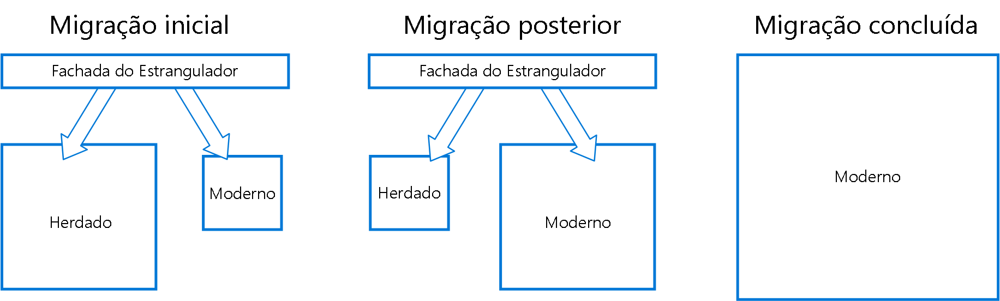

# Padrão do Estrangulador

Migre incrementalmente um sistema herdado substituindo gradualmente partes específicas de funcionalidade por serviços e aplicativos novos. Como os recursos do sistema herdado são substituídos, o novo sistema acaba substituindo todos os recursos do sistema antigo, estrangulando o sistema antigo e permitindo que você o encerre.

## Contexto e problema

Conforme o sistema envelhece, as ferramentas de desenvolvimento, a tecnologia de hospedagem e até mesmo as arquiteturas do sistema em que elas foram criadas podem se tornar cada vez mais obsoletas. Conforme são adicionados novos recursos e funcionalidades, a complexidade desses aplicativos pode aumentar consideravelmente, tornando mais difícil de manter ou adicionar novos recursos.

Substituir completamente um sistema complexo pode ser uma tarefa muito grande. Geralmente, você precisará de uma migração gradual para um novo sistema, mantendo o sistema antigo para manipular recursos que ainda não tenham sido migrados. No entanto, executar duas versões diferentes de um aplicativo significa que os clientes precisam saber o local em que determinados recursos estão localizados. Sempre que um recurso ou serviço for migrado, os clientes precisarão ser atualizados para apontar para o novo local.

## Solução

Substitua incrementalmente partes específicas da funcionalidade por novos serviços e aplicativos. Crie uma fachada que intercepte solicitações para o sistema herdado de back-end. A fachada encaminha essas solicitações para o aplicativo herdado ou para os novos serviços. Os recursos existentes podem ser migrados para o novo sistema gradualmente e os consumidores podem continuar usando a mesma interface, sem que estejam cientes de que qualquer migração ocorreu.

Esse padrão ajuda a minimizar o risco da migração e distribui o esforço de desenvolvimento ao longo do tempo. Com a fachada roteando com segurança os usuários para o aplicativo correto, você pode adicionar funcionalidade ao novo sistema em qualquer velocidade que desejar, enquanto garante que o aplicativo herdado continua a funcionar. Ao longo do tempo, conforme os recursos são migrados para o novo sistema, o sistema herdado acaba sendo “estrangulado" e não é mais necessário. Quando esse processo for concluído, o sistema herdado com segurança poderá ser descontinuado.

## Problemas e considerações

- Considere como lidar com serviços e armazenamentos de dados potencialmente usados por sistemas herdados e novos. Verifique se ambos podem acessar os recursos lado a lado.
- Estruture novos aplicativos e serviços de maneira que possam facilmente ser interceptados e substituídos em futuras migrações com estrangulamento.
- Em algum momento, quando a migração for concluída, fachada de estrangulamento desaparecerá ou se transformará em um adaptador para clientes herdados.
- Verifique se a fachada acompanha a migração.
- Verifique se a fachada não se torna um ponto único de falha ou um gargalo de desempenho.

## Quando usar esse padrão

Use esse padrão ao migrar gradualmente um aplicativo de back-end para uma nova arquitetura.

Esse padrão pode não ser adequado:

- Quando as solicitações ao sistema de back-end não podem ser interceptadas.
- Para sistemas menores em que a complexidade de toda a substituição é baixa.

## Diretrizes relacionadas

- Postagem de blog de Martin Fowler em [StranglerApplication](https://www.martinfowler.com/bliki/StranglerApplication.html)
