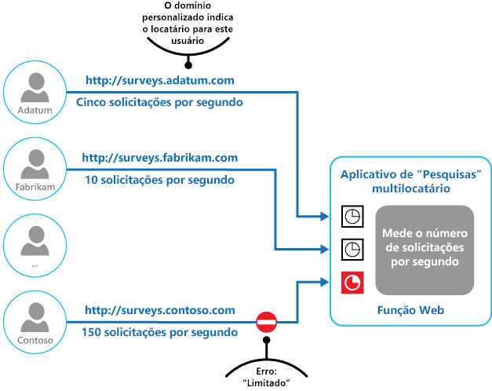

# Padrão de limitaçãoThrottling pattern

[!INCLUDE [header](../_includes/header.md)]

Controle o consumo de recursos usados por uma instância de um aplicativo, um locatário individual ou todo o serviço.Control the consumption of resources used by an instance of an application, an individual tenant, or an entire service. Isso pode permitir que o sistema continue a funcionar e atender aos contratos de nível de serviço mesmo quando um aumento na demanda coloca uma carga extrema nos recursos.This can allow the system to continue to function and meet service level agreements, even when an increase in demand places an extreme load on resources.

## Contexto e problemaContext and problem

A carga em um aplicativo de nuvem normalmente varia ao longo do tempo com base no número de usuários ativos ou nos tipos de atividades em execução.The load on a cloud application typically varies over time based on the number of active users or the types of activities they are performing. Por exemplo, provavelmente haverá mais usuários ativos durante o horário comercial ou o sistema poderá precisar executar uma análise computacionalmente dispendiosa no final de cada mês.For example, more users are likely to be active during business hours, or the system might be required to perform computationally expensive analytics at the end of each month. Também pode haver picos repentinos e inesperados na atividade.There might also be sudden and unanticipated bursts in activity. Se os requisitos de processamento do sistema excederem a capacidade dos recursos disponíveis, ele sofrerá de desempenho ruim e poderá, inclusive, falhar.If the processing requirements of the system exceed the capacity of the resources that are available, it'll suffer from poor performance and can even fail. Se o sistema precisar atender a um nível combinado de serviço, essa falha poderá ser inaceitável.If the system has to meet an agreed level of service, such failure could be unacceptable.

Há muitas estratégias disponíveis para tratar a carga variável na nuvem, dependendo dos objetivos comerciais para o aplicativo.There're many strategies available for handling varying load in the cloud, depending on the business goals for the application. Uma estratégia é usar o dimensionamento automático para combinar os recursos provisionados com as necessidades do usuário em qualquer dado momento.One strategy is to use autoscaling to match the provisioned resources to the user needs at any given time. Isso tem o potencial de atender consistentemente à demanda do usuário, ao mesmo tempo otimizando os custos em execução.This has the potential to consistently meet user demand, while optimizing running costs. No entanto, embora o dimensionamento automático possa disparar o provisionamento de recursos adicionais, essa configuração não é imediata.However, while autoscaling can trigger the provisioning of additional resources, this provisioning isn't immediate. Se a demanda crescer rapidamente, poderá haver um período com déficit de recurso.If demand grows quickly, there can be a window of time where there's a resource deficit.

## SoluçãoSolution

Uma estratégia alternativa para dimensionamento automático é permitir que os aplicativos usem recursos até um limite e então limitá-los quando esse limite for atingido.An alternative strategy to autoscaling is to allow applications to use resources only up to a limit, and then throttle them when this limit is reached. O sistema deve monitorar como ele está usando recursos de modo que, quando o uso exceder o limite, ele possa acelerar as solicitações de um ou mais usuários.The system should monitor how it's using resources so that, when usage exceeds the threshold, it can throttle requests from one or more users. Isso permitirá que o sistema continue a funcionar e atenda a quaisquer SLAs (contratos de nível de serviço) em vigor.This will enable the system to continue functioning and meet any service level agreements (SLAs) that are in place. Para obter mais informações sobre como monitorar o uso de recursos, consulte [Orientação sobre instrumentação e telemetria](https://msdn.microsoft.com/library/dn589775.aspx).For more information on monitoring resource usage, see the [Instrumentation and Telemetry Guidance](https://msdn.microsoft.com/library/dn589775.aspx).

O sistema pode implementar várias estratégias de limitação, incluindo:The system could implement several throttling strategies, including:

- Rejeitar solicitações de um usuário individual que já tenha acessado APIs do sistema mais de n vezes por segundo durante um determinado período.Rejecting requests from an individual user who's already accessed system APIs more than n times per second over a given period of time. Isso requer que o sistema meça o uso de recursos para cada locatário ou usuário que esteja executando um aplicativo.This requires the system to meter the use of resources for each tenant or user running an application. Para obter mais informações, consulte [Orientação de medição de serviço](https://msdn.microsoft.com/library/dn589796.aspx).For more information, see the [Service Metering Guidance](https://msdn.microsoft.com/library/dn589796.aspx).

- Desabilitar ou comprometer a funcionalidade de serviços não essenciais selecionados de modo que os serviços essenciais possam ser executados sem impedimentos com recursos suficientes.Disabling or degrading the functionality of selected nonessential services so that essential services can run unimpeded with sufficient resources. Por exemplo, se o aplicativo estiver transmitindo por streaming saída de vídeo, ele poderá mudar para uma resolução mais baixa.For example, if the application is streaming video output, it could switch to a lower resolution.

- Usando nivelamento para suavizar o volume de atividade (essa abordagem é abordada em mais detalhes por [Padrão de nivelamento de carga baseado em fila](queue-based-load-leveling.md)).Using load leveling to smooth the volume of activity (this approach is covered in more detail by the [Queue-based Load Leveling pattern](queue-based-load-leveling.md)). Em um ambiente multilocatário, essa abordagem reduzirá o desempenho de cada locatário.In a multi-tenant environment, this approach will reduce the performance for every tenant. Se o sistema precisar dar suporte a uma combinação de locatários com diferentes SLAs, o trabalho para locatários de alto valor poderá ser executado imediatamente.If the system must support a mix of tenants with different SLAs, the work for high-value tenants might be performed immediately. Solicitações para outros locatários poderão ser retidas e manipuladas quando a lista de pendências diminuir.Requests for other tenants can be held back, and handled when the backlog has eased. O [padrão de Fila de Prioridade][] pode ser usado para implementar essa abordagem.The [Priority Queue pattern][] could be used to help implement this approach.

- Adiar de operações sendo executadas em nome de locatários ou de aplicativos de menor prioridade.Deferring operations being performed on behalf of lower priority applications or tenants. Essas operações podem ser suspensas ou limitadas, sendo gerada uma exceção para informar o locatário de que o sistema está ocupado e a operação deverá ser repetida mais tarde.These operations can be suspended or limited, with an exception generated to inform the tenant that the system is busy and that the operation should be retried later.

A figura mostra um gráfico de área para o uso de recursos (uma combinação de memória, CPU, largura de banda e outros fatores) em relação ao tempo para aplicativos que estão usando três recursos.The figure shows an area graph for resource use (a combination of memory, CPU, bandwidth, and other factors) against time for applications that are making use of three features. Um recurso é uma área de funcionalidade, como um componente que executa um conjunto específico de tarefas, um trecho de código que executa um cálculo complexo ou um elemento que fornece um serviço como um cache na memória.A feature is an area of functionality, such as a component that performs a specific set of tasks, a piece of code that performs a complex calculation, or an element that provides a service such as an in-memory cache. Esses recursos são rotulados como A, B e C.These features are labeled A, B, and C.

> A área imediatamente abaixo da linha para um recurso indica os recursos usados por aplicativos quando eles invocam esse recurso.The area immediately below the line for a feature indicates the resources that are used by applications when they invoke this feature. Por exemplo, a área abaixo da linha para o Recurso A mostra os recursos usados por aplicativos que estão usando o Recurso A e a área entre as linhas para o Recurso A e o Recurso B indica os recursos usados por aplicativos que estão invocando o Recurso B. Agregar as áreas para cada recurso mostra o uso total de recursos do sistema.For example, the area below the line for Feature A shows the resources used by applications that are making use of Feature A, and the area between the lines for Feature A and Feature B indicates the resources used by applications invoking Feature B. Aggregating the areas for each feature shows the total resource use of the system.

A figura anterior mostra os efeitos de adiar as operações.The previous figure illustrates the effects of deferring operations. Logo antes do horário T1, o total de recursos alocados para todos os aplicativos que usam esses recursos atinge um limite (o limite de uso de recurso).Just prior to time T1, the total resources allocated to all applications using these features reach a threshold (the limit of resource use). Neste ponto, os aplicativos estão em risco de esgotar os recursos disponíveis.At this point, the applications are in danger of exhausting the resources available. Nesse sistema, o Recurso B é menos crítico que o Recurso A ou o Recurso C, assim, ele é temporariamente desabilitado e os recursos que ele estava usando são liberados.In this system, Feature B is less critical than Feature A or Feature C, so it's temporarily disabled and the resources that it was using are released. Entre os tempos T1 e T2, os aplicativos que usam o Recurso A e o Recurso C continuam em execução como normal.Between times T1 and T2, the applications using Feature A and Feature C continue running as normal. Por fim, o uso de recursos desses dois recursos diminui até um ponto em que, no tempo T2, há capacidade suficiente para habilitar o Recurso B novamente.Eventually, the resource use of these two features diminishes to the point when, at time T2, there is sufficient capacity to enable Feature B again.

As abordagens de dimensionamento automático e a limitação também podem ser combinadas para ajudar a manter os aplicativos responsivo e nos SLAs.The autoscaling and throttling approaches can also be combined to help keep the applications responsive and within SLAs. Se a expectativa for que a demanda permanecerá alta, a limitação fornecerá uma solução temporária enquanto o sistema é escalado horizontalmente. Neste ponto, a funcionalidade integral do sistema pode ser restaurada.If the demand is expected to remain high, throttling provides a temporary solution while the system scales out. At this point, the full functionality of the system can be restored.

A figura a seguir mostra um gráfico de área do uso geral de recursos por todos os aplicativos que estão em execução em um sistema em relação ao tempo e ilustra como a limitação pode ser combinada com o dimensionamento automático.The next figure shows an area graph of the overall resource use by all applications running in a system against time, and illustrates how throttling can be combined with autoscaling.

No tempo T1, o limite especificando um limite flexível de utilização de recursos é atingido.At time T1, the threshold specifying the soft limit of resource use is reached. Neste ponto, o sistema pode começar a aumentar. No entanto, se os recursos novos não ficarem disponíveis rápido o suficiente, os recursos existentes poderão ser esgotados e o sistema poderá falhar.At this point, the system can start to scale out. However, if the new resources don't become available quickly enough, then the existing resources might be exhausted and the system could fail. Para evitar que isso ocorra, o sistema será temporariamente limitado, conforme descrito anteriormente.To prevent this from occurring, the system is temporarily throttled, as described earlier. Quando o dimensionamento automático for concluído e recursos adicionais estiverem disponíveis, a limitação poderá ser reduzida.When autoscaling has completed and the additional resources are available, throttling can be relaxed.

## Problemas e consideraçõesIssues and considerations

Você deve considerar os seguintes pontos ao decidir como implementar esse padrão:You should consider the following points when deciding how to implement this pattern:

- A limitação de um aplicativo e a estratégia a ser usada, é uma decisão de arquitetura que afeta todo o projeto de um sistema.Throttling an application, and the strategy to use, is an architectural decision that impacts the entire design of a system. A limitação deve ser considerada no início do processo de design do aplicativo, porque não é fácil adicioná-la depois que um sistema tiver sido implementado.Throttling should be considered early in the application design process because it isn't easy to add once a system has been implemented.

- A limitação deve ser executada rapidamente.Throttling must be performed quickly. O sistema deve ser capaz de detectar um aumento na atividade e reagir de acordo.The system must be capable of detecting an increase in activity and react accordingly. O sistema também deve ser capaz de reverter para o estado original rapidamente depois que a carga diminuir.The system must also be able to revert to its original state quickly after the load has eased. Isso requer que os dados de desempenho apropriados sejam capturados e monitorados continuamente.This requires that the appropriate performance data is continually captured and monitored.

- Se um serviço precisar negar temporariamente uma solicitação de usuário, ele deverá retornar um código de erro específico para que o aplicativo cliente compreenda que o motivo da recusa em executar uma operação é a limitação.If a service needs to temporarily deny a user request, it should return a specific error code so the client application understands that the reason for the refusal to perform an operation is due to throttling. O aplicativo cliente pode aguardar um período antes de tentar novamente a solicitação.The client application can wait for a period before retrying the request.

- A limitação pode ser usada como uma medida temporária enquanto o sistema é dimensionado automaticamente.Throttling can be used as a temporary measure while a system autoscales. Em alguns casos, é melhor simplesmente limitar, em vez de dimensionar, se um aumento na atividade for repentino e provavelmente não for durar muito, pois o dimensionamento pode aumentar consideravelmente os custos de execução.In some cases it's better to simply throttle, rather than to scale, if a burst in activity is sudden and isn't expected to be long lived because scaling can add considerably to running costs.

- Se a limitação estiver sendo usada como uma medida temporária enquanto um sistema é dimensionado automaticamente e, se as demandas de recursos aumentarem muito rapidamente, o sistema poderá não conseguir continuar funcionando &mdash; mesmo ao operar em um modo limitado.If throttling is being used as a temporary measure while a system autoscales, and if resource demands grow very quickly, the system might not be able to continue functioning&mdash;even when operating in a throttled mode. Se isso não for aceitável, considere a possibilidade de manter maiores reservas de capacidade e configurar um dimensionamento automático mais agressivo.If this isn't acceptable, consider maintaining larger capacity reserves and configuring more aggressive autoscaling.

## Quando usar esse padrãoWhen to use this pattern

Use este padrão:Use this pattern:

- Para garantir que um sistema continue a cumprir os contratos de nível de serviço.To ensure that a system continues to meet service level agreements.

- Para impedir que um único locatário monopolize os recursos fornecidos por um aplicativo.To prevent a single tenant from monopolizing the resources provided by an application.

- Para lidar com estouros de atividade.To handle bursts in activity.

- Para ajudar a otimizar os custos de um sistema, limitando os níveis máximos de recursos necessários para mantê-lo funcionando.To help cost-optimize a system by limiting the maximum resource levels needed to keep it functioning.

## ExemploExample

A figura final ilustra como a limitação pode ser implementada em um sistema multilocatário.The final figure illustrates how throttling can be implemented in a multi-tenant system. Os usuários de cada uma das organizações de locatário acessam um aplicativo hospedado na nuvem em que eles preenchem e enviam as pesquisas.Users from each of the tenant organizations access a cloud-hosted application where they fill out and submit surveys. O aplicativo contém instrumentação que monitora a taxa à qual esses usuários estão enviando solicitações ao aplicativo.The application contains instrumentation that monitors the rate at which these users are submitting requests to the application.

Para evitar que os usuários de um locatário afetam a capacidade de resposta e a disponibilidade do aplicativo para todos os outros usuários, é aplicado um limite ao número de solicitações por segundo que os usuários de um locatário podem enviar.In order to prevent the users from one tenant affecting the responsiveness and availability of the application for all other users, a limit is applied to the number of requests per second the users from any one tenant can submit. O aplicativo bloqueia solicitações que excedem esse limite.The application blocks requests that exceed this limit.

## Diretrizes e padrões relacionadosRelated patterns and guidance

Os padrões e diretrizes a seguir também podem ser relevantes ao implementar esse padrão:The following patterns and guidance may also be relevant when implementing this pattern:
- [Diretrizes sobre Instrumentação e Telemetria](https://msdn.microsoft.com/library/dn589775.aspx).[Instrumentation and Telemetry Guidance](https://msdn.microsoft.com/library/dn589775.aspx). A limitação depende da coleta de informações sobre o quanto um serviço está sendo usado.Throttling depends on gathering information about how heavily a service is being used. Descreve como gerar e capturar informações de monitoramento personalizadas.Describes how to generate and capture custom monitoring information.
- [Diretrizes de Medição de Serviço](https://msdn.microsoft.com/library/dn589796.aspx).[Service Metering Guidance](https://msdn.microsoft.com/library/dn589796.aspx). Descreve como medir o uso de serviços para compreender como eles são usados.Describes how to meter the use of services in order to gain an understanding of how they are used. Essa informação pode ser útil para determinar como limitar um serviço.This information can be useful in determining how to throttle a service.
- [Diretrizes de dimensionamento automático](https://msdn.microsoft.com/library/dn589774.aspx).[Autoscaling Guidance](https://msdn.microsoft.com/library/dn589774.aspx). A limitação pode ser usada como uma medida temporária enquanto um sistema é dimensionado automaticamente ou para eliminar a necessidade de dimensionamento automático de um sistema.Throttling can be used as an interim measure while a system autoscales, or to remove the need for a system to autoscale. Contém informações sobre estratégias de dimensionamento automático.Contains information on autoscaling strategies.
- [Padrão de nivelamento de carga baseado em fila](queue-based-load-leveling.md).[Queue-based Load Leveling pattern](queue-based-load-leveling.md). O nivelamento de carga baseado em fila é um mecanismo comumente usado para implementar a limitação.Queue-based load leveling is a commonly used mechanism for implementing throttling. Uma fila pode agir como um buffer que ajuda a estabilizar a taxa em que as solicitações enviadas por um aplicativo são entregues a um serviço.A queue can act as a buffer that helps to even out the rate at which requests sent by an application are delivered to a service.
- [padrão de Fila de Prioridade][].[Priority Queue pattern][]. Um sistema pode usar o enfileiramento prioritário como parte da sua estratégia de limitação para manter o desempenho de aplicativos críticos ou de maior valor, ao mesmo tempo reduzindo o desempenho de aplicativos menos importantes.A system can use priority queuing as part of its throttling strategy to maintain performance for critical or higher value applications, while reducing the performance of less important applications.

[padrão de Fila de Prioridade]: priority-queue.md
[Priority Queue pattern]: priority-queue.md