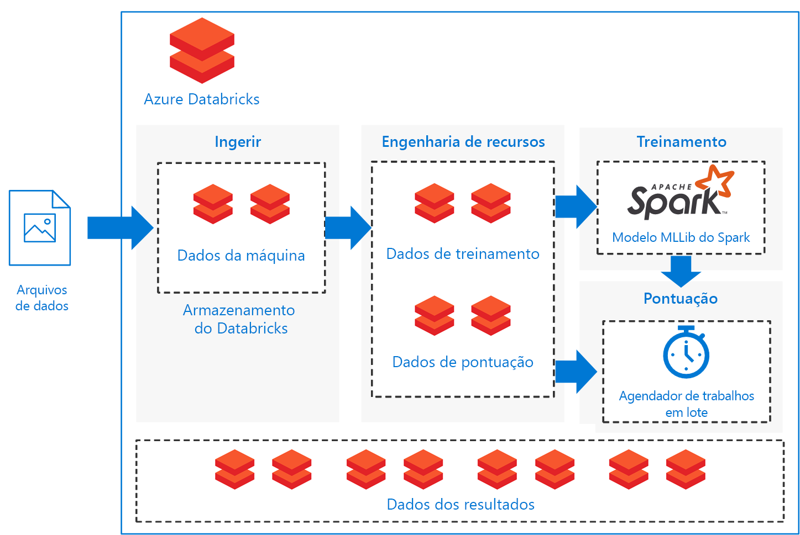

# Modelos de pontuação do lote do machine learning do Spark no Azure DatabricksBatch scoring of Spark machine learning models on Azure Databricks

Essa arquitetura de referência mostra como compilar uma solução escalonável para pontuação em lote no modelo de classificação do Apache Spark em um cronograma usando o Azure Databricks, uma plataforma analítica baseada no Apache Spark otimizada para o Azure.This reference architecture shows how to build a scalable solution for batch scoring an Apache Spark classification model on a schedule using Azure Databricks, an Apache Spark-based analytics platform optimized for Azure. A solução pode ser usada como um modelo que pode ser generalizado para outros cenários.The solution can be used as a template that can be generalized to other scenarios.

Há uma implantação de referência para essa arquitetura disponível no  [GitHub][github].A reference implementation for this architecture is available on [GitHub][github].

**Cenário**: Uma empresa em um setor de ativos pesados deseja minimizar os custos e o tempo de inatividade associado a falhas mecânicas inesperadas.**Scenario**: A business in an asset-heavy industry wants to minimize the costs and downtime associated with unexpected mechanical failures. Usando dados de IoT coletadas dos seus computadores, podem criar um modelo de manutenção preditiva.Using IoT data collected from their machines, they can create a predictive maintenance model. Esse modelo permite que os negócios mantenham componentes de forma proativa e repara-os antes de falharem.This model enables the business to maintain components proactively and repair them before they fail. Ao maximizar o uso de componente mecânico, eles podem controlar os custos e reduzir o tempo de inatividade.By maximizing mechanical component use, they can control costs and reduce downtime.

Um modelo de manutenção preditiva coleta dados das máquinas e retém os exemplos de histórico de falhas de componente.A predictive maintenance model collects data from the machines and retains historical examples of component failures. O modelo, em seguida, pode ser usado para monitorar o estado atual dos componentes e prever se um determinado componente falhará em um futuro próximo.The model can then be used to monitor the current state of the components and predict if a given component will fail in the near future. Para casos de uso comum e abordagens de modelação, consulte [Guia de IA do Azure para soluções de manutenção preditiva][ai-guide].For common use cases and modeling approaches, see [Azure AI guide for predictive maintenance solutions][ai-guide].

Essa arquitetura de referência foi projetada para cargas de trabalho que são disparadas pela presença de novos dados de máquinas de componente.This reference architecture is designed for workloads that are triggered by the presence of new data from the component machines. O processamento envolve as seguintes etapas:Processing involves the following steps:

1. A ingestão de dados de armazenamento de dados externos no armazenamento de dados do Azure Databricks.Ingest the data from the external data store onto an Azure Databricks data store.

2. Treine um modelo de aprendizado de máquina transformando um conjunto de dados de treinamento, em seguida, crie um modelo do Spark MLlib.Train a machine learning model by transforming the data into a training data set, then building a Spark MLlib model. O MLlib consiste em algoritmos de aprendizado de máquina e utilitários otimizados para usufruir os recursos de escalabilidade de dados do Spark mais comuns.MLlib consists of most common machine learning algorithms and utilities optimized to take advantage of Spark data scalability capabilities.

3. Aplique o modelo treinado para prever (classificar) as falhas de componente, transformando os dados em um conjunto de dados de pontuação.Apply the trained model to predict (classify) component failures by transforming the data into a scoring data set. Pontue os dados com o modelo do Spark MLLib.Score the data with the Spark MLLib model.

4. Armazene resultados no armazenamento de dados de Databricks para consumo de pós-processamento.Store results on the Databricks data store for post-processing consumption.

Notebooks são fornecidos no [GitHub] [ github] para executar cada uma dessas tarefas.Notebooks are provided on [GitHub][github] to perform each of these tasks.

## ArquiteturaArchitecture

A arquitetura define um fluxo de dados que está inteiramente contido dentro do [Azure Databricks][databricks] com base em um conjunto de [notebooks][notebooks] executados sequencialmente.The architecture defines a data flow that is entirely contained within [Azure Databricks][databricks] based on a set of sequentially executed [notebooks][notebooks]. Isso consiste nos seguintes componentes:It consists of the following components:

**[Arquivos de dados][github]**.**[Data files][github]**. A implementação de referência usa um conjunto de dados simulados contido em cinco arquivos de dados estáticos.The reference implementation uses a simulated data set contained in five static data files.

**[Ingestão][notebooks]**.**[Ingestion][notebooks]**. O notebook de ingestão de dados baixa os arquivos de dados de entrada em uma coleção de conjuntos de dados do Databricks.The data ingestion notebook downloads the input data files into a collection of Databricks data sets. Em um cenário do mundo real, dados de dispositivos IoT iriam para o armazenamento acessível de Databricks como Azure SQL Server ou Armazenamento de Blobs do Azure.In a real-world scenario, data from IoT devices would stream onto Databricks-accessible storage such as Azure SQL Server or Azure Blob storage. O Databricks dá suporte a várias [fontes de dados][data-sources].Databricks supports multiple [data sources][data-sources].

**Pipeline de treinamento**.**Training pipeline**. Este notebook executa o notebook de engenharia de recursos para criar um conjunto de dados de análise de dados ingeridos.This notebook executes the feature engineering notebook to create an analysis data set from the ingested data. Depois, executará um notebook de criação de modelo que treina o modelo de machine learning usando a biblioteca de aprendizado de máquina executa do [Apache Spark MLlib][mllib].It then executes a model building notebook that trains the machine learning model using the [Apache Spark MLlib][mllib] scalable machine learning library.

**Pipeline de pontuação**.**Scoring pipeline**. Este notebook executa o notebook de engenharia de recursos para criar o conjunto de dados de pontuação dos dados ingeridos e executa notebook de pontuação.This notebook executes the feature engineering notebook to create scoring data set from the ingested data and executes the scoring notebook. O notebook de pontuação usa o modelo [Spark MLlib][mllib-spark] para gerar previsões para as observações no conjunto de dados de pontuação.The scoring notebook uses the trained [Spark MLlib][mllib-spark] model to generate predictions for the observations in the scoring data set. As previsões são armazenadas no repositório de resultados, um novo conjunto de dados no repositório de dados do Databricks.The predictions are stored in the results store, a new data set on the Databricks data store.

**Agendador**.**Scheduler**. Um trabalho do Databricks [agendado][job] lida com pontuação em lote com o modelo Spark.A scheduled Databricks [job][job] handles batch scoring with the Spark model. O trabalho executa o notebook de pipeline de pontuação, passando argumentos variáveis por meio de parâmetros de bloco de anotações para especificar os detalhes para a construção de conjunto de dados de pontuação e onde armazenar o conjunto de dados de resultados.The job executes the scoring pipeline notebook, passing variable arguments through notebook parameters to specify the details for constructing the scoring data set and where to store the results data set.

O cenário é criado como um fluxo de pipeline.The scenario is constructed as a pipeline flow. Cada notebook é otimizado para executar em uma configuração de lote para cada uma das operações: ingestão, engenharia de recursos, criação de modelo e pontuações do modelo.Each notebook is optimized to perform in a batch setting for each of the operations: ingestion, feature engineering, model building, and model scorings. Para fazer isso, o notebook de engenharia de recursos foi projetado para gerar um conjunto de dados geral para qualquer operação de treinamento, calibração teste ou pontuação.To accomplish this, the feature engineering notebook is designed to generate a general data set for any of the training, calibration, testing, or scoring operations. Nesse cenário, usamos uma estratégia de divisão temporal para essas operações, portanto, os parâmetros de notebooks são usados para definir a filtragem do intervalo de datas.In this scenario, we use a temporal split strategy for these operations, so the notebook parameters are used to set date-range filtering.

Como o cenário cria um pipeline de lote, fornecemos um conjunto de notebooks de exame opcionais para explorar a saída dos notebooks de pipeline.Because the scenario creates a batch pipeline, we provide a set of optional examination notebooks to explore the output of the pipeline notebooks. Você pode encontrar esses no repositório do GitHub:You can find these in the GitHub repository:

- `1a_raw-data_exploring`
- `2a_feature_exploration`
- `2b_model_testing`
- `3b_model_scoring_evaluation`

## RecomendaçõesRecommendations

O Databricks está configurado para que você possa carregar e implantar seus modelos treinados para fazer previsões com novos dados.Databricks is set up so you can load and deploy your trained models to make predictions with new data. Usamos o Databricks para esse cenário porque fornece essas vantagens adicionais:We used Databricks for this scenario because it provides these additional advantages:

- Suporte a logon único usando as credenciais do Azure Active Directory.Single sign-on support using Azure Active Directory credentials.
- Agendador de trabalhos para executar os trabalhos para os pipelines de produção.Job scheduler to execute jobs for production pipelines.
- O notebook completamente interativo com colaboração, painéis e APIS de REST.Fully interactive notebook with collaboration, dashboards, REST APIs.
- Clusters ilimitados que podem ser dimensionados para qualquer tamanho.Unlimited clusters that can scale to any size.
- Segurança avançada, controles de acesso baseado em função e os logs de auditoria.Advanced security, role-based access controls, and audit logs.

Para interagir com o serviço do Azure Databricks, use o Databricks [Espaço de trabalho][workspace] interface em um navegador da web ou a [interface de linha de comando][cli] (CLI).To interact with the Azure Databricks service, use the Databricks [Workspace][workspace] interface in a web browser or the [command-line interface][cli] (CLI). Acesse a CLI do Databricks de qualquer plataforma que dá suporte ao Python 2.7.9 a 3.6.Access the Databricks CLI from any platform that supports Python 2.7.9 to 3.6.

A implementação de referência usa os [notebooks][notebooks] para executar tarefas em sequência.The reference implementation uses [notebooks][notebooks] to execute tasks in sequence. Cada notebook armazena artefatos de dados intermediários (treinamento, teste, de pontuação ou conjuntos de resultados de dados) para o mesmo armazenamento de dados como dados de entrada.Each notebook stores intermediate data artifacts (training, test, scoring, or results data sets) to the same data store as the input data. O objetivo é tornar mais fácil para que você possa usá-lo conforme necessário no seu caso de uso específico.The goal is to make it easy for you to use it as needed in your particular use case. Na prática, se conectar a fonte de dados à instância do Azure Databricks aos notebooks para ler e gravar diretamente de volta no seu armazenamento.In practice, you would connect your data source to your Azure Databricks instance for the notebooks to read and write directly back into your storage.

Você pode monitorar a execução do trabalho por meio da interface do usuário Databricks, o armazenamento de dados ou a [CLI][cli] do Databricks conforme necessário.You can monitor job execution through the Databricks user interface, the data store, or the Databricks [CLI][cli] as necessary. Monitorar o cluster usando o [log de eventos][log] e outras [métricas][ metrics] que o Databricks fornece.Monitor the cluster using the [event log][log] and other [metrics][metrics] that Databricks provides.

## Considerações sobre o desempenhoPerformance considerations

Um cluster do Azure Databricks habilita o dimensionamento automático por padrão, de modo que, durante o tempo de execução, o Databricks realoca dinamicamente os trabalhadores para levar em conta as características do seu trabalho.An Azure Databricks cluster enables autoscaling by default so that during runtime, Databricks dynamically reallocates workers to account for the characteristics of your job. Certas partes do seu pipeline podem ser mais exigentes que outras.Certain parts of your pipeline may be more computationally demanding than others. O Databricks adiciona trabalhadores adicionais durante essas fases do seu trabalho (e remove-os quando não forem mais necessários).Databricks adds additional workers during these phases of your job (and removes them when they’re no longer needed). Dimensionamento automático torna mais fácil de obter alta [utilização do cluster][cluster], porque você não precisa provisionar o cluster de acordo com uma carga de trabalho.Autoscaling makes it easier to achieve high [cluster utilization][cluster], because you don’t need to provision the cluster to match a workload.

Além disso, os pipelines agendados mais complexos podem ser desenvolvidos usando o [Azure Data Factory][adf] com o Azure Databricks.Additionally, more complex scheduled pipelines can be developed by using [Azure Data Factory][adf] with Azure Databricks.

## Considerações de armazenamentoStorage considerations

Nessas implementações de referência, os dados são armazenados diretamente no armazenamento do Databricks para manter a simplicidade.In this reference implementation, the data is stored directly within Databricks storage for simplicity. Em um ambiente de produção, no entanto, os dados podem ser armazenados no armazenamento de dados de nuvem, como [Armazenamento de Blob do Azure][blob].In a production setting, however, the data can be stored on cloud data storage such as [Azure Blob Storage][blob]. [Databricks][databricks-connect] também dá suporte ao Azure Data Lake Store, Azure SQL Data Warehouse, Azure Cosmos DB, Apache Kafka e Hadoop.[Databricks][databricks-connect] also supports Azure Data Lake Store, Azure SQL Data Warehouse, Azure Cosmos DB, Apache Kafka, and Hadoop.

## Considerações de custoCost considerations

O Azure Databricks é um Spark premium oferecendo com um custo associado.Azure Databricks is a premium Spark offering with an associated cost. Além disso, [tipos de preço][pricing] de Databricks standard e premium.In addition, there are standard and premium Databricks [pricing tiers][pricing].

Para este cenário, o tipo de preço standard é suficiente.For this scenario, the standard pricing tier is sufficient. No entanto, se seu aplicativo específico requer que o dimensionamento automático de clusters lide com cargas de trabalho maiores ou painéis interativos do Databricks, o nível premium pode aumentar ainda mais os custos.However, if your specific application requires automatically scaling clusters to handle larger workloads or interactive Databricks dashboards, the premium level could increase costs further.

Os notebooks de solução podem ser executados em qualquer plataforma com base no Spark com edições mínimas para remover os pacotes específicos do Databricks.The solution notebooks can run on any Spark-based platform with minimal edits to remove the Databricks-specific packages. Consulte as seguintes soluções semelhantes para várias plataformas do Azure:See the following similar solutions for various Azure platforms:

- [Python no Azure Machine Learning Studio][python-aml][Python on Azure Machine Learning Studio][python-aml]
- [Serviços de R do SQL Server][sql-r][SQL Server R services][sql-r]
- [PySpark em uma Máquina Virtual de Ciência de Dados do Azure][py-dvsm][PySpark on an Azure Data Science Virtual Machine][py-dvsm]

## Implantar a soluçãoDeploy the solution

Para implantar essa arquitetura de referência, siga as etapas descritas no repositório  [GitHub][github] para criar uma solução escalonável para modelos de pontuação Spark em lote no Azure Databricks.To deploy this reference architecture, follow the steps described in the [GitHub][github] repository to build a scalable solution for scoring Spark models in batch on Azure Databricks.

## Arquiteturas relacionadasRelated architectures

Também criamos uma arquitetura de referência que usa o Spark para construir [sistemas de recomendação em tempo real] [ recommendation] com pontuações offline, pré-computadas.We have also built a reference architecture that uses Spark for building [real-time recommendation systems][recommendation] with offline, pre-computed scores. Esses sistemas de recomendação são cenários comuns em que as pontuações são processadas em lote.These recommendation systems are common scenarios where scores are batch-processed.

[adf]: https://azure.microsoft.com/blog/operationalize-azure-databricks-notebooks-using-data-factory/
[ai-guide]: /azure/machine-learning/team-data-science-process/cortana-analytics-playbook-predictive-maintenance
[blob]: https://docs.databricks.com/spark/latest/data-sources/azure/azure-storage.html
[cli]: https://docs.databricks.com/user-guide/dev-tools/databricks-cli.html
[cluster]: https://docs.azuredatabricks.net/user-guide/clusters/sizing.html
[databricks]: /azure/azure-databricks/
[databricks-connect]: /azure/azure-databricks/databricks-connect-to-data-sources
[data-sources]: https://docs.databricks.com/spark/latest/data-sources/index.html
[github]: https://github.com/Azure/BatchSparkScoringPredictiveMaintenance
[job]: https://docs.databricks.com/user-guide/jobs.html
[log]: https://docs.databricks.com/user-guide/clusters/event-log.html
[metrics]: https://docs.databricks.com/user-guide/clusters/metrics.html
[mllib]: https://docs.databricks.com/spark/latest/mllib/index.html
[mllib-spark]: https://docs.databricks.com/spark/latest/mllib/index.html#apache-spark-mllib
[notebooks]: https://docs.databricks.com/user-guide/notebooks/index.html
[pricing]: https://azure.microsoft.com/en-us/pricing/details/databricks/
[python-aml]: https://gallery.azure.ai/Notebook/Predictive-Maintenance-Modelling-Guide-Python-Notebook-1
[py-dvsm]: https://gallery.azure.ai/Tutorial/Predictive-Maintenance-using-PySpark
[recommendation]: /azure/architecture/reference-architectures/ai/real-time-recommendation
[sql-r]: https://gallery.azure.ai/Tutorial/Predictive-Maintenance-Modeling-Guide-using-SQL-R-Services-1
[workspace]: https://docs.databricks.com/user-guide/workspace.html
