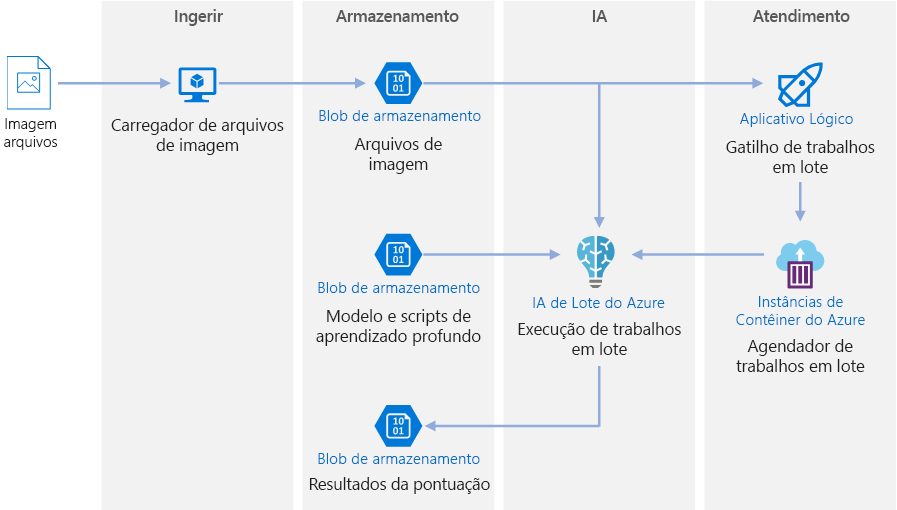
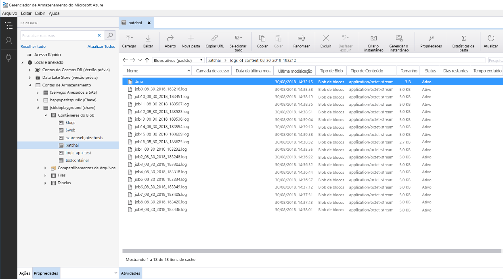

# Pontuação em lote para modelos de aprendizado profundo do AzureBatch scoring on Azure for deep learning models

Essa arquitetura de referência mostra como aplicar a transferência de estilo neural a um vídeo usando a IA do Lote do Azure.This reference architecture shows how to apply neural style transfer to a video, using Azure Batch AI. A *Transferência de estilo* é uma técnica de aprendizado profundo que compõe uma imagem existente no estilo de outra imagem.*Style transfer* is a deep learning technique that composes an existing image in the style of another image. Essa arquitetura pode ser generalizada para qualquer cenário que usa a pontuação do lote com aprendizado profundo.This architecture can be generalized for any scenario that uses batch scoring with deep learning. [**Implantar esta solução**](#deploy-the-solution).[**Deploy this solution**](#deploy-the-solution).

**Cenário**: uma organização de mídia tem um vídeo cujo estilo ela quer alterar para procurar uma pintura específica.**Scenario**: A media organization has a video whose style they want to change to look like a specific painting. A organização quer ser capaz de aplicar esse estilo a todos os quadros do vídeo em tempo hábil e de uma forma automatizada.The organization wants to be able to apply this style to all frames of the video in a timely manner and in an automated fashion. Para saber mais sobre os algoritmos de transferência de estilo neural, consulte [Transferência de estilo de imagem usando redes neurais convolucionais neurais][image-style-transfer] (PDF).For more background about neural style transfer algorithms, see [Image Style Transfer Using Convolutional Neural Networks][image-style-transfer] (PDF).

| Imagem do estilo:Style image: | Vídeo de entrada/conteúdo:Input/content video: | Vídeo de saída:Output video: |
|--------|--------|---------|
|  |  *clique para ver o vídeo* *click to view video* |  *clique para ver o vídeo* *click to view video* |

Essa arquitetura de referência foi projetada para cargas de trabalho que são disparadas pela presença da nova mídia no Armazenamento do Azure.This reference architecture is designed for workloads that are triggered by the presence of new media in Azure storage. O processamento envolve as seguintes etapas:Processing involves the following steps:

1. Carregue uma imagem de estilo específica (como uma pintura do Van Gogh) e um script de transferência de estilo no Armazenamento de Blobs.Upload a selected style image (like a Van Gogh painting) and a style transfer script to Blob Storage.
1. Crie um cluster de dimensionamento automático da IA do Lote que esteja pronto para começar a fazer o trabalho.Create an autoscaling Batch AI cluster that is ready to start taking work.
1. Divida o arquivo de vídeo em quadros individuais e carregue-os no Armazenamento de Blobs.Split the video file into individual frames and upload those frames into Blob Storage.
1. Após o upload de todos os quadros, carregue um arquivo de gatilho no Armazenamento de Blobs.Once all frames are uploaded, upload a trigger file to Blob Storage.
1. Esse arquivo dispara um Aplicativo Lógico que cria um contêiner em execução em Instâncias de Contêiner do Azure.This file triggers a Logic App that creates a container running in Azure Container Instances.
1. O contêiner executa um script que cria os trabalhos de IA do Lote.The container runs a script that creates the Batch AI jobs. Cada trabalho aplica a transferência de estilo neural em paralelo em todos os nós do cluster da IA do Lote.Each job applies the neural style transfer in parallel across the nodes of the Batch AI cluster.
1. Após a geração das imagens, elas são salvas no Armazenamento de Blobs.Once the images are generated, they are saved back to Blob Storage.
1. Faça o download dos quadros gerados e insira as imagens de volta em um vídeo.Download the generated frames, and stitch back the images into a video.

## ArquiteturaArchitecture

Essa arquitetura é formada pelos componentes a seguir.This architecture consists of the following components.

### ComputaçãoCompute

**[IA do Lote do Azure][batch-ai]** é usada para executar o algoritmo de transferência de estilo neural.**[Azure Batch AI][batch-ai]** is used to run the neural style transfer algorithm. A IA do Lote dá suporte a cargas de trabalho de aprendizado profundo fornecendo ambientes em contêineres que são pré-configurados para estruturas de aprendizado profundo, em VMs habilitadas para GPU.Batch AI supports deep learning workloads by providing containerized environments that are pre-configured for deep learning frameworks, on GPU-enabled VMs. A IA do Lote também pode conectar o cluster de computação ao Armazenamento de Blobs.Batch AI can also connect the compute cluster to Blob storage.

### ArmazenamentoStorage

**[Armazenamento de Blobs][blob-storage]** é usado para armazenar todas as imagens (imagens de entrada, imagens de estilo e imagens de saída) bem como todos os logs gerados na IA do Lote.**[Blob storage][blob-storage]** is used to store all images (input images, style images, and output images) as well as all logs produced from Batch AI. O Armazenamento de Blobs se integra à IA do Lote por meio do [blobfuse][blobfuse], um sistema de arquivos virtual de software livre que é apoiado pelo Armazenamento de Blobs.Blob storage integrates with Batch AI via [blobfuse][blobfuse], an open-source virtual filesystem that is backed by Blob storage. O Armazenamento de Blobs também é muito econômico para o desempenho exigido por essa carga de trabalho.Blob storage is also very cost-effective for the performance that this workload requires.

### Gatilho/agendamentoTrigger / scheduling

**[Aplicativos Lógicos do Azure][logic-apps]** são usados para disparar o fluxo de trabalho.**[Azure Logic Apps][logic-apps]** is used to trigger the workflow. Quando o Aplicativo Lógico detecta que um blob foi adicionado ao contêiner, ele dispara o processo da IA do Lote.When the Logic App detects that a blob has been added to the container, it triggers the Batch AI process. O Aplicativo Lógico é ótimo para esta arquitetura de referência porque é uma maneira fácil de detectar alterações no armazenamento de blobs e fornece um processo fácil para alterar o gatilho.Logic Apps is a good fit for this reference architecture because it's an easy way to detect changes to blob storage and provides an easy process for changing the trigger.

**[As Instâncias de Contêiner do Azure][container-instances]** é usado para executar os scripts de Python que criam os trabalhos da IA do Lote.**[Azure Container Instances][container-instances]** is used to run the Python scripts that create the Batch AI jobs. A execução desses scripts dentro de um contêiner do Docker é uma maneira conveniente de executá-los sob demanda.Running these scripts inside a Docker container is a convenient way to run them on demand. Para essa arquitetura, usamos as Instâncias de Contêiner porque não há um conector de Aplicativo Lógico pré-criados para ela, o que permite que o Aplicativo Lógico dispare o trabalho da IA do Lote.For this architecture, we use Container Instances because there is a pre-built Logic App connector for it, which allows the Logic App to trigger the Batch AI job. As Instâncias de Contêiner podem ativar rapidamente os processos sem estado.Container Instances can spin up stateless processes quickly.

**[DockerHub][dockerhub]** é usado para armazenar a imagem do Docker usada pelas Instâncias de Contêiner para executar o processo de criação do trabalho.**[DockerHub][dockerhub]** is used to store the Docker image that Container Instances uses to execute the job creation process. O DockerHub foi escolhido para essa arquitetura por ser fácil de usar e ser o repositório de imagens padrão para usuários do Docker.DockerHub was chosen for this architecture because it's easy to use and is the default image repository for Docker users. O [Registro de Contêiner do Azure][container-registry] também pode ser usado.[Azure Container Registry][container-registry] can also be used.

### Preparação dos dadosData preparation

Essa arquitetura de referência usa filmagens de um orangotango em uma árvore.This reference architecture uses video footage of an orangutan in a tree. Baixe a filmagem [aqui][source-video] e processe-a no fluxo de trabalho executando estas etapas:You can download the footage from [here][source-video] and process it for the workflow by following these steps:

1. Use o [AzCopy][azcopy] para baixar o vídeo do blob público.Use [AzCopy][azcopy] to download the video from the public blob.
2. Use [FFmpeg][ffmpeg] para extrair o arquivo de áudio, para que possa ser inseri-lo de volta posteriormente no vídeo de saída.Use [FFmpeg][ffmpeg] to extract the audio file, so that the audio file can be stitched back into the output video later.
3. Use o FFmpeg para dividir o vídeo em quadros individuais.Use FFmpeg to break the video into individual frames. Os quadros serão processados de forma independente, em paralelo.The frames will be processed independently, in parallel.
4. Use o AzCopy para copiar os quadros individuais em seu contêiner de blob.Use AzCopy to copy the individual frames into your blob container.

Nesse estágio, a filmagem está em um formato que pode ser usado para transferência de estilo neural.At this stage, the video footage is in a form that can be used for neural style transfer.

## Considerações sobre o desempenhoPerformance considerations

### GPU versus CPUGPU vs CPU

Para cargas de trabalho de aprendizado profundo, as GPUs geralmente superam bastante as CPUs, chegando até a exigir um cluster considerável de CPUs para obter um desempenho comparável.For deep learning workloads, GPUs will generally out-perform CPUs by a considerable amount, to the extent that a sizeable cluster of CPUs is usually needed to get comparable performance. Embora seja uma opção usar apenas CPUs nessa arquitetura, as GPUs fornecerão um perfil de custo/desempenho muito melhor.While it's an option to use only CPUs in this architecture, GPUs will provide a much better cost/performance profile. Recomendamos o uso de VMs otimizadas para GPU mais recentes [série NCv3]vm-sizes-gpu.We recommend using the latest [NCv3 series]vm-sizes-gpu of GPU optimized VMs.

As GPUs não estão habilitadas por padrão em todas as regiões.GPUs are not enabled by default in all regions. Selecione uma região com GPUs habilitadas.Make sure to select a region with GPUs enabled. Além disso, as assinaturas têm uma cota padrão de zero núcleos para VMs otimizadas para GPU.In addition, subscriptions have a default quota of zero cores for GPU-optimized VMs. Eleve essa cota abrindo uma solicitação de suporte.You can raise this quota by opening a support request. Verifique se a sua assinatura tem cota suficiente para executar sua carga de trabalho.Make sure that your subscription has enough quota to run your workload.

### Paralelização em VMs versus núcleosParallelizing across VMs vs cores

Ao executar um processo de transferência de estilo como um trabalho em lotes, será necessário paralelizar entre VMs os trabalhos executadas principalmente em GPUs.When running a style transfer process as a batch job, the jobs that run primarily on GPUs will have to be parallelized across VMs. Há duas abordagens possíveis: você pode criar um cluster maior usando VMs que têm uma única GPU, ou criar um cluster menor usando VMs com várias GPUs.Two approaches are possible: You can create a larger cluster using VMs that have a single GPU, or create a smaller cluster using VMs with many GPUs.

Para essa carga de trabalho, essas duas opções terão um desempenho comparável.For this workload, these two options will have comparable performance. Usar menos VMs com mais GPUs por VM pode ajudar a reduzir a movimentação de dados.Using fewer VMs with more GPUs per VM can help to reduce data movement. No entanto, o volume de dados por trabalho para essa carga de trabalho não é muito grande, portanto, você não observará muita limitação por Armazenamento de Blobs.However, the data volume per job for this workload is not very big, so you won't observe much throttling by blob storage.

### Tamanho do lote de imagens por trabalho de IA do LoteImages batch size per Batch AI job

Outro parâmetro deve ser configurado é o número de imagens a serem processadas por um trabalho da IA do Lote.Another parameter that must be configured is the number of images to process per Batch AI job. Por um lado, convém garantir que o trabalho seja distribuído amplamente pelos nós e, se um trabalho falhar, não será necessário repetir muitas imagens.On the one hand, you want to ensure that work is spread broadly across the nodes and that if a job fails, you don't have to retry too many images. Isso indica ter vários trabalhos da IA do Lote e, portanto, menos imagens para processar por trabalho.That points to having many Batch AI jobs and thus a low number of images to process per job. Por outro lado, se poucas imagens forem processadas por trabalho, o tempo de configuração/inicialização ficará aumentará desproporcionalmente.On the other hand, if too few images are processed per job, the setup/startup time becomes disproportionately large. Defina o número de trabalhos igual ao número máximo de nós no cluster.You can set the number of jobs to equal the maximum number of nodes in the cluster. Essa opção proporcionará o melhor desempenho, supondo que nenhum trabalho falhe, pois minimiza o custo de configuração/inicialização.This will be the most performant assuming that no jobs fail, because it minimizes the amount of setup/startup cost. No entanto, se um trabalho falhar, talvez seja necessário reprocessar uma grande quantidade de imagens.However, if a job fails, a large number of images might need to be reprocessed.

### Servidores de arquivosFile servers

Ao usar a IA do Lote, você pode escolher várias opções de armazenamento, dependendo da taxa de transferência necessária para o seu cenário.When using Batch AI, you can choose multiple storage options depending on the throughput needed for your scenario. Para cargas de trabalho que precisam de uma taxa de transferência baixa, usar o Armazenamento de Blobs (por meio do blobfuse) deve ser suficiente.For workloads with low throughput requirements, using blob storage (via blobfuse) should be enough. Como alternativa, a IA do Lote também dá suporte a um Servidor de Arquivos da IA do Lote, um NFS gerenciado de nó único, que pode ser montado automaticamente em nós de cluster para fornecer um local de armazenamento de acesso centralizado para os trabalhos.Alternatively, Batch AI also supports a Batch AI File Server, a managed single-node NFS, which can be automatically mounted on cluster nodes to provide a centrally accessible storage location for jobs. Na maioria dos casos, somente um servidor de arquivos é necessário em um espaço de trabalho e você pode separar os dados de seus trabalhos de treinamento em diretórios diferentes.For most cases, only one file server is needed in a workspace, and you can separate data for your training jobs into different directories. Se o NFS de nó único não for adequado para suas cargas de trabalho, a IA do Lote dá suporte a outras opções de armazenamento, incluindo o Arquivos do Azure ou soluções personalizadas como um sistema de arquivos Gluster ou Lustre.If a single-node NFS isn't appropriate for your workloads, Batch AI supports other storage options, including Azure Files or custom solutions such as a Gluster or Lustre file system.

## Considerações de segurançaSecurity considerations

### Restrição do acesso ao Armazenamento de Blobs do AzureRestricting access to Azure blob storage

Nessa arquitetura de referência, o Armazenamento de Blobs do Azure é o componente de armazenamento principal que precisa ser protegido.In this reference architecture, Azure blob storage is the main storage component that needs to be protected. A implantação de linha de base mostrada no repositório do GitHub usa chaves da conta de armazenamento para acessar o Armazenamento de Blobs.The baseline deployment shown in the GitHub repo uses storage account keys to access the blob storage. Para obter mais controle e proteção, considere o uso de uma SAS (Assinatura de Acesso Compartilhado).For further control and protection, consider using a shared access signature (SAS) instead. Isso concede acesso limitado a objetos no armazenamento, sem a necessidade de codificar as chaves da conta ou salvá-las em um texto não criptografado.This grants limited access to objects in storage, without needing to hard code the account keys or save them in plaintext. Essa abordagem é especialmente útil porque as chaves da conta são visíveis em texto não criptografado dentro da interface do designer do Aplicativo Lógico.This approach is especially useful because account keys are visible in plaintext inside of Logic App's designer interface. Usar uma SAS também ajuda a garantir que a conta de armazenamento tenha uma governança adequada, e que o acesso seja concedido somente para as pessoas certas.Using an SAS also helps to ensure that the storage account has proper governance, and that access is granted only to the people intended to have it.

Para cenários com os dados mais confidenciais, verifique se todas as chaves de armazenamento estão protegidas, pois essas chaves concedem acesso completo a todos os dados de entrada e de saída da carga de trabalho.For scenarios with more sensitive data, make sure that all of your storage keys are protected, because these keys grant full access to all input and output data from the workload.

### Criptografia de dados e movimentação de dadosData encryption and data movement

Essa arquitetura de referência usa transferência de estilo como um exemplo de um processo de pontuação do lote.This reference architecture uses style transfer as an example of a batch scoring process. Para cenários com dados mais confidenciais, os dados no armazenamento devem ser criptografados em repouso.For more data-sensitive scenarios, the data in storage should be encrypted at rest. Sempre que os dados são movidos de um local para o próximo, use SSL para proteger a transferência de dados.Each time data is moved from one location to the next, use SSL to secure the data transfer. Para saber mais, confira o [Guia de segurança de Armazenamento do Azure][storage-security].For more information, see [Azure Storage security guide][storage-security].

### Proteção dos dados em uma rede virtualSecuring data in a virtual network

Ao implantar o cluster da IA do Lote, você pode configurar seu cluster para provisionamento dentro de uma sub-rede de uma rede virtual.When deploying your Batch AI cluster, you can configure your cluster to be provisioned inside a subnet of a virtual network. Isso permite que os nós de computação no cluster se comuniquem com segurança com outras máquinas virtuais, ou até mesmo com uma rede local.This allows the compute nodes in the cluster to communicate securely with other virtual machines, or even with an on-premises network. Você também pode usar [pontos de extremidade de serviço][service-endpoints] com o armazenamento de blobs para conceder acesso de uma rede virtual ou usar um NFS de nó único dentro da VNET com a IA do Lote para garantir que os dados estejam sempre protegidos.You can also use [service endpoints][service-endpoints] with blob storage to grant access from a virtual network or use a single-node NFS inside the VNET with Batch AI to ensure that the data is always protected.

### Proteção contra atividades mal-intencionadasProtecting against malicious activity

Em cenários com vários usuários, proteja os dados confidenciais contra atividades mal-intencionadas.In scenarios where there are multiple users, make sure that sensitive data is protected against malicious activity. Se outros usuários receberem acesso a essa implantação para personalizar os dados de entrada, observe as seguintes precauções e considerações:If other users are given access to this deployment to customize the input data, take note of the following precautions and considerations:

- Use o RBAC para limitar o acesso de usuários somente aos recursos necessários.Use RBAC to limit users' access to only the resources they need.
- Provisione duas contas de armazenamento separadas.Provision two separate storage accounts. Armazene dados de entrada e saída na primeira conta.Store input and output data in the first account. Os usuários externos podem obter acesso a essa conta.External users can be given access to this account. Armazene scripts executáveis e arquivos de log de saída na outra conta.Store executable scripts and output log files in the other account. Os usuários externos não devem ter acesso a essa conta.External users should not have access to this account. Isso garantirá que os usuários externos não possam modificar os arquivos executáveis (para injetar código mal-intencionado) e não tenham acesso a arquivos de log, que podem conter informações confidenciais.This will ensure that external users cannot modify any executable files (to inject malicious code), and don't have access to logfiles, which could hold sensitive information.
- Os usuários mal-intencionados podem executar DDOS na fila de trabalho ou injetar mensagens suspeitas malformadas na fila de trabalho, fazendo com que o sistema trave ou causando erros de remoção da fila.Malicious users can DDOS the job queue or inject malformed poison messages in the job queue, causing the system to lock up or causing dequeuing errors.

## Monitoramento e registro em logMonitoring and logging

### Monitoramento de trabalhos da IA do LoteMonitoring Batch AI jobs

Durante a execução do seu trabalho, é importante monitorar o progresso e certificar-se de que as coisas estão funcionando conforme o esperado.While running your job, it's important to monitor the progress and make sure that things are working as expected. No entanto, pode ser um desafio monitorar um cluster de nós ativos.However, it can be a challenge to monitor across a cluster of active nodes.

Para ter uma ideia do estado geral do cluster, vá até a folha de IA do Lote do Portal do Azure para inspecionar o estado dos nós no cluster.To get a sense of the overall state of the cluster, go to the Batch AI blade of the Azure Portal to inspect the state of the nodes in the cluster. Se um nó estiver inativo ou se um trabalho falhar, os logs de erro serão salvos no armazenamento de blobs e também poderão ser acessados na folha Trabalhos no portal do Azure.If a node is inactive or a job has failed, the error logs are saved to blob storage, and are also accessible in the Jobs blade in the Azure Portal.

É possível melhorar ainda mais o monitoramento conectando os logs ao Application Insights ou executando processos separados para sondar o estado do cluster de IA do Lote e seus trabalhos.Monitoring can be further enriched by connecting logs to Application Insights or by running separate processes to poll for the state of the Batch AI cluster and its jobs.

### Registro em log na IA do LoteLogging in Batch AI

A IA do Lote registrará automaticamente todos os stdout/stderr para a conta de armazenamento de blob associada.Batch AI will automatically log all stdout/stderr to the associate blob storage account. O uso de uma ferramenta de navegação de armazenamento, como o Gerenciador de Armazenamento, fornecerá uma experiência muito mais fácil para navegação em arquivos de log.Using a storage navigation tool such as Storage Explorer will provide a much easier experience for navigating log files.

As etapas de implantação para essa arquitetura de referência também mostra como configurar um sistema mais simples de registro em log, de modo que todos os logs em diferentes trabalhos são salvos no mesmo diretório em seu contêiner de blob, conforme mostrado abaixo.The deployment steps for this reference architecture also shows how to set up a more simple logging system, such that all the logs across the different jobs are saved to the same directory in your blob container, as shown below. Use esses logs para monitorar quanto tempo demora para processar cada imagem e cada trabalho.Use these logs to monitor how long it takes for each job and each image to process. Isso lhe dará uma ideia melhor de como otimizar ainda mais o processo.This will give you a better sense of how to optimize the process even further.

## Considerações de custoCost considerations

Em comparação com os componentes de armazenamento e agendamento, os recursos de computação usados nesta arquitetura de referência dominam em termos de custos.Compared to the storage and scheduling components, the compute resources used in this reference architecture by far dominate in terms of costs. Um dos principais desafios é paralelizar com eficiência o trabalho em um cluster de computadores habilitados para GPU.One of the main challenges is effectively parallelizing the work across a cluster of GPU-enabled machines.

O tamanho do cluster da IA do Lote pode aumentar e diminuir automaticamente dependendo dos trabalhos na fila.The Batch AI cluster size can automatically scale up and down depending on the jobs in the queue. Você pode habilitar o dimensionamento automático com a IA do Lote escolhendo entre duas maneiras.You can enable auto-scale with Batch AI in one of two ways. Você pode isso programaticamente, que pode ser configurado no arquivo `.env` que faz parte das [etapas de implantação][deployment], ou você pode alterar a fórmula de dimensionamento diretamente no portal após a criação do cluster.You can do so programmatically, which can be configured in the `.env` file that is part of the [deployment steps][deployment], or you can change the scale formula directly in the portal after the cluster is created.

Para o trabalho que não exige processamento imediato, configure a fórmula de dimensionamento automático, para que o estado padrão (mínimo) seja um cluster sem nós.For work that doesn't require immediate processing, configure the auto-scale formula so the default state (minimum) is a cluster of zero nodes. Com essa configuração, o cluster começa com zero nós e só pode ser escalado verticalmente quando detecta os trabalhos na fila.With this configuration, the cluster starts with zero nodes and only scales up when it detects jobs in the queue. Se o processo de pontuação do lote acontecer apenas algumas vezes por dia, essa configuração permitirá uma economia considerável.If the batch scoring process only happens a few times a day or less, this setting enables significant cost savings.

Talvez o dimensionamento automático não seja apropriado para trabalhos em lote que aconteçam muito próximos uns dos outros.Auto-scaling may not be appropriate for batch jobs that happen too close to each other. O tempo de ativação e desativação de um cluster também incorre em um custo, portanto, se uma carga de trabalho do lote começar apenas alguns minutos após o término do trabalho anterior, talvez seja mais econômico manter o cluster em execução entre os trabalhos.The time that it takes for a cluster to spin up and spin down also incur a cost, so if a batch workload begins only a few minutes after the previous job ends, it might be more cost effective to keep the cluster running between jobs.

## Implantar a soluçãoDeploy the solution

Para implantar essa arquitetura de referência, execute as etapas descritas no [repositório do GitHub][deployment].To deploy this reference architecture, follow the steps described in the [GitHub repo][deployment].

<!-- links -->

[azcopy]: /azure/storage/common/storage-use-azcopy-linux
[batch-ai]: /azure/batch-ai/
[blobfuse]: https://github.com/Azure/azure-storage-fuse
[blob-storage]: /azure/storage/blobs/storage-blobs-introduction
[container-instances]: /azure/container-instances/
[container-registry]: /azure/container-registry/
[deployment]: https://github.com/Azure/batch-scoring-for-dl-models
[dockerhub]: https://hub.docker.com/
[ffmpeg]: https://www.ffmpeg.org/
[image-style-transfer]: https://www.cv-foundation.org/openaccess/content_cvpr_2016/papers/Gatys_Image_Style_Transfer_CVPR_2016_paper.pdf
[logic-apps]: /azure/logic-apps/
[service-endpoints]: /azure/storage/common/storage-network-security?toc=%2fazure%2fvirtual-network%2ftoc.json#grant-access-from-a-virtual-network
[source-video]: https://happypathspublic.blob.core.windows.net/videos/orangutan.mp4
[storage-security]: /azure/storage/common/storage-security-guide
[vm-sizes-gpu]: /azure/virtual-machines/windows/sizes-gpu