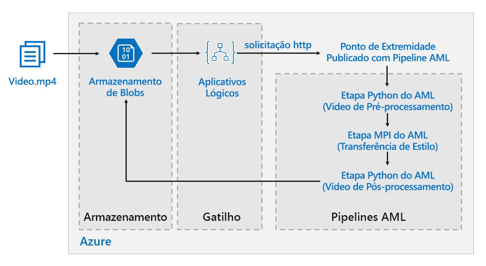

# Pontuação em lote para modelos de aprendizado profundo do Azure

Essa arquitetura de referência mostra como aplicar a transferência de estilo neural a um vídeo usando o Azure Machine Learning. A *Transferência de estilo* é uma técnica de aprendizado profundo que compõe uma imagem existente no estilo de outra imagem. Essa arquitetura pode ser generalizada para qualquer cenário que usa a pontuação do lote com aprendizado profundo. [**Implantar esta solução**](#deploy-the-solution).

**Cenário**: uma organização de mídia tem um vídeo cujo estilo ela quer alterar para procurar uma pintura específica. A organização quer ser capaz de aplicar esse estilo a todos os quadros do vídeo em tempo hábil e de uma forma automatizada. Para saber mais sobre os algoritmos de transferência de estilo neural, consulte [Transferência de estilo de imagem usando redes neurais convolucionais neurais][image-style-transfer] (PDF).

| Imagem do estilo: | Vídeo de entrada/conteúdo: | Vídeo de saída: |
|--------|--------|---------|
|  |  *clique para ver o vídeo* |  *clique para ver o vídeo* |

Essa arquitetura de referência foi projetada para cargas de trabalho que são disparadas pela presença da nova mídia no Armazenamento do Azure.

O processamento envolve as seguintes etapas:

1. Carregar um arquivo de vídeo no armazenamento.
1. O arquivo de vídeo dispara um Aplicativo Lógico que envia uma solicitação para o pipeline de ponto de extremidade publicado do Azure Machine Learning.
1. O pipeline processa o vídeo, aplica a transferência de estilo com o MPI e faz o pós-processamento do vídeo.
1. A saída é salva novamente no armazenamento de blobs depois que o pipeline é concluído.

## Arquitetura

Essa arquitetura é formada pelos componentes a seguir.

### Computação

**[O Serviço Azure Machine Learning][amls]** utiliza pipelines do Azure Machine Learning para criar sequências de computação reproduzíveis e fáceis de gerenciar. Ele também oferece um destino de computação gerenciado (no qual um cálculo de pipeline pode ser executado) chamado [Computação do Azure Machine Learning][aml-compute] para treinamento, implantação e pontuação de modelos de machine learning. 

### Armazenamento

O **[armazenamento de Blobs][blob-storage]** é usado para armazenar todas as imagens (imagens de entrada, imagens de estilo e imagens de saída). O Serviço Azure Machine Learning integra-se com o armazenamento de blobs para que os usuários não precisem mover manualmente os dados entre as plataformas de computação e o armazenamento de blobs. O Armazenamento de Blobs também é muito econômico para o desempenho exigido por essa carga de trabalho.

### Gatilho/agendamento

**[Aplicativos Lógicos do Azure][logic-apps]** são usados para disparar o fluxo de trabalho. Quando o Aplicativo Lógico detecta que um blob foi adicionado ao contêiner, ele dispara o pipeline do Azure Machine Learning. O Aplicativo Lógico é ótimo para esta arquitetura de referência porque é uma maneira fácil de detectar alterações no armazenamento de blobs e fornece um processo fácil para alterar o gatilho.

### Pré-processamento e pós-processamento de nossos dados

Essa arquitetura de referência usa filmagens de um orangotango em uma árvore. Você pode fazer o download das filmagens [aqui][source-video].

1. Use [FFmpeg][ffmpeg] para extrair o arquivo de áudio das filmagens em vídeo para poder inseri-lo de volta posteriormente no vídeo de saída.
1. Use o FFmpeg para dividir o vídeo em quadros individuais. Os quadros serão processados de forma independente, em paralelo.
1. Neste ponto, podemos aplicar a transferência de estilo neural para cada quadro individual em paralelo.
1. Quando cada quadro tiver sido processado, é preciso usar o FFmpeg para juntar os quadros novamente.
1. E, por último, anexe o arquivo de áudio novamente às filmagens reconstituídas.

## Considerações sobre o desempenho

### GPU versus CPU

Para cargas de trabalho de aprendizado profundo, as GPUs geralmente superam bastante as CPUs, chegando até a exigir um cluster considerável de CPUs para obter um desempenho comparável. Embora seja uma opção usar apenas CPUs nessa arquitetura, as GPUs fornecerão um perfil de custo/desempenho muito melhor. Recomendamos o uso de VMs otimizadas para GPU mais recentes [série NCv3]vm-sizes-gpu.

As GPUs não estão habilitadas por padrão em todas as regiões. Selecione uma região com GPUs habilitadas. Além disso, as assinaturas têm uma cota padrão de zero núcleos para VMs otimizadas para GPU. Eleve essa cota abrindo uma solicitação de suporte. Verifique se a sua assinatura tem cota suficiente para executar sua carga de trabalho.

### Paralelização em VMs versus núcleos

Ao executar um processo de transferência de estilo como um trabalho em lotes, será necessário paralelizar entre VMs os trabalhos executadas principalmente em GPUs. Há duas abordagens possíveis: você pode criar um cluster maior usando VMs que têm uma única GPU, ou criar um cluster menor usando VMs com várias GPUs.

Para essa carga de trabalho, essas duas opções terão um desempenho comparável. Usar menos VMs com mais GPUs por VM pode ajudar a reduzir a movimentação de dados. No entanto, o volume de dados por trabalho para essa carga de trabalho não é muito grande, portanto, você não observará muita limitação por Armazenamento de Blobs.

### Etapa de MPI 

Ao criar o pipeline no Azure Machine Learning, uma das etapas usadas para executar a computação paralela é a etapa de MPI. A etapa de MPI ajudará a dividir os dados uniformemente entre os nós disponíveis. A etapa de MPI não será executada até que todos os nós solicitados estejam prontos. Se um nó falhar, ou for esvaziado previamente (se for uma máquina virtual de baixa prioridade), a etapa de MPI precisará ser executada novamente. 

## Considerações de segurança

### Restrição do acesso ao Armazenamento de Blobs do Azure

Nessa arquitetura de referência, o Armazenamento de Blobs do Azure é o componente de armazenamento principal que precisa ser protegido. A implantação de linha de base mostrada no repositório do GitHub usa chaves da conta de armazenamento para acessar o Armazenamento de Blobs. Para obter mais controle e proteção, considere o uso de uma SAS (Assinatura de Acesso Compartilhado). Isso concede acesso limitado a objetos no armazenamento, sem a necessidade de codificar as chaves da conta ou salvá-las em um texto não criptografado. Essa abordagem é especialmente útil porque as chaves da conta são visíveis em texto não criptografado dentro da interface do designer do Aplicativo Lógico. Usar uma SAS também ajuda a garantir que a conta de armazenamento tenha uma governança adequada, e que o acesso seja concedido somente para as pessoas certas.

Para cenários com os dados mais confidenciais, verifique se todas as chaves de armazenamento estão protegidas, pois essas chaves concedem acesso completo a todos os dados de entrada e de saída da carga de trabalho.

### Criptografia de dados e movimentação de dados

Essa arquitetura de referência usa transferência de estilo como um exemplo de um processo de pontuação do lote. Para cenários com dados mais confidenciais, os dados no armazenamento devem ser criptografados em repouso. Sempre que os dados são movidos de um local para o próximo, use SSL para proteger a transferência de dados. Para saber mais, confira o [Guia de segurança de Armazenamento do Azure][storage-security].

### Proteger seu cálculo em uma rede virtual

Ao implantar o cluster de computação do Machine Learning, você pode configurar seu cluster para provisionamento dentro de uma sub-rede de uma [rede virtual][virtual-network]. Isso permite que os nós de computação no cluster se comuniquem com segurança com outras máquinas virtuais. 

### Proteção contra atividades mal-intencionadas

Em cenários com vários usuários, proteja os dados confidenciais contra atividades mal-intencionadas. Se outros usuários receberem acesso a essa implantação para personalizar os dados de entrada, observe as seguintes precauções e considerações:

- Use o RBAC para limitar o acesso de usuários somente aos recursos necessários.
- Provisione duas contas de armazenamento separadas. Armazene dados de entrada e saída na primeira conta. Os usuários externos podem obter acesso a essa conta. Armazene scripts executáveis e arquivos de log de saída na outra conta. Os usuários externos não devem ter acesso a essa conta. Isso garantirá que os usuários externos não possam modificar os arquivos executáveis (para injetar código mal-intencionado) e não tenham acesso a arquivos de log, que podem conter informações confidenciais.
- Os usuários mal-intencionados podem executar DDOS na fila de trabalho ou injetar mensagens suspeitas malformadas na fila de trabalho, fazendo com que o sistema trave ou causando erros de remoção da fila.

## Monitoramento e registro em log

### Monitoramento de trabalhos do Lote

Durante a execução do seu trabalho, é importante monitorar o progresso e certificar-se de que as coisas estão funcionando conforme o esperado. No entanto, pode ser um desafio monitorar um cluster de nós ativos.

Para ter uma ideia do estado geral do cluster, vá até a folha de Machine Learning do Portal do Azure para inspecionar o estado dos nós no cluster. Se um nó estiver inativo ou se um trabalho falhar, os logs de erro serão salvos no armazenamento de blobs e também poderão ser acessados no portal do Azure.

É possível melhorar ainda mais o monitoramento conectando os logs ao Application Insights ou executando processos separados para sondar o estado do cluster e seus trabalhos.

### Registrar em log com o Azure Machine Learning

O Azure Machine Learning registrará automaticamente todos os stdout/stderr na conta de armazenamento de blob associada. Salvo indicação em contrário, seu Workspace do Azure Machine Learning provisionará automaticamente uma conta de armazenamento e despejará os logs nela. Também é possível usar uma ferramenta de navegação de armazenamento, como o Gerenciador de Armazenamento, que fornecerá uma experiência muito mais fácil para navegação em arquivos de log.

## Considerações de custo

Em comparação com os componentes de armazenamento e agendamento, os recursos de computação usados nesta arquitetura de referência dominam em termos de custos. Um dos principais desafios é paralelizar com eficiência o trabalho em um cluster de computadores habilitados para GPU.

O tamanho do cluster de Computação do Machine Learning pode aumentar e diminuir automaticamente dependendo dos trabalhos na fila. Você pode habilitar o dimensionamento automático por meio de programação, definindo os números mínimo e máximo de nós.

Para o trabalho que não exige processamento imediato, configure o dimensionamento automático para que o estado padrão (mínimo) seja um cluster sem nós. Com essa configuração, o cluster começa com zero nós e só pode ser escalado verticalmente quando detecta os trabalhos na fila. Se o processo de pontuação do lote acontecer apenas algumas vezes por dia, essa configuração permitirá uma economia considerável.

Talvez o dimensionamento automático não seja apropriado para trabalhos em lote que aconteçam muito próximos uns dos outros. O tempo de ativação e desativação de um cluster também incorre em um custo, portanto, se uma carga de trabalho do lote começar apenas alguns minutos após o término do trabalho anterior, talvez seja mais econômico manter o cluster em execução entre os trabalhos.

A Computação do Machine Learning também oferece suporte a máquinas virtuais de baixa prioridade. Isso permite executar a computação em máquinas virtuais com desconto, com a ressalva de que elas podem ser previamente esvaziadas a qualquer momento. As máquinas virtuais de baixa prioridade são ideais para cargas de trabalho de pontuação de lote não críticas.

## Implantar a solução

Para implantar essa arquitetura de referência, execute as etapas descritas no [repositório do GitHub][deployment].

> [!NOTE]
> Também é possível implantar uma arquitetura de pontuação de lote para modelos de aprendizado profundo usando o Serviço de Kubernetes do Azure. Execute as etapas descritas neste [Repositório do GitHub][deployment2].

<!-- links -->

[aml-compute]: /azure/machine-learning/service/how-to-set-up-training-targets#amlcompute
[amls]: /azure/machine-learning/service/overview-what-is-azure-ml
[azcopy]: /azure/storage/common/storage-use-azcopy-linux
[blob-storage]: /azure/storage/blobs/storage-blobs-introduction
[container-instances]: /azure/container-instances/
[container-registry]: /azure/container-registry/
[deployment]: https://github.com/Azure/Batch-Scoring-Deep-Learning-Models-With-AML
[deployment2]: https://github.com/Azure/Batch-Scoring-Deep-Learning-Models-With-AKS
[ffmpeg]: https://www.ffmpeg.org/
[image-style-transfer]: https://www.cv-foundation.org/openaccess/content_cvpr_2016/papers/Gatys_Image_Style_Transfer_CVPR_2016_paper.pdf
[logic-apps]: /azure/logic-apps/
[source-video]: https://happypathspublic.blob.core.windows.net/videos/orangutan.mp4
[storage-security]: /azure/storage/common/storage-security-guide
[vm-sizes-gpu]: /azure/virtual-machines/windows/sizes-gpu
[virtual-network]: /azure/machine-learning/service/how-to-enable-virtual-network
