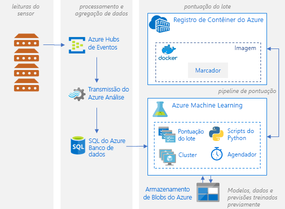
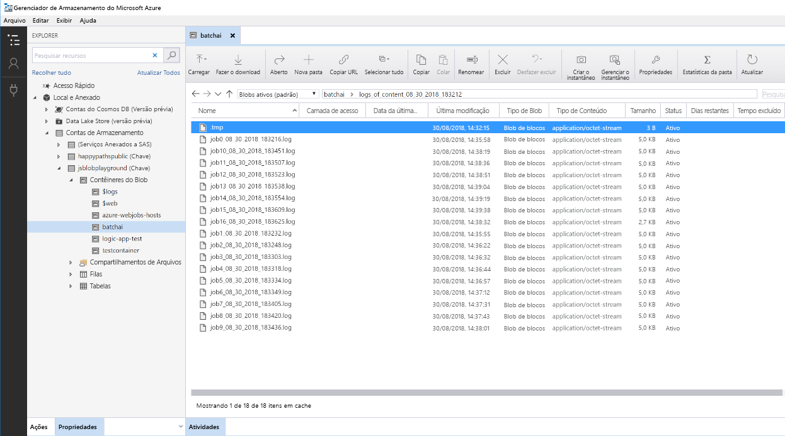

# Pontuação em lote de modelos Python no Azure

Esta arquitetura de referência mostra como compilar uma solução escalonável para pontuar vários modelos em lote com agendamento em paralelo usando o IA do Lote do Azure. A solução pode ser usada como um modelo e pode ser generalizada para problemas diferentes.

Há uma implantação de referência para essa arquitetura disponível no  [GitHub][github].

**Cenário**: A solução monitora a operação de um grande número de dispositivos em uma configuração de IoT, em que cada dispositivo envia leituras do sensor continuamente. Assume-se que cada dispositivo tem modelos de detecção de anomalias pré-treinados que precisam ser usados para prever se uma série de medidas, agregadas em um intervalo de tempo predefinido, correspondem a uma anomalia ou não. Em cenários do mundo real, isso seria um fluxo de leituras de sensor que precisariam ser filtrados e agregados antes de serem usados em treinamento ou pontuação em tempo real. Para manter a simplicidade, a solução usa o mesmo arquivo de dados na execução de trabalhos de pontuação.

## Arquitetura

Essa arquitetura é formada pelos seguintes componentes:

[Hubs de Eventos do Azure][event-hubs]. Esse serviço de ingestão de mensagens pode incluir milhões de mensagens de eventos por segundo. Nesta arquitetura, os sensores enviam um fluxo de dados para o hub de eventos.

[Azure Stream Analytics][stream-analytics]. Um mecanismo de processamento de eventos. Um trabalho do Stream Analytics lê os fluxos de dados do hub de eventos e executa o processamento de fluxo.

[IA do Lote do Azure][batch-ai]. Esse mecanismo de computação distribuída é usado para treinar e testar modelos de machine learning e de inteligência artificial em larga escala no Azure. A IA do Lote cria máquinas virtuais sob demanda com uma opção de dimensionamento automático, em que cada nó no cluster do IA do Lote executa um trabalho de pontuação para um sensor específico. O  [script][python-script] de pontuação em Python é executado em contêineres do Docker que são criados em cada nó do cluster, onde ele lê os dados de sensor relevantes, gera previsões e as armazena no Armazenamento de Blobs.

[Armazenamento de Blobs do Azure][storage]. Os contêineres de blob são usados para armazenar os modelos pré-treinados, os dados e as previsões de saída. Os modelos são carregados no Armazenamento de Blobs no notebook [create\_resources.ipynb] [ create-resources]. Esses modelos de [SVM de classe única][one-class-svm] são treinados com dados que representam valores de sensores diferentes em dispositivos diferentes. A solução pressupõe que os valores de dados foram agregados em um intervalo fixo de tempo.

[Aplicativos Lógicos do Azure][logic-apps]. Esta solução cria um Aplicativo Lógico que executa trabalhos da IA do Lote a cada hora. Os Aplicativos Lógicos fornecem uma maneira fácil de criar o fluxo de trabalho de tempo de execução e o agendamento para a solução. Os trabalhos da IA do Lote são enviados usando um [script][script] em Python que também é executado em um contêiner do Docker.

[Registro de Contêiner do Azure][acr]. As Imagens do Docker são usadas nos Aplicativos Lógicos e na IA do Lote, e são criadas no notebook [create\_resources.ipynb][create-resources]; em seguida, são enviadas por push ao Registro de Contêiner. Isso fornece uma maneira conveniente para hospedar imagens e criar instâncias de contêineres por meio de outros serviços do Azure; no caso desta solução, os Aplicativos Lógicos e a IA do Lote.

## Considerações sobre o desempenho

Para modelos Python normais, é geralmente aceito que as CPUs são suficientes para lidar com a carga de trabalho. Esta arquitetura usa CPUs. No entanto, para [cargas de trabalho de aprendizado profundo][deep], as GPUs geralmente superam bastante as CPUs; elas costumam exigir um cluster considerável de CPUs para obter um desempenho comparável.

### Paralelização em VMs versus núcleos

Ao executar processos de pontuação de vários modelos em modo de lote, os trabalhos precisam ser colocados em paralelo entre VMs. Há duas abordagens possíveis:

* Criar um cluster maior usando VMs de baixo custo.

* Criar um cluster menor usando VMs de alto desempenho com mais núcleos disponíveis em cada uma.

Em geral, a pontuação de modelos Python padrão não é tão exigente quanto a pontuação de modelos de aprendizado profundo, e um pequeno cluster deve ser capaz de lidar com um grande número de modelos em fila eficientemente. Você pode aumentar o número de nós de cluster de acordo com o aumento dos tamanhos do conjunto de dados.

Por questões de conveniência neste cenário, uma tarefa de pontuação é enviada dentro de um único trabalho da IA do Lote. No entanto, pode ser mais eficiente pontuar várias partes de dados dentro do mesmo trabalho da IA do Lote. Nesses casos, escreva código personalizado para ler vários conjuntos de dados e executar o script de pontuação para eles durante uma mesma execução de trabalho da IA do Lote.

### Servidores de arquivos

Ao usar a IA do Lote, você pode escolher várias opções de armazenamento, dependendo da taxa de transferência necessária para o seu cenário. Para cargas de trabalho que precisam de uma taxa de transferência baixa, o uso do armazenamento de blobs deve ser suficiente. Como alternativa, a IA do Lote também dá suporte a um [Servidor de Arquivos da IA do Lote][bai-file-server], um NFS gerenciado de nó único, que pode ser montado automaticamente em nós de cluster para fornecer um local de armazenamento de acesso centralizado para trabalhos. Na maioria dos casos, somente um servidor de arquivos é necessário em um espaço de trabalho e você pode separar os dados de seus trabalhos de treinamento em diretórios diferentes.

Se o NFS de nó único não for adequado para suas cargas de trabalho, a IA do Lote dá suporte a outras opções de armazenamento, incluindo o [Azure Files][azure-files] e soluções personalizadas, como um sistema de arquivos Gluster ou Lustre.

## Considerações de gerenciamento

### Monitoramento de trabalhos da IA do Lote

É importante monitorar o progresso de trabalhos em execução, mas pode ser um desafio monitorá-los em um cluster de nós ativos. Para ter uma ideia do estado geral do cluster, vá até a folha de **IA do Lote** do [Portal do Azure][portal] para inspecionar o estado dos nós no cluster. Se um nó estiver inativo ou se um trabalho falhar, os logs de erro serão salvos no armazenamento de blobs e também poderão ser acessados na folha **Trabalhos** no portal.

Para um monitoramento mais avançado, conecte os logs ao [Application Insights][ai], ou execute processos separados para sondar o estado do cluster da IA do Lote e de seus trabalhos.

### Registro em log na IA do Lote

A IA do Lote registra todos os stdout/stderr da conta do Armazenamento do Azure associada. Para facilitar a navegação dos arquivos de log, use uma ferramenta de navegação de armazenamento, como o [Gerenciador de Armazenamento do Azure][explorer].

Quando você implanta esta arquitetura de referência, tem a opção de configurar um sistema de registro em log mais simples. Com essa opção, todos os logs nos diferentes trabalhos são salvos no mesmo diretório em seu contêiner de blobs, conforme mostrado abaixo. Use esses logs para monitorar quanto tempo demora para processar cada imagem e cada trabalho, para que você tenha uma noção melhor de como otimizar o processo.

## Considerações de custo

Os componentes mais caros usados nesta arquitetura de referência são os recursos de computação.

O tamanho do cluster da IA do Lote é escalado e reduzido verticalmente dependendo dos trabalhos na fila. Você pode habilitar o [dimensionamento automático][automatic-scaling] com a IA do Lote das duas maneiras. É possível fazer isso programaticamente, fazendo a configuração no arquivo .env que faz parte das [etapas de implantação][github], ou pela alteração da fórmula de dimensionamento diretamente no portal após a criação do cluster.

Para trabalho que não exige processamento imediato, configure a fórmula de dimensionamento automático a fim de definir o estado padrão (mínimo) como um cluster sem nós. Com essa configuração, o cluster começa com zero nós e só pode ser escalado verticalmente quando detecta os trabalhos na fila. Se o processo de pontuação do lote acontecer apenas algumas vezes por dia, essa configuração permitirá uma economia considerável.

Talvez o dimensionamento automático não seja apropriado para trabalhos em lote que aconteçam muito próximos uns dos outros. O tempo de ativação e desativação de um cluster também incorre em um custo, portanto, se uma carga de trabalho do lote começar apenas alguns minutos após o término do trabalho anterior, talvez seja mais econômico manter o cluster em execução entre os trabalhos. Isso depende da frequência de agendamento dos processos de pontuação, com alta frequência (a cada hora, por exemplo) ou com baixa frequência (uma vez por mês, por exemplo).

## Implantar a solução

Há uma implantação de referência para essa arquitetura disponível no [GitHub][github]. Siga as etapas de configuração para criar uma solução escalonável e pontuar muitos modelos em paralelo usando a IA do Lote.

[acr]: /azure/container-registry/container-registry-intro
[ai]: /azure/application-insights/app-insights-overview
[automatic-scaling]: /azure/batch/batch-automatic-scaling
[azure-files]: /azure/storage/files/storage-files-introduction
[batch-ai]: /azure/batch-ai/
[bai-file-server]: /azure/batch-ai/resource-concepts#file-server
[create-resources]: https://github.com/Azure/BatchAIAnomalyDetection/blob/master/create_resources.ipynb
[deep]: /azure/architecture/reference-architectures/ai/batch-scoring-deep-learning
[event-hubs]: /azure/event-hubs/event-hubs-geo-dr
[explorer]: https://azure.microsoft.com/en-us/features/storage-explorer/
[github]: https://github.com/Azure/BatchAIAnomalyDetection
[logic-apps]: /azure/logic-apps/logic-apps-overview
[one-class-svm]: http://scikit-learn.org/stable/modules/generated/sklearn.svm.OneClassSVM.html
[portal]: https://portal.azure.com
[python-script]: https://github.com/Azure/BatchAIAnomalyDetection/blob/master/batchai/predict.py
[script]: https://github.com/Azure/BatchAIAnomalyDetection/blob/master/sched/submit_jobs.py
[storage]: /azure/storage/blobs/storage-blobs-overview
[stream-analytics]: /azure/stream-analytics/
