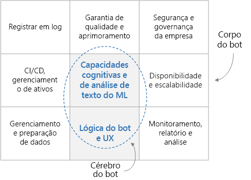

# Bot conversacional de nível empresarial

Esta arquitetura de referência descreve como criar um bot conversacional (chatbot) de nível empresarial usando o [Azure Bot Framework][bot-framework]. Cada bot é diferente, mas há alguns padrões, fluxos de trabalho e tecnologias comuns a se considerar. Especialmente no que diz respeito a um bot que serve para cargas de trabalho corporativas, existem muitas considerações de design além da funcionalidade básica. Este artigo aborda os aspectos de design mais essenciais e introduz as ferramentas necessárias para a criação de um bot robusto, seguro e que aprende ativamente.

[![Diagrama da arquitetura][0]][0]

Os exemplos de utilitário de práticas recomendadas usados nesta arquitetura são de software livre e estão disponíveis no [GitHub][git-repo-base]. 

## Arquitetura

A arquitetura mostrada aqui usa os serviços do Azure a seguir. Seu próprio bot pode não usar todos esses serviços, ou pode incorporar serviços adicionais.

### Lógica do bot e experiência do usuário

- **[BFS] [ bot-framework-service]**  (Bot Framework Service). Esse serviço conecta o bot a um aplicativo de comunicação, como Cortana, Facebook Messenger ou Slack. Ele facilita a comunicação entre o bot e o usuário.
- **[Serviço de Aplicativo do Azure][app-service]**. A lógica de aplicativo do bot fica hospedada no Serviço de Aplicativo do Azure.

### Inteligência e cognição do bot

- **[Reconhecimento Vocal][luis]** (LUIS). O LUIS, parte dos [Serviços Cognitivos do Azure][cognitive-services], permite que o bot compreenda linguagem natural e identifique entidades e intenções do usuário.
- **[Azure Search][search]**. O Search é um serviço gerenciado que fornece um índice de documento com pesquisa rápida.
- **[QnA Maker][qna-maker]**. O QnA Maker é um serviço de API baseado em nuvem que cria uma camada de perguntas e respostas em formato de conversação sobre seus dados. Normalmente, ele é carregado com conteúdo semiestruturado, por exemplo, perguntas frequentes. Use-o para criar uma base de dados de conhecimento e responder a perguntas em linguagem natural.
- **[Aplicativo Web][webapp]**. Se o bot precisar de soluções de IA que não sejam fornecidas por um serviço existente, você poderá implementar sua própria IA personalizada e hospedá-la como um aplicativo Web. Isso fornece um ponto de extremidade da Web que o bot pode chamar.

### Ingestão de dados

O bot se baseará em dados brutos que precisam ser ingeridos e preparados. Considere uma das seguintes opções para orquestrar o processo:

- **[Azure Data Factory][data-factory]**. O Data Factory orquestra e automatiza a movimentação de dados e a transformação de dados.
- **[Aplicativos Lógicos][logic-apps]**. Os Aplicativos Lógicos são uma plataforma sem servidor para compilar fluxos de trabalho que integram aplicativos, dados e serviços. Os Aplicativos Lógicos fornecem conectores de dados para muitos aplicativos, incluindo o Office 365.
- **[Azure Functions][functions]**. Você pode usar o Azure Functions para escrever um código sem servidor personalizado que é invocado por um [gatilho] [ functions-triggers] &mdash;, por exemplo, sempre que um documento é adicionado ao Armazenamento de Blobs ou ao Cosmos DB.

### Log e monitoramento

- **[Application Insights][app-insights]**. Use o Application Insights a fim de registrar a métrica de aplicativo do bot em log para fins de monitoramento, diagnóstico e análise.
- **[Armazenamento de Blobs do Azure][blob]**. O Armazenamento de Blobs é otimizado para armazenar grandes quantidades de dados não estruturados.
- **[Cosmos DB][cosmosdb]**. O Cosmos DB é adequado para armazenar dados de log semiestruturados, como conversas.
- **[Power BI][power-bi]**. Use o Power BI a fim de criar painéis de monitoramento para o bot.

### Governança e segurança

- **[Azure AD][aad]** (Azure Active Directory). Os usuários serão autenticados por meio de um provedor de identidade, como o Azure AD. O Serviço de Bot controla o fluxo de autenticação e o gerenciamento de token OAuth. Consulte [Adicionar autenticação ao bot por meio do Serviço de Bot do Azure][bot-authentication].
- **[Azure Key Vault][key-vault]**. Armazene credenciais e outros segredos usando o Key Vault.

### Aprimoramentos e garantia de qualidade

- **[Azure DevOps][devops]**. Fornece muitos serviços para gerenciamento de aplicativo, incluindo controle do código-fonte, criação, teste, implantação e acompanhamento de projetos.
- **[VS Code] [ vscode]** Um editor de código leve para desenvolvimento de aplicativos. Você pode usar qualquer outro IDE com recursos semelhantes.

## Considerações sobre o design

Em um alto nível, um bot conversacional pode ser dividido entre a funcionalidade de bot (o “cérebro”) e um conjunto de requisitos periféricos (o “corpo”). O cérebro inclui os componentes com reconhecimento de domínio, incluindo a lógica de bot e os recursos de ML. Outros componentes independem do domínio e lidam com requisitos não funcionais, como CI/CD, garantia de qualidade e segurança.

Antes de abordarmos as especificidades da arquitetura, vamos começar com o fluxo de dados por cada subcomponente do design. O fluxo de dados inclui fluxos de dados iniciados pelo usuário e pelo sistema.

### Fluxo de mensagens do usuário

**Autenticação**. Os usuários começam se autenticando por meio do mecanismo fornecido pelo canal de comunicação com o bot. O Bot Framework dá suporte a vários canais de comunicação, incluindo Cortana, Microsoft Teams, Facebook Messenger, Kik e Slack. Para obter uma lista de canais, confira [Conectar um bot aos canais](/azure/bot-service/bot-service-manage-channels). Quando você cria um bot com o Serviço de Bot do Azure, o canal [Webchat][webchat] é configurado automaticamente. Esse canal permite que os usuários interajam com o bot diretamente em uma página da Web. Você também pode conectar o bot a um aplicativo personalizado usando o canal [Direct Line](/azure/bot-service/bot-service-channel-connect-directline). A identidade do usuário é usada para permitir controle de acesso baseado em função e para fornecer conteúdo personalizado.

**Mensagem do usuário**. Uma vez autenticado, o usuário envia uma mensagem ao bot. O bot lê a mensagem e a encaminha a um serviço de reconhecimento de linguagem natural, como o [LUIS](/azure/cognitive-services/luis/). Esta etapa obtém as **intenções** (o que o usuário deseja fazer) e as **entidades** (as coisas em que o usuário está interessado). Em seguida, o bot cria uma consulta e a repassa a um serviço que fornece informações, como o [Azure Search] [ search] para recuperação de documentos, o [QnA Maker](https://www.qnamaker.ai/) para perguntas frequentes, ou uma base de conhecimento personalizada. O bot usa esses resultados para construir uma resposta. A fim de conseguir o melhor resultado para determinada consulta, o bot pode fazer várias chamadas bidirecionais para esses serviços remotos.

**Resposta**. Neste ponto, o bot determinou a melhor resposta e a envia para o usuário. Se a pontuação de confiança da melhor resposta correspondente for baixa, a resposta poderá ser uma pergunta pedindo esclarecimentos ou uma confirmação de que o bot não pôde responder adequadamente.

**Registro em log**. Quando uma solicitação de usuário é recebida ou uma resposta é enviada, todas as ações de conversa devem ser registradas em um repositório de log, juntamente com métricas de desempenho e erros gerais de serviços externos. Esses logs serão úteis mais tarde para diagnosticar problemas e melhorar o sistema.

**Comentários**. Outra prática recomendada é coletar as pontuações de satisfação e os comentários dos usuários. Como um acompanhamento da resposta final do bot, este deve pedir ao usuário que classifique sua satisfação com a resposta dada. Os comentários podem ajudá-lo a resolver o problema inicial de reconhecimento de linguagem natural e a melhorar continuamente a precisão das respostas.

### Fluxo de dados do sistema

**ETL**. O bot se baseia em informações e conhecimento extraídos dos dados brutos por um processo de ETL no back-end. Esses dados podem ser estruturados (banco de dados SQL), semiestruturados (sistema de CRM, perguntas frequentes) ou não estruturados (documentos do Word, PDFs, blogs). Um subsistema de ETL extrai os dados em um cronograma fixo. O conteúdo é transformado, aprimorado e carregado em um armazenamento de dados intermediários, como o Cosmos DB ou o Armazenamento de Blobs do Azure.

Os dados no repositório intermediário são indexados no Azure Search para recuperação de documentos, carregados no QnA Maker para criar pares de pergunta e resposta ou carregados em um aplicativo Web personalizado para processamento de texto não estruturado. Os dados também são usados para treinar o modelo LUIS na extração de entidade e de intenção.

**Garantia de qualidade**. Os logs de conversa são usados para diagnosticar e corrigir bugs, fornecer informações sobre como o bot está sendo usado e acompanhar o desempenho geral. Os dados de comentários são úteis para readaptar modelos de IA e melhorar o desempenho do bot.

## Criação de um bot

Antes de você escrever uma única linha de código, é importante escrever uma especificação funcional para que a equipe de desenvolvimento tenha uma ideia clara do objetivo do bot. A especificação deve incluir uma lista razoavelmente abrangente de entradas do usuário e de respostas esperadas do bot em vários domínios de conhecimento. Esse documento dinâmico será um guia inestimável para desenvolver e testar seu bot.

### Ingestão de dados

Em seguida, identifique as fontes de dados que permitirão que o bot interaja de forma inteligente com usuários. Como mencionado anteriormente, essas fontes de dados podem conter conjuntos de dados estruturados, semiestruturados ou não estruturados. Quando você está começando, uma boa abordagem é fazer uma cópia única dos dados em um armazenamento central, como o Cosmos DB ou o Armazenamento do Azure. Conforme você vai progredindo, deverá criar um pipeline de ingestão de dados automatizado para manter esses dados atualizados. Opções para um pipeline de ingestão automatizado incluem o Data Factory, o Functions e os Aplicativos Lógicos. Dependendo dos armazenamentos de dados e dos esquemas, você pode usar uma combinação dessas abordagens.

Enquanto você está começando, é sensato usar o portal do Azure para criar recursos do Azure manualmente. Mais tarde, convém pensar em automatizar a implantação desses recursos.

### Lógica principal do bot e experiência do usuário

Quando você já tiver uma especificação e alguns dados, é hora de começar a tornar seu bot realidade. Vamos nos concentrar na lógica principal do bot. Ela é o código que manipula a conversa com o usuário, incluindo a lógica de roteamento, a lógica de desambiguação e o registro em log. Comece a familiarizar-se com o [Bot Framework][bot-framework], incluindo:

- Conceitos básicos e terminologia usada na estrutura, especialmente [conversations], [turns] e [activities].
- O [serviço do Bot Connector](/azure/bot-service/rest-api/bot-framework-rest-connector-quickstart), que trata da rede entre o bot e seus canais.
- Como o [estado](/azure/bot-service/bot-builder-concept-state) da conversa é mantido, seja na memória ou, melhor ainda, em um armazenamento, como o Armazenamento de Blobs do Azure ou o Azure Cosmos DB.
- [Middleware](/azure/bot-service/bot-builder-basics#middleware) e como ele pode ser usado para conectar o bot a serviços externos, como os Serviços Cognitivos.

Para uma [experiência do usuário](/azure/bot-service/bot-service-design-user-experience) avançada, há muitas opções.

- Você pode usar [cartões](/azure/bot-service/bot-service-design-user-experience#cards) para incluir imagens, botões, carrosséis e menus.
- Um bot pode dar suporte a fala.
- Você pode até mesmo incorporar o bot a um aplicativo ou site e usar os recursos do aplicativo que o está hospedando.

Para começar, você pode criar o bot online usando o [Serviço de Bot do Azure](/azure/bot-service/bot-service-quickstart), escolhendo entre os modelos de C# e Node.js disponíveis. No entanto, à medida que seu bot ficar mais sofisticado, você precisará criar o bot localmente e implantá-lo na Web. Escolha um IDE, como o Visual Studio ou o Visual Studio Code, e uma linguagem de programação. Há SDKs disponíveis para as seguintes linguagens:

- [C#](https://github.com/microsoft/botbuilder-dotnet)
- [JavaScript](https://github.com/microsoft/botbuilder-js)
- [Java](https://github.com/microsoft/botbuilder-java) (versão prévia)
- [Python](https://github.com/microsoft/botbuilder-python) (versão prévia)

Como ponto de partida, você pode fazer o download do código-fonte para o bot que foi criado com o Serviço de Bot do Azure. Você também pode encontrar [código de exemplo](https://github.com/Microsoft/BotBuilder-Samples/blob/master/README.md), desde bots de eco simples a bots mais sofisticados que se integram a vários serviços de IA.

### Adicionar experiência ao bot

Para um bot simples com uma lista bem definida de comandos, você pode usar uma abordagem baseada em regras para analisar a entrada do usuário por meio de regex. Isso tem a vantagem de ser determinístico e compreensível. No entanto, quando o bot precisa entender as intenções e entidades de uma mensagem de linguagem mais natural, há serviços de IA que podem ajudar.

- O LUIS foi projetado especificamente para entender as entidades e intenções do usuário. Treine-o com uma coleção de tamanho moderado de [entradas do usuário](/azure/cognitive-services/luis/luis-concept-utterance) relevantes e respostas desejadas, e ele retornará as intenções e entidades de determinada mensagem de um usuário.

- O Azure Search pode trabalhar junto com o LUIS. Usando o Search, você cria índices pesquisáveis de todos os dados relevantes. O bot consulta esses índices em relação às entidades extraídas pelo LUIS. O Azure Search também dá suporte a [sinônimos][synonyms], o que pode ampliar a rede de mapeamentos de palavra correta.

- O QnA Maker é outro serviço projetado para retornar respostas a determinadas perguntas. Normalmente, ele é treinado com dados semiestruturados, como as perguntas frequentes.

Seu bot pode usar outros serviços de IA para aprimorar ainda mais a experiência do usuário. O [conjunto dos Serviços Cognitivos de serviços de IA pré-criados](https://azure.microsoft.com/en-us/services/cognitive-services/?v=18.44a) (que inclui o LUIS e o QnA Maker) tem serviços para visão, fala, idioma, pesquisa e localização. Você pode adicionar rapidamente funcionalidades como tradução de idiomas, verificação ortográfica, análise de sentimento, OCR, reconhecimento de local e moderação de conteúdo. Esses serviços podem ser conectados como módulos de middleware no bot para ele interagir de forma mais natural e inteligente com o usuário.

Outra opção é integrar seu próprio serviço de IA personalizado. Essa abordagem é mais complexa, mas dá total flexibilidade em termos de algoritmo, treinamento e modelo de aprendizado de máquina. Por exemplo, você poderia implementar sua própria modelagem de tópico e usar algoritmo como [LDA] [ lda] para localizar documentos semelhantes ou relevantes. Uma boa abordagem é expor sua solução de IA personalizada como um ponto de extremidade de serviço Web e, em seguida, chamar o ponto de extremidade de lógica principal do bot. O serviço Web pode estar hospedado no Serviço de Aplicativo ou em um cluster de VMs. [O Azure Machine Learning][aml] oferece vários serviços e bibliotecas para ajudá-lo a [treinar](https://github.com/Azure/MachineLearningNotebooks/tree/master/how-to-use-azureml/training) e [implantar](https://github.com/Azure/MachineLearningNotebooks/tree/master/how-to-use-azureml/deployment) seus modelos.

## Aprimoramento e garantia de qualidade

**Registro em log**. Registre as conversas de usuário com o bot em log, incluindo as métricas de desempenho subjacentes e eventuais erros. Esses logs serão de grande valia para depurar problemas, entender as interações do usuário e aprimorar o sistema. Diferentes armazenamentos de dados servem para diferentes tipos de logs. Por exemplo, pense em usar o Application Insights para blobs, o Cosmos DB para conversas e o Armazenamento do Azure para grandes cargas. Confira [Gravar diretamente no Armazenamento do Azure][transcript-storage].

**Comentários**. Também é importante entender o grau de satisfação dos usuários com suas interações de bot. Se você tiver um registro de comentários do usuário, poderá usar esses dados para concentrar seus esforços em aprimorar determinadas interações e readaptar os modelos de IA para melhorar o desempenho. Use os comentários para readaptar os modelos, como o LUIS, em seu sistema.

**Testando**. Testar um bot envolve testes de unidade, testes de integração, testes de regressão e testes funcionais. Para fazer os testes, é recomendável registrar respostas HTTP reais de serviços externos, como o Azure Search ou o QnA Maker, para que eles possam ser reproduzidos durante o teste de unidade sem precisar fazer chamadas de rede reais aos serviços externos.

>[!NOTE]
> Para impulsionar o desenvolvimento nessas áreas, examine os [Utilitários de Bot Builder para JavaScript][git-repo-base]. Esse repositório contém um exemplo de código de utilitário para bots criados com o [Microsoft Bot Framework v4] [ bot-framework] que executam Node.js. Ele inclui os seguintes pacotes:
>
> - [Armazenamento de registro em log do Cosmos DB][cosmosdb-logger]. Mostra como armazenar e consultar logs de bot no Cosmos DB.
> - [Armazenamento de registro em log do Application Insights][appinsights-logger]. Mostra como armazenar e consultar os logs de bot no Application Insights.
> - [Middleware de coleta de comentários][feedback-util]. Middleware de exemplo que fornece um mecanismo de solicitação de comentários do usuário do bot.
> - [Gravador de Teste HTTP][testing util]. Grava tráfego HTTP de serviços externos ao bot. Ele vem criado previamente com suporte para o LUIS, o Azure Search e o QnAMaker, mas há extensões disponíveis para dar suporte a qualquer serviço. Isso ajuda você a automatizar o teste do bot.
>
> Esses pacotes são fornecidos como código de exemplo do utilitário e vêm sem garantia de suporte ou atualizações.

## Considerações sobre disponibilidade

Ao distribuir novos recursos ou correções de bugs para o bot, é melhor usar vários ambientes de implantação, como preparo e produção. O uso de [slots][ slots] de implantação do [Azure DevOps ][devops] permite que você faça isso sem incorrer em tempo de inatividade. Você pode testar suas atualizações mais recentes no ambiente de preparo antes de passá-las para o ambiente de produção. Em termos de tratamento de carga, o Serviço de Aplicativo foi projetado para escalar vertical ou horizontalmente, de forma manual ou automática. Como seu bot fica hospedado na infraestrutura de datacenter global da Microsoft, o SLA do Serviço de Aplicativo promete alta disponibilidade.

## Considerações de segurança

Assim como acontece com qualquer outro aplicativo, o bot pode ser projetado para lidar com dados confidenciais. Ou seja: restringir quem pode entrar e usar o bot. Também limitar quais dados podem ser acessados com base na identidade ou na função do usuário. Use o Azure AD para o controle de acesso e identidade e o Key Vault para gerenciar chaves e segredos.

## Considerações sobre capacidade de gerenciamento

### Monitoramento e emissão de relatórios

Depois que o bot é executado na produção, você precisará de uma equipe de DevOps para mantê-lo em funcionamento. Monitore o sistema continuamente para fazer com que o bot tenha desempenho máximo. Use os logs enviados ao Application Insights ou ao Cosmos DB para criar painéis de monitoramento, seja usando o próprio Application Insights, o Power BI ou um painel de aplicativo Web personalizado. Envie alertas para a equipe de DevOps em caso de erros críticos ou desempenho abaixo do limite aceitável.

### Implantação automática de recursos

O bot em si é apenas parte de um sistema maior que fornece a ele os dados mais recentes e garante seu devido funcionamento. Todos esses outros serviços de orquestração &mdash; de dados dos recursos do Azure, como o Data Factory, serviços de armazenamento, como o Cosmos DB, e assim por diante &mdash; devem ser implantados. O Azure Resource Manager fornece uma camada de gerenciamento consistente que você pode acessar pelo portal do Azure, pelo PowerShell ou pela CLI do Azure. Para fins de velocidade e consistência, é melhor automatizar a implantação usando uma das abordagens apresentadas.

### Implantação contínua do bot

Você pode implantar a lógica do bot diretamente de seu IDE ou de uma linha de comando, como a CLI do Azure. No entanto, à medida que seu bot amadurece, é melhor usar um processo de implantação contínua com uma solução de CI/CD como o Azure DevOps, conforme descrito no artigo [Configurar implantação contínua](/azure/bot-service/bot-service-build-continuous-deployment). Essa é uma boa maneira de reduzir o atrito ao testar novos recursos e correções no bot em um ambiente quase igual ao de produção. Também é uma boa ideia ter vários ambientes de implantação; no mínimo, um de preparo e um de produção. O Azure DevOps dá suporte a essa abordagem.

<!-- links -->

[0]: ./_images/conversational-bot.png
[aad]: /azure/active-directory/
[activities]: /azure/bot-service/rest-api/bot-framework-rest-connector-activities
[aml]: /azure/machine-learning/service/
[app-insights]: /azure/azure-monitor/app/app-insights-overview
[app-service]: /azure/app-service/
[blob]: /azure/storage/blobs/storage-blobs-introduction
[bot-authentication]: /azure/bot-service/bot-builder-authentication
[bot-framework]: https://dev.botframework.com/
[bot-framework-service]: /azure/bot-service/bot-builder-basics
[cognitive-services]: /azure/cognitive-services/welcome
[conversations]: /azure/bot-service/bot-service-design-conversation-flow
[cosmosdb]: /azure/cosmos-db/
[data-factory]: /azure/data-factory/
[data-factory-ref-arch]: ../data/enterprise-bi-adf.md
[devops]: https://azure.microsoft.com/solutions/devops/
[functions]: /azure/azure-functions/
[functions-triggers]: /azure/azure-functions/functions-triggers-bindings
[git-repo-appinsights-logger]: https://github.com/Microsoft/botbuilder-utils-js/tree/master/packages/botbuilder-transcript-app-insights
[git-repo-base]: https://github.com/Microsoft/botbuilder-utils-js
[git-repo-cosmosdb-logger]: https://github.com/Microsoft/botbuilder-utils-js/tree/master/packages/botbuilder-transcript-cosmosdb
[git-repo-feedback-util]: https://github.com/Microsoft/botbuilder-utils-js/tree/master/packages/botbuilder-feedback
[git-repo-testing-util]: https://github.com/Microsoft/botbuilder-utils-js/tree/master/packages/botbuilder-http-test-recorder
[testing-util]: https://github.com/Microsoft/botbuilder-utils-js/tree/master/packages/botbuilder-http-test-recorder
[key-vault]: /azure/key-vault/
[lda]: https://wikipedia.org/wiki/Latent_Dirichlet_allocation/
[logic-apps]: /azure/logic-apps/logic-apps-overview
[luis]: /azure/cognitive-services/luis/
[power-bi]: /power-bi/
[qna-maker]: /azure/cognitive-services/QnAMaker/
[search]: /azure/search/
[slots]: /azure/app-service/deploy-staging-slots/
[synonyms]: /azure/search/search-synonyms
[transcript-storage]: /azure/bot-service/bot-builder-howto-v4-storage
[turns]: /azure/bot-service/bot-builder-basics#defining-a-turn
[vscode]: https://azure.microsoft.com/products/visual-studio-code/
[webapp]: /azure/app-service/overview
[webchat]: /azure/bot-service/bot-service-channel-connect-webchat?view=azure-bot-service-4.0/

[cosmosdb-logger]: https://github.com/Microsoft/botbuilder-utils-js/tree/master/packages/botbuilder-transcript-cosmosdb
[appinsights-logger]: https://github.com/Microsoft/botbuilder-utils-js/tree/master/packages/botbuilder-transcript-app-insights
[feedback-util]: https://github.com/Microsoft/botbuilder-utils-js/tree/master/packages/botbuilder-feedback
[testing util]: https://github.com/Microsoft/botbuilder-utils-js/tree/master/packages/botbuilder-http-test-recorder

