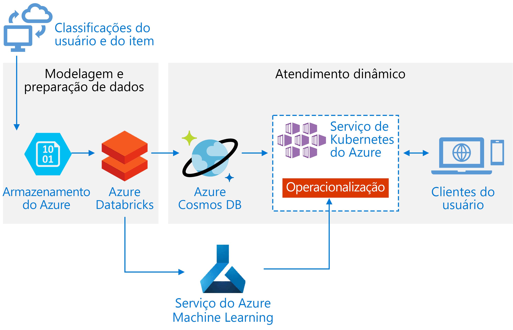
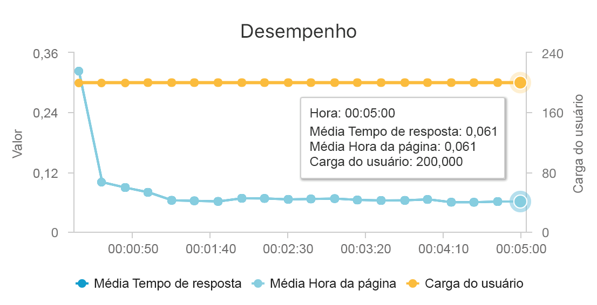
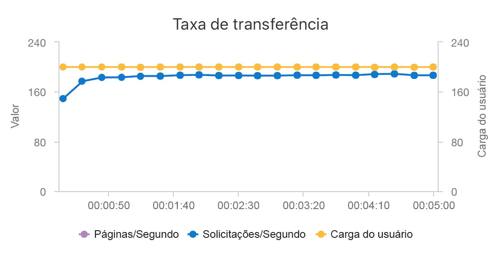

# Compilar uma API de recomendação em tempo real no Azure

Esta arquitetura de referência mostra como treinar um modelo de recomendação usando o Azure Databricks e implantá-lo como uma API usando o Azure Cosmos DB, o Azure Machine Learning e o AKS (Serviço de Kubernetes do Azure). Esta arquitetura pode ser adaptada para a maioria dos cenários de mecanismo de recomendação, incluindo recomendações de produtos, filmes e notícias.

Há uma implantação de referência para essa arquitetura de referência disponível no [GitHub][als-example].

**Cenário**: Uma organização de mídia deseja fornecer recomendações de vídeos ou filmes a seus usuários. Ao fornecer recomendações personalizadas, a organização atende a várias metas de negócios, incluindo maior taxa de cliques, maior participação no site e maior satisfação do usuário.

Esta arquitetura de referência é para treinar e implantar uma API de serviço de recomendação em tempo real que pode recomendar os 10 melhores filmes para cada usuário.

O fluxo de dados para o modelo de recomendação é o seguinte:

1. Acompanhar comportamentos do usuário. Por exemplo, um serviço de back-end pode registrar quando um usuário classifica um filme ou clica em um artigo de notícias ou produto.

2. Carregar os dados no Azure Databricks de uma [fonte de dados][data-source] disponível.

3. Preparar os dados e dividi-los em conjuntos de treinamento e teste para treinar o modelo. ([Este guia][guide] descreve opções para dividir os dados.)

4. Ajustar o modelo [Filtragem Colaborativa do Spark][als] aos dados.

5. Avaliar a qualidade do modelo usando métricas de classificação e priorização. ([Este guia][eval-guide] fornece detalhes sobre as métricas com as quais você pode avaliar suas recomendações.)

6. Calcular previamente as 10 principais recomendações por usuário e armazená-las como cache no Azure Cosmos DB.

7. Implantar um serviço de API no AKS usando as APIs do Azure Machine Learning para colocar a API em contêineres e implantá-la.

8. Quando o serviço de back-end recebe uma solicitação de um usuário, chamar a API de recomendações hospedada no AKS para obter as 10 principais recomendações e exibi-las para o usuário.

## Arquitetura

Esta arquitetura é formada pelos seguintes componentes:

[Azure Databricks][databricks]. O Databricks é um ambiente de desenvolvimento usado para preparar os dados de entrada e treinar o modelo de recomendação em um cluster Spark. O Azure Databricks também fornece um espaço de trabalho interativo para ser executado e colaborar em notebooks em caso de tarefas de processamento de dados ou de aprendizado de máquina.

[AKS][aks] (Serviço de Kubernetes do Azure). O AKS é usado para implantar e operacionalizar uma API de serviço do modelo de machine learning em um cluster do Kubernetes. O AKS hospeda o modelo em contêineres, fornecendo escalabilidade que atende a seus requisitos de taxa de transferência, gerenciamento de identidade e de acesso, registro em log e monitoramento de integridade.

[Azure Cosmos DB][cosmosdb]. O Cosmos DB é um serviço de banco de dados distribuído globalmente usado para armazenar os 10 principais filmes recomendados para cada usuário. O Azure Cosmos DB é adequado para o cenário porque oferece baixa latência (10 ms no 99º percentil) para ler os primeiros itens recomendados para determinado usuário.

[Serviço do Azure Machine Learning][mls]. Esse serviço é usado para controlar e gerenciar modelos de machine learning e, em seguida, empacotar e implantar esses modelos em um ambiente escalonável do AKS.

[Recomendações da Microsoft][github]. Esse repositório de software livre contém códigos de utilitários e exemplos para que os usuários possam começar a compilar, avaliar e operacionalizar um sistema de recomendação.

## Considerações sobre o desempenho

O desempenho é uma consideração essencial para obter recomendações em tempo real, porque as recomendações geralmente estão no caminho crítico da solicitação que um usuário faz em seu site.

A combinação do AKS com o Azure Cosmos DB permite que essa arquitetura forneça um bom ponto de partida para oferecer recomendações a uma carga de trabalho de médio porte com o mínimo de sobrecarga. Em um teste de carga com 200 usuários simultâneos, esta arquitetura fornece recomendações com uma média de latência de cerca de 60 ms e tem desempenho a uma taxa de transferência de 180 solicitações por segundo. O teste de carga foi executado com a configuração de implantação padrão (um cluster do AKS 3x D3 v2 com 12 vCPUs, 42 GB de memória e 11.000 [RUs (unidades de solicitação) por segundo][ru] provisionado para o Azure Cosmos DB).

O Azure Cosmos DB é recomendado por sua distribuição global turnkey e por sua utilidade em atender a todos os requisitos de banco de dados que seu aplicativo possa ter. Para uma [latência ligeiramente mais rápida][latency], considere usar o [Cache Redis do Azure][redis] em vez do Azure Cosmos DB para servir as pesquisas. O Cache Redis pode melhorar o desempenho de sistemas que dependem bastante de dados em armazenamentos de back-end.

## Considerações sobre escalabilidade

Se você não planeja usar o Spark ou tem uma carga de trabalho menor que não precisa de distribuição, considere usar a [DSVM][dsvm] (Máquina Virtual de Ciência de Dados) em vez do Azure Databricks. A DSVM é uma máquina virtual do Azure com estruturas e ferramentas de aprendizado profundo para aprendizado de máquina e ciência de dados. Da mesma forma que no Azure Databricks, qualquer modelo que você criar em uma DSVM poderá ser operacionalizado como um serviço no AKS por meio do Azure Machine Learning.

Durante o treinamento, provisione um cluster Spark de tamanho fixo maior no Azure Databricks ou configure o [dimensionamento automático][autoscaling]. Quando o dimensionamento automático estiver habilitado, o Databricks monitorará a carga no seu cluster e escalará e reduzirá verticalmente quando necessário. Provisione ou escale horizontalmente um cluster maior se você tiver uma quantidade grande de dados e desejar reduzir a quantidade de tempo que leva as tarefas de preparação ou modelagem de dados.

Dimensione o cluster do AKS para atender aos requisitos de desempenho e taxa de transferência. Aumente o número de [pods][scale] para utilizar totalmente o cluster e escale os [nós][nodes] do cluster para atender à demanda de seu serviço. Para obter mais informações sobre como dimensionar o cluster para atender a requisitos de desempenho e taxa de transferência do serviço de recomendação, confira [Escalando clusters do Serviço de Contêiner do Azure][blog].

Para gerenciar o desempenho do Azure Cosmos DB, estime o número de leituras por segundo e provisione o número necessário de [RUs por segundo][ru] (taxa de transferência). Use as melhores práticas de [particionamento e dimensionamento horizontal][partition-data].

## Considerações de custo

Os principais geradores de custo no cenário em questão são:

- O tamanho do cluster do Azure Databricks necessário para treinamento.
- O tamanho do cluster do AKS necessário para atender às necessidades de desempenho.
- As RUs do Azure Cosmos DB provisionadas para atender às necessidades de desempenho.

Gerencie os custos do Azure Databricks fazendo a readaptação com menor frequência e desligando o cluster Spark quando ele não estiver em uso. Os custos do AKS e do Azure Cosmos DB estão vinculados à taxa de transferência e ao desempenho exigidos pelo seu site e serão escalados e reduzidos verticalmente dependendo do volume do tráfego em seu site.

## Implantar a solução

Para implantar essa arquitetura, siga as **Azure Databricks** instruções o [documento de instalação][setup]. Em resumo, as instruções exigem que você:

1. Crie um [espaço de trabalho do Azure Databricks][workspace].

1. Crie um novo cluster com a seguinte configuração no Azure Databricks:

    - Modo de cluster: Standard
    - Versão do Databricks Runtime: 4.3 (inclui Apache Spark 2.3.1, Scala 2.11)
    - Versão do Python: 3
    - Tipo de driver: Standard\_DS3\_v2
    - Tipo de trabalho: Standard\_DS3\_v2 (mínimo e máximo conforme necessário)
    - Término obrigatório: (conforme necessário)
    - Configuração do Spark: (conforme necessário)
    - Variáveis de ambiente: (conforme necessário)

1. Criar um token de acesso pessoal dentro do [espaço de trabalho do Azure Databricks][workspace]. Consulte a autenticação do Azure Databricks [documentação] [ adbauthentication] para obter detalhes.

1. Clone o [Microsoft Recommenders] [ github] repositório em um ambiente em que você pode executar scripts (por exemplo, seu computador local).

1. Siga as **instalação rápida** instruções de configuração [instalar as bibliotecas relevantes] [ setup] no Azure Databricks.

1. Siga as **instalação rápida** instruções de configuração [preparar o Azure Databricks para operacionalização][setupo16n].

1. Importar o [bloco de anotações de operacionalização de filme ALS] [ als-example] em seu espaço de trabalho. Após fazer logon no seu espaço de trabalho do Databricks do Azure, faça o seguinte:

     a. Clique em **Home** no lado esquerdo do espaço de trabalho.

    b. Clique com botão direito no espaço em branco em seu diretório base. Selecione **Importar**.

    c. Selecione **URL**e cole o seguinte no campo de texto: `https://github.com/Microsoft/Recommenders/blob/master/notebooks/05_operationalize/als_movie_o16n.ipynb`

    d. Clique em **Importar**.

1. Abra o bloco de notas no Databricks do Azure e anexe o cluster configurado.

1. Execute o bloco de anotações para criar os recursos do Azure necessários para criar uma API de recomendação que fornece as recomendações de filmes de 10 principais para um determinado usuário.

## Arquiteturas relacionadas

Também criamos uma arquitetura de referência que usa o Spark e Azure Databricks para executar os [processos de pontuação em lote agendados][batch-scoring]. Consulte essa arquitetura de referência para entender uma abordagem recomendada para gerar novas recomendações periodicamente.

<!-- links -->
[aci]: /azure/container-instances/container-instances-overview
[aad]: /azure/active-directory-b2c/active-directory-b2c-overview
[adbauthentication]: https://docs.azuredatabricks.net/api/latest/authentication.html#generate-a-token
[aks]: /azure/aks/intro-kubernetes
[als]: https://spark.apache.org/docs/latest/ml-collaborative-filtering.html
[als-example]: https://github.com/Microsoft/Recommenders/blob/master/notebooks/05_operationalize/als_movie_o16n.ipynb
[autoscaling]: https://docs.azuredatabricks.net/user-guide/clusters/sizing.html
[autoscale]: https://docs.azuredatabricks.net/user-guide/clusters/sizing.html#autoscaling
[availability]: /azure/architecture/checklist/availability
[batch-scoring]: /azure/architecture/reference-architectures/ai/batch-scoring-databricks
[blob]: /azure/storage/blobs/storage-blobs-introduction
[blog]: https://blogs.technet.microsoft.com/machinelearning/2018/03/20/scaling-azure-container-service-cluster/
[clusters]: https://docs.azuredatabricks.net/user-guide/clusters/configure.html
[cosmosdb]: /azure/cosmos-db/introduction
[data-source]: https://docs.azuredatabricks.net/spark/latest/data-sources/index.html
[databricks]: /azure/azure-databricks/what-is-azure-databricks
[dsvm]: /azure/machine-learning/data-science-virtual-machine/overview
[dsvm-ubuntu]: /azure/machine-learning/data-science-virtual-machine/dsvm-ubuntu-intro
[eval-guide]: https://github.com/Microsoft/Recommenders/blob/master/notebooks/03_evaluate/evaluation.ipynb
[free]: https://azure.microsoft.com/free/?WT.mc_id=A261C142F
[github]: https://github.com/Microsoft/Recommenders
[guide]: https://github.com/Microsoft/Recommenders/blob/master/notebooks/01_prepare_data/data_split.ipynb
[latency]: https://github.com/jessebenson/azure-performance
[mls]: /azure/machine-learning/service/
[n-tier]: /azure/architecture/reference-architectures/n-tier/n-tier-cassandra
[ndcg]: https://en.wikipedia.org/wiki/Discounted_cumulative_gain
[nodes]: /azure/aks/scale-cluster
[notebook]: https://github.com/Microsoft/Recommenders/notebooks/00_quick_start/als_pyspark_movielens.ipynb
[partition-data]: /azure/cosmos-db/partition-data
[redis]: /azure/redis-cache/cache-overview
[regions]: https://azure.microsoft.com/global-infrastructure/services/?products=virtual-machines&regions=all
[resiliency]: /azure/architecture/resiliency/
[ru]: /azure/cosmos-db/request-units
[sec-docs]: /azure/security/
[setup]: https://github.com/Microsoft/Recommenders/blob/master/SETUP.md#repository-installation
[setupo16n]: https://github.com/Microsoft/Recommenders/blob/master/SETUP.md#prepare-azure-databricks-for-operationalization
[scale]: /azure/aks/tutorial-kubernetes-scale
[sla]: https://azure.microsoft.com/support/legal/sla/virtual-machines/v1_8/
[vm-size]: /azure/virtual-machines/virtual-machines-linux-change-vm-size
[workspace]: https://docs.azuredatabricks.net/getting-started/index.html
